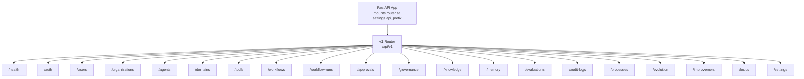
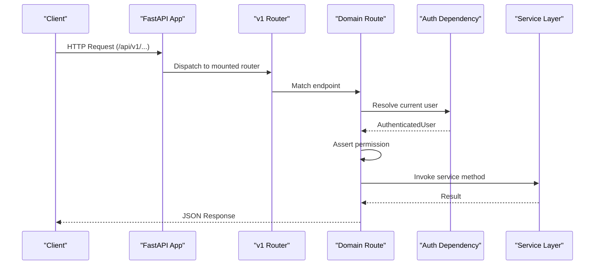
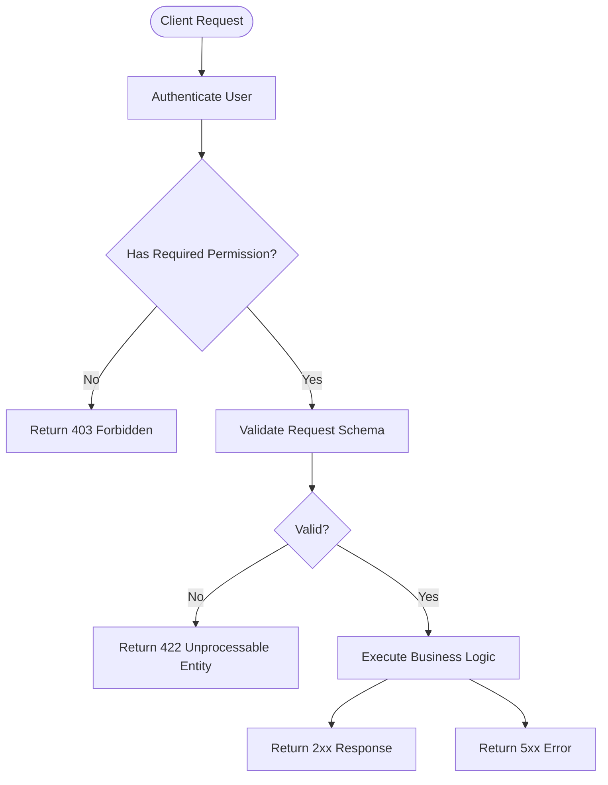
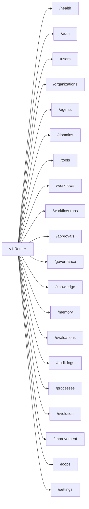

# API Reference

<cite>
**Referenced Files in This Document**
- [main.py](file://backend/app/main.py)
- [router.py](file://backend/app/api/v1/router.py)
- [agents.py](file://backend/app/api/v1/routes/agents.py)
- [workflows.py](file://backend/app/api/v1/routes/workflows.py)
- [memory.py](file://backend/app/api/v1/routes/memory.py)
</cite>

## Table of Contents
1. [Introduction](#introduction)
2. [Project Structure](#project-structure)
3. [Core Components](#core-components)
4. [Architecture Overview](#architecture-overview)
5. [Detailed Component Analysis](#detailed-component-analysis)
6. [Dependency Analysis](#dependency-analysis)
7. [Performance Considerations](#performance-considerations)
8. [Troubleshooting Guide](#troubleshooting-guide)
9. [Conclusion](#conclusion)
10. [Appendices](#appendices)

## Introduction
This document provides comprehensive API documentation for all REST endpoints under the /api/v1/ base path. It covers HTTP methods, URL patterns, request/response schemas, authentication and authorization requirements, error handling, rate limiting, and practical client implementation guidance. Where applicable, it also addresses streaming and real-time features via WebSocket connections.

The API is built with FastAPI and exposes domain-specific resources including agents, workflows, memory, knowledge, evaluations, and administration endpoints. Authentication is enforced at the route level using a dependency that resolves an authenticated user context, and permissions are asserted per endpoint.

## Project Structure
At runtime, the application mounts the v1 router under the configured API prefix (defaulting to /api/v1). The top-level router aggregates multiple domain routers, each responsible for a specific resource area.

**Diagram sources**
- [main.py:16-52](file://backend/app/main.py#L16-L52)
- [router.py:1-47](file://backend/app/api/v1/router.py#L1-L47)

**Section sources**
- [main.py:16-52](file://backend/app/main.py#L16-L52)
- [router.py:1-47](file://backend/app/api/v1/router.py#L1-L47)

## Core Components
- Authentication and Authorization
  - All protected endpoints require a valid session or token resolved by the current-user dependency.
  - Each endpoint asserts a permission scope (e.g., "agents:read", "workflows:write") before executing business logic.
- Request Context and Security Headers
  - A global middleware injects request IDs, measures latency, records metrics, and sets security headers on responses.
- Rate Limiting
  - Certain write endpoints (notably workflow mutations) can be rate-limited based on configuration.

Key behaviors:
- Requests include X-Request-ID for tracing; responses echo this header back.
- CORS is enabled with configurable allowed origins and credentials.
- OpenAPI schema is exposed at {api_prefix}/openapi.json.

**Section sources**
- [main.py:16-52](file://backend/app/main.py#L16-L52)
- [router.py:1-47](file://backend/app/api/v1/router.py#L1-L47)

## Architecture Overview
The API follows a layered design:
- Routes define HTTP endpoints and validate inputs via Pydantic models.
- Dependencies enforce authentication and permissions.
- Services encapsulate business logic and orchestrate data access.
- Infrastructure components provide persistence, queues, vector stores, and integrations.

[No sources needed since this diagram shows conceptual workflow, not actual code structure]

## Detailed Component Analysis

### Agents API
Base path: /api/v1/agents

Endpoints:
- GET /api/v1/agents
  - Description: List agents for the current user.
  - Authentication: Required.
  - Permissions: agents:read.
  - Query Parameters: None.
  - Response: Array of agent objects.
- POST /api/v1/agents
  - Description: Create a new agent.
  - Authentication: Required.
  - Request Body: AgentCreateRequest.
  - Response: Created agent object.
- GET /api/v1/agents/{agent_id}
  - Description: Retrieve a specific agent.
  - Authentication: Required.
  - Path Parameters: agent_id (string).
  - Permissions: agents:read.
  - Response: Agent object.
- PATCH /api/v1/agents/{agent_id}
  - Description: Update agent status.
  - Authentication: Required.
  - Path Parameters: agent_id (string).
  - Request Body: StatusUpdateRequest (status field).
  - Response: Updated agent object.
- DELETE /api/v1/agents/{agent_id}
  - Description: Archive an agent.
  - Authentication: Required.
  - Path Parameters: agent_id (string).
  - Response: Confirmation object.
- GET /api/v1/agents/{agent_id}/activity
  - Description: Get activity log for an agent.
  - Authentication: Required.
  - Path Parameters: agent_id (string).
  - Permissions: agents:read.
  - Response: Array of activity entries.
- GET /api/v1/agents/{agent_id}/tools
  - Description: List tools associated with an agent.
  - Authentication: Required.
  - Path Parameters: agent_id (string).
  - Permissions: agents:read.
  - Response: Array of tool descriptors.

Authentication and Authorization:
- All endpoints require a valid authenticated user.
- Read operations assert agents:read permission.

Request/Response Schemas:
- AgentCreateRequest: Fields defined in schemas.agents.
- StatusUpdateRequest: Contains a status field (string).
- Responses return structured JSON objects representing agents and related entities.

Example Calls:
- List agents:
  - curl -X GET https://host/api/v1/agents -H "Authorization: Bearer <token>"
- Create agent:
  - curl -X POST https://host/api/v1/agents -H "Authorization: Bearer <token>" -H "Content-Type: application/json" -d '{"name":"...","description":"..."}'
- Update agent status:
  - curl -X PATCH https://host/api/v1/agents/<agent_id> -H "Authorization: Bearer <token>" -H "Content-Type: application/json" -d '{"status":"active"}'

Error Codes:
- 401 Unauthorized: Missing or invalid authentication.
- 403 Forbidden: Insufficient permissions (e.g., missing agents:read).
- 404 Not Found: Resource does not exist.
- 422 Unprocessable Entity: Validation errors in request body.
- 5xx Server Error: Unexpected server-side failures.

Rate Limiting:
- No explicit rate limit applied to agents endpoints in the provided routes.

WebSocket/Streaming:
- No WebSocket or streaming endpoints defined for agents in the provided routes.

**Section sources**
- [agents.py:1-48](file://backend/app/api/v1/routes/agents.py#L1-L48)

### Workflows API
Base path: /api/v1/workflows

Endpoints:
- GET /api/v1/workflows
  - Description: List workflows for the current user.
  - Authentication: Required.
  - Permissions: workflows:read.
  - Response: Array of workflow objects.
- GET /api/v1/workflows/{workflow_id}
  - Description: Retrieve a specific workflow.
  - Authentication: Required.
  - Path Parameters: workflow_id (string).
  - Permissions: workflows:read.
  - Response: Workflow object.
- POST /api/v1/workflows
  - Description: Create a new workflow.
  - Authentication: Required.
  - Request Body: WorkflowCreateRequest.
  - Rate Limiting: Applies if enabled.
  - Response: Created workflow object.
- PATCH /api/v1/workflows/{workflow_id}
  - Description: Update a workflow.
  - Authentication: Required.
  - Path Parameters: workflow_id (string).
  - Request Body: WorkflowUpdateRequest (partial fields).
  - Rate Limiting: Applies if enabled.
  - Response: Updated workflow object.
- POST /api/v1/workflows/{workflow_id}/versions
  - Description: Add a new version to a workflow.
  - Authentication: Required.
  - Path Parameters: workflow_id (string).
  - Request Body: WorkflowVersionCreateRequest.
  - Rate Limiting: Applies if enabled.
  - Response: New version object.
- GET /api/v1/workflows/{workflow_id}/versions
  - Description: List versions of a workflow.
  - Authentication: Required.
  - Path Parameters: workflow_id (string).
  - Permissions: workflows:read.
  - Response: Array of version objects.
- POST /api/v1/workflows/{workflow_id}/activate/{version}
  - Description: Activate a specific version.
  - Authentication: Required.
  - Path Parameters: workflow_id (string), version (string).
  - Rate Limiting: Applies if enabled.
  - Response: Activation result.
- POST /api/v1/workflows/{workflow_id}/activate
  - Description: Activate a version specified in the payload.
  - Authentication: Required.
  - Path Parameters: workflow_id (string).
  - Request Body: WorkflowVersionCreateRequest (contains version).
  - Rate Limiting: Applies if enabled.
  - Response: Activation result.
- POST /api/v1/workflows/{workflow_id}/disable
  - Description: Disable a workflow.
  - Authentication: Required.
  - Path Parameters: workflow_id (string).
  - Rate Limiting: Applies if enabled.
  - Response: Disabling result.
- DELETE /api/v1/workflows/{workflow_id}
  - Description: Archive a workflow.
  - Authentication: Required.
  - Path Parameters: workflow_id (string).
  - Rate Limiting: Applies if enabled.
  - Response: Archival confirmation.
- POST /api/v1/workflows/{workflow_id}/run
  - Description: Start a workflow run.
  - Authentication: Required.
  - Path Parameters: workflow_id (string).
  - Request Body: WorkflowStartRequest (input_payload).
  - Header: Idempotency-Key (optional string).
  - Rate Limiting: Applies if enabled.
  - Response: Run initiation result.
- POST /api/v1/workflows/{workflow_id}/runs
  - Description: Alias for starting a workflow run.
  - Authentication: Required.
  - Path Parameters: workflow_id (string).
  - Request Body: WorkflowStartRequest (input_payload).
  - Header: Idempotency-Key (optional string).
  - Rate Limiting: Applies if enabled.
  - Response: Run initiation result.

Authentication and Authorization:
- All endpoints require a valid authenticated user.
- Read operations assert workflows:read permission.

Request/Response Schemas:
- WorkflowCreateRequest, WorkflowUpdateRequest, WorkflowVersionCreateRequest, WorkflowStartRequest: Defined in schemas.common.
- Responses return structured JSON objects representing workflows, versions, and runs.

Idempotency:
- Optional Idempotency-Key header supports idempotent run creation.

Rate Limiting:
- Write endpoints may be rate-limited based on settings.workflow_write_rate_limit_per_minute when rate limiting is enabled.

Example Calls:
- Create workflow:
  - curl -X POST https://host/api/v1/workflows -H "Authorization: Bearer <token>" -H "Content-Type: application/json" -d '{"name":"...","definition":{...}}'
- Start run:
  - curl -X POST https://host/api/v1/workflows/<workflow_id>/run -H "Authorization: Bearer <token>" -H "Content-Type: application/json" -H "Idempotency-Key: <unique-key>" -d '{"input_payload":{...}}'

Error Codes:
- 401 Unauthorized: Missing or invalid authentication.
- 403 Forbidden: Insufficient permissions (e.g., missing workflows:read).
- 404 Not Found: Resource does not exist.
- 422 Unprocessable Entity: Validation errors in request body.
- 429 Too Many Requests: Rate limit exceeded (when enabled).
- 5xx Server Error: Unexpected server-side failures.

WebSocket/Streaming:
- No WebSocket or streaming endpoints defined for workflows in the provided routes.

**Section sources**
- [workflows.py:1-76](file://backend/app/api/v1/routes/workflows.py#L1-L76)

### Memory API
Base path: /api/v1/memory

Endpoints:
- GET /api/v1/memory
  - Description: Search memory entries with optional filters.
  - Authentication: Required.
  - Query Parameters:
    - query (string, optional): Free-text search term.
    - scope (string, optional): Scope filter.
    - acting_agent_id (string, optional): Filter by acting agent.
  - Permissions: memory:read.
  - Response: Array of memory entries.
- POST /api/v1/memory
  - Description: Create a new memory entry.
  - Authentication: Required.
  - Request Body: MemoryCreateRequest.
  - Response: Created memory object.
- GET /api/v1/memory/{memory_id}
  - Description: Retrieve a specific memory entry.
  - Authentication: Required.
  - Path Parameters: memory_id (string).
  - Permissions: memory:read.
  - Response: Memory object.
- PATCH /api/v1/memory/{memory_id}
  - Description: Update a memory entry (partial fields).
  - Authentication: Required.
  - Path Parameters: memory_id (string).
  - Request Body: MemoryUpdateRequest (fields to update).
  - Response: Updated memory object.
- DELETE /api/v1/memory/{memory_id}
  - Description: Delete a memory entry.
  - Authentication: Required.
  - Path Parameters: memory_id (string).
  - Response: Deletion confirmation.
- POST /api/v1/memory/search
  - Description: Search memory entries with a structured request body.
  - Authentication: Required.
  - Request Body: MemorySearchRequest (query, scope, acting_agent_id).
  - Permissions: memory:read.
  - Response: Array of memory entries.

Authentication and Authorization:
- All endpoints require a valid authenticated user.
- Read operations assert memory:read permission.

Request/Response Schemas:
- MemoryCreateRequest, MemoryUpdateRequest, MemorySearchRequest: Defined in schemas.common.
- Responses return structured JSON objects representing memory entries.

Example Calls:
- Search memory:
  - curl -X GET "https://host/api/v1/memory?query=example&scope=default" -H "Authorization: Bearer <token>"
- Create memory:
  - curl -X POST https://host/api/v1/memory -H "Authorization: Bearer <token>" -H "Content-Type: application/json" -d '{"content":"...","scope":"default"}'
- Structured search:
  - curl -X POST https://host/api/v1/memory/search -H "Authorization: Bearer <token>" -H "Content-Type: application/json" -d '{"query":"example","scope":"default","acting_agent_id":"agent-id"}'

Error Codes:
- 401 Unauthorized: Missing or invalid authentication.
- 403 Forbidden: Insufficient permissions (e.g., missing memory:read).
- 404 Not Found: Resource does not exist.
- 422 Unprocessable Entity: Validation errors in request body.
- 5xx Server Error: Unexpected server-side failures.

WebSocket/Streaming:
- No WebSocket or streaming endpoints defined for memory in the provided routes.

**Section sources**
- [memory.py:1-48](file://backend/app/api/v1/routes/memory.py#L1-L48)

### Conceptual Overview
The following conceptual diagrams illustrate typical flows across domains without mapping to specific source files.

[No sources needed since this diagram shows conceptual workflow, not actual code structure]

## Dependency Analysis
The v1 router composes multiple domain routers. Each domain router defines its own endpoints and dependencies.

**Diagram sources**
- [router.py:1-47](file://backend/app/api/v1/router.py#L1-L47)

**Section sources**
- [router.py:1-47](file://backend/app/api/v1/router.py#L1-L47)

## Performance Considerations
- Rate Limiting:
  - Workflow write endpoints support configurable rate limiting. Ensure clients implement retry-with-backoff strategies when encountering 429 responses.
- Idempotency:
  - Use Idempotency-Key header for workflow runs to avoid duplicate executions during retries.
- Pagination and Filtering:
  - For large datasets (e.g., memory search), use query parameters to narrow results and reduce payload sizes.
- Observability:
  - Leverage X-Request-ID for correlating logs and metrics across services.

[No sources needed since this section provides general guidance]

## Troubleshooting Guide
Common issues and resolutions:
- 401 Unauthorized:
  - Ensure Authorization header contains a valid bearer token or session cookie as configured.
- 403 Forbidden:
  - Verify the user has required permissions (e.g., agents:read, workflows:read).
- 404 Not Found:
  - Confirm resource identifiers (agent_id, workflow_id, memory_id) are correct and accessible.
- 422 Unprocessable Entity:
  - Check request body against expected schemas; ensure required fields are present and correctly typed.
- 429 Too Many Requests:
  - Respect rate limits; implement exponential backoff and jitter for retries.
- 5xx Server Errors:
  - Inspect server logs using X-Request-ID; check downstream dependencies (database, vector store, queue).

**Section sources**
- [main.py:16-52](file://backend/app/main.py#L16-L52)

## Conclusion
The /api/v1/ API provides a comprehensive set of REST endpoints for managing agents, workflows, memory, and other domain resources. Authentication and authorization are enforced consistently, with optional rate limiting and idempotency support for critical operations. Clients should handle standard HTTP error codes, respect rate limits, and utilize request tracing headers for observability.

[No sources needed since this section summarizes without analyzing specific files]

## Appendices

### Authentication and Authorization
- Authentication:
  - All protected endpoints require a valid authenticated user resolved by the current-user dependency.
- Authorization:
  - Endpoints assert permission scopes such as agents:read, workflows:read, memory:read.
- Tokens/Cookies:
  - Configure your client to send Authorization headers or cookies as appropriate for your deployment.

**Section sources**
- [agents.py:1-48](file://backend/app/api/v1/routes/agents.py#L1-L48)
- [workflows.py:1-76](file://backend/app/api/v1/routes/workflows.py#L1-L76)
- [memory.py:1-48](file://backend/app/api/v1/routes/memory.py#L1-L48)

### Streaming and Real-Time Features
- Current State:
  - No WebSocket or streaming endpoints are defined in the analyzed routes for agents, workflows, or memory.
- Future Considerations:
  - If streaming is introduced, expect dedicated endpoints under respective domains (e.g., /api/v1/workflows/{id}/stream) with appropriate authentication and permission checks.

[No sources needed since this section doesn't analyze specific files]