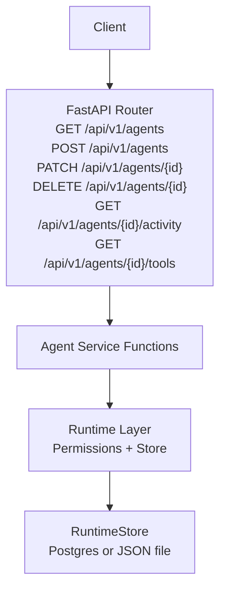
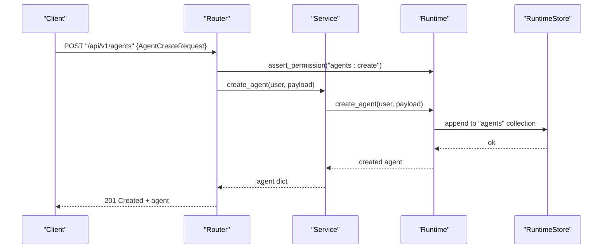
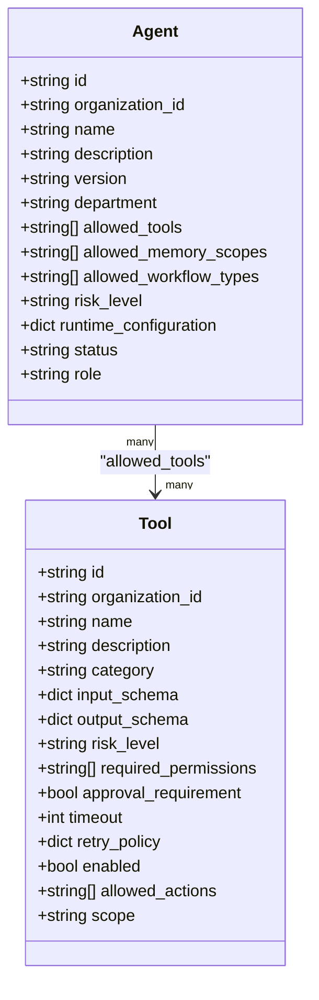
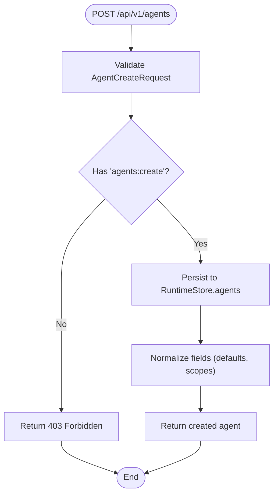
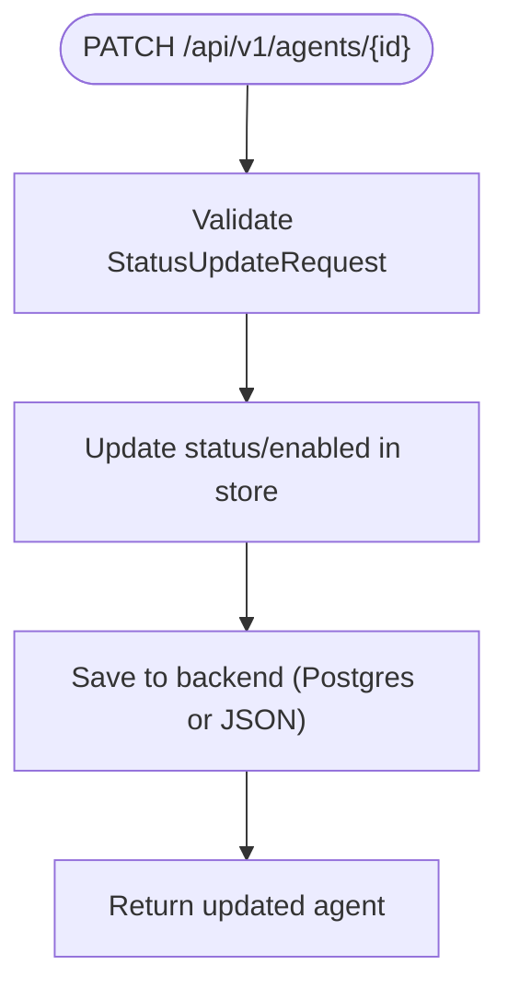
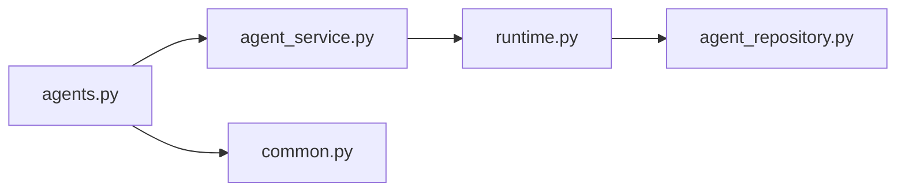

# Agents Management API

<cite>
**Referenced Files in This Document**
- [agents.py](file://backend/app/api/v1/routes/agents.py)
- [agent_service.py](file://backend/app/services/agent_service.py)
- [runtime.py](file://backend/app/runtime.py)
- [common.py](file://backend/app/schemas/common.py)
- [agent_repository.py](file://backend/app/infrastructure/repositories/agent_repository.py)
</cite>

## Table of Contents
1. [Introduction](#introduction)
2. [Project Structure](#project-structure)
3. [Core Components](#core-components)
4. [Architecture Overview](#architecture-overview)
5. [Detailed Component Analysis](#detailed-component-analysis)
6. [Dependency Analysis](#dependency-analysis)
7. [Performance Considerations](#performance-considerations)
8. [Troubleshooting Guide](#troubleshooting-guide)
9. [Conclusion](#conclusion)

## Introduction
This document provides detailed API documentation for agent lifecycle management endpoints. It covers agent creation, configuration updates, status management, tool assignment, and memory scoping. It also includes request/response schemas for agent definitions, tool adapters, and permission models, along with examples for registration, dynamic configuration updates, and runtime state monitoring. Additional sections address isolation patterns, resource allocation, and performance metrics collection.

## Project Structure
The agent management functionality is implemented as a FastAPI router that delegates to service functions, which in turn call into the runtime layer. The runtime layer manages persistent collections (agents, tools, workflows, etc.) and enforces permissions.

**Diagram sources**
- [agents.py:11-47](file://backend/app/api/v1/routes/agents.py#L11-L47)
- [agent_service.py:4-29](file://backend/app/services/agent_service.py#L4-L29)
- [runtime.py:258-392](file://backend/app/runtime.py#L258-L392)

**Section sources**
- [agents.py:1-48](file://backend/app/api/v1/routes/agents.py#L1-L48)
- [agent_service.py:1-30](file://backend/app/services/agent_service.py#L1-L30)
- [runtime.py:258-392](file://backend/app/runtime.py#L258-L392)

## Core Components
- API Router: Defines REST endpoints for agents and their sub-resources.
- Agent Service: Thin orchestration layer delegating to runtime methods.
- Runtime Layer: Central authority for persistence, bootstrapping, normalization, and permission checks.
- Schemas: Pydantic models defining request bodies and common responses.

Key responsibilities:
- Enforce RBAC via runtime.assert_permission before executing operations.
- Persist agent records and related metadata using RuntimeStore.
- Provide read-only accessors for activity and tool assignments.

**Section sources**
- [agents.py:11-47](file://backend/app/api/v1/routes/agents.py#L11-L47)
- [agent_service.py:4-29](file://backend/app/services/agent_service.py#L4-L29)
- [runtime.py:140-222](file://backend/app/runtime.py#L140-L222)
- [common.py:69-104](file://backend/app/schemas/common.py#L69-L104)

## Architecture Overview
The agent APIs follow a layered architecture:
- Presentation: FastAPI routes validate requests and enforce permissions.
- Application: Service functions coordinate calls to runtime capabilities.
- Domain/Runtime: Runtime handles data access, normalization, and policy enforcement.

**Diagram sources**
- [agents.py:17-19](file://backend/app/api/v1/routes/agents.py#L17-L19)
- [agent_service.py:12-13](file://backend/app/services/agent_service.py#L12-L13)
- [runtime.py:258-392](file://backend/app/runtime.py#L258-L392)

## Detailed Component Analysis

### Endpoints

#### List Agents
- Method: GET
- Path: /api/v1/agents
- Description: Returns all agents visible to the current user.
- Authentication: Required (RBAC).
- Permissions: agents:read
- Request Body: None
- Response: Array of agent objects
- Notes: Results are filtered by organization context enforced at the runtime layer.

**Section sources**
- [agents.py:11-14](file://backend/app/api/v1/routes/agents.py#L11-L14)
- [agent_service.py:4-5](file://backend/app/services/agent_service.py#L4-L5)
- [runtime.py:140-222](file://backend/app/runtime.py#L140-L222)

#### Create Agent
- Method: POST
- Path: /api/v1/agents
- Description: Registers a new agent with initial configuration.
- Authentication: Required (RBAC).
- Permissions: agents:create
- Request Body: AgentCreateRequest
- Response: Created agent object
- Validation: Performed by Pydantic model; additional business rules may be enforced by runtime.

**Section sources**
- [agents.py:17-19](file://backend/app/api/v1/routes/agents.py#L17-L19)
- [agent_service.py:12-13](file://backend/app/services/agent_service.py#L12-L13)
- [common.py:69-82](file://backend/app/schemas/common.py#L69-L82)

#### Get Agent Details
- Method: GET
- Path: /api/v1/agents/{agent_id}
- Description: Retrieves details for a specific agent.
- Authentication: Required (RBAC).
- Permissions: agents:read
- Path Parameters: agent_id (string)
- Response: Agent object

**Section sources**
- [agents.py:22-25](file://backend/app/api/v1/routes/agents.py#L22-L25)
- [agent_service.py:8-9](file://backend/app/services/agent_service.py#L8-L9)
- [runtime.py:140-222](file://backend/app/runtime.py#L140-L222)

#### Update Agent Status
- Method: PATCH
- Path: /api/v1/agents/{agent_id}
- Description: Updates agent status and/or enabled flag.
- Authentication: Required (RBAC).
- Permissions: agents:update
- Path Parameters: agent_id (string)
- Request Body: StatusUpdateRequest
- Response: Updated agent object

**Section sources**
- [agents.py:28-30](file://backend/app/api/v1/routes/agents.py#L28-L30)
- [agent_service.py:16-17](file://backend/app/services/agent_service.py#L16-L17)
- [common.py:101-104](file://backend/app/schemas/common.py#L101-L104)

#### Archive Agent
- Method: DELETE
- Path: /api/v1/agents/{agent_id}
- Description: Archives an agent (soft delete).
- Authentication: Required (RBAC).
- Permissions: agents:update
- Path Parameters: agent_id (string)
- Response: Archived agent object

**Section sources**
- [agents.py:33-35](file://backend/app/api/v1/routes/agents.py#L33-L35)
- [agent_service.py:20-21](file://backend/app/services/agent_service.py#L20-L21)

#### Agent Activity
- Method: GET
- Path: /api/v1/agents/{agent_id}/activity
- Description: Returns recent activity entries for an agent.
- Authentication: Required (RBAC).
- Permissions: agents:read
- Path Parameters: agent_id (string)
- Response: Array of activity entries

**Section sources**
- [agents.py:38-41](file://backend/app/api/v1/routes/agents.py#L38-L41)
- [agent_service.py:24-25](file://backend/app/services/agent_service.py#L24-L25)

#### Agent Tools
- Method: GET
- Path: /api/v1/agents/{agent_id}/tools
- Description: Lists tools assigned to an agent.
- Authentication: Required (RBAC).
- Permissions: agents:read
- Path Parameters: agent_id (string)
- Response: Array of tool descriptors

**Section sources**
- [agents.py:44-47](file://backend/app/api/v1/routes/agents.py#L44-L47)
- [agent_service.py:28-29](file://backend/app/services/agent_service.py#L28-L29)

### Request and Response Schemas

#### AgentCreateRequest
- id: string (required)
- name: string (required)
- description: string | null
- version: string (default "1.0.0")
- department: string (default "general")
- allowed_tools: list[string] (default [])
- allowed_memory_scopes: list[string] (default [])
- allowed_workflow_types: list[string] (default [])
- risk_level: string (default "tier_2_draft")
- runtime_configuration: dict[string, any] (default {})
- status: string (default "draft")
- role: string (default "execution")

Notes:
- allowed_memory_scopes controls which memory namespaces the agent can access.
- allowed_workflow_types constrains workflow execution categories.
- runtime_configuration is a free-form dictionary for agent-specific settings.

**Section sources**
- [common.py:69-82](file://backend/app/schemas/common.py#L69-L82)

#### ToolCreateRequest
- id: string (required)
- name: string (required)
- description: string | null
- category: string (default "internal_api")
- input_schema: dict (default {"type": "object"})
- output_schema: dict (default {"type": "object"})
- risk_level: string (default "tier_2_draft")
- required_permissions: list[string] (default ["workflows:execute"])
- approval_requirement: boolean (default false)
- timeout: integer (default 30)
- retry_policy: dict (default {"max_retries": 1})
- enabled: boolean (default true)
- allowed_actions: list[string] (default [])
- scope: string (default "custom")

Notes:
- approval_requirement indicates whether human gate is needed for this tool.
- allowed_actions enumerates permitted actions for fine-grained control.

**Section sources**
- [common.py:84-99](file://backend/app/schemas/common.py#L84-L99)

#### StatusUpdateRequest
- status: string | null
- enabled: boolean | null

Notes:
- If status is omitted, default behavior may set it to "draft" depending on route logic.

**Section sources**
- [common.py:101-104](file://backend/app/schemas/common.py#L101-L104)

#### Permission Model
- Roles and permissions are defined centrally and enforced via runtime.assert_permission.
- Example roles include owner, admin, manager, operator, reviewer, viewer, service_account.
- Relevant permissions for agents: agents:read, agents:create, agents:update.

**Section sources**
- [runtime.py:140-222](file://backend/app/runtime.py#L140-L222)

### Examples

#### Register a New Agent
- Endpoint: POST /api/v1/agents
- Headers: Authorization: Bearer <token>
- Body: AgentCreateRequest
- Success Response: 201 Created with agent object
- Error Responses:
  - 401 Unauthorized if token missing/invalid
  - 403 Forbidden if insufficient permissions
  - 422 Unprocessable Entity if validation fails

[No sources needed since this section provides usage guidance without analyzing specific files]

#### Dynamic Configuration Update
- Endpoint: PATCH /api/v1/agents/{agent_id}
- Headers: Authorization: Bearer <token>
- Body: StatusUpdateRequest
- Success Response: 200 OK with updated agent
- Notes: Use runtime_configuration field in AgentCreateRequest to set initial config; subsequent updates may require custom endpoints beyond status/enabled.

[No sources needed since this section provides usage guidance without analyzing specific files]

#### Monitor Runtime State
- Endpoint: GET /api/v1/agents/{agent_id}/activity
- Headers: Authorization: Bearer <token>
- Success Response: 200 OK with array of activity entries
- Notes: Activity entries reflect recent operations performed by or associated with the agent.

[No sources needed since this section provides usage guidance without analyzing specific files]

### Data Models and Relationships

**Diagram sources**
- [runtime.py:438-517](file://backend/app/runtime.py#L438-L517)
- [common.py:69-99](file://backend/app/schemas/common.py#L69-L99)

### Processing Logic

#### Agent Creation Flow

**Diagram sources**
- [agents.py:17-19](file://backend/app/api/v1/routes/agents.py#L17-L19)
- [agent_service.py:12-13](file://backend/app/services/agent_service.py#L12-L13)
- [runtime.py:258-392](file://backend/app/runtime.py#L258-L392)

#### Status Update Flow

**Diagram sources**
- [agents.py:28-30](file://backend/app/api/v1/routes/agents.py#L28-L30)
- [agent_service.py:16-17](file://backend/app/services/agent_service.py#L16-L17)
- [runtime.py:370-384](file://backend/app/runtime.py#L370-L384)

## Dependency Analysis
The agent module depends on:
- FastAPI router for HTTP handling
- Service layer for orchestration
- Runtime layer for persistence and authorization
- Pydantic schemas for validation

**Diagram sources**
- [agents.py:1-48](file://backend/app/api/v1/routes/agents.py#L1-L48)
- [agent_service.py:1-30](file://backend/app/services/agent_service.py#L1-L30)
- [runtime.py:258-392](file://backend/app/runtime.py#L258-L392)
- [agent_repository.py:1-6](file://backend/app/infrastructure/repositories/agent_repository.py#L1-L6)
- [common.py:69-104](file://backend/app/schemas/common.py#L69-L104)

**Section sources**
- [agents.py:1-48](file://backend/app/api/v1/routes/agents.py#L1-L48)
- [agent_service.py:1-30](file://backend/app/services/agent_service.py#L1-L30)
- [runtime.py:258-392](file://backend/app/runtime.py#L258-L392)
- [agent_repository.py:1-6](file://backend/app/infrastructure/repositories/agent_repository.py#L1-L6)
- [common.py:69-104](file://backend/app/schemas/common.py#L69-L104)

## Performance Considerations
- Persistence Backend: RuntimeStore supports Postgres (JSONB) with JSON fallback. Prefer Postgres for concurrent writes and durability.
- Locking: RuntimeStore uses a reentrant lock around save operations to prevent corruption under concurrency.
- Normalization: Bootstrapping and normalization ensure consistent defaults and unioned scopes, reducing downstream validation overhead.
- Read Paths: Listing and detail endpoints are simple reads; consider caching frequently accessed agent metadata if needed.

Recommendations:
- Enable Postgres for production deployments.
- Batch updates where possible to reduce write contention.
- Monitor storage backend latency and adjust timeouts accordingly.

**Section sources**
- [runtime.py:258-392](file://backend/app/runtime.py#L258-L392)

## Troubleshooting Guide
Common issues and resolutions:
- 401 Unauthorized: Ensure valid Authorization header with a bearer token mapped to a known user.
- 403 Forbidden: Verify the authenticated user has the required permission (e.g., agents:create, agents:read, agents:update).
- 422 Unprocessable Entity: Check request body against schema constraints (types, required fields).
- 404 Not Found: Confirm agent_id exists within the organization context.

Error classes used by runtime:
- NotFoundError (404)
- PermissionDeniedError (403)
- ValidationError (422)
- ApprovalRequiredError (409)
- RateLimitedError (429)

**Section sources**
- [runtime.py:93-129](file://backend/app/runtime.py#L93-L129)
- [agents.py:11-47](file://backend/app/api/v1/routes/agents.py#L11-L47)

## Conclusion
The Agents Management API provides a concise, permission-gated interface to manage agent lifecycles, including creation, configuration, status changes, and inspection of tools and activity. The runtime layer centralizes persistence and policy enforcement, supporting both Postgres and JSON backends. By adhering to the documented schemas and permission model, clients can reliably register agents, assign tools, scope memory access, and monitor runtime state.