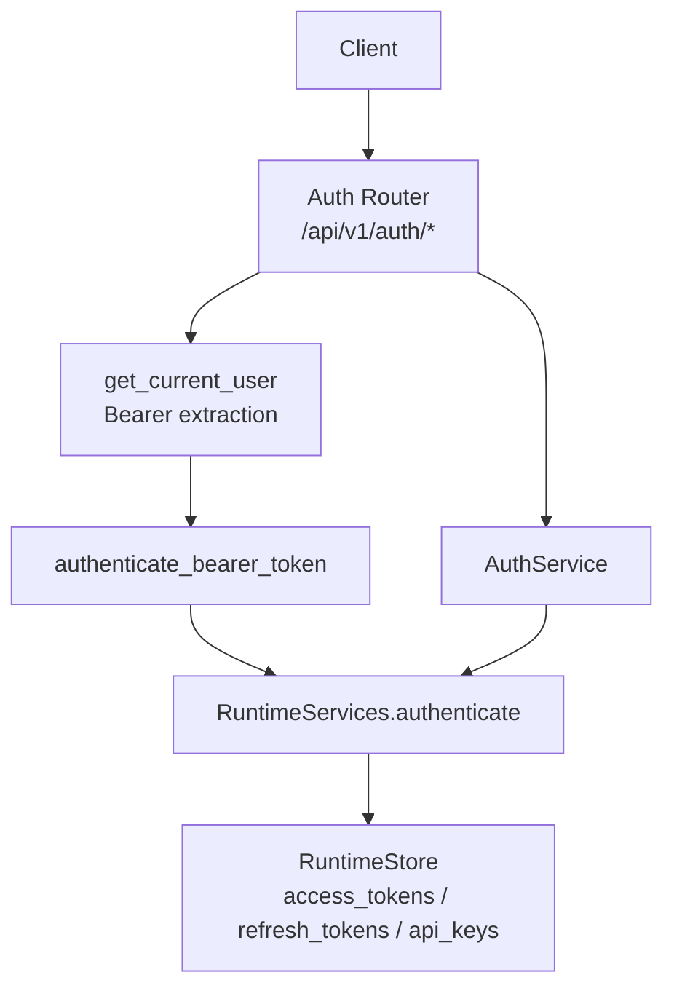
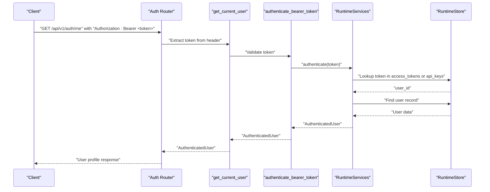
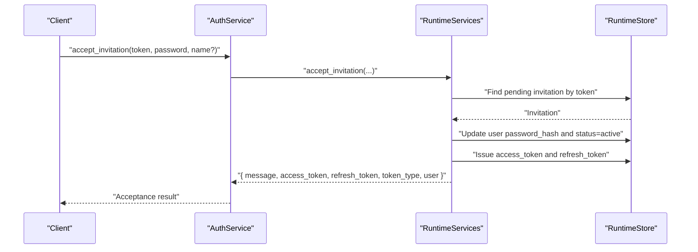
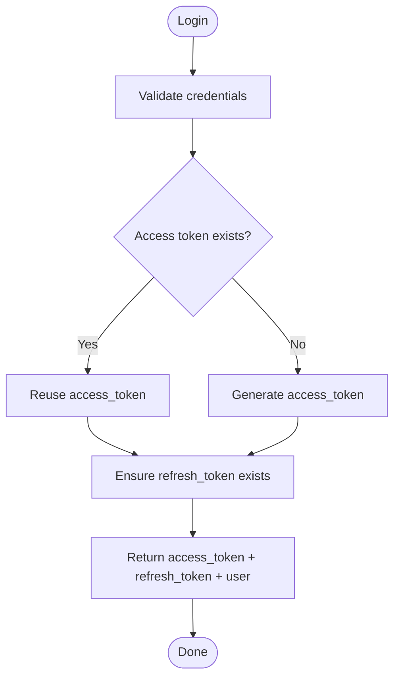
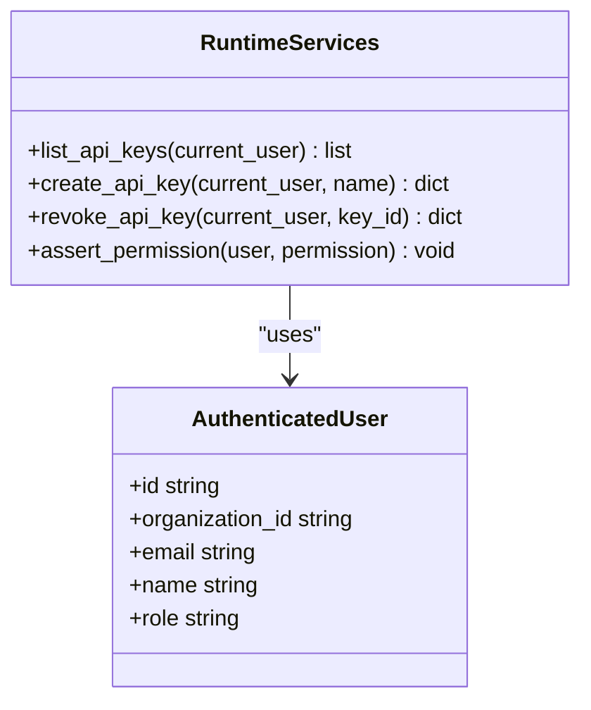
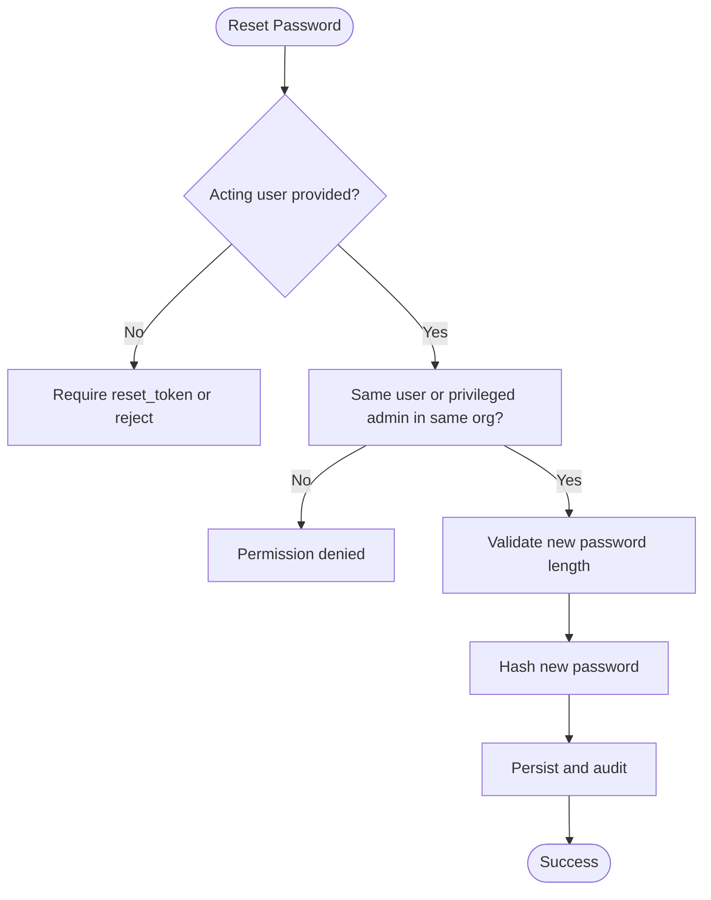
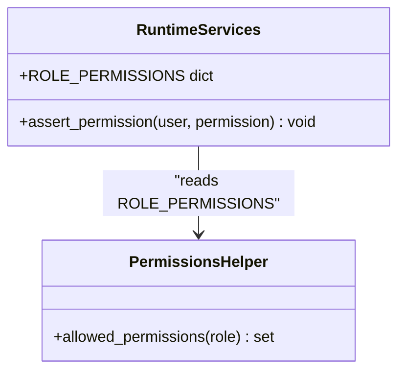
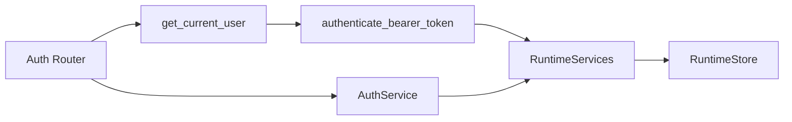

# Authentication & Authorization API

<cite>
**Referenced Files in This Document**
- [auth.py](file://backend/app/api/v1/routes/auth.py)
- [dependencies.py](file://backend/app/api/dependencies.py)
- [auth_service.py](file://backend/app/services/auth_service.py)
- [auth.py](file://backend/app/core/auth.py)
- [permissions.py](file://backend/app/core/permissions.py)
- [common.py](file://backend/app/schemas/common.py)
- [runtime.py](file://backend/app/runtime.py)
</cite>

## Table of Contents
1. [Introduction](#introduction)
2. [Project Structure](#project-structure)
3. [Core Components](#core-components)
4. [Architecture Overview](#architecture-overview)
5. [Detailed Component Analysis](#detailed-component-analysis)
6. [Dependency Analysis](#dependency-analysis)
7. [Performance Considerations](#performance-considerations)
8. [Troubleshooting Guide](#troubleshooting-guide)
9. [Conclusion](#conclusion)
10. [Appendices](#appendices)

## Introduction
This document provides comprehensive API documentation for authentication and authorization endpoints, including user registration, login, logout, password reset, invitation acceptance, and session management. It also covers token-based authentication patterns, role-based access control (RBAC), API key management, and security considerations such as token refresh and permission validation.

## Project Structure
The authentication and authorization features are implemented across the following layers:
- API routes define HTTP endpoints for auth flows.
- Dependencies extract and validate bearer tokens from requests.
- Core utilities authenticate tokens and map roles to permissions.
- Services orchestrate business logic by delegating to runtime operations.
- Schemas define request/response payloads.
- Runtime implements identity, RBAC, token lifecycle, invitations, and persistence.

**Diagram sources**
- [auth.py:1-64](file://backend/app/api/v1/routes/auth.py#L1-L64)
- [dependencies.py:1-18](file://backend/app/api/dependencies.py#L1-L18)
- [auth.py:1-8](file://backend/app/core/auth.py#L1-L8)
- [auth_service.py:1-30](file://backend/app/services/auth_service.py#L1-L30)
- [runtime.py:848-861](file://backend/app/runtime.py#L848-L861)

**Section sources**
- [auth.py:1-64](file://backend/app/api/v1/routes/auth.py#L1-L64)
- [dependencies.py:1-18](file://backend/app/api/dependencies.py#L1-L18)
- [auth.py:1-8](file://backend/app/core/auth.py#L1-L8)
- [auth_service.py:1-30](file://backend/app/services/auth_service.py#L1-L30)
- [runtime.py:848-861](file://backend/app/runtime.py#L848-L861)

## Core Components
- Auth Router: FastAPI endpoints for login, refresh, logout, me, API keys, and password reset.
- Bearer Dependency: Extracts and validates Authorization header; returns an authenticated user context.
- Core Auth: Thin wrapper around runtime authentication.
- Auth Service: Business-facing functions that delegate to runtime for token issuance, refresh, logout, API keys, and password reset.
- Permissions: Role-to-permission mapping helper.
- Schemas: Pydantic models for request bodies and common responses.
- Runtime: Identity store, RBAC enforcement, token lifecycle, invitations, and persistence.

Key responsibilities:
- Login issues access and refresh tokens and returns a sanitized user object.
- Refresh reuses or reissues an access token using a valid refresh token.
- Logout invalidates the current access token.
- Me returns minimal user profile for the current bearer.
- API keys CRUD is protected by settings permissions and scoped by organization.
- Password reset supports self-service and privileged admin resets.

**Section sources**
- [auth.py:1-64](file://backend/app/api/v1/routes/auth.py#L1-L64)
- [dependencies.py:1-18](file://backend/app/api/dependencies.py#L1-L18)
- [auth.py:1-8](file://backend/app/core/auth.py#L1-L8)
- [auth_service.py:1-30](file://backend/app/services/auth_service.py#L1-L30)
- [permissions.py:1-6](file://backend/app/core/permissions.py#L1-L6)
- [common.py:1-234](file://backend/app/schemas/common.py#L1-L234)
- [runtime.py:937-1050](file://backend/app/runtime.py#L937-L1050)

## Architecture Overview
The authentication flow uses bearer tokens validated against in-memory stores backed by Postgres or JSON file. Roles determine allowed permissions via a central mapping.

**Diagram sources**
- [auth.py:31-39](file://backend/app/api/v1/routes/auth.py#L31-L39)
- [dependencies.py:13-17](file://backend/app/api/dependencies.py#L13-L17)
- [auth.py:6-7](file://backend/app/core/auth.py#L6-L7)
- [runtime.py:848-861](file://backend/app/runtime.py#L848-L861)

## Detailed Component Analysis

### Endpoints Reference
Base path: /api/v1/auth

- POST /login
  - Request body: LoginRequest
  - Response: { access_token, refresh_token, token_type, user }
  - Notes: Issues or reuses access and refresh tokens per user; upgrades legacy hashes on success.

- POST /refresh
  - Request body: RefreshRequest
  - Response: { access_token, refresh_token, token_type }
  - Notes: Reuses existing access token if present; does not rotate refresh token.

- POST /logout
  - Header: Authorization: Bearer <token>
  - Response: { message }
  - Notes: Removes access token from store.

- GET /me
  - Requires: Valid bearer token
  - Response: { id, organization_id, email, name, role }

- GET /api-keys
  - Requires: settings:read permission
  - Response: list of API key records (id, name, status, created_at)

- POST /api-keys
  - Requires: settings:update permission
  - Request body: ApiKeyCreateRequest
  - Response: API key record with token value (only returned once)

- DELETE /api-keys/{key_id}
  - Requires: settings:update permission
  - Response: { id, status }

- POST /reset-password
  - Requires: Authenticated caller (self or privileged admin within same org)
  - Request body: PasswordResetRequest
  - Response: { message, email }

Security notes:
- Rate limiting is applied to sensitive endpoints when enabled.
- All write endpoints enforce RBAC via runtime.assert_permission.

**Section sources**
- [auth.py:15-64](file://backend/app/api/v1/routes/auth.py#L15-L64)
- [auth_service.py:1-30](file://backend/app/services/auth_service.py#L1-L30)
- [runtime.py:937-1050](file://backend/app/runtime.py#L937-L1050)

### Request and Response Schemas
- LoginRequest
  - Fields: email (string), password (string)
- RefreshRequest
  - Fields: refresh_token (string)
- PasswordResetRequest
  - Fields: email (string), new_password (string)
- ApiKeyCreateRequest
  - Fields: name (string, default "service-key")
- MessageResponse
  - Fields: message (string)

Token response fields:
- access_token (string): Bearer token used for subsequent requests.
- refresh_token (string): Token used to obtain a new access token.
- token_type (string): Typically "bearer".
- user (object): Sanitized user profile without secrets.

User profile fields (from /me and token responses):
- id (string)
- organization_id (string)
- email (string)
- name (string)
- role (string)

Permission structures:
- Roles and their permissions are defined centrally and enforced at runtime.
- The special wildcard "*" grants all permissions.

**Section sources**
- [common.py:8-58](file://backend/app/schemas/common.py#L8-L58)
- [runtime.py:140-222](file://backend/app/runtime.py#L140-L222)

### Invitation Acceptance Flow
Invitation acceptance is handled through runtime methods exposed by services. While there is no dedicated route shown in the auth router, the accept_invitation method is available for integration.

**Diagram sources**
- [auth_service.py:1-30](file://backend/app/services/auth_service.py#L1-L30)
- [runtime.py:1218-1259](file://backend/app/runtime.py#L1218-L1259)

**Section sources**
- [runtime.py:1218-1259](file://backend/app/runtime.py#L1218-L1259)

### Session Management and Token Lifecycle
- Access tokens are stored in access_tokens mapping keyed by token string to user_id.
- Refresh tokens are stored in refresh_tokens mapping keyed by token string to user_id.
- On login, tokens are reused if they exist for the user; otherwise, new ones are generated.
- On logout, the specific access token is removed.
- On refresh, the existing access token is returned if present.

**Diagram sources**
- [runtime.py:937-960](file://backend/app/runtime.py#L937-L960)

**Section sources**
- [runtime.py:937-960](file://backend/app/runtime.py#L937-L960)

### API Key Management
- Listing keys requires settings:read and is scoped to the caller’s organization.
- Creating a key requires settings:update and returns the raw token value only once.
- Revoking a key marks it revoked and removes it from active lookup.

**Diagram sources**
- [runtime.py:977-1009](file://backend/app/runtime.py#L977-L1009)

**Section sources**
- [runtime.py:977-1009](file://backend/app/runtime.py#L977-L1009)

### Password Reset Patterns
- Self-service reset: authenticated user can reset own password.
- Admin reset: owner/admin within same org can reset another user’s password.
- Unauthenticated open reset is intentionally rejected.

**Diagram sources**
- [runtime.py:1011-1050](file://backend/app/runtime.py#L1011-L1050)

**Section sources**
- [runtime.py:1011-1050](file://backend/app/runtime.py#L1011-L1050)

### Role-Based Access Control (RBAC)
Roles and permissions are centrally defined and enforced via assert_permission. Wildcard "*" grants all permissions.

**Diagram sources**
- [runtime.py:140-222](file://backend/app/runtime.py#L140-L222)
- [permissions.py:1-6](file://backend/app/core/permissions.py#L1-L6)

**Section sources**
- [runtime.py:140-222](file://backend/app/runtime.py#L140-L222)
- [permissions.py:1-6](file://backend/app/core/permissions.py#L1-L6)

## Dependency Analysis
Authentication dependencies form a clear chain:
- Routes depend on FastAPI dependencies to extract bearer tokens.
- Core auth delegates to runtime for token validation.
- Services wrap runtime calls for higher-level operations.
- Runtime enforces RBAC and persists state.

**Diagram sources**
- [auth.py:1-64](file://backend/app/api/v1/routes/auth.py#L1-L64)
- [dependencies.py:1-18](file://backend/app/api/dependencies.py#L1-L18)
- [auth.py:1-8](file://backend/app/core/auth.py#L1-L8)
- [auth_service.py:1-30](file://backend/app/services/auth_service.py#L1-L30)
- [runtime.py:848-861](file://backend/app/runtime.py#L848-L861)

**Section sources**
- [auth.py:1-64](file://backend/app/api/v1/routes/auth.py#L1-L64)
- [dependencies.py:1-18](file://backend/app/api/dependencies.py#L1-L18)
- [auth.py:1-8](file://backend/app/core/auth.py#L1-L8)
- [auth_service.py:1-30](file://backend/app/services/auth_service.py#L1-L30)
- [runtime.py:848-861](file://backend/app/runtime.py#L848-L861)

## Performance Considerations
- Token lookups are O(1) dictionary accesses in runtime store.
- User lookups are linear scans over users collection; consider indexing strategies if the dataset grows significantly.
- Rate limiting is configurable and applied to sensitive endpoints to mitigate brute-force attempts.
- Persisted state writes occur after critical operations; batching saves where possible can reduce I/O overhead.

[No sources needed since this section provides general guidance]

## Troubleshooting Guide
Common errors and resolutions:
- Invalid or missing bearer token: Ensure Authorization header is present and formatted as "Bearer <token>".
- Permission denied: Verify the user’s role includes the required permission or has "*".
- User account disabled or invited: Account must be active before login; complete invitation acceptance first.
- Password reset requires authentication or a valid reset token: Provide either a valid bearer token or a reset token depending on the flow.
- Unknown role or invalid status: Ensure role is one of the supported values and status is valid.

Operational tips:
- After disabling a user, their live tokens are revoked automatically.
- When creating API keys, capture the token immediately as it is only returned once.
- For password resets, ensure new passwords meet minimum length requirements.

**Section sources**
- [runtime.py:848-861](file://backend/app/runtime.py#L848-L861)
- [runtime.py:937-960](file://backend/app/runtime.py#L937-L960)
- [runtime.py:1011-1050](file://backend/app/runtime.py#L1011-L1050)
- [runtime.py:1100-1142](file://backend/app/runtime.py#L1100-L1142)

## Conclusion
The authentication and authorization system provides a robust foundation for secure access control using bearer tokens, RBAC, and API keys. It supports essential flows like login, refresh, logout, password reset, and invitation acceptance, with clear error handling and auditability. Organizations should configure rate limiting, manage tokens securely, and adhere to least-privilege principles when assigning roles and permissions.

[No sources needed since this section summarizes without analyzing specific files]

## Appendices

### Example Usage Patterns
- Token-based authentication: Include Authorization: Bearer <access_token> in subsequent requests.
- Role-based access control: Assign roles based on job function; leverage "*" sparingly for super-admin scenarios.
- API key management: Create keys for service accounts, scope them by organization, and revoke promptly when decommissioned.

[No sources needed since this section provides general guidance]