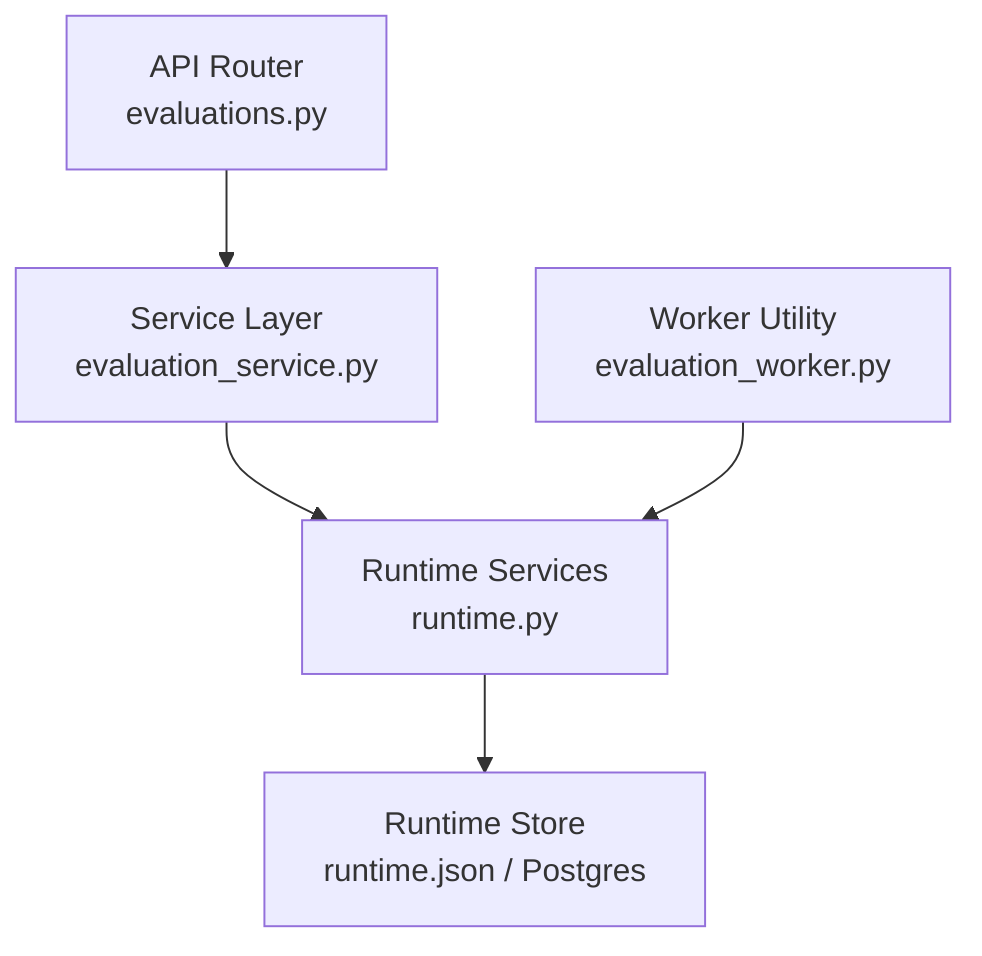
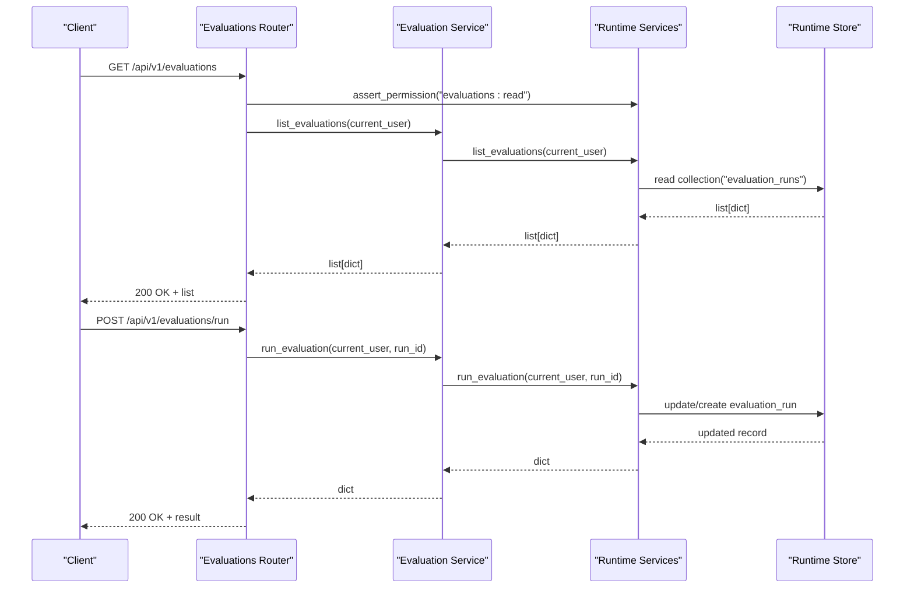
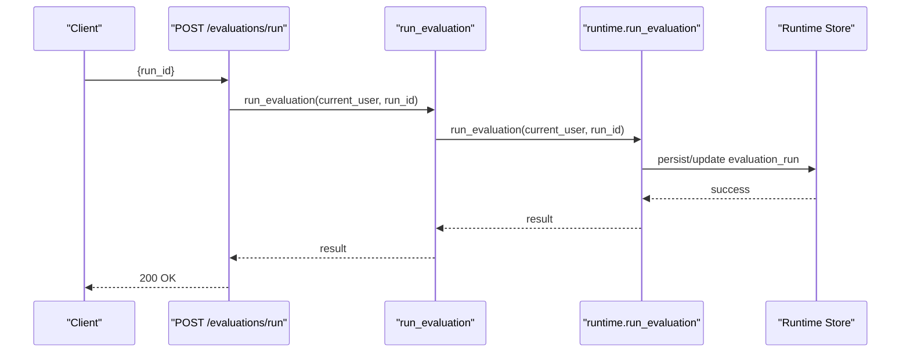
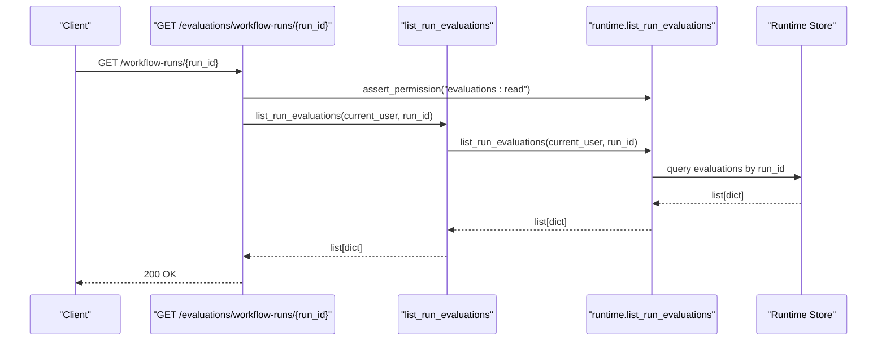
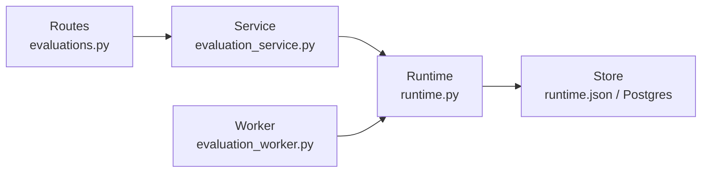

# Evaluations & Testing API

<cite>
**Referenced Files in This Document**
- [evaluations.py](file://backend/app/api/v1/routes/evaluations.py)
- [evaluation_service.py](file://backend/app/services/evaluation_service.py)
- [common.py](file://backend/app/schemas/common.py)
- [runtime.py](file://backend/app/runtime.py)
- [evaluation_worker.py](file://backend/app/workers/evaluation_worker.py)
</cite>

## Table of Contents
1. [Introduction](#introduction)
2. [Project Structure](#project-structure)
3. [Core Components](#core-components)
4. [Architecture Overview](#architecture-overview)
5. [Detailed Component Analysis](#detailed-component-analysis)
6. [Dependency Analysis](#dependency-analysis)
7. [Performance Considerations](#performance-considerations)
8. [Troubleshooting Guide](#troubleshooting-guide)
9. [Conclusion](#conclusion)
10. [Appendices](#appendices)

## Introduction
This document provides comprehensive API documentation for the evaluation framework and testing endpoints exposed by the backend. It focuses on:
- Golden task management (as surfaced through evaluation runs)
- Regression test execution via evaluation runs
- Adversarial testing integration points
- Performance benchmarking hooks
- Evaluation criteria, test suites, result scoring, and quality metrics schemas
- Automated evaluation pipelines, human review workflows, and continuous integration patterns
- Corpus management, variant comparison, and fitness assessment algorithms

The evaluation subsystem is implemented as a thin API layer over runtime services that operate against an in-process store (Postgres-backed or JSON-file fallback). The current implementation exposes read-only evaluation metadata and run execution triggers.

## Project Structure
The evaluation feature spans API routes, service functions, Pydantic request schemas, runtime methods, and a worker utility.

**Diagram sources**
- [evaluations.py:1-32](file://backend/app/api/v1/routes/evaluations.py#L1-L32)
- [evaluation_service.py:1-18](file://backend/app/services/evaluation_service.py#L1-L18)
- [runtime.py:2669-2691](file://backend/app/runtime.py#L2669-L2691)
- [evaluation_worker.py:1-6](file://backend/app/workers/evaluation_worker.py#L1-L6)

**Section sources**
- [evaluations.py:1-32](file://backend/app/api/v1/routes/evaluations.py#L1-L32)
- [evaluation_service.py:1-18](file://backend/app/services/evaluation_service.py#L1-L18)
- [common.py:212-214](file://backend/app/schemas/common.py#L212-L214)
- [runtime.py:2669-2691](file://backend/app/runtime.py#L2669-L2691)
- [evaluation_worker.py:1-6](file://backend/app/workers/evaluation_worker.py#L1-L6)

## Core Components
- API Routes: Define HTTP endpoints for listing evaluations, retrieving details, triggering runs, and listing evaluations per workflow run.
- Service Layer: Thin wrappers around runtime methods to enforce permissions and orchestrate calls.
- Schemas: Pydantic models for request validation, including the evaluation run trigger payload.
- Runtime Methods: Business logic for evaluating collections and executing runs.
- Worker Utility: Helper to refresh or summarize evaluation runs.

Key responsibilities:
- Authorization checks are enforced at the route level using role-based permissions.
- Request payloads are validated with Pydantic models.
- Data access is centralized through runtime methods.

**Section sources**
- [evaluations.py:1-32](file://backend/app/api/v1/routes/evaluations.py#L1-L32)
- [evaluation_service.py:1-18](file://backend/app/services/evaluation_service.py#L1-L18)
- [common.py:212-214](file://backend/app/schemas/common.py#L212-L214)
- [runtime.py:2669-2691](file://backend/app/runtime.py#L2669-L2691)

## Architecture Overview
The evaluation API follows a layered architecture:
- FastAPI router handles HTTP requests and dependency injection for authentication.
- Service functions encapsulate business operations and delegate to runtime.
- Runtime methods implement core logic and interact with the persistent store.
- A worker utility can be used to refresh or inspect evaluation runs.

**Diagram sources**
- [evaluations.py:11-31](file://backend/app/api/v1/routes/evaluations.py#L11-L31)
- [evaluation_service.py:4-17](file://backend/app/services/evaluation_service.py#L4-L17)
- [runtime.py:2669-2691](file://backend/app/runtime.py#L2669-L2691)

## Detailed Component Analysis

### API Endpoints
Base path: /api/v1/evaluations

- List evaluations
  - Method: GET
  - Path: /api/v1/evaluations
  - Description: Returns all evaluations visible to the authenticated user.
  - Authentication: Required (role must have "evaluations:read").
  - Response: Array of evaluation records.

- Get evaluation detail
  - Method: GET
  - Path: /api/v1/evaluations/{evaluation_id}
  - Description: Retrieves a single evaluation by ID.
  - Authentication: Required (role must have "evaluations:read").
  - Response: Evaluation record object.

- Run evaluation
  - Method: POST
  - Path: /api/v1/evaluations/run
  - Description: Triggers an evaluation run identified by run_id.
  - Authentication: Required (no explicit permission check in route; service delegates to runtime).
  - Request body: EvaluationRunRequest schema.
  - Response: Evaluation run result object.

- List evaluations for a workflow run
  - Method: GET
  - Path: /api/v1/evaluations/workflow-runs/{run_id}
  - Description: Lists evaluations associated with a specific workflow run.
  - Authentication: Required (role must have "evaluations:read").
  - Response: Array of evaluation records.

Request and response schemas:
- EvaluationRunRequest
  - Fields:
    - run_id: string (required)

Notes:
- All endpoints return standard JSON responses.
- Errors follow the global error handling defined in the application.

**Section sources**
- [evaluations.py:11-31](file://backend/app/api/v1/routes/evaluations.py#L11-L31)
- [common.py:212-214](file://backend/app/schemas/common.py#L212-L214)

### Service Layer
Functions:
- list_evaluations(current_user): returns list of evaluations
- get_evaluation(current_user, evaluation_id): returns a single evaluation
- run_evaluation(current_user, run_id): executes an evaluation run
- list_run_evaluations(current_user, run_id): lists evaluations for a given run

Responsibilities:
- Encapsulate runtime calls
- Maintain separation between HTTP layer and business logic

**Section sources**
- [evaluation_service.py:4-17](file://backend/app/services/evaluation_service.py#L4-L17)

### Runtime Methods
Methods:
- list_evaluations(current_user): fetches evaluation data
- get_evaluation(current_user, evaluation_id): retrieves a specific evaluation
- run_evaluation(current_user, run_id): executes an evaluation run
- list_run_evaluations(current_user, run_id): queries evaluations tied to a workflow run

Behavior:
- These methods perform authorization checks where applicable and interact with the runtime store.
- They may mutate state when running evaluations.

**Section sources**
- [runtime.py:2669-2691](file://backend/app/runtime.py#L2669-L2691)

### Worker Utility
Function:
- refresh_evaluations(): returns count of evaluation runs

Use cases:
- Health checks
- Background jobs to refresh or summarize evaluation state

**Section sources**
- [evaluation_worker.py:4-5](file://backend/app/workers/evaluation_worker.py#L4-L5)

### Sequence Diagrams

#### Trigger Evaluation Run

**Diagram sources**
- [evaluations.py:23-25](file://backend/app/api/v1/routes/evaluations.py#L23-L25)
- [evaluation_service.py:12-13](file://backend/app/services/evaluation_service.py#L12-L13)
- [runtime.py:2680-2689](file://backend/app/runtime.py#L2680-L2689)

#### List Evaluations for Workflow Run

**Diagram sources**
- [evaluations.py:28-31](file://backend/app/api/v1/routes/evaluations.py#L28-L31)
- [evaluation_service.py:16-17](file://backend/app/services/evaluation_service.py#L16-L17)
- [runtime.py:2691-2691](file://backend/app/runtime.py#L2691-L2691)

## Dependency Analysis
The evaluation subsystem has clear dependencies:
- API routes depend on service functions and runtime permission checks.
- Service functions depend on runtime methods.
- Runtime methods depend on the runtime store (Postgres or JSON file).
- Worker utility depends on runtime to enumerate evaluation runs.

**Diagram sources**
- [evaluations.py:1-32](file://backend/app/api/v1/routes/evaluations.py#L1-L32)
- [evaluation_service.py:1-18](file://backend/app/services/evaluation_service.py#L1-L18)
- [runtime.py:2669-2691](file://backend/app/runtime.py#L2669-L2691)
- [evaluation_worker.py:1-6](file://backend/app/workers/evaluation_worker.py#L1-L6)

**Section sources**
- [evaluations.py:1-32](file://backend/app/api/v1/routes/evaluations.py#L1-L32)
- [evaluation_service.py:1-18](file://backend/app/services/evaluation_service.py#L1-L18)
- [runtime.py:2669-2691](file://backend/app/runtime.py#L2669-L2691)
- [evaluation_worker.py:1-6](file://backend/app/workers/evaluation_worker.py#L1-L6)

## Performance Considerations
- Prefer batched reads for large evaluation datasets.
- Use pagination if available in higher-level APIs.
- Avoid synchronous heavy computation in request handlers; offload to workers where possible.
- Ensure database indexes exist on frequently queried fields such as run_id and evaluation IDs.

## Troubleshooting Guide
Common issues:
- Permission denied: Ensure the authenticated user has "evaluations:read" for read endpoints.
- Not found: Verify evaluation_id or run_id exists in the runtime store.
- Validation errors: Confirm request bodies match Pydantic schemas (e.g., EvaluationRunRequest requires run_id).

Operational tips:
- Use the worker utility to quickly verify the number of evaluation runs.
- Inspect runtime store contents for debugging when Postgres is unavailable.

**Section sources**
- [evaluations.py:11-31](file://backend/app/api/v1/routes/evaluations.py#L11-L31)
- [common.py:212-214](file://backend/app/schemas/common.py#L212-L214)
- [evaluation_worker.py:4-5](file://backend/app/workers/evaluation_worker.py#L4-L5)

## Conclusion
The evaluation API provides essential endpoints to list evaluations, retrieve details, execute runs, and filter by workflow run. It integrates tightly with the runtime services and store, enforcing RBAC at the API boundary. While the current surface area is focused on read and run-trigger operations, it lays the foundation for richer evaluation features such as golden tasks, adversarial tests, regression suites, and performance benchmarks.

## Appendices

### API Reference Summary
- GET /api/v1/evaluations
  - Auth: evaluations:read
  - Response: list of evaluations
- GET /api/v1/evaluations/{evaluation_id}
  - Auth: evaluations:read
  - Response: evaluation detail
- POST /api/v1/evaluations/run
  - Body: EvaluationRunRequest { run_id }
  - Response: evaluation run result
- GET /api/v1/evaluations/workflow-runs/{run_id}
  - Auth: evaluations:read
  - Response: list of evaluations for run

### Schemas
- EvaluationRunRequest
  - run_id: string (required)

### Example Workflows
- Automated evaluation pipeline
  - Trigger run via POST /evaluations/run with run_id from CI job.
  - Poll or listen for results via GET /evaluations/{evaluation_id}.
- Human review workflow
  - Create evaluation runs gated by governance policies.
  - Reviewers use read endpoints to inspect outcomes before approval.
- Continuous integration pattern
  - On commit, run regression suite by invoking run endpoint.
  - Record results and fail build if thresholds not met.

### Corpus Management, Variant Comparison, Fitness Assessment
- Corpus management
  - Manage inputs and fixtures referenced by evaluation runs.
  - Version corpora alongside workflow definitions.
- Variant comparison
  - Compare evaluation results across variants by run_id and evaluation_id.
- Fitness assessment algorithms
  - Implement custom evaluators within runtime methods to compute scores and metrics.