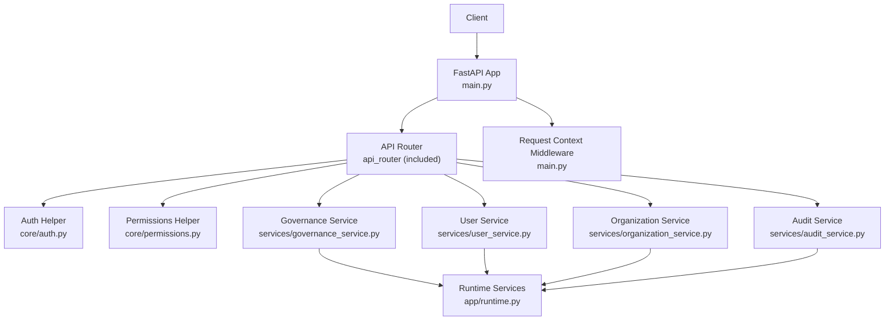
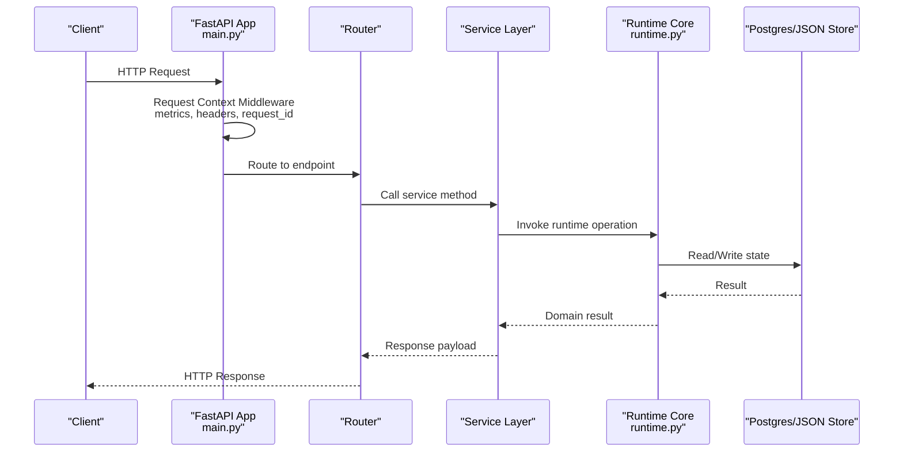
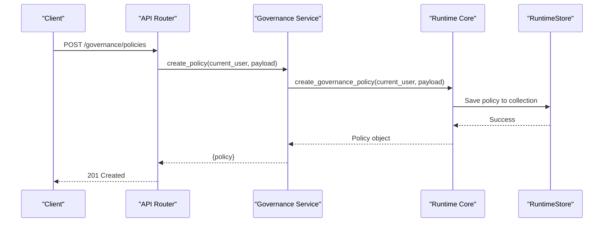
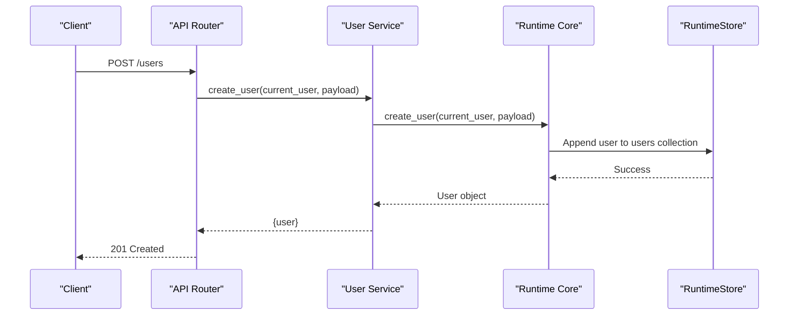
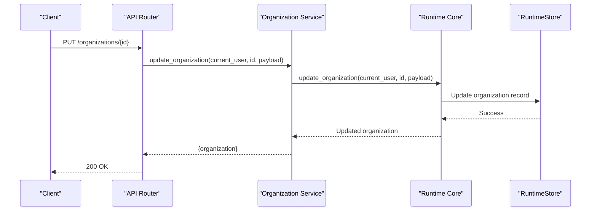
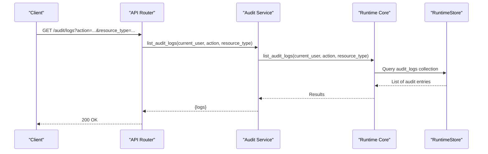
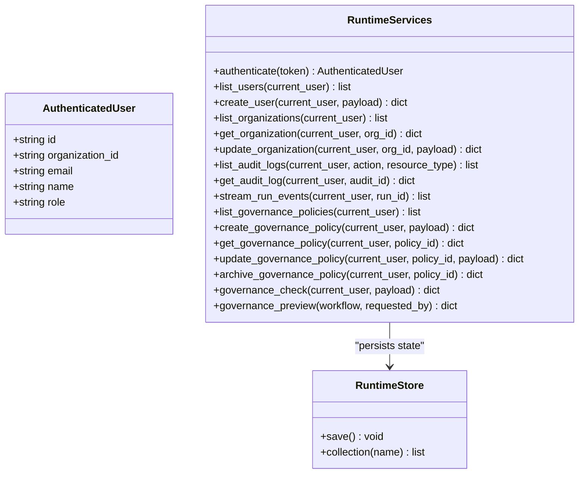
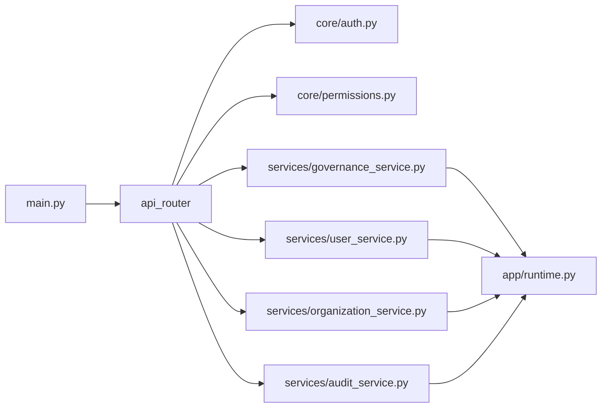

# Governance & Administration API

<cite>
**Referenced Files in This Document**
- [main.py](file://backend/app/main.py)
- [runtime.py](file://backend/app/runtime.py)
- [auth.py](file://backend/app/core/auth.py)
- [permissions.py](file://backend/app/core/permissions.py)
- [governance_service.py](file://backend/app/services/governance_service.py)
- [user_service.py](file://backend/app/services/user_service.py)
- [organization_service.py](file://backend/app/services/organization_service.py)
- [audit_service.py](file://backend/app/services/audit_service.py)
</cite>

## Table of Contents
1. [Introduction](#introduction)
2. [Project Structure](#project-structure)
3. [Core Components](#core-components)
4. [Architecture Overview](#architecture-overview)
5. [Detailed Component Analysis](#detailed-component-analysis)
6. [Dependency Analysis](#dependency-analysis)
7. [Performance Considerations](#performance-considerations)
8. [Troubleshooting Guide](#troubleshooting-guide)
9. [Conclusion](#conclusion)
10. [Appendices](#appendices)

## Introduction
This document provides detailed API documentation for governance, user management, and administration endpoints. It covers policy enforcement, risk tiering, audit logging, user and organization management, multi-tenancy patterns, cross-organization collaboration controls, and regulatory reporting capabilities. The backend exposes a FastAPI application with middleware for request context, security headers, metrics, and centralized error handling. Core runtime services encapsulate authentication, authorization, persistence, and domain operations.

## Project Structure
The relevant backend components are organized as follows:
- Application entrypoint and middleware (FastAPI app, CORS, request context, metrics, security headers)
- Authentication and permissions helpers
- Service layer for governance, users, organizations, and audit
- Runtime core that implements identity, roles, permissions, persistence, and business logic

**Diagram sources**
- [main.py:1-52](file://backend/app/main.py#L1-L52)
- [auth.py:1-8](file://backend/app/core/auth.py#L1-L8)
- [permissions.py:1-6](file://backend/app/core/permissions.py#L1-L6)
- [governance_service.py:1-31](file://backend/app/services/governance_service.py#L1-L31)
- [user_service.py:1-34](file://backend/app/services/user_service.py#L1-L34)
- [organization_service.py:1-14](file://backend/app/services/organization_service.py#L1-L14)
- [audit_service.py:1-14](file://backend/app/services/audit_service.py#L1-L14)
- [runtime.py:1-800](file://backend/app/runtime.py#L1-L800)

**Section sources**
- [main.py:1-52](file://backend/app/main.py#L1-L52)

## Core Components
- Authentication helper validates bearer tokens via the runtime.
- Permissions helper maps roles to allowed permission sets.
- Service modules expose high-level operations for governance, users, organizations, and audit.
- Runtime core implements:
  - Identity model and role-permission mapping
  - Persistence abstraction over Postgres or JSON file
  - Default seed data and bootstrap logic
  - Business operations used by services

Key responsibilities:
- Enforce RBAC using ROLE_PERMISSIONS
- Provide multi-tenant isolation via organization_id on entities
- Persist state consistently across Postgres and JSON fallback
- Centralize request-scoped identifiers and metrics

**Section sources**
- [auth.py:1-8](file://backend/app/core/auth.py#L1-L8)
- [permissions.py:1-6](file://backend/app/core/permissions.py#L1-L6)
- [governance_service.py:1-31](file://backend/app/services/governance_service.py#L1-L31)
- [user_service.py:1-34](file://backend/app/services/user_service.py#L1-L34)
- [organization_service.py:1-14](file://backend/app/services/organization_service.py#L1-L14)
- [audit_service.py:1-14](file://backend/app/services/audit_service.py#L1-L14)
- [runtime.py:131-222](file://backend/app/runtime.py#L131-L222)
- [runtime.py:258-384](file://backend/app/runtime.py#L258-L384)

## Architecture Overview
The system uses a layered architecture:
- HTTP layer (FastAPI) with middleware for request context, metrics, and security headers
- Routing layer includes versioned routers
- Service layer orchestrates business logic
- Runtime core provides identity, authorization, persistence, and domain operations

**Diagram sources**
- [main.py:17-51](file://backend/app/main.py#L17-L51)
- [runtime.py:258-384](file://backend/app/runtime.py#L258-L384)

## Detailed Component Analysis

### Governance Endpoints
Purpose: Manage governance policies and perform compliance checks.

Available operations (service methods):
- Preview workflow governance impact
- List policies
- Create policy
- Get policy
- Update policy
- Archive policy
- Check compliance against policies

Typical flow:
- Client calls governance service method
- Service delegates to runtime governance functions
- Runtime enforces permissions and persists changes

**Diagram sources**
- [governance_service.py:13-14](file://backend/app/services/governance_service.py#L13-L14)
- [runtime.py:258-384](file://backend/app/runtime.py#L258-L384)

**Section sources**
- [governance_service.py:1-31](file://backend/app/services/governance_service.py#L1-L31)

### User Management Endpoints
Purpose: Administer users within an organization, including invitations.

Available operations (service methods):
- List users
- Get user
- Create user
- Update user
- Create invitation
- List invitations
- Accept invitation

Multi-tenancy:
- Users are scoped to organization_id
- Operations enforce current_user’s organization context

**Diagram sources**
- [user_service.py:12-13](file://backend/app/services/user_service.py#L12-L13)
- [runtime.py:258-384](file://backend/app/runtime.py#L258-L384)

**Section sources**
- [user_service.py:1-34](file://backend/app/services/user_service.py#L1-L34)

### Organization Management Endpoints
Purpose: Manage organizations and their metadata.

Available operations (service methods):
- List organizations
- Get organization
- Update organization

Cross-organization collaboration controls:
- Entities carry organization_id; access is restricted by current_user’s organization
- Administrative updates require appropriate permissions

**Diagram sources**
- [organization_service.py:12-13](file://backend/app/services/organization_service.py#L12-L13)
- [runtime.py:258-384](file://backend/app/runtime.py#L258-L384)

**Section sources**
- [organization_service.py:1-14](file://backend/app/services/organization_service.py#L1-L14)

### Audit Logging Endpoints
Purpose: Query and stream audit events for compliance and reporting.

Available operations (service methods):
- List audit logs (filterable by action, resource_type)
- Get audit log by ID
- Stream run events for a specific run

Regulatory reporting:
- Audit logs capture actions and resources
- Filtering supports targeted reporting queries

**Diagram sources**
- [audit_service.py:4-5](file://backend/app/services/audit_service.py#L4-L5)
- [runtime.py:258-384](file://backend/app/runtime.py#L258-L384)

**Section sources**
- [audit_service.py:1-14](file://backend/app/services/audit_service.py#L1-L14)

### Authentication and Authorization
- Bearer token authentication is handled by the auth helper which delegates to runtime.
- Role-based permissions are defined centrally and enforced at service boundaries.

**Diagram sources**
- [runtime.py:131-222](file://backend/app/runtime.py#L131-L222)
- [runtime.py:258-384](file://backend/app/runtime.py#L258-L384)

**Section sources**
- [auth.py:1-8](file://backend/app/core/auth.py#L1-L8)
- [permissions.py:1-6](file://backend/app/core/permissions.py#L1-L6)
- [runtime.py:131-222](file://backend/app/runtime.py#L131-L222)

## Dependency Analysis
- main.py includes the versioned router and registers error handlers, CORS, and request context middleware.
- Services depend on runtime for all domain operations.
- Runtime depends on configuration for database selection and persistence strategy.
- Roles map to explicit permission sets used by authorization checks.

**Diagram sources**
- [main.py:1-52](file://backend/app/main.py#L1-L52)
- [auth.py:1-8](file://backend/app/core/auth.py#L1-L8)
- [permissions.py:1-6](file://backend/app/core/permissions.py#L1-L6)
- [governance_service.py:1-31](file://backend/app/services/governance_service.py#L1-L31)
- [user_service.py:1-34](file://backend/app/services/user_service.py#L1-L34)
- [organization_service.py:1-14](file://backend/app/services/organization_service.py#L1-L14)
- [audit_service.py:1-14](file://backend/app/services/audit_service.py#L1-L14)
- [runtime.py:1-800](file://backend/app/runtime.py#L1-L800)

**Section sources**
- [main.py:1-52](file://backend/app/main.py#L1-L52)
- [runtime.py:131-222](file://backend/app/runtime.py#L131-L222)

## Performance Considerations
- Use Postgres-backed persistence for production workloads; JSON fallback is available for local development and resilience.
- Leverage filtering parameters on audit logs to reduce payload sizes.
- Avoid excessive governance checks in hot paths; cache results where appropriate.
- Monitor metrics recorded by the request context middleware for latency and throughput insights.

[No sources needed since this section provides general guidance]

## Troubleshooting Guide
Common issues and resolutions:
- Authentication failures: Ensure bearer token is valid and corresponds to an existing user.
- Permission denied: Verify the user’s role has required permissions for the operation.
- Not found errors: Confirm entity IDs exist within the caller’s organization scope.
- Approval required: Some workflows may require human approval before execution.
- Rate limiting: Respect retry-after values when receiving rate-limited responses.

Operational tips:
- Inspect X-Request-ID from response headers for tracing.
- Review audit logs filtered by action/resource_type for compliance investigations.
- Validate input payloads to avoid validation errors.

**Section sources**
- [runtime.py:93-129](file://backend/app/runtime.py#L93-L129)
- [main.py:27-48](file://backend/app/main.py#L27-L48)

## Conclusion
The Governance & Administration API provides robust capabilities for policy enforcement, user and organization management, and audit logging. Multi-tenancy is enforced through organization scoping, while RBAC ensures least-privilege access. The runtime core centralizes persistence and business logic, supporting both Postgres and JSON backends. For compliance and reporting, audit endpoints enable targeted queries and event streaming.

[No sources needed since this section summarizes without analyzing specific files]

## Appendices

### Schemas and Data Models

#### Governance Rules
- Fields include identifiers, policy definitions, risk tiers, and gating rules.
- Policies can be previewed and checked against payloads prior to execution.

References:
- [governance_service.py:1-31](file://backend/app/services/governance_service.py#L1-L31)
- [runtime.py:258-384](file://backend/app/runtime.py#L258-L384)

#### Audit Events
- Captures actions, resources, timestamps, and contextual metadata.
- Supports filtering by action and resource type for reporting.

References:
- [audit_service.py:1-14](file://backend/app/services/audit_service.py#L1-L14)
- [runtime.py:258-384](file://backend/app/runtime.py#L258-L384)

#### User Roles and Permissions
- Roles include owner, admin, manager, operator, reviewer, viewer, service_account.
- Each role maps to a set of permissions controlling read/write/execute capabilities.

References:
- [runtime.py:140-222](file://backend/app/runtime.py#L140-L222)
- [permissions.py:1-6](file://backend/app/core/permissions.py#L1-L6)

#### Organizational Structures
- Organizations have identifiers, names, slugs, and status.
- Users and other entities are scoped to organizations via organization_id.

References:
- [organization_service.py:1-14](file://backend/app/services/organization_service.py#L1-L14)
- [runtime.py:258-384](file://backend/app/runtime.py#L258-L384)

### Examples

#### Compliance Checking
- Use governance check to evaluate a payload against active policies.
- Return indicates pass/fail and any required approvals.

References:
- [governance_service.py:29-30](file://backend/app/services/governance_service.py#L29-L30)
- [runtime.py:258-384](file://backend/app/runtime.py#L258-L384)

#### Access Control Enforcement
- Requests are authenticated via bearer token.
- Services validate permissions based on the caller’s role.

References:
- [auth.py:1-8](file://backend/app/core/auth.py#L1-L8)
- [permissions.py:1-6](file://backend/app/core/permissions.py#L1-L6)
- [runtime.py:140-222](file://backend/app/runtime.py#L140-L222)

#### Administrative Operations
- Create/update users and organizations.
- Manage invitations and accept them to onboard new members.

References:
- [user_service.py:1-34](file://backend/app/services/user_service.py#L1-L34)
- [organization_service.py:1-14](file://backend/app/services/organization_service.py#L1-L14)

### Multi-Tenancy Patterns
- All entities carry organization_id.
- Current user’s organization_id constrains visibility and mutations.
- Cross-organization collaboration requires explicit permissions and shared scopes.

References:
- [runtime.py:131-138](file://backend/app/runtime.py#L131-L138)
- [runtime.py:258-384](file://backend/app/runtime.py#L258-L384)

### Regulatory Reporting Capabilities
- Filter audit logs by action and resource_type for targeted reports.
- Stream run events for real-time monitoring and post-mortem analysis.

References:
- [audit_service.py:4-13](file://backend/app/services/audit_service.py#L4-L13)
- [runtime.py:258-384](file://backend/app/runtime.py#L258-L384)