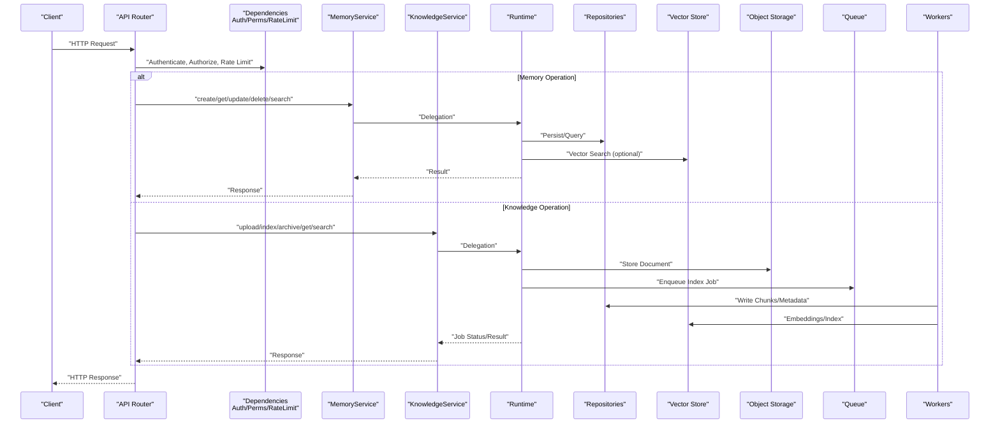
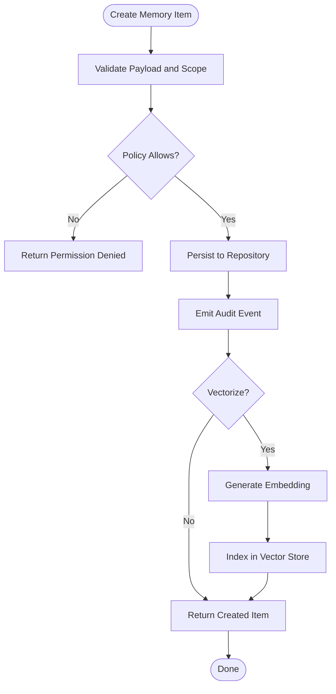
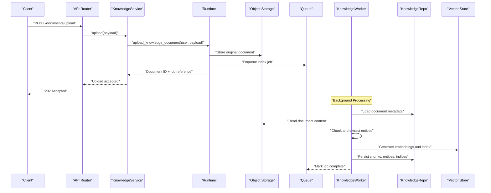
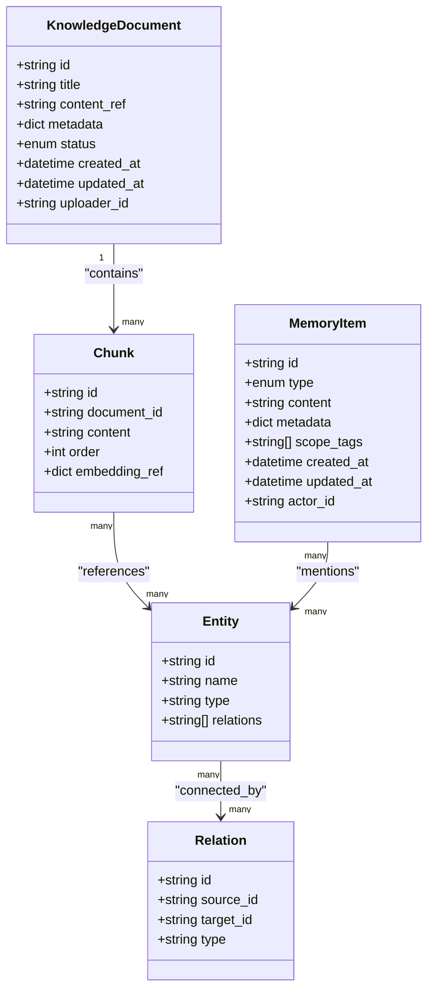
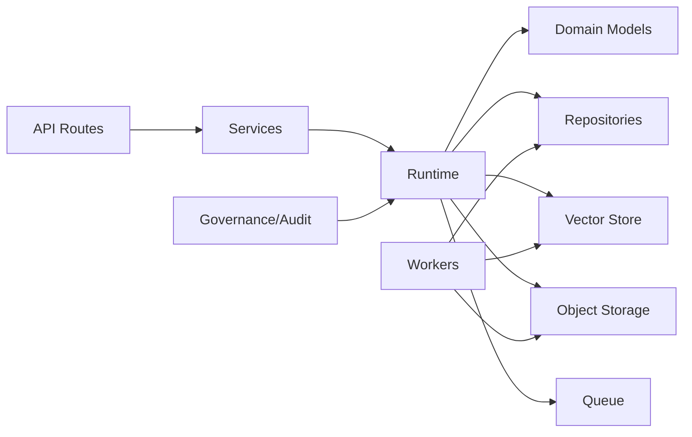

# Memory & Knowledge API

<cite>
**Referenced Files in This Document**
- [memory_service.py](file://backend/app/services/memory_service.py)
- [knowledge_service.py](file://backend/app/services/knowledge_service.py)
- [memory.py](file://backend/app/schemas/memory.py)
- [knowledge.py](file://backend/app/schemas/knowledge.py)
- [runtime.py](file://backend/app/runtime.py)
- [main.py](file://backend/app/main.py)
- [router.py](file://backend/app/api/v1/router.py)
- [dependencies.py](file://backend/app/api/dependencies.py)
- [errors.py](file://backend/app/api/errors.py)
- [auth.py](file://backend/app/core/auth.py)
- [permissions.py](file://backend/app/core/permissions.py)
- [security.py](file://backend/app/core/security.py)
- [pagination.py](file://backend/app/core/pagination.py)
- [rate_limit.py](file://backend/app/core/rate_limit.py)
- [logging.py](file://backend/app/core/logging.py)
- [metrics.py](file://backend/app/core/metrics.py)
- [idempotency.py](file://backend/app/core/idempotency.py)
- [config.py](file://backend/app/core/config.py)
- [models.py](file://backend/app/domain/memory/models.py)
- [retrieval.py](file://backend/app/domain/memory/retrieval.py)
- [scopes.py](file://backend/app/domain/memory/scopes.py)
- [chunking.py](file://backend/app/domain/knowledge/chunking.py)
- [models.py](file://backend/app/domain/knowledge/models.py)
- [retrieval.py](file://backend/app/domain/knowledge/retrieval.py)
- [vector_store/__init__.py](file://backend/app/infrastructure/vector_store/__init__.py)
- [repositories/memory_repo.py](file://backend/app/infrastructure/repositories/memory_repo.py)
- [repositories/knowledge_repo.py](file://backend/app/infrastructure/repositories/knowledge_repo.py)
- [object_storage/__init__.py](file://backend/app/infrastructure/object_storage/__init__.py)
- [queue/__init__.py](file://backend/app/infrastructure/queue/__init__.py)
- [audit/events.py](file://backend/app/domain/audit/events.py)
- [audit/models.py](file://backend/app/domain/audit/models.py)
- [governance/policy_engine.py](file://backend/app/domain/governance/policy_engine.py)
- [governance/models.py](file://backend/app/domain/governance/models.py)
- [governance/risk.py](file://backend/app/domain/governance/risk.py)
- [workers/memory_worker.py](file://backend/app/workers/memory_worker.py)
- [workers/knowledge_worker.py](file://backend/app/workers/knowledge_worker.py)
</cite>

## Table of Contents
1. [Introduction](#introduction)
2. [Project Structure](#project-structure)
3. [Core Components](#core-components)
4. [Architecture Overview](#architecture-overview)
5. [Detailed Component Analysis](#detailed-component-analysis)
6. [Dependency Analysis](#dependency-analysis)
7. [Performance Considerations](#performance-considerations)
8. [Troubleshooting Guide](#troubleshooting-guide)
9. [Conclusion](#conclusion)
10. [Appendices](#appendices)

## Introduction
This document provides detailed API documentation for the hybrid memory system and knowledge base endpoints. It covers:
- Memory item creation, retrieval, update, deletion, and search across memory types (event, episodic, semantic, procedural).
- Knowledge base operations including document upload, indexing, search, and entity extraction.
- Scope-based access control, vector similarity search, and graph traversal queries.
- Provenance tracking, audit trails, and data retention policies.

The backend is organized into layered modules: API routes, services, domain logic, infrastructure integrations, schemas, workers, and cross-cutting concerns such as authentication, permissions, rate limiting, logging, metrics, and idempotency.

## Project Structure
Key directories relevant to this API:
- API layer: routes and dependencies
- Services: business orchestration for memory and knowledge
- Domain: models, retrieval, chunking, scopes, governance
- Infrastructure: repositories, vector store, object storage, queue
- Workers: asynchronous processing for indexing and memory tasks
- Core: auth, permissions, security, pagination, rate limiting, logging, metrics, idempotency, config
- Schemas: request/response contracts

```mermaid
graph TB
subgraph "API Layer"
R["router.py"]
D["dependencies.py"]
E["errors.py"]
end
subgraph "Services"
MS["memory_service.py"]
KS["knowledge_service.py"]
end
subgraph "Domain"
MM["domain/memory/models.py"]
MR["domain/memory/retrieval.py"]
MSC["domain/memory/scopes.py"]
KM["domain/knowledge/models.py"]
KR["domain/knowledge/retrieval.py"]
KC["domain/knowledge/chunking.py"]
GA["domain/governance/policy_engine.py"]
GM["domain/governance/models.py"]
GR["domain/governance/risk.py"]
AE["domain/audit/events.py"]
AM["domain/audit/models.py"]
end
subgraph "Infrastructure"
VR["infrastructure/vector_store/__init__.py"]
MRepo["infrastructure/repositories/memory_repo.py"]
KRepo["infrastructure/repositories/knowledge_repo.py"]
OS["infrastructure/object_storage/__init__.py"]
Q["infrastructure/queue/__init__.py"]
end
subgraph "Workers"
MW["workers/memory_worker.py"]
KW["workers/knowledge_worker.py"]
end
subgraph "Core"
A["core/auth.py"]
P["core/permissions.py"]
S["core/security.py"]
PG["core/pagination.py"]
RL["core/rate_limit.py"]
LG["core/logging.py"]
MT["core/metrics.py"]
ID["core/idempotency.py"]
C["core/config.py"]
end
subgraph "Runtime"
RT["runtime.py"]
end
R --> MS
R --> KS
MS --> RT
KS --> RT
RT --> MM
RT --> MR
RT --> MSC
RT --> KM
RT --> KR
RT --> KC
RT --> GA
RT --> GM
RT --> GR
RT --> AE
RT --> AM
RT --> MRepo
RT --> KRepo
RT --> VR
RT --> OS
RT --> Q
R --> A
R --> P
R --> S
R --> PG
R --> RL
R --> LG
R --> MT
R --> ID
R --> C
MW --> MRepo
KW --> KRepo
KW --> VR
KW --> OS
```

**Diagram sources**
- [router.py](file://backend/app/api/v1/router.py)
- [memory_service.py](file://backend/app/services/memory_service.py)
- [knowledge_service.py](file://backend/app/services/knowledge_service.py)
- [runtime.py](file://backend/app/runtime.py)
- [models.py](file://backend/app/domain/memory/models.py)
- [retrieval.py](file://backend/app/domain/memory/retrieval.py)
- [scopes.py](file://backend/app/domain/memory/scopes.py)
- [models.py](file://backend/app/domain/knowledge/models.py)
- [retrieval.py](file://backend/app/domain/knowledge/retrieval.py)
- [chunking.py](file://backend/app/domain/knowledge/chunking.py)
- [policy_engine.py](file://backend/app/domain/governance/policy_engine.py)
- [models.py](file://backend/app/domain/governance/models.py)
- [risk.py](file://backend/app/domain/governance/risk.py)
- [events.py](file://backend/app/domain/audit/events.py)
- [models.py](file://backend/app/domain/audit/models.py)
- [__init__.py](file://backend/app/infrastructure/vector_store/__init__.py)
- [memory_repo.py](file://backend/app/infrastructure/repositories/memory_repo.py)
- [knowledge_repo.py](file://backend/app/infrastructure/repositories/knowledge_repo.py)
- [__init__.py](file://backend/app/infrastructure/object_storage/__init__.py)
- [__init__.py](file://backend/app/infrastructure/queue/__init__.py)
- [memory_worker.py](file://backend/app/workers/memory_worker.py)
- [knowledge_worker.py](file://backend/app/workers/knowledge_worker.py)
- [auth.py](file://backend/app/core/auth.py)
- [permissions.py](file://backend/app/core/permissions.py)
- [security.py](file://backend/app/core/security.py)
- [pagination.py](file://backend/app/core/pagination.py)
- [rate_limit.py](file://backend/app/core/rate_limit.py)
- [logging.py](file://backend/app/core/logging.py)
- [metrics.py](file://backend/app/core/metrics.py)
- [idempotency.py](file://backend/app/core/idempotency.py)
- [config.py](file://backend/app/core/config.py)

**Section sources**
- [memory_service.py:1-27](file://backend/app/services/memory_service.py#L1-L27)
- [knowledge_service.py:1-27](file://backend/app/services/knowledge_service.py#L1-L27)
- [router.py](file://backend/app/api/v1/router.py)
- [dependencies.py](file://backend/app/api/dependencies.py)
- [errors.py](file://backend/app/api/errors.py)
- [auth.py](file://backend/app/core/auth.py)
- [permissions.py](file://backend/app/core/permissions.py)
- [security.py](file://backend/app/core/security.py)
- [pagination.py](file://backend/app/core/pagination.py)
- [rate_limit.py](file://backend/app/core/rate_limit.py)
- [logging.py](file://backend/app/core/logging.py)
- [metrics.py](file://backend/app/core/metrics.py)
- [idempotency.py](file://backend/app/core/idempotency.py)
- [config.py](file://backend/app/core/config.py)

## Core Components
- Memory Service: Provides create, get, update, delete, and search operations for memory items. Delegates to runtime for persistence and retrieval.
- Knowledge Service: Provides upload, index, archive, get, and search operations for knowledge documents. Delegates to runtime for orchestration.
- Runtime: Central orchestrator that coordinates domain logic, repositories, vector stores, object storage, queues, and workers.
- Domain Models and Retrieval: Define memory and knowledge entities, scoping, chunking, and retrieval strategies.
- Governance and Audit: Enforce policies, risk tiers, and record audit events.
- Infrastructure Integrations: Repositories, vector store, object storage, and queue adapters.
- Workers: Asynchronous jobs for indexing and memory maintenance.

**Section sources**
- [memory_service.py:1-27](file://backend/app/services/memory_service.py#L1-L27)
- [knowledge_service.py:1-27](file://backend/app/services/knowledge_service.py#L1-L27)
- [runtime.py](file://backend/app/runtime.py)
- [models.py](file://backend/app/domain/memory/models.py)
- [retrieval.py](file://backend/app/domain/memory/retrieval.py)
- [scopes.py](file://backend/app/domain/memory/scopes.py)
- [models.py](file://backend/app/domain/knowledge/models.py)
- [retrieval.py](file://backend/app/domain/knowledge/retrieval.py)
- [chunking.py](file://backend/app/domain/knowledge/chunking.py)
- [policy_engine.py](file://backend/app/domain/governance/policy_engine.py)
- [models.py](file://backend/app/domain/governance/models.py)
- [risk.py](file://backend/app/domain/governance/risk.py)
- [events.py](file://backend/app/domain/audit/events.py)
- [models.py](file://backend/app/domain/audit/models.py)
- [__init__.py](file://backend/app/infrastructure/vector_store/__init__.py)
- [memory_repo.py](file://backend/app/infrastructure/repositories/memory_repo.py)
- [knowledge_repo.py](file://backend/app/infrastructure/repositories/knowledge_repo.py)
- [__init__.py](file://backend/app/infrastructure/object_storage/__init__.py)
- [__init__.py](file://backend/app/infrastructure/queue/__init__.py)
- [memory_worker.py](file://backend/app/workers/memory_worker.py)
- [knowledge_worker.py](file://backend/app/workers/knowledge_worker.py)

## Architecture Overview
The API follows a layered architecture with clear separation of concerns:
- API routes handle HTTP requests, apply auth, permissions, rate limits, pagination, and error handling.
- Services encapsulate business workflows and call runtime.
- Runtime orchestrates domain logic and infrastructure calls.
- Domain defines entities, retrieval, scoping, and governance rules.
- Infrastructure implements persistence, vector search, object storage, and queues.
- Workers perform background tasks like indexing and cleanup.

**Diagram sources**
- [router.py](file://backend/app/api/v1/router.py)
- [dependencies.py](file://backend/app/api/dependencies.py)
- [memory_service.py](file://backend/app/services/memory_service.py)
- [knowledge_service.py](file://backend/app/services/knowledge_service.py)
- [runtime.py](file://backend/app/runtime.py)
- [memory_repo.py](file://backend/app/infrastructure/repositories/memory_repo.py)
- [knowledge_repo.py](file://backend/app/infrastructure/repositories/knowledge_repo.py)
- [__init__.py](file://backend/app/infrastructure/vector_store/__init__.py)
- [__init__.py](file://backend/app/infrastructure/object_storage/__init__.py)
- [__init__.py](file://backend/app/infrastructure/queue/__init__.py)
- [memory_worker.py](file://backend/app/workers/memory_worker.py)
- [knowledge_worker.py](file://backend/app/workers/knowledge_worker.py)

## Detailed Component Analysis

### Memory Endpoints
Endpoints exposed by the memory service include:
- Create memory item
- Get memory item by ID
- Update memory item
- Delete memory item
- Search memory items with optional query and scope filters

Request/Response Contracts:
- Create: payload includes memory type (event, episodic, semantic, procedural), content, metadata, and scope tags.
- Get: returns full memory item with provenance and lifecycle state.
- Update: supports partial updates to content, metadata, and scope.
- Delete: soft-delete or hard-delete depending on policy.
- Search: supports text query, scope filters, acting agent context, and pagination.

Scope-Based Access Control:
- Scopes define visibility boundaries (e.g., organization, project, user, agent).
- Authorization checks enforce scope membership before read/write operations.

Vector Similarity Search:
- Optional embedding generation and vector similarity search are supported for semantic memory.
- Results include similarity scores and source references.

Graph Traversal Queries:
- For episodic and procedural memories, relations can be traversed to retrieve connected nodes and paths.

Provenance and Audit:
- Each memory item records who created/updated it, when, and why.
- Audit events are emitted for create, update, delete, and search actions.

Data Retention:
- Policies govern archival and deletion timelines per memory type and scope.

Example Usage Patterns:
- Create an event memory with scope tags and actor metadata.
- Retrieve a specific episodic memory and traverse its relations.
- Search semantic memories using a natural language query within a given scope.
- Update a procedural memory’s parameters and re-index embeddings.

**Section sources**
- [memory_service.py:1-27](file://backend/app/services/memory_service.py#L1-L27)
- [memory.py](file://backend/app/schemas/memory.py)
- [models.py](file://backend/app/domain/memory/models.py)
- [retrieval.py](file://backend/app/domain/memory/retrieval.py)
- [scopes.py](file://backend/app/domain/memory/scopes.py)
- [memory_repo.py](file://backend/app/infrastructure/repositories/memory_repo.py)
- [__init__.py](file://backend/app/infrastructure/vector_store/__init__.py)
- [events.py](file://backend/app/domain/audit/events.py)
- [models.py](file://backend/app/domain/audit/models.py)
- [policy_engine.py](file://backend/app/domain/governance/policy_engine.py)
- [models.py](file://backend/app/domain/governance/models.py)
- [risk.py](file://backend/app/domain/governance/risk.py)

#### Memory Operations Flowchart

**Diagram sources**
- [memory_service.py:17-18](file://backend/app/services/memory_service.py#L17-L18)
- [runtime.py](file://backend/app/runtime.py)
- [memory_repo.py](file://backend/app/infrastructure/repositories/memory_repo.py)
- [__init__.py](file://backend/app/infrastructure/vector_store/__init__.py)
- [events.py](file://backend/app/domain/audit/events.py)

### Knowledge Base Endpoints
Endpoints exposed by the knowledge service include:
- Upload document
- Index document
- Archive document
- Get document
- Search knowledge with optional multi-hop reasoning

Document Upload:
- Accepts multipart or JSON payloads referencing stored objects.
- Validates file type, size, and metadata.
- Stores original content in object storage and registers a document entry.

Indexing Pipeline:
- Enqueues an async job to chunk, extract entities, generate embeddings, and persist indexes.
- Supports configurable chunking strategies and entity extraction models.

Search:
- Textual search over chunks and metadata.
- Multi-hop search leverages graph relationships between entities and documents.

Entity Extraction:
- Extracts named entities and relations from document content.
- Persists extracted entities and links them to document chunks.

Provenance and Audit:
- Tracks document versioning, uploader identity, and processing steps.
- Emits audit events for upload, index, archive, and search.

Data Retention:
- Archival moves documents to cold storage; retention policies determine final deletion.

Example Usage Patterns:
- Upload a PDF, then trigger indexing and monitor job status.
- Search for concepts across indexed documents with multi-hop reasoning.
- Retrieve a document’s provenance and associated entities.

**Section sources**
- [knowledge_service.py:1-27](file://backend/app/services/knowledge_service.py#L1-L27)
- [knowledge.py](file://backend/app/schemas/knowledge.py)
- [models.py](file://backend/app/domain/knowledge/models.py)
- [retrieval.py](file://backend/app/domain/knowledge/retrieval.py)
- [chunking.py](file://backend/app/domain/knowledge/chunking.py)
- [knowledge_repo.py](file://backend/app/infrastructure/repositories/knowledge_repo.py)
- [__init__.py](file://backend/app/infrastructure/vector_store/__init__.py)
- [__init__.py](file://backend/app/infrastructure/object_storage/__init__.py)
- [__init__.py](file://backend/app/infrastructure/queue/__init__.py)
- [knowledge_worker.py](file://backend/app/workers/knowledge_worker.py)
- [events.py](file://backend/app/domain/audit/events.py)
- [models.py](file://backend/app/domain/audit/models.py)
- [policy_engine.py](file://backend/app/domain/governance/policy_engine.py)
- [models.py](file://backend/app/domain/governance/models.py)
- [risk.py](file://backend/app/domain/governance/risk.py)

#### Knowledge Indexing Sequence

**Diagram sources**
- [knowledge_service.py:17-18](file://backend/app/services/knowledge_service.py#L17-L18)
- [runtime.py](file://backend/app/runtime.py)
- [__init__.py](file://backend/app/infrastructure/object_storage/__init__.py)
- [__init__.py](file://backend/app/infrastructure/queue/__init__.py)
- [knowledge_worker.py](file://backend/app/workers/knowledge_worker.py)
- [knowledge_repo.py](file://backend/app/infrastructure/repositories/knowledge_repo.py)
- [__init__.py](file://backend/app/infrastructure/vector_store/__init__.py)

### Authentication, Authorization, and Security
- Authentication: Validates user identity via tokens or sessions.
- Authorization: Enforces RBAC and scope-based permissions for memory and knowledge resources.
- Security: Applies input validation, output sanitization, and secure headers.
- Rate Limiting: Protects endpoints against abuse.
- Pagination: Ensures efficient listing and search responses.
- Idempotency: Guarantees safe retries for write operations.
- Logging and Metrics: Records operational telemetry and performance indicators.

**Section sources**
- [auth.py](file://backend/app/core/auth.py)
- [permissions.py](file://backend/app/core/permissions.py)
- [security.py](file://backend/app/core/security.py)
- [rate_limit.py](file://backend/app/core/rate_limit.py)
- [pagination.py](file://backend/app/core/pagination.py)
- [idempotency.py](file://backend/app/core/idempotency.py)
- [logging.py](file://backend/app/core/logging.py)
- [metrics.py](file://backend/app/core/metrics.py)
- [config.py](file://backend/app/core/config.py)

### Data Models and Relationships
Memory and knowledge domains define core entities and their relationships:
- MemoryItem: Represents event, episodic, semantic, and procedural memories with metadata, scope, and lifecycle state.
- KnowledgeDocument: Represents uploaded documents with versions, chunks, and entities.
- Chunk: Segments of document content used for indexing and retrieval.
- Entity: Extracted named entities linked to chunks and documents.
- Relation: Graph edges connecting entities and memories.

**Diagram sources**
- [models.py](file://backend/app/domain/memory/models.py)
- [models.py](file://backend/app/domain/knowledge/models.py)
- [retrieval.py](file://backend/app/domain/knowledge/retrieval.py)
- [retrieval.py](file://backend/app/domain/memory/retrieval.py)

## Dependency Analysis
Component coupling and cohesion:
- API routes depend on services and core utilities (auth, permissions, rate limit, pagination).
- Services depend on runtime for orchestration.
- Runtime depends on domain models, repositories, vector store, object storage, and queue.
- Workers depend on repositories, vector store, and object storage.
- Governance and audit layers are cross-cutting and invoked by runtime and services.

Potential circular dependencies:
- Ensure runtime does not import services directly to avoid cycles.
- Keep domain pure and free of infrastructure imports.

External dependencies and integration points:
- Vector store adapter for similarity search.
- Object storage for document persistence.
- Queue for asynchronous indexing and maintenance.
- Database repository for relational persistence.

Interface contracts:
- Services expose stable method signatures.
- Runtime abstracts infrastructure details.
- Schemas define request/response structures.

**Diagram sources**
- [router.py](file://backend/app/api/v1/router.py)
- [memory_service.py](file://backend/app/services/memory_service.py)
- [knowledge_service.py](file://backend/app/services/knowledge_service.py)
- [runtime.py](file://backend/app/runtime.py)
- [memory_repo.py](file://backend/app/infrastructure/repositories/memory_repo.py)
- [knowledge_repo.py](file://backend/app/infrastructure/repositories/knowledge_repo.py)
- [__init__.py](file://backend/app/infrastructure/vector_store/__init__.py)
- [__init__.py](file://backend/app/infrastructure/object_storage/__init__.py)
- [__init__.py](file://backend/app/infrastructure/queue/__init__.py)
- [memory_worker.py](file://backend/app/workers/memory_worker.py)
- [knowledge_worker.py](file://backend/app/workers/knowledge_worker.py)
- [policy_engine.py](file://backend/app/domain/governance/policy_engine.py)
- [events.py](file://backend/app/domain/audit/events.py)

**Section sources**
- [router.py](file://backend/app/api/v1/router.py)
- [memory_service.py:1-27](file://backend/app/services/memory_service.py#L1-L27)
- [knowledge_service.py:1-27](file://backend/app/services/knowledge_service.py#L1-L27)
- [runtime.py](file://backend/app/runtime.py)
- [memory_repo.py](file://backend/app/infrastructure/repositories/memory_repo.py)
- [knowledge_repo.py](file://backend/app/infrastructure/repositories/knowledge_repo.py)
- [__init__.py](file://backend/app/infrastructure/vector_store/__init__.py)
- [__init__.py](file://backend/app/infrastructure/object_storage/__init__.py)
- [__init__.py](file://backend/app/infrastructure/queue/__init__.py)
- [memory_worker.py](file://backend/app/workers/memory_worker.py)
- [knowledge_worker.py](file://backend/app/workers/knowledge_worker.py)
- [policy_engine.py](file://backend/app/domain/governance/policy_engine.py)
- [events.py](file://backend/app/domain/audit/events.py)

## Performance Considerations
- Use pagination for list and search endpoints to limit response sizes.
- Enable vector similarity caching where appropriate to reduce repeated computations.
- Configure chunk sizes and embedding dimensions based on workload characteristics.
- Tune queue concurrency and worker scaling for indexing throughput.
- Apply rate limiting and backoff strategies to protect downstream systems.
- Monitor latency and throughput via metrics and logs.

[No sources needed since this section provides general guidance]

## Troubleshooting Guide
Common issues and resolutions:
- Authentication failures: Verify token validity and scope claims.
- Permission denied: Check RBAC roles and resource scope membership.
- Indexing delays: Inspect queue depth and worker health; review chunking and embedding errors.
- Vector search anomalies: Validate embedding model configuration and index integrity.
- Object storage errors: Confirm credentials and bucket permissions.
- Audit gaps: Ensure audit events are emitted consistently and persisted.

Operational diagnostics:
- Review logs for endpoint-level errors and warnings.
- Inspect metrics for latency spikes and error rates.
- Validate idempotency keys for retry safety.

**Section sources**
- [errors.py](file://backend/app/api/errors.py)
- [logging.py](file://backend/app/core/logging.py)
- [metrics.py](file://backend/app/core/metrics.py)
- [idempotency.py](file://backend/app/core/idempotency.py)
- [auth.py](file://backend/app/core/auth.py)
- [permissions.py](file://backend/app/core/permissions.py)
- [rate_limit.py](file://backend/app/core/rate_limit.py)

## Conclusion
The hybrid memory and knowledge APIs provide robust capabilities for managing diverse memory types and knowledge artifacts. With scope-based access control, vector similarity search, graph traversal, provenance tracking, audit trails, and data retention policies, the system supports secure, scalable, and auditable operations. The layered architecture ensures maintainability and extensibility while integrating with external systems through well-defined interfaces.

[No sources needed since this section summarizes without analyzing specific files]

## Appendices

### API Endpoint Summary
- Memory
  - POST /memory/items: Create memory item
  - GET /memory/items/{id}: Get memory item
  - PATCH /memory/items/{id}: Update memory item
  - DELETE /memory/items/{id}: Delete memory item
  - GET /memory/search: Search memory items (query, scope, acting_agent_id, pagination)
- Knowledge
  - POST /knowledge/documents/upload: Upload document
  - POST /knowledge/documents/{id}/index: Index document
  - POST /knowledge/documents/{id}/archive: Archive document
  - GET /knowledge/documents/{id}: Get document
  - GET /knowledge/search: Search knowledge (query, multi_hop, pagination)

Notes:
- All endpoints require authentication and respect scope-based authorization.
- Write operations support idempotency headers for safe retries.
- Responses include pagination metadata where applicable.

**Section sources**
- [memory_service.py:1-27](file://backend/app/services/memory_service.py#L1-L27)
- [knowledge_service.py:1-27](file://backend/app/services/knowledge_service.py#L1-L27)
- [router.py](file://backend/app/api/v1/router.py)
- [dependencies.py](file://backend/app/api/dependencies.py)
- [errors.py](file://backend/app/api/errors.py)
- [pagination.py](file://backend/app/core/pagination.py)
- [idempotency.py](file://backend/app/core/idempotency.py)