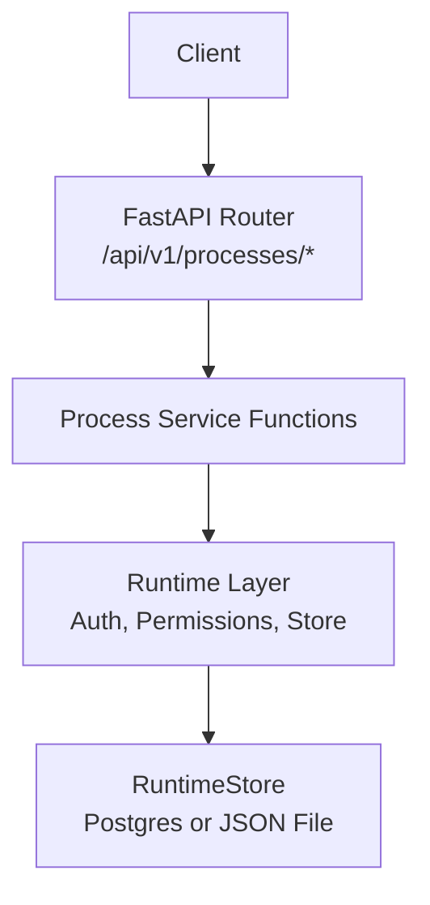
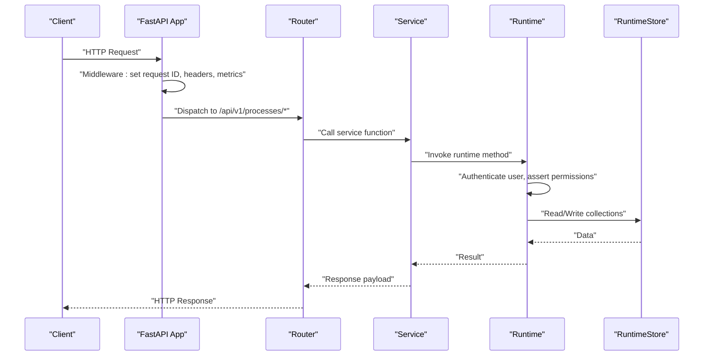
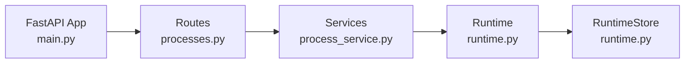

# Process Intelligence & Analytics API

<cite>
**Referenced Files in This Document**
- [main.py](file://backend/app/main.py)
- [processes.py](file://backend/app/api/v1/routes/processes.py)
- [process_service.py](file://backend/app/services/process_service.py)
- [runtime.py](file://backend/app/runtime.py)
- [event-log.schema.json](file://business/schemas/event-log.schema.json)
</cite>

## Table of Contents
1. [Introduction](#introduction)
2. [Project Structure](#project-structure)
3. [Core Components](#core-components)
4. [Architecture Overview](#architecture-overview)
5. [Detailed Component Analysis](#detailed-component-analysis)
6. [Dependency Analysis](#dependency-analysis)
7. [Performance Considerations](#performance-considerations)
8. [Troubleshooting Guide](#troubleshooting-guide)
9. [Conclusion](#conclusion)
10. [Appendices](#appendices)

## Introduction
This document provides detailed API documentation for the process intelligence and analytics endpoints. It covers event log ingestion, process discovery, conformance checking, bottleneck analysis, and related operational insights. The API is implemented as a FastAPI application with route handlers delegating to service functions that call into a runtime layer responsible for authentication, authorization, persistence, and business logic.

The API supports:
- Event log ingestion and listing
- Discovery of processes from stored events
- Conformance reports comparing observed behavior against expected models
- Bottleneck identification and performance metrics
- Operational insights such as approval delays, costs, and failures
- Artifact listing for generated process mining outputs

## Project Structure
The process intelligence feature spans several layers:
- HTTP routes define REST endpoints under a versioned router
- Service functions encapsulate domain operations
- Runtime layer implements authentication, permissions, persistence (Postgres or JSON file), and core business logic
- Schemas define validation rules for event logs

**Diagram sources**
- [main.py:16-52](file://backend/app/main.py#L16-L52)
- [processes.py:1-79](file://backend/app/api/v1/routes/processes.py#L1-79)
- [process_service.py:1-30](file://backend/app/services/process_service.py#L1-30)
- [runtime.py:258-393](file://backend/app/runtime.py#L258-L393)

**Section sources**
- [main.py:16-52](file://backend/app/main.py#L16-L52)
- [processes.py:1-79](file://backend/app/api/v1/routes/processes.py#L1-79)
- [process_service.py:1-30](file://backend/app/services/process_service.py#L1-30)
- [runtime.py:258-393](file://backend/app/runtime.py#L258-L393)

## Core Components
- API Routes: Define endpoints for event logs, discovered processes, conformance, artifacts, summary, metrics, workflow performance, bottlenecks, approval delays, costs, and failures.
- Services: Thin wrappers around runtime methods for readability and testability.
- Runtime: Central orchestrator providing authentication, permission checks, data access, and business logic for process intelligence features.

Key responsibilities:
- Authentication via bearer tokens or API keys
- Role-based permission enforcement
- Persistence abstraction over Postgres and JSON file fallback
- Business logic for process summaries, metrics, and analytics

**Section sources**
- [processes.py:1-79](file://backend/app/api/v1/routes/processes.py#L1-79)
- [process_service.py:1-30](file://backend/app/services/process_service.py#L1-30)
- [runtime.py:848-866](file://backend/app/runtime.py#L848-L866)
- [runtime.py:258-393](file://backend/app/runtime.py#L258-L393)

## Architecture Overview
The request flow for process intelligence endpoints:
- Client sends authenticated requests to /api/v1/processes/*
- FastAPI middleware sets request context and security headers
- Route handler validates input and delegates to service function
- Service calls runtime method which enforces permissions and persists/retrieves data
- Responses are returned with standardized headers and status codes

**Diagram sources**
- [main.py:27-48](file://backend/app/main.py#L27-L48)
- [processes.py:10-79](file://backend/app/api/v1/routes/processes.py#L10-L79)
- [process_service.py:4-29](file://backend/app/services/process_service.py#L4-L29)
- [runtime.py:848-866](file://backend/app/runtime.py#L848-L866)
- [runtime.py:385-393](file://backend/app/runtime.py#L385-L393)

## Detailed Component Analysis

### Event Log Ingestion and Listing
Endpoints:
- POST /api/v1/processes/event-logs
- GET /api/v1/processes/event-logs?process_id=&case_id=

Behavior:
- Ingests an event log record into the runtime store
- Lists event logs filtered by optional process_id and case_id
- Requires authentication; read operations require processes:read permission

Request body schema (ingestion):
- See Event Log Schema below

Query parameters (listing):
- process_id: string (optional)
- case_id: string (optional)

Response:
- Ingestion returns a result dict indicating success and metadata
- Listing returns an array of event log records

Security:
- Bearer token or API key required
- Permission check enforced at runtime layer

**Section sources**
- [processes.py:10-22](file://backend/app/api/v1/routes/processes.py#L10-L22)
- [process_service.py:1-30](file://backend/app/services/process_service.py#L1-30)
- [runtime.py:848-866](file://backend/app/runtime.py#L848-L866)

#### Event Log Schema
A strict JSON schema defines the structure of event logs used for process mining. Required fields include identifiers, timestamps, actor details, process and case IDs, activity description, input/output references, tools used, decision point flags, confidence, risk tier, human approval status, outcome metrics, and provenance.

Key properties:
- id: string
- timestamp: date-time
- actor_type: enum ["human", "agent", "system"]
- actor_id: string
- process_id: string
- case_id: string
- activity: string
- input_refs: array of strings
- output_refs: array of strings
- tools_used: array of strings
- decision_point: boolean
- decision_reason_summary: string
- confidence: number [0..1]
- risk_tier: enum ["tier_0_observe", "tier_1_recommend", "tier_2_draft", "tier_3_execute_reversible", "tier_4_execute_with_gate", "tier_5_restricted"]
- human_approved: boolean
- outcome: object with status, latency_minutes, quality_score
- provenance: object with source_refs, captured_by, recorded_at

Validation:
- Enforced by schema constraints on ingestion
- Missing or invalid fields will cause validation errors

**Section sources**
- [event-log.schema.json:1-156](file://business/schemas/event-log.schema.json#L1-L156)

### Process Discovery
Endpoint:
- GET /api/v1/processes/discovered

Behavior:
- Returns a list of discovered processes derived from event logs
- Requires authentication and processes:read permission

Response:
- Array of process objects containing identifiers and summary attributes

Use cases:
- Identify active processes across the organization
- Feed dashboards and downstream analytics

**Section sources**
- [processes.py:24-26](file://backend/app/api/v1/routes/processes.py#L24-L26)
- [runtime.py:848-866](file://backend/app/runtime.py#L848-L866)

### Conformance Checking
Endpoint:
- GET /api/v1/processes/conformance?process_id=

Behavior:
- Produces a conformance report comparing observed event logs against a reference model
- Optional process_id filters the scope of analysis
- Requires authentication and processes:read permission

Response:
- Dict containing conformance metrics, deviations, and recommendations

Operational insights:
- Highlights non-conforming paths
- Identifies frequent deviations and their impact

**Section sources**
- [processes.py:29-31](file://backend/app/api/v1/routes/processes.py#L29-L31)
- [runtime.py:848-866](file://backend/app/runtime.py#L848-L866)

### Bottleneck Analysis
Endpoint:
- GET /api/v1/processes/bottlenecks

Behavior:
- Analyzes event logs to identify steps or stages causing delays
- Requires authentication and processes:read permission

Response:
- Array of bottleneck entries with step names, average durations, and variance

Optimization recommendations:
- Prioritize high-latency steps
- Investigate resource constraints and handoffs

**Section sources**
- [processes.py:57-60](file://backend/app/api/v1/routes/processes.py#L57-L60)
- [process_service.py:16-17](file://backend/app/services/process_service.py#L16-L17)
- [runtime.py:848-866](file://backend/app/runtime.py#L848-L866)

### Summary, Metrics, Workflow Performance
Endpoints:
- GET /api/v1/processes/summary
- GET /api/v1/processes/metrics
- GET /api/v1/processes/workflow-performance

Behavior:
- Summary aggregates counts and averages per process
- Metrics provide time-series or aggregated KPIs
- Workflow performance breaks down performance by workflow instances

Responses:
- Summary: dict with process-level aggregates
- Metrics: array of metric records
- Workflow performance: array of workflow performance records

Permissions:
- All require processes:read

**Section sources**
- [processes.py:39-54](file://backend/app/api/v1/routes/processes.py#L39-L54)
- [process_service.py:4-13](file://backend/app/services/process_service.py#L4-L13)
- [runtime.py:848-866](file://backend/app/runtime.py#L848-L866)

### Approval Delays, Costs, Failures
Endpoints:
- GET /api/v1/processes/approval-delays
- GET /api/v1/processes/costs
- GET /api/v1/processes/failures

Behavior:
- Approval delays: quantifies wait times due to human approvals
- Costs: estimates cost drivers per process or step
- Failures: lists failed runs and reasons

Responses:
- Approval delays: dict with delay distributions
- Costs: dict with cost breakdowns
- Failures: array of failure records

Permissions:
- All require processes:read

**Section sources**
- [processes.py:63-78](file://backend/app/api/v1/routes/processes.py#L63-L78)
- [process_service.py:20-29](file://backend/app/services/process_service.py#L20-L29)
- [runtime.py:848-866](file://backend/app/runtime.py#L848-L866)

### Artifacts
Endpoint:
- GET /api/v1/processes/artifacts

Behavior:
- Lists generated artifacts from process mining (e.g., reports, models, visualizations)
- Requires authentication and processes:read permission

Response:
- Array of artifact descriptors including type, location, and metadata

**Section sources**
- [processes.py:34-36](file://backend/app/api/v1/routes/processes.py#L34-L36)
- [runtime.py:848-866](file://backend/app/runtime.py#L848-L866)

### Authentication and Authorization Flow
Authentication:
- Supports bearer tokens and API keys
- Tokens map to users; disabled or invited accounts are rejected

Authorization:
- Role-based permissions enforced via assertion helpers
- processes:read required for most analytics endpoints

Error handling:
- Unauthorized or invalid tokens raise permission errors
- Validation errors return structured responses

**Section sources**
- [runtime.py:848-866](file://backend/app/runtime.py#L848-L866)
- [runtime.py:93-129](file://backend/app/runtime.py#L93-L129)

## Dependency Analysis
High-level dependencies:
- Routes depend on services
- Services depend on runtime
- Runtime depends on store (Postgres or JSON)
- Middleware adds cross-cutting concerns (request ID, metrics, security headers)

**Diagram sources**
- [processes.py:1-79](file://backend/app/api/v1/routes/processes.py#L1-79)
- [process_service.py:1-30](file://backend/app/services/process_service.py#L1-30)
- [runtime.py:258-393](file://backend/app/runtime.py#L258-L393)
- [main.py:16-52](file://backend/app/main.py#L16-L52)

**Section sources**
- [processes.py:1-79](file://backend/app/api/v1/routes/processes.py#L1-79)
- [process_service.py:1-30](file://backend/app/services/process_service.py#L1-30)
- [runtime.py:258-393](file://backend/app/runtime.py#L258-L393)
- [main.py:16-52](file://backend/app/main.py#L16-L52)

## Performance Considerations
- Use query filters (process_id, case_id) to limit dataset size when listing event logs
- Cache frequently accessed summaries and metrics where appropriate
- Prefer batch ingestion for event logs to reduce overhead
- Monitor response times via built-in metrics collection in middleware
- Ensure database indexes exist on commonly filtered fields (process_id, case_id)

[No sources needed since this section provides general guidance]

## Troubleshooting Guide
Common issues:
- Invalid or missing bearer token: ensure correct Authorization header
- Permission denied: verify user role includes processes:read
- Validation errors: confirm event log conforms to schema
- Not found: check process_id or case_id values

Diagnostic tips:
- Inspect X-Request-ID in response headers for tracing
- Review audit logs for permission denials and validation failures
- Validate payloads against the event log schema before submission

**Section sources**
- [runtime.py:93-129](file://backend/app/runtime.py#L93-L129)
- [event-log.schema.json:1-156](file://business/schemas/event-log.schema.json#L1-L156)

## Conclusion
The Process Intelligence & Analytics API provides a comprehensive set of endpoints for ingesting event logs, discovering processes, checking conformance, analyzing bottlenecks, and delivering operational insights. With robust authentication, role-based permissions, and flexible persistence, it supports both development and production scenarios. Adhering to the event log schema ensures consistent data for accurate analytics and actionable recommendations.

[No sources needed since this section summarizes without analyzing specific files]

## Appendices

### API Endpoints Reference
- POST /api/v1/processes/event-logs
  - Description: Ingest an event log record
  - Auth: Required
  - Body: Event log conforming to schema
  - Response: Result dict
- GET /api/v1/processes/event-logs
  - Description: List event logs
  - Query: process_id, case_id (optional)
  - Auth: Required
  - Response: Array of event logs
- GET /api/v1/processes/discovered
  - Description: List discovered processes
  - Auth: Required
  - Response: Array of process objects
- GET /api/v1/processes/conformance
  - Description: Generate conformance report
  - Query: process_id (optional)
  - Auth: Required
  - Response: Dict with conformance metrics
- GET /api/v1/processes/artifacts
  - Description: List generated artifacts
  - Auth: Required
  - Response: Array of artifact descriptors
- GET /api/v1/processes/summary
  - Description: Process summary aggregates
  - Auth: Required
  - Response: Dict
- GET /api/v1/processes/metrics
  - Description: Process metrics
  - Auth: Required
  - Response: Array of metrics
- GET /api/v1/processes/workflow-performance
  - Description: Workflow performance breakdown
  - Auth: Required
  - Response: Array of performance records
- GET /api/v1/processes/bottlenecks
  - Description: Bottleneck analysis
  - Auth: Required
  - Response: Array of bottleneck entries
- GET /api/v1/processes/approval-delays
  - Description: Approval delay analysis
  - Auth: Required
  - Response: Dict with delay distributions
- GET /api/v1/processes/costs
  - Description: Cost analysis
  - Auth: Required
  - Response: Dict with cost breakdowns
- GET /api/v1/processes/failures
  - Description: Failure analysis
  - Auth: Required
  - Response: Array of failure records

**Section sources**
- [processes.py:10-79](file://backend/app/api/v1/routes/processes.py#L10-L79)

### Example Workflows
- Process Mining Workflow
  - Ingest event logs using POST /api/v1/processes/event-logs
  - Discover processes via GET /api/v1/processes/discovered
  - Check conformance using GET /api/v1/processes/conformance
  - Analyze bottlenecks with GET /api/v1/processes/bottlenecks
  - Retrieve artifacts via GET /api/v1/processes/artifacts
- Real-Time Monitoring
  - Periodically poll GET /api/v1/processes/metrics and GET /api/v1/processes/workflow-performance
  - Alert on threshold breaches identified in metrics
- Optimization Recommendations
  - Use bottleneck analysis results to prioritize improvements
  - Review approval delays to streamline human gates
  - Examine costs to identify expensive steps

[No sources needed since this section doesn't analyze specific files]