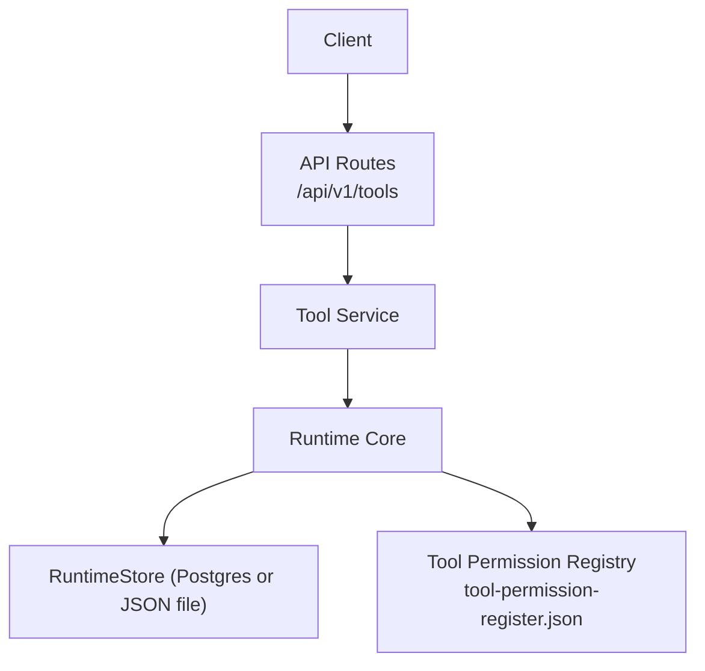
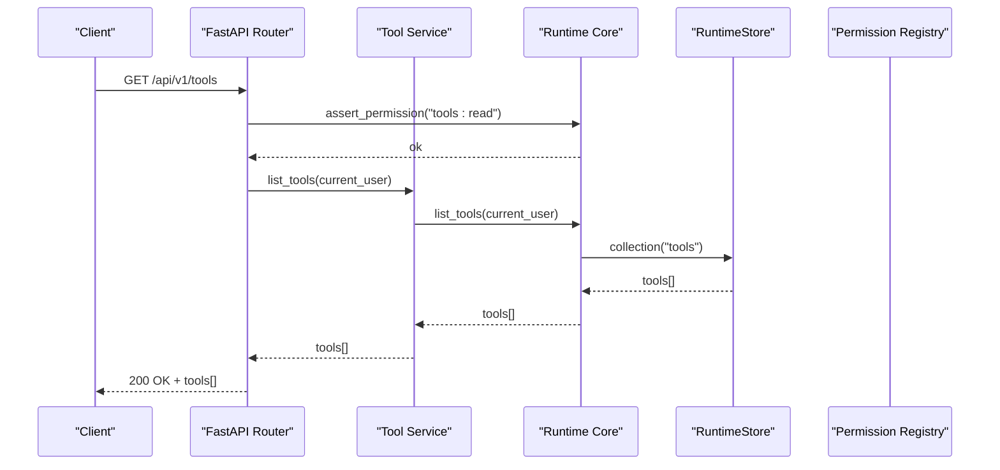
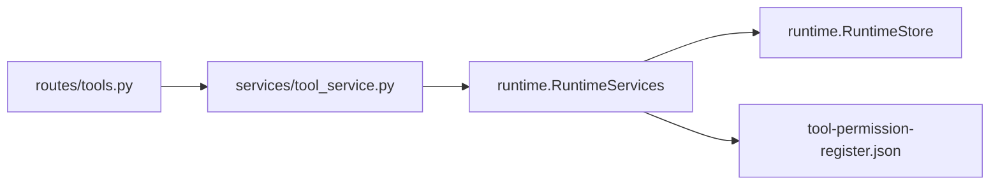
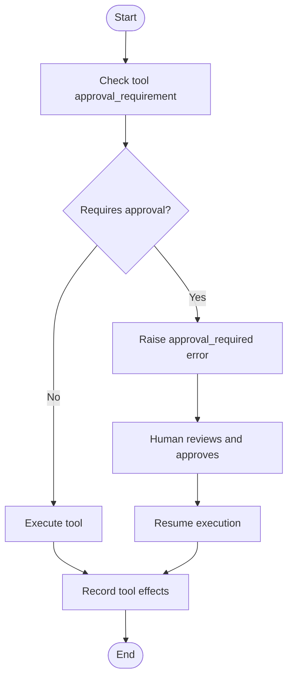

# Tools & Integrations API

<cite>
**Referenced Files in This Document**
- [tools.py](file://backend/app/api/v1/routes/tools.py)
- [tool_service.py](file://backend/app/services/tool_service.py)
- [runtime.py](file://backend/app/runtime.py)
- [tool-permission-register.json](file://business/security/tool-permissions/tool-permission-register.json)
</cite>

## Table of Contents
1. [Introduction](#introduction)
2. [Project Structure](#project-structure)
3. [Core Components](#core-components)
4. [Architecture Overview](#architecture-overview)
5. [Detailed Component Analysis](#detailed-component-analysis)
6. [Dependency Analysis](#dependency-analysis)
7. [Performance Considerations](#performance-considerations)
8. [Troubleshooting Guide](#troubleshooting-guide)
9. [Conclusion](#conclusion)
10. [Appendices](#appendices)

## Introduction
This document provides comprehensive API documentation for the tool adapter system and external integrations. It covers tool registration, capability discovery, permission management, execution controls, human approval gates, effect recording, audit trails, and security sandboxing mechanisms. The goal is to enable developers to integrate custom adapters safely and reliably while maintaining governance and observability.

## Project Structure
The tooling subsystem spans a small set of focused components:
- API routes expose CRUD endpoints for tools with role-based access control.
- A thin service layer delegates to the runtime core.
- The runtime orchestrates authentication, authorization, tool discovery, and persistence.
- Tool permissions are declared declaratively via a JSON registry that seeds tool definitions at startup.

**Diagram sources**
- [tools.py:1-36](file://backend/app/api/v1/routes/tools.py#L1-L36)
- [tool_service.py:1-22](file://backend/app/services/tool_service.py#L1-L22)
- [runtime.py:1397-1450](file://backend/app/runtime.py#L1397-L1450)
- [tool-permission-register.json:1-74](file://business/security/tool-permissions/tool-permission-register.json#L1-L74)

**Section sources**
- [tools.py:1-36](file://backend/app/api/v1/routes/tools.py#L1-L36)
- [tool_service.py:1-22](file://backend/app/services/tool_service.py#L1-L22)
- [runtime.py:1397-1450](file://backend/app/runtime.py#L1397-L1450)
- [tool-permission-register.json:1-74](file://business/security/tool-permissions/tool-permission-register.json#L1-L74)

## Core Components
- API Layer: FastAPI router exposing GET, POST, PATCH, DELETE for tools. Enforces role-based permissions before delegating to services.
- Service Layer: Thin wrappers around runtime methods for listing, retrieving, creating, updating status, and archiving tools.
- Runtime Core: Implements authentication, RBAC, tool discovery from the permission registry, seeding of default tools, and persistence via RuntimeStore.
- Permission Registry: Declarative JSON defining allowed actions, scopes, expiration, and human gate requirements per tool.

Key responsibilities:
- Capability discovery: Tools are seeded from the permission registry into the runtime store.
- Permission management: Role-based checks on endpoints; tool-level required_permissions and approval_requirement influence execution gating.
- Execution controls: Approval requirement detection and memory scope enforcement are implemented in the runtime.
- Audit trails: Authentication events and other operations append audit records through runtime helpers.

**Section sources**
- [tools.py:1-36](file://backend/app/api/v1/routes/tools.py#L1-L36)
- [tool_service.py:1-22](file://backend/app/services/tool_service.py#L1-L22)
- [runtime.py:1397-1450](file://backend/app/runtime.py#L1397-L1450)
- [tool-permission-register.json:1-74](file://business/security/tool-permissions/tool-permission-register.json#L1-L74)

## Architecture Overview
The tooling architecture integrates three layers:
- Presentation: REST endpoints for tool management.
- Orchestration: Runtime enforces identity, roles, and policy.
- Persistence: RuntimeStore abstracts Postgres or JSON file storage.

**Diagram sources**
- [tools.py:11-14](file://backend/app/api/v1/routes/tools.py#L11-L14)
- [tool_service.py:4-6](file://backend/app/services/tool_service.py#L4-L6)
- [runtime.py:1397-1400](file://backend/app/runtime.py#L1397-L1400)
- [runtime.py:868-871](file://backend/app/runtime.py#L868-L871)

## Detailed Component Analysis

### Tool Management API
Endpoints:
- GET /api/v1/tools: List all tools visible to the current user’s organization. Requires tools:read.
- POST /api/v1/tools: Create a new tool definition. Accepts a structured request body.
- GET /api/v1/tools/{tool_id}: Retrieve a specific tool by ID. Requires tools:read.
- PATCH /api/v1/tools/{tool_id}: Update tool status (enabled/disabled).
- DELETE /api/v1/tools/{tool_id}: Archive a tool.

Behavior:
- All endpoints enforce authentication and role-based permissions via the runtime.
- Creation uses a typed request model to validate inputs.
- Status updates toggle enabled flags atomically.
- Archival marks tools inactive without deleting them.

Request/Response schemas:
- ToolCreateRequest: Typed payload for creation (fields validated by Pydantic).
- StatusUpdateRequest: Contains an optional boolean flag to update enabled state.
- Responses return tool objects conforming to the internal tool schema.

Security:
- Each endpoint calls runtime.assert_permission with appropriate resource permissions.
- Organization scoping is enforced by the runtime when reading collections.

Operational notes:
- Changes persist via RuntimeStore.save() after mutations.
- Audit logs are appended for relevant operations within the runtime.

**Section sources**
- [tools.py:1-36](file://backend/app/api/v1/routes/tools.py#L1-L36)
- [tool_service.py:1-22](file://backend/app/services/tool_service.py#L1-L22)
- [runtime.py:862-866](file://backend/app/runtime.py#L862-L866)

### Tool Registration and Capability Discovery
Tools are registered declaratively using a permission registry. At bootstrap, the runtime loads this registry and seeds tool entries into the runtime store.

Registration fields:
- tool: Unique identifier for the tool.
- allowed_actions: Array of permitted actions for the tool.
- scope: Bounded context or environment where the tool can operate.
- expires_after_minutes: Optional time-bound validity window.
- requires_human_gate_for: Actions requiring human approval.

Seeding behavior:
- The runtime constructs tool records with metadata such as category, input/output schemas, risk_level, required_permissions, approval_requirement, timeout, retry_policy, enabled, allowed_actions, and scope.
- Default stub tools are added if not present in the registry to ensure baseline capabilities.

Discovery:
- Clients call the list endpoint to discover available tools.
- The runtime filters results by organization scope.

**Section sources**
- [tool-permission-register.json:1-74](file://business/security/tool-permissions/tool-permission-register.json#L1-L74)
- [runtime.py:466-517](file://backend/app/runtime.py#L466-L517)
- [runtime.py:1397-1400](file://backend/app/runtime.py#L1397-L1400)

### Permission Management and Human Approval Gates
Role-based permissions:
- Roles define sets of permissions (e.g., tools:read, workflows:execute).
- Endpoints assert required permissions before proceeding.

Tool-level permissions:
- Each tool record includes required_permissions and approval_requirement.
- The runtime determines whether a tool requires human approval based on its configuration.

Memory scope enforcement:
- Agents may be restricted to specific memory scopes; writes outside allowed scopes are denied and audited.

Approval flow:
- When a tool requires approval, the runtime raises an approval-required error, prompting a human review step before execution proceeds.

**Section sources**
- [runtime.py:140-222](file://backend/app/runtime.py#L140-L222)
- [runtime.py:884-892](file://backend/app/runtime.py#L884-L892)
- [runtime.py:903-935](file://backend/app/runtime.py#L903-L935)

### Execution Controls and Effect Recording
Execution controls:
- Tools carry timeouts and retry policies.
- Approval requirement is evaluated prior to execution.
- Memory scope checks prevent unauthorized data access.

Effect recording:
- The runtime maintains a tool_effects collection to record outcomes of tool executions.
- These effects can be queried for auditing and analysis.

Audit trails:
- Authentication events (login/logout), user management, and other sensitive operations append audit records.
- Audits include actor, action, target, and outcome.

**Section sources**
- [runtime.py:225-255](file://backend/app/runtime.py#L225-L255)
- [runtime.py:937-975](file://backend/app/runtime.py#L937-L975)

### Security Sandboxing Mechanisms
- Scope-bounded tool operation: Tools declare a scope limiting their operational context.
- Time-bound validity: Tools can expire after a configured number of minutes.
- Action whitelisting: Only explicitly allowed_actions are executable.
- Human gates: High-risk actions require human approval before execution.
- Memory scoping: Agents can only read/write within permitted scopes.

These mechanisms collectively constrain tool behavior to safe, auditable boundaries.

**Section sources**
- [tool-permission-register.json:1-74](file://business/security/tool-permissions/tool-permission-register.json#L1-L74)
- [runtime.py:903-935](file://backend/app/runtime.py#L903-L935)

## Dependency Analysis
The following diagram shows how the API routes depend on the service layer and runtime core, which in turn interact with persistence and the permission registry.

**Diagram sources**
- [tools.py:1-36](file://backend/app/api/v1/routes/tools.py#L1-L36)
- [tool_service.py:1-22](file://backend/app/services/tool_service.py#L1-L22)
- [runtime.py:1397-1450](file://backend/app/runtime.py#L1397-L1450)
- [tool-permission-register.json:1-74](file://business/security/tool-permissions/tool-permission-register.json#L1-L74)

**Section sources**
- [tools.py:1-36](file://backend/app/api/v1/routes/tools.py#L1-L36)
- [tool_service.py:1-22](file://backend/app/services/tool_service.py#L1-L22)
- [runtime.py:1397-1450](file://backend/app/runtime.py#L1397-L1450)
- [tool-permission-register.json:1-74](file://business/security/tool-permissions/tool-permission-register.json#L1-L74)

## Performance Considerations
- Use Postgres-backed RuntimeStore for production workloads to avoid file I/O bottlenecks.
- Keep tool lists lean by filtering at the server side based on organization scope.
- Cache frequently accessed tool metadata in clients to reduce repeated requests.
- Avoid excessive polling; prefer event-driven updates where possible.

[No sources needed since this section provides general guidance]

## Troubleshooting Guide
Common issues and resolutions:
- Permission denied errors: Ensure the caller has the required role and organization-scoped access. Verify tools:read or other required permissions.
- Approval required errors: Some tools require human approval; initiate the approval workflow before executing the tool.
- Not found errors: Confirm the tool_id exists and belongs to the caller’s organization.
- Validation errors: Check request payloads against ToolCreateRequest and StatusUpdateRequest schemas.

Operational tips:
- Inspect audit logs for authentication and user management events.
- Review tool_effects for execution outcomes and failures.
- Validate the permission registry for correct allowed_actions and scope definitions.

**Section sources**
- [runtime.py:862-866](file://backend/app/runtime.py#L862-L866)
- [runtime.py:937-975](file://backend/app/runtime.py#L937-L975)

## Conclusion
The tool adapter system provides a secure, governed, and observable way to register, discover, and execute tools across external integrations. By combining role-based access control, declarative permissions, human approval gates, and comprehensive audit trails, it ensures safe automation while enabling extensibility through custom adapters.

[No sources needed since this section summarizes without analyzing specific files]

## Appendices

### API Reference: Tool Management
- GET /api/v1/tools
  - Purpose: List tools for the current organization.
  - Auth: Bearer token or API key.
  - Permissions: tools:read.
  - Response: Array of tool objects.

- POST /api/v1/tools
  - Purpose: Create a new tool definition.
  - Auth: Bearer token or API key.
  - Permissions: tools:create.
  - Request: ToolCreateRequest.
  - Response: Created tool object.

- GET /api/v1/tools/{tool_id}
  - Purpose: Retrieve a specific tool.
  - Auth: Bearer token or API key.
  - Permissions: tools:read.
  - Response: Tool object.

- PATCH /api/v1/tools/{tool_id}
  - Purpose: Update tool status (enabled/disabled).
  - Auth: Bearer token or API key.
  - Permissions: tools:update.
  - Request: StatusUpdateRequest.
  - Response: Updated tool object.

- DELETE /api/v1/tools/{tool_id}
  - Purpose: Archive a tool.
  - Auth: Bearer token or API key.
  - Permissions: tools:update.
  - Response: Archived tool object.

**Section sources**
- [tools.py:11-35](file://backend/app/api/v1/routes/tools.py#L11-L35)
- [tool_service.py:4-22](file://backend/app/services/tool_service.py#L4-L22)

### Data Models and Schemas
- ToolCreateRequest: Typed request for creating tools.
- StatusUpdateRequest: Typed request for toggling tool enabled status.
- Tool object: Internal representation including id, name, description, category, input/output schemas, risk_level, required_permissions, approval_requirement, timeout, retry_policy, enabled, allowed_actions, and scope.

**Section sources**
- [tools.py:5-6](file://backend/app/api/v1/routes/tools.py#L5-L6)
- [runtime.py:466-517](file://backend/app/runtime.py#L466-L517)

### Custom Adapter Development Guide
Steps:
- Define your adapter’s capabilities and actions in the permission registry.
- Ensure the runtime seeds your tool entry during bootstrap.
- Implement execution logic in your adapter module, respecting timeouts, retries, and approval gates.
- Record tool effects and emit audit events as needed.
- Test with different roles and scopes to verify permission enforcement.

Best practices:
- Limit allowed_actions to the minimum necessary.
- Use scopes to bound operational contexts.
- Configure expires_after_minutes for short-lived operations.
- Require human gates for high-risk actions.

**Section sources**
- [tool-permission-register.json:1-74](file://business/security/tool-permissions/tool-permission-register.json#L1-L74)
- [runtime.py:466-517](file://backend/app/runtime.py#L466-L517)

### Permission-Based Tool Access Examples
- Read-only access: Users with viewer or operator roles can list tools but cannot create or update.
- Write access: Admin or owner roles can create and update tools.
- Execution gating: Tools marked with approval_requirement trigger human approval flows before execution.

**Section sources**
- [runtime.py:140-222](file://backend/app/runtime.py#L140-L222)
- [runtime.py:884-892](file://backend/app/runtime.py#L884-L892)

### Human Approval Gates Flow

**Diagram sources**
- [runtime.py:884-892](file://backend/app/runtime.py#L884-L892)
- [runtime.py:225-255](file://backend/app/runtime.py#L225-L255)