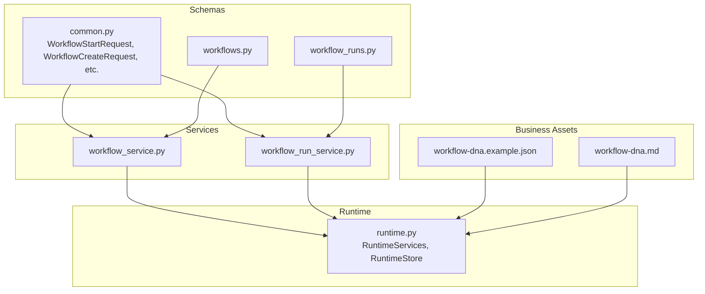
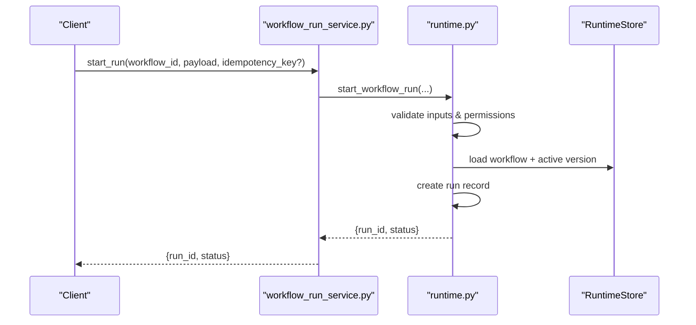
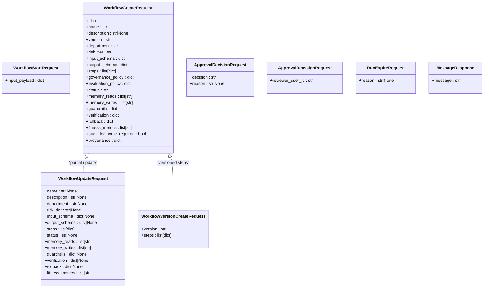
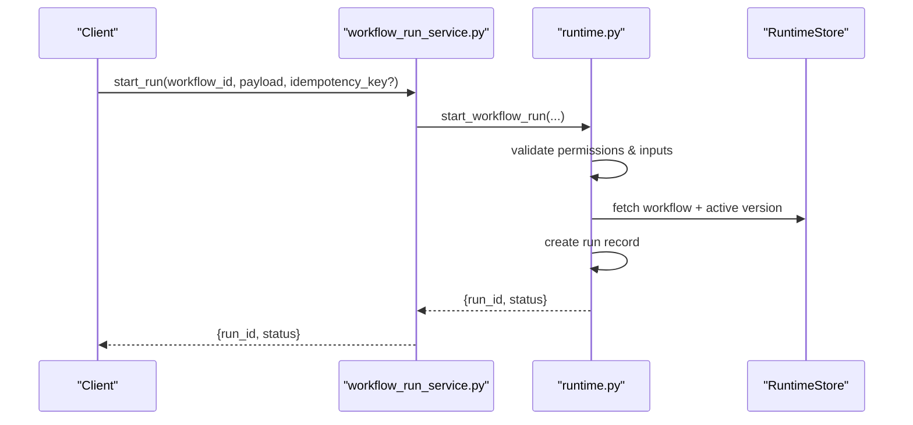
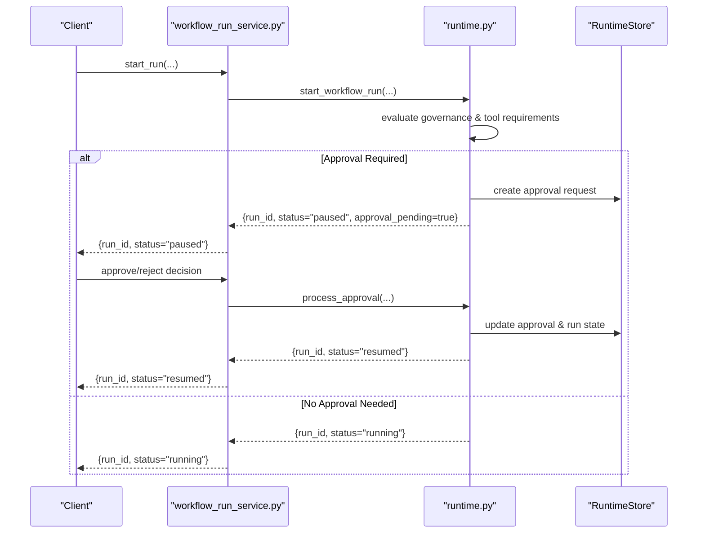
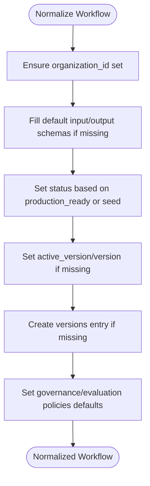
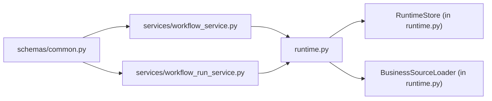

# Workflows API

<cite>
**Referenced Files in This Document**
- [runtime.py](file://backend/app/runtime.py)
- [workflow_service.py](file://backend/app/services/workflow_service.py)
- [workflow_run_service.py](file://backend/app/services/workflow_run_service.py)
- [common.py](file://backend/app/schemas/common.py)
- [workflows.py](file://backend/app/schemas/workflows.py)
- [workflow_runs.py](file://backend/app/schemas/workflow_runs.py)
- [workflow-dna.example.json](file://business/examples/workflow-dna.example.json)
- [workflow-dna.md](file://docs/workflow-dna.md)
</cite>

## Table of Contents
1. [Introduction](#introduction)
2. [Project Structure](#project-structure)
3. [Core Components](#core-components)
4. [Architecture Overview](#architecture-overview)
5. [Detailed Component Analysis](#detailed-component-analysis)
6. [Dependency Analysis](#dependency-analysis)
7. [Performance Considerations](#performance-considerations)
8. [Troubleshooting Guide](#troubleshooting-guide)
9. [Conclusion](#conclusion)
10. [Appendices](#appendices)

## Introduction
This document provides comprehensive API documentation for workflow definition and execution endpoints, focusing on:
- Workflow DNA management and version control
- Execution initiation, progress tracking, and result retrieval
- Approval workflows and human gates
- Real-time streaming and event-driven notifications
- Orchestration patterns including parallel execution, error handling, and rollback

The backend exposes service-layer functions that delegate to a runtime engine responsible for persistence (Postgres or JSON file), business logic, and execution orchestration. Schemas define request/response contracts for workflows and runs.

## Project Structure
At a high level, the relevant components are organized as follows:
- Schemas: Pydantic models defining request/response payloads for workflows and runs
- Services: Thin wrappers around runtime operations for listing, creating, updating, and executing workflows and runs
- Runtime: Core engine providing state management, persistence, normalization, and execution primitives

**Diagram sources**
- [common.py](file://backend/app/schemas/common.py)
- [workflows.py](file://backend/app/schemas/workflows.py)
- [workflow_runs.py](file://backend/app/schemas/workflow_runs.py)
- [workflow_service.py](file://backend/app/services/workflow_service.py)
- [workflow_run_service.py](file://backend/app/services/workflow_run_service.py)
- [runtime.py](file://backend/app/runtime.py)
- [workflow-dna.example.json](file://business/examples/workflow-dna.example.json)
- [workflow-dna.md](file://docs/workflow-dna.md)

**Section sources**
- [workflow_service.py](file://backend/app/services/workflow_service.py)
- [workflow_run_service.py](file://backend/app/services/workflow_run_service.py)
- [runtime.py](file://backend/app/runtime.py)
- [common.py](file://backend/app/schemas/common.py)
- [workflows.py](file://backend/app/schemas/workflows.py)
- [workflow_runs.py](file://backend/app/schemas/workflow_runs.py)
- [workflow-dna.example.json](file://business/examples/workflow-dna.example.json)
- [workflow-dna.md](file://docs/workflow-dna.md)

## Core Components
- Schemas
  - WorkflowStartRequest: Input payload for starting a run
  - WorkflowCreateRequest/WorkflowUpdateRequest/WorkflowVersionCreateRequest: Definition and versioning contracts
  - MessageResponse: Generic response envelope
- Services
  - workflow_service.py: CRUD and lifecycle operations for workflows and versions
  - workflow_run_service.py: Run lifecycle operations (start, list, get, cancel, pause/resume, expire, retry)
- Runtime
  - RuntimeServices: Bootstrapping, normalization, and core operations exposed by services
  - RuntimeStore: Persistent store abstraction over Postgres or JSON file with thread-safe access

Key responsibilities:
- Validation and normalization of workflow definitions and versions
- Version activation and deactivation
- Run creation with idempotency support
- Human gate enforcement via approvals
- Event emission for real-time streaming

**Section sources**
- [common.py](file://backend/app/schemas/common.py)
- [workflows.py](file://backend/app/schemas/workflows.py)
- [workflow_runs.py](file://backend/app/schemas/workflow_runs.py)
- [workflow_service.py](file://backend/app/services/workflow_service.py)
- [workflow_run_service.py](file://backend/app/services/workflow_run_service.py)
- [runtime.py](file://backend/app/runtime.py)

## Architecture Overview
The API surface is implemented through service functions that call into the runtime engine. The runtime manages state, persists data, and orchestrates execution.

**Diagram sources**
- [workflow_run_service.py](file://backend/app/services/workflow_run_service.py)
- [runtime.py](file://backend/app/runtime.py)

## Detailed Component Analysis

### Workflow Definition and Version Control APIs
These endpoints manage workflow DNA, including creation, updates, versioning, activation, and archival.

- List workflows
  - Purpose: Retrieve all workflows visible to the current user
  - Service function: list_workflows
- Get workflow
  - Purpose: Retrieve a specific workflow by ID
  - Service function: get_workflow
- List workflow versions
  - Purpose: Retrieve all versions of a workflow
  - Service function: list_workflow_versions
- Create workflow
  - Purpose: Create a new workflow definition
  - Request schema: WorkflowCreateRequest
  - Service function: create_workflow
- Update workflow
  - Purpose: Update fields of an existing workflow
  - Request schema: WorkflowUpdateRequest
  - Service function: update_workflow
- Add workflow version
  - Purpose: Append a new immutable version with steps
  - Request schema: WorkflowVersionCreateRequest
  - Service function: add_workflow_version
- Activate workflow version
  - Purpose: Set the active version for execution
  - Service function: activate_workflow_version
- Disable workflow
  - Purpose: Mark workflow as disabled
  - Service function: disable_workflow
- Archive workflow
  - Purpose: Archive a workflow (non-deletion)
  - Service function: archive_workflow

Notes:
- All service functions accept AuthenticatedUser and delegate to runtime methods.
- Normalization ensures required fields like input/output schemas, governance policy, and versions exist even if partially defined.

**Section sources**
- [workflow_service.py](file://backend/app/services/workflow_service.py)
- [runtime.py](file://backend/app/runtime.py)
- [common.py](file://backend/app/schemas/common.py)

#### Workflow DNA Schema Reference
- WorkflowCreateRequest fields include:
  - id, name, description, version, department, risk_tier
  - input_schema, output_schema
  - steps (list of step definitions)
  - governance_policy, evaluation_policy
  - status, memory_reads, memory_writes
  - guardrails, verification, rollback
  - fitness_metrics, audit_log_write_required, provenance
- WorkflowUpdateRequest allows partial updates to many of the above fields.
- WorkflowVersionCreateRequest includes version and steps.

Example DNA structure:
- See example workflow DNA under business examples for a complete model of steps, tools, agents, human gates, verification, rollback, and metrics.

**Section sources**
- [common.py](file://backend/app/schemas/common.py)
- [workflow-dna.example.json](file://business/examples/workflow-dna.example.json)
- [workflow-dna.md](file://docs/workflow-dna.md)

### Execution Initiation and Run Management APIs
These endpoints handle run lifecycle operations.

- Start run
  - Purpose: Start a workflow run with optional idempotency key
  - Request schema: WorkflowStartRequest
  - Service function: start_run
- List runs
  - Purpose: Retrieve runs visible to the current user
  - Service function: list_runs
- Get run
  - Purpose: Retrieve a specific run by ID
  - Service function: get_run
- Get run steps
  - Purpose: Retrieve step states for a run
  - Service function: get_run_steps
- Dispatch queued runs
  - Purpose: Trigger dispatch of queued runs
  - Service function: dispatch_runs
- Cancel run
  - Purpose: Cancel a running or pending run
  - Service function: cancel_run
- Pause run
  - Purpose: Pause a running run (e.g., awaiting approval)
  - Service function: pause_run
- Resume run
  - Purpose: Resume a paused run
  - Service function: resume_run
- Expire run
  - Purpose: Expire a run with optional reason
  - Request schema: RunExpireRequest
  - Service function: expire_run
- Retry run
  - Purpose: Retry a failed run
  - Service function: retry_run

Notes:
- Idempotency: start_run supports an optional idempotency_key to prevent duplicate executions.
- Human gates: Irreversible steps may require approval; runs can be paused until approved.

**Section sources**
- [workflow_run_service.py](file://backend/app/services/workflow_run_service.py)
- [common.py](file://backend/app/schemas/common.py)

### Approval Workflows and Human Gates
- ApprovalDecisionRequest: Approve or reject with optional reason
- ApprovalReassignRequest: Reassign approval to another reviewer

Integration points:
- Governance policies and tool configurations determine when human gates are triggered.
- Runs transition to paused states when approvals are required.

**Section sources**
- [common.py](file://backend/app/schemas/common.py)
- [runtime.py](file://backend/app/runtime.py)

### Real-Time Streaming and Event-Driven Notifications
- The runtime maintains a stream_events collection used for emitting events during execution.
- Clients can subscribe to stream events to receive real-time progress updates.
- Notifications are also maintained in the runtime state for asynchronous delivery.

Operational notes:
- Events are emitted as steps execute, approvals occur, and terminal statuses are reached.
- Use the stream_events collection to implement server-sent events or polling-based updates.

**Section sources**
- [runtime.py](file://backend/app/runtime.py)

### Error Handling and Status Codes
Common error types surfaced by the runtime:
- NotFoundError: Resource not found (404)
- PermissionDeniedError: Insufficient permissions (403)
- ApprovalRequiredError: Action requires human approval (409)
- ValidationError: Invalid input or state (422)
- RateLimitedError: Too many requests (429)

Recommendations:
- Handle these errors at the client layer and present actionable messages.
- For ApprovalRequiredError, prompt users to approve or reassign.

**Section sources**
- [runtime.py](file://backend/app/runtime.py)

### Data Models Diagram

**Diagram sources**
- [common.py](file://backend/app/schemas/common.py)

### Sequence Diagrams

#### Start Run Flow

**Diagram sources**
- [workflow_run_service.py](file://backend/app/services/workflow_run_service.py)
- [runtime.py](file://backend/app/runtime.py)

#### Approval Gate Flow

**Diagram sources**
- [workflow_run_service.py](file://backend/app/services/workflow_run_service.py)
- [runtime.py](file://backend/app/runtime.py)

### Flowcharts

#### Workflow Normalization and Versioning

**Diagram sources**
- [runtime.py](file://backend/app/runtime.py)

## Dependency Analysis
- Services depend on runtime methods for all operations.
- Runtime depends on RuntimeStore for persistence and BusinessSourceLoader for seeding and normalization.
- Schemas provide strict validation for requests and responses.

**Diagram sources**
- [common.py](file://backend/app/schemas/common.py)
- [workflow_service.py](file://backend/app/services/workflow_service.py)
- [workflow_run_service.py](file://backend/app/services/workflow_run_service.py)
- [runtime.py](file://backend/app/runtime.py)

**Section sources**
- [workflow_service.py](file://backend/app/services/workflow_service.py)
- [workflow_run_service.py](file://backend/app/services/workflow_run_service.py)
- [runtime.py](file://backend/app/runtime.py)
- [common.py](file://backend/app/schemas/common.py)

## Performance Considerations
- Persistence: Prefer Postgres for concurrent workloads; fallback to JSON file for local development.
- Thread safety: RuntimeStore uses locks to ensure safe concurrent access.
- Normalization: Avoid redundant writes by normalizing only missing fields.
- Idempotency: Use idempotency keys for start_run to prevent duplicate executions under retries.

[No sources needed since this section provides general guidance]

## Troubleshooting Guide
Common issues and resolutions:
- Not Found: Verify workflow/run IDs and permissions.
- Permission Denied: Ensure the user role has required permissions (e.g., workflows:execute).
- Approval Required: Provide approval decisions or reassign reviewers.
- Validation Errors: Check request payloads against schema definitions.
- Rate Limiting: Implement backoff and respect retry-after headers.

**Section sources**
- [runtime.py](file://backend/app/runtime.py)

## Conclusion
The Workflows API provides robust capabilities for defining, versioning, executing, and monitoring workflows with strong governance and observability. By leveraging schemas, services, and the runtime engine, clients can build reliable automation pipelines with human oversight, real-time updates, and comprehensive auditability.

[No sources needed since this section summarizes without analyzing specific files]

## Appendices

### Example Workflow DNA
A flagship example demonstrates a multi-step workflow with human gates, verification, and rollback planning.

**Section sources**
- [workflow-dna.example.json](file://business/examples/workflow-dna.example.json)
- [workflow-dna.md](file://docs/workflow-dna.md)