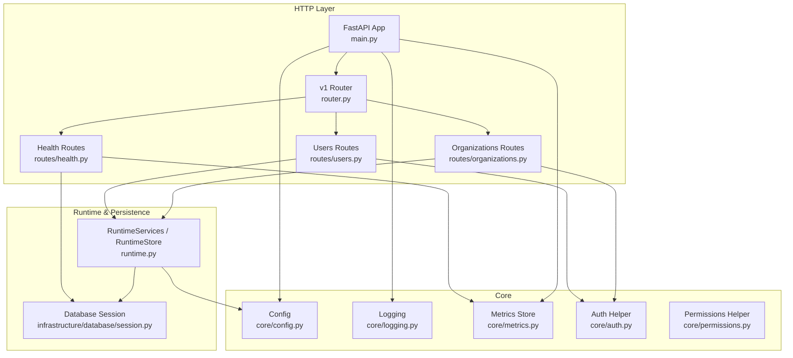
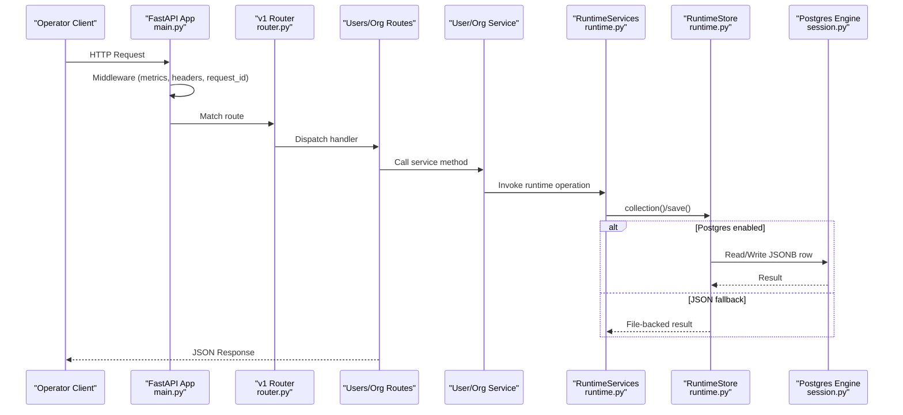
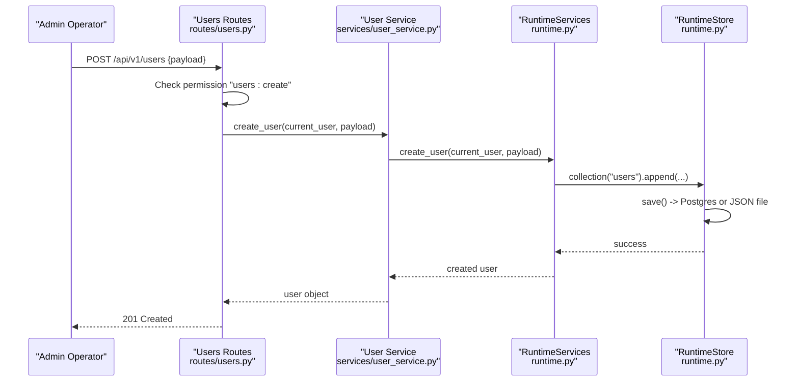
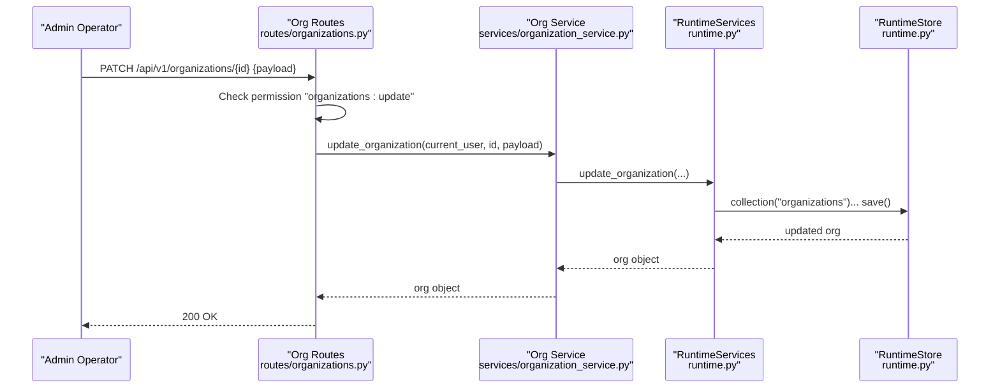
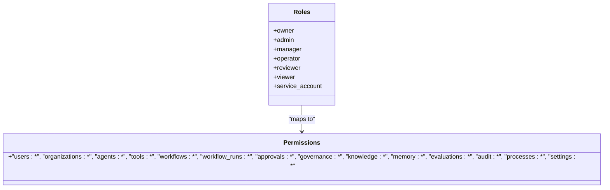
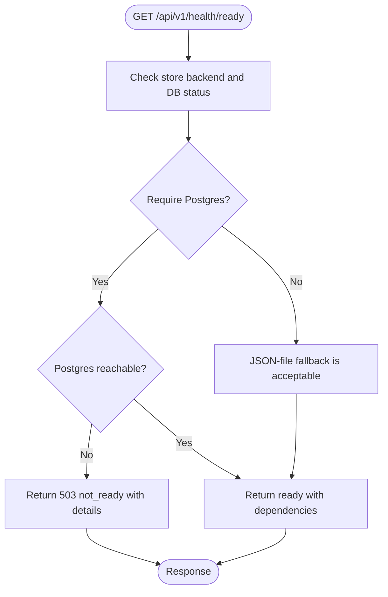
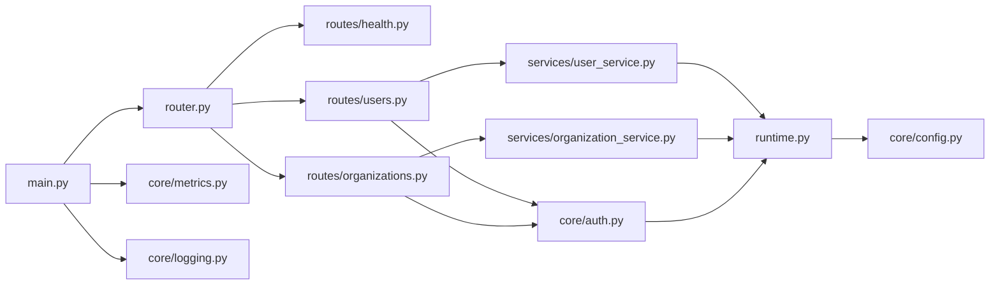

# Administration Guide

<cite>
**Referenced Files in This Document**
- [main.py](file://backend/app/main.py)
- [config.py](file://backend/app/core/config.py)
- [auth.py](file://backend/app/core/auth.py)
- [permissions.py](file://backend/app/core/permissions.py)
- [runtime.py](file://backend/app/runtime.py)
- [router.py](file://backend/app/api/v1/router.py)
- [health.py](file://backend/app/api/v1/routes/health.py)
- [metrics.py](file://backend/app/core/metrics.py)
- [logging.py](file://backend/app/core/logging.py)
- [users.py](file://backend/app/api/v1/routes/users.py)
- [user_service.py](file://backend/app/services/user_service.py)
- [organizations.py](file://backend/app/api/v1/routes/organizations.py)
- [organization_service.py](file://backend/app/services/organization_service.py)
- [create_admin.py](file://backend/scripts/create_admin.py)
</cite>

## Table of Contents
1. Introduction
2. Project Structure
3. Core Components
4. Architecture Overview
5. Detailed Component Analysis
6. Dependency Analysis
7. Performance Considerations
8. Troubleshooting Guide
9. Conclusion

## Introduction
This Administration Guide provides system operators with authoritative procedures and references for managing users, organizations, roles, and permissions; monitoring health and performance; performing backups and recovery; maintaining the database; planning disaster recovery; troubleshooting common issues; analyzing logs; and hardening security and compliance posture. It maps operational tasks to concrete backend components and endpoints so operators can act confidently in production environments.

## Project Structure
The administrative surface is implemented as a FastAPI application with:
- API routing under v1
- Services delegating to a runtime layer that manages state (Postgres or JSON file fallback)
- Health, metrics, logging, configuration, authentication, and authorization modules

**Diagram sources**
- [main.py:1-52](file://backend/app/main.py#L1-L52)
- [router.py:1-47](file://backend/app/api/v1/router.py#L1-L47)
- [health.py:1-67](file://backend/app/api/v1/routes/health.py#L1-L67)
- [users.py:1-67](file://backend/app/api/v1/routes/users.py#L1-L67)
- [organizations.py:1-30](file://backend/app/api/v1/routes/organizations.py#L1-L30)
- [config.py:1-84](file://backend/app/core/config.py#L1-L84)
- [logging.py:1-46](file://backend/app/core/logging.py#L1-L46)
- [metrics.py:1-49](file://backend/app/core/metrics.py#L1-L49)
- [auth.py:1-8](file://backend/app/core/auth.py#L1-L8)
- [permissions.py:1-6](file://backend/app/core/permissions.py#L1-L6)
- [runtime.py:258-384](file://backend/app/runtime.py#L258-L384)

**Section sources**
- [main.py:1-52](file://backend/app/main.py#L1-L52)
- [router.py:1-47](file://backend/app/api/v1/router.py#L1-L47)

## Core Components
- Application bootstrap and middleware: request ID propagation, metrics recording, security headers, CORS, error handlers, OpenAPI exposure.
- Configuration: environment-driven settings for app name, API prefix, CORS, rate limits, Postgres connection, pool sizing, feature toggles, LLM integrations, pgvector, Neo4j federation.
- Authentication and authorization: bearer token auth helper, role-to-permission mapping, permission checks.
- Runtime services and store: single-row JSONB document store in Postgres with JSON file fallback; seed data, migrations, normalization, collections access.
- Health and readiness: liveness/readiness probes including database reachability and optional strict Postgres requirement.
- Metrics and logging: per-route counters and durations; structured JSON request logs.

Key operator-facing capabilities:
- User lifecycle via REST endpoints backed by services and runtime.
- Organization read/update operations.
- Health and metrics endpoints for monitoring.
- Security headers and CORS configured from settings.

**Section sources**
- [main.py:16-52](file://backend/app/main.py#L16-L52)
- [config.py:37-84](file://backend/app/core/config.py#L37-L84)
- [auth.py:1-8](file://backend/app/core/auth.py#L1-L8)
- [permissions.py:1-6](file://backend/app/core/permissions.py#L1-L6)
- [runtime.py:131-222](file://backend/app/runtime.py#L131-L222)
- [runtime.py:258-384](file://backend/app/runtime.py#L258-L384)
- [health.py:10-67](file://backend/app/api/v1/routes/health.py#L10-L67)
- [metrics.py:7-49](file://backend/app/core/metrics.py#L7-L49)
- [logging.py:1-46](file://backend/app/core/logging.py#L1-L46)

## Architecture Overview
The admin stack exposes a small set of focused APIs for user and organization management, health, and metrics. All requests are wrapped by middleware that records metrics and adds security headers. The runtime layer abstracts persistence behind a unified interface, preferring Postgres when configured and falling back to a local JSON file.

**Diagram sources**
- [main.py:27-48](file://backend/app/main.py#L27-L48)
- [router.py:26-47](file://backend/app/api/v1/router.py#L26-L47)
- [users.py:24-67](file://backend/app/api/v1/routes/users.py#L24-L67)
- [organizations.py:11-30](file://backend/app/api/v1/routes/organizations.py#L11-L30)
- [user_service.py:1-34](file://backend/app/services/user_service.py#L1-L34)
- [organization_service.py:1-14](file://backend/app/services/organization_service.py#L1-L14)
- [runtime.py:258-384](file://backend/app/runtime.py#L258-L384)

## Detailed Component Analysis

### User Management
Operators manage users through the users API. Endpoints require authentication and enforce RBAC.

- List users: GET /api/v1/users
- Create user: POST /api/v1/users
- Get user: GET /api/v1/users/{user_id}
- Update user: PATCH /api/v1/users/{user_id}
- Invitations: GET/POST /api/v1/users/invitations; accept invitation: POST /api/v1/users/invitations/accept

Operational notes:
- Bearer tokens authenticate requests; tokens map to users at runtime.
- Role-based permissions gate list/get/update operations.
- Invitation acceptance is public (no bearer required).

**Diagram sources**
- [users.py:30-33](file://backend/app/api/v1/routes/users.py#L30-L33)
- [user_service.py:12-14](file://backend/app/services/user_service.py#L12-L14)
- [runtime.py:258-384](file://backend/app/runtime.py#L258-L384)

**Section sources**
- [users.py:24-67](file://backend/app/api/v1/routes/users.py#L24-L67)
- [user_service.py:1-34](file://backend/app/services/user_service.py#L1-L34)
- [runtime.py:131-222](file://backend/app/runtime.py#L131-L222)

### Organization Management
Organization endpoints provide read and update capabilities for organizational entities.

- List organizations: GET /api/v1/organizations
- Get organization: GET /api/v1/organizations/{organization_id}
- Update organization: PATCH /api/v1/organizations/{organization_id}

Operational notes:
- Requires appropriate organization permissions.
- Updates are partial; only provided fields are applied.

**Diagram sources**
- [organizations.py:22-30](file://backend/app/api/v1/routes/organizations.py#L22-L30)
- [organization_service.py:12-14](file://backend/app/services/organization_service.py#L12-L14)
- [runtime.py:258-384](file://backend/app/runtime.py#L258-L384)

**Section sources**
- [organizations.py:11-30](file://backend/app/api/v1/routes/organizations.py#L11-L30)
- [organization_service.py:1-14](file://backend/app/services/organization_service.py#L1-L14)

### Role Assignment and Permission Configuration
Roles define sets of permissions enforced across the platform. Operators should assign roles based on least privilege principles.

- Built-in roles include owner, admin, manager, operator, reviewer, viewer, service_account.
- Each role maps to a set of permission strings such as users:read, workflows:execute, audit:read, etc.
- A helper returns allowed permissions for a given role.

Operational guidance:
- Use owner/admin roles sparingly; prefer manager/operator/reviewer for day-to-day operations.
- Service accounts should be limited to workflow execution and read-only scopes where possible.
- Audit and governance reads are available to multiple roles to support oversight without write access.

**Diagram sources**
- [runtime.py:140-222](file://backend/app/runtime.py#L140-L222)
- [permissions.py:1-6](file://backend/app/core/permissions.py#L1-L6)

**Section sources**
- [runtime.py:140-222](file://backend/app/runtime.py#L140-L222)
- [permissions.py:1-6](file://backend/app/core/permissions.py#L1-L6)

### System Monitoring and Health Checks
Health endpoints expose liveness, readiness, and metrics snapshots.

- Liveness: GET /api/v1/health/live
- Readiness: GET /api/v1/health/ready
- Basic health: GET /api/v1/health
- Metrics snapshot: GET /api/v1/health/metrics (requires settings:read)

Readiness behavior:
- Reports dependency status including database reachability and store backend selection.
- When Postgres is required via environment flag, readiness fails if Postgres is not reachable.

**Diagram sources**
- [health.py:20-60](file://backend/app/api/v1/routes/health.py#L20-L60)

**Section sources**
- [health.py:10-67](file://backend/app/api/v1/routes/health.py#L10-L67)
- [metrics.py:27-49](file://backend/app/core/metrics.py#L27-L49)

### Performance Tuning and Metrics
- Per-request metrics are recorded in memory and exposed via the metrics endpoint.
- Database pool size and overflow are configurable via environment variables.
- Rate limiting flags and thresholds are configurable.

Tuning recommendations:
- Adjust DATABASE_POOL_SIZE and DATABASE_MAX_OVERFLOW based on workload and concurrency.
- Enable rate limiting in production and tune per-minute thresholds for auth and workflow writes.
- Monitor average_duration_ms and error_count per route to identify hotspots.

**Section sources**
- [config.py:47-56](file://backend/app/core/config.py#L47-L56)
- [metrics.py:7-49](file://backend/app/core/metrics.py#L7-L49)
- [main.py:27-48](file://backend/app/main.py#L27-L48)

### Backup and Recovery Procedures
Persistence strategy:
- Primary: Postgres table runtime_state stores a single JSONB row containing all runtime collections.
- Fallback: Local JSON file backend/data/runtime.json used when Postgres is unavailable or disabled.
- On every save, the JSON file is always written as an offline snapshot even when Postgres is primary.

Backup procedure:
- Prefer backing up the Postgres database using your standard tooling.
- As a secondary safety net, back up backend/data/runtime.json regularly.

Recovery procedure:
- If Postgres is down but runtime.json exists, the runtime will load from the JSON file automatically.
- To migrate into Postgres, ensure DATABASE_URL is configured; on startup, the runtime seeds Postgres from the JSON file if needed.

Disaster recovery planning:
- Maintain periodic snapshots of both Postgres and the JSON file.
- Test restore procedures in staging to validate RTO/RPO targets.
- Ensure the environment variable GENERIC_SWARM_REQUIRE_POSTGRES is set appropriately for your deployment mode.

**Section sources**
- [runtime.py:258-384](file://backend/app/runtime.py#L258-L384)
- [config.py:52-58](file://backend/app/core/config.py#L52-L58)

### Database Maintenance
- The runtime ensures the runtime_state table schema exists and performs upserts on a single row.
- Connection pooling parameters are configurable.
- Optional vector and graph integrations can be enabled via settings.

Maintenance checklist:
- Verify connectivity and reachability via readiness endpoint.
- Monitor pool utilization and adjust pool_size/max_overflow accordingly.
- Periodically vacuum and analyze the runtime_state table in Postgres.
- Back up the database according to your retention policy.

**Section sources**
- [runtime.py:274-353](file://backend/app/runtime.py#L274-L353)
- [config.py:52-56](file://backend/app/core/config.py#L52-L56)

### Disaster Recovery Planning
- Define RTO/RPO aligned with business needs.
- Automate backups of Postgres and runtime.json.
- Validate restores in non-production environments.
- Document runbooks for failover scenarios (e.g., Postgres outage with JSON fallback).
- Configure REQUIRE_POSTGRES to enforce strict readiness when necessary.

[No sources needed since this section provides general guidance]

### Security Hardening and Compliance Reporting
Security posture:
- Strict default Content-Security-Policy and related headers are added by middleware in production.
- CORS origins are configurable; restrict to known domains in production.
- Password hashing uses PBKDF2-HMAC-SHA256 with migration support for legacy hashes.
- Role-based permissions control access to sensitive resources.

Compliance and audit:
- Audit log reading is available to several roles for oversight.
- Governance read permissions enable reviewing policies and risk tiers.
- Use metrics and logs to demonstrate operational controls.

Hardening steps:
- Set GENERIC_SWARM_CORS_ALLOWED_ORIGINS to explicit origins.
- Enable rate limiting and tune thresholds.
- Restrict settings:read to trusted operators.
- Rotate tokens and API keys periodically.

**Section sources**
- [main.py:27-48](file://backend/app/main.py#L27-L48)
- [config.py:42-46](file://backend/app/core/config.py#L42-L46)
- [runtime.py:70-90](file://backend/app/runtime.py#L70-L90)
- [runtime.py:140-222](file://backend/app/runtime.py#L140-L222)

### Audit Log Management
- Audit logs are persisted as part of the runtime state and can be read by roles with audit:read.
- Use the audit-logs API to review historical actions for compliance and incident response.

Operational tips:
- Retain audit logs per policy and export them to your SIEM or archival storage.
- Correlate audit entries with request IDs from logs for end-to-end tracing.

**Section sources**
- [runtime.py:225-255](file://backend/app/runtime.py#L225-L255)

### Troubleshooting Guide
Common issues and diagnostics:
- Readiness failures: check database reachability and whether Postgres is required.
- High latency: inspect metrics snapshot for slow routes and increase pool sizes if needed.
- Authentication errors: verify bearer tokens and their mapping to users.
- Permission denied: confirm the user’s role includes the required permission string.
- Logging correlation: use request_id from headers/logs to trace requests.

Diagnostic tools:
- Health endpoints for liveness/readiness and dependency status.
- Metrics endpoint for aggregated performance indicators.
- Structured JSON logs include request_id, method, path, status_code, duration_ms, client_ip.

**Section sources**
- [health.py:20-67](file://backend/app/api/v1/routes/health.py#L20-L67)
- [metrics.py:27-49](file://backend/app/core/metrics.py#L27-L49)
- [logging.py:11-31](file://backend/app/core/logging.py#L11-L31)

### Initial Setup and First-Time Operations
- Default tokens and users are seeded on first boot when no organizations exist.
- An admin token is provided for initial setup; rotate it after securing the system.
- A convenience script prints the admin email and token for quick start.

Steps:
- Start the service and verify readiness.
- Use the admin token to perform initial configuration.
- Create additional users and assign roles according to least privilege.

**Section sources**
- [runtime.py:757-785](file://backend/app/runtime.py#L757-L785)
- [create_admin.py:1-3](file://backend/scripts/create_admin.py#L1-L3)

## Dependency Analysis
High-level dependencies between administrative components:

**Diagram sources**
- [main.py:1-52](file://backend/app/main.py#L1-L52)
- [router.py:1-47](file://backend/app/api/v1/router.py#L1-L47)
- [health.py:1-67](file://backend/app/api/v1/routes/health.py#L1-L67)
- [users.py:1-67](file://backend/app/api/v1/routes/users.py#L1-L67)
- [organizations.py:1-30](file://backend/app/api/v1/routes/organizations.py#L1-L30)
- [user_service.py:1-34](file://backend/app/services/user_service.py#L1-L34)
- [organization_service.py:1-14](file://backend/app/services/organization_service.py#L1-L14)
- [runtime.py:258-384](file://backend/app/runtime.py#L258-L384)
- [config.py:1-84](file://backend/app/core/config.py#L1-L84)
- [metrics.py:1-49](file://backend/app/core/metrics.py#L1-L49)
- [logging.py:1-46](file://backend/app/core/logging.py#L1-L46)
- [auth.py:1-8](file://backend/app/core/auth.py#L1-L8)

**Section sources**
- [router.py:1-47](file://backend/app/api/v1/router.py#L1-L47)
- [runtime.py:258-384](file://backend/app/runtime.py#L258-L384)

## Performance Considerations
- Tune database pool parameters for expected concurrency.
- Monitor per-route average_duration_ms and error_count to detect regressions.
- Enable and configure rate limiting to protect against abuse.
- Keep CORS origins minimal and restrict settings:read access.

[No sources needed since this section provides general guidance]

## Troubleshooting Guide
- Use readiness endpoint to diagnose dependency issues.
- Inspect metrics snapshot to locate slow or failing routes.
- Correlate request_id across logs and responses for end-to-end tracing.
- Validate role assignments and permissions when encountering authorization errors.

**Section sources**
- [health.py:20-67](file://backend/app/api/v1/routes/health.py#L20-L67)
- [metrics.py:27-49](file://backend/app/core/metrics.py#L27-L49)
- [logging.py:11-31](file://backend/app/core/logging.py#L11-L31)

## Conclusion
This guide consolidates operational knowledge for administrators: managing users and organizations, enforcing least-privilege roles, monitoring health and performance, backing up and restoring state, maintaining the database, planning disaster recovery, and hardening security and compliance. Refer to the cited source files for precise implementation details and configuration options.