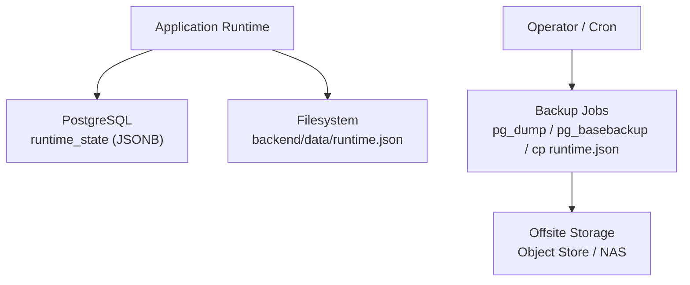
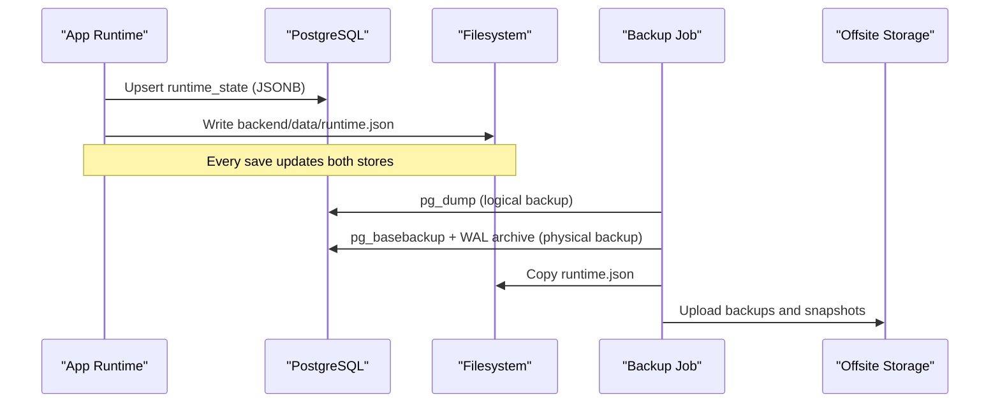
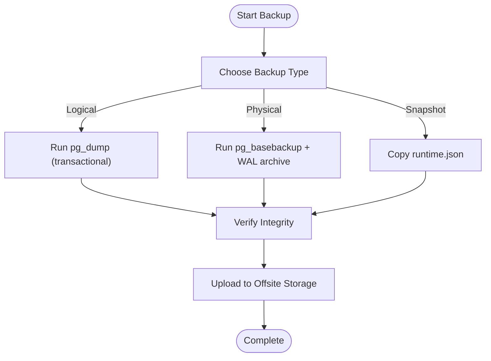
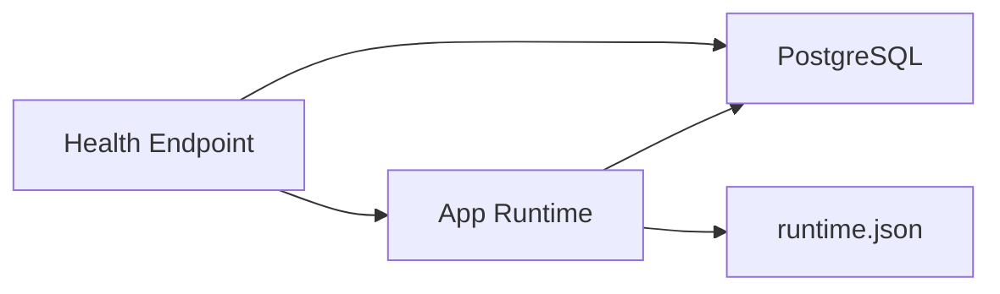

# Backup & Recovery Procedures

<cite>
**Referenced Files in This Document**
- [postgres-runbook.md](file://backend/docs/postgres-runbook.md)
- [runtime.py](file://backend/app/runtime.py)
- [health.py](file://backend/app/api/v1/routes/health.py)
- [README.md](file://README.md)
</cite>

## Table of Contents
1. Introduction
2. Project Structure
3. Core Components
4. Architecture Overview
5. Detailed Component Analysis
6. Dependency Analysis
7. Performance Considerations
8. Troubleshooting Guide
9. Conclusion
10. Appendices

## Introduction
This document defines backup and recovery procedures for the Generic Swarm Ops platform, focusing on:
- Full backups using PostgreSQL native tools (pg_dump, pg_basebackup)
- Application-level backups via runtime.json snapshots
- Incremental backup approaches leveraging WAL-based PITR
- Point-in-time recovery (PITR) workflows
- Disaster recovery playbooks
- Scheduling, retention policies, and verification processes
- Step-by-step restoration from various backup types
- Failover configurations and testing recovery scenarios
- Data consistency during backups and handling concurrent writes

The system’s primary durable store is a Postgres table that holds a JSONB document representing the application runtime state. On every save, the application also writes a snapshot to backend/data/runtime.json, which can be used as an offline backup or seed source if the database is empty.

## Project Structure
Key locations relevant to backup and recovery:
- Primary database: Postgres with a single-row JSONB document table
- Snapshot file: backend/data/runtime.json (written on every save)
- Health endpoint: reports whether the service is backed by Postgres or JSON file

[No sources needed since this diagram shows conceptual workflow, not actual code structure]

**Section sources**
- [postgres-runbook.md:60-67](file://backend/docs/postgres-runbook.md#L60-L67)
- [README.md:63-68](file://README.md#L63-L68)

## Core Components
- Postgres runtime_state table: Single-row JSONB payload holding all runtime collections.
- runtime.json snapshot: Written synchronously on every save; serves as an offline backup and migration seed.
- Health readiness: Exposes whether the current backend is Postgres-backed or JSON-file-backed.

Operational implications:
- For logical backups, use pg_dump against the database.
- For physical backups and PITR, use pg_basebackup combined with WAL archiving.
- For quick local restores or disaster recovery, you can seed from backend/data/runtime.json when the database is empty.

**Section sources**
- [postgres-runbook.md:60-67](file://backend/docs/postgres-runbook.md#L60-L67)
- [runtime.py:274-384](file://backend/app/runtime.py#L274-L384)
- [health.py:20-60](file://backend/app/api/v1/routes/health.py#L20-L60)

## Architecture Overview
The application persists a single JSONB document in Postgres and mirrors it to a JSON file on disk. Backups should capture both the database and the snapshot file to ensure consistent recovery options.

**Diagram sources**
- [runtime.py:329-384](file://backend/app/runtime.py#L329-L384)
- [postgres-runbook.md:60-67](file://backend/docs/postgres-runbook.md#L60-L67)

## Detailed Component Analysis

### Logical Backup Strategy (pg_dump)
- Scope: The entire database or specific schemas/tables.
- Target: runtime_state table containing the full runtime JSONB document.
- Consistency: Use transactional dumps to avoid partial snapshots under concurrent writes.
- Frequency: Daily full logical backups recommended; more frequently for high-change environments.
- Retention: Keep at least N daily, weekly, and monthly archives per policy.

Recommended steps:
- Schedule pg_dump to produce compressed logical backups.
- Verify integrity post-backup (e.g., size checks, checksums).
- Offload to secure offsite storage.

**Section sources**
- [postgres-runbook.md:60-67](file://backend/docs/postgres-runbook.md#L60-L67)

### Physical Backup Strategy (pg_basebackup)
- Scope: Base backup of the data directory plus continuous WAL archiving.
- Purpose: Enables point-in-time recovery (PITR) to any moment between base backups.
- Frequency: Periodic base backups (e.g., daily) with continuous WAL shipping.
- Retention: Align with RPO/RTO targets; keep enough history to recover to desired points.

Recommended steps:
- Configure WAL archiving to durable storage.
- Take periodic base backups with pg_basebackup.
- Validate restore procedure regularly.

**Section sources**
- [postgres-runbook.md:60-67](file://backend/docs/postgres-runbook.md#L60-L67)

### Application-Level Backup (runtime.json)
- What it captures: A complete snapshot of the runtime JSONB document at the time of last save.
- When it helps: Quick local recovery, seeding into a fresh database, or fallback when DB is unavailable.
- Caveat: Only reflects state up to the last successful save; may lag behind live transactions.

Recommended steps:
- Treat backend/data/runtime.json as an additional backup artifact.
- Include it in your backup job alongside database dumps.
- Use it to seed a new database if the target is empty.

**Section sources**
- [postgres-runbook.md:60-67](file://backend/docs/postgres-runbook.md#L60-L67)
- [runtime.py:370-384](file://backend/app/runtime.py#L370-L384)

### Incremental Backup Approaches
- WAL-based incremental: Continuous WAL shipping enables PITR without full dumps.
- Filesystem snapshots: If supported by your infrastructure, take consistent snapshots of the Postgres data directory while ensuring WAL continuity.
- Logical incremental: Not natively provided by pg_dump; prefer WAL-based PITR for incremental-like recovery.

**Section sources**
- [postgres-runbook.md:60-67](file://backend/docs/postgres-runbook.md#L60-L67)

### Point-in-Time Recovery (PITR)
- Prerequisites: Valid base backup and archived WAL segments covering the target time window.
- Procedure:
  - Stop the target instance.
  - Restore the base backup to the data directory.
  - Configure recovery settings to replay WAL up to the desired timestamp.
  - Start the server; it will replay WAL until the specified time.
- Validation: Confirm health endpoint indicates Postgres-backed readiness.

**Section sources**
- [postgres-runbook.md:60-67](file://backend/docs/postgres-runbook.md#L60-L67)
- [health.py:20-60](file://backend/app/api/v1/routes/health.py#L20-L60)

### Disaster Recovery Workflow
- Scenario: Complete loss of the production database.
- Steps:
  - Provision a new Postgres instance.
  - Restore latest base backup (or PITR to a safe point).
  - Optionally apply the latest runtime.json snapshot to seed initial state if needed.
  - Verify health endpoint and critical operations.
  - Switch traffic to the recovered instance.

**Section sources**
- [postgres-runbook.md:60-67](file://backend/docs/postgres-runbook.md#L60-L67)
- [health.py:20-60](file://backend/app/api/v1/routes/health.py#L20-L60)

### Backup Scheduling and Retention Policies
- Scheduling:
  - Daily logical backups (pg_dump).
  - Periodic base backups (pg_basebackup) with continuous WAL archiving.
  - Copy runtime.json as part of each backup cycle.
- Retention:
  - Define daily/weekly/monthly retention windows aligned with compliance and RPO/RTO.
  - Ensure offsite copies are immutable or protected against tampering.
- Verification:
  - Automated integrity checks (checksums, decompression tests).
  - Periodic restore drills to validate recoverability.

**Section sources**
- [postgres-runbook.md:60-67](file://backend/docs/postgres-runbook.md#L60-L67)

### Verification Processes
- Post-backup validation:
  - Check file sizes and checksums.
  - Spot-check contents (e.g., verify runtime_state row exists in logical dump).
- Restore validation:
  - Perform test restores to isolated environments.
  - Run health checks and smoke tests.

**Section sources**
- [postgres-runbook.md:60-67](file://backend/docs/postgres-runbook.md#L60-L67)

### Restoration Procedures

#### From Logical Backup (pg_dump)
- Create a clean database.
- Restore the logical dump into the target instance.
- Confirm the runtime_state table contains the expected JSONB payload.
- Verify health endpoint shows Postgres-backed readiness.

**Section sources**
- [postgres-runbook.md:60-67](file://backend/docs/postgres-runbook.md#L60-L67)
- [health.py:20-60](file://backend/app/api/v1/routes/health.py#L20-L60)

#### From Physical Backup (pg_basebackup)
- Stop the target instance.
- Restore the base backup to the data directory.
- Configure recovery to replay WAL to the desired point.
- Start the server and validate.

**Section sources**
- [postgres-runbook.md:60-67](file://backend/docs/postgres-runbook.md#L60-L67)

#### From Application Snapshot (runtime.json)
- Use when the target database is empty or needs seeding.
- Ensure the application is configured to read from Postgres.
- On first load, the application migrates from runtime.json into runtime_state if present.

**Section sources**
- [postgres-runbook.md:60-67](file://backend/docs/postgres-runbook.md#L60-L67)
- [runtime.py:289-328](file://backend/app/runtime.py#L289-L328)

### Failover Configurations
- Primary/Standby setup:
  - Use streaming replication or logical replication depending on requirements.
  - Ensure WAL shipping and PITR are enabled on standby.
- Traffic switching:
  - Update connection endpoints to point to the standby after promotion.
  - Validate health endpoint before routing production traffic.

**Section sources**
- [postgres-runbook.md:60-67](file://backend/docs/postgres-runbook.md#L60-L67)
- [health.py:20-60](file://backend/app/api/v1/routes/health.py#L20-L60)

### Testing Recovery Scenarios
- Monthly restore drill:
  - Restore from latest logical backup to a staging environment.
  - Validate health endpoint and run smoke tests.
- Quarterly PITR drill:
  - Recover to a specific timestamp using WAL replay.
  - Compare key metrics against expected values.
- Snapshot fallback drill:
  - Seed a fresh database from runtime.json and confirm application behavior.

**Section sources**
- [postgres-runbook.md:60-67](file://backend/docs/postgres-runbook.md#L60-L67)

### Data Consistency During Backups and Concurrent Writes
- Logical backups:
  - Use transactional dumps to ensure a consistent snapshot despite concurrent writes.
- Physical backups:
  - Combine base backups with WAL archiving to maintain consistency across time.
- Snapshot file:
  - Always written after successful persistence; represents the most recent consistent state at save time.

**Diagram sources**
- [runtime.py:370-384](file://backend/app/runtime.py#L370-L384)
- [postgres-runbook.md:60-67](file://backend/docs/postgres-runbook.md#L60-L67)

**Section sources**
- [runtime.py:370-384](file://backend/app/runtime.py#L370-L384)
- [postgres-runbook.md:60-67](file://backend/docs/postgres-runbook.md#L60-L67)

## Dependency Analysis
- The application depends on Postgres for durability and falls back to JSON file when required.
- Health endpoint exposes dependency status, including whether Postgres is preferred and reachable.

**Diagram sources**
- [health.py:20-60](file://backend/app/api/v1/routes/health.py#L20-L60)
- [runtime.py:274-384](file://backend/app/runtime.py#L274-L384)

**Section sources**
- [health.py:20-60](file://backend/app/api/v1/routes/health.py#L20-L60)
- [runtime.py:274-384](file://backend/app/runtime.py#L274-L384)

## Performance Considerations
- Logical backups: Prefer off-peak scheduling to minimize impact on write throughput.
- Physical backups: Ensure sufficient I/O capacity for base backups and WAL shipping.
- Snapshot file: Minimal overhead; already written on every save.
- PITR: WAL replay can be CPU-intensive; plan resources accordingly.

[No sources needed since this section provides general guidance]

## Troubleshooting Guide
- Symptom: Service reports degraded or not ready.
  - Action: Check health endpoint details for database reachability and backend type.
- Symptom: Cannot connect to Postgres.
  - Action: Verify DATABASE_URL and credentials; ensure Postgres is running.
- Symptom: Missing runtime_state data after restore.
  - Action: Confirm logical dump includes the table; consider seeding from runtime.json if the database was empty.

**Section sources**
- [postgres-runbook.md:88-95](file://backend/docs/postgres-runbook.md#L88-L95)
- [health.py:20-60](file://backend/app/api/v1/routes/health.py#L20-L60)

## Conclusion
A robust backup and recovery strategy combines:
- Logical backups (pg_dump) for portability and targeted restores
- Physical backups (pg_basebackup) with WAL archiving for PITR
- Application-level snapshots (runtime.json) for quick seeding and fallback
Regular verification, clear retention policies, and tested failover procedures ensure resilience and minimal downtime.

[No sources needed since this section summarizes without analyzing specific files]

## Appendices

### Appendix A: Health Endpoint Reference
- Endpoint: GET /api/v1/health/ready
- Purpose: Reports readiness and dependency status, including database backend type and reachability.

**Section sources**
- [health.py:20-60](file://backend/app/api/v1/routes/health.py#L20-L60)

### Appendix B: Data Layout Summary
- Primary store: Postgres table runtime_state (single row, JSONB payload)
- Snapshot backup: backend/data/runtime.json (written on every save)

**Section sources**
- [postgres-runbook.md:60-67](file://backend/docs/postgres-runbook.md#L60-L67)