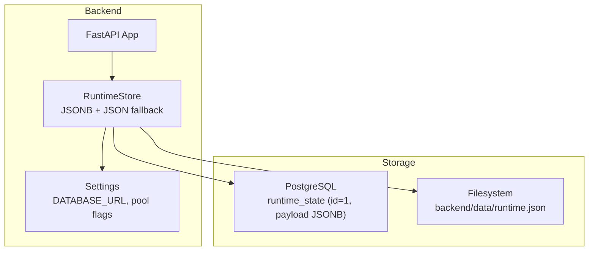
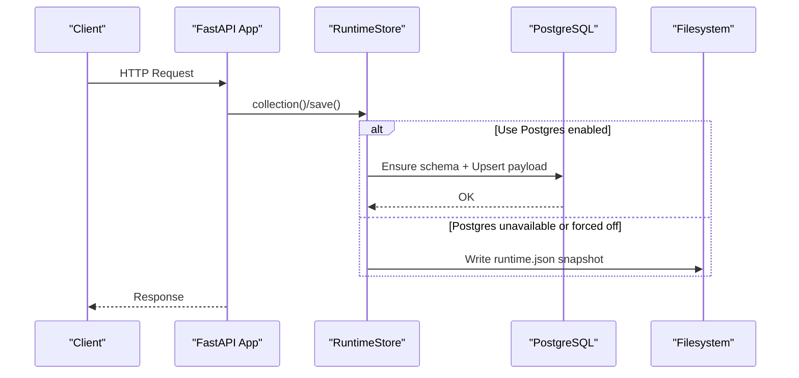
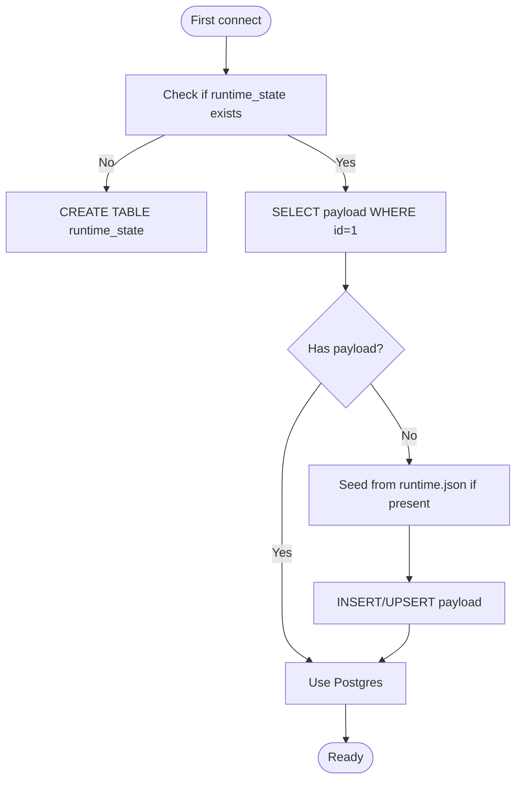
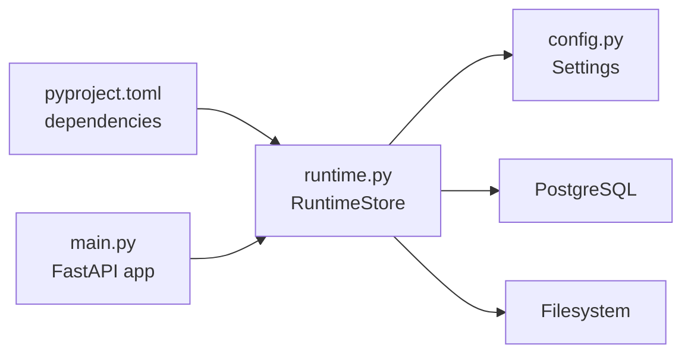

# Database Maintenance & Backup

<cite>
**Referenced Files in This Document**
- [postgres-runbook.md](file://backend/docs/postgres-runbook.md)
- [migrate.py](file://backend/scripts/migrate.py)
- [pyproject.toml](file://backend/pyproject.toml)
- [main.py](file://backend/app/main.py)
- [runtime.py](file://backend/app/runtime.py)
- [config.py](file://backend/app/core/config.py)
</cite>

## Table of Contents
1. Introduction
2. Project Structure
3. Core Components
4. Architecture Overview
5. Detailed Component Analysis
6. Dependency Analysis
7. Performance Considerations
8. Troubleshooting Guide
9. Conclusion
10. Appendices

## Introduction
This document provides comprehensive database maintenance and backup guidance for the Generic Swarm backend, focusing on PostgreSQL schema management, migration procedures, version control, backup strategies (full, incremental, point-in-time recovery), optimization and indexing, disaster recovery, restoration, failover configuration, security, permissions, and compliance considerations. It is written to be accessible to operators and developers while remaining precise about how the system actually persists data.

## Project Structure
The backend uses a hybrid persistence approach:
- Primary durable store: PostgreSQL with a single JSONB document table for runtime state.
- Fallback/backup: A local JSON file snapshot that is always updated on save and used as a seed source if the database is empty or unavailable.

**Diagram sources**
- [main.py:16-52](file://backend/app/main.py#L16-L52)
- [runtime.py:258-384](file://backend/app/runtime.py#L258-L384)
- [config.py:37-84](file://backend/app/core/config.py#L37-L84)

**Section sources**
- [postgres-runbook.md:1-95](file://backend/docs/postgres-runbook.md#L1-L95)
- [runtime.py:258-384](file://backend/app/runtime.py#L258-L384)
- [config.py:37-84](file://backend/app/core/config.py#L37-L84)

## Core Components
- RuntimeStore: Manages the single-row JSONB document in Postgres and maintains an always-updated JSON snapshot on disk. It auto-creates the required schema on first use and migrates from the JSON file into Postgres when the DB is empty.
- Settings: Loads DATABASE_URL and related connection options; converts async URLs to sync drivers where needed; decides whether to use Postgres or force JSON-only mode.
- Health endpoint: Exposes readiness including database connectivity status.

Key responsibilities:
- Schema creation and idempotent upserts for the runtime document.
- Dual-write strategy: persist to Postgres and write a JSON snapshot on every save.
- Graceful fallback to JSON when Postgres is unavailable or disabled.

**Section sources**
- [runtime.py:258-384](file://backend/app/runtime.py#L258-L384)
- [config.py:23-84](file://backend/app/core/config.py#L23-L84)
- [postgres-runbook.md:26-44](file://backend/docs/postgres-runbook.md#L26-L44)

## Architecture Overview
The application bootstraps FastAPI, registers routers, and includes middleware for request context and metrics. The runtime layer abstracts persistence behind a simple API and ensures durability via both Postgres and a local JSON snapshot.

**Diagram sources**
- [main.py:16-52](file://backend/app/main.py#L16-L52)
- [runtime.py:258-384](file://backend/app/runtime.py#L258-L384)

## Detailed Component Analysis

### PostgreSQL Schema Management
- Single-table design: runtime_state(id=1, payload JSONB, updated_at).
- Idempotent creation: schema is created automatically on first access.
- Upsert semantics: INSERT ... ON CONFLICT(id) DO UPDATE ensures a single current document row.

Operational notes:
- No external migration tooling is required for this initial implementation.
- The migrate script is a no-op placeholder indicating migrations are not needed at this stage.

**Diagram sources**
- [runtime.py:274-327](file://backend/app/runtime.py#L274-L327)

**Section sources**
- [runtime.py:274-327](file://backend/app/runtime.py#L274-L327)
- [migrate.py:1-3](file://backend/scripts/migrate.py#L1-L3)

### Migration Procedures and Version Control
- Current behavior: Migrations are not required; the runtime creates its own schema and seeds from the JSON snapshot if needed.
- Version control: Keep the repository’s codebase and any future migration scripts under version control. For now, the “migration” step is effectively handled by the runtime’s startup logic.

Recommended practices:
- If you introduce explicit migrations later, keep them in a dedicated directory and run them before starting the service.
- Tag releases and record any schema changes in release notes.

**Section sources**
- [migrate.py:1-3](file://backend/scripts/migrate.py#L1-L3)
- [runtime.py:274-327](file://backend/app/runtime.py#L274-L327)

### Backup Strategies
- Full backups:
  - Logical dump of the runtime_state table using pg_dump.
  - Snapshot of the filesystem file backend/data/runtime.json.
- Incremental backups:
  - WAL-based continuous archiving for PostgreSQL enables incremental recovery windows.
  - Filesystem snapshots or replication can capture runtime.json changes between logical dumps.
- Point-in-time recovery (PITR):
  - Configure WAL archiving and retention to restore to a specific timestamp.
  - Combine base backup with WAL segments to replay to the desired time.

Operational tips:
- Schedule periodic pg_dump jobs and retain multiple generations.
- Store backups securely off-host and verify integrity regularly.
- Validate restore procedures periodically.

[No sources needed since this section provides general guidance]

### Restore Processes
- From logical dump:
  - Stop writes (or route to read-only), restore the database from the latest full backup, then apply WAL archives to reach the target time.
- From JSON snapshot:
  - If Postgres is empty or corrupted, start the service with Postgres available; it will seed runtime_state from runtime.json automatically.
  - Alternatively, import the JSON content into the runtime_state table manually.

Validation:
- After restore, check health readiness and confirm the expected collections exist.

**Section sources**
- [postgres-runbook.md:60-68](file://backend/docs/postgres-runbook.md#L60-L68)
- [runtime.py:308-327](file://backend/app/runtime.py#L308-L327)

### Failover Configuration
- Application-level resilience:
  - When Postgres is down or disabled, the app falls back to the JSON file store automatically.
  - Environment flag can force JSON-only mode for offline or test scenarios.
- Database-level high availability:
  - Use streaming replication and a standby cluster.
  - Employ a connection proxy or client-side failover to switch to the standby during outages.
  - Ensure WAL shipping and monitoring are configured for timely failover.

**Section sources**
- [config.py:57-84](file://backend/app/core/config.py#L57-L84)
- [postgres-runbook.md:69-74](file://backend/docs/postgres-runbook.md#L69-L74)

### Security, User Permissions, and Compliance
- Authentication and authorization:
  - Built-in roles and permissions are managed within the runtime state.
  - Default admin credentials are provided for local development; prefer password login for operations.
- Secrets management:
  - DATABASE_URL and other secrets must be loaded from environment variables and never committed.
- Compliance considerations:
  - Encrypt backups at rest and in transit.
  - Retain audit logs and enforce least privilege for database users.
  - Regularly rotate credentials and tokens.

**Section sources**
- [postgres-runbook.md:12-24](file://backend/docs/postgres-runbook.md#L12-L24)
- [postgres-runbook.md:75-79](file://backend/docs/postgres-runbook.md#L75-L79)
- [runtime.py:140-222](file://backend/app/runtime.py#L140-L222)

## Dependency Analysis
The runtime depends on SQLAlchemy and psycopg for Postgres access, and on python-dotenv for loading configuration. The FastAPI app wires routing and middleware but delegates persistence to the runtime layer.

**Diagram sources**
- [pyproject.toml:6-14](file://backend/pyproject.toml#L6-L14)
- [main.py:16-52](file://backend/app/main.py#L16-L52)
- [config.py:37-84](file://backend/app/core/config.py#L37-L84)
- [runtime.py:258-384](file://backend/app/runtime.py#L258-L384)

**Section sources**
- [pyproject.toml:6-14](file://backend/pyproject.toml#L6-L14)
- [main.py:16-52](file://backend/app/main.py#L16-L52)
- [config.py:37-84](file://backend/app/core/config.py#L37-L84)
- [runtime.py:258-384](file://backend/app/runtime.py#L258-L384)

## Performance Considerations
- Connection pooling:
  - Tune pool size and overflow based on workload and concurrency.
  - Enable pre-ping to detect stale connections.
- Query performance:
  - Since the primary store is a single JSONB document, focus on efficient application-level updates and avoid large payloads.
  - If you add additional tables later, create appropriate indexes and analyze query plans.
- Monitoring:
  - Track health readiness and error rates.
  - Monitor Postgres metrics (connections, lock waits, I/O) and tune accordingly.

[No sources needed since this section provides general guidance]

## Troubleshooting Guide
Common issues and resolutions:
- Backend reports JSON-file store instead of Postgres:
  - Verify Postgres is reachable and DATABASE_URL is set correctly.
  - Ensure the correct driver is installed.
- Missing libpq:
  - Install the binary driver package.
- Health endpoint returns 503:
  - Either disable the requirement for Postgres or fix connectivity.

**Section sources**
- [postgres-runbook.md:88-95](file://backend/docs/postgres-runbook.md#L88-L95)

## Conclusion
The system employs a pragmatic, resilient persistence model centered on a single JSONB document in Postgres with a concurrent JSON snapshot for durability and easy seeding. Operators should implement standard PostgreSQL backup and PITR procedures, maintain secure secret handling, and validate restore processes regularly. As the schema evolves, adopt explicit migrations and continue to monitor performance and reliability.

## Appendices

### Configuration Reference
- DATABASE_URL: Postgres connection string (asyncpg or postgres accepted; converted to sync driver internally).
- DATABASE_POOL_SIZE, DATABASE_MAX_OVERFLOW, DATABASE_POOL_PRE_PING: Pool tuning.
- GENERIC_SWARM_FORCE_JSON_STORE: Force JSON-only mode for offline/testing.
- GENERIC_SWARM_REQUIRE_POSTGRES: Require Postgres for readiness.

**Section sources**
- [postgres-runbook.md:12-24](file://backend/docs/postgres-runbook.md#L12-L24)
- [config.py:52-84](file://backend/app/core/config.py#L52-L84)