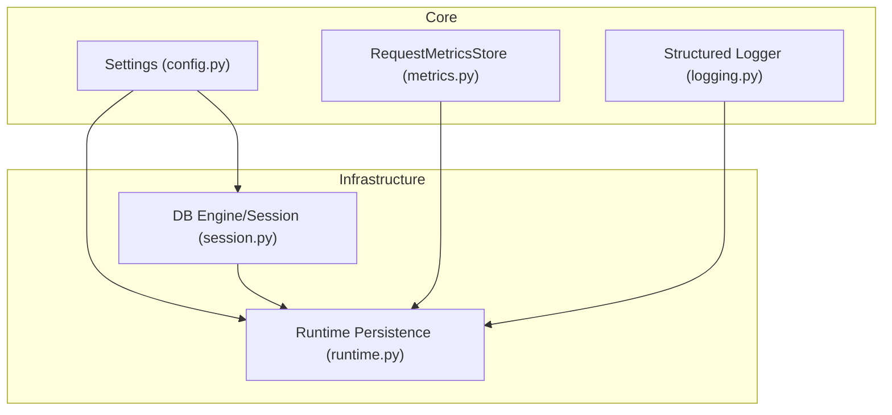
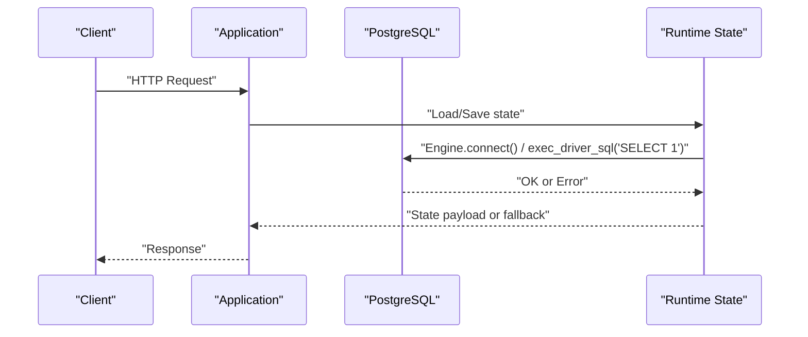
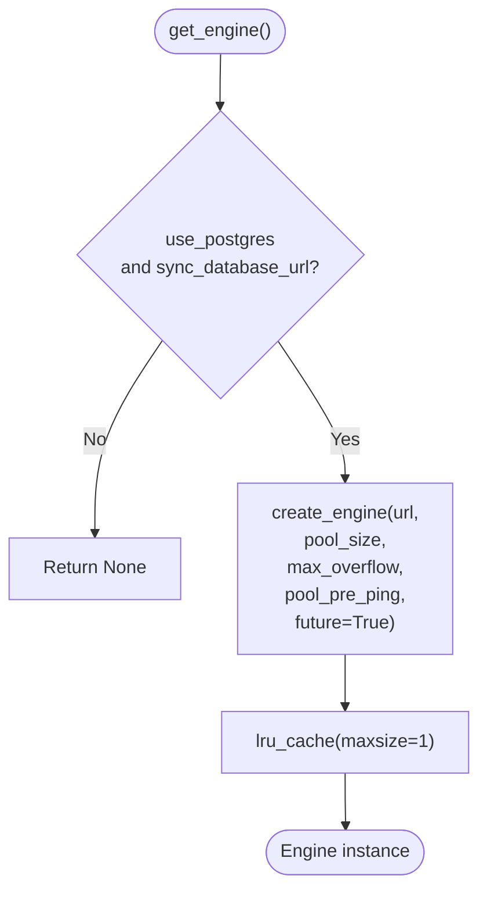
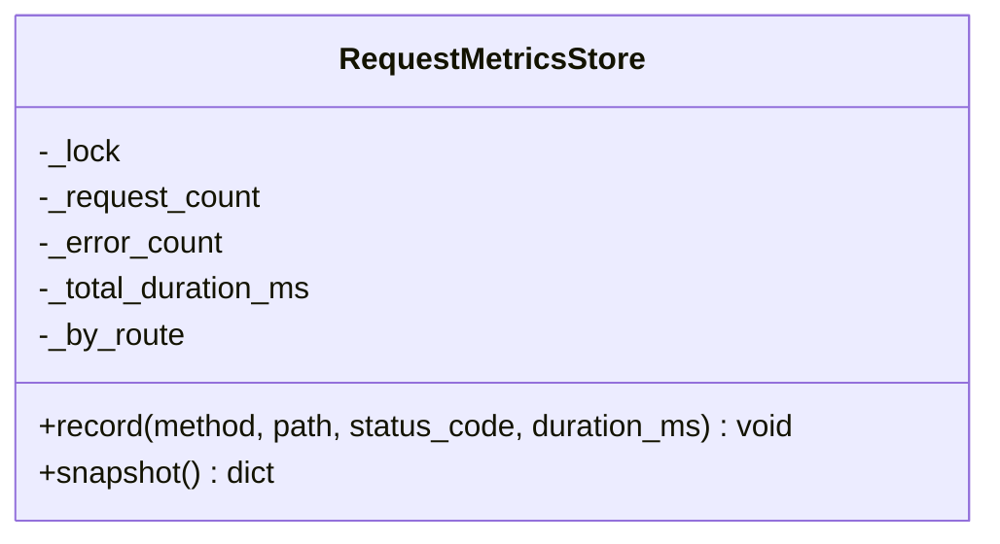
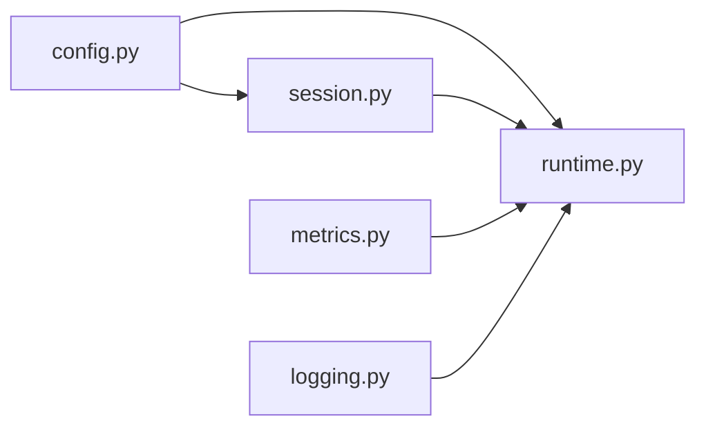

# Performance Optimization & Monitoring

<cite>
**Referenced Files in This Document**
- [config.py](file://backend/app/core/config.py)
- [session.py](file://backend/app/infrastructure/database/session.py)
- [metrics.py](file://backend/app/core/metrics.py)
- [logging.py](file://backend/app/core/logging.py)
- [runtime.py](file://backend/app/runtime.py)
</cite>

## Table of Contents
1. [Introduction](#introduction)
2. [Project Structure](#project-structure)
3. [Core Components](#core-components)
4. [Architecture Overview](#architecture-overview)
5. [Detailed Component Analysis](#detailed-component-analysis)
6. [Dependency Analysis](#dependency-analysis)
7. [Performance Considerations](#performance-considerations)
8. [Troubleshooting Guide](#troubleshooting-guide)
9. [Conclusion](#conclusion)
10. [Appendices](#appendices)

## Introduction
This document provides a comprehensive guide to performance optimization and monitoring for the backend, focusing on database connection pooling, query optimization techniques, index management strategies, metrics collection, slow query analysis, resource utilization tracking, tuning parameters, memory allocation, connection limits, troubleshooting, execution plan analysis, capacity planning, scaling, and load balancing. It is grounded in the repository’s actual implementation details and configuration surfaces.

## Project Structure
The performance-relevant code spans core configuration, database session management, request metrics, structured logging, and runtime persistence logic:
- Configuration: environment-driven settings for database URL and pool sizing
- Database layer: SQLAlchemy engine creation with pooling options and health checks
- Metrics: in-process counters for requests, errors, and per-route latency
- Logging: JSON-structured API request logs including duration
- Runtime: Postgres-backed state persistence with fallback to JSON file storage

**Diagram sources**
- [config.py:37-84](file://backend/app/core/config.py#L37-L84)
- [session.py:10-33](file://backend/app/infrastructure/database/session.py#L10-L33)
- [metrics.py:7-48](file://backend/app/core/metrics.py#L7-L48)
- [logging.py:11-31](file://backend/app/core/logging.py#L11-L31)
- [runtime.py:289-384](file://backend/app/runtime.py#L289-L384)

**Section sources**
- [config.py:37-84](file://backend/app/core/config.py#L37-L84)
- [session.py:10-33](file://backend/app/infrastructure/database/session.py#L10-L33)
- [metrics.py:7-48](file://backend/app/core/metrics.py#L7-L48)
- [logging.py:11-31](file://backend/app/core/logging.py#L11-L31)
- [runtime.py:289-384](file://backend/app/runtime.py#L289-L384)

## Core Components
- Settings and database URL normalization:
  - Environment variables control app behavior, rate limiting, and database connectivity.
  - A helper converts async URLs to sync drivers suitable for the synchronous runtime.
- Database engine and sessions:
  - Engine is created once and cached; pooling parameters are applied at creation time.
  - Session factory is configured for non-autocommit/future semantics.
- Request metrics:
  - Thread-safe store tracks total requests, errors, average duration, and per-route breakdowns.
- Structured logging:
  - API request logs include method, path, status code, duration, and client IP.
- Runtime persistence:
  - Loads/saves application state to Postgres when available; falls back to JSON file otherwise.

**Section sources**
- [config.py:23-84](file://backend/app/core/config.py#L23-L84)
- [session.py:10-33](file://backend/app/infrastructure/database/session.py#L10-L33)
- [metrics.py:7-48](file://backend/app/core/metrics.py#L7-L48)
- [logging.py:11-31](file://backend/app/core/logging.py#L11-L31)
- [runtime.py:289-384](file://backend/app/runtime.py#L289-L384)

## Architecture Overview
The runtime uses a Postgres-backed store when configured, leveraging a single SQLAlchemy engine with connection pooling. Health checks probe the database via a simple SQL statement. Application-level metrics and structured logs provide observability into request throughput, error rates, and latency.

**Diagram sources**
- [session.py:36-63](file://backend/app/infrastructure/database/session.py#L36-L63)
- [runtime.py:289-384](file://backend/app/runtime.py#L289-L384)

## Detailed Component Analysis

### Database Connection Pooling and Session Management
- Engine creation and caching:
  - The engine is lazily created and cached to avoid repeated initialization overhead.
  - Pool size, max overflow, and pre-ping are sourced from settings.
- Session factory:
  - Sessions are bound to the engine with explicit future mode and no autocommit.
- Health check:
  - A dedicated function executes a lightweight query to validate reachability and reports pool size.

**Diagram sources**
- [session.py:10-22](file://backend/app/infrastructure/database/session.py#L10-L22)

**Section sources**
- [session.py:10-33](file://backend/app/infrastructure/database/session.py#L10-L33)
- [session.py:36-63](file://backend/app/infrastructure/database/session.py#L36-L63)
- [config.py:53-56](file://backend/app/core/config.py#L53-L56)

### Query Optimization Techniques
- Prefer targeted queries:
  - Use specific column selections and WHERE clauses to minimize data transfer.
- Batch operations:
  - Group writes where possible to reduce round-trips.
- Avoid N+1 patterns:
  - Use eager loading or JOINs to fetch related entities efficiently.
- Leverage transactions:
  - Wrap multiple statements in a single transaction to reduce commit overhead.
- Use prepared statements:
  - Parameterized queries improve plan reuse and safety.

[No sources needed since this section provides general guidance]

### Index Management Strategies
- Identify hot paths:
  - Analyze frequent filters, joins, and sorts to determine candidate columns.
- Choose appropriate index types:
  - B-tree for equality/range; consider composite indexes for multi-column predicates.
- Monitor index usage:
  - Track scan types and index hit ratios over time.
- Maintain indexes:
  - Rebuild or reindex after heavy write bursts if fragmentation increases.

[No sources needed since this section provides general guidance]

### Performance Monitoring with Built-in Metrics
- In-process metrics:
  - Tracks total requests, errors, average duration, and per-route breakdowns.
  - Thread-safe accumulation using a lock.
- Usage pattern:
  - Record each request with method, path, status code, and duration.
  - Snapshot metrics for reporting or export.

**Diagram sources**
- [metrics.py:7-48](file://backend/app/core/metrics.py#L7-L48)

**Section sources**
- [metrics.py:7-48](file://backend/app/core/metrics.py#L7-L48)

### Slow Query Analysis and Resource Utilization Tracking
- Structured API logs:
  - Include request_id, method, path, status_code, duration_ms, and client_ip for correlation.
- Database reachability:
  - Health endpoint performs a minimal query to detect failures quickly.
- Observability integration:
  - Export metrics snapshots and parse logs to identify high-latency routes and error spikes.

**Section sources**
- [logging.py:11-31](file://backend/app/core/logging.py#L11-L31)
- [session.py:36-63](file://backend/app/infrastructure/database/session.py#L36-L63)

### Database Tuning Parameters, Memory Allocation, and Connection Limits
- Application-side pool controls:
  - Pool size and max overflow are configurable via environment variables.
  - Pre-ping can be enabled to validate connections before use.
- Database-side considerations:
  - Tune server-level work_mem, shared_buffers, effective_cache_size, and max_connections to match workload and hardware.
  - Align application pool_size with max_connections and expected concurrency.
- Memory allocation:
  - Ensure sufficient process memory for Python workers and database client buffers.
  - Monitor OS-level memory pressure and swap usage.

**Section sources**
- [config.py:53-56](file://backend/app/core/config.py#L53-L56)
- [session.py:16-22](file://backend/app/infrastructure/database/session.py#L16-L22)

### Scaling Considerations and Load Balancing
- Horizontal scaling:
  - Run multiple application instances behind a load balancer; ensure shared external state (e.g., Postgres) is accessible.
- Connection limits:
  - Sum of all worker pool sizes must remain below database max_connections; consider a connection pooler (e.g., PgBouncer) if needed.
- Stateless design:
  - Keep application processes stateless; persist state to Postgres as implemented by the runtime.
- Caching and read replicas:
  - Introduce caches for read-heavy paths; route reads to replicas if supported.

[No sources needed since this section provides general guidance]

## Dependency Analysis
The runtime depends on configuration for database selection and pooling, and on the database session for connectivity. Metrics and logging provide cross-cutting observability.

**Diagram sources**
- [config.py:37-84](file://backend/app/core/config.py#L37-L84)
- [session.py:10-33](file://backend/app/infrastructure/database/session.py#L10-L33)
- [metrics.py:7-48](file://backend/app/core/metrics.py#L7-L48)
- [logging.py:11-31](file://backend/app/core/logging.py#L11-L31)
- [runtime.py:289-384](file://backend/app/runtime.py#L289-L384)

**Section sources**
- [config.py:37-84](file://backend/app/core/config.py#L37-L84)
- [session.py:10-33](file://backend/app/infrastructure/database/session.py#L10-L33)
- [metrics.py:7-48](file://backend/app/core/metrics.py#L7-L48)
- [logging.py:11-31](file://backend/app/core/logging.py#L11-L31)
- [runtime.py:289-384](file://backend/app/runtime.py#L289-L384)

## Performance Considerations
- Connection pooling:
  - Right-size pool_size and max_overflow based on observed concurrency and database capacity.
  - Enable pool_pre_ping to fail fast on stale connections.
- Query efficiency:
  - Profile frequently executed queries; add indexes for selective filters and join keys.
- I/O and serialization:
  - Minimize payload sizes; avoid unnecessary JSON conversions.
- Observability:
  - Continuously monitor per-route latency and error rates; alert on regressions.
- Fallback behavior:
  - When Postgres is unavailable, the runtime falls back to JSON file storage; ensure this does not mask production issues.

[No sources needed since this section provides general guidance]

## Troubleshooting Guide
- Database unreachable:
  - Health check returns reachable=false with an error class name; verify credentials, network, and server availability.
- High latency:
  - Correlate long durations in structured logs with per-route metrics; inspect query plans for affected endpoints.
- Connection exhaustion:
  - If pool_size approaches max_connections, increase database max_connections or reduce pool_size; consider a connection pooler.
- Fallback to JSON:
  - When Postgres is down or misconfigured, the runtime persists to JSON; confirm DATABASE_URL and driver compatibility.

**Section sources**
- [session.py:36-63](file://backend/app/infrastructure/database/session.py#L36-L63)
- [logging.py:11-31](file://backend/app/core/logging.py#L11-L31)
- [runtime.py:289-384](file://backend/app/runtime.py#L289-L384)

## Conclusion
The backend implements a pragmatic approach to performance and observability: environment-driven database pooling, lightweight health checks, structured logging, and in-process metrics. By aligning application pool settings with database capacity, optimizing queries and indexes, and continuously monitoring latency and errors, teams can maintain stable performance under load and scale horizontally with confidence.

[No sources needed since this section summarizes without analyzing specific files]

## Appendices

### Configuration Reference
- Database URL normalization:
  - Converts async or generic Postgres URLs to a sync driver compatible with the runtime.
- Pooling parameters:
  - Pool size, max overflow, and pre-ping are controlled via environment variables.
- Feature toggles:
  - Embeddings and pgvector flags influence optional vector features.

**Section sources**
- [config.py:23-84](file://backend/app/core/config.py#L23-L84)

### Runtime Persistence Flow
- Load:
  - Attempts Postgres first; seeds from JSON if needed; falls back to JSON if Postgres is unavailable.
- Save:
  - Persists to Postgres when available; always maintains a JSON snapshot for offline backup.

**Section sources**
- [runtime.py:289-384](file://backend/app/runtime.py#L289-L384)