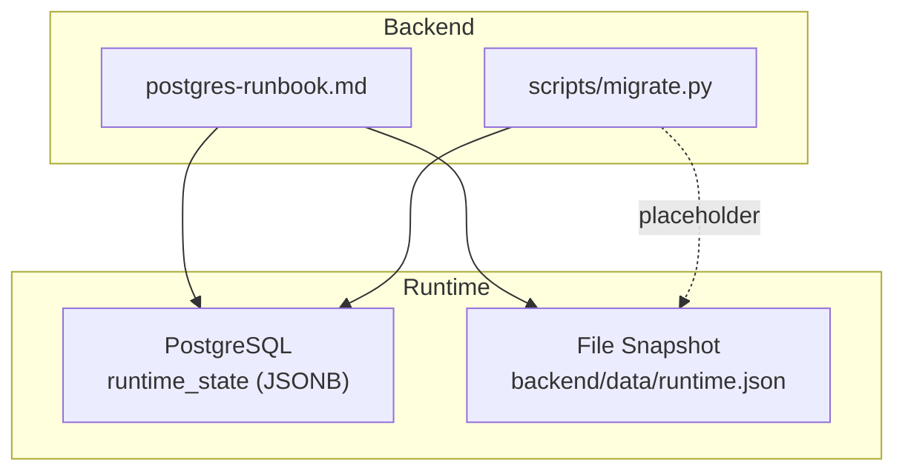
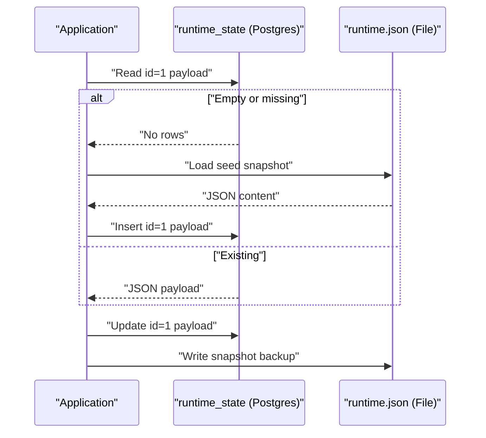
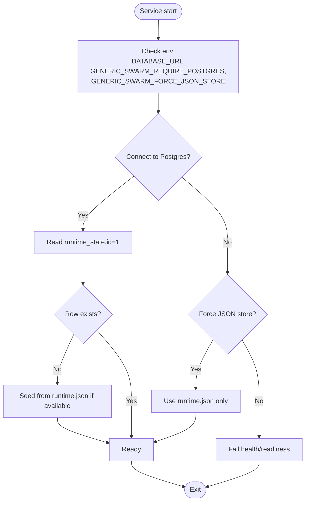
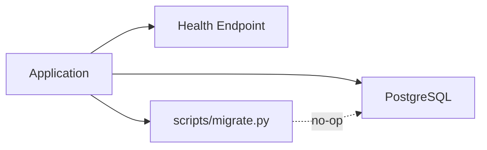

# Schema Management & Migrations

<cite>
**Referenced Files in This Document**
- [postgres-runbook.md](file://backend/docs/postgres-runbook.md)
- [migrate.py](file://backend/scripts/migrate.py)
</cite>

## Table of Contents
1. [Introduction](#introduction)
2. [Project Structure](#project-structure)
3. [Core Components](#core-components)
4. [Architecture Overview](#architecture-overview)
5. [Detailed Component Analysis](#detailed-component-analysis)
6. [Dependency Analysis](#dependency-analysis)
7. [Performance Considerations](#performance-considerations)
8. [Troubleshooting Guide](#troubleshooting-guide)
9. [Conclusion](#conclusion)
10. [Appendices](#appendices)

## Introduction
This document explains the schema management and migration approach for the PostgreSQL-backed control plane. It focuses on:
- The primary durable store design using a single runtime_state table with JSONB payload
- How the system initializes, validates, and migrates data between file-based snapshots and Postgres
- Operational guidance for database setup, health checks, and offline modes
- Practical strategies for evolving schemas while maintaining backward compatibility

The current implementation uses a lightweight, JSON-first model rather than a full SQLAlchemy migration toolchain. A dedicated migration script exists but is intentionally a no-op placeholder until formal migrations are introduced.

## Project Structure
Relevant files for schema and migration operations:
- backend/docs/postgres-runbook.md: Operational runbook covering prerequisites, configuration, startup order, data layout, and troubleshooting
- backend/scripts/migrate.py: Migration entry point (currently a no-op placeholder)

**Diagram sources**
- [postgres-runbook.md:60-68](file://backend/docs/postgres-runbook.md#L60-L68)
- [migrate.py:1-3](file://backend/scripts/migrate.py#L1-L3)

**Section sources**
- [postgres-runbook.md:1-95](file://backend/docs/postgres-runbook.md#L1-L95)
- [migrate.py:1-3](file://backend/scripts/migrate.py#L1-L3)

## Core Components
- Primary durable store: A single Postgres table named runtime_state holding one row (id=1) with a JSONB payload that represents the entire runtime document.
- File snapshot backup: backend/data/runtime.json is written on every save and used as a seed source if the database is empty.
- Migration entry point: scripts/migrate.py currently prints a no-op message indicating that JSON-backed runtime store does not require migrations in the initial implementation.

Operational notes:
- Configuration via DATABASE_URL and pool settings
- Health endpoint indicates when Postgres is connected
- Optional environment flags to force JSON-only mode or require Postgres

**Section sources**
- [postgres-runbook.md:11-24](file://backend/docs/postgres-runbook.md#L11-L24)
- [postgres-runbook.md:60-68](file://backend/docs/postgres-runbook.md#L60-L68)
- [postgres-runbook.md:69-73](file://backend/docs/postgres-runbook.md#L69-L73)
- [postgres-runbook.md:80-86](file://backend/docs/postgres-runbook.md#L80-L86)
- [migrate.py:1-3](file://backend/scripts/migrate.py#L1-L3)

## Architecture Overview
The system’s data path centers around a single JSONB document persisted in Postgres, with a local JSON snapshot for durability and seeding.

**Diagram sources**
- [postgres-runbook.md:60-68](file://backend/docs/postgres-runbook.md#L60-L68)

## Detailed Component Analysis

### Database Schema: runtime_state
- Purpose: Single-row, JSONB-backed document store for the application’s runtime state
- Key characteristics:
  - One row identified by id=1
  - Payload stored as JSONB to support flexible, evolving structures
  - Serves as the authoritative durable store; file snapshot is secondary

Implications:
- No rigid relational constraints; schema evolution is handled by application logic and validation
- Backward compatibility must be enforced at read/write boundaries

**Section sources**
- [postgres-runbook.md:60-68](file://backend/docs/postgres-runbook.md#L60-L68)

### Migration System: Current State and Entry Point
- scripts/migrate.py is present but acts as a no-op placeholder
- The current design avoids traditional migrations by relying on JSONB flexibility and file-based seeding

Operational note:
- On first connect with an empty runtime_state, the system migrates from runtime.json if present

**Section sources**
- [migrate.py:1-3](file://backend/scripts/migrate.py#L1-L3)
- [postgres-runbook.md:60-68](file://backend/docs/postgres-runbook.md#L60-L68)

### Initialization and Startup Flow
- Prerequisites include Postgres availability and correct DATABASE_URL
- Startup sequence starts the service and verifies readiness via health endpoint
- Optional enforcement can require Postgres or fall back to JSON-only mode

**Diagram sources**
- [postgres-runbook.md:11-24](file://backend/docs/postgres-runbook.md#L11-L24)
- [postgres-runbook.md:26-43](file://backend/docs/postgres-runbook.md#L26-L43)
- [postgres-runbook.md:60-73](file://backend/docs/postgres-runbook.md#L60-L73)

**Section sources**
- [postgres-runbook.md:11-24](file://backend/docs/postgres-runbook.md#L11-L24)
- [postgres-runbook.md:26-43](file://backend/docs/postgres-runbook.md#L26-L43)
- [postgres-runbook.md:60-73](file://backend/docs/postgres-runbook.md#L60-L73)

### Data Model Evolution and Backward Compatibility
Since the payload is JSONB:
- Additive changes: Introduce new fields without breaking existing consumers
- Deprecation strategy: Mark old fields as deprecated in documentation and code; continue reading them during a transition window
- Validation: Enforce required fields and types at write time; tolerate optional/legacy fields at read time
- Seeding: Keep runtime.json aligned with the latest expected shape to avoid regressions on fresh installs

Best practices:
- Version your internal schema within the JSON payload (e.g., a version field)
- Provide migration helpers in application code to transform legacy payloads on read/write
- Test both forward and backward compatibility paths

[No sources needed since this section provides general guidance]

### Adding New Tables and Evolving Beyond JSONB
When introducing structured tables:
- Define models and relationships explicitly
- Create migration scripts to evolve the schema safely
- Ensure dual-write or backfill strategies for zero-downtime transitions
- Update initialization flows to apply migrations before serving requests

[No sources needed since this section provides general guidance]

## Dependency Analysis
High-level dependencies relevant to schema and migrations:
- Application depends on Postgres for persistence
- Health checks depend on successful Postgres connectivity
- Migration entry point exists but is currently a no-op

**Diagram sources**
- [postgres-runbook.md:26-43](file://backend/docs/postgres-runbook.md#L26-L43)
- [migrate.py:1-3](file://backend/scripts/migrate.py#L1-L3)

**Section sources**
- [postgres-runbook.md:26-43](file://backend/docs/postgres-runbook.md#L26-L43)
- [migrate.py:1-3](file://backend/scripts/migrate.py#L1-L3)

## Performance Considerations
- JSONB indexing: For large payloads, consider GIN indexes on frequently queried keys
- Connection pooling: Tune pool size and overflow based on workload
- Write amplification: Avoid unnecessary writes to both Postgres and the file snapshot unless required for durability guarantees
- Health checks: Keep database checks lightweight to avoid false negatives under transient load

[No sources needed since this section provides general guidance]

## Troubleshooting Guide
Common issues and resolutions:
- store_backend shows json-file instead of postgres: Verify Postgres is up, DATABASE_URL is correct, and psycopg-binary is installed
- libpq library not found: Install the binary driver package
- 503 on /health/ready: Either fix Postgres connectivity or unset the flag requiring Postgres

Verification steps:
- Confirm readiness via health endpoint after starting the service
- Run the provided unit test to validate restart durability behavior

**Section sources**
- [postgres-runbook.md:88-95](file://backend/docs/postgres-runbook.md#L88-L95)
- [postgres-runbook.md:80-86](file://backend/docs/postgres-runbook.md#L80-L86)

## Conclusion
The current schema strategy leverages a single JSONB document in Postgres backed by a file snapshot for resilience and seeding. Migrations are intentionally deferred in favor of flexible schema evolution through application-level validation and transformation. As the system grows, introduce explicit tables and migrations where appropriate, adopting safe rollout patterns and robust testing to maintain reliability.

[No sources needed since this section summarizes without analyzing specific files]

## Appendices

### Environment Variables and Configuration
- DATABASE_URL: Postgres connection string
- Pooling parameters: pool size and overflow
- Feature flags:
  - GENERIC_SWARM_REQUIRE_POSTGRES: Require Postgres or fail readiness
  - GENERIC_SWARM_FORCE_JSON_STORE: Operate in JSON-only mode

**Section sources**
- [postgres-runbook.md:11-24](file://backend/docs/postgres-runbook.md#L11-L24)
- [postgres-runbook.md:69-73](file://backend/docs/postgres-runbook.md#L69-L73)

### Example Workflows

#### Creating a New Migration (Future)
- Author migration script to add/alter tables
- Apply migration before starting the service
- Validate with integration tests and rollback plan

[No sources needed since this section provides general guidance]

#### Rolling Back a Migration (Future)
- Implement reverse operations in migration scripts
- Coordinate with zero-downtime deployment strategy
- Re-test data integrity post-rollback

[No sources needed since this section provides general guidance]