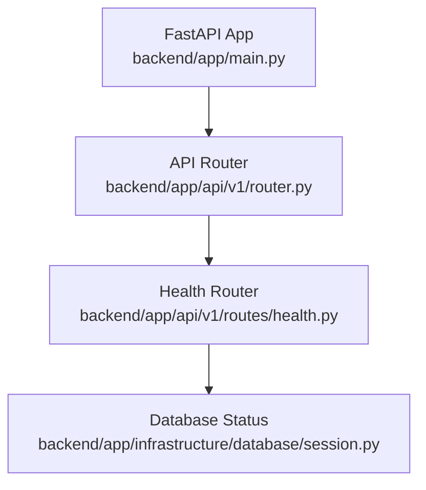
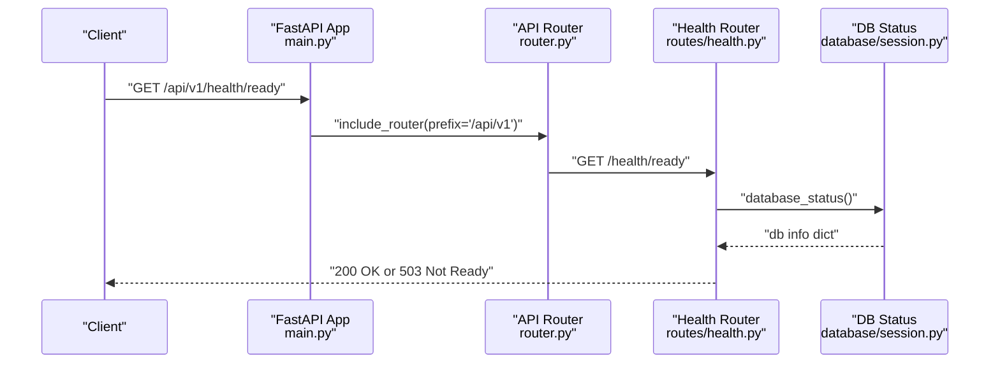
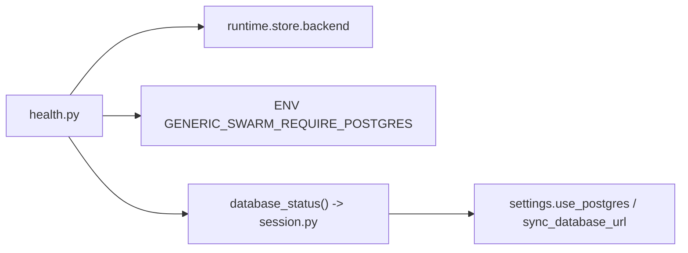

# Health Check Endpoints

<cite>
**Referenced Files in This Document**
- [main.py](file://backend/app/main.py)
- [router.py](file://backend/app/api/v1/router.py)
- [health.py](file://backend/app/api/v1/routes/health.py)
- [session.py](file://backend/app/infrastructure/database/session.py)
- [test_executable_product_health.py](file://backend/app/tests/unit/test_executable_product_health.py)
</cite>

## Table of Contents
1. [Introduction](#introduction)
2. [Project Structure](#project-structure)
3. [Core Components](#core-components)
4. [Architecture Overview](#architecture-overview)
5. [Detailed Component Analysis](#detailed-component-analysis)
6. [Dependency Analysis](#dependency-analysis)
7. [Performance Considerations](#performance-considerations)
8. [Troubleshooting Guide](#troubleshooting-guide)
9. [Conclusion](#conclusion)
10. [Appendices](#appendices)

## Introduction
This document explains the system health check endpoints, focusing on /api/v1/health and its subpaths. It covers endpoint structure, response formats, status codes, interpretation of results (including service dependencies, database connectivity, and resource availability), examples of successful and failed responses, integration with monitoring systems, automated checking strategies, and guidance for adding custom domain-specific health checks.

## Project Structure
The health endpoints are implemented as a FastAPI router mounted under the API v1 prefix. The application entrypoint includes the API router and sets up middleware and OpenAPI exposure.

**Diagram sources**
- [main.py:16-52](file://backend/app/main.py#L16-L52)
- [router.py:26-27](file://backend/app/api/v1/router.py#L26-L27)
- [health.py:1-67](file://backend/app/api/v1/routes/health.py#L1-L67)
- [session.py:36-63](file://backend/app/infrastructure/database/session.py#L36-L63)

**Section sources**
- [main.py:16-52](file://backend/app/main.py#L16-L52)
- [router.py:26-27](file://backend/app/api/v1/router.py#L26-L27)

## Core Components
- Health endpoints:
  - GET /api/v1/health — basic liveness indicator
  - GET /api/v1/health/live — process alive check
  - GET /api/v1/health/ready — readiness including dependency checks
  - GET /api/v1/health/metrics — metrics snapshot (requires permission)
- Database status helper:
  - Provides backend type, configuration state, reachability, and optional error details

Key behaviors:
- Readiness depends on configured storage backend and database reachability.
- When Postgres is required via environment variable but not reachable, readiness returns HTTP 503 with detailed reason and dependencies.
- Metrics endpoint requires authentication and specific permission.

**Section sources**
- [health.py:10-67](file://backend/app/api/v1/routes/health.py#L10-L67)
- [session.py:36-63](file://backend/app/infrastructure/database/session.py#L36-L63)

## Architecture Overview
The request flow from client to health endpoints and dependency checks is shown below.

**Diagram sources**
- [main.py:16-52](file://backend/app/main.py#L16-L52)
- [router.py:26-27](file://backend/app/api/v1/router.py#L26-L27)
- [health.py:20-60](file://backend/app/api/v1/routes/health.py#L20-L60)
- [session.py:36-63](file://backend/app/infrastructure/database/session.py#L36-L63)

## Detailed Component Analysis

### Endpoint: GET /api/v1/health
- Purpose: Basic service presence check.
- Response format:
  - status: string indicating overall health
  - service: string identifying the service name
- Typical status code: 200

Example successful response:
- { "status": "ok", "service": "generic-swarm-ops-backend" }

Interpretation:
- Indicates the process is running and the route is registered.

**Section sources**
- [health.py:10-13](file://backend/app/api/v1/routes/health.py#L10-L13)
- [test_executable_product_health.py:14-20](file://backend/app/tests/unit/test_executable_product_health.py#L14-L20)

### Endpoint: GET /api/v1/health/live
- Purpose: Liveness probe to verify the process is alive.
- Response format:
  - status: string indicating alive
  - service: string identifying the service name
- Typical status code: 200

Example successful response:
- { "status": "alive", "service": "generic-swarm-ops-backend" }

Interpretation:
- Useful for container orchestrators to detect if the process has crashed.

**Section sources**
- [health.py:15-18](file://backend/app/api/v1/routes/health.py#L15-L18)
- [test_executable_product_health.py:21-24](file://backend/app/tests/unit/test_executable_product_health.py#L21-L24)

### Endpoint: GET /api/v1/health/ready
- Purpose: Readiness probe that validates critical dependencies.
- Behavior:
  - Checks database reachability and configured backend.
  - Considers environment requirement for Postgres.
  - Returns degraded when using non-Postgres backends or when JSON file store is configured but database is unreachable.
  - Returns 503 when Postgres is required but not reachable.
- Response fields:
  - status: ready | degraded | not_ready (when 503)
  - dependencies: object containing:
    - database: current backend ("postgres" or "json-file")
    - database_detail: detailed DB status
    - postgres_preferred: boolean indicating Postgres is preferred and reachable
    - redis: "not_configured"
    - queue: "local-inline-dispatch"
    - vector_store: "not_configured"
    - object_storage: mirrors database backend
    - tool_adapters: "local"
- Status codes:
  - 200: ready or degraded
  - 503: not_ready (Postgres required but not reachable)

Example successful responses:
- Ready with Postgres:
  - { "status": "ready", "dependencies": { "database": "postgres", "database_detail": { "backend": "postgres", "configured": true, "reachable": true }, "postgres_preferred": true, ... } }
- Degraded with JSON file store:
  - { "status": "degraded", "dependencies": { "database": "json-file", "database_detail": { "backend": "json-file", "configured": true, "force_json": true, "reachable": null }, "postgres_preferred": false, ... } }

Example failure response (503):
- { "status": "not_ready", "reason": "Postgres required but not reachable", "dependencies": { "database": "postgres", "database_detail": { "backend": "postgres", "configured": true, "reachable": false, "error": "..." } } }

Interpretation:
- Use this endpoint for orchestration readiness gates.
- Treat 503 as a hard failure; treat 200 with status "degraded" as a warning condition.

**Section sources**
- [health.py:20-60](file://backend/app/api/v1/routes/health.py#L20-L60)
- [session.py:36-63](file://backend/app/infrastructure/database/session.py#L36-L63)
- [test_executable_product_health.py:25-33](file://backend/app/tests/unit/test_executable_product_health.py#L25-L33)

### Endpoint: GET /api/v1/health/metrics
- Purpose: Expose internal metrics snapshot.
- Access control: Requires authenticated user with settings:read permission.
- Response format: Snapshot object returned by metrics store.
- Typical status code: 200 on success; 401/403 on authorization failures.

Interpretation:
- Integrate with Prometheus/Grafana or similar systems by scraping this endpoint periodically.

**Section sources**
- [health.py:63-67](file://backend/app/api/v1/routes/health.py#L63-L67)

### Database Connectivity Details
- database_status() returns:
  - backend: "postgres" or "json-file"
  - configured: whether a database URL is configured
  - force_json: whether JSON file store is forced
  - reachable: boolean or null depending on backend
  - pool_size: present when Postgres is used
  - error: exception class name when connection fails

Use these fields to diagnose readiness issues and understand which storage backend is active.

**Section sources**
- [session.py:36-63](file://backend/app/infrastructure/database/session.py#L36-L63)

## Dependency Analysis
The health module depends on runtime configuration and infrastructure components to determine readiness.

**Diagram sources**
- [health.py:20-60](file://backend/app/api/v1/routes/health.py#L20-L60)
- [session.py:10-22](file://backend/app/infrastructure/database/session.py#L10-L22)
- [session.py:36-63](file://backend/app/infrastructure/database/session.py#L36-L63)

**Section sources**
- [health.py:20-60](file://backend/app/api/v1/routes/health.py#L20-L60)
- [session.py:10-22](file://backend/app/infrastructure/database/session.py#L10-L22)
- [session.py:36-63](file://backend/app/infrastructure/database/session.py#L36-L63)

## Performance Considerations
- Keep health checks lightweight:
  - Avoid heavy I/O or long-running operations.
  - Prefer quick pings (e.g., SELECT 1) for database checks.
- Cache where appropriate:
  - Database engine creation uses caching to avoid repeated setup overhead.
- Rate limiting:
  - Ensure orchestrators do not poll too aggressively; typical intervals are 5–15 seconds.
- Observability:
  - Use X-Request-ID headers added by middleware for tracing across requests.

[No sources needed since this section provides general guidance]

## Troubleshooting Guide
Common scenarios:
- Readiness degraded with JSON file store:
  - Expected behavior when Postgres is not configured or disabled.
  - Verify environment variables controlling Postgres usage and JSON fallback.
- Readiness 503 due to missing Postgres:
  - Ensure Postgres is reachable and DATABASE_URL is set correctly.
  - Confirm GENERIC_SWARM_REQUIRE_POSTGRES is not enabled unless Postgres is available.
- Metrics endpoint unauthorized:
  - Provide valid credentials and ensure the user has settings:read permission.

Diagnostic steps:
- Inspect database_detail in readiness response for backend, configured, reachable, and error fields.
- Validate environment variables affecting storage backend selection.
- Review logs for connection errors surfaced by database_status().

**Section sources**
- [health.py:20-60](file://backend/app/api/v1/routes/health.py#L20-L60)
- [session.py:36-63](file://backend/app/infrastructure/database/session.py#L36-L63)

## Conclusion
The health endpoints provide clear signals for liveness, readiness, and metrics. Readiness integrates database connectivity and environment-driven requirements, enabling robust orchestration and monitoring. Use the provided response structures to implement automated checks and integrate with observability platforms.

[No sources needed since this section summarizes without analyzing specific files]

## Appendices

### Integration with Monitoring Systems
- Kubernetes:
  - Configure livenessProbe and readinessProbe against /api/v1/health/live and /api/v1/health/ready respectively.
  - Use 503 from readiness to prevent traffic routing until dependencies are healthy.
- Prometheus/Grafana:
  - Scrape /api/v1/health/metrics periodically with proper authentication.
  - Build dashboards around metrics snapshot fields.
- CI/CD:
  - Run smoke tests hitting /api/v1/health and /api/v1/health/ready after deployment.

[No sources needed since this section provides general guidance]

### Automated Health Checking Strategies
- Polling interval:
  - Liveness: every 5–10 seconds.
  - Readiness: every 10–15 seconds.
- Backoff and jitter:
  - Add randomization to avoid thundering herds during restarts.
- Alerting:
  - Alert on consecutive readiness failures or persistent degraded status.
- Circuit breaking:
  - Stop probing temporarily if upstream dependencies are known to be down.

[No sources needed since this section provides general guidance]

### Custom Domain-Specific Health Checks
To extend readiness with domain-specific checks:
- Add new checks inside the readiness handler:
  - Query external services (e.g., Redis, vector stores).
  - Validate local resources (e.g., disk space thresholds).
- Update the dependencies object to include new keys:
  - Example keys: "redis", "vector_store", "object_storage".
- Return degraded for non-critical failures and 503 for critical ones.
- Document new fields for consumers and update tests accordingly.

Implementation references:
- Extend the readiness logic and dependencies mapping.
- Reuse patterns from database_status() for consistent reporting.

**Section sources**
- [health.py:20-60](file://backend/app/api/v1/routes/health.py#L20-L60)
- [session.py:36-63](file://backend/app/infrastructure/database/session.py#L36-L63)