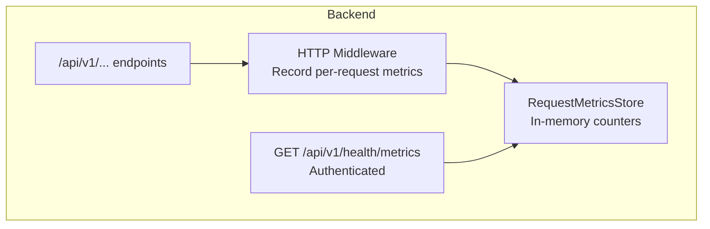
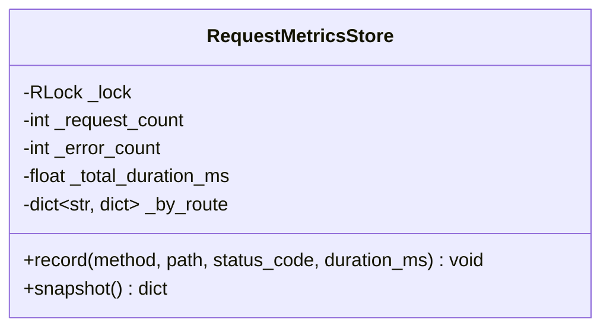
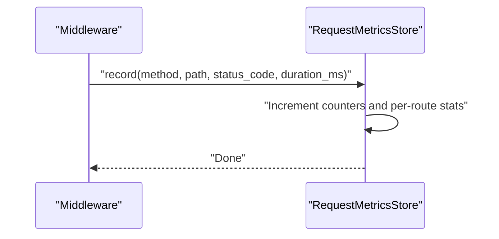
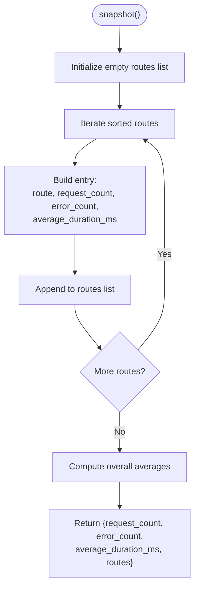
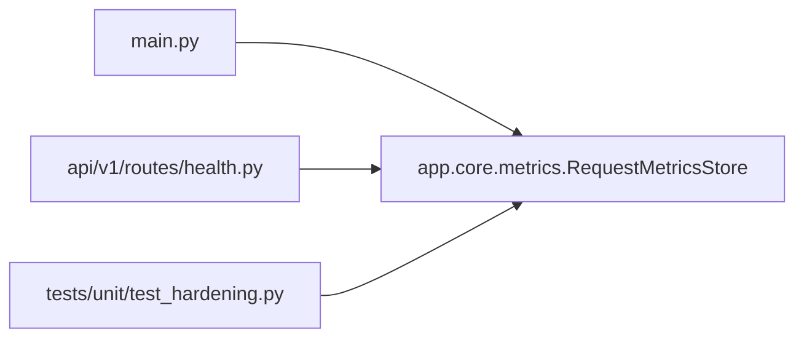

# Metrics Collection & Monitoring

<cite>
**Referenced Files in This Document**
- [metrics.py](file://backend/app/core/metrics.py)
- [main.py](file://backend/app/main.py)
- [health.py](file://backend/app/api/v1/routes/health.py)
- [test_hardening.py](file://backend/app/tests/unit/test_hardening.py)
</cite>

## Table of Contents
1. [Introduction](#introduction)
2. [Project Structure](#project-structure)
3. [Core Components](#core-components)
4. [Architecture Overview](#architecture-overview)
5. [Detailed Component Analysis](#detailed-component-analysis)
6. [Dependency Analysis](#dependency-analysis)
7. [Performance Considerations](#performance-considerations)
8. [Troubleshooting Guide](#troubleshooting-guide)
9. [Conclusion](#conclusion)
10. [Appendices](#appendices)

## Introduction
This document explains the metrics collection and monitoring implementation for the backend service. It focuses on the RequestMetricsStore, how request counting, error tracking, and performance metrics are recorded, and how to expose and consume these metrics. It also provides guidance for integrating with external monitoring systems such as Prometheus, Grafana, or APM tools, including examples of metric aggregation, dashboard setup, and alerting configuration. Finally, it addresses retention policies and performance impact considerations.

## Project Structure
The metrics feature is implemented within the backend application:
- Core metrics store and singleton instance live under the core module.
- The FastAPI middleware records each HTTP request’s method, path, status code, and duration into the metrics store.
- An authenticated endpoint exposes a snapshot of current metrics.
- Unit tests validate the behavior of the metrics store.



**Diagram sources**
- [metrics.py:7-48](file://backend/app/core/metrics.py#L7-L48)
- [main.py:27-48](file://backend/app/main.py#L27-L48)
- [health.py:63-66](file://backend/app/api/v1/routes/health.py#L63-L66)

**Section sources**
- [metrics.py:7-48](file://backend/app/core/metrics.py#L7-L48)
- [main.py:27-48](file://backend/app/main.py#L27-L48)
- [health.py:63-66](file://backend/app/api/v1/routes/health.py#L63-L66)

## Core Components
- RequestMetricsStore: Thread-safe in-memory aggregator that tracks total requests, errors, total duration, and per-route breakdowns.
- HTTP Middleware: Measures request duration and records metrics for every incoming request.
- Metrics Endpoint: Returns a snapshot of aggregated metrics; protected by authentication and authorization.

Key behaviors:
- Error detection uses HTTP status codes >= 400.
- Per-route statistics include count, error count, and average duration.
- Snapshot computes averages safely even when counts are zero.

**Section sources**
- [metrics.py:7-48](file://backend/app/core/metrics.py#L7-L48)
- [main.py:27-48](file://backend/app/main.py#L27-L48)
- [health.py:63-66](file://backend/app/api/v1/routes/health.py#L63-L66)

## Architecture Overview
The following sequence shows how a request flows through the middleware and how metrics are recorded and exposed.

```mermaid
sequenceDiagram
participant Client as "Client"
participant App as "FastAPI App"
participant MW as "HTTP Middleware"
participant Store as "RequestMetricsStore"
participant EP as "/api/v1/health/metrics"
Client->>App : "HTTP Request"
App->>MW : "Invoke middleware"
MW->>MW : "Measure start time"
MW->>App : "call_next(request)"
App-->>MW : "Response (status_code)"
MW->>Store : "record(method, path, status_code, duration_ms)"
Note over MW,Store : "Counts incremented; errors tracked if status >= 400"
Client->>EP : "GET /api/v1/health/metrics (authenticated)"
EP->>Store : "snapshot()"
Store-->>EP : "{request_count, error_count,<br/>average_duration_ms, routes[]}"
EP-->>Client : "JSON metrics snapshot"
```

**Diagram sources**
- [main.py:27-48](file://backend/app/main.py#L27-L48)
- [metrics.py:15-45](file://backend/app/core/metrics.py#L15-L45)
- [health.py:63-66](file://backend/app/api/v1/routes/health.py#L63-L66)

## Detailed Component Analysis

### RequestMetricsStore
Responsibilities:
- Maintain thread-safe counters for total requests, errors, and cumulative duration.
- Aggregate per-route metrics keyed by "METHOD PATH".
- Provide a snapshot with overall and per-route statistics.

Data model:
- Global counters: request_count, error_count, total_duration_ms.
- Per-route map: route -> {count, errors, duration_ms}.

Snapshot fields:
- request_count: total number of recorded requests.
- error_count: total number of requests with status_code >= 400.
- average_duration_ms: overall average across all requests.
- routes: list of per-route entries with:
  - route: "METHOD PATH"
  - request_count: count for this route
  - error_count: errors for this route
  - average_duration_ms: average duration for this route

Complexity:
- record(): O(1) per call.
- snapshot(): O(R) where R is number of unique routes.

Thread safety:
- Uses a reentrant lock to protect concurrent updates and reads.

Error handling:
- Division by zero avoided by using max(count, 1).

**Section sources**
- [metrics.py:7-48](file://backend/app/core/metrics.py#L7-L48)

#### Class Diagram


**Diagram sources**
- [metrics.py:7-48](file://backend/app/core/metrics.py#L7-L48)

### HTTP Middleware Integration
Responsibilities:
- Measure request duration using high-resolution timer.
- Record metrics via RequestMetricsStore.record().
- Attach security headers and propagate request ID.

Integration points:
- Registered as an HTTP middleware on the FastAPI app.
- Invoked before and after request processing to capture timing and status.

**Section sources**
- [main.py:27-48](file://backend/app/main.py#L27-L48)

#### Sequence Diagram: Metrics Recording


**Diagram sources**
- [main.py:34-36](file://backend/app/main.py#L34-L36)
- [metrics.py:15-26](file://backend/app/core/metrics.py#L15-L26)

### Metrics Endpoint
Endpoint:
- GET /api/v1/health/metrics
- Requires authentication and permission settings:read.
- Returns a JSON snapshot from RequestMetricsStore.snapshot().

Security:
- Protected by dependency injection that enforces user identity and permissions.

**Section sources**
- [health.py:63-66](file://backend/app/api/v1/routes/health.py#L63-L66)

#### Flowchart: Snapshot Generation


**Diagram sources**
- [metrics.py:27-45](file://backend/app/core/metrics.py#L27-L45)

### Unit Tests
Purpose:
- Validate that the metrics store aggregates correctly across multiple calls.
- Assert totals and per-route values.

Coverage:
- Records two requests with different statuses and durations.
- Verifies request_count, error_count, average_duration_ms, and per-route fields.

**Section sources**
- [test_hardening.py:31-41](file://backend/app/tests/unit/test_hardening.py#L31-L41)

## Dependency Analysis
High-level dependencies:
- main.py depends on metrics.py to record metrics.
- health.py depends on metrics.py to expose snapshots.
- test_hardening.py depends on metrics.py to assert correctness.



**Diagram sources**
- [main.py:12-14](file://backend/app/main.py#L12-L14)
- [health.py:3-4](file://backend/app/api/v1/routes/health.py#L3-L4)
- [test_hardening.py:7](file://backend/app/tests/unit/test_hardening.py#L7)

**Section sources**
- [main.py:12-14](file://backend/app/main.py#L12-L14)
- [health.py:3-4](file://backend/app/api/v1/routes/health.py#L3-L4)
- [test_hardening.py:7](file://backend/app/tests/unit/test_hardening.py#L7)

## Performance Considerations
- In-memory storage: All counters reside in process memory. This avoids I/O overhead but means metrics are not persisted across restarts.
- Lock contention: A single reentrant lock protects all updates and reads. Under very high concurrency, consider batching or offloading to an async exporter.
- Route cardinality: The per-route map grows with unique "METHOD PATH" combinations. If dynamic paths are used, consider normalizing or sampling to avoid unbounded growth.
- Snapshot cost: snapshot() iterates all routes. For large numbers of routes, consider periodic export rather than on-demand snapshots.
- Duration measurement: Using a high-resolution timer is efficient; ensure only necessary work is done inside the critical section.

[No sources needed since this section provides general guidance]

## Troubleshooting Guide
Common issues and resolutions:
- Missing metrics data:
  - Ensure the HTTP middleware is registered and active.
  - Verify that requests reach the middleware and that record() is invoked.
- Zero or incorrect averages:
  - Confirm that duration_ms is computed post-response and passed to record().
  - Check that status codes are set before the response is returned.
- Authentication failures on /metrics:
  - Ensure the caller has the required permission settings:read.
- High memory usage:
  - Investigate route cardinality; normalize dynamic segments if needed.
  - Consider implementing a bounded buffer or periodic reset/export strategy.

**Section sources**
- [main.py:27-48](file://backend/app/main.py#L27-L48)
- [health.py:63-66](file://backend/app/api/v1/routes/health.py#L63-L66)
- [metrics.py:15-45](file://backend/app/core/metrics.py#L15-L45)

## Conclusion
The backend implements a lightweight, in-memory metrics system centered around RequestMetricsStore. It captures essential request-level KPIs—counts, errors, and latency—and exposes them via an authenticated endpoint. While simple and low-overhead, it requires careful consideration of retention, cardinality, and integration with external systems for long-term observability.

[No sources needed since this section summarizes without analyzing specific files]

## Appendices

### Available Metrics
- Overall:
  - request_count: total requests recorded.
  - error_count: total requests with status_code >= 400.
  - average_duration_ms: overall average duration in milliseconds.
- Per-route:
  - route: "METHOD PATH"
  - request_count: requests for this route
  - error_count: errors for this route
  - average_duration_ms: average duration for this route

**Section sources**
- [metrics.py:27-45](file://backend/app/core/metrics.py#L27-L45)

### Integration with External Monitoring Systems

#### Prometheus Exporter
Approach:
- Option A: Scrape the existing /api/v1/health/metrics endpoint and transform JSON to Prometheus format using a small adapter or sidecar.
- Option B: Replace the in-memory store with a Prometheus-compatible client (e.g., prometheus_client) and expose /metrics in native Prometheus text format.

Steps:
- Configure Prometheus to scrape either the transformed endpoint or the native /metrics endpoint.
- Label metrics with stable dimensions (method, path normalized, status_class).
- Avoid scraping too frequently to reduce overhead.

[No sources needed since this section provides general guidance]

#### Grafana Dashboard
Suggested panels:
- Total Requests Over Time: sum(rate(...)) over time windows.
- Error Rate: ratio of 4xx/5xx to total requests.
- Latency Percentiles: p50/p95/p99 of duration_ms.
- Top N Routes by Requests and Errors.
- SLO Compliance: percentage of requests below target latency.

[No sources needed since this section provides general guidance]

#### Alerting Rules
Examples:
- High error rate: error_count / request_count exceeds threshold over a window.
- Latency spikes: average_duration_ms or p95 exceeds thresholds.
- Sudden traffic drops: request_count falls below baseline.

[No sources needed since this section provides general guidance]

#### APM Tools
Recommendations:
- Instrument spans around request handlers to correlate traces with metrics.
- Use consistent labels (method, normalized path, status_class) across logs, metrics, and traces.
- Sample long-running operations to keep overhead low.

[No sources needed since this section provides general guidance]

### Metric Aggregation Examples
- Global error rate: error_count / request_count.
- Per-route error rate: route.error_count / route.request_count.
- Average latency by route: route.average_duration_ms.
- Rolling rates: compute over fixed windows using your monitoring system.

[No sources needed since this section provides general guidance]

### Retention Policies
Current behavior:
- In-memory only; no persistence across restarts.

Recommended strategies:
- Periodic export: schedule background jobs to push snapshots to a time-series database.
- Bounded history: cap the number of stored routes or implement sliding windows.
- Reset policy: periodically reset counters and emit deltas for downstream consumers.

[No sources needed since this section provides general guidance]

### Security and Access Control
- The metrics endpoint requires authentication and the settings:read permission.
- Ensure network access controls restrict exposure of the metrics endpoint to authorized collectors.

**Section sources**
- [health.py:63-66](file://backend/app/api/v1/routes/health.py#L63-L66)