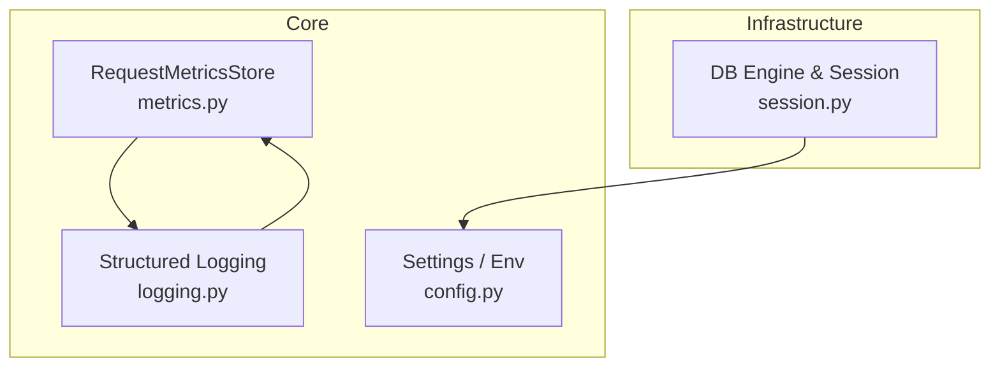
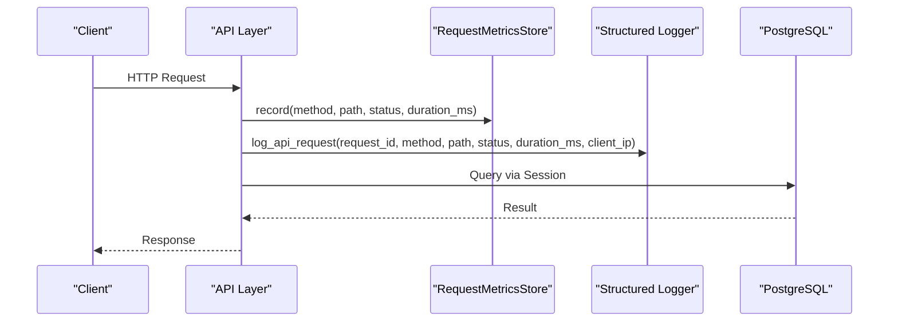
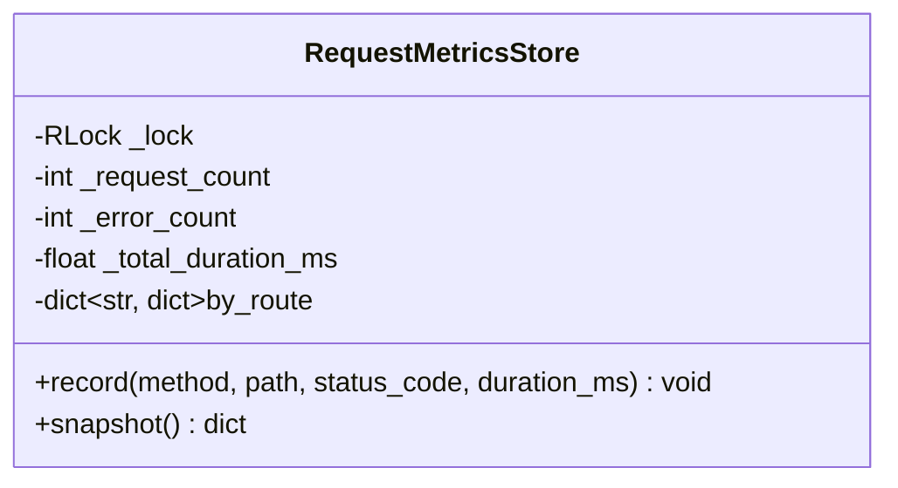
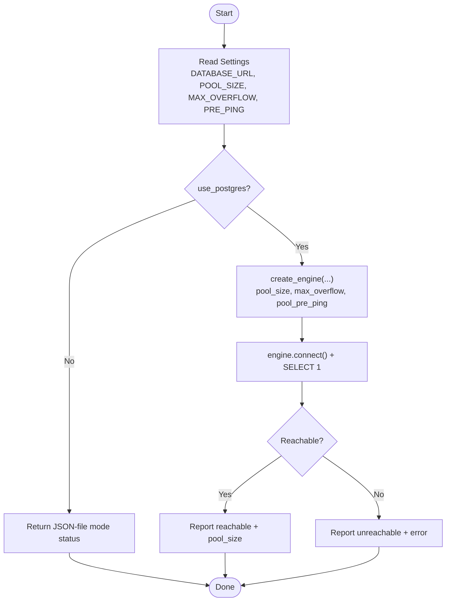
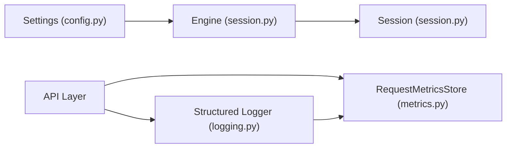

# Performance Monitoring & Optimization

<cite>
**Referenced Files in This Document**
- [metrics.py](file://backend/app/core/metrics.py)
- [logging.py](file://backend/app/core/logging.py)
- [config.py](file://backend/app/core/config.py)
- [session.py](file://backend/app/infrastructure/database/session.py)
</cite>

## Table of Contents
1. Introduction
2. Project Structure
3. Core Components
4. Architecture Overview
5. Detailed Component Analysis
6. Dependency Analysis
7. Performance Considerations
8. Troubleshooting Guide
9. Conclusion
10. Appendices

## Introduction
This document provides a comprehensive guide to performance monitoring and optimization for the backend service. It focuses on:
- CPU usage monitoring
- Memory consumption tracking
- Database connection pooling metrics
- API response time analysis
- Bottleneck identification techniques
- Profiling tools integration
- Performance regression detection
- Examples of dashboards, threshold-based alerts, and capacity planning guidelines
- Common issues such as slow queries, memory leaks, and resource contention with solutions

The guidance is grounded in the existing observability primitives (request metrics store and structured logging) and database configuration (SQLAlchemy engine and session).

## Project Structure
Relevant modules for performance monitoring and optimization are located under the backend application core and infrastructure layers:
- Core metrics collection for API requests
- Structured request and exception logging
- Configuration for database connectivity and pool sizing
- SQLAlchemy engine and session helpers for Postgres

**Diagram sources**
- [metrics.py:7-48](file://backend/app/core/metrics.py#L7-L48)
- [logging.py:11-45](file://backend/app/core/logging.py#L11-L45)
- [config.py:37-83](file://backend/app/core/config.py#L37-L83)
- [session.py:10-33](file://backend/app/infrastructure/database/session.py#L10-L33)

**Section sources**
- [metrics.py:7-48](file://backend/app/core/metrics.py#L7-L48)
- [logging.py:11-45](file://backend/app/core/logging.py#L11-L45)
- [config.py:37-83](file://backend/app/core/config.py#L37-L83)
- [session.py:10-33](file://backend/app/infrastructure/database/session.py#L10-L33)

## Core Components
- RequestMetricsStore: Thread-safe aggregator that tracks per-route request counts, error counts, and total duration; exposes snapshots with averages.
- Structured Logging: JSON-formatted logs for API requests and exceptions including request_id, method, path, status_code, duration_ms, client_ip.
- Settings: Environment-driven configuration for app behavior, rate limiting, database URL normalization, and pool sizing.
- DB Engine & Session: Lazy-initialized SQLAlchemy engine with configurable pool_size, max_overflow, and pre-ping; helper to check database reachability and expose pool size.

Key responsibilities:
- Capture and aggregate latency and error signals at the API layer.
- Persist structured logs for downstream parsing and alerting.
- Configure and validate database connectivity and pool parameters.

**Section sources**
- [metrics.py:7-48](file://backend/app/core/metrics.py#L7-L48)
- [logging.py:11-45](file://backend/app/core/logging.py#L11-L45)
- [config.py:37-83](file://backend/app/core/config.py#L37-L83)
- [session.py:10-33](file://backend/app/infrastructure/database/session.py#L10-L33)

## Architecture Overview
The runtime collects request-level timing and errors, persists structured logs, and configures the database engine with explicit pool settings. A health/status endpoint can report database reachability and pool configuration.

**Diagram sources**
- [metrics.py:15-45](file://backend/app/core/metrics.py#L15-L45)
- [logging.py:11-31](file://backend/app/core/logging.py#L11-L31)
- [session.py:25-33](file://backend/app/infrastructure/database/session.py#L25-L33)

## Detailed Component Analysis

### RequestMetricsStore
Purpose:
- Aggregate request counts, error counts, and durations globally and per route.
- Provide a snapshot with average latencies for dashboards and alerts.

Implementation highlights:
- Thread-safe counters using a reentrant lock.
- Per-route aggregation keyed by "METHOD PATH".
- Snapshot computes averages safely against zero counts.

Complexity:
- Record: O(1) amortized per call.
- Snapshot: O(R) where R is number of unique routes.

Optimization opportunities:
- Periodic export and reset to bounded windows (e.g., last N minutes) to avoid unbounded growth.
- Expose additional percentiles if needed by sampling or histogram buckets.

**Diagram sources**
- [metrics.py:7-48](file://backend/app/core/metrics.py#L7-L48)

**Section sources**
- [metrics.py:7-48](file://backend/app/core/metrics.py#L7-L48)

### Structured Logging
Purpose:
- Emit machine-readable JSON logs for API requests and exceptions.
- Include fields suitable for parsing into metrics (duration_ms, status_code, path).

Usage patterns:
- Log each API request with timing and client IP.
- Log exceptions with context for correlation.

Integration points:
- Can be consumed by log aggregators to derive latency/error metrics.
- Supports correlation across services via request_id.

**Section sources**
- [logging.py:11-45](file://backend/app/core/logging.py#L11-L45)

### Database Configuration and Pooling
Purpose:
- Normalize database URLs for sync access.
- Configure SQLAlchemy engine with pool_size, max_overflow, and pre-ping.
- Provide a simple reachability check and expose pool configuration.

Key settings:
- DATABASE_URL, DATABASE_POOL_SIZE, DATABASE_MAX_OVERFLOW, DATABASE_POOL_PRE_PING.

Engine lifecycle:
- Engine is lazily created and cached.
- Sessions are created per call from the engine’s session factory.

Health reporting:
- database_status returns backend type, configured flag, reachable status, and pool_size when available.

**Diagram sources**
- [config.py:23-83](file://backend/app/core/config.py#L23-L83)
- [session.py:10-63](file://backend/app/infrastructure/database/session.py#L10-L63)

**Section sources**
- [config.py:23-83](file://backend/app/core/config.py#L23-L83)
- [session.py:10-63](file://backend/app/infrastructure/database/session.py#L10-L63)

## Dependency Analysis
High-level dependencies among performance-related components:

**Diagram sources**
- [config.py:37-83](file://backend/app/core/config.py#L37-L83)
- [session.py:10-33](file://backend/app/infrastructure/database/session.py#L10-L33)
- [metrics.py:7-48](file://backend/app/core/metrics.py#L7-L48)
- [logging.py:11-45](file://backend/app/core/logging.py#L11-L45)

**Section sources**
- [config.py:37-83](file://backend/app/core/config.py#L37-L83)
- [session.py:10-33](file://backend/app/infrastructure/database/session.py#L10-L33)
- [metrics.py:7-48](file://backend/app/core/metrics.py#7-L48)
- [logging.py:11-45](file://backend/app/core/logging.py#L11-L45)

## Performance Considerations

### CPU Usage Monitoring
- Use process-level CPU metrics from your runtime environment (e.g., container orchestrator or host agent).
- Correlate spikes with high request rates or long-running operations.
- Profile hot paths using Python profilers (cProfile/py-spy) during load tests.

Recommendations:
- Enable profiling in staging environments.
- Instrument long-running tasks and background workers separately.

### Memory Consumption Tracking
- Monitor RSS/VMS and GC stats in production.
- Watch for steady upward trends indicating leaks.
- Validate object lifetimes and ensure proper cleanup after large responses or file I/O.

Recommendations:
- Add periodic heap snapshots in staging.
- Use memory profilers to identify top consumers.

### Database Connection Pooling Metrics
- Track pool utilization: active connections vs pool_size and max_overflow.
- Observe wait times for acquiring connections.
- Tune pool_size and max_overflow based on workload and DB capacity.

Guidelines:
- Start with pool_size equal to expected concurrent DB-bound requests.
- Keep max_overflow modest to prevent overloading the database.
- Enable pool_pre_ping to detect stale connections.

**Section sources**
- [config.py:52-56](file://backend/app/core/config.py#L52-L56)
- [session.py:16-22](file://backend/app/infrastructure/database/session.py#L16-L22)

### API Response Time Analysis
- Use RequestMetricsStore snapshot for average latency per route.
- Parse structured logs to compute p50/p95/p99 latencies and error rates.
- Alert on sustained increases in latency or error ratios.

Suggested KPIs:
- Average and percentile latencies per route
- Error rate (status >= 400)
- Requests per second

**Section sources**
- [metrics.py:15-45](file://backend/app/core/metrics.py#L15-L45)
- [logging.py:11-31](file://backend/app/core/logging.py#L11-L31)

### Bottleneck Identification Techniques
- Identify slow endpoints via highest average_duration_ms.
- Cross-reference with DB query execution plans and indexes.
- Inspect external dependency latency (LLM calls, object storage, queues).

### Profiling Tools Integration
- Integrate py-spy or cProfile in CI/staging to capture profiles under load.
- Export flame graphs for CPU hotspots.
- Combine with distributed tracing IDs (request_id) for end-to-end correlation.

### Performance Regression Detection
- Baseline key metrics (latency percentiles, error rates, DB pool waits).
- Compare against thresholds in CI or nightly runs.
- Fail builds when regressions exceed defined tolerances.

## Troubleshooting Guide

Common issues and resolutions:
- Slow queries
  - Verify indexes and query plans.
  - Reduce payload sizes and pagination depth.
  - Cache frequently accessed data where appropriate.
- Memory leaks
  - Look for growing lists/dicts retained across requests.
  - Ensure temporary files and streams are closed.
  - Validate third-party library behavior under load.
- Resource contention
  - Increase pool_size cautiously and monitor DB saturation.
  - Reduce max_overflow to protect the database.
  - Offload heavy work to background workers.

Operational checks:
- Use database_status to confirm reachability and pool configuration.
- Review structured logs for elevated error rates and latency outliers.
- Use RequestMetricsStore snapshots to pinpoint problematic routes.

**Section sources**
- [session.py:36-63](file://backend/app/infrastructure/database/session.py#L36-L63)
- [logging.py:34-45](file://backend/app/core/logging.py#L34-L45)
- [metrics.py:27-45](file://backend/app/core/metrics.py#L27-L45)

## Conclusion
By combining in-process request metrics, structured logging, and well-tuned database pooling, you can build a robust performance monitoring foundation. Extend this with percentiles, histograms, and external telemetry to power dashboards, alerts, and automated regression detection. Continuously profile and tune based on observed bottlenecks to maintain stable performance at scale.

## Appendices

### Example Dashboard Panels
- Latency overview: average and p95 per route
- Error rate: global and per route
- DB pool utilization: active connections, overflow events
- Throughput: requests per second

### Threshold-Based Alerts
- Average latency per route exceeds baseline by X%
- Error rate above Y% over Z minutes
- DB pool utilization > 80% sustained
- Unreachable database status

### Capacity Planning Guidelines
- Estimate peak concurrent DB-bound requests to set pool_size.
- Size max_overflow to handle short bursts without overwhelming the database.
- Plan horizontal scaling for stateless API nodes based on CPU and memory headroom.
- Regularly review DB capacity and adjust pool parameters accordingly.