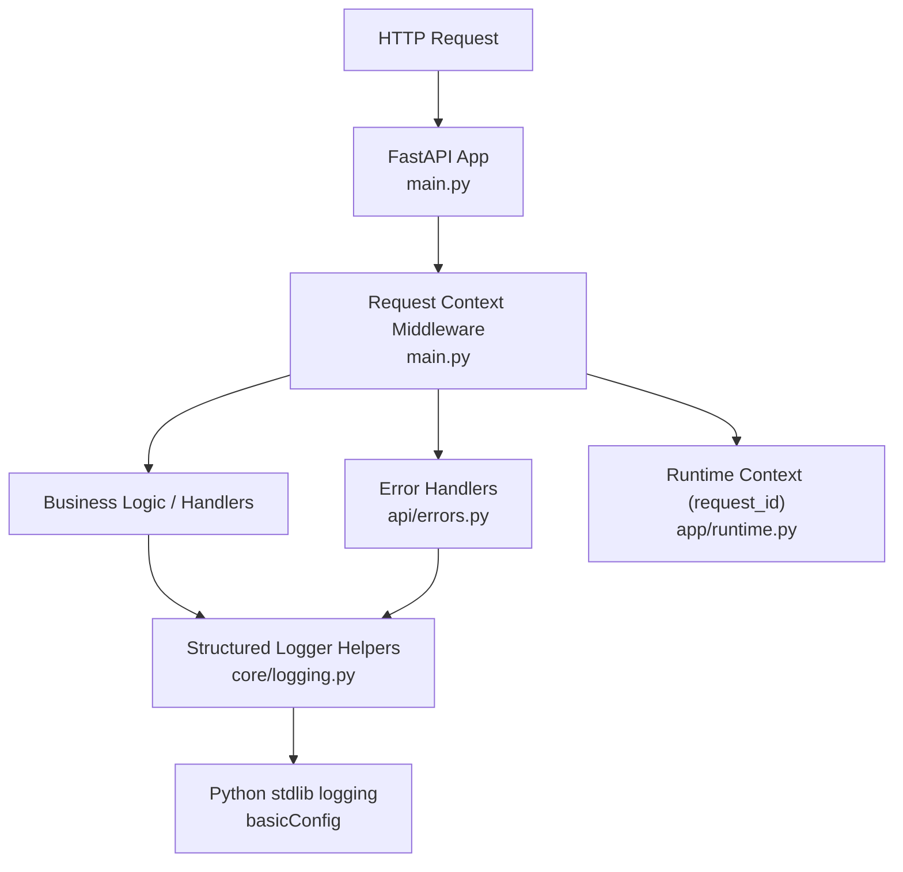
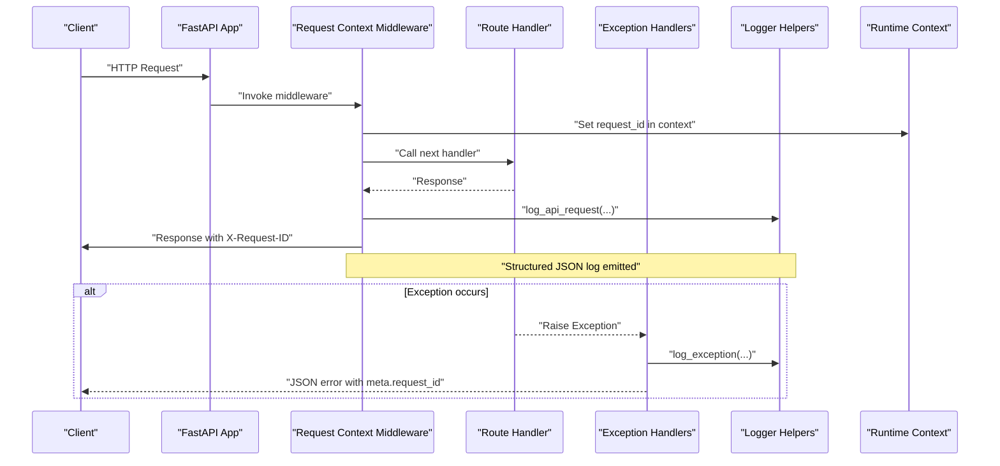
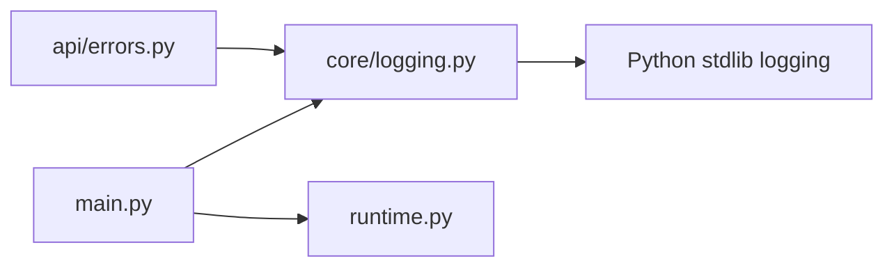

# Structured Logging System

<cite>
**Referenced Files in This Document**
- [logging.py](file://backend/app/core/logging.py)
- [main.py](file://backend/app/main.py)
- [errors.py](file://backend/app/api/errors.py)
- [runtime.py](file://backend/app/runtime.py)
- [config.py](file://backend/app/core/config.py)
</cite>

## Table of Contents
1. [Introduction](#introduction)
2. [Project Structure](#project-structure)
3. [Core Components](#core-components)
4. [Architecture Overview](#architecture-overview)
5. [Detailed Component Analysis](#detailed-component-analysis)
6. [Dependency Analysis](#dependency-analysis)
7. [Performance Considerations](#performance-considerations)
8. [Troubleshooting Guide](#troubleshooting-guide)
9. [Conclusion](#conclusion)
10. [Appendices](#appendices)

## Introduction
This document describes the structured logging system used by the backend service. It explains log levels, log formats, correlation IDs for request tracing, and how to integrate with common aggregation systems (ELK stack, Splunk, cloud logging). It also provides examples of structured log entries, filtering and search patterns, best practices for sensitive data and audit trails, and guidance on rotation and retention.

## Project Structure
The structured logging implementation is centered around a small core module that defines the logger and helper functions, integrated into the HTTP middleware for request/response lifecycle and error handling.

**Diagram sources**
- [main.py:27-48](file://backend/app/main.py#L27-L48)
- [errors.py:8-46](file://backend/app/api/errors.py#L8-L46)
- [logging.py:1-46](file://backend/app/core/logging.py#L1-L46)
- [runtime.py:14-15](file://backend/app/runtime.py#L14-L15)

**Section sources**
- [main.py:1-52](file://backend/app/main.py#L1-L52)
- [errors.py:1-47](file://backend/app/api/errors.py#L1-L47)
- [logging.py:1-46](file://backend/app/core/logging.py#L1-L46)
- [runtime.py:1-200](file://backend/app/runtime.py#L1-L200)

## Core Components
- Logger configuration and helpers:
  - The application initializes a root logger with a simple text format and creates a named logger for the backend.
  - Two helper functions emit structured JSON logs: one for API requests and one for exceptions.
- Request context and correlation ID:
  - A FastAPI middleware extracts or generates a request ID, attaches it to the request state, and writes it back to the response header.
  - The runtime module exposes a context variable to propagate the current request ID across components.
- Error handling integration:
  - Global exception handlers capture unhandled errors and emit structured error logs including the correlation ID.

Key responsibilities:
- Emit consistent, machine-parseable logs for requests and errors.
- Ensure every log entry includes a stable correlation ID for end-to-end tracing.
- Keep log payloads minimal and safe for downstream aggregators.

**Section sources**
- [logging.py:1-46](file://backend/app/core/logging.py#L1-L46)
- [main.py:27-48](file://backend/app/main.py#L27-L48)
- [errors.py:8-46](file://backend/app/api/errors.py#L8-L46)
- [runtime.py:14-15](file://backend/app/runtime.py#L14-L15)

## Architecture Overview
The logging architecture follows a layered approach:
- Ingress layer: FastAPI middleware captures timing, client IP, and correlation ID.
- Application layer: Business logic uses the shared logger helpers to emit structured logs.
- Error layer: Centralized exception handlers ensure all unexpected failures are logged consistently.
- Persistence layer: Logs are emitted to stdout/stderr via Python’s standard logging, suitable for containerized environments and external collectors.

**Diagram sources**
- [main.py:27-48](file://backend/app/main.py#L27-L48)
- [errors.py:8-46](file://backend/app/api/errors.py#L8-L46)
- [logging.py:11-45](file://backend/app/core/logging.py#L11-L45)
- [runtime.py:14-15](file://backend/app/runtime.py#L14-L15)

## Detailed Component Analysis

### Logger Module (core/logging.py)
Responsibilities:
- Initialize the root logger with a basic text format.
- Provide two structured logging helpers:
  - API request logger: emits a JSON object with fields such as request_id, method, path, status_code, duration_ms, and client_ip.
  - Exception logger: emits a JSON object with request_id, method, path, and message.

Design notes:
- Uses json.dumps with sorted keys to produce deterministic output.
- Emits INFO level for requests and ERROR level for exceptions.
- Keeps payloads flat and free of nested structures to simplify parsing.

Operational considerations:
- The default formatter is human-readable; structured JSON is embedded in the message field for parsers to extract.
- Avoid logging sensitive values directly; sanitize inputs before calling these helpers.

**Section sources**
- [logging.py:1-46](file://backend/app/core/logging.py#L1-L46)

### HTTP Middleware and Correlation ID (main.py)
Responsibilities:
- Extracts X-Request-ID from incoming headers or generates a new one.
- Stores the request ID in both request.state and runtime context.
- Measures request duration using high-resolution timers.
- Records metrics and emits a structured API request log.
- Writes X-Request-ID back to the response header for clients and downstream services.

Security and performance:
- Adds security-related response headers.
- Uses perf_counter for accurate duration measurement.

**Section sources**
- [main.py:27-48](file://backend/app/main.py#L27-L48)

### Exception Handlers (api/errors.py)
Responsibilities:
- Register global exception handlers for known runtime errors and generic exceptions.
- For unhandled exceptions, emit a structured error log including the correlation ID.
- Return consistent JSON responses with a meta.request_id field.

Integration points:
- Depends on the logger helper for emitting structured error logs.
- Ensures every error response is traceable via the same correlation ID.

**Section sources**
- [errors.py:8-46](file://backend/app/api/errors.py#L8-L46)

### Runtime Context (runtime.py)
Responsibilities:
- Provides a ContextVar to store the current request ID across async boundaries.
- Exposes methods to set and retrieve the current request ID.

Usage:
- Set at the start of each request by the middleware.
- Cleared after the response is sent.
- Can be used by other modules to include the request ID in additional logs if needed.

**Section sources**
- [runtime.py:14-15](file://backend/app/runtime.py#L14-L15)

## Dependency Analysis
High-level dependencies:
- main.py depends on core/logging.py for request logging and app/runtime.py for context propagation.
- api/errors.py depends on core/logging.py for exception logging.
- core/logging.py depends only on Python’s standard library logging and json.

**Diagram sources**
- [main.py:1-52](file://backend/app/main.py#L1-L52)
- [errors.py:1-47](file://backend/app/api/errors.py#L1-L47)
- [logging.py:1-46](file://backend/app/core/logging.py#L1-L46)
- [runtime.py:1-200](file://backend/app/runtime.py#L1-L200)

**Section sources**
- [main.py:1-52](file://backend/app/main.py#L1-L52)
- [errors.py:1-47](file://backend/app/api/errors.py#L1-L47)
- [logging.py:1-46](file://backend/app/core/logging.py#L1-L46)
- [runtime.py:1-200](file://backend/app/runtime.py#L1-L200)

## Performance Considerations
- Use high-resolution timers for duration measurements to avoid skew under load.
- Keep log payloads small and flat to reduce serialization overhead.
- Prefer INFO for request logs and ERROR for exceptions; avoid DEBUG in production unless necessary.
- Avoid logging large bodies or files; instead, log identifiers and sizes.
- Offload heavy work outside the hot path; logging should not block request processing.

[No sources needed since this section provides general guidance]

## Troubleshooting Guide
Common issues and resolutions:
- Missing correlation ID:
  - Verify the middleware sets and returns X-Request-ID.
  - Check that downstream components read the ID from runtime context when needed.
- Unstructured logs:
  - Ensure all custom logs use the provided helpers to maintain JSON structure.
  - Confirm aggregators parse the message field for JSON content.
- High log volume:
  - Adjust log levels based on environment; consider reducing verbosity in production.
  - Filter noisy endpoints or routes at the collector level.
- Sensitive data exposure:
  - Audit log calls to ensure no secrets, tokens, or PII are included.
  - Implement sanitization before logging user-provided data.

**Section sources**
- [main.py:27-48](file://backend/app/main.py#L27-L48)
- [errors.py:8-46](file://backend/app/api/errors.py#L8-L46)
- [logging.py:11-45](file://backend/app/core/logging.py#L11-L45)

## Conclusion
The structured logging system provides consistent, machine-parseable logs with correlation IDs for end-to-end tracing. By centralizing request logging and error handling, it simplifies observability and troubleshooting. Extending this pattern to other subsystems ensures uniformity across the platform.

[No sources needed since this section summarizes without analyzing specific files]

## Appendices

### Log Levels
- INFO: Successful API requests and normal operational events.
- ERROR: Exceptions and failures requiring attention.
- WARNING: Optional for deprecations, rate limits, or recoverable conditions.
- DEBUG/TRACE: Reserved for development and diagnostics; disable in production.

**Section sources**
- [logging.py:19-31](file://backend/app/core/logging.py#L19-L31)
- [logging.py:34-45](file://backend/app/core/logging.py#L34-L45)

### Log Formats and Fields
- API request log (INFO):
  - request_id: string
  - method: string
  - path: string
  - status_code: integer
  - duration_ms: number
  - client_ip: string
- Exception log (ERROR):
  - request_id: string or null
  - method: string
  - path: string
  - message: string

Notes:
- All fields are serialized with sorted keys for deterministic output.
- Timestamps and logger name are added by the root formatter.

**Section sources**
- [logging.py:11-31](file://backend/app/core/logging.py#L11-L31)
- [logging.py:34-45](file://backend/app/core/logging.py#L34-L45)

### Correlation ID Flow
- Incoming request:
  - If X-Request-ID present, reuse it; otherwise generate a new ID.
- Processing:
  - Store in request.state and runtime context.
- Response:
  - Attach X-Request-ID to response headers.
- Logs:
  - Include request_id in all structured logs for the request.

**Section sources**
- [main.py:27-48](file://backend/app/main.py#L27-L48)
- [runtime.py:14-15](file://backend/app/runtime.py#L14-L15)

### Configuration Options
Environment variables relevant to logging behavior:
- GENERIC_SWARM_ENV: Controls environment-specific settings (e.g., production vs development).
- GENERIC_SWARM_APP_NAME: Sets the application name used in OpenAPI and potentially in logs.

Note:
- Current logging initialization does not expose an environment-driven level or formatter switch. Extend config.py and logging.py to support dynamic levels/formatters if required.

**Section sources**
- [config.py:37-84](file://backend/app/core/config.py#L37-L84)
- [logging.py:7-8](file://backend/app/core/logging.py#L7-L8)

### Aggregation Systems Integration

- ELK Stack (Elasticsearch, Logstash, Kibana):
  - Ship stdout/stderr logs to Filebeat or Fluent Bit.
  - Configure a JSON parser to extract fields from the message payload.
  - Index by request_id, method, path, and status_code for fast searches.
  - Create dashboards for latency percentiles and error rates.

- Splunk:
  - Use the Splunk Forwarder to collect stdout/stderr.
  - Define props/transforms to parse JSON from the message field.
  - Build alerts on ERROR logs and high-duration requests.

- Cloud Logging Services:
  - AWS CloudWatch: Enable structured metadata extraction for JSON payloads.
  - Google Cloud Logging: Use JSON payload labels for key fields.
  - Azure Monitor: Parse JSON logs and create queries by request_id and status_code.

Best practices:
- Normalize timestamps to UTC.
- Enforce consistent field names across services.
- Redact sensitive fields before shipping.

[No sources needed since this section provides general guidance]

### Examples of Structured Log Entries
- API request (INFO):
  - Contains request_id, method, path, status_code, duration_ms, client_ip.
- Exception (ERROR):
  - Contains request_id, method, path, message.

Use these shapes consistently across all modules.

**Section sources**
- [logging.py:11-31](file://backend/app/core/logging.py#L11-L31)
- [logging.py:34-45](file://backend/app/core/logging.py#L34-L45)

### Filtering and Search Patterns
- Find all logs for a request:
  - Filter by request_id equals a specific value.
- Identify slow requests:
  - Filter by duration_ms greater than a threshold.
- Track error trends:
  - Group by path and status_code where level is ERROR.
- Investigate client issues:
  - Filter by client_ip and status_code.

[No sources needed since this section provides general guidance]

### Best Practices for Sensitive Data
- Do not log passwords, tokens, secrets, or personal identifiable information.
- Sanitize inputs before logging; prefer identifiers over raw values.
- Mask partial values when necessary (e.g., last four digits).
- Apply redaction rules at the collector level as a safety net.

[No sources needed since this section provides general guidance]

### Audit Trails
- Use dedicated audit entities and repositories for compliance-critical events.
- Separate operational logs from audit records; persist audit logs with integrity controls.
- Include actor, action, resource, outcome, and timestamp in audit entries.
- Ensure audit logs are immutable and retained per policy.

[No sources needed since this section provides general guidance]

### Log Rotation and Retention Policies
- Rotate logs by size or time to prevent disk exhaustion.
- Compress rotated logs and archive to cold storage for long-term retention.
- Define retention periods aligned with compliance requirements.
- Automate cleanup of expired logs.

[No sources needed since this section provides general guidance]

### Security Headers and Safe Defaults
- The middleware adds several security headers to responses, improving overall security posture.
- Combine secure defaults with careful logging to minimize risk.

**Section sources**
- [main.py:38-47](file://backend/app/main.py#L38-L47)