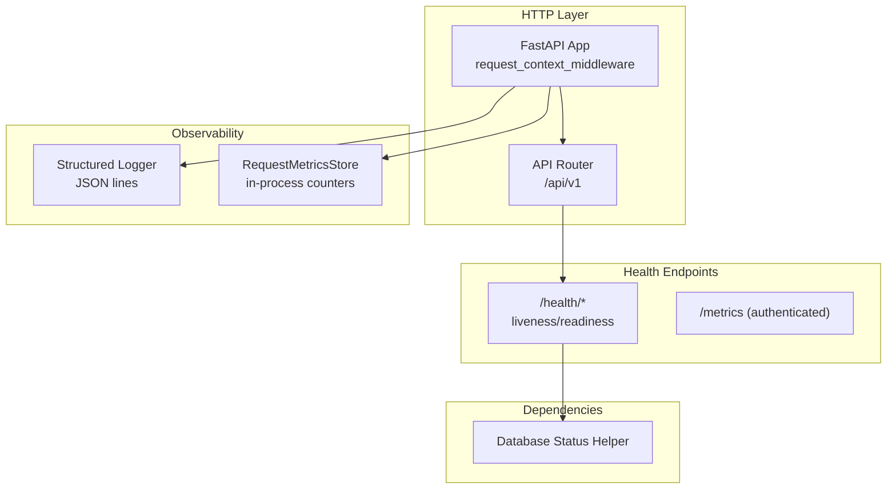
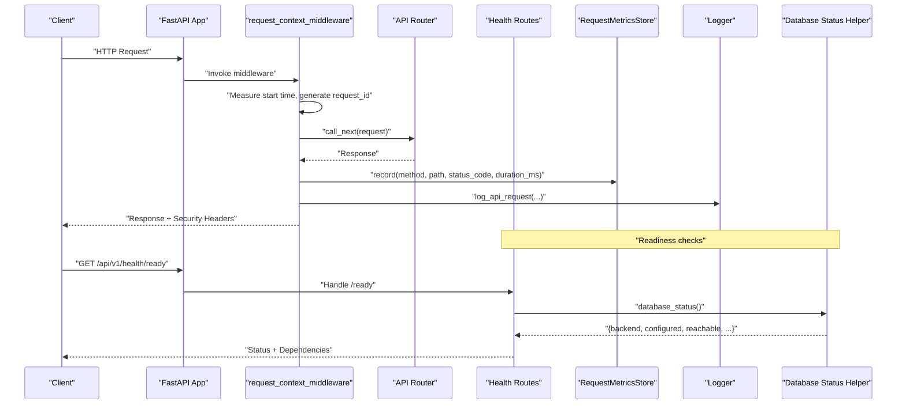
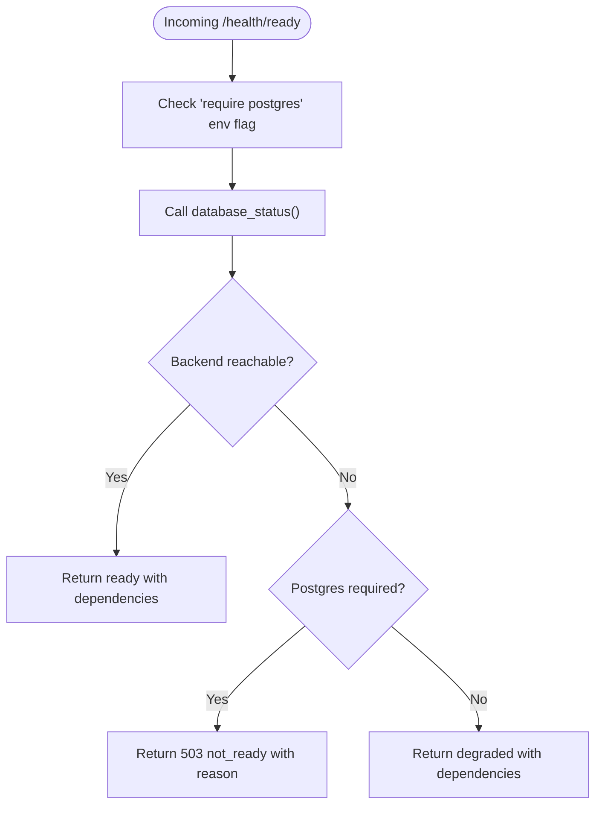
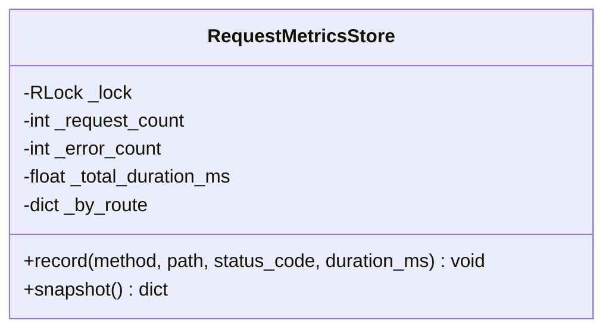
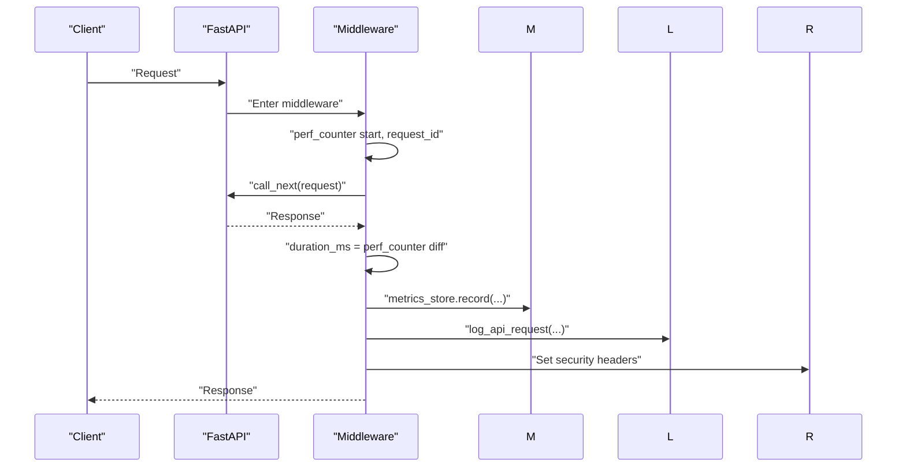
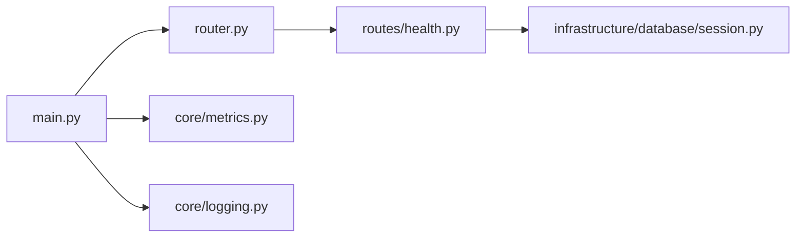

# System Monitoring & Health

<cite>
**Referenced Files in This Document**
- [main.py](file://backend/app/main.py)
- [health.py](file://backend/app/api/v1/routes/health.py)
- [router.py](file://backend/app/api/v1/router.py)
- [metrics.py](file://backend/app/core/metrics.py)
- [logging.py](file://backend/app/core/logging.py)
- [session.py](file://backend/app/infrastructure/database/session.py)
</cite>

## Table of Contents
1. [Introduction](#introduction)
2. [Project Structure](#project-structure)
3. [Core Components](#core-components)
4. [Architecture Overview](#architecture-overview)
5. [Detailed Component Analysis](#detailed-component-analysis)
6. [Dependency Analysis](#dependency-analysis)
7. [Performance Considerations](#performance-considerations)
8. [Troubleshooting Guide](#troubleshooting-guide)
9. [Conclusion](#conclusion)
10. [Appendices](#appendices)

## Introduction
This document describes the system monitoring and health capabilities implemented in the backend, including built-in health endpoints, metrics collection, structured logging, and guidance for dashboards, alerts, and incident response. It focuses on how requests are observed end-to-end, how readiness is determined with database dependencies, and how to integrate these signals into external observability stacks.

## Project Structure
The monitoring-related functionality is implemented across a small set of focused modules:
- HTTP middleware that measures request duration, injects request IDs, records metrics, and emits structured logs
- Health endpoints providing liveness/readiness and an authenticated metrics snapshot
- A lightweight in-process metrics store tracking per-route counters and latencies
- Structured JSON logging helpers for API requests and exceptions
- Database status helper used by readiness checks

**Diagram sources**
- [main.py:27-48](file://backend/app/main.py#L27-L48)
- [router.py:26-27](file://backend/app/api/v1/router.py#L26-L27)
- [health.py:10-66](file://backend/app/api/v1/routes/health.py#L10-L66)
- [metrics.py:7-48](file://backend/app/core/metrics.py#L7-L48)
- [logging.py:7-45](file://backend/app/core/logging.py#L7-L45)
- [session.py:36-62](file://backend/app/infrastructure/database/session.py#L36-L62)

**Section sources**
- [main.py:1-52](file://backend/app/main.py#L1-L52)
- [router.py:1-47](file://backend/app/api/v1/router.py#L1-L47)

## Core Components
- Request context middleware: Measures latency, propagates X-Request-ID, records metrics, writes structured logs, and sets security headers.
- Health endpoints: Liveness (/live), basic health (/), readiness (/ready) with dependency checks, and authenticated metrics (/metrics).
- Metrics store: Thread-safe in-process counters for total and per-route request counts, errors, and average durations.
- Structured logging: JSON-formatted logs for API requests and exceptions with consistent fields.
- Database status helper: Reports configured backend type, reachability, and pool details when Postgres is enabled.

Key responsibilities and interactions:
- The middleware calls metrics.record() and log_api_request() after each request.
- Readiness endpoint queries database_status() and returns dependency details.
- Authenticated /metrics endpoint exposes a snapshot of in-process counters.

**Section sources**
- [main.py:27-48](file://backend/app/main.py#L27-L48)
- [health.py:10-66](file://backend/app/api/v1/routes/health.py#L10-L66)
- [metrics.py:7-48](file://backend/app/core/metrics.py#L7-L48)
- [logging.py:11-45](file://backend/app/core/logging.py#L11-L45)
- [session.py:36-62](file://backend/app/infrastructure/database/session.py#L36-L62)

## Architecture Overview
End-to-end flow for a single HTTP request:

**Diagram sources**
- [main.py:27-48](file://backend/app/main.py#L27-L48)
- [router.py:26-27](file://backend/app/api/v1/router.py#L26-L27)
- [health.py:20-60](file://backend/app/api/v1/routes/health.py#L20-L60)
- [metrics.py:15-45](file://backend/app/core/metrics.py#L15-L45)
- [logging.py:11-31](file://backend/app/core/logging.py#L11-L31)
- [session.py:36-62](file://backend/app/infrastructure/database/session.py#L36-L62)

## Detailed Component Analysis

### Health Endpoints
- GET /api/v1/health: Returns a simple service status.
- GET /api/v1/health/live: Liveness probe returning alive status.
- GET /api/v1/health/ready: Readiness probe that inspects database configuration and reachability; can return degraded or not_ready depending on environment flags and dependency state.
- GET /api/v1/health/metrics: Authenticated endpoint exposing in-process metrics snapshot.

Behavior highlights:
- Readiness considers whether Postgres is required via environment flag and reports dependency details including backend type and reachability.
- Metrics endpoint enforces permissions before returning the snapshot.

**Diagram sources**
- [health.py:20-60](file://backend/app/api/v1/routes/health.py#L20-L60)
- [session.py:36-62](file://backend/app/infrastructure/database/session.py#L36-L62)

**Section sources**
- [health.py:10-66](file://backend/app/api/v1/routes/health.py#L10-L66)

### Metrics Collection
- In-process store tracks:
  - Total request count, error count, average duration
  - Per-route breakdown with request_count, error_count, average_duration_ms
- Thread-safe recording using a reentrant lock.
- Snapshot provides aggregated totals and sorted route-level metrics.

Operational notes:
- Counters are process-scoped; they reset on restart.
- Suitable for short-term trend analysis and local debugging; pair with exporters if long-term retention is needed.

**Diagram sources**
- [metrics.py:7-48](file://backend/app/core/metrics.py#L7-L48)

**Section sources**
- [metrics.py:7-48](file://backend/app/core/metrics.py#L7-L48)

### Structured Logging
- JSON-formatted logs for API requests and exceptions with consistent keys such as request_id, method, path, status_code, duration_ms, client_ip, and message.
- Global logger initialized with INFO level and a standard format prefix.

Recommended usage:
- Use log_api_request() from middleware to emit one line per request.
- Use log_exception() for error paths to capture context alongside stack traces.

**Section sources**
- [logging.py:7-45](file://backend/app/core/logging.py#L7-L45)

### Middleware Integration
- Generates or forwards X-Request-ID and attaches it to both request state and response headers.
- Records metrics and emits structured logs after call_next completes.
- Adds security headers and conditional HSTS in production.

**Diagram sources**
- [main.py:27-48](file://backend/app/main.py#L27-L48)

**Section sources**
- [main.py:27-48](file://backend/app/main.py#L27-L48)

## Dependency Analysis
- main.py includes the v1 router under the configured API prefix and wires the HTTP middleware.
- health routes depend on runtime.store.backend and database_status() to report readiness.
- metrics and logging are invoked centrally in middleware, ensuring uniform instrumentation across all routes.

**Diagram sources**
- [main.py:16-52](file://backend/app/main.py#L16-L52)
- [router.py:26-27](file://backend/app/api/v1/router.py#L26-L27)
- [health.py:20-60](file://backend/app/api/v1/routes/health.py#L20-L60)
- [session.py:36-62](file://backend/app/infrastructure/database/session.py#L36-L62)
- [metrics.py:7-48](file://backend/app/core/metrics.py#L7-L48)
- [logging.py:7-45](file://backend/app/core/logging.py#L7-L45)

**Section sources**
- [main.py:16-52](file://backend/app/main.py#L16-L52)
- [router.py:1-47](file://backend/app/api/v1/router.py#L1-L47)

## Performance Considerations
- Keep metrics granularity reasonable: per-route aggregation is already implemented; avoid adding high-cardinality dimensions at this layer.
- Prefer asynchronous workloads where possible to reduce contention on the metrics lock during bursts.
- For long-term retention and cross-process visibility, consider exporting metrics to a time-series database via a sidecar or agent.
- Ensure database pool settings align with expected concurrency to prevent connection saturation.

[No sources needed since this section provides general guidance]

## Troubleshooting Guide
Common issues and diagnostics:
- Service appears down:
  - Verify liveness endpoint responds quickly.
  - Inspect structured logs for startup errors or unhandled exceptions.
- Service not accepting traffic:
  - Check readiness endpoint; look for database unreachable or misconfiguration.
  - Review database_status output for reachable=false and error details.
- High latency or errors:
  - Use metrics snapshot to identify slow or failing routes.
  - Correlate with structured logs using request_id to trace full request lifecycle.
- Missing request correlation:
  - Confirm X-Request-ID is present in request/response headers and logs.

Actionable steps:
- Query /health/ready to validate dependency states.
- Pull /health/metrics (with appropriate credentials) to compare recent error rates and latencies.
- Search logs by request_id to reconstruct the timeline of a problematic request.

**Section sources**
- [health.py:20-66](file://backend/app/api/v1/routes/health.py#L20-L66)
- [metrics.py:27-45](file://backend/app/core/metrics.py#L27-L45)
- [logging.py:11-45](file://backend/app/core/logging.py#L11-L45)
- [session.py:36-62](file://backend/app/infrastructure/database/session.py#L36-L62)

## Conclusion
The backend provides essential observability primitives: standardized request tracing via X-Request-ID, structured JSON logs, in-process metrics with per-route breakdowns, and robust readiness checks tied to database availability. These components form a solid foundation for dashboards, alerting, and incident response. Extending them with centralized log aggregation and metrics export will further enhance operational visibility.

[No sources needed since this section summarizes without analyzing specific files]

## Appendices

### Built-in Endpoints Reference
- GET /api/v1/health: Basic health check
- GET /api/v1/health/live: Liveness probe
- GET /api/v1/health/ready: Readiness probe with dependency details
- GET /api/v1/health/metrics: Authenticated metrics snapshot

**Section sources**
- [health.py:10-66](file://backend/app/api/v1/routes/health.py#L10-L66)
- [router.py:26-27](file://backend/app/api/v1/router.py#L26-L27)

### Structured Logging Fields
- API request log fields: request_id, method, path, status_code, duration_ms, client_ip
- Exception log fields: request_id, method, path, message

**Section sources**
- [logging.py:11-45](file://backend/app/core/logging.py#L11-L45)

### Metrics Snapshot Schema
Top-level fields:
- request_count: total number of recorded requests
- error_count: total number of responses with status >= 400
- average_duration_ms: overall average latency
- routes: array of per-route entries with route, request_count, error_count, average_duration_ms

**Section sources**
- [metrics.py:27-45](file://backend/app/core/metrics.py#L27-L45)

### Readiness Dependency Details
Typical fields returned by readiness:
- database: backend type (e.g., postgres or json-file)
- database_detail: detailed status including configured/reachable and optional error
- postgres_preferred: boolean indicating Postgres reachability when configured
- queue, vector_store, object_storage, tool_adapters: current configuration summary

**Section sources**
- [health.py:48-60](file://backend/app/api/v1/routes/health.py#L48-L60)
- [session.py:36-62](file://backend/app/infrastructure/database/session.py#L36-L62)