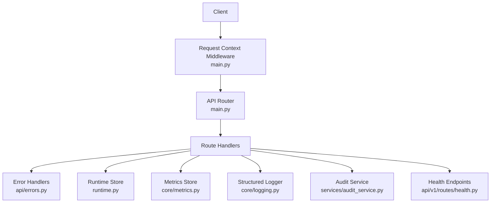
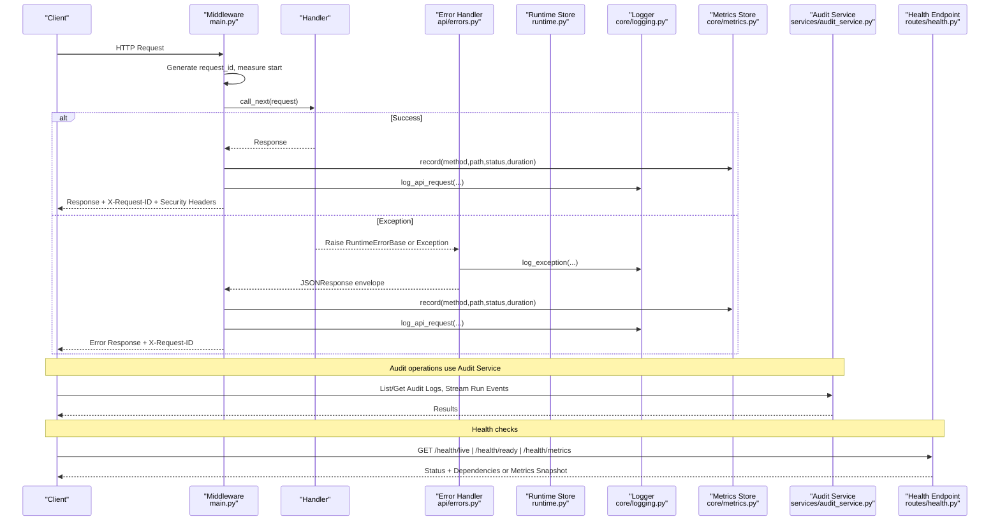
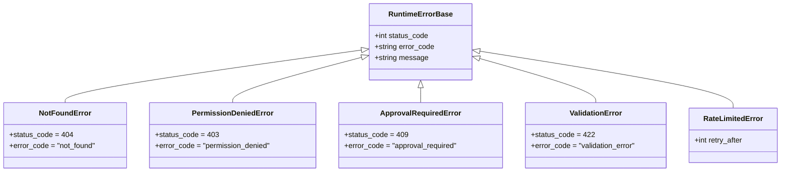
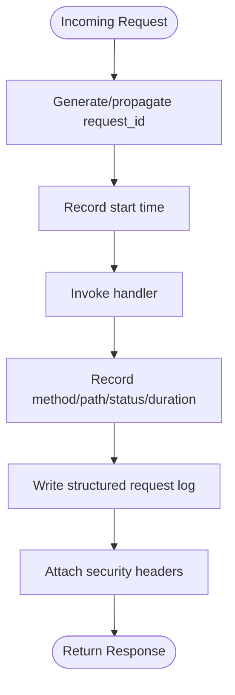
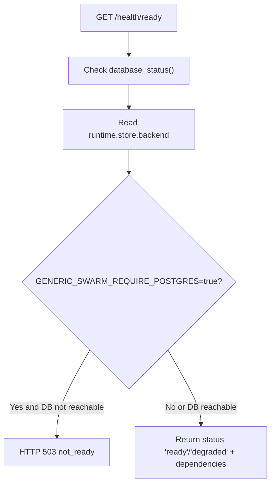
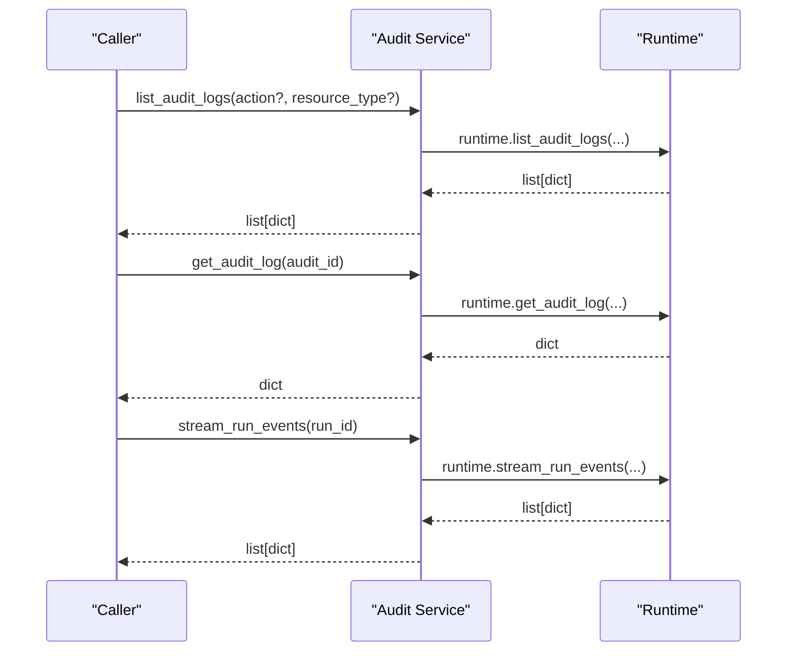
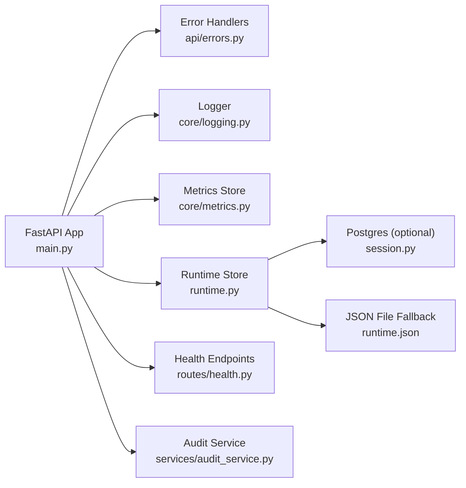

# Troubleshooting & Diagnostics

<cite>
**Referenced Files in This Document**
- [backend/app/main.py](file://backend/app/main.py)
- [backend/app/core/logging.py](file://backend/app/core/logging.py)
- [backend/app/core/metrics.py](file://backend/app/core/metrics.py)
- [backend/app/api/errors.py](file://backend/app/api/errors.py)
- [backend/app/runtime.py](file://backend/app/runtime.py)
- [backend/app/api/v1/routes/health.py](file://backend/app/api/v1/routes/health.py)
- [backend/app/services/audit_service.py](file://backend/app/services/audit_service.py)
- [docs/troubleshooting.md](file://docs/troubleshooting.md)
</cite>

## Table of Contents
1. Introduction
2. Project Structure
3. Core Components
4. Architecture Overview
5. Detailed Component Analysis
6. Dependency Analysis
7. Performance Considerations
8. Troubleshooting Guide
9. Conclusion

## Introduction
This document provides comprehensive troubleshooting and diagnostic guidance for the system. It covers common issues, error patterns, resolution steps, and operational procedures for log analysis, performance profiling, memory leak detection, resource utilization, API failures, workflow execution problems, integration issues, security incidents, audit log review, and forensic analysis. The content is grounded in the backend’s logging, metrics, error handling, runtime store, health endpoints, and audit services.

## Project Structure
The backend exposes a FastAPI application with:
- Central request middleware that injects request IDs, records metrics, logs requests, and sets security headers.
- Global exception handlers that normalize errors and log exceptions.
- A runtime store that persists state to Postgres (preferred) or JSON file fallback.
- Health endpoints for liveness/readiness checks and an authenticated metrics endpoint.
- Audit service methods to list and retrieve audit logs and stream run events.

**Diagram sources**
- [backend/app/main.py:27-48](file://backend/app/main.py#L27-L48)
- [backend/app/api/errors.py:8-47](file://backend/app/api/errors.py#L8-L47)
- [backend/app/core/metrics.py:7-49](file://backend/app/core/metrics.py#L7-L49)
- [backend/app/core/logging.py:11-46](file://backend/app/core/logging.py#L11-L46)
- [backend/app/runtime.py:258-384](file://backend/app/runtime.py#L258-L384)
- [backend/app/api/v1/routes/health.py:10-67](file://backend/app/api/v1/routes/health.py#L10-L67)
- [backend/app/services/audit_service.py:1-14](file://backend/app/services/audit_service.py#L1-L14)

**Section sources**
- [backend/app/main.py:1-52](file://backend/app/main.py#L1-L52)
- [backend/app/api/errors.py:1-47](file://backend/app/api/errors.py#L1-L47)
- [backend/app/core/metrics.py:1-49](file://backend/app/core/metrics.py#L1-L49)
- [backend/app/core/logging.py:1-46](file://backend/app/core/logging.py#L1-L46)
- [backend/app/runtime.py:258-384](file://backend/app/runtime.py#L258-L384)
- [backend/app/api/v1/routes/health.py:1-67](file://backend/app/api/v1/routes/health.py#L1-L67)
- [backend/app/services/audit_service.py:1-14](file://backend/app/services/audit_service.py#L1-L14)

## Core Components
- Request context middleware: Generates and propagates request IDs, measures latency, records metrics, writes structured request logs, and attaches security headers.
- Error handling: Normalizes domain and unexpected exceptions into consistent JSON envelopes; includes retry hints when applicable.
- Metrics store: Thread-safe counters for total requests, errors, average duration, and per-route breakdowns.
- Structured logger: Emits JSON-formatted request and exception logs with correlation via request ID.
- Runtime store: Persists application state to Postgres (preferred) or JSON file fallback; performs migrations and sanitization.
- Health endpoints: Provide liveness, readiness (including database reachability), and authenticated metrics snapshot.
- Audit service: Provides listing, retrieval, and streaming of audit logs and run events.

**Section sources**
- [backend/app/main.py:27-48](file://backend/app/main.py#L27-L48)
- [backend/app/api/errors.py:8-47](file://backend/app/api/errors.py#L8-L47)
- [backend/app/core/metrics.py:7-49](file://backend/app/core/metrics.py#L7-L49)
- [backend/app/core/logging.py:11-46](file://backend/app/core/logging.py#L11-L46)
- [backend/app/runtime.py:258-384](file://backend/app/runtime.py#L258-L384)
- [backend/app/api/v1/routes/health.py:10-67](file://backend/app/api/v1/routes/health.py#L10-L67)
- [backend/app/services/audit_service.py:1-14](file://backend/app/services/audit_service.py#L1-L14)

## Architecture Overview
End-to-end flow for a typical API request, including diagnostics and observability hooks.

**Diagram sources**
- [backend/app/main.py:27-48](file://backend/app/main.py#L27-L48)
- [backend/app/api/errors.py:8-47](file://backend/app/api/errors.py#L8-L47)
- [backend/app/core/metrics.py:15-45](file://backend/app/core/metrics.py#L15-L45)
- [backend/app/core/logging.py:11-46](file://backend/app/core/logging.py#L11-L46)
- [backend/app/runtime.py:258-384](file://backend/app/runtime.py#L258-L384)
- [backend/app/api/v1/routes/health.py:10-67](file://backend/app/api/v1/routes/health.py#L10-L67)
- [backend/app/services/audit_service.py:1-14](file://backend/app/services/audit_service.py#L1-L14)

## Detailed Component Analysis

### Error Handling and Envelope
- Domain errors derive from a base class and map to specific HTTP status codes and error codes.
- Global exception handler returns a consistent JSON envelope with code, message, details, and meta.request_id.
- RateLimitedError can include Retry-After header.
- Unhandled exceptions are logged and returned as internal server error.

**Diagram sources**
- [backend/app/runtime.py:93-129](file://backend/app/runtime.py#L93-L129)
- [backend/app/api/errors.py:8-47](file://backend/app/api/errors.py#L8-L47)

**Section sources**
- [backend/app/runtime.py:93-129](file://backend/app/runtime.py#L93-L129)
- [backend/app/api/errors.py:8-47](file://backend/app/api/errors.py#L8-L47)

### Request Lifecycle and Observability
- Middleware generates request ID, measures duration, records metrics, logs request, and adds security headers.
- Metrics store tracks counts and averages globally and per route.
- Structured logger emits JSON lines with request correlation.

**Diagram sources**
- [backend/app/main.py:27-48](file://backend/app/main.py#L27-L48)
- [backend/app/core/metrics.py:15-45](file://backend/app/core/metrics.py#L15-L45)
- [backend/app/core/logging.py:11-31](file://backend/app/core/logging.py#L11-L31)

**Section sources**
- [backend/app/main.py:27-48](file://backend/app/main.py#L27-L48)
- [backend/app/core/metrics.py:7-49](file://backend/app/core/metrics.py#L7-L49)
- [backend/app/core/logging.py:1-46](file://backend/app/core/logging.py#L1-L46)

### Health and Readiness Checks
- Liveness: simple alive check.
- Readiness: checks configured storage backend and database reachability; can enforce Postgres requirement via environment variable.
- Metrics endpoint: requires authentication and permission.

**Diagram sources**
- [backend/app/api/v1/routes/health.py:20-60](file://backend/app/api/v1/routes/health.py#L20-L60)

**Section sources**
- [backend/app/api/v1/routes/health.py:10-67](file://backend/app/api/v1/routes/health.py#L10-L67)

### Audit and Run Event Access
- Audit service exposes list/get audit logs and stream run events, delegating to runtime.

**Diagram sources**
- [backend/app/services/audit_service.py:1-14](file://backend/app/services/audit_service.py#L1-L14)

**Section sources**
- [backend/app/services/audit_service.py:1-14](file://backend/app/services/audit_service.py#L1-L14)

## Dependency Analysis
Key runtime and infrastructure dependencies:
- Storage backend selection: Postgres preferred; JSON file fallback used if Postgres unavailable or disabled.
- Database connectivity influences readiness status.
- Metrics and logging are always active regardless of storage backend.

**Diagram sources**
- [backend/app/main.py:1-52](file://backend/app/main.py#L1-L52)
- [backend/app/api/errors.py:1-47](file://backend/app/api/errors.py#L1-L47)
- [backend/app/core/logging.py:1-46](file://backend/app/core/logging.py#L1-L46)
- [backend/app/core/metrics.py:1-49](file://backend/app/core/metrics.py#L1-L49)
- [backend/app/runtime.py:258-384](file://backend/app/runtime.py#L258-L384)
- [backend/app/api/v1/routes/health.py:1-67](file://backend/app/api/v1/routes/health.py#L1-L67)
- [backend/app/services/audit_service.py:1-14](file://backend/app/services/audit_service.py#L1-L14)

**Section sources**
- [backend/app/runtime.py:258-384](file://backend/app/runtime.py#L258-L384)
- [backend/app/api/v1/routes/health.py:20-60](file://backend/app/api/v1/routes/health.py#L20-L60)

## Performance Considerations
- Use the metrics endpoint to identify slow or error-prone routes by examining per-route counts and average durations.
- Correlate high-latency requests using the request ID across logs and metrics.
- Prefer Postgres for production workloads to avoid JSON file I/O bottlenecks and ensure durability.
- Monitor error rates and 4xx/5xx spikes via metrics snapshot and structured logs.

[No sources needed since this section provides general guidance]

## Troubleshooting Guide

### Common System Issues and Resolutions
- Backend shows no Postgres on readiness:
  - Verify DATABASE_URL configuration and that Postgres is running.
  - Check GET /health/ready response for database detail and status.
- Empty data after restart:
  - Confirm Postgres is the primary store; JSON file is backup only.
- Authentication failures:
  - Use password-based login for admin accounts; static tokens are smoke-only.
- Tool step fails closed:
  - Inspect tool_effects and audit tool.executed entries; adapters reject missing inputs.
- Flagship run fails mid-run due to memory:
  - Ensure agents have correct allowed_memory_scopes (seed/normalize union includes organization scopes).
- Import/PYTHONPATH errors:
  - From backend directory, set PYTHONPATH=. then re-run tests or uvicorn.

**Section sources**
- [docs/troubleshooting.md:13-24](file://docs/troubleshooting.md#L13-L24)

### API Failures Investigation
- Step-by-step:
  1. Capture the request ID from the response header X-Request-ID.
  2. Search logs for the request ID to locate the full trace.
  3. Review the error envelope for code, message, and details.
  4. For rate limiting, check Retry-After header and backoff strategy.
  5. Validate input schemas and permissions; verify user role and required permissions.
  6. If unhandled exception occurred, expect internal_error and inspect server logs.

**Section sources**
- [backend/app/main.py:27-48](file://backend/app/main.py#L27-L48)
- [backend/app/api/errors.py:8-47](file://backend/app/api/errors.py#L8-L47)
- [backend/app/core/logging.py:34-46](file://backend/app/core/logging.py#L34-L46)

### Workflow Execution Issues
- Step-by-step:
  1. Retrieve run events via audit service stream_run_events(run_id).
  2. Correlate run events with request IDs and structured logs.
  3. Check governance gates and approval requirements; confirm human gate steps.
  4. Validate agent allowed_tools and allowed_memory_scopes.
  5. Inspect tool_effects for adapter-level failures.

**Section sources**
- [backend/app/services/audit_service.py:12-14](file://backend/app/services/audit_service.py#L12-L14)
- [backend/app/runtime.py:730-755](file://backend/app/runtime.py#L730-L755)

### Integration Problems
- Step-by-step:
  1. Confirm external dependency status via /health/ready and its dependencies object.
  2. For Postgres-required deployments, ensure GENERIC_SWARM_REQUIRE_POSTGRES=false unless Postgres is reachable.
  3. Validate network access and credentials for external integrations.
  4. Review structured logs for connection errors and retries.

**Section sources**
- [backend/app/api/v1/routes/health.py:20-60](file://backend/app/api/v1/routes/health.py#L20-L60)

### Security Incidents and Forensics
- Step-by-step:
  1. Collect all audit logs filtered by action/resource_type relevant to the incident.
  2. Retrieve specific audit entries by ID for detailed context.
  3. Stream run events for affected runs to reconstruct timeline.
  4. Correlate with request IDs and IP addresses from request logs.
  5. Preserve evidence and maintain chain-of-custody for logs and artifacts.

**Section sources**
- [backend/app/services/audit_service.py:4-14](file://backend/app/services/audit_service.py#L4-L14)
- [backend/app/core/logging.py:11-31](file://backend/app/core/logging.py#L11-L31)

### Diagnostic Tools and Techniques
- Health checks:
  - GET /health/live for liveness.
  - GET /health/ready for readiness and dependency status.
  - GET /health/metrics for authenticated metrics snapshot.
- Metrics:
  - Use metrics snapshot to analyze request_count, error_count, average_duration_ms, and per-route breakdowns.
- Logs:
  - Parse JSON logs for request_id, method, path, status_code, duration_ms, client_ip.
  - Filter by error messages and stack traces for exceptions.

**Section sources**
- [backend/app/api/v1/routes/health.py:10-67](file://backend/app/api/v1/routes/health.py#L10-L67)
- [backend/app/core/metrics.py:27-45](file://backend/app/core/metrics.py#L27-L45)
- [backend/app/core/logging.py:11-46](file://backend/app/core/logging.py#L11-L46)

### Performance Profiling and Resource Utilization
- Use metrics endpoint to identify hotspots and regressions.
- Correlate high average_duration_ms with specific routes and times.
- Monitor error_count trends to detect cascading failures.
- Prefer Postgres-backed runtime for reduced I/O contention and better concurrency.

**Section sources**
- [backend/app/api/v1/routes/health.py:63-67](file://backend/app/api/v1/routes/health.py#L63-L67)
- [backend/app/core/metrics.py:15-45](file://backend/app/core/metrics.py#L15-L45)

### Memory Leak Detection
- Indicators:
  - Gradual increase in process memory without corresponding metric spikes.
  - Elevated GC pressure or frequent long pauses.
- Actions:
  - Profile allocations during representative workloads.
  - Inspect long-lived collections in runtime store and ensure proper cleanup.
  - Validate that large payloads are streamed or paginated where possible.

[No sources needed since this section provides general guidance]

### Operational Runbooks
- Quick verification commands and checks are available in the repository’s troubleshooting guide.
- Use the provided scripts and validation commands to ensure prerequisites and business seeds are correctly initialized.

**Section sources**
- [docs/troubleshooting.md:1-12](file://docs/troubleshooting.md#L1-L12)
- [docs/troubleshooting.md:41-48](file://docs/troubleshooting.md#L41-L48)

## Conclusion
By leveraging structured logs, metrics, health endpoints, and audit services, operators can rapidly diagnose API failures, workflow execution issues, integration problems, and security incidents. Consistent use of request IDs, careful attention to error envelopes, and periodic review of metrics snapshots form the foundation of effective troubleshooting and continuous improvement.