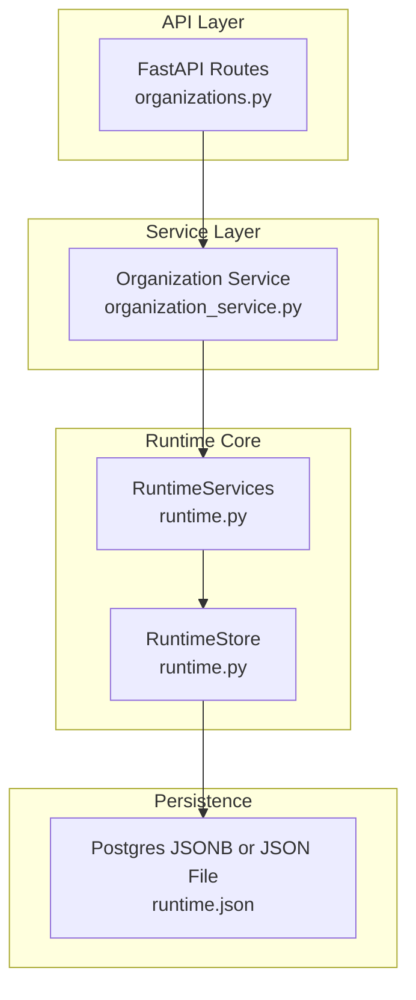
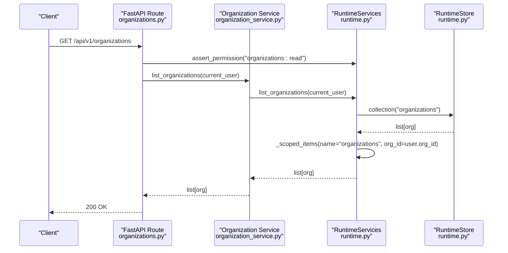
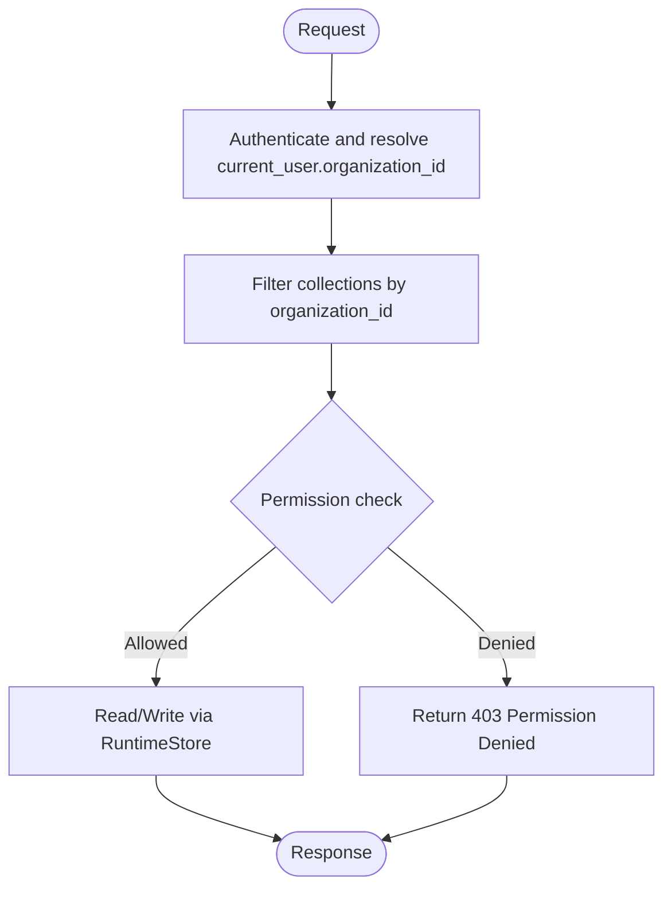
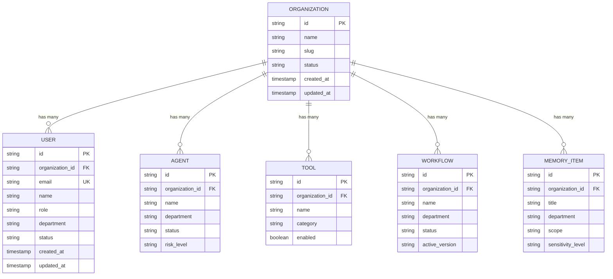
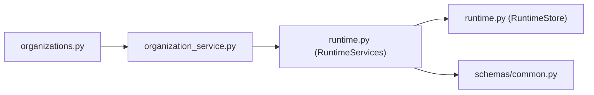

# Organization & Department Management

<cite>
**Referenced Files in This Document**
- [runtime.py](file://backend/app/runtime.py)
- [organizations.py](file://backend/app/api/v1/routes/organizations.py)
- [organization_service.py](file://backend/app/services/organization_service.py)
- [common.py](file://backend/app/schemas/common.py)
</cite>

## Table of Contents
1. [Introduction](#introduction)
2. [Project Structure](#project-structure)
3. [Core Components](#core-components)
4. [Architecture Overview](#architecture-overview)
5. [Detailed Component Analysis](#detailed-component-analysis)
6. [Dependency Analysis](#dependency-analysis)
7. [Performance Considerations](#performance-considerations)
8. [Troubleshooting Guide](#troubleshooting-guide)
9. [Conclusion](#conclusion)

## Introduction
This document explains the multi-organization architecture and department scoping implemented in the backend. It covers how organizations are created, configured, and managed; how users and resources are scoped to an organization; how departments are used for grouping and policy application; and how cross-organization collaboration is controlled. It also documents the available API endpoints for organization administration, member management, and resource allocation, along with examples and best practices for data isolation, scalability, performance, and monitoring.

## Project Structure
The multi-tenant capabilities are centered around a runtime store that persists all entities (including organizations, users, agents, tools, workflows, memory items, etc.) and enforces per-organization scoping on read/write operations. The FastAPI routes expose REST endpoints that delegate to service functions, which in turn call into the runtime layer for authorization, scoping, and persistence.

**Diagram sources**
- [organizations.py:1-30](file://backend/app/api/v1/routes/organizations.py#L1-L30)
- [organization_service.py:1-14](file://backend/app/services/organization_service.py#L1-L14)
- [runtime.py:258-384](file://backend/app/runtime.py#L258-L384)

**Section sources**
- [organizations.py:1-30](file://backend/app/api/v1/routes/organizations.py#L1-L30)
- [organization_service.py:1-14](file://backend/app/services/organization_service.py#L1-L14)
- [runtime.py:258-384](file://backend/app/runtime.py#L258-L384)

## Core Components
- RuntimeServices: Central orchestrator for authentication, authorization, scoping, and business logic across all domains (users, organizations, agents, tools, workflows, memory).
- RuntimeStore: Persistent document store with optional Postgres backend and JSON file fallback. Provides thread-safe access and collection helpers.
- API Routes: FastAPI endpoints for organization CRUD and related admin operations.
- Schemas: Pydantic models defining request/response contracts including organization updates and user/department fields.

Key responsibilities:
- Multi-tenancy via organization_id scoping on all collections.
- Role-based permissions controlling access to organization and user operations.
- Department field on users, agents, workflows, and memory items for grouping and policy application.
- Memory scope enforcement to isolate knowledge between organization and workflow contexts.

**Section sources**
- [runtime.py:131-222](file://backend/app/runtime.py#L131-L222)
- [runtime.py:258-384](file://backend/app/runtime.py#L258-L384)
- [runtime.py:827-830](file://backend/app/runtime.py#L827-L830)
- [common.py:59-63](file://backend/app/schemas/common.py#L59-L63)
- [common.py:30-51](file://backend/app/schemas/common.py#L30-L51)

## Architecture Overview
The system uses a single-tenant-per-request model where each authenticated user carries an organization_id. All reads and writes are filtered by this organization_id using a helper that returns only items belonging to the current organization (or unscoped items when appropriate). Departments provide a secondary grouping dimension within an organization but do not override organization boundaries.

**Diagram sources**
- [organizations.py:11-14](file://backend/app/api/v1/routes/organizations.py#L11-L14)
- [organization_service.py:4-5](file://backend/app/services/organization_service.py#L4-L5)
- [runtime.py:1261-1263](file://backend/app/runtime.py#L1261-L1263)
- [runtime.py:827-830](file://backend/app/runtime.py#L827-L830)

## Detailed Component Analysis

### Organization Lifecycle and Scoping
- Creation: On first bootstrap, a default organization is created if none exist.
- Listing: Users can list organizations visible to their own organization context.
- Reading: Users can read their own organization; cross-org reads are denied unless explicitly allowed.
- Updating: Only owners or users with explicit permission can update organization metadata and status.

Scoping mechanism:
- All collections are filtered by organization_id through a helper that includes items whose organization_id matches the current user’s organization or is None (for platform-level items).

**Diagram sources**
- [runtime.py:848-866](file://backend/app/runtime.py#L848-L866)
- [runtime.py:827-830](file://backend/app/runtime.py#L827-L830)
- [runtime.py:1261-1306](file://backend/app/runtime.py#L1261-L1306)

**Section sources**
- [runtime.py:757-805](file://backend/app/runtime.py#L757-L805)
- [runtime.py:1261-1306](file://backend/app/runtime.py#L1261-L1306)
- [runtime.py:827-830](file://backend/app/runtime.py#L827-L830)

### Department Hierarchy and Usage
- Department is a string field present on users, agents, workflows, and memory items.
- Default value is "general" when not specified.
- Used for grouping and filtering UIs and policies; does not replace organization boundaries.
- Invitations and user creation accept a department field to pre-populate membership attributes.

Examples of usage:
- Assigning users to departments during creation or invitation.
- Tagging workflows and agents with a department for discoverability.
- Applying department-scoped policies at the application layer (e.g., dashboards, reports).

**Section sources**
- [common.py:30-51](file://backend/app/schemas/common.py#L30-L51)
- [common.py:69-82](file://backend/app/schemas/common.py#L69-L82)
- [common.py:110-131](file://backend/app/schemas/common.py#L110-L131)
- [common.py:164-186](file://backend/app/schemas/common.py#L164-L186)
- [runtime.py:1065-1098](file://backend/app/runtime.py#L1065-L1098)
- [runtime.py:1144-1207](file://backend/app/runtime.py#L1144-L1207)
- [runtime.py:1319-1344](file://backend/app/runtime.py#L1319-L1344)
- [runtime.py:1485-1525](file://backend/app/runtime.py#L1485-L1525)

### Resource Isolation and Cross-Organization Controls
- All domain resources (agents, tools, workflows, memory items, etc.) carry organization_id and are returned only for the current user’s organization.
- API keys and tokens are bound to an organization; listing and revoking are scoped accordingly.
- Memory scope enforcement ensures agents can only read/write memory scopes they are allowed to use (e.g., organization_memory vs department_memory).

Cross-org collaboration controls:
- By design, direct cross-org access is denied. Collaboration should be achieved via shared workflows/tools definitions imported into the target organization or via federated processes outside the runtime store.

**Section sources**
- [runtime.py:827-830](file://backend/app/runtime.py#L827-L830)
- [runtime.py:977-1009](file://backend/app/runtime.py#L977-L1009)
- [runtime.py:903-936](file://backend/app/runtime.py#L903-L936)

### API Endpoints for Organization Administration
- List organizations: GET /api/v1/organizations
- Get organization: GET /api/v1/organizations/{organization_id}
- Update organization: PATCH /api/v1/organizations/{organization_id}

These endpoints enforce role-based permissions and organization scoping.

**Section sources**
- [organizations.py:11-29](file://backend/app/api/v1/routes/organizations.py#L11-L29)
- [organization_service.py:4-13](file://backend/app/services/organization_service.py#L4-L13)
- [runtime.py:1261-1306](file://backend/app/runtime.py#L1261-L1306)

### Member Management APIs
- Create user: POST /api/v1/users (service-backed)
- Update user: PATCH /api/v1/users/{user_id}
- Invite user: POST /api/v1/users/invitations
- Accept invitation: Public endpoint to activate invited user

Department assignment:
- Both create and invite flows accept a department field.

**Section sources**
- [common.py:30-51](file://backend/app/schemas/common.py#L30-L51)
- [runtime.py:1065-1098](file://backend/app/runtime.py#L1065-L1098)
- [runtime.py:1100-1142](file://backend/app/runtime.py#L1100-L1142)
- [runtime.py:1144-1207](file://backend/app/runtime.py#L1144-L1207)
- [runtime.py:1218-1259](file://backend/app/runtime.py#L1218-L1259)

### Resource Allocation APIs (Agents, Tools, Workflows)
- Agents: create, update status, archive, list, get, activity, tools
- Tools: create, update enabled/archived, list, get
- Workflows: create, update, add version, activate version, list, get

All resources are scoped to the current organization and include a department field for grouping.

**Section sources**
- [runtime.py:1308-1396](file://backend/app/runtime.py#L1308-L1396)
- [runtime.py:1398-1452](file://backend/app/runtime.py#L1398-L1452)
- [runtime.py:1454-1600](file://backend/app/runtime.py#L1454-L1600)
- [common.py:69-82](file://backend/app/schemas/common.py#L69-L82)
- [common.py:84-99](file://backend/app/schemas/common.py#L84-L99)
- [common.py:110-131](file://backend/app/schemas/common.py#L110-L131)

### Data Models and Relationships

**Diagram sources**
- [runtime.py:225-255](file://backend/app/runtime.py#L225-L255)
- [runtime.py:1065-1098](file://backend/app/runtime.py#L1065-L1098)
- [runtime.py:1319-1344](file://backend/app/runtime.py#L1319-L1344)
- [runtime.py:1409-1431](file://backend/app/runtime.py#L1409-L1431)
- [runtime.py:1485-1525](file://backend/app/runtime.py#L1485-L1525)
- [runtime.py:787-804](file://backend/app/runtime.py#L787-L804)

## Dependency Analysis
- API routes depend on service functions for organization operations.
- Services delegate to RuntimeServices for authorization and scoping.
- RuntimeServices depends on RuntimeStore for persistence and uses helpers to filter by organization_id.
- Schemas define request payloads and defaults (including department).

**Diagram sources**
- [organizations.py:1-30](file://backend/app/api/v1/routes/organizations.py#L1-L30)
- [organization_service.py:1-14](file://backend/app/services/organization_service.py#L1-L14)
- [runtime.py:258-384](file://backend/app/runtime.py#L258-L384)
- [common.py:59-63](file://backend/app/schemas/common.py#L59-L63)

**Section sources**
- [organizations.py:1-30](file://backend/app/api/v1/routes/organizations.py#L1-L30)
- [organization_service.py:1-14](file://backend/app/services/organization_service.py#L1-L14)
- [runtime.py:258-384](file://backend/app/runtime.py#L258-L384)
- [common.py:59-63](file://backend/app/schemas/common.py#L59-L63)

## Performance Considerations
- Persistence backend: Prefer Postgres JSONB for production workloads; the store automatically falls back to a local JSON file when Postgres is unavailable.
- Thread safety: RuntimeStore uses a reentrant lock to serialize writes and avoid corruption under concurrent requests.
- Collection scoping: Filtering by organization_id is performed in-memory; ensure indexes and pagination are applied at higher layers if datasets grow large.
- Token and key lookups: Access token and API key maps are stored in-memory; consider cache strategies for high-throughput scenarios.

Recommendations:
- Enable Postgres backend in production environments.
- Monitor store save latency and database write throughput.
- Use pagination and filters on list endpoints to reduce payload sizes.
- Avoid scanning entire collections in custom code; prefer targeted queries.

**Section sources**
- [runtime.py:258-384](file://backend/app/runtime.py#L258-L384)
- [runtime.py:827-830](file://backend/app/runtime.py#L827-L830)

## Troubleshooting Guide
Common issues and resolutions:
- Permission denied errors: Ensure the caller has the required role and belongs to the correct organization. Check role permissions and organization_id binding.
- Not found errors: Verify the requested resource exists within the current organization scope.
- Invalid credentials or disabled accounts: Confirm user status and password hashes; legacy hashes are upgraded on successful login.
- Invitation acceptance failures: Ensure the invitation token is valid and not expired; set a strong password during acceptance.

Operational checks:
- Inspect audit logs appended by runtime operations for failed actions.
- Validate schema constraints for requests (e.g., unknown roles, invalid statuses).

**Section sources**
- [runtime.py:848-866](file://backend/app/runtime.py#L848-L866)
- [runtime.py:937-959](file://backend/app/runtime.py#L937-L959)
- [runtime.py:1218-1259](file://backend/app/runtime.py#L1218-L1259)
- [runtime.py:1868-1893](file://backend/app/runtime.py#L1868-L1893)

## Conclusion
The backend implements robust multi-organization scoping with clear separation of concerns: API routes handle HTTP concerns, services encapsulate business logic, and the runtime core enforces authorization, scoping, and persistence. Departments provide intra-organization grouping without crossing organization boundaries. For scalable deployments, enable Postgres, monitor store performance, and apply pagination and filtering. Use invitations and role-based permissions to manage members safely, and rely on memory scope enforcement to keep knowledge isolated.