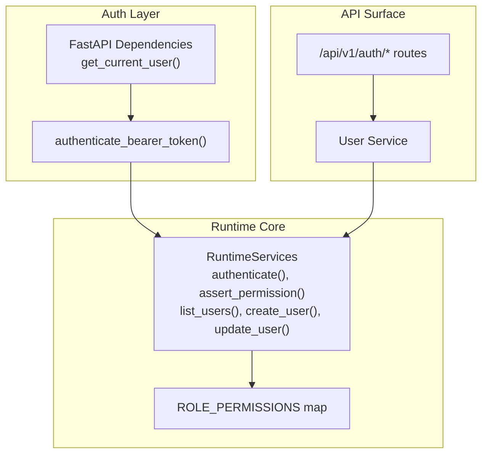
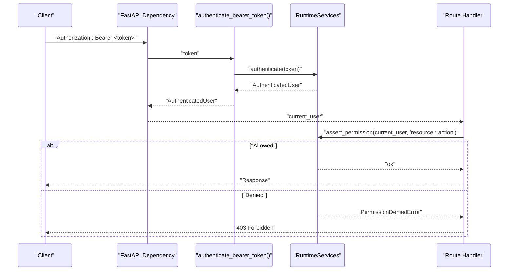
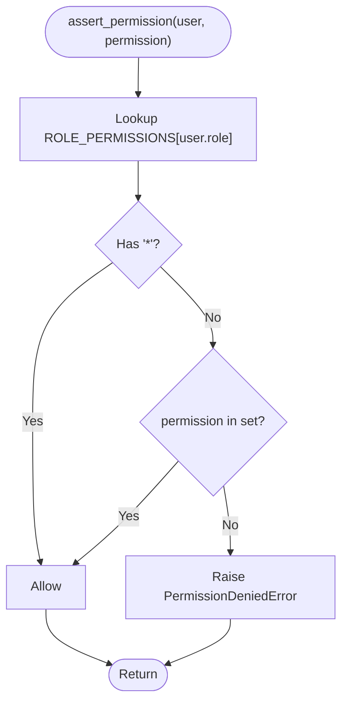
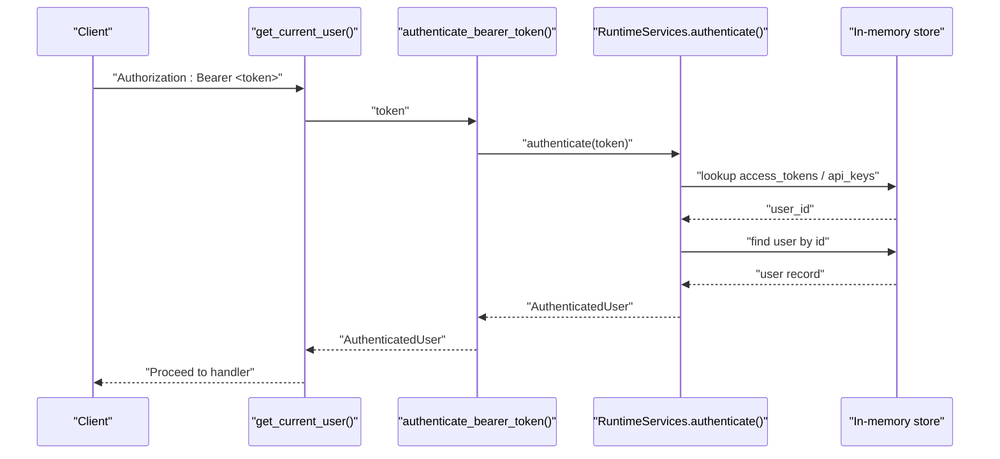
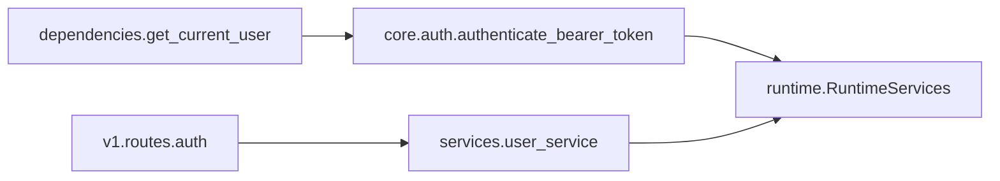

# Roles & Permissions (RBAC)

<cite>
**Referenced Files in This Document**
- [runtime.py](file://backend/app/runtime.py)
- [auth.py](file://backend/app/core/auth.py)
- [dependencies.py](file://backend/app/api/dependencies.py)
- [permissions.py](file://backend/app/core/permissions.py)
- [auth_routes.py](file://backend/app/api/v1/routes/auth.py)
- [users_service.py](file://backend/app/services/user_service.py)
</cite>

## Table of Contents
1. [Introduction](#introduction)
2. [Project Structure](#project-structure)
3. [Core Components](#core-components)
4. [Architecture Overview](#architecture-overview)
5. [Detailed Component Analysis](#detailed-component-analysis)
6. [Dependency Analysis](#dependency-analysis)
7. [Performance Considerations](#performance-considerations)
8. [Troubleshooting Guide](#troubleshooting-guide)
9. [Conclusion](#conclusion)

## Introduction
This document describes the Role-Based Access Control (RBAC) system implemented in the backend. It explains the permission model, predefined roles, how permissions are evaluated at runtime, scope-based controls for memory access, and how to configure and audit role changes. It also provides guidance on security best practices, testing strategies, and troubleshooting common access issues.

## Project Structure
The RBAC implementation is centered around a small set of modules:
- Runtime core that defines roles, permissions, authentication, authorization checks, and user management
- Authentication helpers and FastAPI dependencies to extract the current user from requests
- A thin permissions utility used by other components
- API routes and services that enforce permissions before performing operations

**Diagram sources**
- [dependencies.py:13-17](file://backend/app/api/dependencies.py#L13-L17)
- [auth.py:6-7](file://backend/app/core/auth.py#L6-L7)
- [runtime.py:848-866](file://backend/app/runtime.py#L848-L866)
- [runtime.py:1054-1142](file://backend/app/runtime.py#L1054-L1142)
- [auth_routes.py:15-64](file://backend/app/api/v1/routes/auth.py#L15-L64)
- [users_service.py:1-34](file://backend/app/services/user_service.py#L1-L34)

**Section sources**
- [dependencies.py:1-18](file://backend/app/api/dependencies.py#L1-L18)
- [auth.py:1-8](file://backend/app/core/auth.py#L1-L8)
- [runtime.py:131-222](file://backend/app/runtime.py#L131-L222)
- [runtime.py:848-866](file://backend/app/runtime.py#L848-L866)
- [auth_routes.py:15-64](file://backend/app/api/v1/routes/auth.py#L15-L64)
- [users_service.py:1-34](file://backend/app/services/user_service.py#L1-L34)

## Core Components
- AuthenticatedUser: Identity object carrying id, organization_id, email, name, and role.
- ROLE_PERMISSIONS: Central mapping of roles to sets of fine-grained permissions.
- RuntimeServices.authenticate(): Validates bearer tokens or API keys and returns an AuthenticatedUser.
- RuntimeServices.assert_permission(): Enforces that the user’s role includes the requested permission.
- User management methods: list/get/create/update users with role validation and audit logging.
- Memory scope enforcement: Additional scope-based checks for memory read/write actions.

Key behaviors:
- Predefined roles include owner, admin, manager, operator, reviewer, viewer, and service_account.
- The owner role has wildcard permissions; others have explicit permission sets.
- Permission evaluation is dynamic based on the user’s role at request time.
- Organization scoping applies to user listing and retrieval.

**Section sources**
- [runtime.py:131-138](file://backend/app/runtime.py#L131-L138)
- [runtime.py:140-222](file://backend/app/runtime.py#L140-L222)
- [runtime.py:848-866](file://backend/app/runtime.py#L848-L866)
- [runtime.py:1054-1142](file://backend/app/runtime.py#L1054-L1142)
- [runtime.py:903-935](file://backend/app/runtime.py#L903-L935)

## Architecture Overview
End-to-end flow for authenticated requests:
- Client sends Authorization header with Bearer token.
- FastAPI dependency extracts token and calls authenticate_bearer_token().
- Runtime authenticates token against access_tokens or api_keys, resolves user, and returns AuthenticatedUser.
- Route handlers call runtime.assert_permission() before executing business logic.
- For memory operations, runtime.assert_memory_scope_allowed() enforces agent-scoped access.

**Diagram sources**
- [dependencies.py:13-17](file://backend/app/api/dependencies.py#L13-L17)
- [auth.py:6-7](file://backend/app/core/auth.py#L6-L7)
- [runtime.py:848-866](file://backend/app/runtime.py#L848-L866)
- [auth_routes.py:31-39](file://backend/app/api/v1/routes/auth.py#L31-L39)

## Detailed Component Analysis

### Permission Model and Predefined Roles
- Roles and permissions are defined centrally in ROLE_PERMISSIONS.
- The owner role has wildcard permissions ("*"), granting all actions.
- Other roles have explicit permission sets covering resources such as users, organizations, agents, tools, workflows, approvals, governance, knowledge, memory, evaluations, audit, processes, and settings.
- Example roles present: owner, admin, manager, operator, reviewer, viewer, service_account.

Configuration examples:
- To grant a new action to a role, add the corresponding resource:action string to that role’s set in ROLE_PERMISSIONS.
- To introduce a custom role, add a new key to ROLE_PERMISSIONS with its allowed permissions.

Note: The codebase does not implement hierarchical inheritance between roles; each role’s permissions are explicitly enumerated. Wildcard "*" grants all permissions for that role.

**Section sources**
- [runtime.py:140-222](file://backend/app/runtime.py#L140-L222)

### Dynamic Permission Evaluation
- RuntimeServices.assert_permission(user, permission) checks if the user’s role contains "*" or the exact permission.
- If denied, it raises a PermissionDeniedError with a descriptive message.
- This check is invoked by route handlers and services before performing sensitive operations.

**Diagram sources**
- [runtime.py:862-866](file://backend/app/runtime.py#L862-L866)

**Section sources**
- [runtime.py:862-866](file://backend/app/runtime.py#L862-L866)

### Scope-Based Access Control (Memory Scopes)
- Memory operations can be scoped per agent via allowed_memory_scopes.
- RuntimeServices.assert_memory_scope_allowed(agent, scope, action, organization_id, actor_user_id) denies access when the agent lacks the required scope.
- When denied, it logs an audit event and persists state.

Use cases:
- Restrict write access to organization-level memory for certain agents.
- Ensure workflow-scoped memory isolation.

**Section sources**
- [runtime.py:894-935](file://backend/app/runtime.py#L894-L935)

### Authentication Flow and Token Handling
- FastAPI dependency get_current_user extracts the Bearer token from the Authorization header.
- authenticate_bearer_token delegates to RuntimeServices.authenticate.
- RuntimeServices.authenticate validates tokens against access_tokens or api_keys, checks user status, and returns AuthenticatedUser.

**Diagram sources**
- [dependencies.py:13-17](file://backend/app/api/dependencies.py#L13-L17)
- [auth.py:6-7](file://backend/app/core/auth.py#L6-L7)
- [runtime.py:848-860](file://backend/app/runtime.py#L848-L860)

**Section sources**
- [dependencies.py:13-17](file://backend/app/api/dependencies.py#L13-L17)
- [auth.py:6-7](file://backend/app/core/auth.py#L6-L7)
- [runtime.py:848-860](file://backend/app/runtime.py#L848-L860)

### User Management and Role Assignment
- Listing and retrieving users require users:read.
- Creating users requires users:create; default role is viewer unless specified.
- Updating users requires users:update; role changes must reference known roles; only owner can assign owner role.
- Disabling a user revokes their active access and refresh tokens.
- All mutations are audited.

Examples:
- Assigning a non-owner role to a user: permitted by admin/manager depending on their permissions.
- Assigning owner role: restricted to owner or any role with wildcard permissions.

**Section sources**
- [runtime.py:1054-1142](file://backend/app/runtime.py#L1054-L1142)

### API Key Management
- Listing API keys requires settings:read.
- Creating and revoking API keys require settings:update.
- API keys are tied to a user and organization context.

**Section sources**
- [runtime.py:977-1009](file://backend/app/runtime.py#L977-L1009)

### Password Reset Controls
- Password reset supports self-service or privileged admin within the same organization.
- Unauthenticated open resets are rejected.
- Successful resets upgrade legacy password hashes and log audit events.

**Section sources**
- [runtime.py:1011-1049](file://backend/app/runtime.py#L1011-L1049)

### Utility: Allowed Permissions Helper
- A helper function allows other modules to query the set of permissions for a given role.

**Section sources**
- [permissions.py:1-6](file://backend/app/core/permissions.py#L1-L6)

## Dependency Analysis
High-level relationships:
- FastAPI dependencies depend on auth helper which depends on runtime.
- Services delegate to runtime for authorization and data operations.
- Routes expose endpoints that rely on services and runtime.

**Diagram sources**
- [dependencies.py:13-17](file://backend/app/api/dependencies.py#L13-L17)
- [auth.py:6-7](file://backend/app/core/auth.py#L6-L7)
- [runtime.py:848-866](file://backend/app/runtime.py#L848-L866)
- [users_service.py:1-34](file://backend/app/services/user_service.py#L1-L34)
- [auth_routes.py:15-64](file://backend/app/api/v1/routes/auth.py#L15-L64)

**Section sources**
- [dependencies.py:1-18](file://backend/app/api/dependencies.py#L1-L18)
- [auth.py:1-8](file://backend/app/core/auth.py#L1-L8)
- [users_service.py:1-34](file://backend/app/services/user_service.py#L1-L34)
- [auth_routes.py:15-64](file://backend/app/api/v1/routes/auth.py#L15-L64)
- [runtime.py:848-866](file://backend/app/runtime.py#L848-L866)

## Performance Considerations
- Permission checks are O(1) set lookups using the user’s role.
- Token lookup is dictionary-based and constant-time.
- Avoid adding large nested structures to roles; keep permission sets flat and minimal.
- Persisted state updates occur after mutations; batch operations where possible to reduce I/O.

[No sources needed since this section provides general guidance]

## Troubleshooting Guide
Common issues and resolutions:
- 403 Permission Denied:
  - Verify the user’s role and ensure the required permission exists in ROLE_PERMISSIONS for that role.
  - Confirm the request includes a valid Bearer token or API key.
- Invalid or missing bearer token:
  - Ensure Authorization header format is "Bearer <token>".
  - Check that the token exists in access_tokens or api_keys and maps to an active user.
- Unknown role error during user creation/update:
  - Only roles defined in ROLE_PERMISSIONS are accepted. Add the role to ROLE_PERMISSIONS if introducing a custom role.
- Cannot disable own account:
  - Self-disabling is blocked; use another admin account to change your status.
- Owner assignment restrictions:
  - Only owner (or wildcard-permission roles) can assign the owner role.

Operational tips:
- Use the /api/v1/auth/me endpoint to inspect the current user’s role and identity.
- Review audit logs for permission denials and role changes.

**Section sources**
- [runtime.py:848-866](file://backend/app/runtime.py#L848-L866)
- [runtime.py:1065-1142](file://backend/app/runtime.py#L1065-L1142)
- [auth_routes.py:31-39](file://backend/app/api/v1/routes/auth.py#L31-L39)

## Conclusion
The RBAC system uses a central role-to-permissions map and runtime-enforced checks to provide fine-grained, dynamic authorization. Roles are explicitly defined without inheritance, and scope-based controls further restrict memory access. Security is reinforced through token validation, organization scoping, and comprehensive audit logging. Extending the system involves updating ROLE_PERMISSIONS and ensuring route handlers invoke assert_permission appropriately.