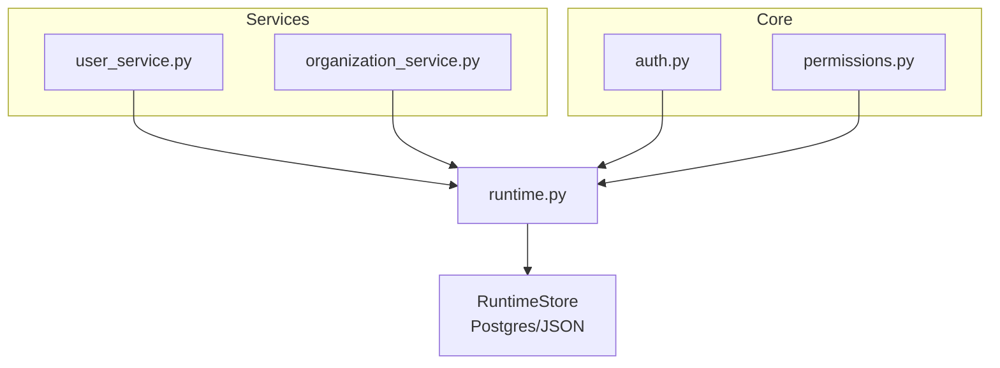
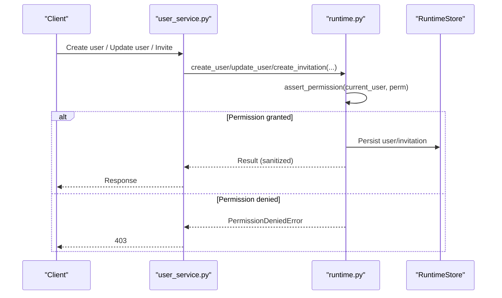
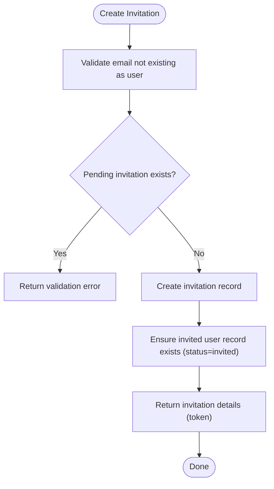
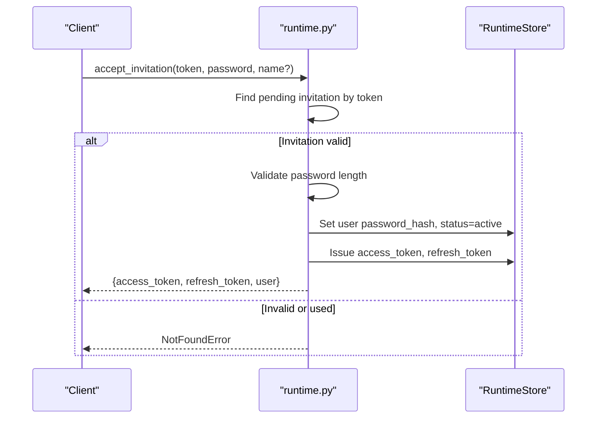
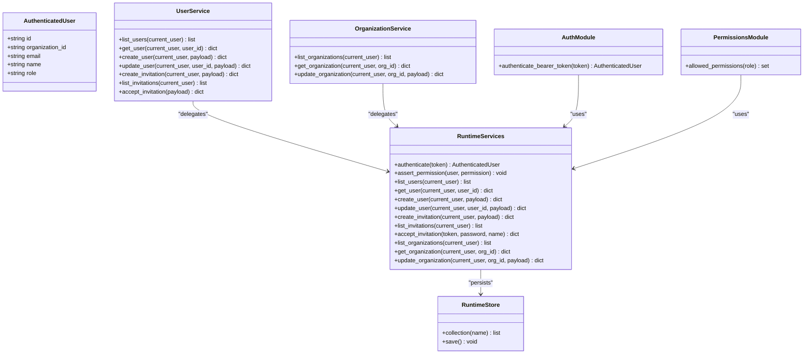

# User & Organization Management

<cite>
**Referenced Files in This Document**
- [runtime.py](file://backend/app/runtime.py)
- [user_service.py](file://backend/app/services/user_service.py)
- [organization_service.py](file://backend/app/services/organization_service.py)
- [auth.py](file://backend/app/core/auth.py)
- [permissions.py](file://backend/app/core/permissions.py)
</cite>

## Table of Contents
1. [Introduction](#introduction)
2. [Project Structure](#project-structure)
3. [Core Components](#core-components)
4. [Architecture Overview](#architecture-overview)
5. [Detailed Component Analysis](#detailed-component-analysis)
6. [Dependency Analysis](#dependency-analysis)
7. [Performance Considerations](#performance-considerations)
8. [Troubleshooting Guide](#troubleshooting-guide)
9. [Conclusion](#conclusion)
10. [Appendices](#appendices)

## Introduction
This document provides comprehensive user and organization management guidance for the platform, focusing on:
- User lifecycle operations (create, read, update, delete via status changes, invitation workflows)
- Role-based access control (RBAC), permission assignment, and security policies
- Multi-organization setup and scoping by department
- Cross-organization collaboration controls
- API endpoints for user administration, bulk operations, and audit trails
- Practical examples for provisioning users, assigning roles, and revoking access

The implementation is backed by a runtime store that persists state to Postgres or a JSON file fallback, with RBAC enforced through role-permission mappings and organization-scoped data access.

## Project Structure
User and organization management spans services, core auth, permissions, and the central runtime layer:
- Services expose thin wrappers around runtime methods
- Core modules provide authentication and permission helpers
- Runtime implements business logic, persistence, RBAC, invitations, and audit logging

**Diagram sources**
- [user_service.py](file://backend/app/services/user_service.py)
- [organization_service.py](file://backend/app/services/organization_service.py)
- [auth.py](file://backend/app/core/auth.py)
- [permissions.py](file://backend/app/core/permissions.py)
- [runtime.py](file://backend/app/runtime.py)

**Section sources**
- [user_service.py](file://backend/app/services/user_service.py)
- [organization_service.py](file://backend/app/services/organization_service.py)
- [auth.py](file://backend/app/core/auth.py)
- [permissions.py](file://backend/app/core/permissions.py)
- [runtime.py](file://backend/app/runtime.py)

## Core Components
- AuthenticatedUser: Identity context carrying id, organization_id, email, name, role
- ROLE_PERMISSIONS: Central mapping of roles to permission sets
- RuntimeServices: Business logic for users, organizations, invitations, tokens, and audit logs
- RuntimeStore: Persistent storage abstraction over Postgres or JSON file

Key responsibilities:
- Authentication and token issuance/validation
- RBAC enforcement via assert_permission
- Organization-scoped CRUD for users and organizations
- Invitation creation and acceptance
- Audit trail recording for all sensitive actions

**Section sources**
- [runtime.py](file://backend/app/runtime.py)
- [permissions.py](file://backend/app/core/permissions.py)

## Architecture Overview
End-to-end flow for user administration and invitation acceptance:

**Diagram sources**
- [user_service.py](file://backend/app/services/user_service.py)
- [runtime.py](file://backend/app/runtime.py)

## Detailed Component Analysis

### User Lifecycle Operations
- List users: Scoped to current organization; requires users:read
- Get user: Scoped lookup by id; requires users:read
- Create user: Validates uniqueness of email, allowed roles, and status; creates tokens if active; audits creation
- Update user: Supports updating name, department, role, status; prevents self-disable; enforces owner-only role assignment rules; revokes tokens on disable
- Delete user: Not directly exposed; deactivation is achieved by setting status to disabled, which also revokes live tokens

Common administrative tasks:
- Provision a new user: call create_user with email, name, role, optional department; returns seed tokens when status=active
- Assign or change role: call update_user with role; only owners can assign owner
- Revoke access: call update_user with status=disabled; tokens are revoked immediately

Security considerations:
- Password hashing uses PBKDF2-HMAC-SHA256 with migration support for legacy hashes
- Status values are restricted to active, invited, disabled
- Email uniqueness enforced across the system

Audit trail:
- All user mutations are recorded with actor, action, resource, metadata, and timestamp

**Section sources**
- [runtime.py](file://backend/app/runtime.py)

### Invitation Workflow
- Create invitation: Requires users:invite; validates email uniqueness and pending invitation presence; records invitation and placeholder invited user with status=invited
- List invitations: Scoped to current organization; requires users:read
- Accept invitation: Public endpoint accepts token, sets password, activates user, issues tokens, updates invitation status

Flow:

**Diagram sources**
- [runtime.py](file://backend/app/runtime.py)

Acceptance flow:

**Diagram sources**
- [runtime.py](file://backend/app/runtime.py)

### Role-Based Access Control (RBAC)
Roles and permissions:
- owner: * (unrestricted)
- admin: broad read/write across users, organizations, agents, tools, workflows, approvals, governance, knowledge, memory, evaluations, audit, processes, settings
- manager: read-heavy plus approvals and write to knowledge/memory
- operator: execution-focused with limited writes
- reviewer: read and approve/reject
- viewer: read-only
- service_account: workflow execution and read/write memory within scope

Permission checks:
- assert_permission enforces role-permission mapping
- Special guards prevent non-owner from assigning owner role

Security policy highlights:
- Only owner can invite as owner
- Self-disable prevention
- Token revocation on user disable
- Password reset requires authenticated caller or valid reset token

**Section sources**
- [runtime.py](file://backend/app/runtime.py)
- [permissions.py](file://backend/app/core/permissions.py)

### Multi-Organization Setup and Scoping
- Default organization created at bootstrap with seeded users and tokens
- All user and organization queries are scoped to current_user.organization_id
- Organization update restricted to own org unless owner or wildcard permissions apply
- Department field on users supports internal scoping and reporting

Cross-organization collaboration:
- Current design scopes resources to a single organization per request
- Cross-org access would require explicit multi-tenant routing and additional authorization checks beyond current scope filters

**Section sources**
- [runtime.py](file://backend/app/runtime.py)

### API Endpoints for User Administration
Note: The following endpoints are implemented in the runtime layer and surfaced via services. Actual HTTP routes are defined elsewhere; this section documents the logical API surface.

- POST /api/v1/users
  - Action: Create user
  - Permissions: users:create
  - Body: email, name, role (default viewer), department, status (default active), password (optional if creating active)
  - Response: Sanitized user; includes seed_access_token and seed_refresh_token when status=active

- GET /api/v1/users
  - Action: List users
  - Permissions: users:read
  - Response: List of sanitized users scoped to current organization

- GET /api/v1/users/{user_id}
  - Action: Get user
  - Permissions: users:read
  - Response: Sanitized user

- PATCH /api/v1/users/{user_id}
  - Action: Update user
  - Permissions: users:update
  - Body: name, department, role, status
  - Notes: Owner-only role assignment; self-disable prevented; disabling revokes tokens

- POST /api/v1/users/invitations
  - Action: Create invitation
  - Permissions: users:invite
  - Body: email, role (default viewer), department, name (optional)
  - Response: Invitation details including token

- GET /api/v1/users/invitations
  - Action: List invitations
  - Permissions: users:read
  - Response: Invitations scoped to current organization

- POST /api/v1/users/invitations/accept
  - Action: Accept invitation
  - Body: token, password, name (optional)
  - Response: access_token, refresh_token, token_type, user

- POST /api/v1/auth/login
  - Action: Authenticate and issue tokens
  - Body: email, password
  - Response: access_token, refresh_token, token_type, user

- POST /api/v1/auth/logout
  - Action: Logout and invalidate access token
  - Header: Authorization: Bearer <access_token>
  - Response: logged_out

- POST /api/v1/auth/refresh
  - Action: Refresh access token using refresh token
  - Body: refresh_token
  - Response: access_token, refresh_token, token_type

- POST /api/v1/auth/password-reset
  - Action: Reset password (authenticated self-service or privileged admin)
  - Body: email, new_password; optionally acting_user or reset_token depending on flow
  - Response: message indicating success

Bulk operations:
- Bulk user creation is not provided as a dedicated endpoint; iterate create_user calls with idempotency keys where applicable
- Bulk role updates can be performed by iterating update_user calls

Audit trails:
- All user and invitation operations append audit entries with actor, action, resource, metadata, and timestamp

**Section sources**
- [runtime.py](file://backend/app/runtime.py)

### Security Policies and Controls
- Authentication:
  - Bearer token validation against access_tokens or api_keys
  - Disabled or invited accounts cannot authenticate
- Passwords:
  - PBKDF2-HMAC-SHA256 hashing with salt
  - Legacy SHA-256 migration path supported
- Authorization:
  - RBAC enforced via ROLE_PERMISSIONS
  - Organization-scoped access for all user and organization operations
- Session management:
  - Access and refresh tokens persisted and mapped to user ids
  - Disabling a user revokes their live tokens

**Section sources**
- [runtime.py](file://backend/app/runtime.py)

## Dependency Analysis
High-level dependencies between components:

**Diagram sources**
- [runtime.py](file://backend/app/runtime.py)
- [user_service.py](file://backend/app/services/user_service.py)
- [organization_service.py](file://backend/app/services/organization_service.py)
- [auth.py](file://backend/app/core/auth.py)
- [permissions.py](file://backend/app/core/permissions.py)

**Section sources**
- [runtime.py](file://backend/app/runtime.py)
- [user_service.py](file://backend/app/services/user_service.py)
- [organization_service.py](file://backend/app/services/organization_service.py)
- [auth.py](file://backend/app/core/auth.py)
- [permissions.py](file://backend/app/core/permissions.py)

## Performance Considerations
- Persistence backend selection:
  - Postgres preferred when configured; JSON file fallback ensures local/dev operation
  - Saves always persist to JSON snapshot for offline backup/migration
- Concurrency:
  - Thread-safe save with RLock to avoid concurrent write races
- Data scoping:
  - Organization-scoped queries filter by organization_id; ensure indexes on organization_id in Postgres for large datasets
- Token lookups:
  - In-memory maps for access_tokens and refresh_tokens; consider TTL and rotation strategies for high-scale deployments

[No sources needed since this section provides general guidance]

## Troubleshooting Guide
Common errors and resolutions:
- Permission denied:
  - Cause: Missing required permission or insufficient role
  - Resolution: Verify role-permission mapping and ensure caller has required permission
- Validation errors:
  - Cause: Invalid fields (e.g., unknown role, invalid status, missing required fields)
  - Resolution: Correct input according to constraints
- Not found:
  - Cause: Referenced user, organization, or invitation does not exist
  - Resolution: Confirm identifiers and scoping
- Account disabled or invited:
  - Cause: Authentication blocked due to account status
  - Resolution: Activate account or complete invitation acceptance

Operational tips:
- Use audit logs to trace failed attempts and changes
- For password resets, ensure either authenticated caller or valid reset token is provided
- When disabling users, confirm token revocation behavior aligns with operational needs

**Section sources**
- [runtime.py](file://backend/app/runtime.py)

## Conclusion
The user and organization management subsystem provides robust RBAC, secure authentication, and comprehensive auditability. It supports multi-organization scoping, invitation-based onboarding, and clear administrative workflows. For cross-organization collaboration, additional authorization layers would be required beyond current organization-scoped filters.

[No sources needed since this section summarizes without analyzing specific files]

## Appendices

### RBAC Quick Reference
- owner: *
- admin: users:read|create|update|invite; organizations:read|update; agents/tools/workflows/approvals/governance/knowledge/memory/evaluations/audit/processes/settings read/write as specified
- manager: read-heavy with approvals and knowledge/memory writes
- operator: execute workflows and manage runs
- reviewer: read and approve/reject
- viewer: read-only
- service_account: workflow execution and memory reads/writes within scope

**Section sources**
- [runtime.py](file://backend/app/runtime.py)