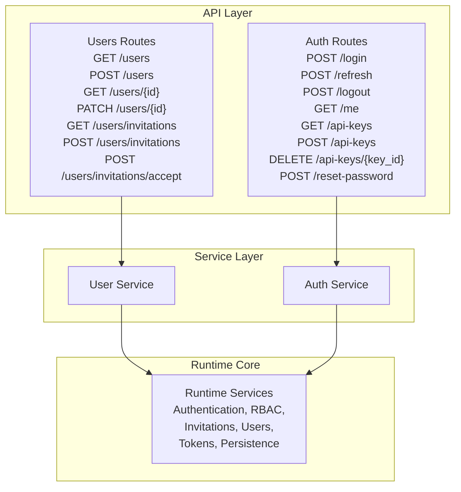
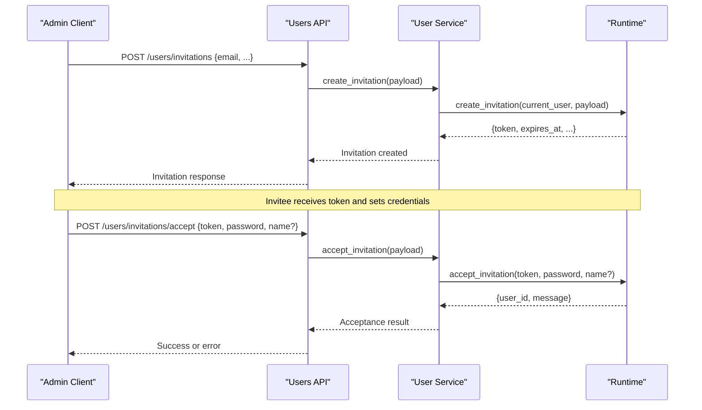
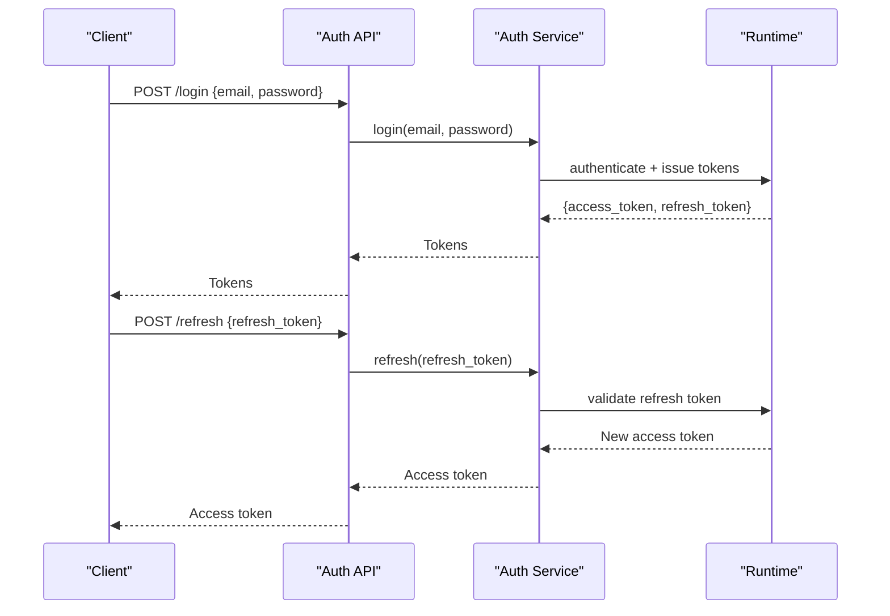
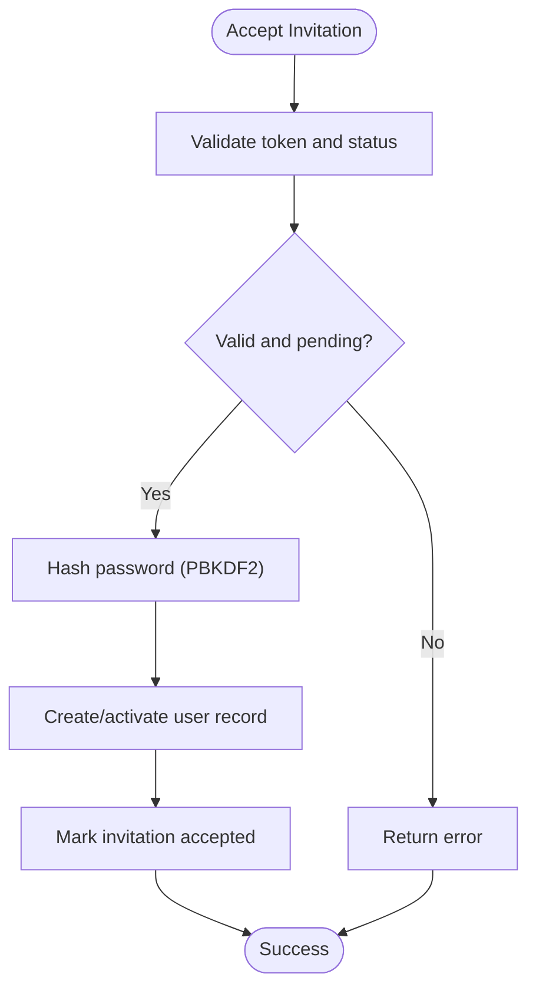
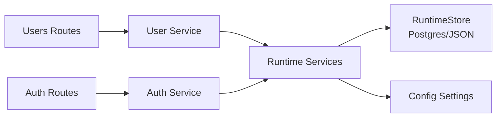

# User Lifecycle Management

<cite>
**Referenced Files in This Document**
- [users.py](file://backend/app/api/v1/routes/users.py)
- [auth.py](file://backend/app/api/v1/routes/auth.py)
- [user_service.py](file://backend/app/services/user_service.py)
- [runtime.py](file://backend/app/runtime.py)
- [auth.py](file://backend/app/core/auth.py)
- [security.py](file://backend/app/core/security.py)
- [router.py](file://backend/app/api/v1/router.py)
- [test_users_orgs_lifecycle.py](file://backend/app/tests/unit/test_users_orgs_lifecycle.py)
</cite>

## Table of Contents
1. [Introduction](#introduction)
2. [Project Structure](#project-structure)
3. [Core Components](#core-components)
4. [Architecture Overview](#architecture-overview)
5. [Detailed Component Analysis](#detailed-component-analysis)
6. [Dependency Analysis](#dependency-analysis)
7. [Performance Considerations](#performance-considerations)
8. [Troubleshooting Guide](#troubleshooting-guide)
9. [Conclusion](#conclusion)
10. [Appendices](#appendices)

## Introduction
This document describes user lifecycle management operations across the system, including creation, updates, deletion (where applicable), status management, and invitation-based onboarding. It covers API endpoints for CRUD-like operations, bulk and search/filter capabilities where available, and common administrative tasks such as provisioning, activation/deactivation, and data export. Security considerations, validation, and audit logging requirements are also addressed.

## Project Structure
User-related functionality is implemented under a layered structure:
- API routes define HTTP endpoints and enforce authentication/authorization.
- Service layer delegates to runtime services for business logic.
- Runtime encapsulates persistence, identity, permissions, and core workflows.



**Diagram sources**
- [users.py:24-66](file://backend/app/api/v1/routes/users.py#L24-L66)
- [auth.py:15-63](file://backend/app/api/v1/routes/auth.py#L15-L63)
- [user_service.py:4-33](file://backend/app/services/user_service.py#L4-L33)
- [runtime.py:1143-1230](file://backend/app/runtime.py#L1143-L1230)

**Section sources**
- [users.py:1-67](file://backend/app/api/v1/routes/users.py#L1-L67)
- [auth.py:1-64](file://backend/app/api/v1/routes/auth.py#L1-L64)
- [user_service.py:1-34](file://backend/app/services/user_service.py#L1-L34)
- [runtime.py:1143-1230](file://backend/app/runtime.py#L1143-L1230)

## Core Components
- API routes expose REST endpoints for users and invitations, with explicit permission checks for read operations.
- Service functions act as thin adapters to runtime methods.
- Runtime implements:
  - Authentication via bearer tokens and refresh tokens.
  - Role-based access control (RBAC) with role-permission mapping.
  - Invitation issuance and acceptance flows.
  - User listing, retrieval, creation, and update operations.
  - Password hashing and verification utilities.

Key responsibilities:
- Authorization: Permission checks like “users:read” gate list operations.
- Identity: AuthenticatedUser carries id, organization_id, email, name, role.
- Invitations: Create pending invitations; accept to complete registration by setting password and optional name.

**Section sources**
- [users.py:24-66](file://backend/app/api/v1/routes/users.py#L24-L66)
- [user_service.py:4-33](file://backend/app/services/user_service.py#L4-L33)
- [runtime.py:132-222](file://backend/app/runtime.py#L132-L222)
- [runtime.py:1143-1230](file://backend/app/runtime.py#L1143-L1230)

## Architecture Overview
The user lifecycle spans authentication, authorization, invitation issuance, and acceptance. The following sequence diagrams illustrate key flows.

### Invitation-Based Onboarding Flow


**Diagram sources**
- [users.py:40-51](file://backend/app/api/v1/routes/users.py#L40-L51)
- [user_service.py:20-33](file://backend/app/services/user_service.py#L20-L33)
- [runtime.py:1143-1230](file://backend/app/runtime.py#L1143-L1230)

### Login and Token Refresh Flow


**Diagram sources**
- [auth.py:15-28](file://backend/app/api/v1/routes/auth.py#L15-L28)
- [auth.py:20-22](file://backend/app/api/v1/routes/auth.py#L20-L22)
- [auth.py:31-39](file://backend/app/api/v1/routes/auth.py#L31-L39)
- [auth.py:42-54](file://backend/app/api/v1/routes/auth.py#L42-L54)
- [auth.py:57-63](file://backend/app/api/v1/routes/auth.py#L57-L63)
- [auth.py:1-8](file://backend/app/core/auth.py#L1-L8)
- [security.py:1-4](file://backend/app/core/security.py#L1-L4)

## Detailed Component Analysis

### Users API Endpoints
- GET /users
  - Requires “users:read” permission.
  - Returns paginated or full list depending on implementation.
- POST /users
  - Creates a new user within the current organization context.
- GET /users/{user_id}
  - Retrieves a specific user.
- PATCH /users/{user_id}
  - Partially updates user fields (only provided non-null fields).
- GET /users/invitations
  - Lists pending invitations.
- POST /users/invitations
  - Creates an invitation for a target email.
- POST /users/invitations/accept
  - Public endpoint to accept an invitation by providing token, password, and optional name.

Notes:
- Deletion endpoints are not present in the current routes; consider adding if required by policy.
- Bulk operations and advanced filtering are not exposed at this time.

**Section sources**
- [users.py:24-66](file://backend/app/api/v1/routes/users.py#L24-L66)

### Invitation Creation and Acceptance
- Creation:
  - Performed by authorized users (admin-level roles typically).
  - Generates a unique token stored in user_invitations collection with status “pending”.
- Acceptance:
  - Validates token and status.
  - Hashes provided password using PBKDF2-HMAC-SHA256.
  - Creates or activates user record and clears invitation state.



**Diagram sources**
- [runtime.py:1217-1230](file://backend/app/runtime.py#L1217-L1230)
- [runtime.py:70-90](file://backend/app/runtime.py#L70-L90)

**Section sources**
- [users.py:40-51](file://backend/app/api/v1/routes/users.py#L40-L51)
- [user_service.py:20-33](file://backend/app/services/user_service.py#L20-L33)
- [runtime.py:1143-1230](file://backend/app/runtime.py#L1143-L1230)
- [runtime.py:70-90](file://backend/app/runtime.py#L70-L90)

### Authentication and Authorization
- Bearer token authentication:
  - Extracted from Authorization header.
  - Verified against runtime token stores.
- Role-based permissions:
  - Roles include owner, admin, manager, operator, reviewer, viewer, service_account.
  - Each role maps to a set of permissions; e.g., “users:read”, “users:create”, “users:update”, “users:invite”.
- Me endpoint returns minimal profile info for the authenticated user.

```mermaid
classDiagram
class AuthenticatedUser {
+string id
+string organization_id
+string email
+string name
+string role
}
class RuntimeServices {
+authenticate(token) AuthenticatedUser
+assert_permission(user, perm) void
+create_invitation(user, payload) dict
+accept_invitation(token, password, name) dict
+list_users(user) list
+get_user(user, user_id) dict
+create_user(user, payload) dict
+update_user(user, user_id, payload) dict
}
class UsersRoutes {
+GET "/users"
+POST "/users"
+GET "/users/{user_id}"
+PATCH "/users/{user_id}"
+GET "/users/invitations"
+POST "/users/invitations"
+POST "/users/invitations/accept"
}
UsersRoutes --> RuntimeServices : "delegates"
RuntimeServices --> AuthenticatedUser : "uses"
```

**Diagram sources**
- [runtime.py:132-222](file://backend/app/runtime.py#L132-L222)
- [runtime.py:1143-1230](file://backend/app/runtime.py#L1143-L1230)
- [users.py:24-66](file://backend/app/api/v1/routes/users.py#L24-L66)

**Section sources**
- [auth.py:31-39](file://backend/app/api/v1/routes/auth.py#L31-L39)
- [auth.py:1-8](file://backend/app/core/auth.py#L1-L8)
- [security.py:1-4](file://backend/app/core/security.py#L1-L4)
- [runtime.py:132-222](file://backend/app/runtime.py#L132-L222)

### Data Validation and Security Considerations
- Password hashing:
  - Uses PBKDF2-HMAC-SHA256 with configurable iterations and random salt.
  - Supports legacy SHA-256 hashes during migration.
- Rate limiting:
  - Auth endpoints are rate-limited to mitigate brute-force attempts.
- Authorization enforcement:
  - Explicit permission checks before listing users.
  - Role-permission mapping ensures least privilege.
- Input sanitization:
  - Product name normalization and legacy sanitization applied to runtime state.

Recommendations:
- Enforce minimum password complexity and rotation policies at the service layer.
- Add input validation schemas for all request bodies.
- Ensure IDOR checks when retrieving/updating users by ID.

**Section sources**
- [runtime.py:70-90](file://backend/app/runtime.py#L70-L90)
- [runtime.py:30-43](file://backend/app/runtime.py#L30-L43)
- [auth.py:11-12](file://backend/app/api/v1/routes/auth.py#L11-L12)
- [users.py:24-27](file://backend/app/api/v1/routes/users.py#L24-L27)

### Audit Logging Requirements
- Audit logs are maintained in runtime state under “audit_logs”.
- Administrative actions (e.g., creating users, changing roles) should emit audit entries.
- Ensure sensitive fields are redacted in audit payloads.

Implementation guidance:
- Emit audit events after successful mutations.
- Include actor (current_user.id), action type, resource identifiers, and outcome.
- Persist audit records atomically with business changes.

**Section sources**
- [runtime.py:225-255](file://backend/app/runtime.py#L225-L255)

### Common Administrative Tasks
- Provisioning a new user:
  - Option A: Direct creation via POST /users (requires appropriate permissions).
  - Option B: Invitation-based onboarding via POST /users/invitations followed by client-side acceptance.
- Activating/deactivating accounts:
  - Update user status via PATCH /users/{user_id}.
  - Disabled users should be blocked from authentication.
- Data export:
  - Use GET /users to retrieve user lists for export; apply pagination and filters if supported.
  - For large datasets, implement server-side pagination and streaming responses.

**Section sources**
- [users.py:30-32](file://backend/app/api/v1/routes/users.py#L30-L32)
- [users.py:59-66](file://backend/app/api/v1/routes/users.py#L59-L66)
- [users.py:24-27](file://backend/app/api/v1/routes/users.py#L24-L27)

## Dependency Analysis
The user lifecycle depends on several modules:
- API routes depend on FastAPI router and dependencies.
- Service layer depends on runtime for business logic.
- Runtime depends on persistence (Postgres or JSON file fallback) and configuration.



**Diagram sources**
- [router.py:28](file://backend/app/api/v1/router.py#L28)
- [users.py:1-21](file://backend/app/api/v1/routes/users.py#L1-L21)
- [user_service.py:1-18](file://backend/app/services/user_service.py#L1-L18)
- [runtime.py:258-384](file://backend/app/runtime.py#L258-L384)

**Section sources**
- [router.py:28](file://backend/app/api/v1/router.py#L28)
- [users.py:1-21](file://backend/app/api/v1/routes/users.py#L1-L21)
- [user_service.py:1-18](file://backend/app/services/user_service.py#L1-L18)
- [runtime.py:258-384](file://backend/app/runtime.py#L258-L384)

## Performance Considerations
- Pagination: Implement server-side pagination for GET /users to handle large datasets efficiently.
- Indexing: Ensure database indexes on frequently queried fields (e.g., email, organization_id, status).
- Caching: Cache user profiles and permissions for short-lived sessions to reduce repeated lookups.
- Rate limiting: Keep auth endpoints rate-limited to protect against abuse.
- Async operations: Offload heavy tasks (e.g., notifications, exports) to background workers.

[No sources needed since this section provides general guidance]

## Troubleshooting Guide
Common issues and resolutions:
- Invalid or expired invitation token:
  - Verify token exists and status is “pending”.
  - Check expiration handling in acceptance flow.
- Authentication failures:
  - Confirm bearer token validity and refresh token usage.
  - Review rate limiting and account lockout policies.
- Permission denied errors:
  - Ensure caller has required permissions (e.g., “users:read”).
  - Validate role-permission mappings.
- Password reset issues:
  - Confirm password hashing compatibility and migration paths.

Operational checks:
- Inspect runtime state collections for users, user_invitations, access_tokens, refresh_tokens.
- Review audit logs for failed attempts and anomalies.

**Section sources**
- [runtime.py:1217-1230](file://backend/app/runtime.py#L1217-L1230)
- [runtime.py:132-222](file://backend/app/runtime.py#L132-L222)
- [runtime.py:225-255](file://backend/app/runtime.py#L225-L255)

## Conclusion
The user lifecycle management system provides robust APIs for user administration and invitation-based onboarding, backed by strong authentication, RBAC, and secure password handling. While deletion and advanced filtering/bulk operations are not currently exposed, the architecture supports extension. Emphasize validation, security hardening, and comprehensive audit logging to meet operational and compliance needs.

[No sources needed since this section summarizes without analyzing specific files]

## Appendices

### API Reference Summary
- Users
  - GET /users
  - POST /users
  - GET /users/{user_id}
  - PATCH /users/{user_id}
  - GET /users/invitations
  - POST /users/invitations
  - POST /users/invitations/accept
- Auth
  - POST /login
  - POST /refresh
  - POST /logout
  - GET /me
  - GET /api-keys
  - POST /api-keys
  - DELETE /api-keys/{key_id}
  - POST /reset-password

**Section sources**
- [users.py:24-66](file://backend/app/api/v1/routes/users.py#L24-L66)
- [auth.py:15-63](file://backend/app/api/v1/routes/auth.py#L15-L63)

### Unit Test References
- Invitation lifecycle tests demonstrate creation and acceptance flows.

**Section sources**
- [test_users_orgs_lifecycle.py:22-32](file://backend/app/tests/unit/test_users_orgs_lifecycle.py#L22-L32)