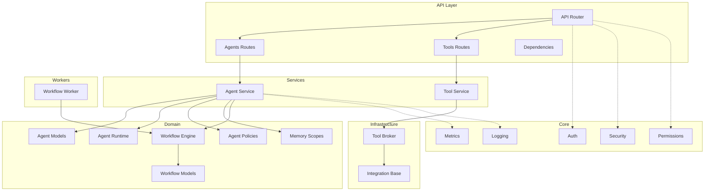
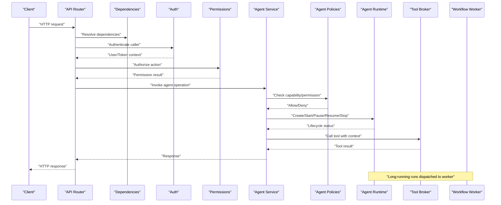
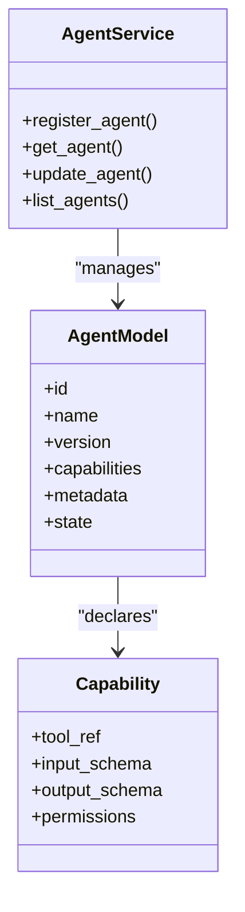
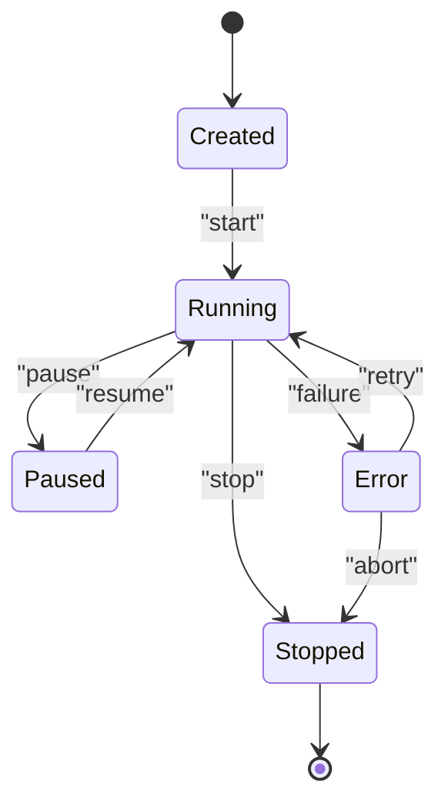
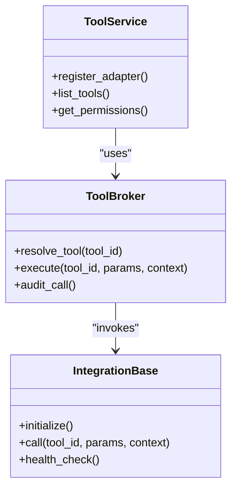
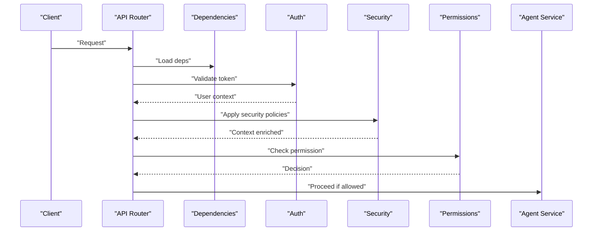
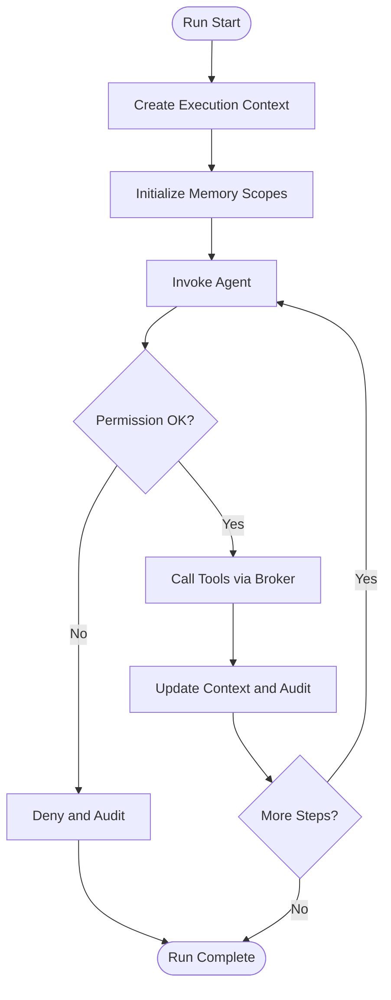
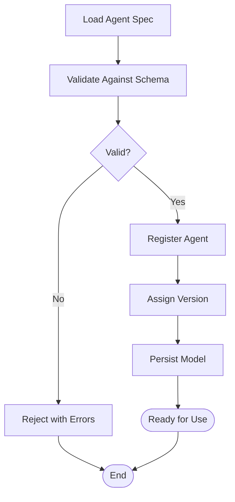
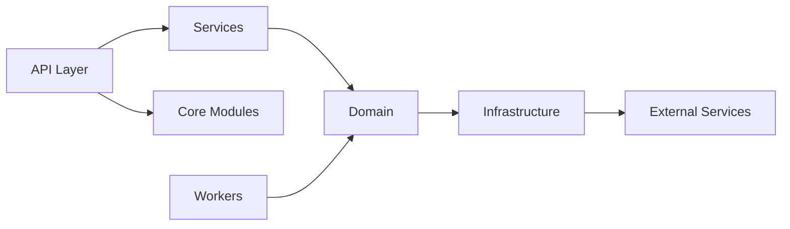

# Agent Orchestration

<cite>
**Referenced Files in This Document**
- [backend/app/domain/agents/models.py](file://backend/app/domain/agents/models.py)
- [backend/app/domain/agents/runtime.py](file://backend/app/domain/agents/runtime.py)
- [backend/app/domain/agents/policies.py](file://backend/app/domain/agents/policies.py)
- [backend/app/services/agent_service.py](file://backend/app/services/agent_service.py)
- [backend/app/schemas/agents.py](file://backend/app/schemas/agents.py)
- [backend/app/core/metrics.py](file://backend/app/core/metrics.py)
- [backend/app/core/logging.py](file://backend/app/core/logging.py)
- [backend/app/core/permissions.py](file://backend/app/core/permissions.py)
- [backend/app/infrastructure/tools/__init__.py](file://backend/app/infrastructure/tools/__init__.py)
- [backend/app/infrastructure/tools/broker.py](file://backend/app/infrastructure/tools/broker.py)
- [backend/app/infrastructure/integrations/base.py](file://backend/app/infrastructure/integrations/base.py)
- [backend/app/domain/memory/scopes.py](file://backend/app/domain/memory/scopes.py)
- [backend/app/domain/workflows/engine.py](file://backend/app/domain/workflows/engine.py)
- [backend/app/domain/workflows/models.py](file://backend/app/domain/workflows/models.py)
- [backend/app/api/v1/router.py](file://backend/app/api/v1/router.py)
- [backend/app/api/v1/routes/agents.py](file://backend/app/api/v1/routes/agents.py)
- [backend/app/api/v1/routes/tools.py](file://backend/app/api/v1/routes/tools.py)
- [backend/app/api/dependencies.py](file://backend/app/api/dependencies.py)
- [backend/app/core/auth.py](file://backend/app/core/auth.py)
- [backend/app/core/security.py](file://backend/app/core/security.py)
- [backend/app/workers/workflow_worker.py](file://backend/app/workers/workflow_worker.py)
- [backend/app/main.py](file://backend/app/main.py)
- [business/schemas/agent-spec.schema.json](file://business/schemas/agent-spec.schema.json)
- [docs/self-improvement-and-orchestration.md](file://docs/self-improvement-and-orchestration.md)
- [docs/architecture.md](file://docs/architecture.md)
</cite>

## Table of Contents
1. [Introduction](#introduction)
2. [Project Structure](#project-structure)
3. [Core Components](#core-components)
4. [Architecture Overview](#architecture-overview)
5. [Detailed Component Analysis](#detailed-component-analysis)
6. [Dependency Analysis](#dependency-analysis)
7. [Performance Considerations](#performance-considerations)
8. [Troubleshooting Guide](#troubleshooting-guide)
9. [Conclusion](#conclusion)
10. [Appendices](#appendices)

## Introduction
This document explains the agent orchestration system, focusing on:
- Agent registry and lifecycle management
- Capability definitions and tool adapter framework with permission-based access control
- Agent scoping, memory isolation, and execution contexts
- Agent specification format, validation rules, and versioning strategy
- Examples for defining custom agents, integrating tools, and managing permissions
- Monitoring, metrics collection, and performance optimization

The system is implemented as a modular backend with domain services, infrastructure adapters, API routes, workers, and schemas. It integrates with workflows to execute multi-step processes involving multiple agents and tools.

## Project Structure
At a high level, the orchestration spans:
- Domain layer: agent models, runtime, policies, workflow engine, memory scopes
- Services: business logic for agent operations
- Infrastructure: tool broker and integration base classes
- API: HTTP endpoints for agent and tool management
- Workers: background execution of long-running tasks
- Schemas: Pydantic models and JSON schema for agent specs
- Core: metrics, logging, auth, security, permissions

**Diagram sources**
- [backend/app/api/v1/router.py:1-200](file://backend/app/api/v1/router.py#L1-L200)
- [backend/app/api/v1/routes/agents.py:1-200](file://backend/app/api/v1/routes/agents.py#L1-L200)
- [backend/app/api/v1/routes/tools.py:1-200](file://backend/app/api/v1/routes/tools.py#L1-L200)
- [backend/app/api/dependencies.py:1-200](file://backend/app/api/dependencies.py#L1-L200)
- [backend/app/services/agent_service.py:1-200](file://backend/app/services/agent_service.py#L1-L200)
- [backend/app/domain/agents/models.py:1-200](file://backend/app/domain/agents/models.py#L1-L200)
- [backend/app/domain/agents/runtime.py:1-200](file://backend/app/domain/agents/runtime.py#L1-L200)
- [backend/app/domain/agents/policies.py:1-200](file://backend/app/domain/agents/policies.py#L1-L200)
- [backend/app/domain/workflows/engine.py:1-200](file://backend/app/domain/workflows/engine.py#L1-L200)
- [backend/app/domain/workflows/models.py:1-200](file://backend/app/domain/workflows/models.py#L1-L200)
- [backend/app/domain/memory/scopes.py:1-200](file://backend/app/domain/memory/scopes.py#L1-L200)
- [backend/app/infrastructure/tools/broker.py:1-200](file://backend/app/infrastructure/tools/broker.py#L1-L200)
- [backend/app/infrastructure/integrations/base.py:1-200](file://backend/app/infrastructure/integrations/base.py#L1-L200)
- [backend/app/workers/workflow_worker.py:1-200](file://backend/app/workers/workflow_worker.py#L1-L200)
- [backend/app/core/metrics.py:1-200](file://backend/app/core/metrics.py#L1-L200)
- [backend/app/core/logging.py:1-200](file://backend/app/core/logging.py#L1-L200)
- [backend/app/core/auth.py:1-200](file://backend/app/core/auth.py#L1-L200)
- [backend/app/core/security.py:1-200](file://backend/app/core/security.py#L1-L200)
- [backend/app/core/permissions.py:1-200](file://backend/app/core/permissions.py#L1-L200)

**Section sources**
- [backend/app/api/v1/router.py:1-200](file://backend/app/api/v1/router.py#L1-L200)
- [backend/app/api/v1/routes/agents.py:1-200](file://backend/app/api/v1/routes/agents.py#L1-L200)
- [backend/app/api/v1/routes/tools.py:1-200](file://backend/app/api/v1/routes/tools.py#L1-L200)
- [backend/app/api/dependencies.py:1-200](file://backend/app/api/dependencies.py#L1-L200)
- [backend/app/services/agent_service.py:1-200](file://backend/app/services/agent_service.py#L1-L200)
- [backend/app/domain/agents/models.py:1-200](file://backend/app/domain/agents/models.py#L1-L200)
- [backend/app/domain/agents/runtime.py:1-200](file://backend/app/domain/agents/runtime.py#L1-L200)
- [backend/app/domain/agents/policies.py:1-200](file://backend/app/domain/agents/policies.py#L1-L200)
- [backend/app/domain/workflows/engine.py:1-200](file://backend/app/domain/workflows/engine.py#L1-L200)
- [backend/app/domain/workflows/models.py:1-200](file://backend/app/domain/workflows/models.py#L1-L200)
- [backend/app/domain/memory/scopes.py:1-200](file://backend/app/domain/memory/scopes.py#L1-L200)
- [backend/app/infrastructure/tools/broker.py:1-200](file://backend/app/infrastructure/tools/broker.py#L1-L200)
- [backend/app/infrastructure/integrations/base.py:1-200](file://backend/app/infrastructure/integrations/base.py#L1-L200)
- [backend/app/workers/workflow_worker.py:1-200](file://backend/app/workers/workflow_worker.py#L1-L200)
- [backend/app/core/metrics.py:1-200](file://backend/app/core/metrics.py#L1-L200)
- [backend/app/core/logging.py:1-200](file://backend/app/core/logging.py#L1-L200)
- [backend/app/core/auth.py:1-200](file://backend/app/core/auth.py#L1-L200)
- [backend/app/core/security.py:1-200](file://backend/app/core/security.py#L1-L200)
- [backend/app/core/permissions.py:1-200](file://backend/app/core/permissions.py#L1-L200)

## Core Components
- Agent Registry and Models: Defines agent identity, capabilities, versions, and metadata.
- Agent Runtime: Manages lifecycle (create, start, pause, resume, stop), context, and execution state.
- Agent Policies: Enforces capability constraints, permission checks, and governance rules.
- Tool Adapter Framework: Abstracts external integrations via a broker and base integration class.
- Memory Scopes: Provides per-agent or per-run memory isolation and scoping.
- Workflow Engine: Orchestrates multi-step executions that may invoke multiple agents and tools.
- API and Dependencies: Exposes endpoints for agent and tool management with auth and RBAC.
- Metrics and Logging: Collects operational telemetry and structured logs.

Key responsibilities:
- Registry: CRUD for agents, capability declarations, versioning metadata.
- Lifecycle: State transitions, timeouts, retries, cancellation.
- Capabilities: Typed tool bindings, input/output contracts, permission tags.
- Tool Integration: Secure invocation through broker with policy checks.
- Scoping: Isolation boundaries for memory and resources.
- Execution Context: Request-scoped data, correlation IDs, audit trails.

**Section sources**
- [backend/app/domain/agents/models.py:1-200](file://backend/app/domain/agents/models.py#L1-L200)
- [backend/app/domain/agents/runtime.py:1-200](file://backend/app/domain/agents/runtime.py#L1-L200)
- [backend/app/domain/agents/policies.py:1-200](file://backend/app/domain/agents/policies.py#L1-L200)
- [backend/app/infrastructure/tools/broker.py:1-200](file://backend/app/infrastructure/tools/broker.py#L1-L200)
- [backend/app/infrastructure/integrations/base.py:1-200](file://backend/app/infrastructure/integrations/base.py#L1-L200)
- [backend/app/domain/memory/scopes.py:1-200](file://backend/app/domain/memory/scopes.py#L1-L200)
- [backend/app/domain/workflows/engine.py:1-200](file://backend/app/domain/workflows/engine.py#L1-L200)
- [backend/app/services/agent_service.py:1-200](file://backend/app/services/agent_service.py#L1-L200)
- [backend/app/core/metrics.py:1-200](file://backend/app/core/metrics.py#L1-L200)
- [backend/app/core/logging.py:1-200](file://backend/app/core/logging.py#L1-L200)

## Architecture Overview
The orchestration architecture layers separate concerns between API, service, domain, infrastructure, and workers. Authentication and authorization are enforced at the API boundary, while policies enforce fine-grained permissions within the domain. The tool broker mediates all external calls, applying permission checks and auditing.

**Diagram sources**
- [backend/app/api/v1/router.py:1-200](file://backend/app/api/v1/router.py#L1-L200)
- [backend/app/api/dependencies.py:1-200](file://backend/app/api/dependencies.py#L1-L200)
- [backend/app/core/auth.py:1-200](file://backend/app/core/auth.py#L1-L200)
- [backend/app/core/permissions.py:1-200](file://backend/app/core/permissions.py#L1-L200)
- [backend/app/services/agent_service.py:1-200](file://backend/app/services/agent_service.py#L1-L200)
- [backend/app/domain/agents/policies.py:1-200](file://backend/app/domain/agents/policies.py#L1-L200)
- [backend/app/domain/agents/runtime.py:1-200](file://backend/app/domain/agents/runtime.py#L1-L200)
- [backend/app/infrastructure/tools/broker.py:1-200](file://backend/app/infrastructure/tools/broker.py#L1-L200)
- [backend/app/workers/workflow_worker.py:1-200](file://backend/app/workers/workflow_worker.py#L1-L200)

## Detailed Component Analysis

### Agent Registry and Models
Responsibilities:
- Define agent identity, versioning, capabilities, and metadata.
- Provide typed schemas for persistence and API contracts.
- Support capability descriptors for tools and skills.

Key aspects:
- Versioned agent definitions with backward compatibility considerations.
- Capability list includes tool references, input/output schemas, and permission tags.
- Metadata includes owner, org scope, tags, and lifecycle states.

**Diagram sources**
- [backend/app/domain/agents/models.py:1-200](file://backend/app/domain/agents/models.py#L1-L200)
- [backend/app/services/agent_service.py:1-200](file://backend/app/services/agent_service.py#L1-L200)

**Section sources**
- [backend/app/domain/agents/models.py:1-200](file://backend/app/domain/agents/models.py#L1-L200)
- [backend/app/services/agent_service.py:1-200](file://backend/app/services/agent_service.py#L1-L200)
- [backend/app/schemas/agents.py:1-200](file://backend/app/schemas/agents.py#L1-L200)

### Agent Lifecycle Management
Responsibilities:
- Manage state transitions: created, running, paused, stopped, error.
- Enforce timeouts, retries, and cancellation.
- Maintain execution context and audit trail.

Key aspects:
- Runtime encapsulates state machine and hooks for pre/post actions.
- Policies gate transitions based on permissions and governance rules.
- Workers handle long-running runs asynchronously.

**Diagram sources**
- [backend/app/domain/agents/runtime.py:1-200](file://backend/app/domain/agents/runtime.py#L1-L200)
- [backend/app/domain/agents/policies.py:1-200](file://backend/app/domain/agents/policies.py#L1-L200)
- [backend/app/workers/workflow_worker.py:1-200](file://backend/app/workers/workflow_worker.py#L1-L200)

**Section sources**
- [backend/app/domain/agents/runtime.py:1-200](file://backend/app/domain/agents/runtime.py#L1-L200)
- [backend/app/domain/agents/policies.py:1-200](file://backend/app/domain/agents/policies.py#L1-L200)
- [backend/app/workers/workflow_worker.py:1-200](file://backend/app/workers/workflow_worker.py#L1-L200)

### Capability Definitions and Tool Adapter Framework
Responsibilities:
- Define tool capabilities with typed inputs/outputs and permission tags.
- Provide an adapter interface for external services.
- Broker enforces permission checks and audits tool usage.

Key aspects:
- Integration base class defines contract for adapters.
- Broker resolves tool by reference, validates permissions, and executes.
- Tool service manages registration and discovery.

**Diagram sources**
- [backend/app/infrastructure/integrations/base.py:1-200](file://backend/app/infrastructure/integrations/base.py#L1-L200)
- [backend/app/infrastructure/tools/broker.py:1-200](file://backend/app/infrastructure/tools/broker.py#L1-L200)
- [backend/app/services/tool_service.py:1-200](file://backend/app/services/tool_service.py#L1-L200)

**Section sources**
- [backend/app/infrastructure/integrations/base.py:1-200](file://backend/app/infrastructure/integrations/base.py#L1-L200)
- [backend/app/infrastructure/tools/broker.py:1-200](file://backend/app/infrastructure/tools/broker.py#L1-L200)
- [backend/app/services/tool_service.py:1-200](file://backend/app/services/tool_service.py#L1-L200)
- [backend/app/api/v1/routes/tools.py:1-200](file://backend/app/api/v1/routes/tools.py#L1-L200)

### Permission-Based Access Control
Responsibilities:
- Authenticate callers and authorize actions against agents and tools.
- Enforce RBAC and policy checks for capability usage.
- Integrate with core auth and permissions modules.

Key aspects:
- API dependencies inject authenticated user context.
- Security middleware validates tokens and scopes.
- Permissions module evaluates role-based and attribute-based rules.

**Diagram sources**
- [backend/app/api/dependencies.py:1-200](file://backend/app/api/dependencies.py#L1-L200)
- [backend/app/core/auth.py:1-200](file://backend/app/core/auth.py#L1-L200)
- [backend/app/core/security.py:1-200](file://backend/app/core/security.py#L1-L200)
- [backend/app/core/permissions.py:1-200](file://backend/app/core/permissions.py#L1-L200)
- [backend/app/services/agent_service.py:1-200](file://backend/app/services/agent_service.py#L1-L200)

**Section sources**
- [backend/app/api/dependencies.py:1-200](file://backend/app/api/dependencies.py#L1-L200)
- [backend/app/core/auth.py:1-200](file://backend/app/core/auth.py#L1-L200)
- [backend/app/core/security.py:1-200](file://backend/app/core/security.py#L1-L200)
- [backend/app/core/permissions.py:1-200](file://backend/app/core/permissions.py#L1-L200)

### Agent Scoping, Memory Isolation, and Execution Contexts
Responsibilities:
- Provide per-agent or per-run memory isolation.
- Define scoping rules for knowledge and memory access.
- Maintain execution context including correlation IDs and audit fields.

Key aspects:
- Memory scopes define boundaries and visibility.
- Execution context flows through runtime and tool calls.
- Workflows coordinate multi-agent runs with isolated contexts.

**Diagram sources**
- [backend/app/domain/memory/scopes.py:1-200](file://backend/app/domain/memory/scopes.py#L1-L200)
- [backend/app/domain/agents/runtime.py:1-200](file://backend/app/domain/agents/runtime.py#L1-L200)
- [backend/app/domain/workflows/engine.py:1-200](file://backend/app/domain/workflows/engine.py#L1-L200)
- [backend/app/infrastructure/tools/broker.py:1-200](file://backend/app/infrastructure/tools/broker.py#L1-L200)

**Section sources**
- [backend/app/domain/memory/scopes.py:1-200](file://backend/app/domain/memory/scopes.py#L1-L200)
- [backend/app/domain/agents/runtime.py:1-200](file://backend/app/domain/agents/runtime.py#L1-L200)
- [backend/app/domain/workflows/engine.py:1-200](file://backend/app/domain/workflows/engine.py#L1-L200)

### Agent Specification Format, Validation Rules, and Versioning Strategy
Responsibilities:
- Define agent spec schema for declarative configuration.
- Validate specs against JSON schema before registration.
- Manage versioning to ensure compatibility and migration paths.

Key aspects:
- Schema covers required fields, capability definitions, and metadata.
- Validation ensures correctness and safety prior to runtime use.
- Versioning supports backward-compatible changes and deprecation notices.

**Diagram sources**
- [business/schemas/agent-spec.schema.json:1-200](file://business/schemas/agent-spec.schema.json#L1-L200)
- [backend/app/services/agent_service.py:1-200](file://backend/app/services/agent_service.py#L1-L200)
- [backend/app/domain/agents/models.py:1-200](file://backend/app/domain/agents/models.py#L1-L200)

**Section sources**
- [business/schemas/agent-spec.schema.json:1-200](file://business/schemas/agent-spec.schema.json#L1-L200)
- [backend/app/services/agent_service.py:1-200](file://backend/app/services/agent_service.py#L1-L200)
- [backend/app/domain/agents/models.py:1-200](file://backend/app/domain/agents/models.py#L1-L200)

### Examples: Custom Agents, Integrating Tools, Managing Permissions
- Defining a custom agent:
  - Create an agent spec file adhering to the schema.
  - Register via API endpoint; validation occurs before persistence.
  - Reference capabilities pointing to registered tools.
- Integrating a tool:
  - Implement an adapter extending the integration base class.
  - Register the adapter using the tool service.
  - Declare permissions and input/output schemas in capability definition.
- Managing permissions:
  - Assign roles and attributes to users.
  - Configure permission policies for agents and tools.
  - Enforce checks at API and domain layers.

[No sources needed since this section provides general guidance without analyzing specific files]

## Dependency Analysis
The orchestration components exhibit clear separation of concerns:
- API depends on services and core modules (auth, security, permissions).
- Services depend on domain models, runtime, policies, and infrastructure.
- Infrastructure abstracts external integrations via broker and base classes.
- Workers depend on workflow engine and runtime for asynchronous execution.

**Diagram sources**
- [backend/app/api/v1/router.py:1-200](file://backend/app/api/v1/router.py#L1-L200)
- [backend/app/services/agent_service.py:1-200](file://backend/app/services/agent_service.py#L1-L200)
- [backend/app/domain/agents/models.py:1-200](file://backend/app/domain/agents/models.py#L1-L200)
- [backend/app/infrastructure/tools/broker.py:1-200](file://backend/app/infrastructure/tools/broker.py#L1-L200)
- [backend/app/workers/workflow_worker.py:1-200](file://backend/app/workers/workflow_worker.py#L1-L200)

**Section sources**
- [backend/app/api/v1/router.py:1-200](file://backend/app/api/v1/router.py#L1-L200)
- [backend/app/services/agent_service.py:1-200](file://backend/app/services/agent_service.py#L1-L200)
- [backend/app/domain/agents/models.py:1-200](file://backend/app/domain/agents/models.py#L1-L200)
- [backend/app/infrastructure/tools/broker.py:1-200](file://backend/app/infrastructure/tools/broker.py#L1-L200)
- [backend/app/workers/workflow_worker.py:1-200](file://backend/app/workers/workflow_worker.py#L1-L200)

## Performance Considerations
- Caching: Cache frequently accessed agent capabilities and tool metadata.
- Concurrency: Use workers for long-running runs; apply backpressure and rate limits.
- Batching: Batch tool calls where possible to reduce overhead.
- Timeouts and Retries: Configure sensible timeouts and retry policies with exponential backoff.
- Memory Isolation: Keep memory scopes minimal and scoped to run boundaries.
- Observability: Emit metrics and logs for latency, throughput, errors, and resource usage.

[No sources needed since this section provides general guidance]

## Troubleshooting Guide
Common issues and resolutions:
- Authentication failures: Verify token validity and scopes; check auth middleware configuration.
- Permission denied: Review RBAC policies and capability permission tags; ensure user roles match requirements.
- Tool invocation errors: Inspect broker logs and adapter health checks; validate input schemas.
- Lifecycle stuck: Check runtime state transitions and worker queue health; review timeouts and retries.
- Memory leaks: Ensure memory scopes are properly closed after run completion.

Operational aids:
- Structured logging for requests, tool calls, and lifecycle events.
- Metrics for agent runs, tool invocations, and error rates.
- Audit trails for compliance and debugging.

**Section sources**
- [backend/app/core/logging.py:1-200](file://backend/app/core/logging.py#L1-L200)
- [backend/app/core/metrics.py:1-200](file://backend/app/core/metrics.py#L1-L200)
- [backend/app/core/auth.py:1-200](file://backend/app/core/auth.py#L1-L200)
- [backend/app/core/permissions.py:1-200](file://backend/app/core/permissions.py#L1-L200)
- [backend/app/infrastructure/tools/broker.py:1-200](file://backend/app/infrastructure/tools/broker.py#L1-L200)
- [backend/app/domain/agents/runtime.py:1-200](file://backend/app/domain/agents/runtime.py#L1-L200)

## Conclusion
The agent orchestration system provides a robust foundation for registering agents, managing their lifecycles, and executing them safely with permission-controlled tool integrations. Clear scoping and memory isolation ensure secure and predictable behavior, while comprehensive monitoring and metrics support operational excellence. The specification-driven approach enables consistent agent definitions and versioning strategies.

[No sources needed since this section summarizes without analyzing specific files]

## Appendices

### API Endpoints Overview
- Agents:
  - List, get, create, update, delete agents
  - Start, pause, resume, stop agent runs
- Tools:
  - List available tools
  - Get tool details and permissions
  - Register new tool adapters

**Section sources**
- [backend/app/api/v1/routes/agents.py:1-200](file://backend/app/api/v1/routes/agents.py#L1-L200)
- [backend/app/api/v1/routes/tools.py:1-200](file://backend/app/api/v1/routes/tools.py#L1-L200)

### Documentation References
- Self-improvement and orchestration overview
- System architecture overview

**Section sources**
- [docs/self-improvement-and-orchestration.md:1-200](file://docs/self-improvement-and-orchestration.md#L1-L200)
- [docs/architecture.md:1-200](file://docs/architecture.md#L1-L200)