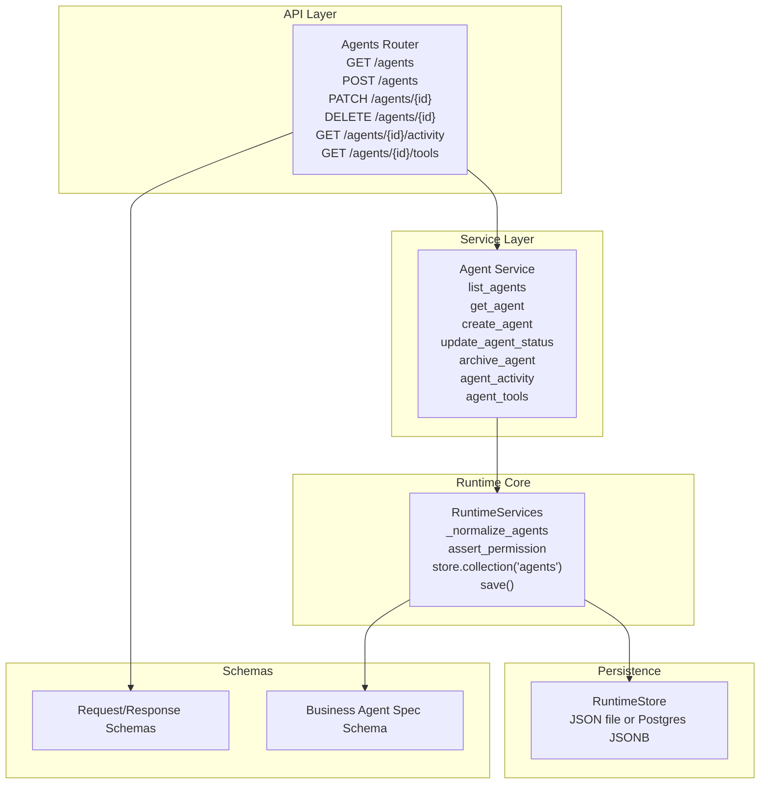
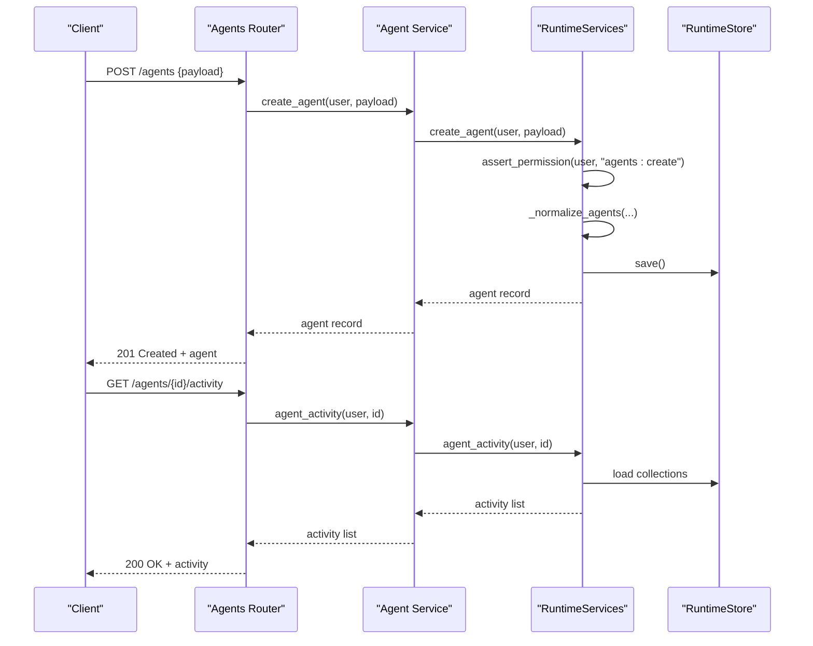
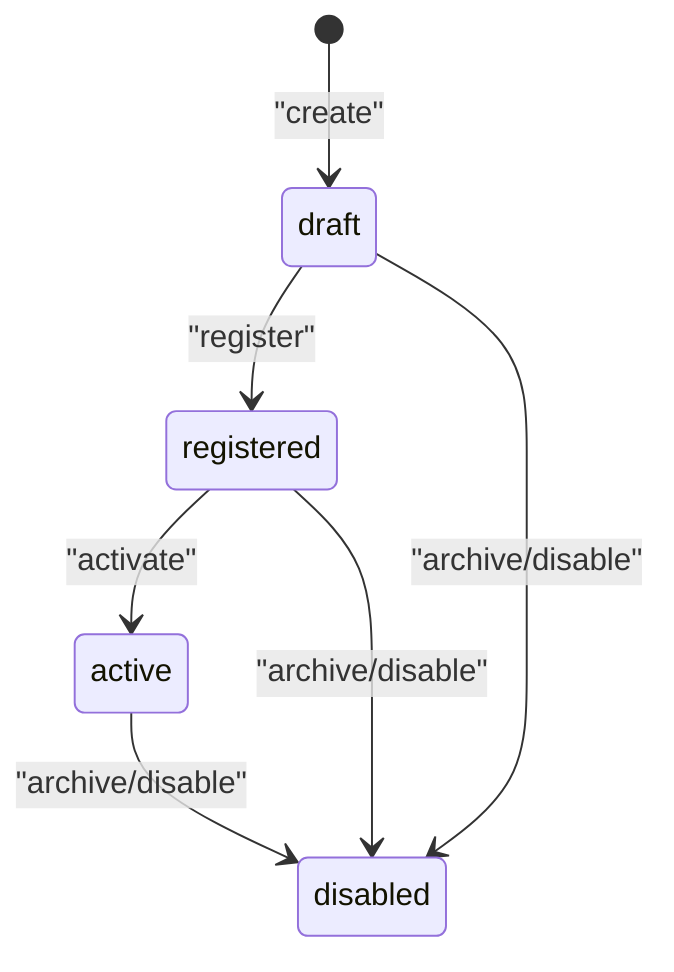
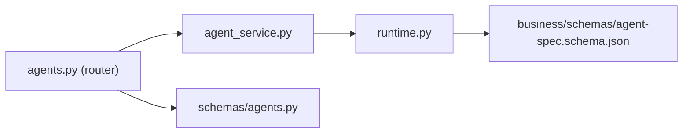

# Agent Registry & Lifecycle

<cite>
**Referenced Files in This Document**
- [agents.py](file://backend/app/api/v1/routes/agents.py)
- [agent_service.py](file://backend/app/services/agent_service.py)
- [runtime.py](file://backend/app/runtime.py)
- [agents.py](file://backend/app/schemas/agents.py)
- [agent-spec.schema.json](file://business/schemas/agent-spec.schema.json)
</cite>

## Table of Contents
1. [Introduction](#introduction)
2. [Project Structure](#project-structure)
3. [Core Components](#core-components)
4. [Architecture Overview](#architecture-overview)
5. [Detailed Component Analysis](#detailed-component-analysis)
6. [Dependency Analysis](#dependency-analysis)
7. [Performance Considerations](#performance-considerations)
8. [Troubleshooting Guide](#troubleshooting-guide)
9. [Conclusion](#conclusion)
10. [Appendices](#appendices)

## Introduction
This document explains the agent registry and lifecycle management system, focusing on how agents are defined, validated, registered, discovered, and monitored. It covers:
- Agent definition schemas and validation rules
- Versioning strategies for agent specifications
- Agent states and transitions (draft, active, archived/disabled)
- Registration, discovery, and metadata management
- Agent specification format including capabilities, tools, memory scopes, and permissions
- Examples for creating custom agents with proper specifications
- Monitoring, activity tracking, and performance metrics collection

The implementation is a runtime-backed service that persists agent records and exposes REST endpoints for CRUD operations, status updates, and related queries such as activity and tool access.

## Project Structure
Agent-related functionality spans API routes, services, runtime logic, schemas, and business schema definitions:
- API routes define HTTP endpoints for listing, creating, updating, archiving, and querying agent details, activity, and tools.
- Services provide thin wrappers around runtime operations.
- Runtime encapsulates persistence, normalization, seeding, permission checks, and state transitions.
- Schemas define request/response contracts.
- Business schema defines the canonical agent specification structure used by domain packs and tooling.

**Diagram sources**
- [agents.py:1-48](file://backend/app/api/v1/routes/agents.py#L1-L48)
- [agent_service.py:1-30](file://backend/app/services/agent_service.py#L1-L30)
- [runtime.py:730-756](file://backend/app/runtime.py#L730-L756)
- [agent-spec.schema.json:1-52](file://business/schemas/agent-spec.schema.json#L1-L52)

**Section sources**
- [agents.py:1-48](file://backend/app/api/v1/routes/agents.py#L1-L48)
- [agent_service.py:1-30](file://backend/app/services/agent_service.py#L1-L30)
- [runtime.py:730-756](file://backend/app/runtime.py#L730-L756)
- [agent-spec.schema.json:1-52](file://business/schemas/agent-spec.schema.json#L1-L52)

## Core Components
- Agents API router: Exposes endpoints to manage agents and query their activity/tools.
- Agent service: Delegates to runtime for all agent operations.
- Runtime: Implements agent normalization, seeding, storage, and permission enforcement; provides list/get/create/update/archive/activity/tools operations.
- Request/response schemas: Define payloads for create and status update requests.
- Business agent spec schema: Defines the canonical structure for agent specifications consumed by domain packs and tooling.

Key responsibilities:
- Validation: Enforce required fields and allowed values via schemas and runtime checks.
- State management: Support draft/active/archived (disabled) states and transitions.
- Metadata: Maintain organization scoping, versioning, roles, risk tiers, tools, and memory scopes.
- Discovery: Provide list and detail endpoints scoped to the caller’s organization.
- Monitoring: Provide activity history and tool access lists per agent.

**Section sources**
- [agents.py:1-48](file://backend/app/api/v1/routes/agents.py#L1-L48)
- [agent_service.py:1-30](file://backend/app/services/agent_service.py#L1-L30)
- [runtime.py:730-756](file://backend/app/runtime.py#L730-L756)
- [agents.py:1-2](file://backend/app/schemas/agents.py#L1-L2)
- [agent-spec.schema.json:1-52](file://business/schemas/agent-spec.schema.json#L1-L52)

## Architecture Overview
The agent registry follows a layered architecture:
- API layer validates input using Pydantic models and enforces RBAC via runtime.assert_permission.
- Service layer orchestrates calls to runtime methods.
- Runtime normalizes and persists agent records, ensuring consistent metadata and defaults.
- Persistence uses a hybrid store: Postgres JSONB when available, otherwise a local JSON file.

**Diagram sources**
- [agents.py:17-41](file://backend/app/api/v1/routes/agents.py#L17-L41)
- [agent_service.py:12-25](file://backend/app/services/agent_service.py#L12-L25)
- [runtime.py:730-756](file://backend/app/runtime.py#L730-L756)

## Detailed Component Analysis

### Agent Definition Schema and Validation Rules
The business-level agent specification schema defines the canonical shape for agent definitions used across domain packs and tooling. Required fields include identifiers, domain association, name, status, ALC requirements, memory scopes, and ALV version. Optional fields cover role, category, hooks, tools, risk tier, critique rubric reference, and provenance.

Validation highlights:
- Status must be one of the enumerated values.
- Memory scopes must be from an allowed set.
- Tools can be declared as a string array.
- Additional properties are permitted for extensibility.

Operational notes:
- The runtime normalizes agents at startup and during migrations, ensuring defaults for missing fields like organization_id, status, allowed_tools, and allowed_memory_scopes.
- Permission checks enforce RBAC before any mutation.

**Section sources**
- [agent-spec.schema.json:1-52](file://business/schemas/agent-spec.schema.json#L1-L52)
- [runtime.py:730-756](file://backend/app/runtime.py#L730-L756)

### Agent States and Transitions
Supported states observed in code and schema:
- draft: Initial development stage.
- registered: Intermediate registration step.
- active: Ready for execution.
- disabled: Equivalent to archived in operational terms.

Transitions:
- Create: New agents typically start as draft unless explicitly set otherwise.
- Update: PATCH endpoint allows changing status; default fallback is draft if not provided.
- Archive: DELETE endpoint archives (disables) an agent.

Normalization ensures:
- Missing status defaults to active during normalization.
- Allowed memory scopes are merged with seed data for flagship agents.

**Diagram sources**
- [agents.py:28-35](file://backend/app/api/v1/routes/agents.py#L28-L35)
- [agent-spec.schema.json:22-25](file://business/schemas/agent-spec.schema.json#L22-L25)
- [runtime.py:730-756](file://backend/app/runtime.py#L730-L756)

**Section sources**
- [agents.py:28-35](file://backend/app/api/v1/routes/agents.py#L28-L35)
- [agent-spec.schema.json:22-25](file://business/schemas/agent-spec.schema.json#L22-L25)
- [runtime.py:730-756](file://backend/app/runtime.py#L730-L756)

### Agent Registration, Discovery, and Metadata Management
Registration:
- POST /agents accepts a request body modeled by the create schema and delegates to runtime.create_agent.
- Runtime enforces permissions and persists the new agent.

Discovery:
- GET /agents returns all agents visible to the current user’s organization.
- GET /agents/{id} returns detailed metadata for a specific agent.

Metadata management:
- PATCH /agents/{id} updates status (and potentially other fields depending on schema).
- DELETE /agents/{id} archives/disables the agent.
- GET /agents/{id}/activity returns recent activity entries.
- GET /agents/{id}/tools returns the agent’s allowed tools.

Organization scoping:
- All list/detail operations are scoped to the authenticated user’s organization.

**Section sources**
- [agents.py:11-47](file://backend/app/api/v1/routes/agents.py#L11-L47)
- [agent_service.py:4-29](file://backend/app/services/agent_service.py#L4-L29)
- [runtime.py:827-830](file://backend/app/runtime.py#L827-L830)

### Agent Specification Format: Capabilities, Tools, Memory Scopes, Permissions
Capabilities and configuration are expressed through:
- Tools: Array of tool identifiers allowed for the agent.
- Memory scopes: Array of allowed memory scopes (e.g., agent, organization, run, workflow, public).
- Risk tier: Indicates governance and approval requirements.
- Role/category: Descriptive classification for routing and UI.
- Hooks: Optional behavioral flags (e.g., reflection).
- Provenance: Auditability metadata.

Permission settings:
- Runtime enforces RBAC for agent mutations and reads.
- Memory scope enforcement denies read/write when an agent lacks the required scope.

**Section sources**
- [agent-spec.schema.json:27-48](file://business/schemas/agent-spec.schema.json#L27-L48)
- [runtime.py:894-935](file://backend/app/runtime.py#L894-L935)

### Creating Custom Agents: Example Specifications
To create a custom agent:
- Use POST /agents with a payload conforming to the create schema.
- Ensure required fields are present: id, domain_id, name, status, requires_alc, allowed_memory_scopes, alc_version.
- Set allowed_memory_scopes to a subset of the allowed enum values.
- Optionally declare tools and risk_tier.

Example payload outline:
- id: unique identifier
- domain_id: associated domain
- name: human-readable name
- status: draft | registered | active | disabled
- requires_alc: boolean
- allowed_memory_scopes: ["organization", "workflow"]
- alc_version: semantic version string
- tools: ["tool_a", "tool_b"]
- risk_tier: e.g., "tier_2_draft"

After creation, you can:
- Update status via PATCH /agents/{id}.
- Query activity via GET /agents/{id}/activity.
- List tools via GET /agents/{id}/tools.
- Archive via DELETE /agents/{id}.

**Section sources**
- [agents.py:17-35](file://backend/app/api/v1/routes/agents.py#L17-L35)
- [agent-service.py:12-21](file://backend/app/services/agent_service.py#L12-L21)
- [agent-spec.schema.json:6-35](file://business/schemas/agent-spec.schema.json#L6-L35)

### Agent Monitoring, Activity Tracking, and Performance Metrics
Monitoring and observability:
- Activity tracking: GET /agents/{id}/activity returns a list of activity entries for the agent.
- Tool access visibility: GET /agents/{id}/tools returns the agent’s allowed tools.
- Process metrics: The runtime maintains process_metrics records that summarize outcomes and latency; these are seeded and updated as part of runtime initialization.

Best practices:
- Regularly poll activity endpoints to build dashboards.
- Correlate agent activity with process metrics to assess performance.
- Use audit logs (maintained by runtime) for compliance and troubleshooting.

**Section sources**
- [agents.py:38-47](file://backend/app/api/v1/routes/agents.py#L38-L47)
- [agent_service.py:24-29](file://backend/app/services/agent_service.py#L24-L29)
- [runtime.py:807-819](file://backend/app/runtime.py#L807-L819)

## Dependency Analysis
The agent subsystem depends on:
- FastAPI router for HTTP endpoints.
- Service layer for orchestration.
- Runtime for persistence, normalization, and authorization.
- Schemas for request validation.
- Business schema for canonical agent specification.

**Diagram sources**
- [agents.py:1-48](file://backend/app/api/v1/routes/agents.py#L1-L48)
- [agent_service.py:1-30](file://backend/app/services/agent_service.py#L1-L30)
- [runtime.py:730-756](file://backend/app/runtime.py#L730-L756)
- [agent-spec.schema.json:1-52](file://business/schemas/agent-spec.schema.json#L1-L52)

**Section sources**
- [agents.py:1-48](file://backend/app/api/v1/routes/agents.py#L1-L48)
- [agent_service.py:1-30](file://backend/app/services/agent_service.py#L1-L30)
- [runtime.py:730-756](file://backend/app/runtime.py#L730-L756)
- [agent-spec.schema.json:1-52](file://business/schemas/agent-spec.schema.json#L1-L52)

## Performance Considerations
- Persistence backend selection: Postgres JSONB is preferred for concurrency and durability; JSON file fallback is used for local/dev environments.
- Normalization cost: Agent normalization runs at bootstrap and migration time; keep agent counts reasonable and avoid excessive seed data.
- Read paths: Listing and detail endpoints filter by organization; ensure indexes exist on organization-scoped collections when using Postgres.
- Activity queries: Keep activity endpoints paginated in future iterations to handle high-volume logs.

[No sources needed since this section provides general guidance]

## Troubleshooting Guide
Common issues and resolutions:
- Permission denied: Ensure the caller has the required role and permission (e.g., agents:create, agents:update).
- Not found: Verify agent_id exists within the caller’s organization.
- Validation errors: Confirm payload conforms to the create schema and status enum.
- Memory scope denied: Check agent.allowed_memory_scopes includes the requested scope.

Operational tips:
- Inspect runtime error classes and status codes for precise diagnostics.
- Use activity and tools endpoints to validate agent configuration and recent behavior.

**Section sources**
- [runtime.py:93-129](file://backend/app/runtime.py#L93-L129)
- [agents.py:11-47](file://backend/app/api/v1/routes/agents.py#L11-L47)

## Conclusion
The agent registry provides a robust foundation for defining, validating, registering, discovering, and monitoring agents. With clear schemas, normalized metadata, RBAC enforcement, and observable activity/tool endpoints, teams can safely evolve agent capabilities while maintaining governance and performance.

[No sources needed since this section summarizes without analyzing specific files]

## Appendices

### API Endpoints Summary
- GET /agents: List agents (scoped to organization).
- POST /agents: Create agent.
- GET /agents/{id}: Get agent details.
- PATCH /agents/{id}: Update agent status.
- DELETE /agents/{id}: Archive/disable agent.
- GET /agents/{id}/activity: Retrieve activity log.
- GET /agents/{id}/tools: Retrieve allowed tools.

**Section sources**
- [agents.py:11-47](file://backend/app/api/v1/routes/agents.py#L11-L47)