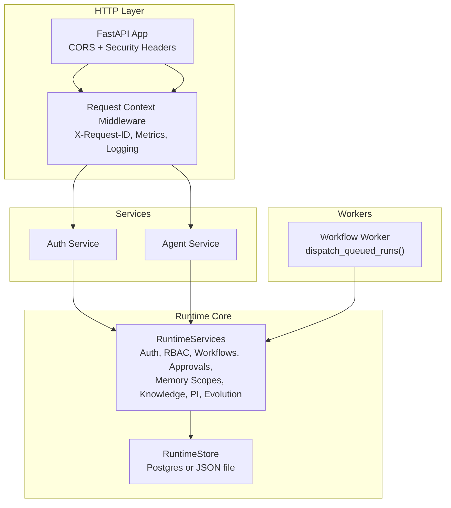
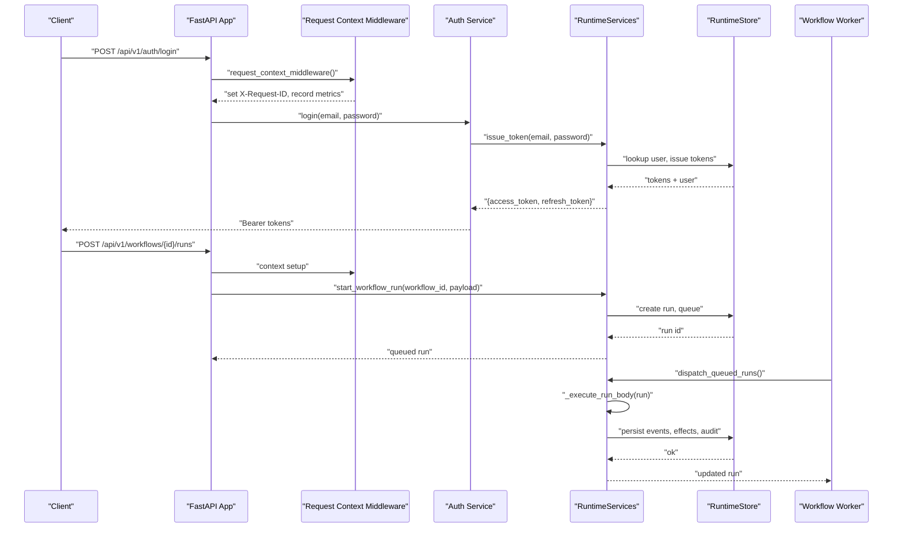
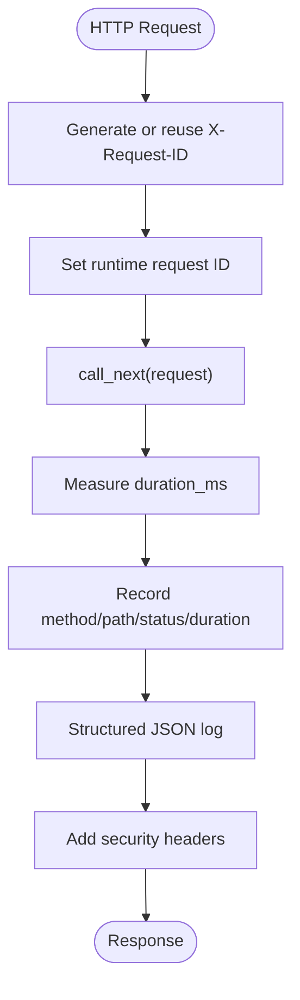
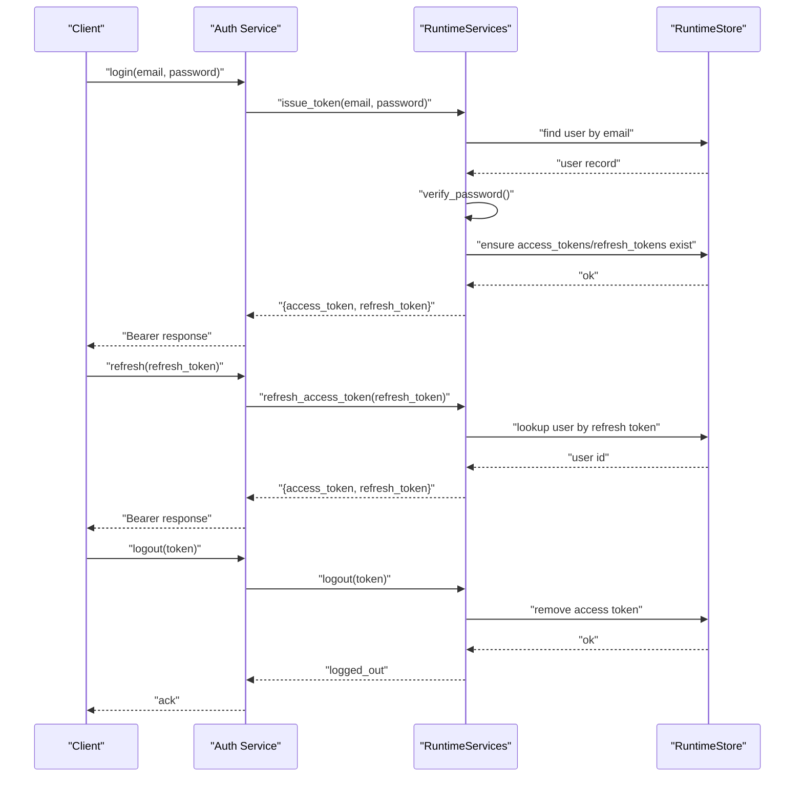
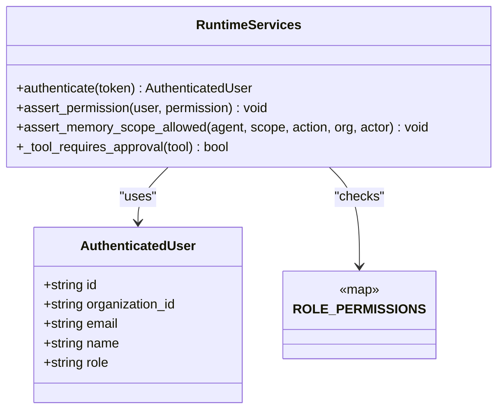
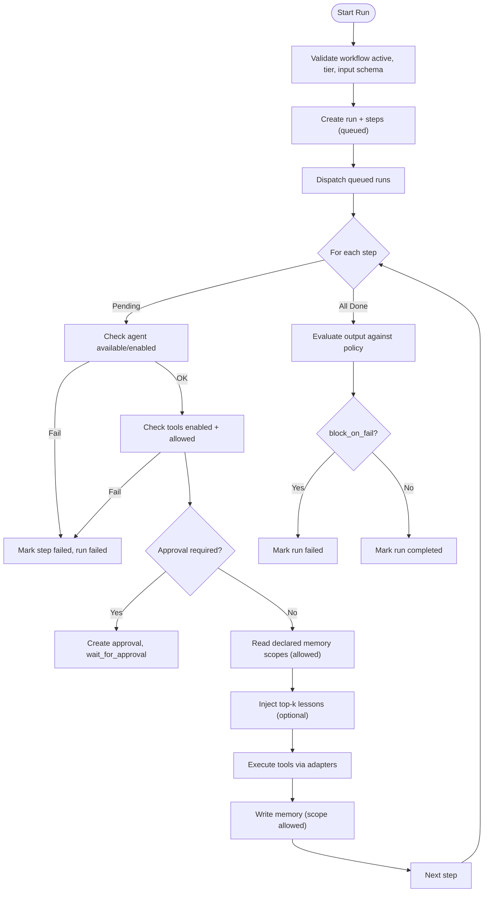
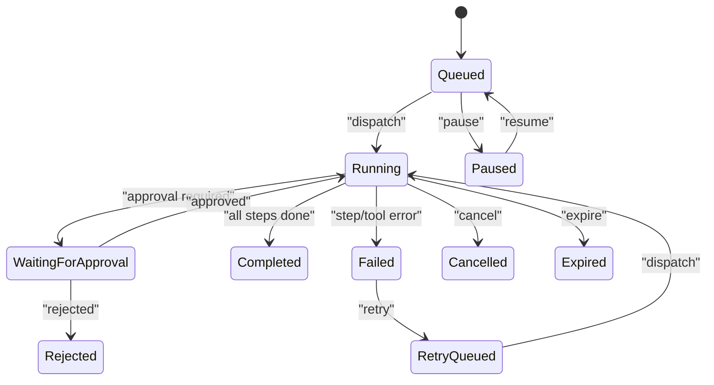
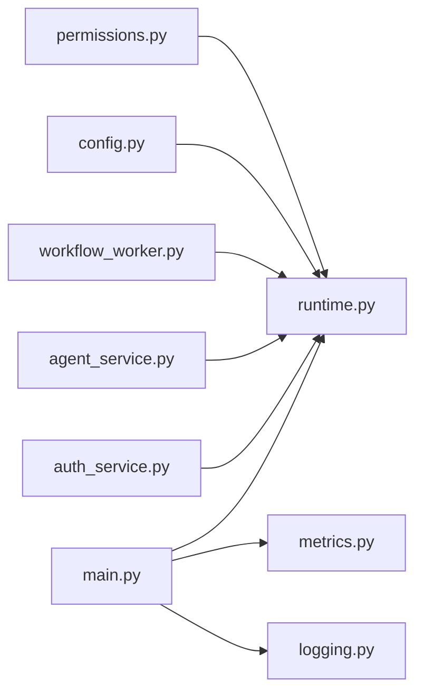

# Execution Contexts & Runtime

<cite>
**Referenced Files in This Document**
- [main.py](file://backend/app/main.py)
- [runtime.py](file://backend/app/runtime.py)
- [auth.py](file://backend/app/core/auth.py)
- [permissions.py](file://backend/app/core/permissions.py)
- [config.py](file://backend/app/core/config.py)
- [metrics.py](file://backend/app/core/metrics.py)
- [logging.py](file://backend/app/core/logging.py)
- [agent_service.py](file://backend/app/services/agent_service.py)
- [auth_service.py](file://backend/app/services/auth_service.py)
- [workflow_worker.py](file://backend/app/workers/workflow_worker.py)
</cite>

## Table of Contents
1. [Introduction](#introduction)
2. [Project Structure](#project-structure)
3. [Core Components](#core-components)
4. [Architecture Overview](#architecture-overview)
5. [Detailed Component Analysis](#detailed-component-analysis)
6. [Dependency Analysis](#dependency-analysis)
7. [Performance Considerations](#performance-considerations)
8. [Troubleshooting Guide](#troubleshooting-guide)
9. [Conclusion](#conclusion)
10. [Appendices](#appendices)

## Introduction
This document explains how agent execution contexts and the runtime environment are initialized, authenticated, authorized, and executed end-to-end. It covers:
- Context initialization and request-scoped tracing
- Authentication flow (bearer tokens, refresh tokens, API keys)
- Authorization checks (role-based permissions, memory scoping, tool gating)
- Resource allocation, timeouts, retries, and execution limits
- Parallel vs sequential execution modes
- Error propagation and recovery mechanisms
- Custom execution policies and runtime configurations
- Performance monitoring, resource utilization tracking, and debugging

## Project Structure
The backend exposes a FastAPI application that wires middleware for request context, metrics, and security headers. The runtime subsystem centralizes persistence, identity, authorization, workflow orchestration, approvals, memory access control, knowledge indexing, process intelligence, evolution sandboxing, and self-improvement loops. Services layer thin wrappers around runtime methods; workers poll for pending runs.

**Diagram sources**
- [main.py:16-52](file://backend/app/main.py#L16-L52)
- [runtime.py:258-384](file://backend/app/runtime.py#L258-L384)
- [auth_service.py:1-30](file://backend/app/services/auth_service.py#L1-L30)
- [agent_service.py:1-30](file://backend/app/services/agent_service.py#L1-L30)
- [workflow_worker.py:1-10](file://backend/app/workers/workflow_worker.py#L1-L10)

**Section sources**
- [main.py:16-52](file://backend/app/main.py#L16-L52)
- [runtime.py:258-384](file://backend/app/runtime.py#L258-L384)
- [auth_service.py:1-30](file://backend/app/services/auth_service.py#L1-L30)
- [agent_service.py:1-30](file://backend/app/services/agent_service.py#L1-L30)
- [workflow_worker.py:1-10](file://backend/app/workers/workflow_worker.py#L1-L10)

## Core Components
- Request context middleware: injects X-Request-ID, records per-route metrics, attaches security headers, and logs structured requests.
- Runtime services: single source of truth for authentication, authorization, workflow lifecycle, approvals, memory scoping, knowledge indexing, process intelligence, evolution sandbox, and reflection.
- Persistence: RuntimeStore supports Postgres-backed JSONB with JSON file fallback and migration seeding.
- Workers: simple dispatcher to pick up queued runs and execute them via runtime.
- Services: thin wrappers over runtime methods for HTTP endpoints.

Key responsibilities:
- Context initialization and tracing
- Identity and token management
- Role-based permission enforcement
- Workflow execution engine with approval gates and evaluation
- Memory scope enforcement and auditability
- Process intelligence artifacts and conformance reporting
- Evolution sandboxing with canary promotion and rollback
- Self-improvement loop with lessons learned and optional LLM critique

**Section sources**
- [main.py:27-48](file://backend/app/main.py#L27-L48)
- [runtime.py:848-866](file://backend/app/runtime.py#L848-L866)
- [runtime.py:1660-1749](file://backend/app/runtime.py#L1660-L1749)
- [runtime.py:1938-2210](file://backend/app/runtime.py#L1938-L2210)
- [runtime.py:258-384](file://backend/app/runtime.py#L258-L384)
- [workflow_worker.py:4-9](file://backend/app/workers/workflow_worker.py#L4-L9)

## Architecture Overview
End-to-end execution path from HTTP request to step execution, including approvals and evaluation.

**Diagram sources**
- [main.py:27-48](file://backend/app/main.py#L27-L48)
- [auth_service.py:4-9](file://backend/app/services/auth_service.py#L4-L9)
- [runtime.py:937-959](file://backend/app/runtime.py#L937-L959)
- [runtime.py:1660-1749](file://backend/app/runtime.py#L1660-L1749)
- [runtime.py:1755-1767](file://backend/app/runtime.py#L1755-L1767)
- [runtime.py:1938-2210](file://backend/app/runtime.py#L1938-L2210)
- [workflow_worker.py:4-9](file://backend/app/workers/workflow_worker.py#L4-L9)

## Detailed Component Analysis

### Context Initialization and Tracing
- The HTTP middleware generates or propagates X-Request-ID, sets it into the runtime context variable, records duration and status code into metrics store, writes structured JSON logs, and appends security headers.
- The runtime exposes set_request_id/getter helpers used by audit logging to correlate events with requests.

**Diagram sources**
- [main.py:27-48](file://backend/app/main.py#L27-L48)
- [runtime.py:821-826](file://backend/app/runtime.py#L821-L826)
- [metrics.py:15-45](file://backend/app/core/metrics.py#L15-L45)
- [logging.py:11-31](file://backend/app/core/logging.py#L11-L31)

**Section sources**
- [main.py:27-48](file://backend/app/main.py#L27-L48)
- [runtime.py:821-826](file://backend/app/runtime.py#L821-L826)
- [metrics.py:15-45](file://backend/app/core/metrics.py#L15-L45)
- [logging.py:11-31](file://backend/app/core/logging.py#L11-L31)

### Authentication Flow
- Bearer tokens, refresh tokens, and API keys are supported.
- Login validates credentials, upgrades legacy hashes, issues tokens, and records audit event.
- Refresh returns a valid access token if refresh token is valid.
- Logout revokes access token and records audit event.

**Diagram sources**
- [auth_service.py:4-13](file://backend/app/services/auth_service.py#L4-L13)
- [runtime.py:937-975](file://backend/app/runtime.py#L937-L975)

**Section sources**
- [auth_service.py:4-13](file://backend/app/services/auth_service.py#L4-L13)
- [runtime.py:937-975](file://backend/app/runtime.py#L937-L975)

### Authorization Checks During Execution
- Role-based permissions map roles to fine-grained permission scopes.
- assert_permission enforces required permissions before mutating operations.
- Memory scoping ensures agents can only read/write allowed scopes; violations are audited and denied.
- Tool gating requires tools to be enabled and allowed for the executing agent; certain tools require human approval.

**Diagram sources**
- [runtime.py:132-222](file://backend/app/runtime.py#L132-L222)
- [runtime.py:862-901](file://backend/app/runtime.py#L862-L901)
- [permissions.py:4-5](file://backend/app/core/permissions.py#L4-L5)

**Section sources**
- [runtime.py:132-222](file://backend/app/runtime.py#L132-L222)
- [runtime.py:862-901](file://backend/app/runtime.py#L862-L901)
- [permissions.py:4-5](file://backend/app/core/permissions.py#L4-L5)

### Workflow Execution Engine
- start_workflow_run validates workflow state, risk tier, input schema, and creates a run with steps.
- dispatch_queued_runs transitions runs to running and invokes _execute_run_body.
- _execute_run_body iterates steps sequentially, enforcing:
  - Agent availability and status
  - Tool availability and agent allowance
  - Approval gates based on risk tier and action type
  - Memory reads/writes with scope checks
  - Tool execution via adapters and effect recording
  - Evaluation policy blocking on failure
  - Audit logging and streaming events

**Diagram sources**
- [runtime.py:1660-1749](file://backend/app/runtime.py#L1660-L1749)
- [runtime.py:1755-1767](file://backend/app/runtime.py#L1755-L1767)
- [runtime.py:1938-2210](file://backend/app/runtime.py#L1938-L2210)

**Section sources**
- [runtime.py:1660-1749](file://backend/app/runtime.py#L1660-L1749)
- [runtime.py:1755-1767](file://backend/app/runtime.py#L1755-L1767)
- [runtime.py:1938-2210](file://backend/app/runtime.py#L1938-L2210)

### Resource Allocation, Timeouts, Retries, and Limits
- Tool-level configuration includes timeout and retry_policy fields; these are persisted per tool and influence execution behavior.
- Runs track retry_count and support retry semantics; paused/resume/expired/cancel states provide lifecycle controls.
- Risk tiers gate critical actions and determine approval requirements.

Operational notes:
- Tool timeout and retry are defined at tool registration time and enforced during step execution.
- Run-level retry resets step states and queues the run again.
- Tier thresholds prevent execution of restricted workflows until assurance is recorded.

**Section sources**
- [runtime.py:466-517](file://backend/app/runtime.py#L466-L517)
- [runtime.py:1841-1867](file://backend/app/runtime.py#L1841-L1867)
- [runtime.py:1670-1676](file://backend/app/runtime.py#L1670-L1676)

### Parallel vs Sequential Execution Modes
- Current implementation executes steps sequentially within a run.
- No explicit parallelism flag exists in the runtime; mode is not configurable per-run.
- If future parallelization is needed, it would require changes to step scheduling and concurrency controls.

**Section sources**
- [runtime.py:1938-2210](file://backend/app/runtime.py#L1938-L2210)

### Error Propagation and Recovery Mechanisms
- Errors during tool execution or memory scoping mark the step and run as failed, emit events, and append audit entries.
- Approval decisions resume or terminate runs accordingly.
- Runs can be retried, paused, resumed, expired, or cancelled.
- Auto-reflection may generate lessons after terminal states when enabled.

**Diagram sources**
- [runtime.py:1769-1867](file://backend/app/runtime.py#L1769-L1867)
- [runtime.py:2249-2283](file://backend/app/runtime.py#L2249-L2283)
- [runtime.py:1938-2210](file://backend/app/runtime.py#L1938-L2210)

**Section sources**
- [runtime.py:1769-1867](file://backend/app/runtime.py#L1769-L1867)
- [runtime.py:2249-2283](file://backend/app/runtime.py#L2249-L2283)
- [runtime.py:1938-2210](file://backend/app/runtime.py#L1938-L2210)

### Custom Execution Policies and Runtime Configurations
- Governance preview summarizes human gate steps and policy summary for a workflow.
- Production DNA validation prevents unsafe production deployments.
- Settings endpoint exposes runtime mode, persistence backend, auth modes, and governance tiers.
- Configuration options include rate limiting toggles, database pool settings, embeddings/pgvector flags, Neo4j federation, and LLM critic toggles.

Examples of customization:
- Configure tool timeouts and retry policies at creation time.
- Define evaluation_policy.block_on_fail to block completion on evaluation failures.
- Enable/disable auto_reflect to trigger inter-episode reflection automatically.
- Toggle embeddings and pgvector for knowledge indexing.

**Section sources**
- [runtime.py:1638-1647](file://backend/app/runtime.py#L1638-L1647)
- [runtime.py:1469-1484](file://backend/app/runtime.py#L1469-L1484)
- [runtime.py:2877-2893](file://backend/app/runtime.py#L2877-L2893)
- [config.py:37-83](file://backend/app/core/config.py#L37-L83)

### Performance Monitoring, Resource Utilization Tracking, and Debugging
- Per-request metrics capture count, errors, and average duration by route.
- Structured JSON logs include request_id, method, path, status_code, duration_ms, client_ip.
- Process metrics summarize run counts, durations, approval waits, most failed workflows, and audit/memory/event counts.
- Streaming events collection provides real-time visibility into run and step lifecycle.

Debugging tips:
- Use X-Request-ID to correlate logs and audit entries.
- Inspect stream_events for step.started/failed/completed and approval events.
- Review audit_logs for granular action history.
- Use process_summary and workflow_performance endpoints for aggregated insights.

**Section sources**
- [metrics.py:15-45](file://backend/app/core/metrics.py#L15-L45)
- [logging.py:11-31](file://backend/app/core/logging.py#L11-L31)
- [runtime.py:2738-2761](file://backend/app/runtime.py#L2738-L2761)
- [runtime.py:2895-2901](file://backend/app/runtime.py#L2895-L2901)

## Dependency Analysis
High-level dependencies between components:

**Diagram sources**
- [main.py:16-52](file://backend/app/main.py#L16-L52)
- [runtime.py:258-384](file://backend/app/runtime.py#L258-L384)
- [auth_service.py:1-30](file://backend/app/services/auth_service.py#L1-L30)
- [agent_service.py:1-30](file://backend/app/services/agent_service.py#L1-L30)
- [workflow_worker.py:1-10](file://backend/app/workers/workflow_worker.py#L1-L10)
- [config.py:37-83](file://backend/app/core/config.py#L37-L83)
- [permissions.py:4-5](file://backend/app/core/permissions.py#L4-L5)

**Section sources**
- [main.py:16-52](file://backend/app/main.py#L16-L52)
- [runtime.py:258-384](file://backend/app/runtime.py#L258-L384)
- [auth_service.py:1-30](file://backend/app/services/auth_service.py#L1-L30)
- [agent_service.py:1-30](file://backend/app/services/agent_service.py#L1-L30)
- [workflow_worker.py:1-10](file://backend/app/workers/workflow_worker.py#L1-L10)
- [config.py:37-83](file://backend/app/core/config.py#L37-L83)
- [permissions.py:4-5](file://backend/app/core/permissions.py#L4-L5)

## Performance Considerations
- Prefer Postgres-backed storage for concurrent access and durability; JSON file fallback is suitable for local/offline scenarios.
- Keep tool timeouts conservative to avoid long-running steps; leverage retry_policy for transient failures.
- Use evaluation_policy.block_on_fail to fail fast on quality regressions.
- Monitor per-route metrics and average durations to identify hotspots.
- Limit memory reads to necessary scopes and top-K hits to reduce overhead.

[No sources needed since this section provides general guidance]

## Troubleshooting Guide
Common issues and diagnostics:
- Authentication failures: verify bearer token validity, check disabled/invited user statuses, ensure refresh tokens are present.
- Permission denied: confirm role has required permission; review memory scope allow-list for agents.
- Tool unavailability: ensure tool is enabled and allowed for the agent; check approval requirement flags.
- Approval bottlenecks: inspect waiting_for_approval runs and approval delays; use process_bottlenecks and approval_delays.
- Step failures: examine step.failed events and audit logs for reasons; validate tool adapter responses.
- Evaluation blocks: review evaluation results and policy settings.

Actionable references:
- Authentication and token flows
- Authorization and memory scoping
- Workflow run lifecycle and approvals
- Metrics and logging utilities

**Section sources**
- [runtime.py:848-866](file://backend/app/runtime.py#L848-L866)
- [runtime.py:903-936](file://backend/app/runtime.py#L903-L936)
- [runtime.py:1938-2210](file://backend/app/runtime.py#L1938-L2210)
- [runtime.py:2775-2791](file://backend/app/runtime.py#L2775-L2791)
- [metrics.py:15-45](file://backend/app/core/metrics.py#L15-L45)
- [logging.py:11-31](file://backend/app/core/logging.py#L11-L31)

## Conclusion
The runtime provides a cohesive execution context with robust authentication, fine-grained authorization, and comprehensive workflow orchestration. It integrates approvals, evaluation, memory scoping, process intelligence, evolution sandboxing, and self-improvement loops. Operational visibility is achieved through structured logging, metrics, and streaming events. While current execution is sequential, the design allows future extensions for parallelism and advanced policies.

[No sources needed since this section summarizes without analyzing specific files]

## Appendices

### Configuration Options Summary
- Application and API prefixes, CORS origins, environment
- Rate limiting toggles and thresholds
- Database URL and pool settings; force JSON store flag
- Embeddings and pgvector toggles
- Neo4j federation settings
- LLM critic toggles and model parameters
- Auto-reflection toggle

**Section sources**
- [config.py:37-83](file://backend/app/core/config.py#L37-L83)

### Example: Starting a Workflow Run
- Validate workflow active and input schema
- Create run with steps and persist
- Optionally dispatch immediately or via worker

**Section sources**
- [runtime.py:1660-1749](file://backend/app/runtime.py#L1660-L1749)
- [workflow_worker.py:4-9](file://backend/app/workers/workflow_worker.py#L4-L9)