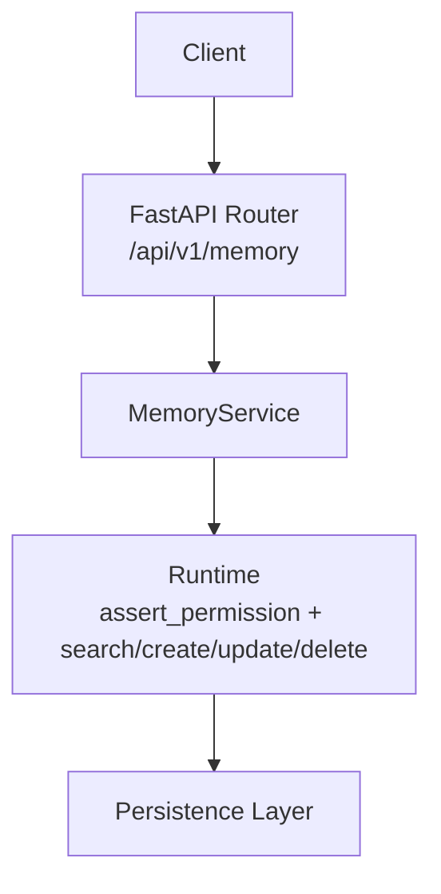
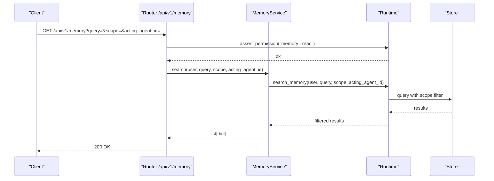
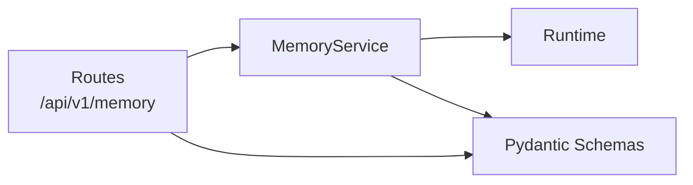

# Memory Scoping & Isolation

<cite>
**Referenced Files in This Document**
- [memory_service.py](file://backend/app/services/memory_service.py)
- [memory.py](file://backend/app/api/v1/routes/memory.py)
- [common.py](file://backend/app/schemas/common.py)
- [knowledge-memory.md](file://docs/knowledge-memory.md)
</cite>

## Table of Contents
1. [Introduction](#introduction)
2. [Project Structure](#project-structure)
3. [Core Components](#core-components)
4. [Architecture Overview](#architecture-overview)
5. [Detailed Component Analysis](#detailed-component-analysis)
6. [Dependency Analysis](#dependency-analysis)
7. [Performance Considerations](#performance-considerations)
8. [Troubleshooting Guide](#troubleshooting-guide)
9. [Conclusion](#conclusion)
10. [Appendices](#appendices)

## Introduction
This document explains how agent memory scoping and isolation are implemented and enforced in the system. It covers scope-based access control, data boundaries between agents, lifecycle management of memory items, and the supported memory types (event, episodic, semantic, procedural). It also documents inheritance and delegation patterns, cross-agent communication via shared scopes, configuration examples for different agent roles, and audit/provenance considerations aligned with compliance requirements.

## Project Structure
The memory subsystem is exposed through a FastAPI router, validated by Pydantic schemas, and delegated to a service layer that forwards calls into the runtime. The runtime enforces permissions and applies scope filters when reading or writing memory items.

**Diagram sources**
- [memory.py:1-48](file://backend/app/api/v1/routes/memory.py#L1-L48)
- [memory_service.py:1-27](file://backend/app/services/memory_service.py#L1-L27)

**Section sources**
- [memory.py:1-48](file://backend/app/api/v1/routes/memory.py#L1-L48)
- [memory_service.py:1-27](file://backend/app/services/memory_service.py#L1-L27)

## Core Components
- API routes: Define endpoints for listing, creating, updating, deleting, and searching memory items. They enforce a base permission “memory:read” on read operations and pass parameters like query, scope, and acting_agent_id downstream.
- Service layer: Provides thin wrappers around runtime methods, forwarding authenticated user context and request parameters.
- Schemas: Define request/response models including fields for scope, sensitivity_level, allowed_roles, department, expires_at, and metadata. Search requests support filtering by scope and acting_agent_id.
- Runtime integration: The service delegates to runtime methods which assert permissions and apply scope enforcement.

Key responsibilities:
- Scope-based filtering: Requests can include a scope parameter; the runtime uses it to constrain visibility and mutability.
- Acting agent identity: When an agent performs actions on behalf of another, acting_agent_id is propagated to ensure correct provenance and policy checks.
- Role-aware access: Items carry allowed_roles and sensitivity_level; combined with runtime permission checks, these determine whether a caller can access or modify an item.

**Section sources**
- [memory.py:1-48](file://backend/app/api/v1/routes/memory.py#L1-L48)
- [memory_service.py:1-27](file://backend/app/services/memory_service.py#L1-L27)
- [common.py:164-210](file://backend/app/schemas/common.py#L164-L210)

## Architecture Overview
The following sequence shows how a scoped memory search flows through the stack, including permission assertion and scope filtering.

**Diagram sources**
- [memory.py:11-19](file://backend/app/api/v1/routes/memory.py#L11-L19)
- [memory_service.py:4-10](file://backend/app/services/memory_service.py#L4-L10)

## Detailed Component Analysis

### Scope-Based Access Control
- Base permission: Read endpoints assert “memory:read”. Write endpoints rely on runtime authorization within create/update/delete paths.
- Scope parameter: Clients may specify a scope to limit visibility. The runtime applies this filter during retrieval and write validation.
- Acting agent identity: When acting on behalf of an agent, passing acting_agent_id ensures the correct policy context and provenance tagging.

Operational implications:
- Agents should only be granted access to scopes they need.
- Cross-scope reads/writes must be explicitly authorized.
- Provenance includes both the requesting user and the acting agent where applicable.

**Section sources**
- [memory.py:11-19](file://backend/app/api/v1/routes/memory.py#L11-L19)
- [memory_service.py:4-10](file://backend/app/services/memory_service.py#L4-L10)

### Data Boundaries Between Agents
- Item-level attributes: Each memory item carries department, sensitivity_level, allowed_roles, and optional expiration. These attributes gate access alongside scope and role checks.
- Agent-scoped defaults: Agents declare allowed_memory_scopes at registration time. At runtime, effective scope is typically the union of the agent’s declared scopes and organization-wide scopes for specific workflows.
- Enforcement point: The runtime enforces these constraints before returning or persisting data.

Practical guidance:
- Keep sensitive content in narrower scopes and restrict allowed_roles.
- Use department to partition data across business units.
- Set expires_at for ephemeral artifacts to reduce long-term risk.

**Section sources**
- [common.py:164-186](file://backend/app/schemas/common.py#L164-L186)
- [common.py:69-82](file://backend/app/schemas/common.py#L69-L82)
- [knowledge-memory.md:35-41](file://docs/knowledge-memory.md#L35-L41)

### Memory Types and Scoping Rules
The system distinguishes memory types conceptually and stores them as memory items with type-specific semantics. While storage is unified, scoping rules apply uniformly:
- Event memory: Short-lived records tied to discrete events. Often scoped to workflow runs or sessions.
- Episodic memory: Contextual recollections of past interactions. Scoped to agents or projects.
- Semantic memory: Generalized knowledge and facts. Scoped to domains or organizations.
- Procedural memory: Reusable skills and policies. Scoped to tool categories or process families.

Scoping rules:
- All types honor scope, sensitivity_level, allowed_roles, and expires_at.
- Retrieval supports filtering by scope and acting_agent_id.
- Provenance is recorded independently of retrieval tier.

**Section sources**
- [common.py:164-186](file://backend/app/schemas/common.py#L164-L186)
- [common.py:206-210](file://backend/app/schemas/common.py#L206-L210)
- [knowledge-memory.md:1-14](file://docs/knowledge-memory.md#L1-L14)

### Memory Inheritance, Delegation, and Cross-Agent Communication
- Inheritance: Effective scope for an agent is derived from its declared allowed_memory_scopes plus any organization-level allowances for flagship workflows.
- Delegation: An agent can act on behalf of another via acting_agent_id, enabling controlled delegation while preserving provenance.
- Cross-agent communication: Agents exchange information by writing to shared scopes (e.g., project or domain scopes) and reading back via those scopes. Access remains governed by allowed_roles and sensitivity.

Best practices:
- Prefer narrow scopes and explicit allowed_roles for inter-agent handoffs.
- Use acting_agent_id to attribute actions to the delegating agent.
- Avoid broad organization-wide scopes unless necessary for onboarding flows.

**Section sources**
- [knowledge-memory.md:35-41](file://docs/knowledge-memory.md#L35-L41)
- [memory.py:11-19](file://backend/app/api/v1/routes/memory.py#L11-L19)
- [memory_service.py:4-10](file://backend/app/services/memory_service.py#L4-L10)

### Lifecycle Management of Memory Items
Lifecycle stages:
- Creation: Items are created with scope, title, content, department, metadata, sensitivity_level, allowed_roles, and optional expires_at.
- Update: Partial updates are supported; fields such as scope and allowed_roles can be adjusted if permitted.
- Expiration: Optional expires_at enables automatic retirement of items after a defined time.
- Deletion: Authorized callers can remove items.

Operational notes:
- Updates require appropriate permissions and must respect current sensitivity and role constraints.
- Expiration aids compliance by limiting retention of transient data.

**Section sources**
- [common.py:164-186](file://backend/app/schemas/common.py#L164-L186)
- [memory.py:22-40](file://backend/app/api/v1/routes/memory.py#L22-L40)
- [memory_service.py:17-26](file://backend/app/services/memory_service.py#L17-L26)

### Audit Trails, Provenance Tracking, and Compliance
- Provenance: Memory items carry provenance independent of knowledge retrieval tiers. This supports traceability of who created/modified items and under what context.
- Retrieval tiers: Knowledge retrieval layers (tier 0–2) augment search with entity links and summaries but do not replace memory provenance.
- Compliance: Combine sensitivity_level, allowed_roles, department, and expires_at with scope enforcement to meet data governance requirements.

Recommendations:
- Always record acting_agent_id for auditable delegation.
- Tag high-sensitivity items with strict allowed_roles and short expires_at.
- Use department to align with organizational boundaries and reporting.

**Section sources**
- [knowledge-memory.md:1-14](file://docs/knowledge-memory.md#L1-L14)
- [knowledge-memory.md:35-41](file://docs/knowledge-memory.md#L35-L41)
- [common.py:164-186](file://backend/app/schemas/common.py#L164-L186)

### Configuration Examples for Different Agent Roles
- Researcher agent:
  - allowed_memory_scopes: ["research", "project:<project_id>"]
  - allowed_roles: ["researcher"]
  - Typical use: Read/write episodic and semantic items within assigned projects.
- Analyst agent:
  - allowed_memory_scopes: ["analysis", "organization"]
  - allowed_roles: ["analyst"]
  - Typical use: Read analysis outputs and write summary insights.
- Orchestrator agent:
  - allowed_memory_scopes: ["workflow", "organization"]
  - allowed_roles: ["orchestrator"]
  - Typical use: Coordinate cross-agent handoffs using acting_agent_id and shared workflow scopes.
- Auditor agent:
  - allowed_memory_scopes: ["audit", "organization"]
  - allowed_roles: ["auditor"]
  - Typical use: Read-only access to all relevant scopes for compliance reviews.

Notes:
- Adjust department to match business unit ownership.
- Use expires_at for temporary collaboration artifacts.
- Restrict allowed_roles to the minimum set required for each task.

**Section sources**
- [common.py:69-82](file://backend/app/schemas/common.py#L69-L82)
- [common.py:164-186](file://backend/app/schemas/common.py#L164-L186)
- [knowledge-memory.md:35-41](file://docs/knowledge-memory.md#L35-L41)

## Dependency Analysis
The memory subsystem follows a layered dependency pattern:
- Routes depend on the service layer for business logic.
- The service depends on the runtime for authorization and persistence orchestration.
- Schemas define contracts for input validation and response typing.

**Diagram sources**
- [memory.py:1-48](file://backend/app/api/v1/routes/memory.py#L1-L48)
- [memory_service.py:1-27](file://backend/app/services/memory_service.py#L1-L27)
- [common.py:164-210](file://backend/app/schemas/common.py#L164-L210)

**Section sources**
- [memory.py:1-48](file://backend/app/api/v1/routes/memory.py#L1-L48)
- [memory_service.py:1-27](file://backend/app/services/memory_service.py#L1-L27)
- [common.py:164-210](file://backend/app/schemas/common.py#L164-L210)

## Performance Considerations
- Scope filtering reduces result sets early, improving query performance.
- Limiting allowed_roles and narrowing scopes decreases authorization overhead.
- Using expires_at helps manage storage growth and improves cache effectiveness.
- For large-scale searches, prefer targeted queries and scopes rather than broad scans.

## Troubleshooting Guide
Common issues and resolutions:
- Permission denied on read: Ensure the caller has “memory:read” and the requested scope is within their allowed_memory_scopes.
- Empty results: Verify scope and acting_agent_id filters; confirm the item exists in the specified scope and is not expired.
- Unauthorized update: Check that the caller’s role is in allowed_roles and that the new sensitivity_level does not exceed policy limits.
- Provenance missing: Confirm that acting_agent_id was provided when delegating actions.

**Section sources**
- [memory.py:11-19](file://backend/app/api/v1/routes/memory.py#L11-L19)
- [memory_service.py:4-10](file://backend/app/services/memory_service.py#L4-L10)
- [common.py:164-186](file://backend/app/schemas/common.py#L164-L186)

## Conclusion
Memory scoping and isolation in this system are enforced through a combination of scope parameters, role-based attributes, and runtime authorization. By configuring allowed_memory_scopes and allowed_roles per agent, and by leveraging acting_agent_id for delegation, teams can implement fine-grained, auditable, and compliant memory usage across event, episodic, semantic, and procedural memory types. Proper use of department, sensitivity_level, and expires_at further strengthens data boundaries and supports long-term governance.

## Appendices

### API Reference Summary
- Endpoints:
  - GET /api/v1/memory: List/search memory items with optional query, scope, and acting_agent_id. Requires “memory:read”.
  - POST /api/v1/memory: Create a memory item with scope, title, content, department, metadata, sensitivity_level, allowed_roles, and expires_at.
  - GET /api/v1/memory/{id}: Retrieve a specific item. Requires “memory:read”.
  - PATCH /api/v1/memory/{id}: Update fields selectively.
  - DELETE /api/v1/memory/{id}: Delete an item.
  - POST /api/v1/memory/search: Search with a JSON body supporting query, scope, and acting_agent_id. Requires “memory:read”.

**Section sources**
- [memory.py:11-48](file://backend/app/api/v1/routes/memory.py#L11-L48)
- [common.py:164-210](file://backend/app/schemas/common.py#L164-L210)