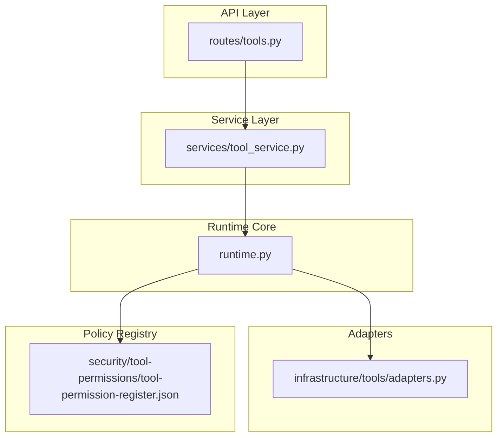
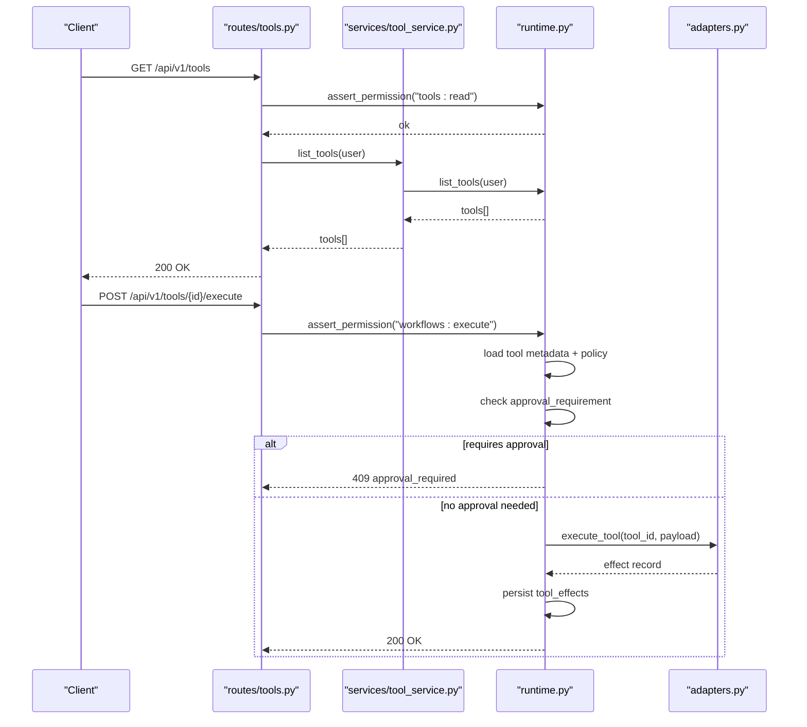
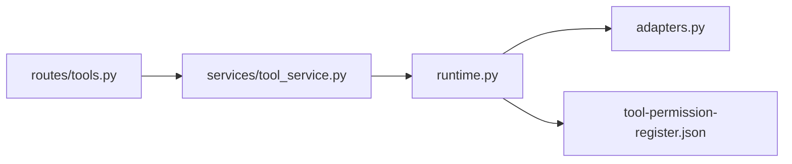

# Tool Adapter Framework

<cite>
**Referenced Files in This Document**
- [adapters.py](file://backend/app/infrastructure/tools/adapters.py)
- [runtime.py](file://backend/app/runtime.py)
- [tools.py](file://backend/app/api/v1/routes/tools.py)
- [tool_service.py](file://backend/app/services/tool_service.py)
- [tool-permission-register.json](file://business/security/tool-permissions/tool-permission-register.json)
</cite>

## Table of Contents
1. [Introduction](#introduction)
2. [Project Structure](#project-structure)
3. [Core Components](#core-components)
4. [Architecture Overview](#architecture-overview)
5. [Detailed Component Analysis](#detailed-component-analysis)
6. [Dependency Analysis](#dependency-analysis)
7. [Performance Considerations](#performance-considerations)
8. [Troubleshooting Guide](#troubleshooting-guide)
9. [Conclusion](#conclusion)
10. [Appendices](#appendices)

## Introduction
This document explains the tool adapter framework that enables secure integration with external services. It covers the adapter interface, implementation patterns, plugin architecture, permission-based access control, human approval gates, effect recording, registration and discovery, versioning considerations, security, error handling, retry logic, performance optimization, and auditing/compliance tracking. The goal is to help developers implement custom tool adapters for third-party services while maintaining governance and auditability.

## Project Structure
The tool adapter framework spans several modules:
- API routes expose CRUD operations for tools and enforce permissions.
- Services delegate to runtime for business logic and persistence.
- Runtime manages tool metadata, permissions, approvals, and execution orchestration.
- Adapters define concrete implementations for tool actions and produce durable effect records.
- A JSON registry defines tool permissions, allowed actions, scopes, and human gate requirements.

**Diagram sources**
- [tools.py:1-36](file://backend/app/api/v1/routes/tools.py#L1-L36)
- [tool_service.py:1-22](file://backend/app/services/tool_service.py#L1-L22)
- [runtime.py:1398-1452](file://backend/app/runtime.py#L1398-L1452)
- [adapters.py:143-177](file://backend/app/infrastructure/tools/adapters.py#L143-L177)
- [tool-permission-register.json:1-74](file://business/security/tool-permissions/tool-permission-register.json#L1-L74)

**Section sources**
- [tools.py:1-36](file://backend/app/api/v1/routes/tools.py#L1-L36)
- [tool_service.py:1-22](file://backend/app/services/tool_service.py#L1-L22)
- [runtime.py:1398-1452](file://backend/app/runtime.py#L1398-L1452)
- [adapters.py:1-177](file://backend/app/infrastructure/tools/adapters.py#L1-L177)
- [tool-permission-register.json:1-74](file://business/security/tool-permissions/tool-permission-register.json#L1-L74)

## Core Components
- Tool Adapter Interface: Each adapter function receives a payload dict and returns a standardized effect record containing id, tool_id, action, status, input, result, and created_at.
- Execution Engine: A central dispatcher resolves an adapter by tool_id, invokes it, validates the returned effect, and raises a typed error on failure.
- Permission and Approval Policy: Tools are registered with risk levels, required permissions, allowed_actions, scope, timeout, retry_policy, and whether they require human approval.
- Effect Recording: All successful executions produce durable effect payloads stored under tool_effects for auditing and compliance.
- Registration and Discovery: Tools can be seeded from a policy registry or created via API; listing and detail endpoints provide discovery.

Key responsibilities:
- Adapters: Implement domain-specific side effects (e.g., CRM, billing, email, video stubs).
- Runtime: Enforce RBAC, memory scoping, approval gates, timeouts, retries, and persist tool_effects.
- API: Provide read/write endpoints for tools with role-based authorization.

**Section sources**
- [adapters.py:18-27](file://backend/app/infrastructure/tools/adapters.py#L18-L27)
- [adapters.py:164-177](file://backend/app/infrastructure/tools/adapters.py#L164-L177)
- [runtime.py:1398-1452](file://backend/app/runtime.py#L1398-L1452)
- [tool-permission-register.json:1-74](file://business/security/tool-permissions/tool-permission-register.json#L1-L74)

## Architecture Overview
The framework follows a layered design:
- API layer enforces authentication and RBAC before delegating to services.
- Service layer calls runtime methods for tool management and execution.
- Runtime orchestrates policy checks, approval gating, and adapter invocation.
- Adapters return normalized effect records that are persisted for auditability.

**Diagram sources**
- [tools.py:11-35](file://backend/app/api/v1/routes/tools.py#L11-L35)
- [tool_service.py:4-22](file://backend/app/services/tool_service.py#L4-L22)
- [runtime.py:1398-1452](file://backend/app/runtime.py#L1398-L1452)
- [adapters.py:164-177](file://backend/app/infrastructure/tools/adapters.py#L164-L177)

## Detailed Component Analysis

### Adapter Interface and Implementation Patterns
- Standardized effect schema: Every adapter must return a dict with fields id, tool_id, action, status, input, result, created_at.
- Error contract: Adapters may raise a typed exception to signal failures; the executor wraps unexpected exceptions into a consistent error type.
- Deterministic IDs and timestamps: Effects include stable identifiers and ISO timestamps for auditability.
- Stub adapters: CI-safe stubs exist for media generation/formatting/QC/packaging to enable testing without external dependencies.

Implementation checklist:
- Accept a single dict payload.
- Return a dict conforming to the effect schema.
- Use unique IDs and UTC timestamps.
- Keep side effects idempotent where possible.

**Section sources**
- [adapters.py:18-27](file://backend/app/infrastructure/tools/adapters.py#L18-L27)
- [adapters.py:157-177](file://backend/app/infrastructure/tools/adapters.py#L157-L177)

### Plugin Architecture and Registration
- Central registry maps tool_id to callable adapters.
- New adapters are added by registering a function under a unique tool_id key.
- The executor looks up the adapter by tool_id and invokes it with the provided payload.

Registration pattern:
- Define a function implementing the adapter contract.
- Add an entry to the registry mapping tool_id to the function.
- Ensure the tool metadata exists in runtime (seeded or created via API).

**Section sources**
- [adapters.py:143-154](file://backend/app/infrastructure/tools/adapters.py#L143-L154)
- [adapters.py:164-177](file://backend/app/infrastructure/tools/adapters.py#L164-L177)

### Permission-Based Access Control
- Role-based permissions are enforced at the API layer using role-to-permission mappings.
- Tools carry required_permissions and are scoped per organization.
- Memory scoping is enforced separately for agent-driven writes/reads.

Security controls:
- API routes assert specific permissions (e.g., tools:read, workflows:execute).
- Runtime maintains ROLE_PERMISSIONS and denies unauthorized actions.
- Organization-scoped queries ensure multi-tenancy isolation.

**Section sources**
- [tools.py:11-35](file://backend/app/api/v1/routes/tools.py#L11-L35)
- [runtime.py:140-222](file://backend/app/runtime.py#L140-L222)
- [runtime.py:862-866](file://backend/app/runtime.py#L862-L866)
- [runtime.py:903-936](file://backend/app/runtime.py#L903-L936)

### Human Approval Gates
- Tools can declare approval_requirement based on policy registry entries.
- Runtime evaluates whether a tool requires human approval before execution.
- If approval is required, the system returns a conflict indicating approval is needed.

Approval flow:
- Load tool metadata and policy.
- Determine if approval is required.
- If yes, block execution and return approval_required.
- If no, proceed to adapter execution.

**Section sources**
- [tool-permission-register.json:1-74](file://business/security/tool-permissions/tool-permission-register.json#L1-L74)
- [runtime.py:884-892](file://backend/app/runtime.py#L884-L892)

### Effect Recording and Auditing
- Successful adapter invocations produce effect records with id, tool_id, action, status, input, result, created_at.
- Effects are persisted under tool_effects for downstream auditing and compliance.
- Audit logs capture lifecycle events for tools and other resources.

Auditing highlights:
- Effects include structured input/result snapshots.
- Timestamps and IDs support traceability across runs.
- Audit entries record user context and outcomes.

**Section sources**
- [adapters.py:18-27](file://backend/app/infrastructure/tools/adapters.py#L18-L27)
- [runtime.py:225-255](file://backend/app/runtime.py#L225-L255)

### Tool Registration, Discovery, and Version Management
- Tools can be seeded from the policy registry or created via API.
- Listing and detail endpoints provide discovery within an organization scope.
- Versioning applies primarily to workflows; tools themselves are managed via enabled/archived states and metadata updates.

Versioning guidance:
- For tool behavior changes, prefer immutable versions of workflow steps referencing specific tool configurations.
- Maintain backward compatibility in adapter contracts.

**Section sources**
- [runtime.py:466-517](file://backend/app/runtime.py#L466-L517)
- [runtime.py:1398-1452](file://backend/app/runtime.py#L1398-L1452)
- [tools.py:11-35](file://backend/app/api/v1/routes/tools.py#L11-L35)

### Example: Implementing a Custom Tool Adapter
To integrate a third-party service:
- Create a new adapter function that accepts a payload dict and returns a standard effect record.
- Register the adapter under a unique tool_id in the registry.
- Add tool metadata (risk_level, required_permissions, allowed_actions, scope, timeout, retry_policy, approval_requirement) either via seed or API.
- Ensure the tool’s allowed_actions align with the policy registry.

Steps:
1. Implement adapter function following the effect schema.
2. Add tool_id mapping in the registry.
3. Seed or create tool metadata with appropriate policies.
4. Test via API endpoints and verify effect records.

**Section sources**
- [adapters.py:143-154](file://backend/app/infrastructure/tools/adapters.py#L143-L154)
- [adapters.py:164-177](file://backend/app/infrastructure/tools/adapters.py#L164-L177)
- [tool-permission-register.json:1-74](file://business/security/tool-permissions/tool-permission-register.json#L1-L74)
- [runtime.py:1409-1431](file://backend/app/runtime.py#L1409-L1431)

### Security, Error Handling, Retry Logic, and Performance
Security:
- Enforce RBAC at API boundaries and runtime checks.
- Scope tools and memory by organization and agent permissions.
- Validate inputs and normalize outputs through effect schemas.

Error handling:
- Use typed exceptions for adapter failures.
- Normalize unexpected errors into consistent responses.
- Persist failed attempts in audit logs for observability.

Retry logic:
- Configure retry_policy per tool (max_retries).
- Apply exponential backoff and jitter for external calls.
- Idempotency keys for safe retries.

Performance:
- Cache tool metadata and policies in-memory during request lifetimes.
- Batch effect writes when possible.
- Use timeouts per tool to prevent long-running calls.

[No sources needed since this section provides general guidance]

### Tool Effect Auditing and Compliance Tracking
- Every effect includes structured metadata for tracing.
- Audit logs record user identity, tool usage, and outcomes.
- Compliance dashboards can query tool_effects and audit_logs for reporting.

Compliance practices:
- Retain effects and audit logs per retention policy.
- Redact sensitive data in results where necessary.
- Periodically review approval gates and permissions.

**Section sources**
- [adapters.py:18-27](file://backend/app/infrastructure/tools/adapters.py#L18-L27)
- [runtime.py:225-255](file://backend/app/runtime.py#L225-L255)

## Dependency Analysis
The following diagram shows how components depend on each other:

**Diagram sources**
- [tools.py:1-36](file://backend/app/api/v1/routes/tools.py#L1-L36)
- [tool_service.py:1-22](file://backend/app/services/tool_service.py#L1-L22)
- [runtime.py:1398-1452](file://backend/app/runtime.py#L1398-L1452)
- [adapters.py:143-177](file://backend/app/infrastructure/tools/adapters.py#L143-L177)
- [tool-permission-register.json:1-74](file://business/security/tool-permissions/tool-permission-register.json#L1-L74)

**Section sources**
- [tools.py:1-36](file://backend/app/api/v1/routes/tools.py#L1-L36)
- [tool_service.py:1-22](file://backend/app/services/tool_service.py#L1-L22)
- [runtime.py:1398-1452](file://backend/app/runtime.py#L1398-L1452)
- [adapters.py:143-177](file://backend/app/infrastructure/tools/adapters.py#L143-L177)
- [tool-permission-register.json:1-74](file://business/security/tool-permissions/tool-permission-register.json#L1-L74)

## Performance Considerations
- Prefer in-process adapters for low-latency integrations.
- External HTTP calls should use connection pooling and timeouts.
- Avoid heavy serialization in hot paths; keep payloads minimal.
- Use background workers for long-running tasks and emit streaming events.

[No sources needed since this section provides general guidance]

## Troubleshooting Guide
Common issues and resolutions:
- Permission denied: Verify user role has required permissions (e.g., tools:read, workflows:execute).
- Approval required: Check tool policy for approval_requirement and complete the human gate.
- Adapter not found: Ensure tool_id is registered in both metadata and adapter registry.
- Invalid effect response: Confirm adapter returns the expected schema fields.
- Timeouts and retries: Adjust tool timeout and retry_policy; inspect audit logs for failure reasons.

Operational tips:
- Inspect tool_effects for detailed input/result snapshots.
- Review audit logs for user context and outcomes.
- Use organization-scoped queries to isolate issues.

**Section sources**
- [tools.py:11-35](file://backend/app/api/v1/routes/tools.py#L11-L35)
- [runtime.py:862-866](file://backend/app/runtime.py#L862-L866)
- [runtime.py:884-892](file://backend/app/runtime.py#L884-L892)
- [adapters.py:164-177](file://backend/app/infrastructure/tools/adapters.py#L164-L177)

## Conclusion
The tool adapter framework provides a robust, auditable, and secure way to integrate external services. By enforcing permissions, human approval gates, and standardized effect recording, it ensures compliance and operational visibility. Developers can extend capabilities by implementing custom adapters and registering them with proper policies and metadata.

[No sources needed since this section summarizes without analyzing specific files]

## Appendices

### Appendix A: Tool Metadata Fields
- id: Unique identifier for the tool.
- organization_id: Tenant scope.
- name, description: Human-readable details.
- category: Classification (e.g., internal_api, video_stub).
- input_schema, output_schema: Contracts for payloads.
- risk_level: Tiered risk classification.
- required_permissions: Minimum RBAC permissions.
- approval_requirement: Whether human approval is needed.
- timeout: Max execution time.
- retry_policy: Retry configuration.
- enabled: Activation flag.
- allowed_actions: Permitted actions aligned with policy.
- scope: Operational scope label.

**Section sources**
- [runtime.py:1409-1431](file://backend/app/runtime.py#L1409-L1431)
- [tool-permission-register.json:1-74](file://business/security/tool-permissions/tool-permission-register.json#L1-L74)

### Appendix B: Effect Record Schema
- id: Unique effect identifier.
- tool_id: Source tool identifier.
- action: Action performed by the adapter.
- status: Outcome status (e.g., ok).
- input: Original payload.
- result: Adapter output.
- created_at: UTC timestamp.

**Section sources**
- [adapters.py:18-27](file://backend/app/infrastructure/tools/adapters.py#L18-L27)