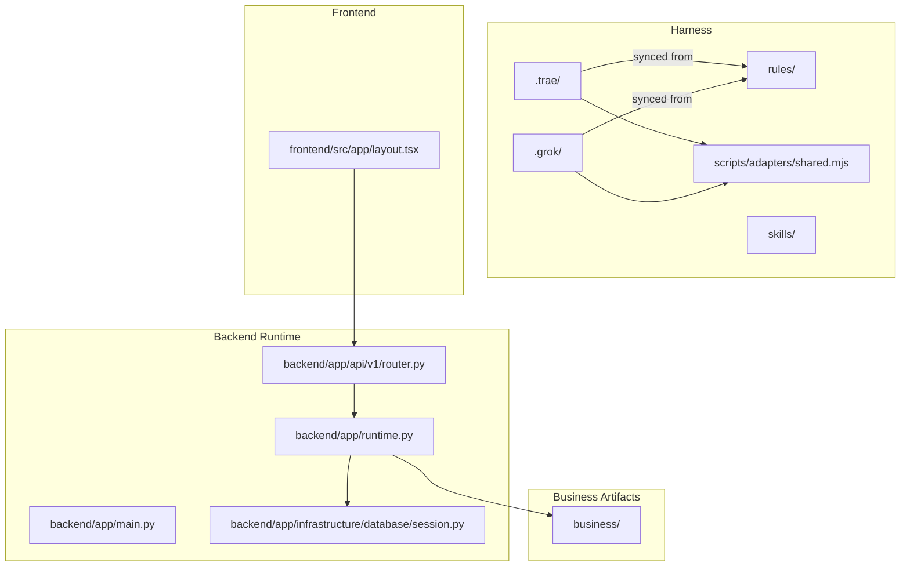
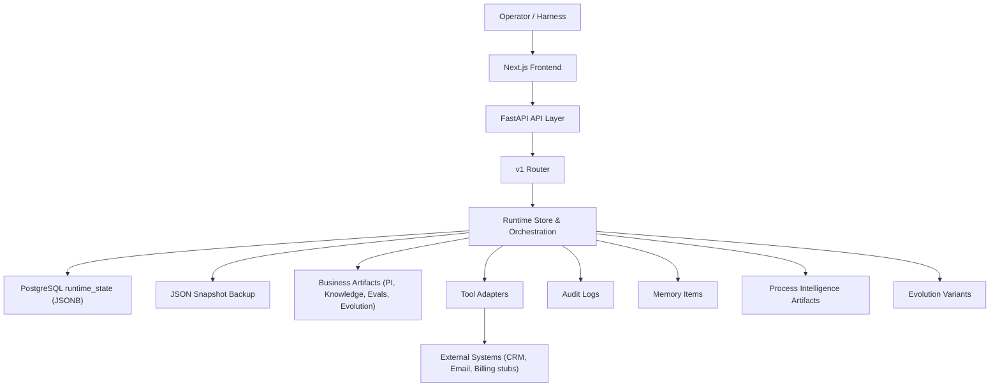
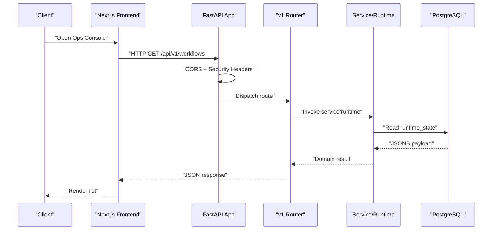
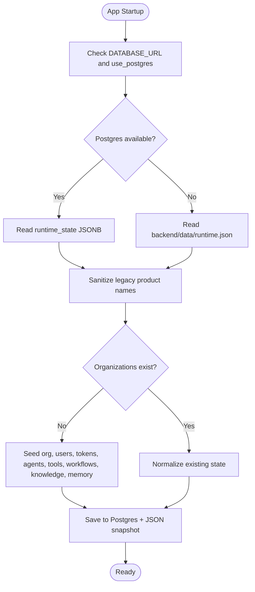
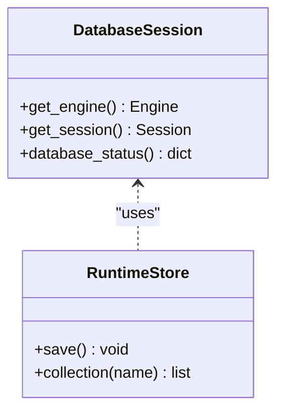
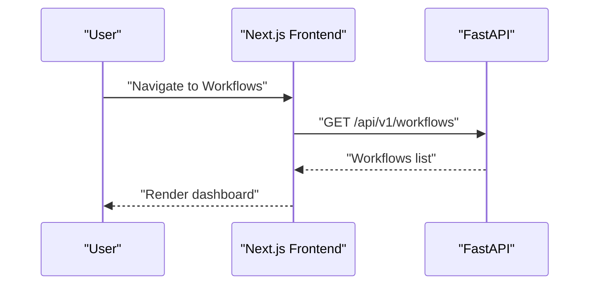
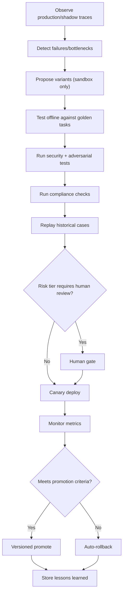
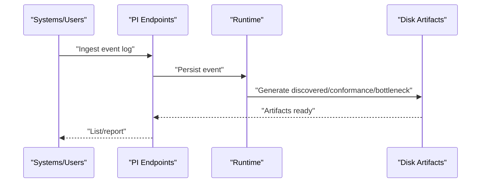
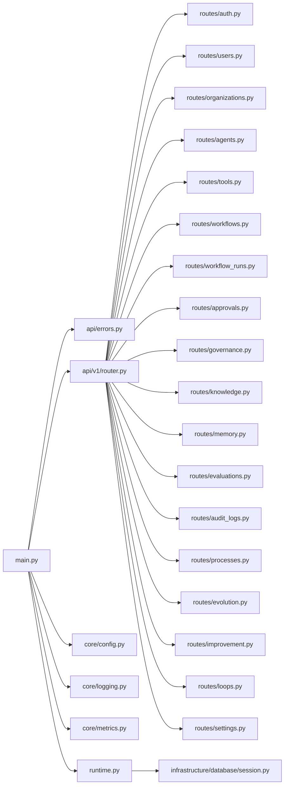
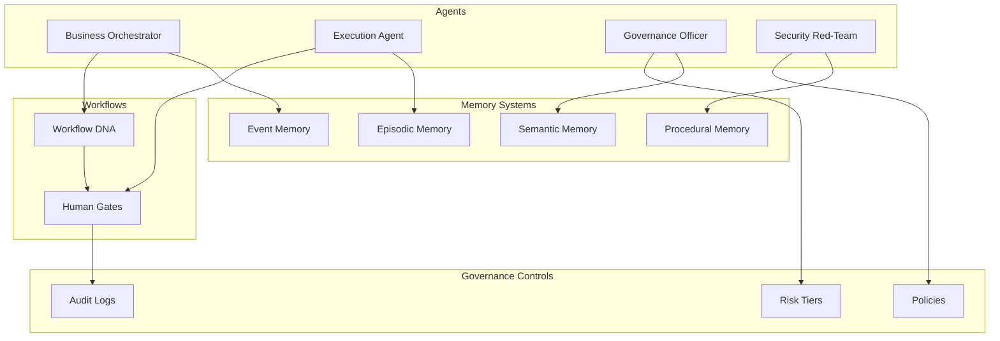

# Architecture Overview

<cite>
**Referenced Files in This Document**
- [README.md](file://README.md)
- [structure.md](file://structure.md)
- [docs/architecture.md](file://docs/architecture.md)
- [backend/app/main.py](file://backend/app/main.py)
- [backend/app/runtime.py](file://backend/app/runtime.py)
- [backend/app/api/v1/router.py](file://backend/app/api/v1/router.py)
- [backend/app/infrastructure/database/session.py](file://backend/app/infrastructure/database/session.py)
- [frontend/src/app/layout.tsx](file://frontend/src/app/layout.tsx)
</cite>

## Table of Contents
1. [Introduction](#introduction)
2. [Project Structure](#project-structure)
3. [Core Components](#core-components)
4. [Architecture Overview](#architecture-overview)
5. [Detailed Component Analysis](#detailed-component-analysis)
6. [Dependency Analysis](#dependency-analysis)
7. [Performance Considerations](#performance-considerations)
8. [Troubleshooting Guide](#troubleshooting-guide)
9. [Conclusion](#conclusion)
10. [Appendices](#appendices)

## Introduction
Generic Swarm Ops is a governed, auditable, self-improving multi-agent business operating system with dual-harness support for Trae IDE and Grok Build. It combines:
- A starter/harness layer that synchronizes agent configurations into .trae and .grok trees
- A business artifact repository (process intelligence, knowledge/memory, governance, evaluations, evolution artifacts)
- A FastAPI control plane providing APIs for workflows, approvals, knowledge, memory, process intelligence, evolution, improvement, and loops
- A Next.js operations console for live management when demo mode is disabled

The platform enforces safety-first design with bounded autonomy, human gates, auditability, and sandbox-only evolution.

**Section sources**
- [README.md:1-129](file://README.md#L1-L129)
- [docs/architecture.md:1-64](file://docs/architecture.md#L1-L64)

## Project Structure
High-level layout:
- Starter/Harness: .trae/, .grok/, rules/, skills/, hooks/, mcp-configs/, scripts/adapters/shared.mjs
- Business: business/ (PI, knowledge, governance, evals, evolution, memory)
- Backend runtime: backend/app (FastAPI app, API v1 routes, domain, services, infrastructure, workers)
- Frontend: frontend/ (Next.js ops console)
- Documentation and planning: docs/, book/, planning/

**Diagram sources**
- [README.md:32-48](file://README.md#L32-L48)
- [docs/architecture.md:21-32](file://docs/architecture.md#L21-L32)
- [backend/app/main.py:16-52](file://backend/app/main.py#L16-L52)
- [backend/app/api/v1/router.py:1-47](file://backend/app/api/v1/router.py#L1-47)
- [backend/app/runtime.py:258-384](file://backend/app/runtime.py#L258-L384)
- [backend/app/infrastructure/database/session.py:10-63](file://backend/app/infrastructure/database/session.py#L10-L63)
- [frontend/src/app/layout.tsx:17-28](file://frontend/src/app/layout.tsx#L17-L28)

**Section sources**
- [README.md:1-48](file://README.md#L1-L48)
- [docs/architecture.md:1-32](file://docs/architecture.md#L1-L32)

## Core Components
- FastAPI application entrypoint with CORS, request context middleware, security headers, metrics, and OpenAPI exposure
- API router aggregating domain endpoints (auth, users, organizations, agents, tools, workflows, runs, approvals, governance, knowledge, memory, evaluations, audit logs, processes, evolution, improvement, loops, settings)
- Runtime store with Postgres primary (JSONB) and JSON file fallback; bootstraps default organization, users, tokens, agents, tools, workflows, knowledge documents, and seed data
- Database session helper exposing engine/session and health status
- Next.js root layout configuring fonts and metadata for the ops console

Key responsibilities:
- API Layer: HTTP routing, validation, error handling, metrics, security headers
- Service Layer: orchestration logic via runtime and services (not shown here)
- Domain Layer: business entities and policies (agents, workflows, approvals, governance, etc.)
- Infrastructure Layer: database, knowledge retrieval, vector stores, evolution, process intelligence, integrations

**Section sources**
- [backend/app/main.py:16-52](file://backend/app/main.py#L16-L52)
- [backend/app/api/v1/router.py:1-47](file://backend/app/api/v1/router.py#L1-47)
- [backend/app/runtime.py:258-384](file://backend/app/runtime.py#L258-L384)
- [backend/app/infrastructure/database/session.py:10-63](file://backend/app/infrastructure/database/session.py#L10-L63)
- [frontend/src/app/layout.tsx:17-28](file://frontend/src/app/layout.tsx#L17-L28)

## Architecture Overview
Layered architecture:
- API Layer: FastAPI app + v1 routers
- Service Layer: runtime orchestration and service modules
- Domain Layer: business models and policies
- Infrastructure Layer: persistence (Postgres/JSON), knowledge, memory, PI, evolution, integrations

System boundaries:
- External harnesses: Trae IDE and Grok Build consume generated configs and MCP tool catalogs
- Frontend: Next.js UI calls backend APIs
- Persistence: PostgreSQL runtime_state table with JSONB payload; local JSON snapshot backup
- Process Intelligence: event ingestion and artifact generation under business/process-intelligence
- Evolution Sandbox: variant proposal, evaluation, canary promotion, rollback

Data flows:
- Operator or harness triggers workflow run via API
- Runtime executes bounded steps, records tool effects, writes audit logs and memory items
- Human gates pause execution until approval
- On completion, auto-reflection writes lessons; optional sandbox proposals are created
- Evolution evaluates variants against corpus; promotes only after passing safety/compliance checks

Integration patterns:
- Tool adapters execute actions and produce durable tool_effects
- Knowledge retrieval uses tiered hybrid approach (keyword+embedding, entity multi-hop)
- Governance applies risk tiers and approval requirements per step/tool
- Process intelligence consumes event logs to generate discovered processes, conformance reports, and bottleneck analyses

**Diagram sources**
- [docs/architecture.md:21-32](file://docs/architecture.md#L21-L32)
- [backend/app/main.py:16-52](file://backend/app/main.py#L16-L52)
- [backend/app/api/v1/router.py:1-47](file://backend/app/api/v1/router.py#L1-47)
- [backend/app/runtime.py:258-384](file://backend/app/runtime.py#L258-L384)
- [backend/app/infrastructure/database/session.py:36-63](file://backend/app/infrastructure/database/session.py#L36-L63)

## Detailed Component Analysis

### API Layer
- Application bootstrap sets title, version, OpenAPI URL, registers error handlers, adds CORS middleware
- Request context middleware injects request ID, measures latency, records metrics, attaches security headers, and propagates request context through runtime
- Router aggregates all domain endpoints under /api/v1 with tags for discoverability

**Diagram sources**
- [backend/app/main.py:16-52](file://backend/app/main.py#L16-L52)
- [backend/app/api/v1/router.py:1-47](file://backend/app/api/v1/router.py#L1-47)
- [backend/app/runtime.py:258-384](file://backend/app/runtime.py#L258-L384)
- [backend/app/infrastructure/database/session.py:36-63](file://backend/app/infrastructure/database/session.py#L36-L63)

**Section sources**
- [backend/app/main.py:16-52](file://backend/app/main.py#L16-L52)
- [backend/app/api/v1/router.py:1-47](file://backend/app/api/v1/router.py#L1-47)

### Runtime Store and Bootstrapping
- RuntimeStore persists state to Postgres (runtime_state JSONB) with JSON file fallback and always keeps a snapshot
- On first start, bootstraps default organization, users, access/refresh tokens, API keys, agents, tools, workflows, knowledge documents, and seed memory items
- Normalization ensures legacy fields and missing schemas are filled for backward compatibility

**Diagram sources**
- [backend/app/runtime.py:258-384](file://backend/app/runtime.py#L258-L384)
- [backend/app/runtime.py:757-800](file://backend/app/runtime.py#L757-L800)

**Section sources**
- [backend/app/runtime.py:258-384](file://backend/app/runtime.py#L258-L384)
- [backend/app/runtime.py:757-800](file://backend/app/runtime.py#L757-L800)

### Database Session and Health
- Provides SQLAlchemy engine and session helpers
- Exposes database_status() returning backend type, configuration flags, reachability, and pool info
- Used by health endpoint to report "database": "postgres" when connected

**Diagram sources**
- [backend/app/infrastructure/database/session.py:10-63](file://backend/app/infrastructure/database/session.py#L10-L63)
- [backend/app/runtime.py:258-384](file://backend/app/runtime.py#L258-L384)

**Section sources**
- [backend/app/infrastructure/database/session.py:10-63](file://backend/app/infrastructure/database/session.py#L10-L63)

### Frontend Ops Console
- Next.js root layout configures fonts and metadata
- In non-demo mode, the console provides live lists/forms for agents, workflows, runs, approvals, knowledge, evaluations, processes, Improve pipeline, and Evolution archive

**Diagram sources**
- [frontend/src/app/layout.tsx:17-28](file://frontend/src/app/layout.tsx#L17-L28)
- [backend/app/api/v1/router.py:1-47](file://backend/app/api/v1/router.py#L1-47)

**Section sources**
- [frontend/src/app/layout.tsx:17-28](file://frontend/src/app/layout.tsx#L17-L28)

### Evolution Sandbox and Self-Improvement Loops
- Evolution engine proposes variants, tests against corpus, canary deploys, and promotes only after passing safety/compliance checks
- Self-improvement includes auto-reflection, lesson library, optional LLM critic, skill sandbox, and Loop runner
- The Improve pipeline on run details supports Reflect → Propose → Evaluate → Canary

**Diagram sources**
- [structure.md:349-398](file://structure.md#L349-L398)
- [docs/architecture.md:42-56](file://docs/architecture.md#L42-L56)

**Section sources**
- [structure.md:349-398](file://structure.md#L349-L398)
- [docs/architecture.md:42-56](file://docs/architecture.md#L42-L56)

### Process Intelligence Components
- Event ingest produces discovered processes, conformance reports, and bottleneck analyses
- PI artifacts are persisted under business/process-intelligence and surfaced via APIs

**Diagram sources**
- [docs/architecture.md:34-41](file://docs/architecture.md#L34-L41)
- [structure.md:69-108](file://structure.md#L69-L108)

**Section sources**
- [docs/architecture.md:34-41](file://docs/architecture.md#L34-L41)
- [structure.md:69-108](file://structure.md#L69-L108)

## Dependency Analysis
Component coupling and cohesion:
- main.py depends on api errors, v1 router, core config/logging/metrics, and runtime
- router.py composes multiple domain routers (auth, users, organizations, agents, tools, workflows, runs, approvals, governance, knowledge, memory, evaluations, audit logs, processes, evolution, improvement, loops, settings)
- runtime.py encapsulates persistence, bootstrapping, normalization, and seed data loading
- database/session.py provides engine/session and health status used by runtime and health endpoints

**Diagram sources**
- [backend/app/main.py:16-52](file://backend/app/main.py#L16-L52)
- [backend/app/api/v1/router.py:1-47](file://backend/app/api/v1/router.py#L1-47)
- [backend/app/runtime.py:258-384](file://backend/app/runtime.py#L258-L384)
- [backend/app/infrastructure/database/session.py:10-63](file://backend/app/infrastructure/database/session.py#L10-L63)

**Section sources**
- [backend/app/main.py:16-52](file://backend/app/main.py#L16-L52)
- [backend/app/api/v1/router.py:1-47](file://backend/app/api/v1/router.py#L1-47)
- [backend/app/runtime.py:258-384](file://backend/app/runtime.py#L258-L384)
- [backend/app/infrastructure/database/session.py:10-63](file://backend/app/infrastructure/database/session.py#L10-L63)

## Performance Considerations
- Prefer Postgres for durability and concurrency; JSON file serves as fallback and snapshot backup
- Use connection pooling parameters exposed by database session helper
- Keep most queries on Tier 0 retrieval (keyword+embedding) to minimize cost and latency
- Record request metrics and durations at the API layer for observability and capacity planning
- Avoid heavy graph rebuilds; leverage incremental updates for knowledge graphs where applicable

[No sources needed since this section provides general guidance]

## Troubleshooting Guide
Common issues and diagnostics:
- Database connectivity: check database_status() output for reachable flag and error details
- Health readiness: verify GET /api/v1/health/ready returns "database": "postgres" when configured
- CORS and security headers: ensure allow_origins and security headers are set in main middleware
- Legacy product name sanitization: confirm sanitize functions applied on load/save to avoid inconsistent paths
- Demo mode vs live ops: set NEXT_PUBLIC_DEMO_MODE=false and configure NEXT_PUBLIC_API_BASE_URL to enable real forms and live operations

**Section sources**
- [backend/app/infrastructure/database/session.py:36-63](file://backend/app/infrastructure/database/session.py#L36-L63)
- [docs/architecture.md:15-20](file://docs/architecture.md#L15-L20)
- [backend/app/main.py:18-47](file://backend/app/main.py#L18-L47)
- [backend/app/runtime.py:30-61](file://backend/app/runtime.py#L30-L61)
- [README.md:100-110](file://README.md#L100-L110)

## Conclusion
Generic Swarm Ops implements a layered, governed multi-agent business operating system with clear separation between API, service, domain, and infrastructure layers. Dual-harness support for Trae IDE and Grok Build enables consistent agent environments. The platform emphasizes safety, auditability, and controlled evolution, with robust persistence, process intelligence, knowledge/memory systems, and an operations console for live management.

[No sources needed since this section summarizes without analyzing specific files]

## Appendices
- System Context Diagram: Agents, Workflows, Memory, Governance, and Controls

[No sources needed since this diagram shows conceptual relationships not tied to specific source files]