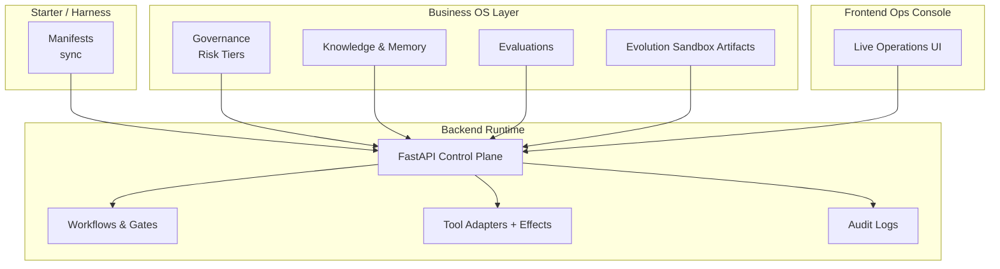
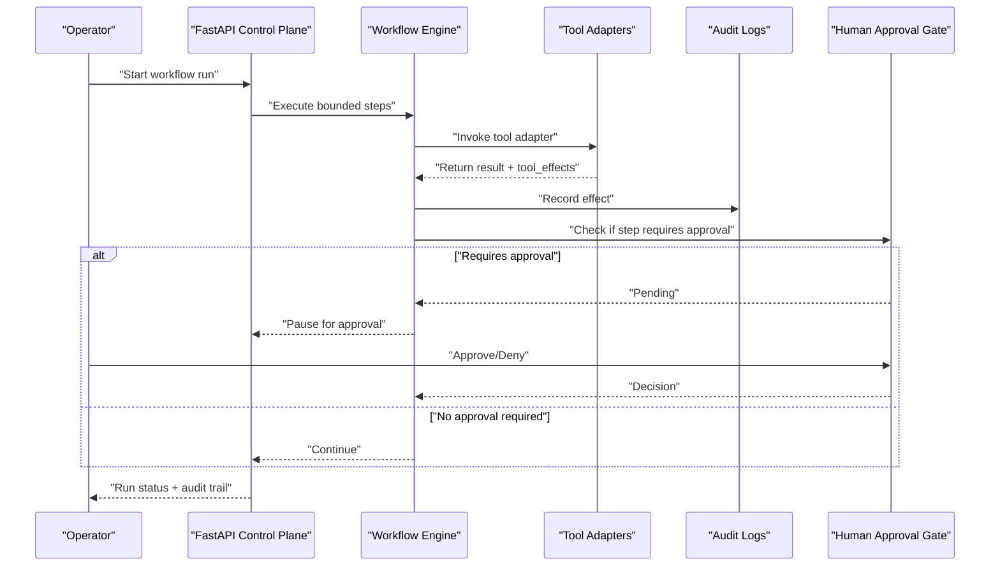
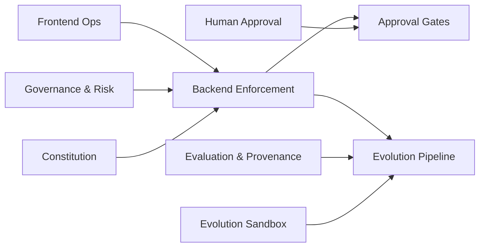

# Core Principles & Design Philosophy

<cite>
**Referenced Files in This Document**
- [README.md](file://README.md)
- [architecture.md](file://docs/architecture.md)
- [00-constitution.md](file://rules/00-constitution.md)
- [90-governance-risk.md](file://rules/90-governance-risk.md)
- [100-evolution-sandbox.md](file://rules/100-evolution-sandbox.md)
- [60-human-approval.md](file://rules/60-human-approval.md)
- [120-evaluation-and-provenance.md](file://rules/120-evaluation-and-provenance.md)
</cite>

## Table of Contents
1. [Introduction](#introduction)
2. [Project Structure](#project-structure)
3. [Core Components](#core-components)
4. [Architecture Overview](#architecture-overview)
5. [Detailed Component Analysis](#detailed-component-analysis)
6. [Dependency Analysis](#dependency-analysis)
7. [Performance Considerations](#performance-considerations)
8. [Troubleshooting Guide](#troubleshooting-guide)
9. [Conclusion](#conclusion)

## Introduction
This section documents the seven foundational principles that guide the system’s architecture, security controls, and operational procedures: evidence over opinion, bounded autonomy, testability, sandbox evolution, provenance tracking, reversibility first, and human-centered design. It explains how these principles shape risk tiering, approval gates, and autonomous capabilities, with concrete references to repository rules and runtime behavior.

## Project Structure
The project is organized into layers that reflect the principles:
- Starter/harness layer for agent orchestration and synchronization
- Business operating-system layer for governance, knowledge, memory, evaluations, and evolution artifacts
- Backend control plane (FastAPI) implementing workflows, approvals, tool adapters, audit logs, and health endpoints
- Frontend ops console for live operations and improvement pipelines

[No sources needed since this diagram shows conceptual workflow, not actual code structure]

**Section sources**
- [README.md:1-129](file://README.md#L1-L129)
- [architecture.md:1-64](file://docs/architecture.md#L1-L64)

## Core Components
- Constitution and safety-first baseline: simple, maintainable changes; no destructive actions without approval; audit before install or import; run tests when possible; update status after major work.
- Governance and risk tiers: apply autonomy risk tiers before enabling action; require human approval for higher-tier drafting, gates, restrictions, exceptions, and irreversible steps; maintain audit logs, model cards, tool permissions, and assurance cases.
- Evolution sandbox: never mutate production directly; require baseline comparison, regression/adversarial results, compliance checks, rollback plans, and approvals before canary rollout; record lessons learned for every variant.
- Human approval gates: explicit approvals required for installing packages, running remote scripts, enabling MCP servers with credentials, copying third-party code into active configs, modifying hooks, deleting files, and applying self-generated skill/rule changes.
- Evaluation and provenance: traceable provenance for all artifacts; mandatory golden/regression/adversarial/human-review evidence before promotion; evaluation never auto-promotes workflows.

These components collectively enforce a safety-first approach across architecture, security controls, and operations.

**Section sources**
- [00-constitution.md:1-10](file://rules/00-constitution.md#L1-L10)
- [90-governance-risk.md:1-6](file://rules/90-governance-risk.md#L1-L6)
- [100-evolution-sandbox.md:1-6](file://rules/100-evolution-sandbox.md#L1-L6)
- [60-human-approval.md:1-12](file://rules/60-human-approval.md#L1-L12)
- [120-evaluation-and-provenance.md:1-6](file://rules/120-evaluation-and-provenance.md#L1-L6)

## Architecture Overview
The runtime behavior reflects the principles:
- Operators authenticate and execute bounded workflow steps with audited tool effects.
- Irreversible steps pause for human approval.
- On terminal status, the system auto-reflects and optionally proposes sandbox variants.
- Evolution variants remain sandbox-only until evaluated and promoted via canary/versioned paths.
- Knowledge retrieval uses tiered strategies.

**Diagram sources**
- [architecture.md:42-50](file://docs/architecture.md#L42-L50)
- [README.md:77-89](file://README.md#L77-L89)

**Section sources**
- [architecture.md:1-64](file://docs/architecture.md#L1-L64)
- [README.md:77-89](file://README.md#L77-L89)

## Detailed Component Analysis

### Principle 1: Evidence Over Opinion
- How it guides decisions: All promotions and changes require measurable evidence from evaluations and audits rather than subjective judgment.
- Security controls: Mandatory evaluation suites (golden, regression, adversarial, human review) and source audits before any change proceeds.
- Operational procedures: Promotion gates depend on passing evidence; operators must consult evaluation results and audit logs.
- Practical examples:
  - The “evaluation never auto-promotes” rule ensures human-driven promotion based on evidence.
  - Source download and audit commands are part of bootstrap and validation flows.
  - Health endpoint confirms database readiness before operations proceed.

**Section sources**
- [120-evaluation-and-provenance.md:1-6](file://rules/120-evaluation-and-provenance.md#L1-L6)
- [README.md:50-62](file://README.md#L50-L62)
- [README.md:77-89](file://README.md#L77-L89)

### Principle 2: Bounded Autonomy
- How it guides decisions: Agents operate within strict boundaries defined by risk tiers and approval gates.
- Security controls: Risk-tier gating prevents high-autonomy actions without oversight; tool effects are recorded for accountability.
- Operational procedures: Workflows execute bounded steps; irreversible actions require human approval.
- Practical examples:
  - Apply autonomy risk tiers before enabling action.
  - Require human approval for specific high-risk operations (drafting, gates, restrictions, exceptions).
  - Tool adapters produce audited effects for each operation.

**Section sources**
- [90-governance-risk.md:1-6](file://rules/90-governance-risk.md#L1-L6)
- [architecture.md:42-50](file://docs/architecture.md#L42-L50)
- [README.md:77-89](file://README.md#L77-L89)

### Principle 3: Testability
- How it guides decisions: Every change should be verifiable through unit, integration, e2e, and load tests where applicable.
- Security controls: Tests validate correctness and safety; security-related checks are included in business validation and governance routines.
- Operational procedures: Run relevant tests before promoting changes; use smoke tests and Playwright checks for frontend stability.
- Practical examples:
  - Bootstrap validates the business layer and runs checks.
  - Product bar includes evidence such as e2e tests, unit suites, and Playwright smoke tests.

**Section sources**
- [00-constitution.md:1-10](file://rules/00-constitution.md#L1-L10)
- [README.md:50-62](file://README.md#L50-L62)
- [README.md:63-76](file://README.md#L63-L76)

### Principle 4: Sandbox Evolution
- How it guides decisions: Evolution happens in isolated sandboxes; production DNA is never mutated directly.
- Security controls: Baseline comparisons, regression/adversarial results, compliance checks, rollback plans, and approvals are prerequisites for canary rollout.
- Operational procedures: Record lessons learned for accepted/rejected variants; promote via canary/versioned paths only after approvals.
- Practical examples:
  - Evolution artifacts reside under business/evolution and are evaluated against business/evals fixtures.
  - Frontend exposes an evolution archive view for population fitness and promotion status.

**Section sources**
- [100-evolution-sandbox.md:1-6](file://rules/100-evolution-sandbox.md#L1-L6)
- [architecture.md:34-41](file://docs/architecture.md#L34-L41)
- [README.md:63-76](file://README.md#L63-L76)

### Principle 5: Provenance Tracking
- How it guides decisions: All artifacts (workflows, rules, decisions) must have traceable provenance.
- Security controls: Audit logs capture tool effects and state transitions; model cards and assurance cases document decisions.
- Operational procedures: Promotions require documented evidence and provenance; operators can inspect audit trails.
- Practical examples:
  - Rule mandates traceable provenance and mandatory evidence sets before promotion.
  - Backend records tool effects and maintains audit logs.

**Section sources**
- [120-evaluation-and-provenance.md:1-6](file://rules/120-evaluation-and-provenance.md#L1-L6)
- [architecture.md:42-50](file://docs/architecture.md#L42-L50)
- [README.md:77-89](file://README.md#L77-L89)

### Principle 6: Reversibility First
- How it guides decisions: Prefer reversible changes; make irreversible steps rare and controlled.
- Security controls: Human approval gates for deletions and modifications; rollback plans required before canary rollout.
- Operational procedures: Use versioned promotions and canary releases; always prepare rollback plans.
- Practical examples:
  - Human approval required for deleting files and applying self-generated changes.
  - Evolution sandbox requires rollback plans and approvals prior to canary rollout.

**Section sources**
- [60-human-approval.md:1-12](file://rules/60-human-approval.md#L1-L12)
- [100-evolution-sandbox.md:1-6](file://rules/100-evolution-sandbox.md#L1-L6)

### Principle 7: Human-Centered Design
- How it guides decisions: Interfaces and processes prioritize operator clarity, consent, and control.
- Security controls: Explicit approval gates for risky operations; clear audit trails and status reporting.
- Operational procedures: Frontend surfaces approvals, run details, and improvement pipelines; operators can review and act on pending items.
- Practical examples:
  - Frontend provides live ops, approvals, and evolution archive views.
  - Workflow runs pause for human approval on irreversible steps.

**Section sources**
- [60-human-approval.md:1-12](file://rules/60-human-approval.md#L1-L12)
- [README.md:100-111](file://README.md#L100-L111)
- [architecture.md:42-50](file://docs/architecture.md#L42-L50)

## Dependency Analysis
Principles influence dependencies between layers:
- Rules drive backend enforcement (risk tiers, approvals, provenance).
- Business artifacts feed evaluation and evolution pipelines.
- Frontend depends on backend APIs for live operations and approvals.

[No sources needed since this diagram shows conceptual relationships, not direct code mappings]

## Performance Considerations
- Keep changes surgical and maintainable to reduce overhead.
- Use bounded execution and staged promotions to limit blast radius.
- Leverage tiered knowledge retrieval and cached snapshots to improve responsiveness.

[No sources needed since this section provides general guidance]

## Troubleshooting Guide
- If a workflow stalls, check for pending human approvals and audit logs for tool effects.
- For promotion failures, verify evaluation evidence and provenance artifacts.
- When encountering environment issues, confirm database readiness via health endpoint and ensure bootstrap validations pass.

**Section sources**
- [architecture.md:42-50](file://docs/architecture.md#L42-L50)
- [README.md:77-89](file://README.md#L77-L89)

## Conclusion
The seven principles form a cohesive safety-first framework:
- Evidence over opinion and provenance tracking ensure decisions are grounded in verifiable data.
- Bounded autonomy and human-centered design keep operators in control while enabling safe automation.
- Testability and sandbox evolution provide robust verification and low-risk experimentation.
- Reversibility first minimizes harm and supports rapid recovery.

Together, they shape architecture, security controls, and operations to deliver a governed, auditable, and self-improving multi-agent system.