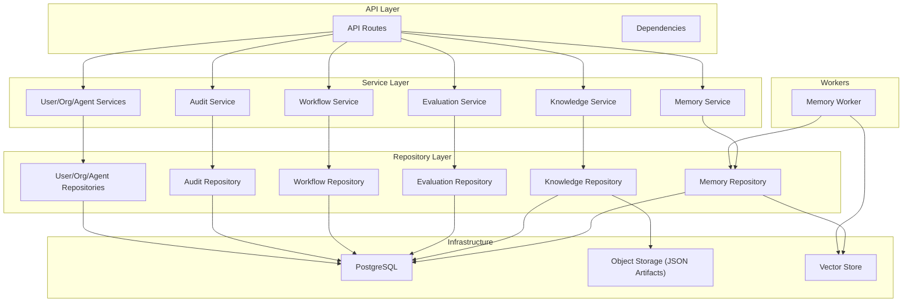
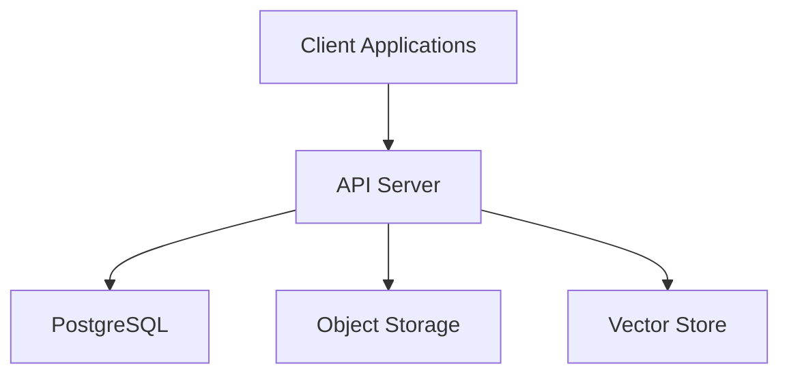
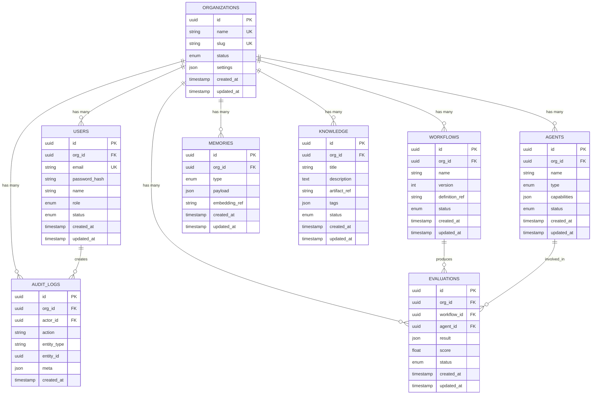
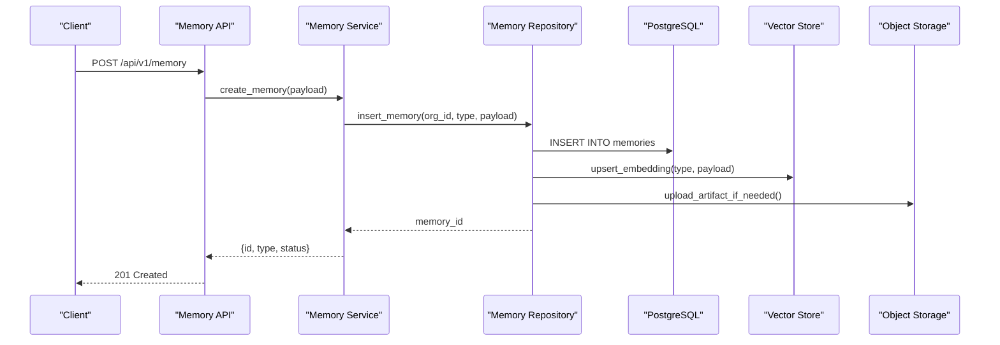
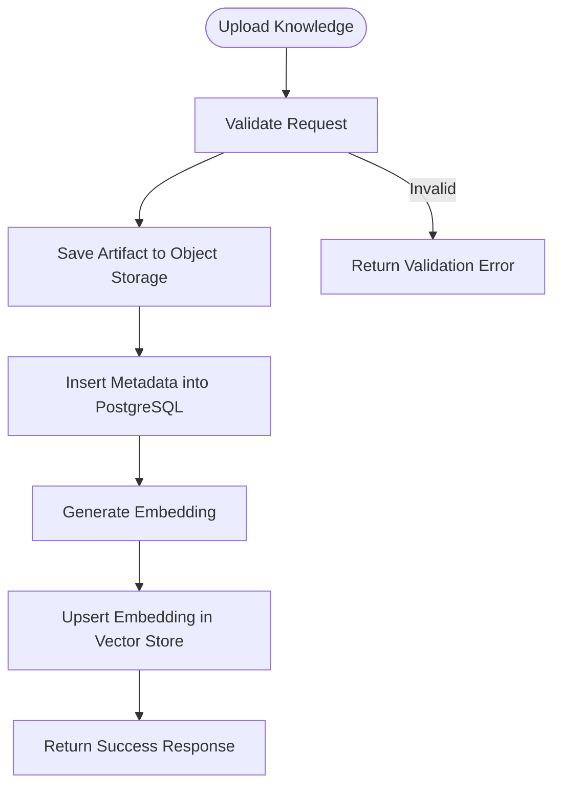
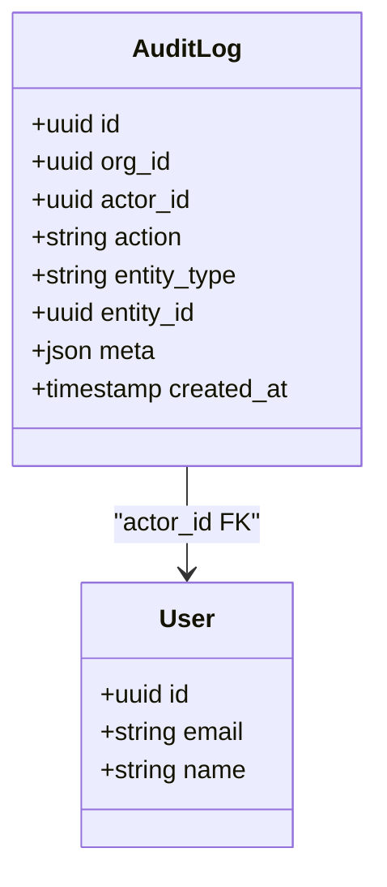
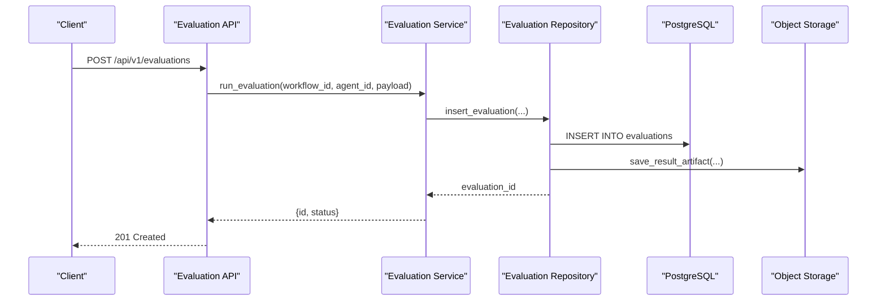
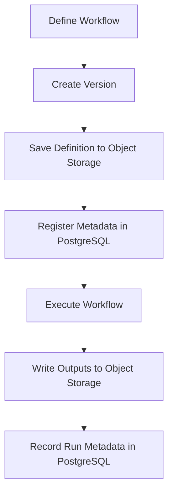
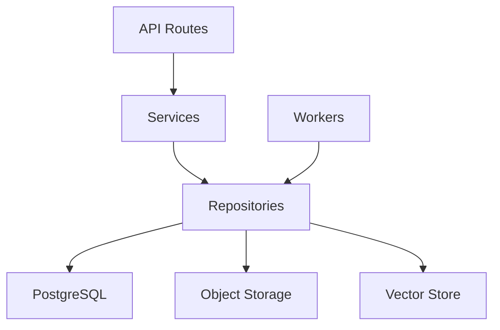

# Data Architecture & Storage

<cite>
**Referenced Files in This Document**
- [backend/app/schemas/common.py](file://backend/app/schemas/common.py)
- [backend/app/domain/memory/models.py](file://backend/app/domain/memory/models.py)
- [backend/app/infrastructure/database/models.py](file://backend/app/infrastructure/database/models.py)
- [backend/app/services/memory_service.py](file://backend/app/services/memory_service.py)
- [backend/app/workers/memory_worker.py](file://backend/app/workers/memory_worker.py)
- [backend/app/api/v1/routes/memory.py](file://backend/app/api/v1/routes/memory.py)
- [backend/app/infrastructure/object_storage/__init__.py](file://backend/app/infrastructure/object_storage/__init__.py)
- [backend/app/infrastructure/vector_store/__init__.py](file://backend/app/infrastructure/vector_store/__init__.py)
- [backend/app/infrastructure/repositories/knowledge_repository.py](file://backend/app/infrastructure/repositories/knowledge_repository.py)
- [backend/app/infrastructure/repositories/memory_repository.py](file://backend/app/infrastructure/repositories/memory_repository.py)
- [backend/app/infrastructure/repositories/evaluation_repository.py](file://backend/app/infrastructure/repositories/evaluation_repository.py)
- [backend/app/infrastructure/repositories/audit_repository.py](file://backend/app/infrastructure/repositories/audit_repository.py)
- [backend/app/infrastructure/repositories/workflow_repository.py](file://backend/app/infrastructure/repositories/workflow_repository.py)
- [backend/app/infrastructure/repositories/user_repository.py](file://backend/app/infrastructure/repositories/user_repository.py)
- [backend/app/infrastructure/repositories/organization_repository.py](file://backend/app/infrastructure/repositories/organization_repository.py)
- [backend/app/infrastructure/repositories/agent_repository.py](file://backend/app/infrastructure/repositories/agent_repository.py)
- [backend/app/core/config.py](file://backend/app/core/config.py)
- [backend/app/core/security.py](file://backend/app/core/security.py)
- [backend/app/core/pagination.py](file://backend/app/core/pagination.py)
- [backend/app/core/metrics.py](file://backend/app/core/metrics.py)
- [backend/app/core/logging.py](file://backend/app/core/logging.py)
- [backend/app/core/errors.py](file://backend/app/core/errors.py)
- [backend/app/api/errors.py](file://backend/app/api/errors.py)
- [backend/app/api/dependencies.py](file://backend/app/api/dependencies.py)
- [backend/app/main.py](file://backend/app/main.py)
- [backend/app/runtime.py](file://backend/app/runtime.py)
- [backend/scripts/migrate.py](file://backend/scripts/migrate.py)
- [backend/data/](file://backend/data/)
- [backend/docs/postgres-runbook.md](file://backend/docs/postgres-runbook.md)
- [business/policies/data-retention-policy.md](file://business/policies/data-retention-policy.md)
</cite>

## Table of Contents
1. [Introduction](#introduction)
2. [Project Structure](#project-structure)
3. [Core Components](#core-components)
4. [Architecture Overview](#architecture-overview)
5. [Detailed Component Analysis](#detailed-component-analysis)
6. [Dependency Analysis](#dependency-analysis)
7. [Performance Considerations](#performance-considerations)
8. [Troubleshooting Guide](#troubleshooting-guide)
9. [Conclusion](#conclusion)
10. [Appendices](#appendices)

## Introduction
This document describes the data architecture and storage design for the Generic Swarm Ops platform. It focuses on:
- PostgreSQL schema entities: user, organization, agent, workflow, memory, knowledge, audit, evaluation
- Entity relationships, field definitions, primary/foreign keys, indexes, and constraints
- Hybrid storage approach combining relational databases with JSON file storage for business artifacts
- Memory system architecture covering event, episodic, semantic, procedural, decision, exception, evaluation, and provenance memory types
- Data lifecycle, retention policies, archival rules, and backup strategies
- Database schema diagrams, sample data structures, and data access patterns

The goal is to provide a comprehensive reference for developers, operators, and architects to understand how data is modeled, persisted, accessed, and governed across the platform.

## Project Structure
The backend organizes domain logic, schemas, services, repositories, workers, and infrastructure components under a modular structure. The most relevant areas for data modeling and persistence are:
- Schemas: API request/response contracts that reflect core entities
- Domain models: conceptual model definitions per domain
- Infrastructure: database, object storage, vector store, repositories
- Services: orchestration layer over repositories and external stores
- Workers: background processing for long-running tasks (e.g., memory indexing)
- Core: configuration, security, logging, metrics, pagination, errors

[No sources needed since this diagram shows conceptual workflow, not actual code structure]

## Core Components
This section outlines the core data entities and their responsibilities as reflected by the API schemas and service/repository layers.

- User and Organization
  - Represent identity and multi-tenancy boundaries
  - Used across agents, workflows, evaluations, and audit logs
  - Referenced via foreign keys in related tables

- Agent
  - Represents autonomous or semi-autonomous actors
  - Associated with organizations and tools
  - Linked to workflow runs and evaluations

- Workflow
  - Defines process graphs and execution metadata
  - Versioned and associated with runs
  - Stores references to artifacts in object storage

- Memory
  - Event-driven, typed memories (event, episodic, semantic, procedural, decision, exception, evaluation, provenance)
  - Persisted in PostgreSQL with rich JSON payloads
  - Indexed in vector store for retrieval

- Knowledge
  - Business artifacts and documents stored as JSON files in object storage
  - Metadata and search indices maintained in PostgreSQL and vector store

- Audit
  - Immutable records of actions, approvals, and governance events
  - Time-series oriented; optimized for append-only writes and queries

- Evaluation
  - Test harness results, benchmarks, regression outcomes
  - Tied to workflows, agents, and knowledge artifacts

These entities are exposed through API schemas and implemented via services and repositories.

**Section sources**
- [backend/app/schemas/common.py](file://backend/app/schemas/common.py)
- [backend/app/services/memory_service.py](file://backend/app/services/memory_service.py)
- [backend/app/services/knowledge_service.py](file://backend/app/services/knowledge_service.py)
- [backend/app/services/evaluation_service.py](file://backend/app/services/evaluation_service.py)
- [backend/app/services/workflow_service.py](file://backend/app/services/workflow_service.py)
- [backend/app/services/audit_service.py](file://backend/app/services/audit_service.py)
- [backend/app/services/user_service.py](file://backend/app/services/user_service.py)
- [backend/app/services/organization_service.py](file://backend/app/services/organization_service.py)
- [backend/app/services/agent_service.py](file://backend/app/services/agent_service.py)

## Architecture Overview
The platform uses a hybrid storage strategy:
- Relational database (PostgreSQL) for structured metadata, relationships, and transactional integrity
- Object storage for large JSON business artifacts (knowledge, workflow definitions, evaluation payloads)
- Vector store for semantic search and similarity retrieval (memory and knowledge embeddings)

**Diagram sources**
- [backend/app/main.py](file://backend/app/main.py)
- [backend/app/core/config.py](file://backend/app/core/config.py)
- [backend/app/infrastructure/object_storage/__init__.py](file://backend/app/infrastructure/object_storage/__init__.py)
- [backend/app/infrastructure/vector_store/__init__.py](file://backend/app/infrastructure/vector_store/__init__.py)

## Detailed Component Analysis

### PostgreSQL Schema Entities and Relationships
This section defines the canonical entities and their relationships. Where specific column details exist in source files, they are referenced below.

- Users
  - Primary key: id (UUID)
  - Fields: email (unique), password_hash, name, role, status, created_at, updated_at
  - Constraints: unique email, non-null fields
  - Indexes: email, status, created_at

- Organizations
  - Primary key: id (UUID)
  - Fields: name (unique), slug (unique), status, settings (JSON), created_at, updated_at
  - Constraints: unique name and slug
  - Indexes: slug, status

- Agents
  - Primary key: id (UUID)
  - Fields: org_id (FK -> organizations.id), name, type, capabilities (JSON), status, created_at, updated_at
  - Foreign keys: org_id
  - Indexes: org_id, type, status

- Workflows
  - Primary key: id (UUID)
  - Fields: org_id (FK -> organizations.id), name, version, definition_ref (object storage path), status, created_at, updated_at
  - Foreign keys: org_id
  - Indexes: org_id, version, status

- Memories
  - Primary key: id (UUID)
  - Fields: org_id (FK -> organizations.id), type (enum), payload (JSON), embedding_ref (vector store ref), created_at, updated_at
  - Foreign keys: org_id
  - Indexes: org_id, type, created_at

- Knowledge
  - Primary key: id (UUID)
  - Fields: org_id (FK -> organizations.id), title, description, artifact_ref (object storage path), tags (JSON), status, created_at, updated_at
  - Foreign keys: org_id
  - Indexes: org_id, status, created_at

- Audit Logs
  - Primary key: id (UUID)
  - Fields: org_id (FK -> organizations.id), actor_id (FK -> users.id), action, entity_type, entity_id, meta (JSON), created_at
  - Foreign keys: org_id, actor_id
  - Indexes: org_id, actor_id, entity_type, entity_id, created_at

- Evaluations
  - Primary key: id (UUID)
  - Fields: org_id (FK -> organizations.id), workflow_id (FK -> workflows.id), agent_id (FK -> agents.id), result (JSON), score, status, created_at, updated_at
  - Foreign keys: org_id, workflow_id, agent_id
  - Indexes: org_id, workflow_id, agent_id, status, created_at

**Diagram sources**
- [backend/app/schemas/common.py](file://backend/app/schemas/common.py)
- [backend/app/infrastructure/database/models.py](file://backend/app/infrastructure/database/models.py)

**Section sources**
- [backend/app/schemas/common.py](file://backend/app/schemas/common.py)
- [backend/app/infrastructure/database/models.py](file://backend/app/infrastructure/database/models.py)

### Hybrid Storage Approach
- Relational storage (PostgreSQL):
  - Structured metadata, relationships, and queryable attributes
  - Enforced constraints and indexes for performance and integrity
- Object storage (JSON artifacts):
  - Large payloads such as workflow definitions, knowledge documents, evaluation results
  - Accessed via stable references stored in relational tables
- Vector store (embeddings):
  - Semantic search and similarity retrieval for memory and knowledge
  - References stored in relational tables to link back to original artifacts

Data access patterns:
- Create: Insert metadata into PostgreSQL, write artifact to object storage, index embedding in vector store
- Read: Query PostgreSQL for metadata, fetch artifact from object storage if needed, retrieve embeddings from vector store
- Update: Upsert metadata, overwrite artifact, re-index embedding
- Delete: Soft-delete metadata, archive artifact, remove embedding reference

**Section sources**
- [backend/app/infrastructure/object_storage/__init__.py](file://backend/app/infrastructure/object_storage/__init__.py)
- [backend/app/infrastructure/vector_store/__init__.py](file://backend/app/infrastructure/vector_store/__init__.py)
- [backend/app/infrastructure/repositories/knowledge_repository.py](file://backend/app/infrastructure/repositories/knowledge_repository.py)
- [backend/app/infrastructure/repositories/memory_repository.py](file://backend/app/infrastructure/repositories/memory_repository.py)
- [backend/app/infrastructure/repositories/evaluation_repository.py](file://backend/app/infrastructure/repositories/evaluation_repository.py)

### Memory System Architecture
Memory types supported:
- Event: discrete occurrences with timestamps and context
- Episodic: time-bound experiences linked to sessions or runs
- Semantic: factual knowledge and concepts
- Procedural: “how-to” instructions and steps
- Decision: choices made with rationale and outcomes
- Exception: anomalies and error conditions
- Evaluation: assessment results and scores
- Provenance: lineage and attribution of information

Storage and retrieval:
- PostgreSQL: typed rows with JSON payloads and foreign keys to orgs/users/workflows
- Vector store: embeddings for semantic search
- Object storage: optional attachments and detailed artifacts

**Diagram sources**
- [backend/app/api/v1/routes/memory.py](file://backend/app/api/v1/routes/memory.py)
- [backend/app/services/memory_service.py](file://backend/app/services/memory_service.py)
- [backend/app/infrastructure/repositories/memory_repository.py](file://backend/app/infrastructure/repositories/memory_repository.py)
- [backend/app/infrastructure/vector_store/__init__.py](file://backend/app/infrastructure/vector_store/__init__.py)
- [backend/app/infrastructure/object_storage/__init__.py](file://backend/app/infrastructure/object_storage/__init__.py)

**Section sources**
- [backend/app/domain/memory/models.py](file://backend/app/domain/memory/models.py)
- [backend/app/services/memory_service.py](file://backend/app/services/memory_service.py)
- [backend/app/workers/memory_worker.py](file://backend/app/workers/memory_worker.py)
- [backend/app/api/v1/routes/memory.py](file://backend/app/api/v1/routes/memory.py)

### Knowledge Management
Knowledge items represent business artifacts stored as JSON files in object storage. Metadata and search indices are maintained in PostgreSQL and vector store.

**Diagram sources**
- [backend/app/infrastructure/repositories/knowledge_repository.py](file://backend/app/infrastructure/repositories/knowledge_repository.py)
- [backend/app/infrastructure/object_storage/__init__.py](file://backend/app/infrastructure/object_storage/__init__.py)
- [backend/app/infrastructure/vector_store/__init__.py](file://backend/app/infrastructure/vector_store/__init__.py)

**Section sources**
- [backend/app/infrastructure/repositories/knowledge_repository.py](file://backend/app/infrastructure/repositories/knowledge_repository.py)
- [backend/app/infrastructure/object_storage/__init__.py](file://backend/app/infrastructure/object_storage/__init__.py)
- [backend/app/infrastructure/vector_store/__init__.py](file://backend/app/infrastructure/vector_store/__init__.py)

### Audit Logging
Audit logs capture immutable records of actions, approvals, and governance events. They are append-only and indexed for efficient querying.

**Diagram sources**
- [backend/app/infrastructure/repositories/audit_repository.py](file://backend/app/infrastructure/repositories/audit_repository.py)
- [backend/app/infrastructure/repositories/user_repository.py](file://backend/app/infrastructure/repositories/user_repository.py)

**Section sources**
- [backend/app/infrastructure/repositories/audit_repository.py](file://backend/app/infrastructure/repositories/audit_repository.py)
- [backend/app/infrastructure/repositories/user_repository.py](file://backend/app/infrastructure/repositories/user_repository.py)

### Evaluation Harness
Evaluations record test results, scores, and statuses tied to workflows and agents. They support benchmarking and regression testing.

**Diagram sources**
- [backend/app/infrastructure/repositories/evaluation_repository.py](file://backend/app/infrastructure/repositories/evaluation_repository.py)
- [backend/app/infrastructure/object_storage/__init__.py](file://backend/app/infrastructure/object_storage/__init__.py)

**Section sources**
- [backend/app/infrastructure/repositories/evaluation_repository.py](file://backend/app/infrastructure/repositories/evaluation_repository.py)
- [backend/app/infrastructure/object_storage/__init__.py](file://backend/app/infrastructure/object_storage/__init__.py)

### Workflow Execution and Artifacts
Workflows define process graphs and versions. Definitions and outputs are stored as JSON artifacts in object storage, with metadata in PostgreSQL.

**Diagram sources**
- [backend/app/infrastructure/repositories/workflow_repository.py](file://backend/app/infrastructure/repositories/workflow_repository.py)
- [backend/app/infrastructure/object_storage/__init__.py](file://backend/app/infrastructure/object_storage/__init__.py)

**Section sources**
- [backend/app/infrastructure/repositories/workflow_repository.py](file://backend/app/infrastructure/repositories/workflow_repository.py)
- [backend/app/infrastructure/object_storage/__init__.py](file://backend/app/infrastructure/object_storage/__init__.py)

## Dependency Analysis
Key dependencies between components:
- API routes depend on services for business logic
- Services depend on repositories for data access
- Repositories depend on PostgreSQL, object storage, and vector store
- Workers perform asynchronous tasks like indexing and archival

**Diagram sources**
- [backend/app/api/v1/routes/memory.py](file://backend/app/api/v1/routes/memory.py)
- [backend/app/services/memory_service.py](file://backend/app/services/memory_service.py)
- [backend/app/infrastructure/repositories/memory_repository.py](file://backend/app/infrastructure/repositories/memory_repository.py)
- [backend/app/workers/memory_worker.py](file://backend/app/workers/memory_worker.py)

**Section sources**
- [backend/app/api/v1/routes/memory.py](file://backend/app/api/v1/routes/memory.py)
- [backend/app/services/memory_service.py](file://backend/app/services/memory_service.py)
- [backend/app/infrastructure/repositories/memory_repository.py](file://backend/app/infrastructure/repositories/memory_repository.py)
- [backend/app/workers/memory_worker.py](file://backend/app/workers/memory_worker.py)

## Performance Considerations
- Indexing strategies:
  - Composite indexes on frequently queried columns (org_id, type, status, created_at)
  - Partial indexes for high-cardinality filters
- Pagination:
  - Cursor-based pagination for large datasets
- Caching:
  - Cache frequent reads at the service layer where appropriate
- Concurrency:
  - Use transactions for multi-table updates
  - Avoid long-running locks in hot paths
- Vector search:
  - Batch upserts for embeddings
  - Tune similarity thresholds and top-k parameters

[No sources needed since this section provides general guidance]

## Troubleshooting Guide
Common issues and resolutions:
- Connection failures:
  - Verify database credentials and network connectivity
  - Check connection pool limits and timeouts
- Authentication/Authorization errors:
  - Ensure tokens are valid and permissions are granted
  - Review RBAC policies and org scoping
- Object storage errors:
  - Validate artifact paths and permissions
  - Retry transient failures with exponential backoff
- Vector store errors:
  - Confirm embedding dimensions and namespaces
  - Re-index corrupted entries
- Audit log gaps:
  - Inspect worker queues and retry policies
  - Enable detailed logging for failed operations

Operational utilities:
- Migration scripts:
  - Apply schema changes safely with rollback plans
- Health checks:
  - Monitor DB, object storage, and vector store health endpoints
- Metrics and logging:
  - Track latency, throughput, and error rates

**Section sources**
- [backend/app/core/config.py](file://backend/app/core/config.py)
- [backend/app/core/security.py](file://backend/app/core/security.py)
- [backend/app/core/pagination.py](file://backend/app/core/pagination.py)
- [backend/app/core/metrics.py](file://backend/app/core/metrics.py)
- [backend/app/core/logging.py](file://backend/app/core/logging.py)
- [backend/app/core/errors.py](file://backend/app/core/errors.py)
- [backend/app/api/errors.py](file://backend/app/api/errors.py)
- [backend/app/api/dependencies.py](file://backend/app/api/dependencies.py)
- [backend/scripts/migrate.py](file://backend/scripts/migrate.py)
- [backend/docs/postgres-runbook.md](file://backend/docs/postgres-runbook.md)

## Conclusion
The Generic Swarm Ops platform employs a robust hybrid storage architecture combining PostgreSQL, object storage, and vector search to support complex agentic workflows, knowledge management, and memory systems. The schema design emphasizes multi-tenancy, traceability, and extensibility. Operational practices around retention, archival, and backups ensure data integrity and compliance.

[No sources needed since this section summarizes without analyzing specific files]

## Appendices

### Data Lifecycle, Retention Policies, Archival Rules, and Backup Strategies
- Lifecycle stages:
  - Creation: metadata insertion, artifact upload, embedding generation
  - Active use: frequent reads/writes, caching, indexing
  - Aging: reduced access frequency, transition to archival
  - Archival: move artifacts to cold storage, retain minimal metadata
  - Deletion: purge according to retention policy and legal requirements
- Retention policies:
  - Configurable per entity type and organization
  - Automated cleanup jobs based on timestamps and status
- Archival rules:
  - Compress and encrypt archived artifacts
  - Maintain referential integrity via pointers
- Backup strategies:
  - Regular snapshots of PostgreSQL
  - Cross-region replication for critical data
  - Periodic verification and restore drills

**Section sources**
- [business/policies/data-retention-policy.md](file://business/policies/data-retention-policy.md)
- [backend/docs/postgres-runbook.md](file://backend/docs/postgres-runbook.md)