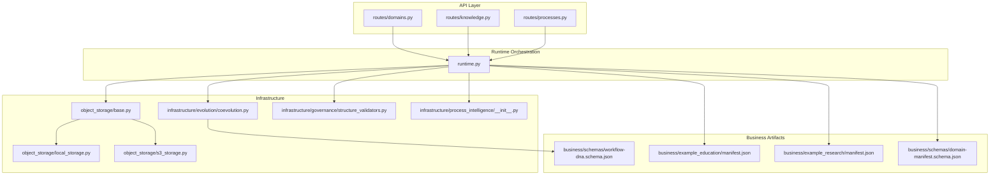
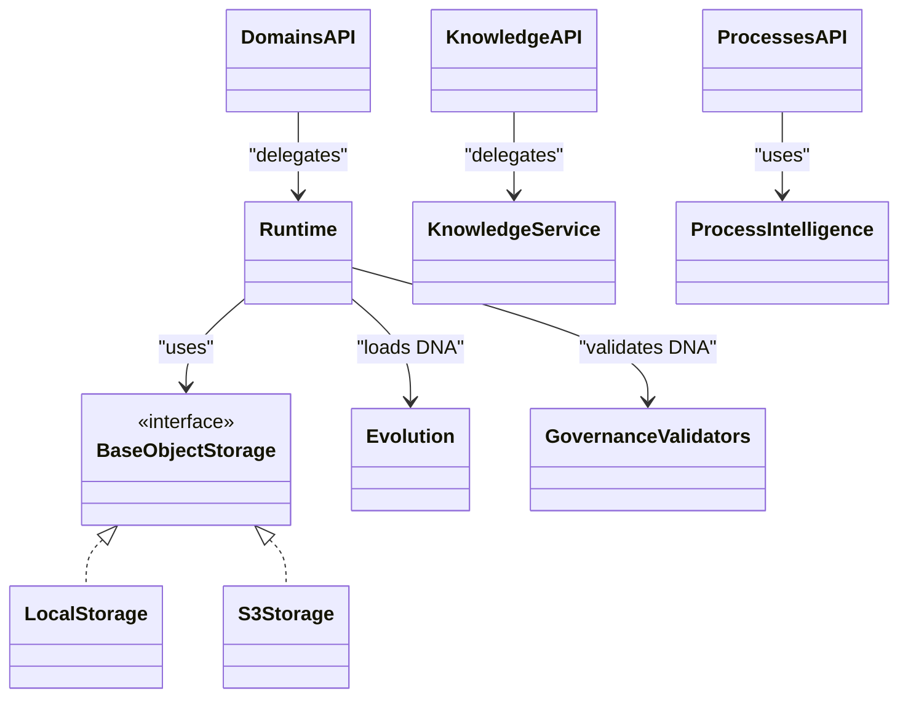
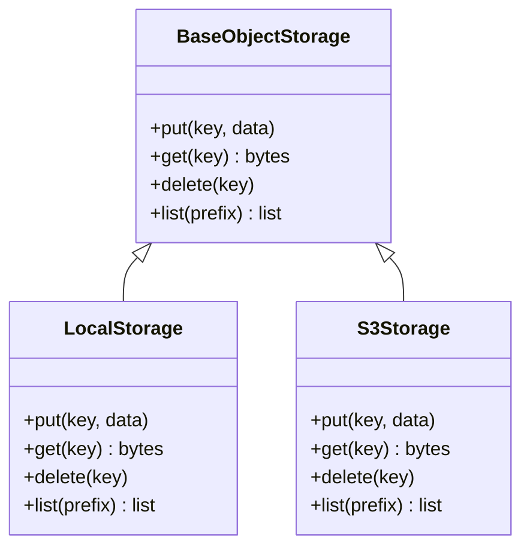
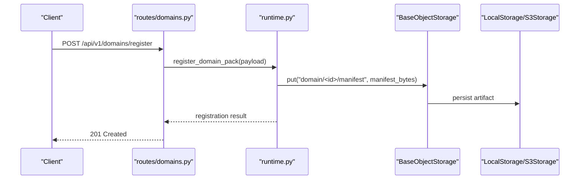
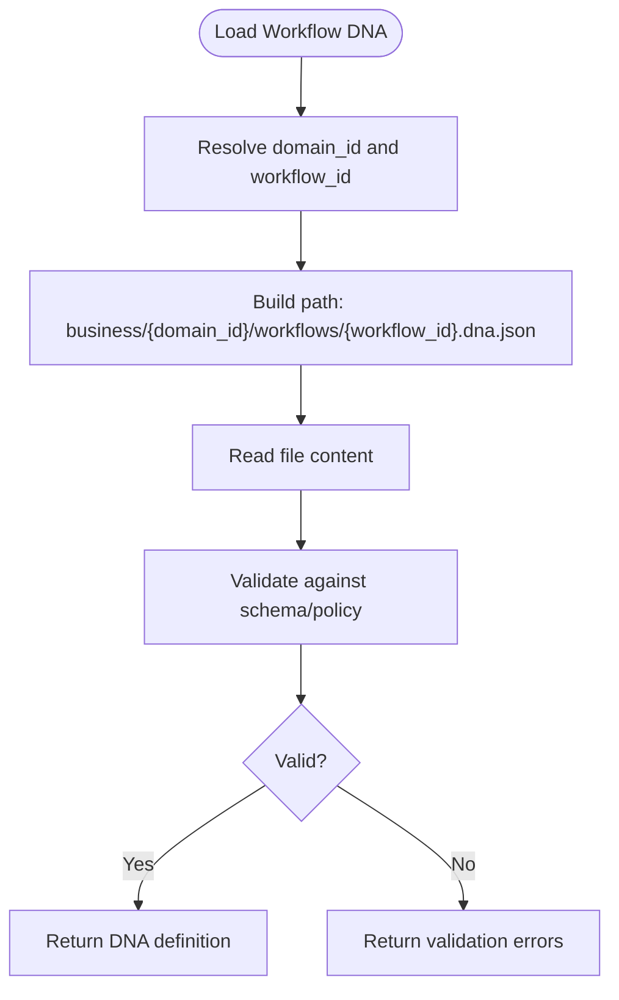
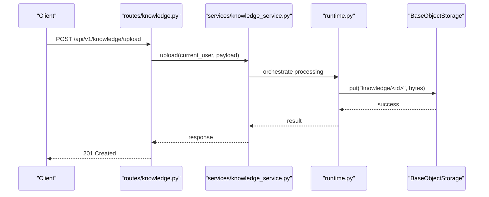
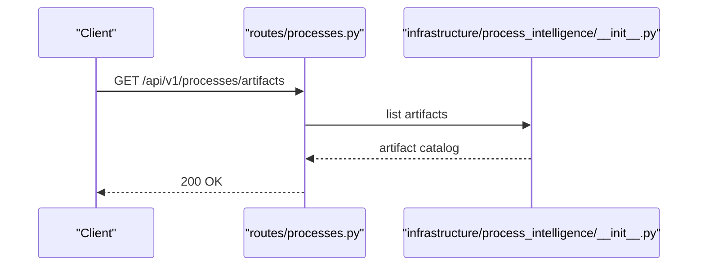
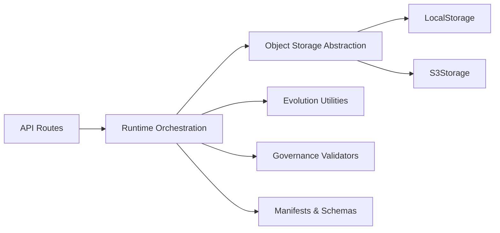
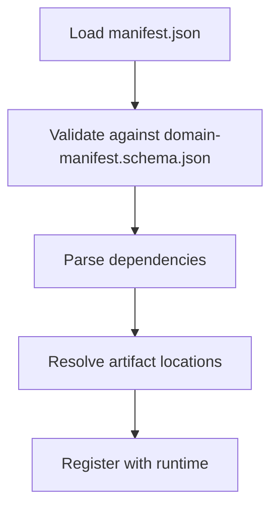

# File & Artifact Storage

<cite>
**Referenced Files in This Document**
- [base.py](file://backend/app/infrastructure/object_storage/base.py)
- [local_storage.py](file://backend/app/infrastructure/object_storage/local_storage.py)
- [s3_storage.py](file://backend/app/infrastructure/object_storage/s3_storage.py)
- [domains.py](file://backend/app/api/v1/routes/domains.py)
- [runtime.py](file://backend/app/runtime.py)
- [coevolution.py](file://backend/app/infrastructure/evolution/coevolution.py)
- [structure_validators.py](file://backend/app/infrastructure/governance/structure_validators.py)
- [knowledge.py](file://backend/app/api/v1/routes/knowledge.py)
- [knowledge_service.py](file://backend/app/services/knowledge_service.py)
- [processes.py](file://backend/app/api/v1/routes/processes.py)
- [__init__.py](file://backend/app/infrastructure/process_intelligence/__init__.py)
- [archetype_selector.py](file://backend/app/domain/workflows/archetype_selector.py)
- [manifest.json](file://business/example_education/manifest.json)
- [manifest.json](file://business/example_research/manifest.json)
- [workflow-dna.schema.json](file://business/schemas/workflow-dna.schema.json)
- [domain-manifest.schema.json](file://business/schemas/domain-manifest.schema.json)
</cite>

## Table of Contents
1. [Introduction](#introduction)
2. [Project Structure](#project-structure)
3. [Core Components](#core-components)
4. [Architecture Overview](#architecture-overview)
5. [Detailed Component Analysis](#detailed-component-analysis)
6. [Dependency Analysis](#dependency-analysis)
7. [Performance Considerations](#performance-considerations)
8. [Security Controls and Access Policies](#security-controls-and-access-policies)
9. [File Lifecycle Management and Cleanup](#file-lifecycle-management-and-cleanup)
10. [Disaster Recovery Strategies](#disaster-recovery-strategies)
11. [Manifest System for Discovery and Dependencies](#manifest-system-for-discovery-and-dependencies)
12. [Troubleshooting Guide](#troubleshooting-guide)
13. [Conclusion](#conclusion)

## Introduction
This document explains the file and artifact storage system, focusing on:
- Object storage abstraction layer supporting local filesystem and S3-compatible backends
- Business artifact storage for domain packs, workflow DNA files, evaluation datasets, and governance documents
- Upload/download flows, metadata management, and version control integration
- Configuration options, security controls, and access policies
- Lifecycle management, cleanup procedures, and disaster recovery
- Manifest system for artifact discovery and dependency management

The repository provides a clear separation between API routes, runtime orchestration, infrastructure abstractions, and business artifacts. The object storage layer is intentionally abstracted to allow pluggable backends (local filesystem or S3).

## Project Structure
Key areas related to file and artifact storage:
- Object storage abstraction: backend/app/infrastructure/object_storage
- Domain pack registration/listing APIs: backend/app/api/v1/routes/domains.py
- Runtime orchestration for domain packs and knowledge uploads: backend/app/runtime.py
- Workflow DNA loading and validation: backend/app/infrastructure/evolution/coevolution.py, backend/app/infrastructure/governance/structure_validators.py
- Knowledge upload endpoints and service: backend/app/api/v1/routes/knowledge.py, backend/app/services/knowledge_service.py
- Process intelligence artifacts: backend/app/api/v1/routes/processes.py, backend/app/infrastructure/process_intelligence/__init__.py
- Example manifests and schemas: business/example_*/manifest.json, business/schemas/*.json

**Diagram sources**
- [domains.py:1-20](file://backend/app/api/v1/routes/domains.py#L1-L20)
- [runtime.py:3738-3876](file://backend/app/runtime.py#L3738-L3876)
- [base.py:1-3](file://backend/app/infrastructure/object_storage/base.py#L1-L3)
- [local_storage.py:1-6](file://backend/app/infrastructure/object_storage/local_storage.py#L1-L6)
- [s3_storage.py:1-6](file://backend/app/infrastructure/object_storage/s3_storage.py#L1-L6)
- [coevolution.py:134-140](file://backend/app/infrastructure/evolution/coevolution.py#L134-L140)
- [structure_validators.py:7-56](file://backend/app/infrastructure/governance/structure_validators.py#L7-L56)
- [processes.py:33-35](file://backend/app/api/v1/routes/processes.py#L33-L35)
- [__init__.py:1-9](file://backend/app/infrastructure/process_intelligence/__init__.py#L1-L9)
- [manifest.json](file://business/example_education/manifest.json)
- [manifest.json](file://business/example_research/manifest.json)
- [workflow-dna.schema.json](file://business/schemas/workflow-dna.schema.json)
- [domain-manifest.schema.json](file://business/schemas/domain-manifest.schema.json)

**Section sources**
- [domains.py:1-20](file://backend/app/api/v1/routes/domains.py#L1-L20)
- [runtime.py:3738-3876](file://backend/app/runtime.py#L3738-L3876)
- [base.py:1-3](file://backend/app/infrastructure/object_storage/base.py#L1-L3)
- [local_storage.py:1-6](file://backend/app/infrastructure/object_storage/local_storage.py#L1-L6)
- [s3_storage.py:1-6](file://backend/app/infrastructure/object_storage/s3_storage.py#L1-L6)
- [coevolution.py:134-140](file://backend/app/infrastructure/evolution/coevolution.py#L134-L140)
- [structure_validators.py:7-56](file://backend/app/infrastructure/governance/structure_validators.py#L7-L56)
- [knowledge.py:31-36](file://backend/app/api/v1/routes/knowledge.py#L31-L36)
- [knowledge_service.py:16-16](file://backend/app/services/knowledge_service.py#L16-L16)
- [processes.py:33-35](file://backend/app/api/v1/routes/processes.py#L33-L35)
- [__init__.py:1-9](file://backend/app/infrastructure/process_intelligence/__init__.py#L1-L9)
- [archetype_selector.py:203-241](file://backend/app/domain/workflows/archetype_selector.py#L203-L241)
- [manifest.json](file://business/example_education/manifest.json)
- [manifest.json](file://business/example_research/manifest.json)
- [workflow-dna.schema.json](file://business/schemas/workflow-dna.schema.json)
- [domain-manifest.schema.json](file://business/schemas/domain-manifest.schema.json)

## Core Components
- Object storage abstraction:
  - BaseObjectStorage defines the interface contract for storage backends.
  - LocalStorage implements filesystem-based storage.
  - S3Storage implements S3-compatible object storage.
- Domain pack management:
  - API routes expose listing and registration of domain packs.
  - Runtime orchestrates registration and listing operations.
- Workflow DNA handling:
  - Coevolution utilities load workflow DNA files from domain packs.
  - Governance validators enforce production-grade constraints on DNA definitions.
- Knowledge uploads:
  - API routes accept knowledge uploads; services coordinate processing.
- Process intelligence artifacts:
  - Endpoints list generated artifacts; module exposes builders/writers.

**Section sources**
- [base.py:1-3](file://backend/app/infrastructure/object_storage/base.py#L1-L3)
- [local_storage.py:1-6](file://backend/app/infrastructure/object_storage/local_storage.py#L1-L6)
- [s3_storage.py:1-6](file://backend/app/infrastructure/object_storage/s3_storage.py#L1-L6)
- [domains.py:1-20](file://backend/app/api/v1/routes/domains.py#L1-L20)
- [runtime.py:3738-3876](file://backend/app/runtime.py#L3738-L3876)
- [coevolution.py:134-140](file://backend/app/infrastructure/evolution/coevolution.py#L134-L140)
- [structure_validators.py:7-56](file://backend/app/infrastructure/governance/structure_validators.py#L7-L56)
- [knowledge.py:31-36](file://backend/app/api/v1/routes/knowledge.py#L31-L36)
- [knowledge_service.py:16-16](file://backend/app/services/knowledge_service.py#L16-L16)
- [processes.py:33-35](file://backend/app/api/v1/routes/processes.py#L33-L35)
- [__init__.py:1-9](file://backend/app/infrastructure/process_intelligence/__init__.py#L1-L9)

## Architecture Overview
The storage architecture separates concerns across layers:
- API layer receives requests for domain packs, knowledge uploads, and process intelligence artifacts.
- Runtime coordinates business logic and delegates to infrastructure components.
- Infrastructure includes object storage abstraction with concrete implementations for local filesystem and S3-compatible storage.
- Business artifacts are organized under the business directory with manifests and schemas defining structure and dependencies.

**Diagram sources**
- [base.py:1-3](file://backend/app/infrastructure/object_storage/base.py#L1-L3)
- [local_storage.py:1-6](file://backend/app/infrastructure/object_storage/local_storage.py#L1-L6)
- [s3_storage.py:1-6](file://backend/app/infrastructure/object_storage/s3_storage.py#L1-L6)
- [domains.py:1-20](file://backend/app/api/v1/routes/domains.py#L1-L20)
- [runtime.py:3738-3876](file://backend/app/runtime.py#L3738-L3876)
- [coevolution.py:134-140](file://backend/app/infrastructure/evolution/coevolution.py#L134-L140)
- [structure_validators.py:7-56](file://backend/app/infrastructure/governance/structure_validators.py#L7-L56)
- [knowledge.py:31-36](file://backend/app/api/v1/routes/knowledge.py#L31-L36)
- [knowledge_service.py:16-16](file://backend/app/services/knowledge_service.py#L16-L16)
- [processes.py:33-35](file://backend/app/api/v1/routes/processes.py#L33-L35)
- [__init__.py:1-9](file://backend/app/infrastructure/process_intelligence/__init__.py#L1-L9)

## Detailed Component Analysis

### Object Storage Abstraction Layer
- Purpose: Provide a unified interface for storing and retrieving binary artifacts regardless of underlying storage medium.
- Backends:
  - LocalStorage: stores objects on the local filesystem.
  - S3Storage: stores objects using an S3-compatible service.
- Interface:
  - BaseObjectStorage defines the common methods that all backends must implement (e.g., put, get, delete, list).
- Integration:
  - Runtime selects the appropriate backend based on configuration and uses it for artifact persistence.

**Diagram sources**
- [base.py:1-3](file://backend/app/infrastructure/object_storage/base.py#L1-L3)
- [local_storage.py:1-6](file://backend/app/infrastructure/object_storage/local_storage.py#L1-L6)
- [s3_storage.py:1-6](file://backend/app/infrastructure/object_storage/s3_storage.py#L1-L6)

**Section sources**
- [base.py:1-3](file://backend/app/infrastructure/object_storage/base.py#L1-L3)
- [local_storage.py:1-6](file://backend/app/infrastructure/object_storage/local_storage.py#L1-L6)
- [s3_storage.py:1-6](file://backend/app/infrastructure/object_storage/s3_storage.py#L1-L6)

### Domain Packs Storage and Registration
- API endpoints:
  - List domain packs
  - Register a domain pack (with manifest or manifest path)
- Runtime responsibilities:
  - register_domain_pack: persists domain pack artifacts and metadata
  - list_domain_packs: enumerates available domain packs
- Storage considerations:
  - Domain packs may include multiple files (workflows, agents, evals, governance docs)
  - Manifests define structure and dependencies; schemas validate correctness

**Diagram sources**
- [domains.py:14-18](file://backend/app/api/v1/routes/domains.py#L14-L18)
- [runtime.py:3738-3876](file://backend/app/runtime.py#L3738-L3876)
- [base.py:1-3](file://backend/app/infrastructure/object_storage/base.py#L1-L3)
- [local_storage.py:1-6](file://backend/app/infrastructure/object_storage/local_storage.py#L1-L6)
- [s3_storage.py:1-6](file://backend/app/infrastructure/object_storage/s3_storage.py#L1-L6)

**Section sources**
- [domains.py:1-20](file://backend/app/api/v1/routes/domains.py#L1-L20)
- [runtime.py:3738-3876](file://backend/app/runtime.py#L3738-L3876)

### Workflow DNA Files
- Loading:
  - Coevolution utility loads workflow DNA files by domain and workflow identifiers.
- Validation:
  - Governance validators enforce production requirements for workflow DNA structures.
- Usage:
  - Archetype selector references specific DNA paths within domain packs.

**Diagram sources**
- [coevolution.py:134-140](file://backend/app/infrastructure/evolution/coevolution.py#L134-L140)
- [structure_validators.py:7-56](file://backend/app/infrastructure/governance/structure_validators.py#L7-L56)
- [archetype_selector.py:203-241](file://backend/app/domain/workflows/archetype_selector.py#L203-L241)

**Section sources**
- [coevolution.py:134-140](file://backend/app/infrastructure/evolution/coevolution.py#L134-L140)
- [structure_validators.py:7-56](file://backend/app/infrastructure/governance/structure_validators.py#L7-L56)
- [archetype_selector.py:203-241](file://backend/app/domain/workflows/archetype_selector.py#L203-L241)

### Knowledge Uploads
- API endpoints:
  - upload_knowledge_route
  - upload_knowledge_document_route
- Service coordination:
  - knowledge_service.upload handles payload processing and persistence.

**Diagram sources**
- [knowledge.py:31-36](file://backend/app/api/v1/routes/knowledge.py#L31-L36)
- [knowledge_service.py:16-16](file://backend/app/services/knowledge_service.py#L16-L16)
- [runtime.py:2462-2462](file://backend/app/runtime.py#L2462-L2462)
- [base.py:1-3](file://backend/app/infrastructure/object_storage/base.py#L1-L3)

**Section sources**
- [knowledge.py:31-36](file://backend/app/api/v1/routes/knowledge.py#L31-L36)
- [knowledge_service.py:16-16](file://backend/app/services/knowledge_service.py#L16-L16)
- [runtime.py:2462-2462](file://backend/app/runtime.py#L2462-L2462)

### Process Intelligence Artifacts
- API endpoint:
  - GET /api/v1/processes/artifacts lists generated artifacts.
- Module exports:
  - Builders and writers for bottleneck, conformance, and discovered artifacts.

**Diagram sources**
- [processes.py:33-35](file://backend/app/api/v1/routes/processes.py#L33-L35)
- [__init__.py:1-9](file://backend/app/infrastructure/process_intelligence/__init__.py#L1-L9)

**Section sources**
- [processes.py:33-35](file://backend/app/api/v1/routes/processes.py#L33-L35)
- [__init__.py:1-9](file://backend/app/infrastructure/process_intelligence/__init__.py#L1-L9)

## Dependency Analysis
- API routes depend on runtime orchestration for business logic.
- Runtime depends on object storage abstraction and business utilities (evolution, governance).
- Object storage backends are interchangeable via the base interface.
- Business artifacts rely on manifests and schemas for structure and validation.

**Diagram sources**
- [domains.py:1-20](file://backend/app/api/v1/routes/domains.py#L1-L20)
- [runtime.py:3738-3876](file://backend/app/runtime.py#L3738-L3876)
- [base.py:1-3](file://backend/app/infrastructure/object_storage/base.py#L1-L3)
- [local_storage.py:1-6](file://backend/app/infrastructure/object_storage/local_storage.py#L1-L6)
- [s3_storage.py:1-6](file://backend/app/infrastructure/object_storage/s3_storage.py#L1-L6)
- [coevolution.py:134-140](file://backend/app/infrastructure/evolution/coevolution.py#L134-L140)
- [structure_validators.py:7-56](file://backend/app/infrastructure/governance/structure_validators.py#L7-L56)
- [manifest.json](file://business/example_education/manifest.json)
- [manifest.json](file://business/example_research/manifest.json)
- [workflow-dna.schema.json](file://business/schemas/workflow-dna.schema.json)
- [domain-manifest.schema.json](file://business/schemas/domain-manifest.schema.json)

**Section sources**
- [domains.py:1-20](file://backend/app/api/v1/routes/domains.py#L1-L20)
- [runtime.py:3738-3876](file://backend/app/runtime.py#L3738-L3876)
- [base.py:1-3](file://backend/app/infrastructure/object_storage/base.py#L1-L3)
- [local_storage.py:1-6](file://backend/app/infrastructure/object_storage/local_storage.py#L1-L6)
- [s3_storage.py:1-6](file://backend/app/infrastructure/object_storage/s3_storage.py#L1-L6)
- [coevolution.py:134-140](file://backend/app/infrastructure/evolution/coevolution.py#L134-L140)
- [structure_validators.py:7-56](file://backend/app/infrastructure/governance/structure_validators.py#L7-L56)
- [manifest.json](file://business/example_education/manifest.json)
- [manifest.json](file://business/example_research/manifest.json)
- [workflow-dna.schema.json](file://business/schemas/workflow-dna.schema.json)
- [domain-manifest.schema.json](file://business/schemas/domain-manifest.schema.json)

## Performance Considerations
- Use streaming uploads/downloads for large artifacts to reduce memory pressure.
- Prefer chunked writes when persisting large files to S3-compatible storage.
- Cache frequently accessed manifests and DNA definitions at runtime where safe.
- Implement pagination for artifact listings to avoid large responses.
- Enable compression for text-heavy artifacts if bandwidth is constrained.

[No sources needed since this section provides general guidance]

## Security Controls and Access Policies
- Authentication and authorization:
  - API routes use authenticated user context to enforce permissions.
- Input validation:
  - Enforce strict schemas for manifests and workflow DNA.
  - Validate uploaded content types and sizes.
- Path traversal prevention:
  - Sanitize keys and filenames before writing to storage.
- Secret management:
  - Store credentials for S3-compatible backends securely (environment variables or secret managers).
- Audit logging:
  - Log artifact access and mutations for compliance.

**Section sources**
- [knowledge.py:31-36](file://backend/app/api/v1/routes/knowledge.py#L31-L36)
- [structure_validators.py:7-56](file://backend/app/infrastructure/governance/structure_validators.py#L7-L56)

## File Lifecycle Management and Cleanup
- Creation:
  - Domain packs and knowledge artifacts are created via API calls routed through runtime.
- Versioning:
  - Use unique keys per version (e.g., include timestamps or semantic versions in object keys).
- Retention:
  - Define retention policies for temporary artifacts (e.g., evaluation outputs).
- Cleanup:
  - Periodic jobs can delete expired artifacts based on metadata or creation time.
- Archival:
  - Move long-lived artifacts to cold storage tiers if supported by backend.

**Section sources**
- [runtime.py:3738-3876](file://backend/app/runtime.py#L3738-L3876)
- [knowledge_service.py:16-16](file://backend/app/services/knowledge_service.py#L16-L16)

## Disaster Recovery Strategies
- Replication:
  - Configure S3-compatible backend with cross-region replication for durability.
- Backups:
  - Regularly snapshot local filesystem storage or export object listings for backup.
- Integrity checks:
  - Maintain checksums in metadata to verify artifact integrity during restore.
- Restore procedures:
  - Rehydrate manifests and artifacts from backups; re-validate schemas post-restore.

[No sources needed since this section provides general guidance]

## Manifest System for Discovery and Dependencies
- Purpose:
  - Manifests describe artifact catalogs, dependencies, and metadata for domain packs.
- Examples:
  - Example education and research domain packs include manifest.json files.
- Schema validation:
  - Domain manifest schema ensures consistent structure and required fields.
- Dependency resolution:
  - Runtime can parse manifests to resolve dependencies before loading workflows or tools.

**Diagram sources**
- [manifest.json](file://business/example_education/manifest.json)
- [manifest.json](file://business/example_research/manifest.json)
- [domain-manifest.schema.json](file://business/schemas/domain-manifest.schema.json)

**Section sources**
- [manifest.json](file://business/example_education/manifest.json)
- [manifest.json](file://business/example_research/manifest.json)
- [domain-manifest.schema.json](file://business/schemas/domain-manifest.schema.json)

## Troubleshooting Guide
- Common issues:
  - Invalid manifest structure: check schema validation errors.
  - Missing workflow DNA files: verify domain and workflow identifiers.
  - Upload failures: confirm storage backend configuration and permissions.
- Diagnostics:
  - Inspect API route logs for request payloads and responses.
  - Review runtime error traces for storage backend exceptions.
- Remediation:
  - Fix schema violations in manifests.
  - Ensure correct key naming conventions for storage.
  - Validate network connectivity and credentials for S3-compatible backends.

**Section sources**
- [structure_validators.py:7-56](file://backend/app/infrastructure/governance/structure_validators.py#L7-L56)
- [coevolution.py:134-140](file://backend/app/infrastructure/evolution/coevolution.py#L134-L140)
- [knowledge.py:31-36](file://backend/app/api/v1/routes/knowledge.py#L31-L36)

## Conclusion
The file and artifact storage system provides a flexible, secure, and scalable foundation for managing domain packs, workflow DNA, evaluations, and governance documents. The object storage abstraction enables seamless switching between local filesystem and S3-compatible backends. Robust validation, manifests, and lifecycle management ensure reliability and maintainability. By following the recommended performance, security, and disaster recovery practices, operators can deploy a resilient artifact storage solution aligned with business needs.

[No sources needed since this section summarizes without analyzing specific files]