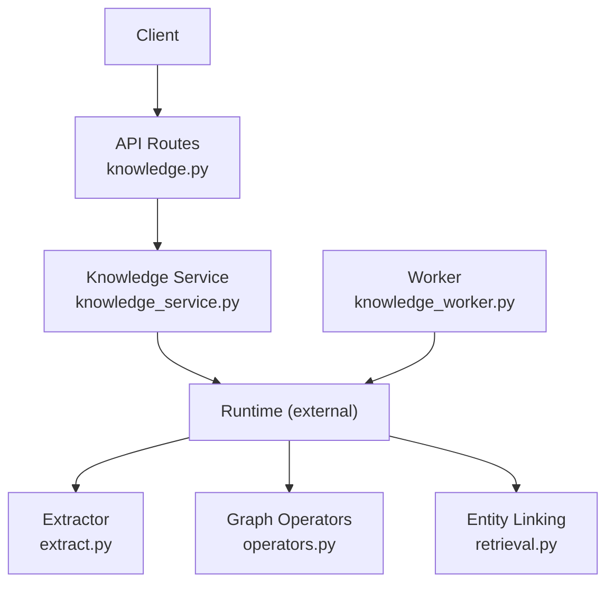
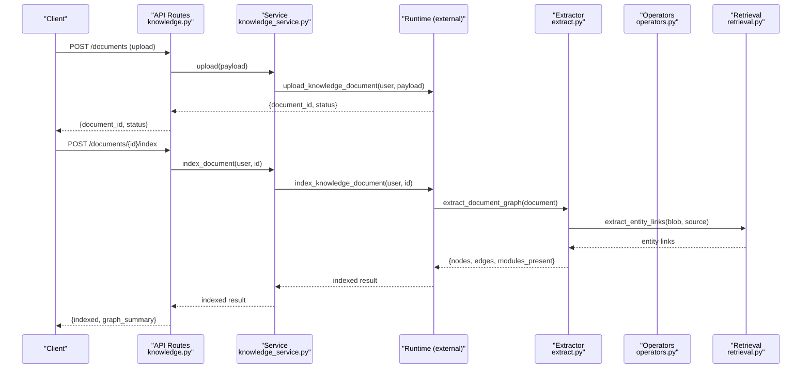
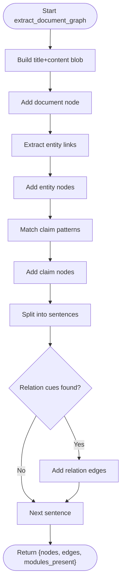
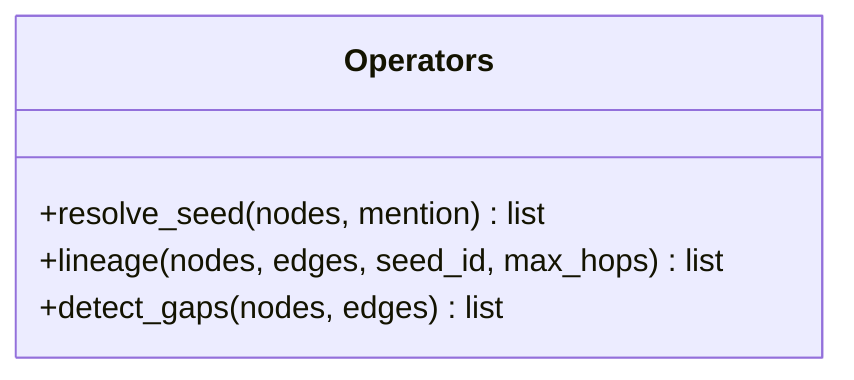
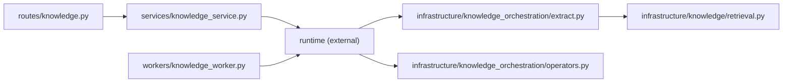

# Document Ingestion Pipeline

<cite>
**Referenced Files in This Document**
- [knowledge.py](file://backend/app/api/v1/routes/knowledge.py)
- [knowledge_service.py](file://backend/app/services/knowledge_service.py)
- [extract.py](file://backend/app/infrastructure/knowledge_orchestration/extract.py)
- [operators.py](file://backend/app/infrastructure/knowledge_orchestration/operators.py)
- [retrieval.py](file://backend/app/infrastructure/knowledge/retrieval.py)
- [knowledge_worker.py](file://backend/app/workers/knowledge_worker.py)
</cite>

## Table of Contents
1. [Introduction](#introduction)
2. [Project Structure](#project-structure)
3. [Core Components](#core-components)
4. [Architecture Overview](#architecture-overview)
5. [Detailed Component Analysis](#detailed-component-analysis)
6. [Dependency Analysis](#dependency-analysis)
7. [Performance Considerations](#performance-considerations)
8. [Troubleshooting Guide](#troubleshooting-guide)
9. [Conclusion](#conclusion)

## Introduction
This document describes the document ingestion pipeline that transforms uploaded documents into structured knowledge artifacts and indexed storage. It covers the end-to-end workflow from upload to indexing, including extraction of entities, claims, and relations; graph operators for lineage and gap detection; and API endpoints that orchestrate these steps. Where implementation details are not present in the codebase, this document explicitly notes gaps and provides conceptual guidance.

## Project Structure
The ingestion pipeline is implemented across API routes, services, infrastructure extractors, and workers:
- API layer exposes endpoints for upload, search, indexing, graph extraction, and federation.
- Service layer delegates to runtime operations.
- Infrastructure contains a rule-based extractor and graph operators.
- A worker provides index refresh utilities.

**Diagram sources**
- [knowledge.py:1-92](file://backend/app/api/v1/routes/knowledge.py#L1-L92)
- [knowledge_service.py:1-27](file://backend/app/services/knowledge_service.py#L1-L27)
- [extract.py:1-118](file://backend/app/infrastructure/knowledge_orchestration/extract.py#L1-L118)
- [operators.py:1-99](file://backend/app/infrastructure/knowledge_orchestration/operators.py#L1-L99)
- [retrieval.py](file://backend/app/infrastructure/knowledge/retrieval.py)
- [knowledge_worker.py:1-6](file://backend/app/workers/knowledge_worker.py#L1-L6)

**Section sources**
- [knowledge.py:1-92](file://backend/app/api/v1/routes/knowledge.py#L1-L92)
- [knowledge_service.py:1-27](file://backend/app/services/knowledge_service.py#L1-L27)
- [extract.py:1-118](file://backend/app/infrastructure/knowledge_orchestration/extract.py#L1-L118)
- [operators.py:1-99](file://backend/app/infrastructure/knowledge_orchestration/operators.py#L1-L99)
- [retrieval.py](file://backend/app/infrastructure/knowledge/retrieval.py)
- [knowledge_worker.py:1-6](file://backend/app/workers/knowledge_worker.py#L1-L6)

## Core Components
- API routes: Provide HTTP endpoints for upload, search, document retrieval, indexing, graph extraction, query, gap analysis, and federation.
- Knowledge service: Thin facade over runtime methods for upload, get, index, archive, and search.
- Extractor: Rule/heuristic-based extraction producing nodes (document structure, entities, claims) and edges (relations), with evidence spans and confidence scores.
- Graph operators: Seed resolution, lineage traversal, and gap detection on extracted graphs.
- Entity linking helper: Used by the extractor to identify mentioned entities.
- Worker: Index refresh utility listing stored knowledge documents.

Key responsibilities:
- Upload and indexing entry points are exposed via API and delegated to runtime.
- Extraction builds a lightweight knowledge graph per document.
- Operators enable querying and quality checks on the graph.

**Section sources**
- [knowledge.py:1-92](file://backend/app/api/v1/routes/knowledge.py#L1-L92)
- [knowledge_service.py:1-27](file://backend/app/services/knowledge_service.py#L1-L27)
- [extract.py:1-118](file://backend/app/infrastructure/knowledge_orchestration/extract.py#L1-L118)
- [operators.py:1-99](file://backend/app/infrastructure/knowledge_orchestration/operators.py#L1-L99)
- [retrieval.py](file://backend/app/infrastructure/knowledge/retrieval.py)
- [knowledge_worker.py:1-6](file://backend/app/workers/knowledge_worker.py#L1-L6)

## Architecture Overview
The ingestion flow integrates API-driven orchestration with rule-based extraction and graph analytics.

**Diagram sources**
- [knowledge.py:31-54](file://backend/app/api/v1/routes/knowledge.py#L31-L54)
- [knowledge_service.py:17-22](file://backend/app/services/knowledge_service.py#L17-L22)
- [extract.py:33-117](file://backend/app/infrastructure/knowledge_orchestration/extract.py#L33-L117)
- [retrieval.py](file://backend/app/infrastructure/knowledge/retrieval.py)

## Detailed Component Analysis

### API Layer: Endpoints and Orchestration
- Upload endpoints accept a request body and delegate to the service layer.
- Search endpoints support optional multi-hop and filter parameters.
- Index endpoint triggers re-indexing for a specific document.
- Graph endpoints provide extraction, query, gap detection, and federation.

Operational notes:
- Permission checks are enforced at route level for read operations.
- Filters are applied client-side after retrieval when provided.

**Section sources**
- [knowledge.py:11-92](file://backend/app/api/v1/routes/knowledge.py#L11-L92)

### Service Layer: Delegation to Runtime
- Provides simple functions for upload, get, index, archive, and search.
- All calls forward to runtime methods, keeping the service thin and testable.

**Section sources**
- [knowledge_service.py:1-27](file://backend/app/services/knowledge_service.py#L1-L27)

### Extraction Engine: Rule-Based Knowledge Graph
The extractor produces a lightweight knowledge graph per document:
- Nodes include document structure, entities (from entity linking), and claims (obligation-like sentences).
- Edges represent typed relations between co-occurring entities within sentences using cue phrases.
- Each node/edge carries metadata such as document_id, evidence_span, confidence, and module tags.

Extraction highlights:
- Entity mentions are sourced from an external helper used during extraction.
- Claims are identified via pattern matching on normative language.
- Relations are inferred using predefined cues and sentence-level co-occurrence.

**Diagram sources**
- [extract.py:33-117](file://backend/app/infrastructure/knowledge_orchestration/extract.py#L33-L117)
- [retrieval.py](file://backend/app/infrastructure/knowledge/retrieval.py)

**Section sources**
- [extract.py:1-118](file://backend/app/infrastructure/knowledge_orchestration/extract.py#L1-L118)
- [retrieval.py](file://backend/app/infrastructure/knowledge/retrieval.py)

### Graph Operators: Resolution, Lineage, Gaps
- Seed resolution matches mention against node labels or IDs.
- Lineage traverses allowed relation types up to a configurable hop limit.
- Gap detection identifies orphan entities, ungrounded claims, and sparse documents.

**Diagram sources**
- [operators.py:1-99](file://backend/app/infrastructure/knowledge_orchestration/operators.py#L1-L99)

**Section sources**
- [operators.py:1-99](file://backend/app/infrastructure/knowledge_orchestration/operators.py#L1-L99)

### Worker: Index Refresh Utility
- Provides a function to count known knowledge documents, useful for health checks or background tasks.

**Section sources**
- [knowledge_worker.py:1-6](file://backend/app/workers/knowledge_worker.py#L1-L6)

## Dependency Analysis
High-level dependencies among components:
- API routes depend on the service layer and runtime.
- Service layer depends on runtime.
- Runtime orchestrates extraction and operators.
- Extractor depends on entity linking helper.
- Workers interact with runtime for collection listing.

**Diagram sources**
- [knowledge.py:1-92](file://backend/app/api/v1/routes/knowledge.py#L1-L92)
- [knowledge_service.py:1-27](file://backend/app/services/knowledge_service.py#L1-L27)
- [extract.py:1-118](file://backend/app/infrastructure/knowledge_orchestration/extract.py#L1-L118)
- [operators.py:1-99](file://backend/app/infrastructure/knowledge_orchestration/operators.py#L1-L99)
- [retrieval.py](file://backend/app/infrastructure/knowledge/retrieval.py)
- [knowledge_worker.py:1-6](file://backend/app/workers/knowledge_worker.py#L1-L6)

**Section sources**
- [knowledge.py:1-92](file://backend/app/api/v1/routes/knowledge.py#L1-L92)
- [knowledge_service.py:1-27](file://backend/app/services/knowledge_service.py#L1-L27)
- [extract.py:1-118](file://backend/app/infrastructure/knowledge_orchestration/extract.py#L1-L118)
- [operators.py:1-99](file://backend/app/infrastructure/knowledge_orchestration/operators.py#L1-L99)
- [retrieval.py](file://backend/app/infrastructure/knowledge/retrieval.py)
- [knowledge_worker.py:1-6](file://backend/app/workers/knowledge_worker.py#L1-L6)

## Performance Considerations
- Chunking strategies: No chunking implementation is present in the analyzed files. If needed, implement chunking prior to extraction with configurable size and overlap, then pass chunks to the extractor.
- Batch processing: The current API supports single-document operations. For batch ingestion, consider adding a batch endpoint that iterates over multiple payloads and aggregates results.
- Concurrency: Offload heavy extraction and indexing to background jobs to avoid blocking API responses.
- Index refresh: Use the worker’s collection listing to monitor scale and plan shard/partition sizing if applicable.

[No sources needed since this section provides general guidance]

## Troubleshooting Guide
Common issues and diagnostics:
- Missing entities: Verify entity linking helper returns expected links for the input text.
- Sparse graphs: Use gap detection to identify orphan entities and ungrounded claims; enrich content or adjust extraction rules accordingly.
- Index state: Use the worker utility to confirm how many knowledge documents are persisted.

Operational tips:
- Validate inputs before upload to ensure required fields exist.
- Inspect returned modules_present to understand which extraction modules contributed nodes/edges.

**Section sources**
- [operators.py:55-99](file://backend/app/infrastructure/knowledge_orchestration/operators.py#L55-L99)
- [knowledge_worker.py:4-5](file://backend/app/workers/knowledge_worker.py#L4-L5)

## Conclusion
The ingestion pipeline centers on a rule-based extractor that builds a lightweight knowledge graph from documents, complemented by graph operators for lineage and quality checks. API endpoints expose upload, search, indexing, and graph operations, while a worker aids in monitoring. To extend the system, add robust chunking, batch ingestion, retry mechanisms, and progress tracking around the existing runtime integration points.