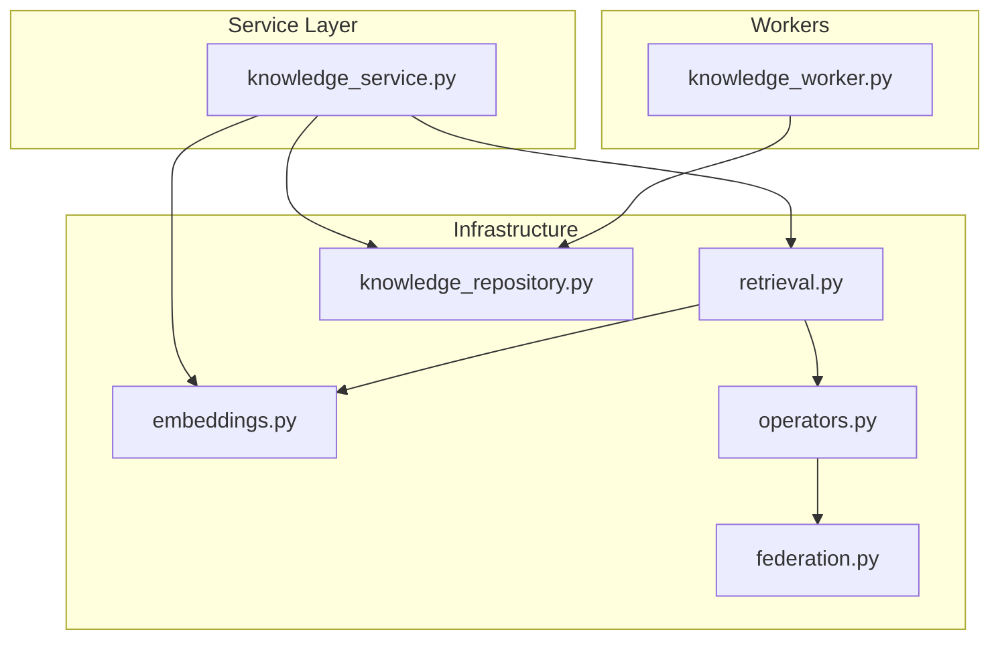
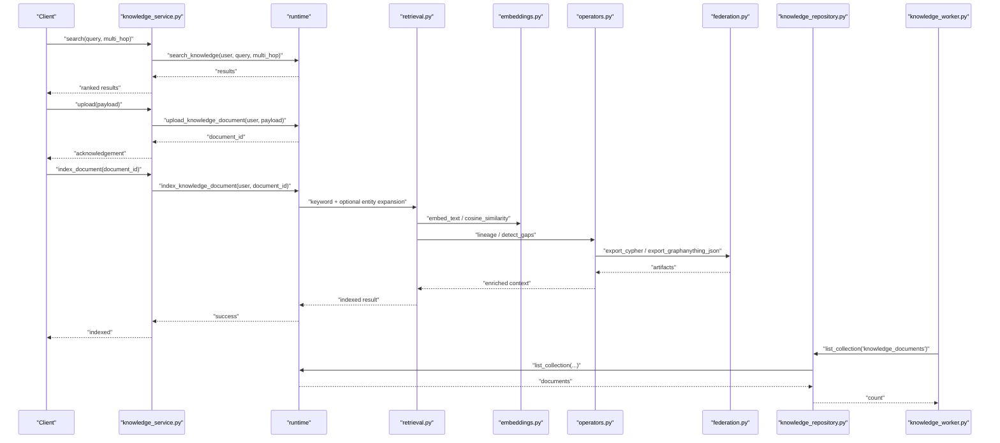
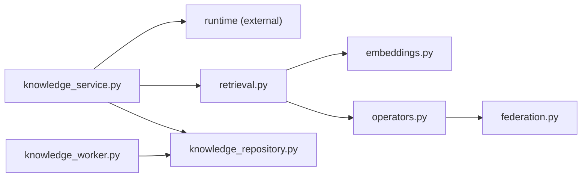

# Knowledge Base Storage

<cite>
**Referenced Files in This Document**
- [knowledge_service.py](file://backend/app/services/knowledge_service.py)
- [retrieval.py](file://backend/app/infrastructure/knowledge/retrieval.py)
- [embeddings.py](file://backend/app/infrastructure/knowledge/embeddings.py)
- [operators.py](file://backend/app/infrastructure/knowledge_orchestration/operators.py)
- [federation.py](file://backend/app/infrastructure/knowledge_orchestration/federation.py)
- [knowledge_repository.py](file://backend/app/infrastructure/repositories/knowledge_repository.py)
- [knowledge_worker.py](file://backend/app/workers/knowledge_worker.py)
</cite>

## Table of Contents
1. [Introduction](#introduction)
2. [Project Structure](#project-structure)
3. [Core Components](#core-components)
4. [Architecture Overview](#architecture-overview)
5. [Detailed Component Analysis](#detailed-component-analysis)
6. [Dependency Analysis](#dependency-analysis)
7. [Performance Considerations](#performance-considerations)
8. [Troubleshooting Guide](#troubleshooting-guide)
9. [Conclusion](#conclusion)
10. [Appendices](#appendices)

## Introduction
This document describes the knowledge base storage system with a focus on:
- Document ingestion and indexing
- Chunking strategies (as implemented or deferred)
- Embedding generation and persistence
- Tiered retrieval combining keyword search and vector similarity
- Entity extraction, relationship mapping, and graph-based representation
- Query processing, ranking, and relevance scoring
- Versioning, provenance tracking, and multi-hop reasoning
- Storage backends, indexing strategies, and scalability considerations

The implementation emphasizes a lightweight, vendor-neutral approach with deterministic local embeddings and optional Postgres persistence for vectors, plus an optional Neo4j push for graph federation artifacts.

## Project Structure
The knowledge base is organized across service, infrastructure, orchestration, repository, and worker layers:
- Service layer exposes high-level operations such as search, upload, index, and archive.
- Infrastructure provides retrieval logic, embedding utilities, and optional pgvector persistence.
- Orchestration includes entity-link expansion, lineage traversal, gap detection, and graph export/federation.
- Repository and workers provide list and refresh capabilities backed by runtime abstractions.

**Diagram sources**
- [knowledge_service.py:1-27](file://backend/app/services/knowledge_service.py#L1-L27)
- [retrieval.py:1-134](file://backend/app/infrastructure/knowledge/retrieval.py#L1-L134)
- [embeddings.py:1-90](file://backend/app/infrastructure/knowledge/embeddings.py#L1-L90)
- [operators.py:1-99](file://backend/app/infrastructure/knowledge_orchestration/operators.py#L1-L99)
- [federation.py:1-122](file://backend/app/infrastructure/knowledge_orchestration/federation.py#L1-L122)
- [knowledge_repository.py:1-6](file://backend/app/infrastructure/repositories/knowledge_repository.py#L1-L6)
- [knowledge_worker.py:1-6](file://backend/app/workers/knowledge_worker.py#L1-L6)

**Section sources**
- [knowledge_service.py:1-27](file://backend/app/services/knowledge_service.py#L1-L27)
- [retrieval.py:1-134](file://backend/app/infrastructure/knowledge/retrieval.py#L1-L134)
- [embeddings.py:1-90](file://backend/app/infrastructure/knowledge/embeddings.py#L1-L90)
- [operators.py:1-99](file://backend/app/infrastructure/knowledge_orchestration/operators.py#L1-L99)
- [federation.py:1-122](file://backend/app/infrastructure/knowledge_orchestration/federation.py#L1-L122)
- [knowledge_repository.py:1-6](file://backend/app/infrastructure/repositories/knowledge_repository.py#L1-L6)
- [knowledge_worker.py:1-6](file://backend/app/workers/knowledge_worker.py#L1-L6)

## Core Components
- Search and document operations are exposed via the service layer, delegating to runtime methods for execution.
- Retrieval implements a tiered strategy:
  - Tier 0: Keyword search with mandatory provenance and simple term overlap scoring.
  - Tier 1: Lightweight entity-link expansion for multi-hop queries when relational cues are detected.
  - Tier 2: Deferred RAPTOR-style hierarchical summaries (not implemented).
- Embeddings use a deterministic hashing trick with L2 normalization; optional pgvector persistence stores vectors in Postgres tables without requiring vector extensions.
- Graph operators support seed resolution, lineage traversal over typed relations, and gap detection for orphan entities and sparse documents.
- Federation exports knowledge graphs as Cypher scripts and GraphAnything-compatible JSON, with optional Neo4j push if configured.

**Section sources**
- [knowledge_service.py:1-27](file://backend/app/services/knowledge_service.py#L1-L27)
- [retrieval.py:1-134](file://backend/app/infrastructure/knowledge/retrieval.py#L1-L134)
- [embeddings.py:1-90](file://backend/app/infrastructure/knowledge/embeddings.py#L1-L90)
- [operators.py:1-99](file://backend/app/infrastructure/knowledge_orchestration/operators.py#L1-L99)
- [federation.py:1-122](file://backend/app/infrastructure/knowledge_orchestration/federation.py#L1-L122)

## Architecture Overview
The knowledge pipeline integrates ingestion, indexing, retrieval, and graph federation:
- Ingestion and indexing are orchestrated through service calls that delegate to runtime handlers.
- Retrieval combines keyword matching and optional entity-link expansion.
- Embeddings are computed deterministically and optionally persisted to Postgres.
- Graph operators enable multi-hop reasoning and quality checks.
- Federation writes versioned artifacts and can push to Neo4j when available.

**Diagram sources**
- [knowledge_service.py:1-27](file://backend/app/services/knowledge_service.py#L1-L27)
- [retrieval.py:1-134](file://backend/app/infrastructure/knowledge/retrieval.py#L1-L134)
- [embeddings.py:1-90](file://backend/app/infrastructure/knowledge/embeddings.py#L1-L90)
- [operators.py:1-99](file://backend/app/infrastructure/knowledge_orchestration/operators.py#L1-L99)
- [federation.py:1-122](file://backend/app/infrastructure/knowledge_orchestration/federation.py#L1-L122)
- [knowledge_repository.py:1-6](file://backend/app/infrastructure/repositories/knowledge_repository.py#L1-L6)
- [knowledge_worker.py:1-6](file://backend/app/workers/knowledge_worker.py#L1-L6)

## Detailed Component Analysis

### Document Ingestion Pipeline
- Upload: The service delegates to runtime to persist the incoming document payload and return a stable identifier.
- Index: The service triggers indexing which runs keyword scoring, optional entity-link expansion, embedding computation, and optional pgvector upsert.
- Archive: The service delegates archiving to runtime for lifecycle management.

Key responsibilities:
- Input validation and authorization are handled upstream via runtime integration.
- Provenance metadata is preserved throughout indexing and retrieval.

**Section sources**
- [knowledge_service.py:17-26](file://backend/app/services/knowledge_service.py#L17-L26)

### Chunking Strategies
- No explicit chunking module is present in the analyzed files.
- The design notes indicate Tier 2 (RAPTOR-style hierarchical summaries) is intentionally out of scope.
- Practical implication: current indexing operates at the document level; chunking should be introduced if long documents require finer-grained retrieval.

Recommendation:
- Implement a chunking strategy aligned with domain semantics (e.g., section boundaries, logical units) before embedding and indexing.

**Section sources**
- [retrieval.py:1-8](file://backend/app/infrastructure/knowledge/retrieval.py#L1-L8)

### Embedding Generation and Persistence
- Deterministic hashing trick produces fixed-dimension vectors from tokenized text.
- Vectors are L2-normalized for cosine similarity.
- Optional pgvector persistence stores vectors in a Postgres table using JSON text for portability even without vector extension.

Behavioral notes:
- If pgvector is disabled or Postgres is unavailable, embedding upserts are best-effort and non-fatal.
- Cosine similarity is used for ranking against stored or computed embeddings.

**Section sources**
- [embeddings.py:1-90](file://backend/app/infrastructure/knowledge/embeddings.py#L1-L90)

### Tiered Retrieval Architecture
- Tier 0: Keyword search with mandatory provenance and simple term overlap scoring.
- Tier 1: Multi-hop expansion based on shared entity links between seed hits and corpus documents.
- Escalation: Relational cues in the query trigger escalation to Tier 1.

Scoring and ranking:
- Term overlap score normalizes hits over query terms.
- Vector similarity complements keyword scores when embeddings are available.

Multi-hop reasoning:
- Shared entity links connect related documents; extra hops are annotated with hop metadata and linked-from references.

**Section sources**
- [retrieval.py:1-134](file://backend/app/infrastructure/knowledge/retrieval.py#L1-L134)

### Entity Extraction and Relationship Mapping
- Entity mention extraction uses regex patterns to identify workflow IDs, policy IDs, agent names, business paths, and risk tiers.
- Each extracted entity is tagged with a kind for downstream graph modeling.
- Source path is included as an entity when provided.

Graph operators:
- Seed resolution matches nodes by label or ID substring.
- Lineage traversal follows allowed relation types across hops.
- Gap detection identifies orphan entities, ungrounded claims, and sparse documents.

Federation:
- Exports nodes and edges as Cypher statements and GraphAnything-compatible JSON.
- Writes timestamped artifacts and maintains latest pointers.
- Optional Neo4j push when driver and URI are configured.

**Section sources**
- [retrieval.py:39-68](file://backend/app/infrastructure/knowledge/retrieval.py#L39-L68)
- [operators.py:1-99](file://backend/app/infrastructure/knowledge_orchestration/operators.py#L1-L99)
- [federation.py:1-122](file://backend/app/infrastructure/knowledge_orchestration/federation.py#L1-L122)

### Search Query Processing and Ranking
- Query preprocessing tokenizes into lowercase terms longer than two characters.
- Keyword scoring counts overlapping terms against title and content.
- Vector similarity augments ranking when embeddings exist.
- Multi-hop expansion adds related documents sharing entity links with seed hits.

Relevance scoring mechanisms:
- Normalized term overlap for Tier 0.
- Cosine similarity for vector-based ranking.
- Hop metadata and shared entities for explainability.

**Section sources**
- [retrieval.py:71-134](file://backend/app/infrastructure/knowledge/retrieval.py#L71-L134)
- [embeddings.py:30-47](file://backend/app/infrastructure/knowledge/embeddings.py#L30-L47)

### Knowledge Versioning and Provenance Tracking
- Federation artifacts include timestamps and maintain “latest” pointers for both Cypher and JSON outputs.
- Nodes and edges carry source references and evidence spans for traceability.
- Provenance is required in Tier 0 retrieval to ensure answerability.

Operational implications:
- Versioned artifacts enable rollback and auditability.
- Evidence spans link claims to source material.

**Section sources**
- [federation.py:70-95](file://backend/app/infrastructure/knowledge_orchestration/federation.py#L70-L95)
- [retrieval.py:1-8](file://backend/app/infrastructure/knowledge/retrieval.py#L1-L8)

### Multi-Hop Reasoning Capabilities
- Escalation to Tier 1 occurs when relational cues are detected in the query.
- Expansion finds documents sharing entity links with seed hits and annotates them with hop information.
- Lineage traversal supports multi-hop exploration over typed relations.

Limitations:
- Current implementation is lightweight and does not rely on external graph vendors.
- Complex multi-hop reasoning beyond shared entities is deferred.

**Section sources**
- [retrieval.py:81-134](file://backend/app/infrastructure/knowledge/retrieval.py#L81-L134)
- [operators.py:23-52](file://backend/app/infrastructure/knowledge_orchestration/operators.py#L23-L52)

### Storage Backends and Indexing Strategies
- Primary storage is abstracted via runtime collection operations.
- Optional pgvector persistence stores embeddings in Postgres tables using JSON text for compatibility.
- Graph federation exports artifacts to file system and optionally pushes to Neo4j.

Indexing strategy:
- Keyword index built from document title and content.
- Vector index optionally maintained in Postgres.
- Graph index represented by exported artifacts and optional Neo4j database.

Scalability considerations:
- Deterministic embeddings avoid external model dependencies and reduce latency.
- Best-effort pgvector writes prevent request failures.
- Federation artifacts decouple graph updates from runtime performance.

**Section sources**
- [embeddings.py:50-90](file://backend/app/infrastructure/knowledge/embeddings.py#L50-L90)
- [federation.py:98-122](file://backend/app/infrastructure/knowledge_orchestration/federation.py#L98-L122)
- [knowledge_repository.py:1-6](file://backend/app/infrastructure/repositories/knowledge_repository.py#L1-L6)

## Dependency Analysis
The following diagram shows key dependencies among components involved in knowledge operations.

**Diagram sources**
- [knowledge_service.py:1-27](file://backend/app/services/knowledge_service.py#L1-L27)
- [retrieval.py:1-134](file://backend/app/infrastructure/knowledge/retrieval.py#L1-L134)
- [embeddings.py:1-90](file://backend/app/infrastructure/knowledge/embeddings.py#L1-L90)
- [operators.py:1-99](file://backend/app/infrastructure/knowledge_orchestration/operators.py#L1-L99)
- [federation.py:1-122](file://backend/app/infrastructure/knowledge_orchestration/federation.py#L1-L122)
- [knowledge_repository.py:1-6](file://backend/app/infrastructure/repositories/knowledge_repository.py#L1-L6)
- [knowledge_worker.py:1-6](file://backend/app/workers/knowledge_worker.py#L1-L6)

**Section sources**
- [knowledge_service.py:1-27](file://backend/app/services/knowledge_service.py#L1-L27)
- [retrieval.py:1-134](file://backend/app/infrastructure/knowledge/retrieval.py#L1-L134)
- [embeddings.py:1-90](file://backend/app/infrastructure/knowledge/embeddings.py#L1-L90)
- [operators.py:1-99](file://backend/app/infrastructure/knowledge_orchestration/operators.py#L1-L99)
- [federation.py:1-122](file://backend/app/infrastructure/knowledge_orchestration/federation.py#L1-L122)
- [knowledge_repository.py:1-6](file://backend/app/infrastructure/repositories/knowledge_repository.py#L1-L6)
- [knowledge_worker.py:1-6](file://backend/app/workers/knowledge_worker.py#L1-L6)

## Performance Considerations
- Deterministic embeddings eliminate external model calls, reducing latency and cost.
- Cosine similarity is efficient for moderate-dimensional vectors.
- Best-effort pgvector writes avoid blocking requests when Postgres is unavailable.
- Keyword scoring is O(n) per document with small constant factors.
- Multi-hop expansion is bounded by max_extra and corpus size; consider caching entity links for large corpora.
- Federation artifact writes are I/O-bound; batch operations and async workers can improve throughput.

[No sources needed since this section provides general guidance]

## Troubleshooting Guide
Common issues and resolutions:
- pgvector disabled or Postgres unavailable:
  - Embedding upsert returns a reason indicating pgvector_disabled or no_engine; retrieval still functions with in-memory embeddings.
- Neo4j push fails:
  - Check NEO4J_URI configuration and driver installation; errors are captured and returned non-fatally.
- Low recall on multi-hop queries:
  - Ensure entity patterns match expected identifiers; adjust _ENTITY_PATTERNS if necessary.
- Sparse documents:
  - Use gap detection to identify documents producing only one node; enrich extraction rules.

**Section sources**
- [embeddings.py:50-90](file://backend/app/infrastructure/knowledge/embeddings.py#L50-L90)
- [federation.py:98-122](file://backend/app/infrastructure/knowledge_orchestration/federation.py#L98-L122)
- [operators.py:55-99](file://backend/app/infrastructure/knowledge_orchestration/operators.py#L55-L99)

## Conclusion
The knowledge base storage system provides a pragmatic, vendor-neutral foundation for ingestion, indexing, retrieval, and graph federation. It balances simplicity with extensibility:
- Tiered retrieval ensures reliable baseline performance with optional multi-hop enhancement.
- Deterministic embeddings offer fast, offline-friendly semantic ranking.
- Graph operators and federation artifacts enable traceable, auditable knowledge representation.
Future enhancements may include chunking strategies, richer entity models, and advanced multi-hop reasoning while preserving the lightweight architecture.

[No sources needed since this section summarizes without analyzing specific files]

## Appendices

### API Operations Summary
- Search: Accepts query and optional multi_hop flag; returns ranked results.
- Get Document: Retrieves a document by ID.
- Upload: Persists a document payload and returns an identifier.
- Index Document: Triggers indexing including keyword scoring, entity expansion, and embedding upsert.
- Archive Document: Archives a document for lifecycle management.

**Section sources**
- [knowledge_service.py:4-26](file://backend/app/services/knowledge_service.py#L4-L26)

### Configuration Flags and Options
- pgvector_enabled and use_postgres control optional vector persistence.
- neo4j_uri, neo4j_user, neo4j_password control optional Neo4j push.

**Section sources**
- [embeddings.py:50-90](file://backend/app/infrastructure/knowledge/embeddings.py#L50-L90)
- [federation.py:98-122](file://backend/app/infrastructure/knowledge_orchestration/federation.py#L98-L122)