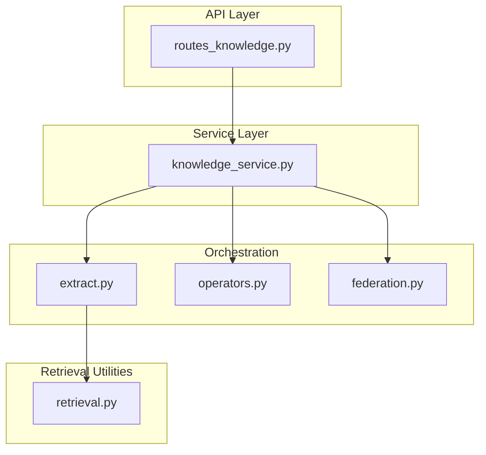
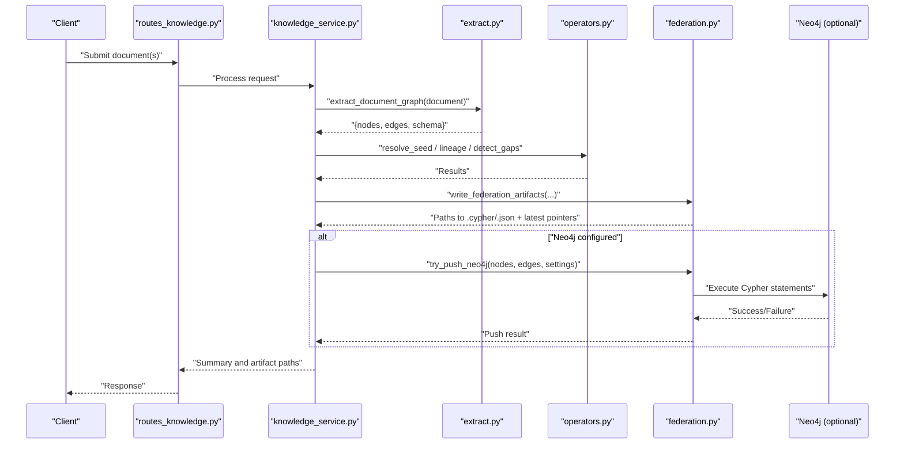
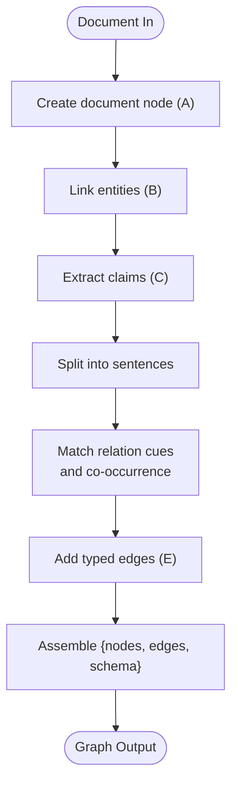
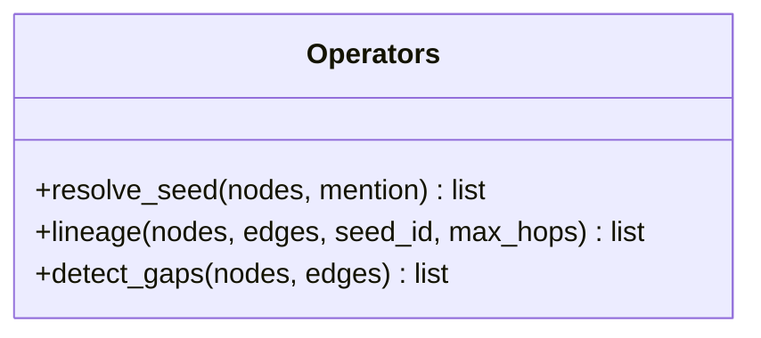
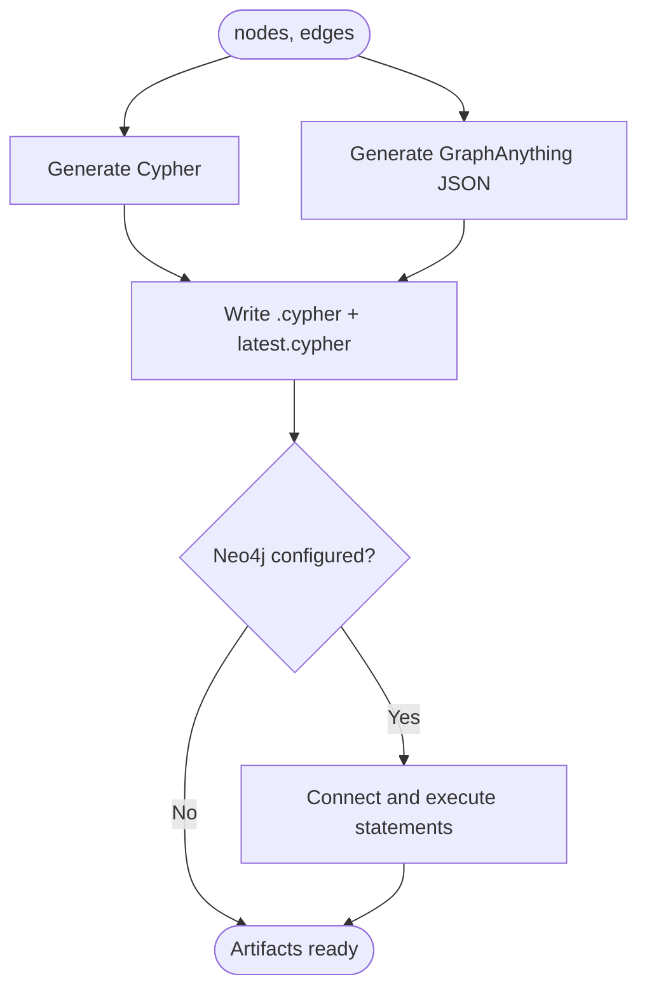
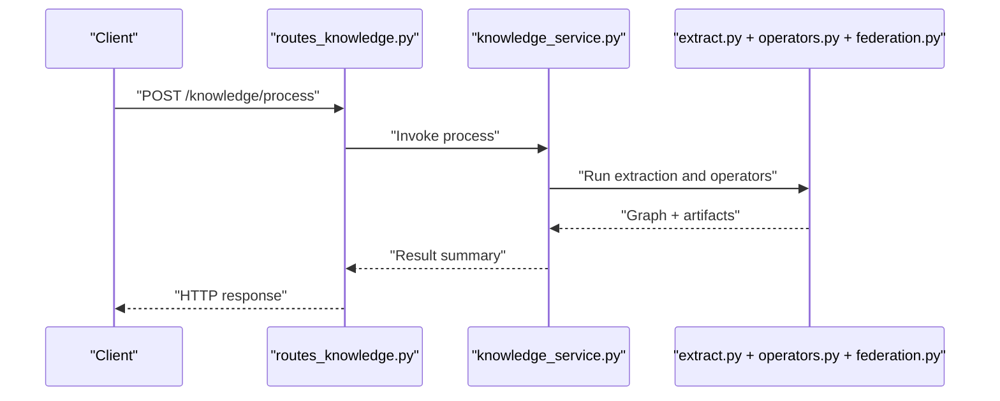
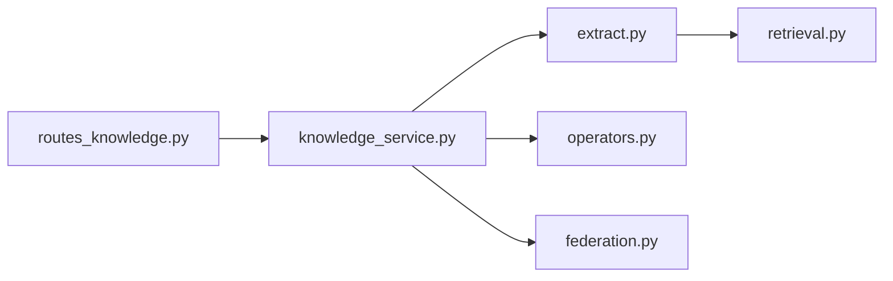

# Knowledge Graph Operations

<cite>
**Referenced Files in This Document**
- [federation.py](file://backend/app/infrastructure/knowledge_orchestration/federation.py)
- [operators.py](file://backend/app/infrastructure/knowledge_orchestration/operators.py)
- [extract.py](file://backend/app/infrastructure/knowledge_orchestration/extract.py)
- [retrieval.py](file://backend/app/infrastructure/knowledge/retrieval.py)
- [knowledge_service.py](file://backend/app/services/knowledge_service.py)
- [routes_knowledge.py](file://backend/app/api/v1/routes/knowledge.py)
</cite>

## Table of Contents
1. [Introduction](#introduction)
2. [Project Structure](#project-structure)
3. [Core Components](#core-components)
4. [Architecture Overview](#architecture-overview)
5. [Detailed Component Analysis](#detailed-component-analysis)
6. [Dependency Analysis](#dependency-analysis)
7. [Performance Considerations](#performance-considerations)
8. [Troubleshooting Guide](#troubleshooting-guide)
9. [Conclusion](#conclusion)
10. [Appendices](#appendices)

## Introduction
This document explains knowledge graph operations and multi-hop reasoning implemented in the repository. It covers:
- Entity extraction, relationship mapping, and graph construction from unstructured documents
- Graph traversal algorithms, path finding, and inference capabilities
- Federation layer for connecting multiple knowledge sources and maintaining consistency across domains
- Graph query patterns, pattern matching, and complex relationship analysis
- Graph versioning, incremental updates, and conflict resolution strategies
- Examples of custom graph operators and reasoning rules

The implementation focuses on a lightweight, agent-native approach that produces structured graphs with evidence spans and supports export to Cypher and a GraphAnything-compatible JSON format.

## Project Structure
Knowledge graph functionality is primarily implemented under the infrastructure orchestration layer, with supporting retrieval utilities and service/API integration points.

**Diagram sources**
- [routes_knowledge.py](file://backend/app/api/v1/routes/knowledge.py)
- [knowledge_service.py](file://backend/app/services/knowledge_service.py)
- [extract.py](file://backend/app/infrastructure/knowledge_orchestration/extract.py)
- [operators.py](file://backend/app/infrastructure/knowledge_orchestration/operators.py)
- [federation.py](file://backend/app/infrastructure/knowledge_orchestration/federation.py)
- [retrieval.py](file://backend/app/infrastructure/knowledge/retrieval.py)

**Section sources**
- [extract.py](file://backend/app/infrastructure/knowledge_orchestration/extract.py)
- [operators.py](file://backend/app/infrastructure/knowledge_orchestration/operators.py)
- [federation.py](file://backend/app/infrastructure/knowledge_orchestration/federation.py)
- [retrieval.py](file://backend/app/infrastructure/knowledge/retrieval.py)
- [knowledge_service.py](file://backend/app/services/knowledge_service.py)
- [routes_knowledge.py](file://backend/app/api/v1/routes/knowledge.py)

## Core Components
- Extraction pipeline: Converts unstructured documents into nodes (entities, claims, documents) and edges (typed relations), capturing evidence spans and provenance metadata.
- Operators: Provide typed graph operations including seed resolution, lineage traversal, and gap detection.
- Federation: Exports graphs to Cypher and GraphAnything-compatible JSON; optionally pushes to Neo4j when configured.
- Retrieval utilities: Supply entity linking helpers used during extraction.

Key responsibilities:
- extract_document_graph: Builds a minimal K1-lite graph per document with modules A/B/C/E tags and evidence.
- resolve_seed: Finds candidate entities by label/id substring matching.
- lineage: Multi-hop traversal along allowed relation types.
- detect_gaps: Identifies orphans, ungrounded claims, and sparse documents.
- write_federation_artifacts: Produces timestamped artifacts and latest pointers.
- try_push_neo4j: Optional driver-based push to Neo4j using generated Cypher statements.

**Section sources**
- [extract.py](file://backend/app/infrastructure/knowledge_orchestration/extract.py)
- [operators.py](file://backend/app/infrastructure/knowledge_orchestration/operators.py)
- [federation.py](file://backend/app/infrastructure/knowledge_orchestration/federation.py)
- [retrieval.py](file://backend/app/infrastructure/knowledge/retrieval.py)

## Architecture Overview
End-to-end flow from document ingestion to federated exports:

**Diagram sources**
- [routes_knowledge.py](file://backend/app/api/v1/routes/knowledge.py)
- [knowledge_service.py](file://backend/app/services/knowledge_service.py)
- [extract.py](file://backend/app/infrastructure/knowledge_orchestration/extract.py)
- [operators.py](file://backend/app/infrastructure/knowledge_orchestration/operators.py)
- [federation.py](file://backend/app/infrastructure/knowledge_orchestration/federation.py)

## Detailed Component Analysis

### Extraction Pipeline (K1-lite)
- Input: A document dict with id, title, content, source/path.
- Processing:
  - Creates a document node (Module A-lite).
  - Adds entity nodes via entity link extractor (Module B).
  - Detects claim/obligation sentences and adds claim nodes (Module C).
  - Infers typed relations between co-occurring entities within sentences using cue phrases (Module E).
- Output: nodes, edges, schema tag, and module presence flags. Each node/edge carries evidence_span and confidence.

**Diagram sources**
- [extract.py](file://backend/app/infrastructure/knowledge_orchestration/extract.py)
- [retrieval.py](file://backend/app/infrastructure/knowledge/retrieval.py)

**Section sources**
- [extract.py](file://backend/app/infrastructure/knowledge_orchestration/extract.py)
- [retrieval.py](file://backend/app/infrastructure/knowledge/retrieval.py)

### Graph Operators
- Seed resolution (O1): Substring match over labels and ids; stable sort by label length.
- Lineage traversal (O2): Breadth-first walk up to max_hops along allowed relations (BUILDS_ON, REQUIRES, GOVERNED_BY, USES, ALTERNATIVE_TO).
- Gap detection (O5): Flags orphan entities, ungrounded claims, and sparse documents.

**Diagram sources**
- [operators.py](file://backend/app/infrastructure/knowledge_orchestration/operators.py)

**Section sources**
- [operators.py](file://backend/app/infrastructure/knowledge_orchestration/operators.py)

### Federation Layer
- Export formats:
  - Cypher: MERGE statements for nodes and MATCH+MERGE for edges; includes evidence and provenance fields.
  - GraphAnything-compatible JSON: Structured payload with nodes and edges, including type/module/evidence/source_file.
- Artifacts:
  - Timestamped files under business/knowledge-base/provenance/federation.
  - “latest” symlinks/pointers updated after each run.
- Optional Neo4j push:
  - Uses neo4j driver if installed and NEO4J_* configured.
  - Executes generated Cypher statements one-by-one.

**Diagram sources**
- [federation.py](file://backend/app/infrastructure/knowledge_orchestration/federation.py)

**Section sources**
- [federation.py](file://backend/app/infrastructure/knowledge_orchestration/federation.py)

### API and Service Integration
- API routes expose endpoints to trigger processing and return results/artifact paths.
- Service orchestrates extraction, operator usage, and federation export.

**Diagram sources**
- [routes_knowledge.py](file://backend/app/api/v1/routes/knowledge.py)
- [knowledge_service.py](file://backend/app/services/knowledge_service.py)

**Section sources**
- [routes_knowledge.py](file://backend/app/api/v1/routes/knowledge.py)
- [knowledge_service.py](file://backend/app/services/knowledge_service.py)

## Dependency Analysis
High-level dependencies among core components:

**Diagram sources**
- [extract.py](file://backend/app/infrastructure/knowledge_orchestration/extract.py)
- [retrieval.py](file://backend/app/infrastructure/knowledge/retrieval.py)
- [operators.py](file://backend/app/infrastructure/knowledge_orchestration/operators.py)
- [federation.py](file://backend/app/infrastructure/knowledge_orchestration/federation.py)
- [knowledge_service.py](file://backend/app/services/knowledge_service.py)
- [routes_knowledge.py](file://backend/app/api/v1/routes/knowledge.py)

**Section sources**
- [extract.py](file://backend/app/infrastructure/knowledge_orchestration/extract.py)
- [operators.py](file://backend/app/infrastructure/knowledge_orchestration/operators.py)
- [federation.py](file://backend/app/infrastructure/knowledge_orchestration/federation.py)
- [retrieval.py](file://backend/app/infrastructure/knowledge/retrieval.py)
- [knowledge_service.py](file://backend/app/services/knowledge_service.py)
- [routes_knowledge.py](file://backend/app/api/v1/routes/knowledge.py)

## Performance Considerations
- Extraction uses regex-based heuristics and sentence splitting; keep documents reasonably sized to avoid excessive tokenization overhead.
- Lineage traversal is breadth-first with a bounded hop count; tune max_hops to balance depth vs. runtime.
- Gap detection iterates once over nodes and edges; complexity is linear in graph size.
- Federation writes are file I/O bound; consider batching large graphs and compressing artifacts if needed.
- Neo4j push executes statements sequentially; for very large graphs, prefer batched imports or streaming approaches outside this component.

[No sources needed since this section provides general guidance]

## Troubleshooting Guide
Common issues and resolutions:
- Missing Neo4j driver: The optional push returns a reason indicating the driver is not installed. Install the driver or skip push.
- Unconfigured Neo4j URI: Push is skipped with a reason indicating the URI is not set. Configure NEO4J_* settings.
- Connection failures: Errors during session execution are captured and returned as reasons; verify credentials and network reachability.
- Empty seeds: Seed resolution returns no hits if the mention is empty or does not match any label/id substrings.
- Sparse outputs: Gap detection may flag sparse documents; enrich extraction prompts or improve entity linking.

**Section sources**
- [federation.py](file://backend/app/infrastructure/knowledge_orchestration/federation.py)
- [operators.py](file://backend/app/infrastructure/knowledge_orchestration/operators.py)

## Conclusion
The repository implements a pragmatic, agent-native knowledge graph stack:
- Lightweight extraction with evidence-backed nodes and typed relations
- Typed operators for seeding, lineage, and quality checks
- Federation exports to Cypher and GraphAnything-compatible JSON, with optional Neo4j integration
These building blocks support multi-hop reasoning, cross-domain federation, and iterative improvement through gap detection and artifact versioning.

[No sources needed since this section summarizes without analyzing specific files]

## Appendices

### Graph Query Patterns and Pattern Matching
- Seed queries: Use resolve_seed to find candidates by label/id substring.
- Path queries: Use lineage to traverse allowed relations up to a hop limit.
- Quality queries: Use detect_gaps to identify orphans, ungrounded claims, and sparse documents.

Example references:
- [operators.py](file://backend/app/infrastructure/knowledge_orchestration/operators.py)

### Custom Graph Operators and Reasoning Rules
- Extend operators with new relation filters or scoring functions.
- Integrate additional heuristics in extraction for domain-specific cues.
- Add new export formats by implementing a writer similar to the existing federation exporters.

Example references:
- [operators.py](file://backend/app/infrastructure/knowledge_orchestration/operators.py)
- [federation.py](file://backend/app/infrastructure/knowledge_orchestration/federation.py)
- [extract.py](file://backend/app/infrastructure/knowledge_orchestration/extract.py)

### Versioning, Incremental Updates, and Conflict Resolution
- Versioning: Federation artifacts are timestamped and include a “latest” pointer for quick access.
- Incremental updates: Re-run extraction per document and append new artifacts; deduplicate nodes/edges by id before merging.
- Conflict resolution: Prefer higher-confidence entries; reconcile duplicate nodes by canonical id generation; maintain provenance chains via source_refs and evidence spans.

Example references:
- [federation.py](file://backend/app/infrastructure/knowledge_orchestration/federation.py)
- [extract.py](file://backend/app/infrastructure/knowledge_orchestration/extract.py)