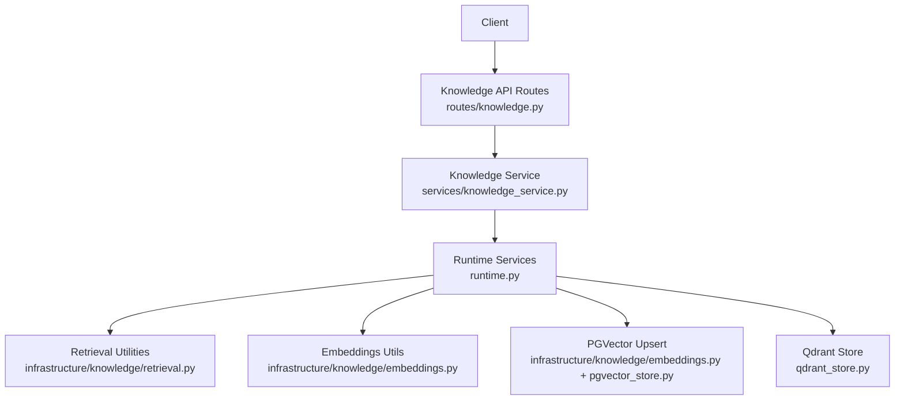
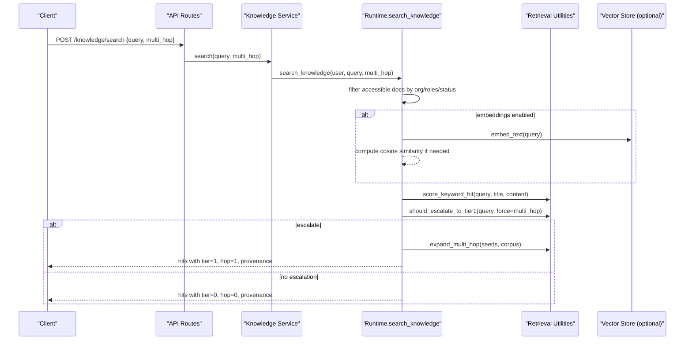
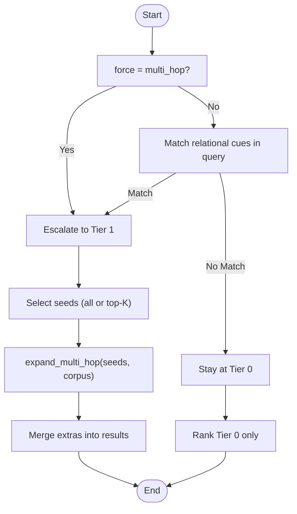
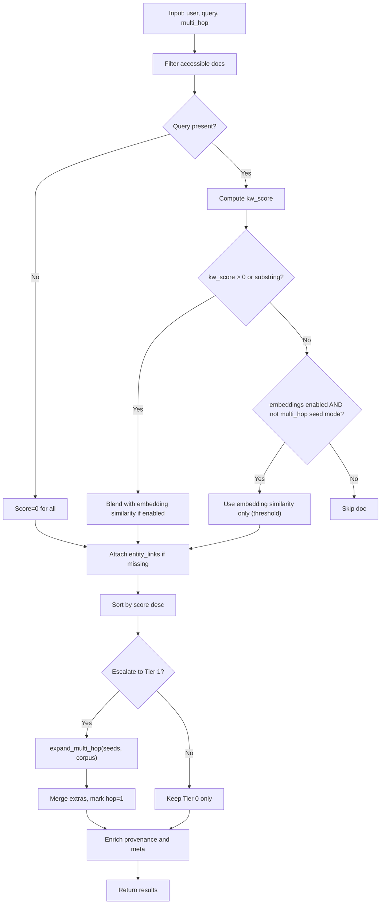
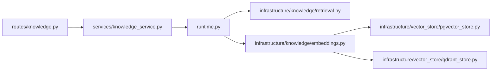

# Tiered Retrieval Engine

<cite>
**Referenced Files in This Document**
- [retrieval.py](file://backend/app/infrastructure/knowledge/retrieval.py)
- [runtime.py](file://backend/app/runtime.py)
- [knowledge_service.py](file://backend/app/services/knowledge_service.py)
- [knowledge.py](file://backend/app/api/v1/routes/knowledge.py)
- [test_retrieval.py](file://backend/app/tests/unit/test_retrieval.py)
- [pgvector_store.py](file://backend/app/infrastructure/vector_store/pgvector_store.py)
- [qdrant_store.py](file://backend/app/infrastructure/vector_store/qdrant_store.py)
</cite>

## Table of Contents
1. [Introduction](#introduction)
2. [Project Structure](#project-structure)
3. [Core Components](#core-components)
4. [Architecture Overview](#architecture-overview)
5. [Detailed Component Analysis](#detailed-component-analysis)
6. [Dependency Analysis](#dependency-analysis)
7. [Performance Considerations](#performance-considerations)
8. [Troubleshooting Guide](#troubleshooting-guide)
9. [Conclusion](#conclusion)
10. [Appendices](#appendices)

## Introduction
This document explains the tiered retrieval engine that combines keyword-based filtering with semantic vector search and entity-link multi-hop expansion. It covers the query processing pipeline, relevance scoring algorithms, result ranking mechanisms, tier selection logic based on query complexity, hybrid search strategies, cross-domain querying via shared entities, result fusion techniques, caching considerations, query optimization, performance monitoring hooks, and examples for customizing retrieval strategies and scoring functions.

## Project Structure
The tiered retrieval is implemented as a layered system:
- API layer exposes knowledge search endpoints.
- Service layer delegates to runtime orchestration.
- Runtime orchestrates permission checks, indexing, embedding, graph extraction, and retrieval tiers.
- Infrastructure provides retrieval utilities (keyword scoring, entity linking, multi-hop expansion), embeddings, and optional vector store integration.

**Diagram sources**
- [knowledge.py:1-60](file://backend/app/api/v1/routes/knowledge.py#L1-L60)
- [knowledge_service.py:1-30](file://backend/app/services/knowledge_service.py#L1-L30)
- [runtime.py:2498-2668](file://backend/app/runtime.py#L2498-L2668)
- [retrieval.py:1-134](file://backend/app/infrastructure/knowledge/retrieval.py#L1-L134)
- [pgvector_store.py:1-200](file://backend/app/infrastructure/vector_store/pgvector_store.py#L1-L200)
- [qdrant_store.py:1-200](file://backend/app/infrastructure/vector_store/qdrant_store.py#L1-L200)

**Section sources**
- [knowledge.py:1-60](file://backend/app/api/v1/routes/knowledge.py#L1-L60)
- [knowledge_service.py:1-30](file://backend/app/services/knowledge_service.py#L1-L30)
- [runtime.py:2498-2668](file://backend/app/runtime.py#L2498-L2668)
- [retrieval.py:1-134](file://backend/app/infrastructure/knowledge/retrieval.py#L1-L134)
- [pgvector_store.py:1-200](file://backend/app/infrastructure/vector_store/pgvector_store.py#L1-L200)
- [qdrant_store.py:1-200](file://backend/app/infrastructure/vector_store/qdrant_store.py#L1-L200)

## Core Components
- Tiered retrieval utilities:
  - Keyword hit scoring and substring fallback.
  - Entity link extraction for lightweight graph edges.
  - Multi-hop expansion over shared entities.
  - Escalation decision based on relational cues.
- Runtime orchestration:
  - Permission-scoped document access.
  - Indexing path with entity links, graph extraction, and optional embedding upsert.
  - Search pipeline combining Tier 0 (keyword + embedding blend) and Tier 1 (entity-link expansion).
  - Provenance enrichment and response metadata.
- Vector store integration:
  - Optional PGVector upsert during indexing.
  - Optional Qdrant-backed vector operations (interface present).

Key responsibilities:
- retrieval.py: pure functions for scoring, entity linking, and multi-hop expansion.
- runtime.py: end-to-end orchestration of indexing and retrieval, including provenance and meta.
- knowledge_service.py: thin service wrapper around runtime methods.
- routes/knowledge.py: HTTP endpoints exposing index and search.

**Section sources**
- [retrieval.py:1-134](file://backend/app/infrastructure/knowledge/retrieval.py#L1-L134)
- [runtime.py:2498-2668](file://backend/app/runtime.py#L2498-L2668)
- [knowledge_service.py:1-30](file://backend/app/services/knowledge_service.py#L1-L30)
- [knowledge.py:1-60](file://backend/app/api/v1/routes/knowledge.py#L1-L60)

## Architecture Overview
The retrieval pipeline follows a two-tier strategy:
- Tier 0: Keyword search with mandatory provenance; optional embedding blending when enabled.
- Tier 1: Lightweight entity-link multi-hop expansion from Tier 0 seeds when relational cues are detected or explicitly requested.

**Diagram sources**
- [knowledge.py:1-60](file://backend/app/api/v1/routes/knowledge.py#L1-L60)
- [knowledge_service.py:1-30](file://backend/app/services/knowledge_service.py#L1-L30)
- [runtime.py:2552-2668](file://backend/app/runtime.py#L2552-L2668)
- [retrieval.py:71-134](file://backend/app/infrastructure/knowledge/retrieval.py#L71-L134)

## Detailed Component Analysis

### Tier Selection Logic
- Default tier is 0.
- Escalation to Tier 1 occurs when:
  - Query contains relational/multi-hop cues (e.g., “related”, “linked”, “depends on”), or
  - The caller explicitly requests multi-hop expansion.
- When escalating, all Tier 0 results can be used as seeds (precision mode) or top-K seeds (recall mode).

**Diagram sources**
- [retrieval.py:81-87](file://backend/app/infrastructure/knowledge/retrieval.py#L81-L87)
- [runtime.py:2621-2633](file://backend/app/runtime.py#L2621-L2633)

**Section sources**
- [retrieval.py:14-28](file://backend/app/infrastructure/knowledge/retrieval.py#L14-L28)
- [runtime.py:2621-2633](file://backend/app/runtime.py#L2621-L2633)

### Query Processing Pipeline
- Access control: documents filtered by organization, role allow-lists, and status.
- Scoring:
  - Keyword overlap score computed over tokenized query vs title+content.
  - Substring match fallback for short queries.
  - Optional embedding similarity blended with keyword score when enabled.
- Ranking: descending by final score.
- Multi-hop expansion:
  - Extract entity links for seed documents.
  - Find other documents sharing entities.
  - Attach hop metadata and merge without duplicates.
- Provenance enrichment:
  - Ensure source_refs include original source paths.
  - Annotate retrieval tier, policy note, captured_by, recorded_at.
- Response metadata:
  - First hit includes search_meta with tier_used, tier0_hits, total_hits, and policy.

**Diagram sources**
- [runtime.py:2552-2668](file://backend/app/runtime.py#L2552-L2668)
- [retrieval.py:71-134](file://backend/app/infrastructure/knowledge/retrieval.py#L71-L134)

**Section sources**
- [runtime.py:2552-2668](file://backend/app/runtime.py#L2552-L2668)
- [retrieval.py:71-134](file://backend/app/infrastructure/knowledge/retrieval.py#L71-L134)

### Relevance Scoring Algorithms
- Keyword overlap score:
  - Tokenize query into terms longer than 2 characters.
  - Count matches against lowercased title+content.
  - Normalize by number of query terms.
- Substring fallback:
  - For very short queries, treat exact substring presence as a positive signal.
- Embedding blend:
  - When embeddings are enabled and there is a keyword hit or substring match, blend keyword and cosine similarity with fixed weights.
  - If no keyword hit and not in multi-hop seed mode, use embedding similarity alone above a threshold.

Complexity:
- Keyword scoring: O(N) per document where N is number of unique query terms.
- Embedding similarity: O(d) per document where d is embedding dimension.
- Overall Tier 0: O(D*(N+d)) for D accessible documents.

Optimization opportunities:
- Precompute embeddings and cache them per document.
- Use inverted indices for term frequency to speed up keyword scoring.
- Threshold early on embedding similarity to avoid expensive computations.

**Section sources**
- [retrieval.py:71-79](file://backend/app/infrastructure/knowledge/retrieval.py#L71-L79)
- [runtime.py:2584-2610](file://backend/app/runtime.py#L2584-L2610)

### Result Ranking and Fusion
- Primary sort key: retrieval_score (descending).
- Tier 1 extras appended after Tier 0, preserving order within each tier.
- Deduplication by document id prevents duplicates across hops.
- Final provenance fields ensure consistent traceability and tier annotation.

Fusion technique:
- Concatenative fusion with tier-aware ordering and deduplication.
- Optional client-side re-ranking using additional signals (e.g., recency, authority) can be layered atop this baseline.

**Section sources**
- [runtime.py:2620-2668](file://backend/app/runtime.py#L2620-L2668)
- [retrieval.py:95-134](file://backend/app/infrastructure/knowledge/retrieval.py#L95-L134)

### Cross-Domain Querying via Shared Entities
- Entity patterns capture workflows, policies, agents, document paths, and risk tiers.
- Multi-hop expansion finds documents sharing any extracted entity, enabling cross-domain discovery (e.g., SOP referencing a policy).
- Metadata attached to expanded hits includes shared_entities and linked_from for explainability.

**Section sources**
- [retrieval.py:30-68](file://backend/app/infrastructure/knowledge/retrieval.py#L30-L68)
- [retrieval.py:89-134](file://backend/app/infrastructure/knowledge/retrieval.py#L89-L134)

### Hybrid Search Strategies
- Pure keyword mode: fast, deterministic, always returns provenance.
- Hybrid mode (when embeddings enabled): blends keyword and embedding scores for ranked keyword hits.
- Semantic-only mode: allowed only when not acting as multi-hop seeds, with a similarity threshold to avoid noise.

**Section sources**
- [runtime.py:2584-2610](file://backend/app/runtime.py#L2584-L2610)

### Caching Strategies
- Embedding cache:
  - Documents may already have stored embeddings; reuse when available to avoid recomputation.
- In-memory caches:
  - Candidate: cache recent query vectors and top-k results keyed by normalized query text and flags (multi_hop).
- Vector store cache:
  - Leverage underlying vector DB indexes for similarity lookups.

Implementation notes:
- Prefer document-level embedding reuse to minimize redundant calls.
- Add application-level TTL-based cache for frequent queries.

[No sources needed since this section provides general guidance]

### Query Optimization
- Early exits:
  - Skip documents failing basic filters (role, status).
  - Skip embedding computation if not needed.
- Thresholding:
  - Apply minimum similarity thresholds for semantic-only hits.
- Seed selection:
  - Use top-K seeds for recall-oriented queries; use all seeds for precision-oriented multi-hop.

**Section sources**
- [runtime.py:2584-2610](file://backend/app/runtime.py#L2584-L2610)
- [runtime.py:2621-2633](file://backend/app/runtime.py#L2621-L2633)

### Performance Monitoring
- Response metadata:
  - search_meta includes tier_used, tier0_hits, total_hits, and policy reference.
- Audit logging:
  - Knowledge indexing emits events with counts of entity links and graph nodes.
- Metrics hooks:
  - Integrate counters/histograms around search latency, tier usage, and embedding calls.

**Section sources**
- [runtime.py:2656-2668](file://backend/app/runtime.py#L2656-L2668)
- [runtime.py:2525-2540](file://backend/app/runtime.py#L2525-L2540)

### Custom Retrieval Strategies and Scoring Functions
- Custom keyword scorer:
  - Replace the keyword overlap function with BM25-like weighting or positional boosting.
- Custom entity linker:
  - Extend regex patterns or integrate an NER model to detect domain-specific entities.
- Custom multi-hop expansion:
  - Implement weighted edge scoring based on entity type co-occurrence frequency.
- Custom fusion:
  - Combine Tier 0 and Tier 1 scores using learned weights or monotonic regression.

Example references:
- See the existing keyword scorer and entity extractor for extension points.
- See the multi-hop expansion for hooking alternative neighbor selection.

**Section sources**
- [retrieval.py:71-79](file://backend/app/infrastructure/knowledge/retrieval.py#L71-L79)
- [retrieval.py:39-68](file://backend/app/infrastructure/knowledge/retrieval.py#L39-L68)
- [retrieval.py:95-134](file://backend/app/infrastructure/knowledge/retrieval.py#L95-L134)

## Dependency Analysis
High-level dependencies among components involved in retrieval:

**Diagram sources**
- [knowledge.py:1-60](file://backend/app/api/v1/routes/knowledge.py#L1-L60)
- [knowledge_service.py:1-30](file://backend/app/services/knowledge_service.py#L1-L30)
- [runtime.py:2498-2668](file://backend/app/runtime.py#L2498-L2668)
- [retrieval.py:1-134](file://backend/app/infrastructure/knowledge/retrieval.py#L1-L134)
- [pgvector_store.py:1-200](file://backend/app/infrastructure/vector_store/pgvector_store.py#L1-L200)
- [qdrant_store.py:1-200](file://backend/app/infrastructure/vector_store/qdrant_store.py#L1-L200)

**Section sources**
- [knowledge.py:1-60](file://backend/app/api/v1/routes/knowledge.py#L1-L60)
- [knowledge_service.py:1-30](file://backend/app/services/knowledge_service.py#L1-L30)
- [runtime.py:2498-2668](file://backend/app/runtime.py#L2498-L2668)
- [retrieval.py:1-134](file://backend/app/infrastructure/knowledge/retrieval.py#L1-L134)
- [pgvector_store.py:1-200](file://backend/app/infrastructure/vector_store/pgvector_store.py#L1-L200)
- [qdrant_store.py:1-200](file://backend/app/infrastructure/vector_store/qdrant_store.py#L1-L200)

## Performance Considerations
- Prefer Tier 0 for low-latency responses; enable Tier 1 selectively for complex queries.
- Cache embeddings and frequently accessed documents to reduce repeated work.
- Tune embedding thresholds and top-K seed sizes to balance precision and recall.
- Monitor tier usage and latency via search_meta and audit logs.

[No sources needed since this section provides general guidance]

## Troubleshooting Guide
Common issues and diagnostics:
- Missing provenance:
  - Ensure documents have source_refs populated; the pipeline appends source paths automatically.
- Unexpected Tier 1 results:
  - Check for relational cues in the query or explicit multi_hop flag.
- Low semantic recall:
  - Verify embeddings are enabled and documents have embeddings; adjust threshold or switch to hybrid mode.
- Slow searches:
  - Reduce top-K seeds, disable embeddings for simple queries, and add caching.

Validation tests:
- Unit tests assert Tier 0 provenance, Tier 1 multi-hop expansion, and entity link extraction behavior.

**Section sources**
- [test_retrieval.py:25-128](file://backend/app/tests/unit/test_retrieval.py#L25-L128)
- [runtime.py:2634-2668](file://backend/app/runtime.py#L2634-L2668)

## Conclusion
The tiered retrieval engine delivers a pragmatic, extensible approach to hybrid search:
- Fast, deterministic Tier 0 with strong provenance guarantees.
- Optional Tier 1 multi-hop expansion powered by lightweight entity linking.
- Flexible blending of keyword and embedding signals.
- Clear extension points for custom scorers, linkers, and fusion strategies.

[No sources needed since this section summarizes without analyzing specific files]

## Appendices

### API Endpoints Summary
- Index a knowledge document:
  - Endpoint: POST /api/v1/knowledge/{document_id}/index
  - Behavior: extracts entity links, builds graph, optionally computes embeddings and upserts to vector store.
- Search knowledge:
  - Endpoint: POST /api/v1/knowledge/search
  - Parameters: query, multi_hop
  - Behavior: runs Tier 0 and optional Tier 1, enriches provenance, returns search_meta.

**Section sources**
- [knowledge.py:52-60](file://backend/app/api/v1/routes/knowledge.py#L52-L60)
- [knowledge_service.py:1-30](file://backend/app/services/knowledge_service.py#L1-L30)
- [runtime.py:2498-2668](file://backend/app/runtime.py#L2498-L2668)