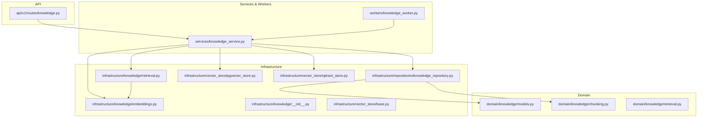
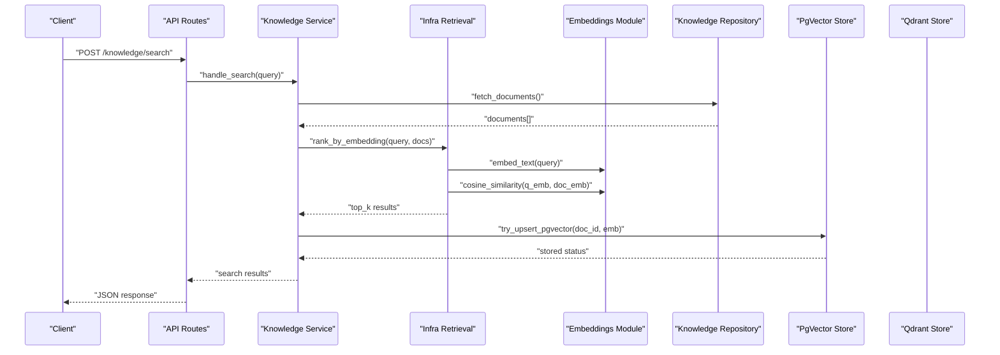
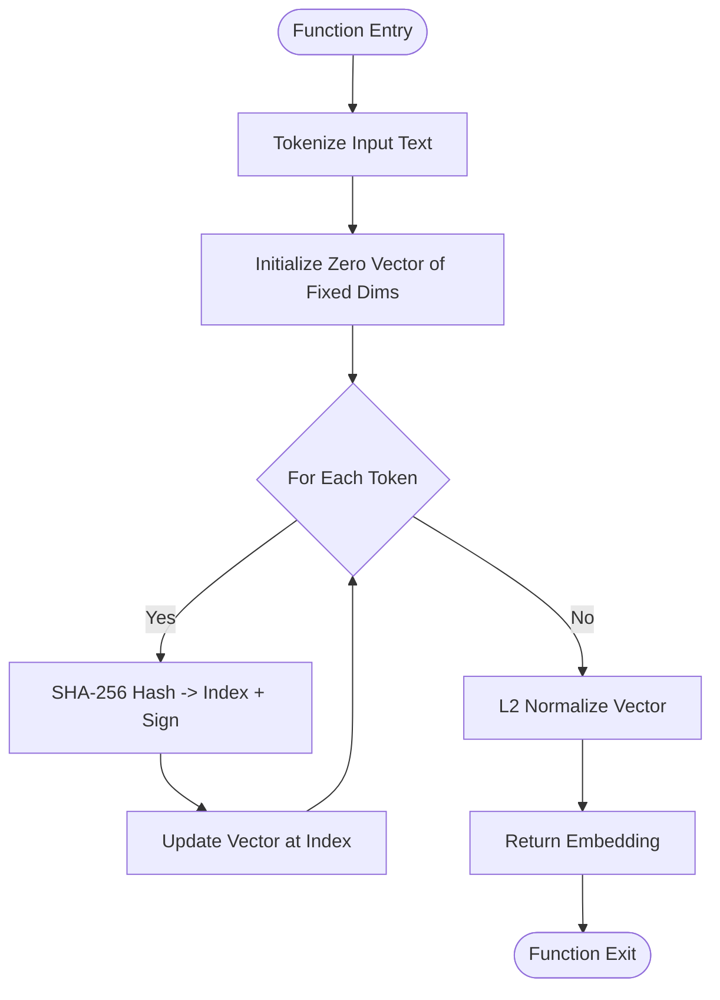
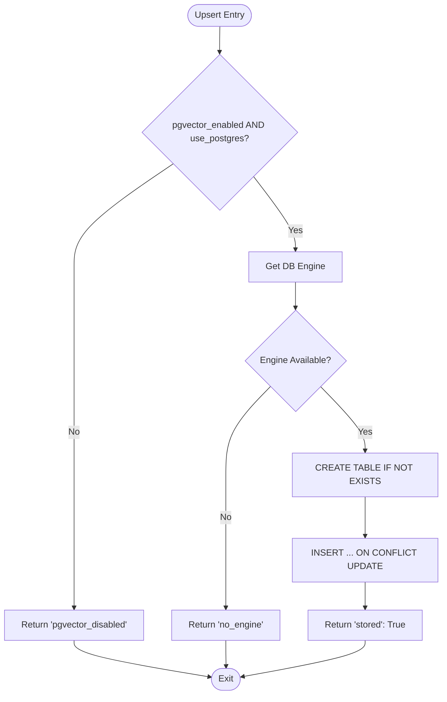
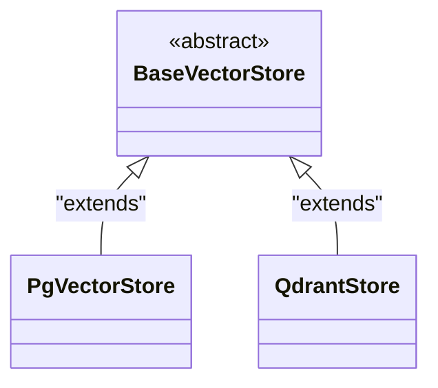
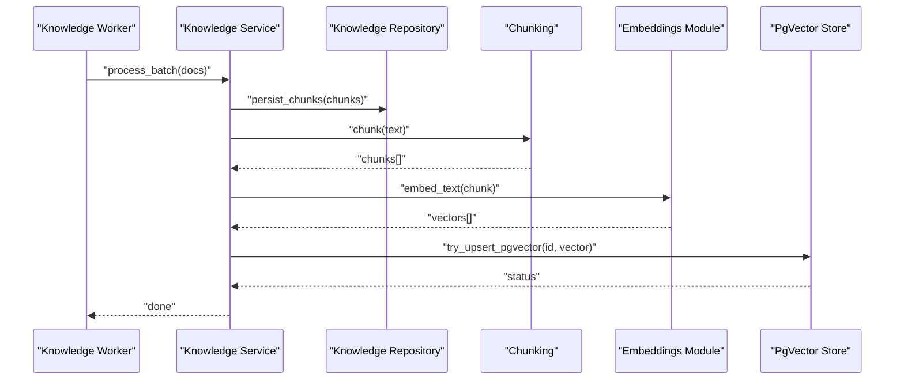
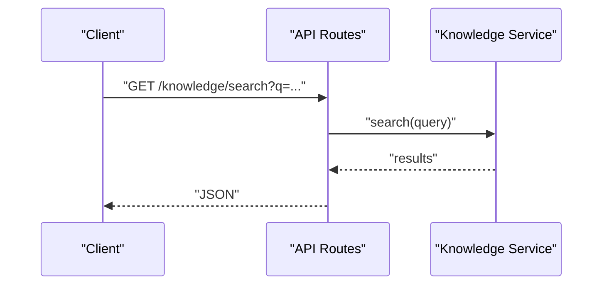
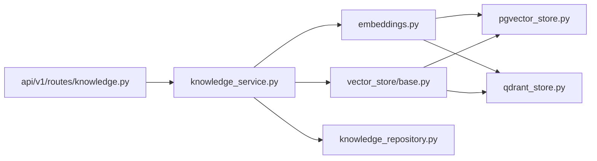

# Vector Embeddings System

<cite>
**Referenced Files in This Document**
- [embeddings.py](file://backend/app/infrastructure/knowledge/embeddings.py)
- [base.py](file://backend/app/infrastructure/vector_store/base.py)
- [pgvector_store.py](file://backend/app/infrastructure/vector_store/pgvector_store.py)
- [qdrant_store.py](file://backend/app/infrastructure/vector_store/qdrant_store.py)
- [knowledge.py](file://backend/app/api/v1/routes/knowledge.py)
- [chunking.py](file://backend/app/domain/knowledge/chunking.py)
- [models.py](file://backend/app/domain/knowledge/models.py)
- [retrieval.py](file://backend/app/domain/knowledge/retrieval.py)
- [__init__.py](file://backend/app/infrastructure/knowledge/__init__.py)
- [retrieval.py](file://backend/app/infrastructure/knowledge/retrieval.py)
- [knowledge_repository.py](file://backend/app/infrastructure/repositories/knowledge_repository.py)
- [knowledge.py](file://backend/app/schemas/knowledge.py)
- [knowledge_service.py](file://backend/app/services/knowledge_service.py)
- [knowledge_worker.py](file://backend/app/workers/knowledge_worker.py)
</cite>

## Table of Contents
1. [Introduction](#introduction)
2. [Project Structure](#project-structure)
3. [Core Components](#core-components)
4. [Architecture Overview](#architecture-overview)
5. [Detailed Component Analysis](#detailed-component-analysis)
6. [Dependency Analysis](#dependency-analysis)
7. [Performance Considerations](#performance-considerations)
8. [Troubleshooting Guide](#troubleshooting-guide)
9. [Conclusion](#conclusion)
10. [Appendices](#appendices)

## Introduction
This document explains the vector embeddings system, focusing on embedding model selection, generation, configuration, and retrieval. It covers:
- Deterministic local embeddings for fast, offline ranking
- Optional persistence to PostgreSQL (pgvector-compatible storage via a text column)
- A vector store abstraction layer with placeholder implementations for pgvector and Qdrant
- Similarity search algorithms, distance metrics, and indexing strategies
- Dimension management, normalization techniques, and performance tuning
- Scalability considerations, memory optimization, and distributed search patterns
- Examples for extending custom embedding providers and backend implementations

## Project Structure
The vector embeddings system spans domain, infrastructure, services, API routes, and workers. The key areas are:
- Domain models and chunking utilities
- Infrastructure knowledge embeddings and retrieval helpers
- Vector store abstraction layer (pgvector and Qdrant placeholders)
- Services and workers orchestrating ingestion and retrieval
- API routes exposing knowledge operations

**Diagram sources**
- [embeddings.py:1-90](file://backend/app/infrastructure/knowledge/embeddings.py#L1-L90)
- [base.py:1-3](file://backend/app/infrastructure/vector_store/base.py#L1-L3)
- [pgvector_store.py:1-6](file://backend/app/infrastructure/vector_store/pgvector_store.py#L1-L6)
- [qdrant_store.py:1-6](file://backend/app/infrastructure/vector_store/qdrant_store.py#L1-L6)
- [knowledge.py](file://backend/app/api/v1/routes/knowledge.py)
- [chunking.py](file://backend/app/domain/knowledge/chunking.py)
- [models.py:1-2](file://backend/app/domain/knowledge/models.py#L1-L2)
- [retrieval.py](file://backend/app/domain/knowledge/retrieval.py)
- [__init__.py](file://backend/app/infrastructure/knowledge/__init__.py)
- [retrieval.py](file://backend/app/infrastructure/knowledge/retrieval.py)
- [knowledge_repository.py](file://backend/app/infrastructure/repositories/knowledge_repository.py)
- [knowledge_service.py](file://backend/app/services/knowledge_service.py)
- [knowledge_worker.py](file://backend/app/workers/knowledge_worker.py)

**Section sources**
- [embeddings.py:1-90](file://backend/app/infrastructure/knowledge/embeddings.py#L1-L90)
- [base.py:1-3](file://backend/app/infrastructure/vector_store/base.py#L1-L3)
- [pgvector_store.py:1-6](file://backend/app/infrastructure/vector_store/pgvector_store.py#L1-L6)
- [qdrant_store.py:1-6](file://backend/app/infrastructure/vector_store/qdrant_store.py#L1-L6)
- [knowledge.py](file://backend/app/api/v1/routes/knowledge.py)
- [chunking.py](file://backend/app/domain/knowledge/chunking.py)
- [models.py:1-2](file://backend/app/domain/knowledge/models.py#L1-L2)
- [retrieval.py](file://backend/app/domain/knowledge/retrieval.py)
- [__init__.py](file://backend/app/infrastructure/knowledge/__init__.py)
- [retrieval.py](file://backend/app/infrastructure/knowledge/retrieval.py)
- [knowledge_repository.py](file://backend/app/infrastructure/repositories/knowledge_repository.py)
- [knowledge_service.py](file://backend/app/services/knowledge_service.py)
- [knowledge_worker.py](file://backend/app/workers/knowledge_worker.py)

## Core Components
- Deterministic local embeddings: hashing-trick vectors with L2 normalization and cosine similarity scoring
- Optional pgvector persistence: best-effort upsert into a Postgres table storing embeddings as text for portability
- Vector store abstraction: base class and placeholder implementations for pgvector and Qdrant backends
- Knowledge orchestration: chunking, retrieval, repository access, service layer, and worker integration

Key responsibilities:
- Generate stable embeddings without external model dependencies
- Rank documents by similarity to queries
- Persist embeddings optionally to Postgres
- Provide an extensible interface for multiple vector backends

**Section sources**
- [embeddings.py:1-90](file://backend/app/infrastructure/knowledge/embeddings.py#L1-L90)
- [base.py:1-3](file://backend/app/infrastructure/vector_store/base.py#L1-L3)
- [pgvector_store.py:1-6](file://backend/app/infrastructure/vector_store/pgvector_store.py#L1-L6)
- [qdrant_store.py:1-6](file://backend/app/infrastructure/vector_store/qdrant_store.py#L1-L6)

## Architecture Overview
The system follows a layered architecture:
- API routes accept knowledge requests
- Service layer coordinates chunking, embedding generation, and retrieval
- Infrastructure provides deterministic embeddings and optional pgvector persistence
- Vector store abstraction allows plugging in pgvector or Qdrant backends
- Workers handle asynchronous processing where needed

**Diagram sources**
- [knowledge.py](file://backend/app/api/v1/routes/knowledge.py)
- [knowledge_service.py](file://backend/app/services/knowledge_service.py)
- [retrieval.py](file://backend/app/infrastructure/knowledge/retrieval.py)
- [embeddings.py:1-90](file://backend/app/infrastructure/knowledge/embeddings.py#L1-L90)
- [knowledge_repository.py](file://backend/app/infrastructure/repositories/knowledge_repository.py)
- [pgvector_store.py:1-6](file://backend/app/infrastructure/vector_store/pgvector_store.py#L1-L6)
- [qdrant_store.py:1-6](file://backend/app/infrastructure/vector_store/qdrant_store.py#L1-L6)

## Detailed Component Analysis

### Deterministic Local Embeddings
- Tokenization: lowercase split on non-word characters; filters short tokens
- Hashing trick: SHA-256-based index and sign assignment into fixed-size vector
- Normalization: L2 normalization applied to each embedding
- Similarity: cosine similarity computed as dot product of normalized vectors
- Ranking: query embedded once; scored against all documents; top-k returned

**Diagram sources**
- [embeddings.py:13-27](file://backend/app/infrastructure/knowledge/embeddings.py#L13-L27)

**Section sources**
- [embeddings.py:13-47](file://backend/app/infrastructure/knowledge/embeddings.py#L13-L47)

### Optional pgvector Persistence
- Conditional write: only when pgvector is enabled and Postgres is configured
- Best-effort: failures do not break request flow
- Storage format: embeddings stored as text arrays for portability even without vector extension
- Upsert semantics: insert or update by document_id with updated timestamp

**Diagram sources**
- [embeddings.py:50-89](file://backend/app/infrastructure/knowledge/embeddings.py#L50-L89)

**Section sources**
- [embeddings.py:50-89](file://backend/app/infrastructure/knowledge/embeddings.py#L50-L89)

### Vector Store Abstraction Layer
- Base class defines the contract for vector stores
- Placeholder implementations for pgvector and Qdrant allow future full feature parity
- Service layer can select backend based on configuration

**Diagram sources**
- [base.py:1-3](file://backend/app/infrastructure/vector_store/base.py#L1-L3)
- [pgvector_store.py:1-6](file://backend/app/infrastructure/vector_store/pgvector_store.py#L1-L6)
- [qdrant_store.py:1-6](file://backend/app/infrastructure/vector_store/qdrant_store.py#L1-L6)

**Section sources**
- [base.py:1-3](file://backend/app/infrastructure/vector_store/base.py#L1-L3)
- [pgvector_store.py:1-6](file://backend/app/infrastructure/vector_store/pgvector_store.py#L1-L6)
- [qdrant_store.py:1-6](file://backend/app/infrastructure/vector_store/qdrant_store.py#L1-L6)

### Knowledge Orchestration and Retrieval
- Chunking: splits content into manageable segments for embedding
- Retrieval: ranks chunks/documents using embeddings and similarity
- Repository: persists and retrieves knowledge entities
- Service: orchestrates chunking, embedding, retrieval, and optional persistence
- Worker: handles background tasks such as batch embedding and indexing

**Diagram sources**
- [knowledge_worker.py](file://backend/app/workers/knowledge_worker.py)
- [knowledge_service.py](file://backend/app/services/knowledge_service.py)
- [knowledge_repository.py](file://backend/app/infrastructure/repositories/knowledge_repository.py)
- [chunking.py](file://backend/app/domain/knowledge/chunking.py)
- [embeddings.py:1-90](file://backend/app/infrastructure/knowledge/embeddings.py#L1-L90)
- [pgvector_store.py:1-6](file://backend/app/infrastructure/vector_store/pgvector_store.py#L1-L6)

**Section sources**
- [chunking.py](file://backend/app/domain/knowledge/chunking.py)
- [retrieval.py](file://backend/app/domain/knowledge/retrieval.py)
- [models.py:1-2](file://backend/app/domain/knowledge/models.py#L1-L2)
- [__init__.py](file://backend/app/infrastructure/knowledge/__init__.py)
- [retrieval.py](file://backend/app/infrastructure/knowledge/retrieval.py)
- [knowledge_repository.py](file://backend/app/infrastructure/repositories/knowledge_repository.py)
- [knowledge_service.py](file://backend/app/services/knowledge_service.py)
- [knowledge_worker.py](file://backend/app/workers/knowledge_worker.py)

### API Integration
- Exposes endpoints for knowledge operations including search and ingestion
- Delegates to service layer for orchestration
- Returns structured JSON responses

**Diagram sources**
- [knowledge.py](file://backend/app/api/v1/routes/knowledge.py)
- [knowledge_service.py](file://backend/app/services/knowledge_service.py)

**Section sources**
- [knowledge.py](file://backend/app/api/v1/routes/knowledge.py)
- [knowledge_service.py](file://backend/app/services/knowledge_service.py)

## Dependency Analysis
- Embeddings module depends on standard library (hashlib, math, re) and optional SQLAlchemy engine
- Vector store classes depend on the base abstraction
- Service layer depends on repository, chunking, embeddings, and vector store backends
- API routes depend on service layer

**Diagram sources**
- [embeddings.py:1-90](file://backend/app/infrastructure/knowledge/embeddings.py#L1-L90)
- [base.py:1-3](file://backend/app/infrastructure/vector_store/base.py#L1-L3)
- [pgvector_store.py:1-6](file://backend/app/infrastructure/vector_store/pgvector_store.py#L1-L6)
- [qdrant_store.py:1-6](file://backend/app/infrastructure/vector_store/qdrant_store.py#L1-L6)
- [knowledge_service.py](file://backend/app/services/knowledge_service.py)
- [knowledge_repository.py](file://backend/app/infrastructure/repositories/knowledge_repository.py)
- [knowledge.py](file://backend/app/api/v1/routes/knowledge.py)

**Section sources**
- [embeddings.py:1-90](file://backend/app/infrastructure/knowledge/embeddings.py#L1-L90)
- [base.py:1-3](file://backend/app/infrastructure/vector_store/base.py#L1-L3)
- [pgvector_store.py:1-6](file://backend/app/infrastructure/vector_store/pgvector_store.py#L1-L6)
- [qdrant_store.py:1-6](file://backend/app/infrastructure/vector_store/qdrant_store.py#L1-L6)
- [knowledge_service.py](file://backend/app/services/knowledge_service.py)
- [knowledge_repository.py](file://backend/app/infrastructure/repositories/knowledge_repository.py)
- [knowledge.py](file://backend/app/api/v1/routes/knowledge.py)

## Performance Considerations
- Embedding dimension management: choose dims balancing accuracy and memory; default is small for local demos
- Normalization: L2 normalization ensures cosine similarity equals dot product, improving speed
- Batch processing: leverage workers to precompute embeddings and reduce latency on hot paths
- Indexing strategy:
  - In-memory: sort by score for small datasets
  - Database: consider HNSW or IVF indexes if migrating to native pgvector types
- Memory optimization:
  - Stream chunks instead of loading entire corpus
  - Reuse embedding buffers and avoid repeated tokenization
- Distributed search patterns:
  - Partition corpus by tenant or topic
  - Use sharded vector stores (e.g., Qdrant collections per shard)
  - Aggregate top-k across shards before final ranking

[No sources needed since this section provides general guidance]

## Troubleshooting Guide
- pgvector disabled: ensure flags are set and Postgres is reachable
- No database engine: verify connection settings and initialization order
- Schema creation: confirm permissions to create tables if using best-effort mode
- Embedding dimension mismatch: ensure consistent dims across generation and storage
- Search latency: tune top_k, chunk size, and consider pre-indexing

**Section sources**
- [embeddings.py:50-89](file://backend/app/infrastructure/knowledge/embeddings.py#L50-L89)

## Conclusion
The vector embeddings system provides a lightweight, deterministic approach for local ranking with optional pgvector persistence and a flexible vector store abstraction. It supports scalable ingestion via workers and offers clear extension points for custom embedding providers and backend implementations. By tuning dimensions, normalization, and indexing strategies, teams can balance accuracy, latency, and resource usage across diverse use cases.

[No sources needed since this section summarizes without analyzing specific files]

## Appendices

### Configuration Options
- Embedding dimensions: control vector size for trade-offs between quality and memory
- pgvector flags: enable/disable pgvector persistence and Postgres usage
- Top-k: number of results returned from ranking
- Chunk size: affects granularity and retrieval precision

**Section sources**
- [embeddings.py:17-27](file://backend/app/infrastructure/knowledge/embeddings.py#L17-L27)
- [embeddings.py:50-89](file://backend/app/infrastructure/knowledge/embeddings.py#L50-L89)

### Custom Embedding Provider Example
- Implement a function that maps text to a list of floats with fixed dimensions
- Ensure outputs are L2 normalized for cosine similarity compatibility
- Integrate into ranking pipeline by replacing embed_text calls

**Section sources**
- [embeddings.py:17-27](file://backend/app/infrastructure/knowledge/embeddings.py#L17-L27)

### Custom Backend Implementation Example
- Extend BaseVectorStore with methods for upsert, search, and delete
- Implement PgVectorStore using native vector types and HNSW indexes
- Implement QdrantStore using client SDK for collection management and ANN search

**Section sources**
- [base.py:1-3](file://backend/app/infrastructure/vector_store/base.py#L1-L3)
- [pgvector_store.py:1-6](file://backend/app/infrastructure/vector_store/pgvector_store.py#L1-L6)
- [qdrant_store.py:1-6](file://backend/app/infrastructure/vector_store/qdrant_store.py#L1-L6)