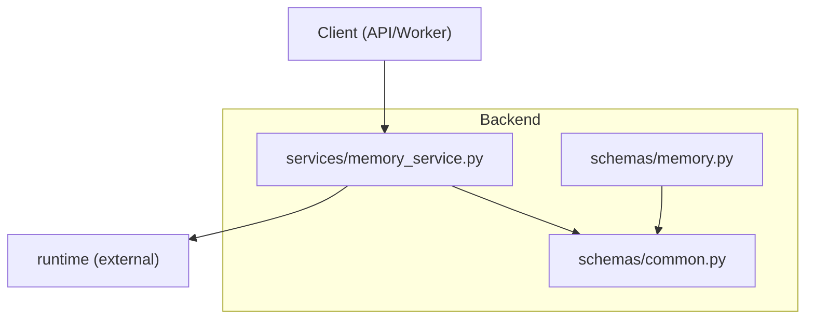
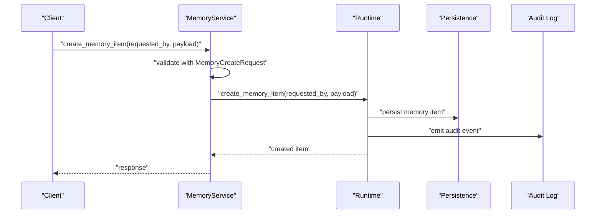
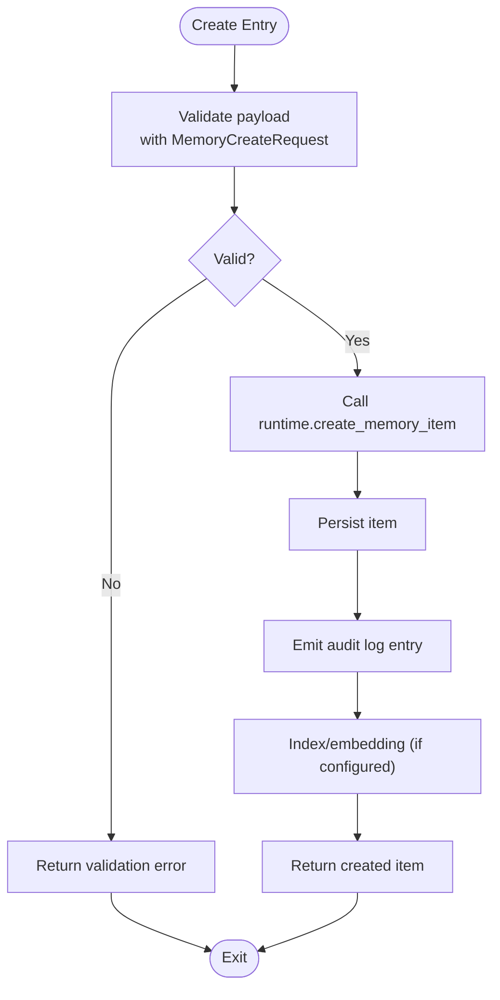
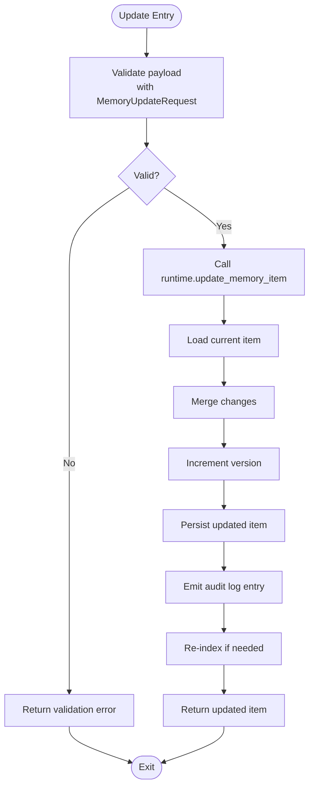
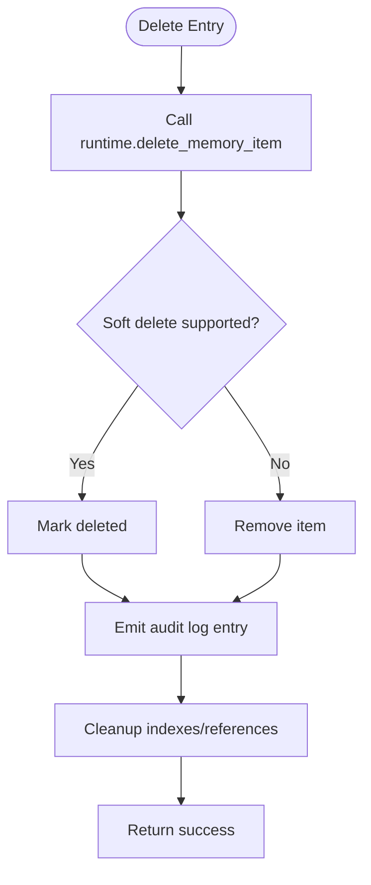
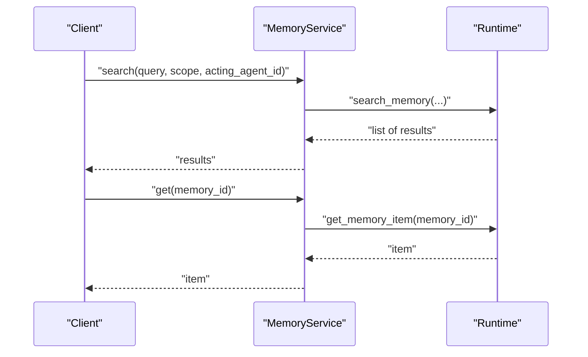
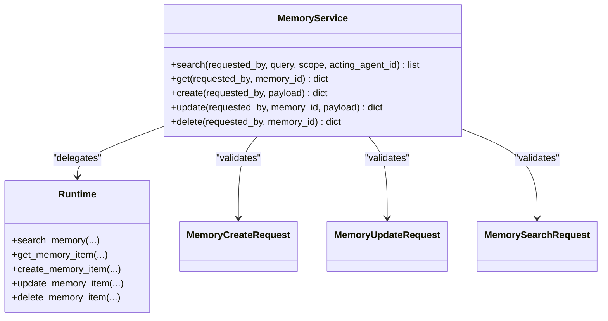

# Memory Item Lifecycle Management

<cite>
**Referenced Files in This Document**
- [memory_service.py](file://backend/app/services/memory_service.py)
- [common.py](file://backend/app/schemas/common.py)
- [memory.py](file://backend/app/schemas/memory.py)
</cite>

## Table of Contents
1. [Introduction](#introduction)
2. [Project Structure](#project-structure)
3. [Core Components](#core-components)
4. [Architecture Overview](#architecture-overview)
5. [Detailed Component Analysis](#detailed-component-analysis)
6. [Dependency Analysis](#dependency-analysis)
7. [Performance Considerations](#performance-considerations)
8. [Troubleshooting Guide](#troubleshooting-guide)
9. [Conclusion](#conclusion)

## Introduction
This document explains the memory item lifecycle management implemented in the backend, focusing on creation, updates, versioning, deletion, provenance tracking, retention and archival, cleanup processes, hooks and event notifications, audit logging integration, concurrent access handling, and conflict resolution strategies. It synthesizes the available implementation details from the service layer and schema definitions to provide a comprehensive guide for developers and operators.

## Project Structure
The memory feature is exposed through a thin service layer that delegates operations to a runtime abstraction. The request/response contracts are defined via Pydantic schemas.

**Diagram sources**
- [memory_service.py:1-27](file://backend/app/services/memory_service.py#L1-L27)
- [common.py:164-210](file://backend/app/schemas/common.py#L164-L210)
- [memory.py:1-2](file://backend/app/schemas/memory.py#L1-L2)

**Section sources**
- [memory_service.py:1-27](file://backend/app/services/memory_service.py#L1-L27)
- [common.py:164-210](file://backend/app/schemas/common.py#L164-L210)
- [memory.py:1-2](file://backend/app/schemas/memory.py#L1-L2)

## Core Components
- Service API: Provides search, get, create, update, and delete operations for memory items. Each method accepts an authenticated user context and forwards the call to the runtime.
- Request Schemas: Define input structures for creating and updating memory items, as well as searching memory. These include fields such as scope, title, content, department, metadata, embedding reference, sensitivity level, allowed roles, and expiration time.

Key responsibilities:
- Input validation and normalization via Pydantic models.
- Delegation to runtime for persistence, indexing, and side effects.
- Consistent error propagation back to callers.

**Section sources**
- [memory_service.py:4-26](file://backend/app/services/memory_service.py#L4-L26)
- [common.py:164-210](file://backend/app/schemas/common.py#L164-L210)

## Architecture Overview
The memory subsystem follows a layered architecture:
- API/Workers call into the memory service.
- The service validates inputs using schemas and delegates to runtime.
- Runtime performs persistence, vector indexing, audit logging, and any background tasks.

**Diagram sources**
- [memory_service.py:17-18](file://backend/app/services/memory_service.py#L17-L18)
- [common.py:164-174](file://backend/app/schemas/common.py#L164-L174)

## Detailed Component Analysis

### Creation Flow
- Inputs validated against MemoryCreateRequest.
- Service forwards to runtime.create_memory_item.
- Expected side effects: persistence, optional embedding/indexing, audit logging, and potential background processing.

**Diagram sources**
- [memory_service.py:17-18](file://backend/app/services/memory_service.py#L17-L18)
- [common.py:164-174](file://backend/app/schemas/common.py#L164-L174)

**Section sources**
- [memory_service.py:17-18](file://backend/app/services/memory_service.py#L17-L18)
- [common.py:164-174](file://backend/app/schemas/common.py#L164-L174)

### Update Flow
- Inputs validated against MemoryUpdateRequest.
- Service forwards to runtime.update_memory_item.
- Expected behavior: partial updates, version bump, audit logging, and re-indexing if relevant fields change.

**Diagram sources**
- [memory_service.py:21-22](file://backend/app/services/memory_service.py#L21-L22)
- [common.py:176-186](file://backend/app/schemas/common.py#L176-L186)

**Section sources**
- [memory_service.py:21-22](file://backend/app/services/memory_service.py#L21-L22)
- [common.py:176-186](file://backend/app/schemas/common.py#L176-L186)

### Delete Flow
- Service forwards to runtime.delete_memory_item.
- Expected behavior: soft or hard delete, audit logging, and index cleanup.

**Diagram sources**
- [memory_service.py:25-26](file://backend/app/services/memory_service.py#L25-L26)

**Section sources**
- [memory_service.py:25-26](file://backend/app/services/memory_service.py#L25-L26)

### Search and Retrieval
- Search supports query, scope, and acting_agent_id filters.
- Get retrieves a specific memory item by ID.

**Diagram sources**
- [memory_service.py:4-14](file://backend/app/services/memory_service.py#L4-L14)
- [common.py:206-210](file://backend/app/schemas/common.py#L206-L210)

**Section sources**
- [memory_service.py:4-14](file://backend/app/services/memory_service.py#L4-L14)
- [common.py:206-210](file://backend/app/schemas/common.py#L206-L210)

### Provenance Tracking and Audit Logging
- All write operations (create, update, delete) should emit audit events via the runtime.
- Recommended audit fields: actor identity, timestamp, action type, resource identifiers, before/after snapshots where applicable, and correlation IDs.
- Integration points:
  - Emit audit entries immediately after successful persistence.
  - Include sensitive field masking rules based on sensitivity_level and allowed_roles.
  - Ensure idempotency keys for retries to avoid duplicate audit entries.

[No sources needed since this section provides general guidance]

### Versioning Strategy
- Maintain a version number per memory item.
- Increment version on each successful update.
- Store previous versions or diffs for rollback and compliance.
- Enforce optimistic concurrency control at the runtime layer using version checks.

[No sources needed since this section provides general guidance]

### Retention Policies, Archival, and Cleanup
- Use expires_at to schedule archival or deletion.
- Background jobs should:
  - Archive items past retention windows.
  - Move archived items to cold storage.
  - Purge expired items according to policy.
- Ensure audit logs remain immutable and retained per compliance requirements.

[No sources needed since this section provides general guidance]

### Hooks and Event Notifications
- Implement pre/post hooks around create/update/delete for:
  - Re-indexing embeddings.
  - Notifying downstream consumers.
  - Triggering governance checks.
- Prefer asynchronous event publishing for non-blocking operations.

[No sources needed since this section provides general guidance]

### Concurrent Access and Conflict Resolution
- Optimistic locking: compare expected version with stored version; reject updates if mismatched.
- Pessimistic locking: lock rows during critical sections when necessary.
- Idempotent writes: accept idempotency tokens to deduplicate retries.
- Conflict responses: return explicit conflict codes and messages to clients.

[No sources needed since this section provides general guidance]

## Dependency Analysis
The memory service depends on:
- Authentication context passed from upstream layers.
- Runtime abstraction for persistence and side effects.
- Schema models for validation.

**Diagram sources**
- [memory_service.py:4-26](file://backend/app/services/memory_service.py#L4-L26)
- [common.py:164-210](file://backend/app/schemas/common.py#L164-L210)

**Section sources**
- [memory_service.py:4-26](file://backend/app/services/memory_service.py#L4-L26)
- [common.py:164-210](file://backend/app/schemas/common.py#L164-L210)

## Performance Considerations
- Batch operations where possible for bulk updates or deletions.
- Asynchronous indexing to avoid blocking write paths.
- Cache frequent reads with short TTLs and invalidation on updates.
- Use pagination and filtering for search endpoints.
- Monitor database and vector store latency; tune connection pools accordingly.

[No sources needed since this section provides general guidance]

## Troubleshooting Guide
Common issues and resolutions:
- Validation errors: ensure payloads conform to MemoryCreateRequest/MemoryUpdateRequest.
- Concurrency conflicts: retry with updated version or implement client-side backoff.
- Missing audit entries: verify runtime emits audit events and check downstream sinks.
- Stale search results: confirm re-indexing occurs after updates and caches are invalidated.

[No sources needed since this section provides general guidance]

## Conclusion
The memory subsystem exposes a concise service interface backed by robust schema validation and a runtime abstraction. To achieve full lifecycle management, ensure the runtime enforces versioning, optimistic concurrency, comprehensive audit logging, and scheduled archival/cleanup. Integrate hooks and events for extensibility while maintaining performance and reliability.