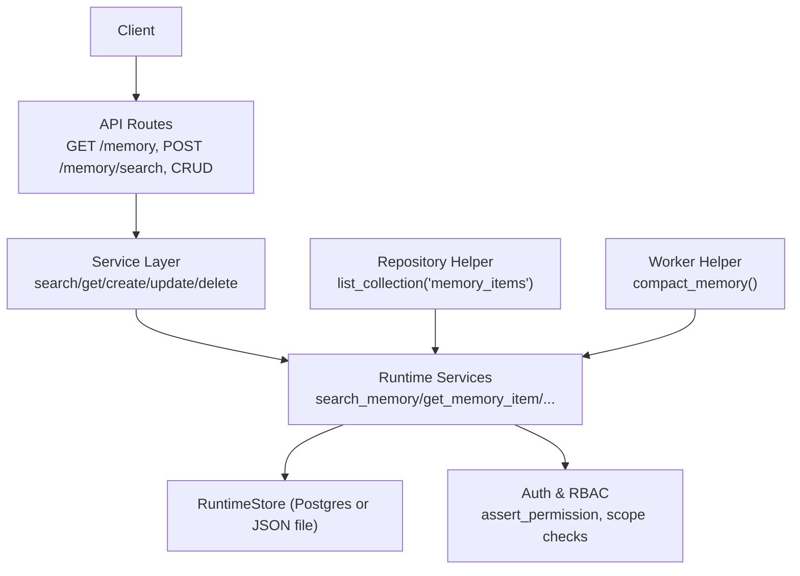
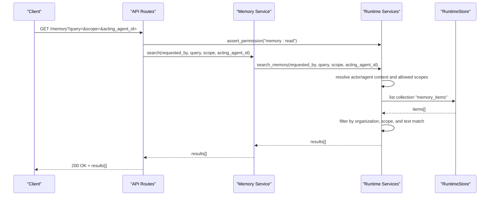
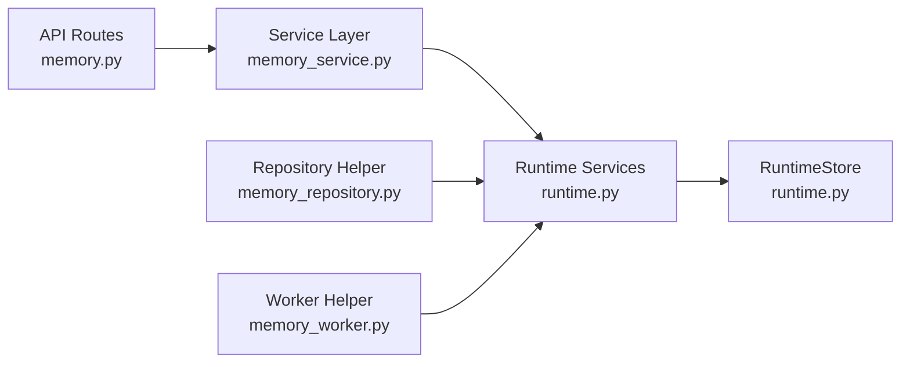

# Memory Retrieval and Query System

<cite>
**Referenced Files in This Document**
- [memory.py](file://backend/app/api/v1/routes/memory.py)
- [memory_service.py](file://backend/app/services/memory_service.py)
- [runtime.py](file://backend/app/runtime.py)
- [memory_repository.py](file://backend/app/infrastructure/repositories/memory_repository.py)
- [memory_worker.py](file://backend/app/workers/memory_worker.py)
</cite>

## Table of Contents
1. [Introduction](#introduction)
2. [Project Structure](#project-structure)
3. [Core Components](#core-components)
4. [Architecture Overview](#architecture-overview)
5. [Detailed Component Analysis](#detailed-component-analysis)
6. [Dependency Analysis](#dependency-analysis)
7. [Performance Considerations](#performance-considerations)
8. [Troubleshooting Guide](#troubleshooting-guide)
9. [Conclusion](#conclusion)

## Introduction
This document explains the memory retrieval and query system implemented in the backend. It covers how memory items are created, updated, deleted, retrieved by ID, and searched with optional filters such as scope and acting agent context. It also documents the underlying persistence layer, authorization model, and current limitations regarding advanced search features like full-text search and semantic similarity matching.

## Project Structure
The memory subsystem follows a layered structure:
- API routes expose HTTP endpoints for memory operations.
- Service functions encapsulate business logic and delegate to runtime services.
- Runtime services implement core functionality including persistence, scoping, and permission checks.
- Repository and worker helpers provide convenience access to collections and background tasks.

**Diagram sources**
- [memory.py:1-48](file://backend/app/api/v1/routes/memory.py#L1-L48)
- [memory_service.py:1-27](file://backend/app/services/memory_service.py#L1-L27)
- [runtime.py:2338-2440](file://backend/app/runtime.py#L2338-L2440)
- [memory_repository.py:1-6](file://backend/app/infrastructure/repositories/memory_repository.py#L1-L6)
- [memory_worker.py:1-6](file://backend/app/workers/memory_worker.py#L1-L6)

**Section sources**
- [memory.py:1-48](file://backend/app/api/v1/routes/memory.py#L1-L48)
- [memory_service.py:1-27](file://backend/app/services/memory_service.py#L1-L27)
- [runtime.py:2338-2440](file://backend/app/runtime.py#L2338-L2440)
- [memory_repository.py:1-6](file://backend/app/infrastructure/repositories/memory_repository.py#L1-L6)
- [memory_worker.py:1-6](file://backend/app/workers/memory_worker.py#L1-L6)

## Core Components
- API Routes: Define endpoints for listing/searching and CRUD operations on memory items. They enforce read permissions and pass parameters to the service layer.
- Service Layer: Thin wrappers that forward calls to runtime methods, keeping route handlers simple.
- Runtime Services: Implement memory item lifecycle operations, scoping, and permission enforcement. Search currently performs basic filtering over in-memory collections.
- Persistence: RuntimeStore persists data either to Postgres (JSONB) or a local JSON file fallback.
- Helpers: Repository helper lists all memory items; worker helper provides a compact operation returning the count of memory items.

Key responsibilities:
- Authorization: Role-based permissions ensure callers have memory:read or memory:write where required.
- Scoping: Agent-scoped memory access is enforced via allowed scopes.
- Persistence: Dual-backend support with automatic migration from JSON to Postgres when available.

**Section sources**
- [memory.py:1-48](file://backend/app/api/v1/routes/memory.py#L1-L48)
- [memory_service.py:1-27](file://backend/app/services/memory_service.py#L1-L27)
- [runtime.py:2338-2440](file://backend/app/runtime.py#L2338-L2440)
- [memory_repository.py:1-6](file://backend/app/infrastructure/repositories/memory_repository.py#L1-L6)
- [memory_worker.py:1-6](file://backend/app/workers/memory_worker.py#L1-L6)

## Architecture Overview
The memory retrieval flow starts at the API layer, passes through the service layer, and executes within runtime services. The runtime enforces permissions and scoping before querying the persistent store.

**Diagram sources**
- [memory.py:11-19](file://backend/app/api/v1/routes/memory.py#L11-L19)
- [memory_service.py:4-10](file://backend/app/services/memory_service.py#L4-L10)
- [runtime.py:2419-2440](file://backend/app/runtime.py#L2419-L2440)

## Detailed Component Analysis

### API Routes
- Endpoints:
  - GET /memory: Supports query, scope, and acting_agent_id parameters. Requires memory:read permission.
  - POST /memory/search: Accepts a structured request body with query, scope, and acting_agent_id. Requires memory:read permission.
  - CRUD endpoints for individual memory items require appropriate permissions and delegate to service functions.

Behavior:
- Permission checks are performed before invoking service functions.
- Parameters are forwarded to the service layer without transformation.

**Section sources**
- [memory.py:11-48](file://backend/app/api/v1/routes/memory.py#L11-L48)

### Service Layer
- Functions:
  - search: Delegates to runtime.search_memory with provided parameters.
  - get, create, update, delete: Delegate to corresponding runtime methods.

Responsibilities:
- Keep route handlers minimal.
- Provide a stable interface for runtime interactions.

**Section sources**
- [memory_service.py:4-27](file://backend/app/services/memory_service.py#L4-L27)

### Runtime Services
Core memory operations:
- create_memory_item: Creates a new memory item after validating permissions and scoping.
- get_memory_item: Retrieves a specific item by ID using search under the hood.
- update_memory_item: Updates an existing item by ID.
- delete_memory_item: Deletes an item by ID.
- search_memory: Performs search across memory items with optional filters.

Search behavior:
- Filters by organization context.
- Applies scope constraints based on agent allowed scopes.
- Applies text filtering against content fields when a query string is provided.
- Returns a list of matching items.

Scoping and permissions:
- assert_permission ensures role-based access control.
- assert_memory_scope_allowed enforces agent-scoped memory access for writes and reads when applicable.

Persistence:
- RuntimeStore manages state in Postgres (JSONB) or JSON file fallback.
- Collections are accessed via store.collection(name), e.g., "memory_items".

**Section sources**
- [runtime.py:2338-2440](file://backend/app/runtime.py#L2338-L2440)
- [runtime.py:862-936](file://backend/app/runtime.py#L862-L936)
- [runtime.py:258-393](file://backend/app/runtime.py#L258-L393)

### Repository and Worker Helpers
- Repository helper:
  - list_memory: Returns all memory items by listing the "memory_items" collection.
- Worker helper:
  - compact_memory: Returns the number of memory items (used for housekeeping or metrics).

These helpers provide convenient access to runtime collections without exposing internal details.

**Section sources**
- [memory_repository.py:1-6](file://backend/app/infrastructure/repositories/memory_repository.py#L1-L6)
- [memory_worker.py:1-6](file://backend/app/workers/memory_worker.py#L1-L6)

### Data Model and Fields
Memory items include fields such as:
- id: Unique identifier.
- organization_id: Tenant scoping.
- owner: User who created the item.
- department: Organizational unit.
- scope: Memory scope (e.g., organization_memory, workflow_memory).
- title: Human-readable title.
- content: Main textual content used for text filtering.
- metadata: Additional key-value pairs.
- embedding_reference: Placeholder for vector embeddings (not used in current search).
- sensitivity_level: Sensitivity classification.
- allowed_roles: Roles permitted to access the item.
- expires_at: Optional expiration timestamp.
- provenance: Source information.
- created_at: Creation timestamp.

Note: Current search does not use embedding_reference for semantic similarity; it relies on text filtering.

**Section sources**
- [runtime.py:787-804](file://backend/app/runtime.py#L787-L804)

## Dependency Analysis
The following diagram shows dependencies between components involved in memory retrieval and queries.

**Diagram sources**
- [memory.py:1-48](file://backend/app/api/v1/routes/memory.py#L1-L48)
- [memory_service.py:1-27](file://backend/app/services/memory_service.py#L1-L27)
- [runtime.py:2338-2440](file://backend/app/runtime.py#L2338-L2440)
- [memory_repository.py:1-6](file://backend/app/infrastructure/repositories/memory_repository.py#L1-L6)
- [memory_worker.py:1-6](file://backend/app/workers/memory_worker.py#L1-L6)

**Section sources**
- [memory.py:1-48](file://backend/app/api/v1/routes/memory.py#L1-L48)
- [memory_service.py:1-27](file://backend/app/services/memory_service.py#L1-L27)
- [runtime.py:2338-2440](file://backend/app/runtime.py#L2338-L2440)
- [memory_repository.py:1-6](file://backend/app/infrastructure/repositories/memory_repository.py#L1-L6)
- [memory_worker.py:1-6](file://backend/app/workers/memory_worker.py#L1-L6)

## Performance Considerations
Current implementation characteristics:
- In-memory filtering: Search operates over collections loaded from the store. For large datasets, this can be inefficient.
- No dedicated indexing: Text filtering scans content fields linearly.
- Persistence overhead: Each write triggers persistence to Postgres (if enabled) and a JSON snapshot.

Recommendations for optimization:
- Add database-level indexes on frequently filtered fields (organization_id, scope, created_at).
- Implement server-side pagination for list and search endpoints.
- Introduce caching layers (e.g., in-process cache or Redis) for hot queries.
- Use full-text search capabilities in Postgres (e.g., tsvector/tsquery) for efficient text filtering.
- Consider vector embeddings and a vector store integration for semantic similarity matching.

[No sources needed since this section provides general guidance]

## Troubleshooting Guide
Common issues and resolutions:
- Permission denied errors: Ensure the caller has memory:read or memory:write permissions depending on the operation.
- Scope denied errors: Verify the acting agent’s allowed_memory_scopes includes the requested scope.
- Not found errors: Confirm the memory item exists and is accessible within the organization context.
- Performance degradation: If search is slow, consider adding indexes, pagination, or moving text filtering to the database.

Operational tips:
- Use repository helper to list all memory items for diagnostics.
- Use worker helper to check memory item counts during maintenance tasks.

**Section sources**
- [memory.py:11-48](file://backend/app/api/v1/routes/memory.py#L11-L48)
- [memory_repository.py:1-6](file://backend/app/infrastructure/repositories/memory_repository.py#L1-L6)
- [memory_worker.py:1-6](file://backend/app/workers/memory_worker.py#L1-L6)
- [runtime.py:862-936](file://backend/app/runtime.py#L862-L936)

## Conclusion
The memory retrieval and query system provides a clear, permissioned, and scoped interface for managing memory items. Current search supports basic text filtering and scope-based access control. To scale effectively, adopt database-level indexing, pagination, caching, and advanced search techniques such as full-text search and semantic similarity matching. These enhancements will improve performance and user experience for large-scale memory operations.

[No sources needed since this section summarizes without analyzing specific files]