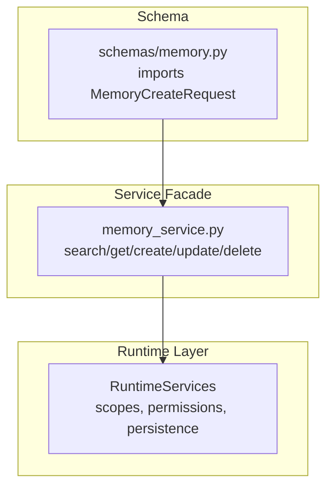
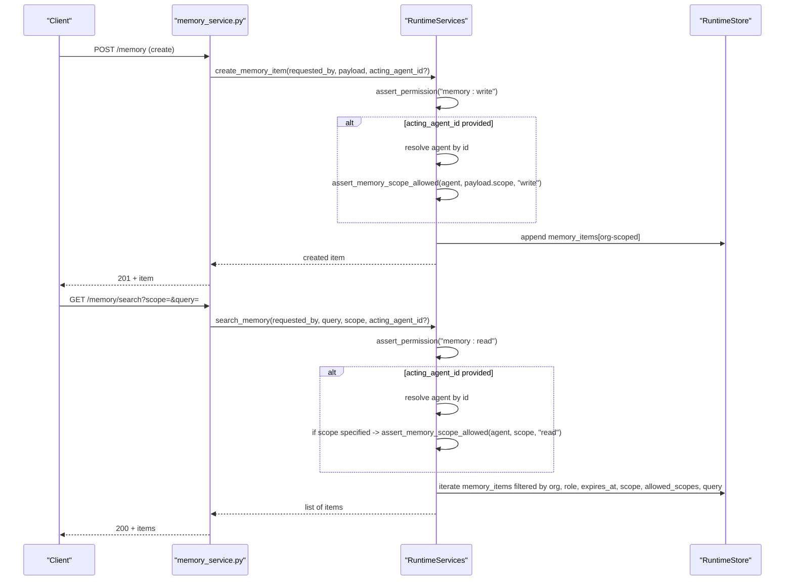
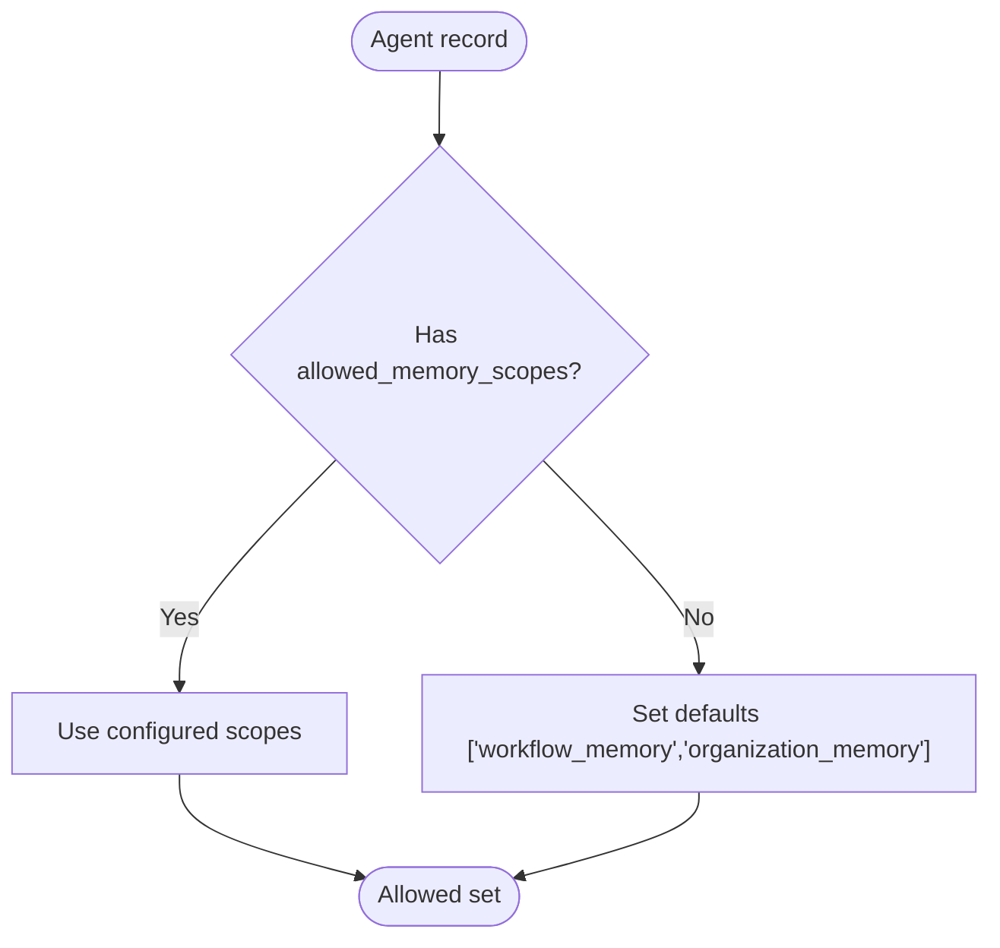
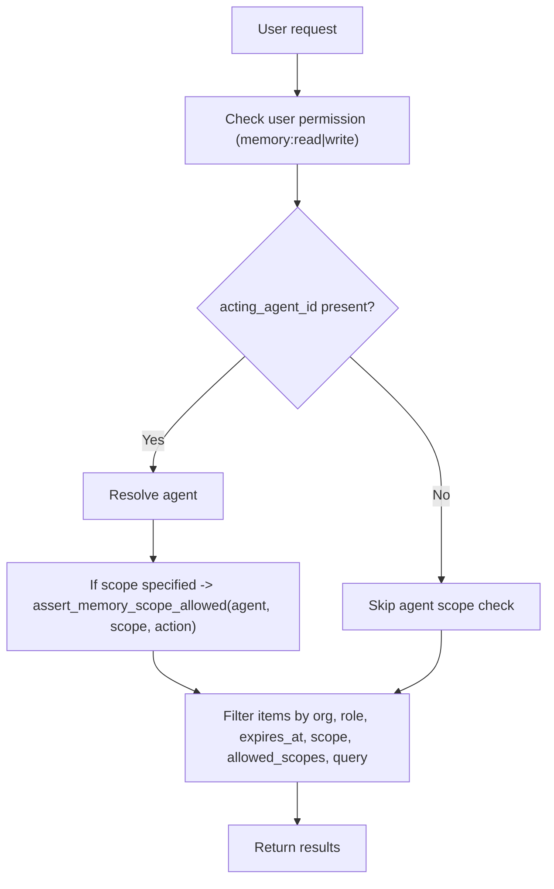
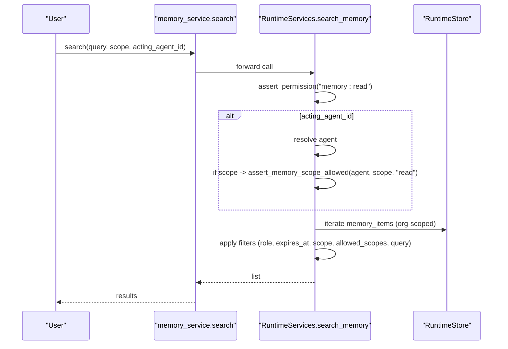
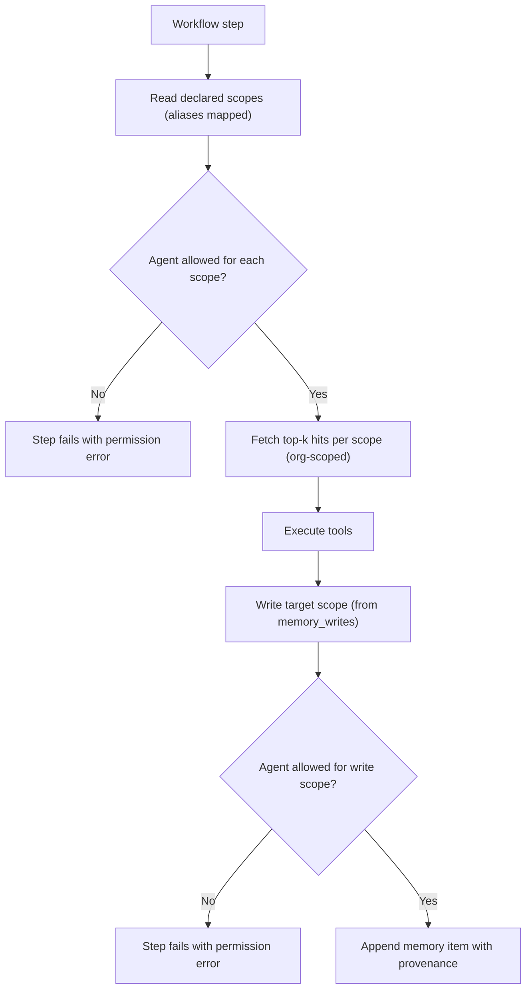

# Memory Scoping and Access Control

<cite>
**Referenced Files in This Document**
- [runtime.py](file://backend/app/runtime.py)
- [memory_service.py](file://backend/app/services/memory_service.py)
- [memory.py](file://backend/app/schemas/memory.py)
</cite>

## Table of Contents
1. [Introduction](#introduction)
2. [Project Structure](#project-structure)
3. [Core Components](#core-components)
4. [Architecture Overview](#architecture-overview)
5. [Detailed Component Analysis](#detailed-component-analysis)
6. [Dependency Analysis](#dependency-analysis)
7. [Performance Considerations](#performance-considerations)
8. [Troubleshooting Guide](#troubleshooting-guide)
9. [Conclusion](#conclusion)

## Introduction
This document explains the memory scoping mechanisms that enforce agent isolation and access control. It covers scope hierarchies, inheritance patterns, permission enforcement, how memory items are tagged with scope metadata, and how retrieval operations respect these boundaries. It also includes examples of scope configuration, cross-scope access patterns, security implications, and performance considerations for scoped queries and caching strategies.

## Project Structure
Memory scoping is implemented within the runtime service layer and exposed via a thin service wrapper. The key files involved are:
- Runtime core logic for scoping, permissions, and persistence
- Service facade for memory operations
- Schema import placeholder for memory requests

**Diagram sources**
- [runtime.py:2339-2461](file://backend/app/runtime.py#L2339-L2461)
- [memory_service.py:1-27](file://backend/app/services/memory_service.py#L1-L27)
- [memory.py:1-2](file://backend/app/schemas/memory.py#L1-L2)

**Section sources**
- [runtime.py:2339-2461](file://backend/app/runtime.py#L2339-L2461)
- [memory_service.py:1-27](file://backend/app/services/memory_service.py#L1-L27)
- [memory.py:1-2](file://backend/app/schemas/memory.py#L1-L2)

## Core Components
- Agent-scoped memory scopes: Each agent has an allow-list of memory scopes it can read/write.
- Organization scoping: All memory items are partitioned by organization_id.
- Role-based access control (RBAC): Users must have memory:read or memory:write to perform operations.
- Item-level role gating: Memory items carry allowed_roles; only matching roles can see them.
- Expiration gating: Expired items are excluded from search results.
- Workflow-driven reads/writes: Workflows declare memory_reads and memory_writes; execution enforces agent scope checks before reading and writing.

Key responsibilities:
- Enforce agent scope allow-lists on both reads and writes
- Filter results by organization, role, expiration, and optional query
- Audit sensitive accesses and write attempts
- Persist items with rich provenance and sensitivity metadata

**Section sources**
- [runtime.py:894-936](file://backend/app/runtime.py#L894-L936)
- [runtime.py:2339-2461](file://backend/app/runtime.py#L2339-L2461)
- [runtime.py:2033-2066](file://backend/app/runtime.py#L2033-L2066)
- [runtime.py:2157-2177](file://backend/app/runtime.py#L2157-L2177)

## Architecture Overview
The memory scoping architecture integrates user RBAC, agent scope policies, and item-level controls into a single enforcement pipeline during create, update, delete, and search operations.

**Diagram sources**
- [memory_service.py:1-27](file://backend/app/services/memory_service.py#L1-L27)
- [runtime.py:2339-2461](file://backend/app/runtime.py#L2339-L2461)
- [runtime.py:894-936](file://backend/app/runtime.py#L894-L936)

## Detailed Component Analysis

### Scope Model and Inheritance
- Allowed scopes per agent: Defined in agent records under allowed_memory_scopes. If missing, defaults to ["workflow_memory", "organization_memory"].
- Backward compatibility: Older agents without explicit scopes receive default scopes at runtime normalization.
- Scope aliases: During workflow execution, certain logical names map to canonical scopes (e.g., event_log → workflow_memory).

**Diagram sources**
- [runtime.py:894-901](file://backend/app/runtime.py#L894-L901)
- [runtime.py:730-755](file://backend/app/runtime.py#L730-L755)
- [runtime.py:2033-2041](file://backend/app/runtime.py#L2033-L2041)

**Section sources**
- [runtime.py:894-901](file://backend/app/runtime.py#L894-L901)
- [runtime.py:730-755](file://backend/app/runtime.py#L730-L755)
- [runtime.py:2033-2041](file://backend/app/runtime.py#L2033-L2041)

### Permission Enforcement
- User-level RBAC: memory:read and memory:write required for search and mutation.
- Agent-level scope checks: When acting as an agent, the requested scope must be in the agent’s allowed set.
- Item-level role gating: Items include allowed_roles; only users whose role matches (or owner) can view them.
- Expiration gating: Items past their expires_at are excluded from search results.

**Diagram sources**
- [runtime.py:2339-2461](file://backend/app/runtime.py#L2339-L2461)
- [runtime.py:894-936](file://backend/app/runtime.py#L894-L936)

**Section sources**
- [runtime.py:2339-2461](file://backend/app/runtime.py#L2339-L2461)
- [runtime.py:894-936](file://backend/app/runtime.py#L894-L936)

### Data Model and Metadata Tags
Memory items include fields that drive scoping and governance:
- organization_id: Partitioning boundary
- scope: Canonical memory scope identifier
- allowed_roles: Role-based visibility filter
- sensitivity_level: Triggers audit logging when accessed
- expires_at: Time-based exclusion from search
- provenance: Source references and capture metadata
- embedding_reference: Optional vector store reference

These tags enable multi-layer filtering and auditing across all operations.

**Section sources**
- [runtime.py:2339-2461](file://backend/app/runtime.py#L2339-L2461)

### Retrieval Operations and Boundaries
- search_memory enforces:
  - Organization scoping
  - Role-based visibility via allowed_roles
  - Expiration filtering
  - Optional exact scope match
  - Agent scope allow-list filtering when acting as an agent
  - Simple substring query over title/content
- get_memory_item delegates to search_memory and selects by id
- update_memory_item and delete_memory_item require ownership or admin/owner role

**Diagram sources**
- [memory_service.py:1-27](file://backend/app/services/memory_service.py#L1-L27)
- [runtime.py:2339-2461](file://backend/app/runtime.py#L2339-L2461)

**Section sources**
- [memory_service.py:1-27](file://backend/app/services/memory_service.py#L1-L27)
- [runtime.py:2339-2461](file://backend/app/runtime.py#L2339-L2461)

### Workflow-Driven Cross-Scope Access
Workflows can declare:
- memory_reads: List of scopes to read during step execution
- memory_writes: Target scope(s) for step output

During execution:
- Reads are pre-checked against the agent’s allowed scopes using alias mapping
- Writes are enforced through the same scope assertion mechanism
- Failures short-circuit the step and record errors

**Diagram sources**
- [runtime.py:2033-2066](file://backend/app/runtime.py#L2033-L2066)
- [runtime.py:2157-2177](file://backend/app/runtime.py#L2157-L2177)

**Section sources**
- [runtime.py:2033-2066](file://backend/app/runtime.py#L2033-L2066)
- [runtime.py:2157-2177](file://backend/app/runtime.py#L2157-L2177)

### Examples of Scope Configuration and Cross-Scope Patterns
- Agent configuration:
  - Set allowed_memory_scopes to restrict which scopes an agent can access
  - Omitting the field falls back to ["workflow_memory", "organization_memory"]
- Workflow configuration:
  - memory_reads lists canonical or aliased scopes to pull context
  - memory_writes specifies where outputs should be persisted
- Cross-scope access:
  - An agent with ["workflow_memory", "organization_memory"] can read/write both scopes
  - An agent limited to ["workflow_memory"] cannot access "organization_memory"
- Admin/API writes:
  - When no acting_agent_id is provided, admin/owner writes bypass agent scope checks but still honor organization scoping and role checks

**Section sources**
- [runtime.py:894-901](file://backend/app/runtime.py#L894-L901)
- [runtime.py:2033-2041](file://backend/app/runtime.py#L2033-L2041)
- [runtime.py:2339-2461](file://backend/app/runtime.py#L2339-L2461)

### Security Implications
- Least privilege: Agents should be granted only the minimal scopes needed
- Role segregation: Combine RBAC with agent scope allow-lists to prevent lateral movement
- Sensitivity auditing: Access to restricted/confidential items is audited
- Expiration hygiene: Ensure expires_at is set for ephemeral data to reduce exposure
- Provenance: Always attach source_refs and captured_by to maintain traceability

**Section sources**
- [runtime.py:2339-2461](file://backend/app/runtime.py#L2339-L2461)

## Dependency Analysis
- memory_service.py forwards calls to RuntimeServices methods
- RuntimeServices implements scoping, RBAC, and persistence
- Schemas module imports a request model used by higher layers

**Diagram sources**
- [memory_service.py:1-27](file://backend/app/services/memory_service.py#L1-L27)
- [runtime.py:2339-2461](file://backend/app/runtime.py#L2339-L2461)
- [memory.py:1-2](file://backend/app/schemas/memory.py#L1-L2)

**Section sources**
- [memory_service.py:1-27](file://backend/app/services/memory_service.py#L1-L27)
- [runtime.py:2339-2461](file://backend/app/runtime.py#L2339-L2461)
- [memory.py:1-2](file://backend/app/schemas/memory.py#L1-L2)

## Performance Considerations
- Query complexity: Current search performs linear scans over organization-scoped items with simple substring matching. For large datasets, consider:
  - Indexing by organization_id, scope, and expires_at
  - Full-text indexing for title/content
  - Vector similarity search for semantic queries
- Caching strategy:
  - Cache frequently accessed scope partitions (per organization and scope) with TTL based on sensitivity_level and expires_at
  - Invalidate cache on mutations (create/update/delete) and on policy changes (agent allowed_memory_scopes)
- Batch reads:
  - Preload agent allow-lists and user roles once per request to avoid repeated lookups
- Write path:
  - Persist to Postgres JSONB when available; keep JSON snapshot for resilience
  - Minimize save frequency by batching updates where safe

[No sources needed since this section provides general guidance]

## Troubleshooting Guide
Common issues and resolutions:
- Permission denied on memory operations:
  - Verify user has memory:read or memory:write
  - If acting as an agent, ensure the requested scope is in the agent’s allowed_memory_scopes
- Empty search results:
  - Check expires_at is not in the past
  - Confirm user role is in item.allowed_roles or is owner
  - Validate scope filter and agent allow-list alignment
- Workflow step failures due to memory:
  - Inspect memory_reads and memory_writes declarations and alias mappings
  - Review step error logs for scope denial messages

**Section sources**
- [runtime.py:2339-2461](file://backend/app/runtime.py#L2339-L2461)
- [runtime.py:2033-2066](file://backend/app/runtime.py#L2033-L2066)
- [runtime.py:2157-2177](file://backend/app/runtime.py#L2157-L2177)

## Conclusion
The memory scoping system combines RBAC, agent scope allow-lists, and item-level controls to enforce strict isolation and access boundaries. By tagging memory items with scope and sensitivity metadata and enforcing checks at both API and workflow execution layers, the system ensures secure, auditable, and predictable behavior. For scale, adopt indexing and caching aligned with the scoping dimensions to maintain performance while preserving security guarantees.