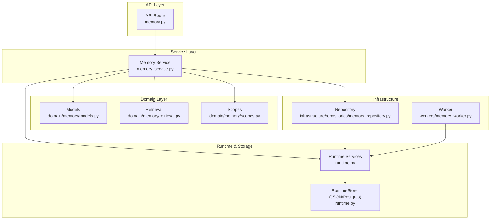
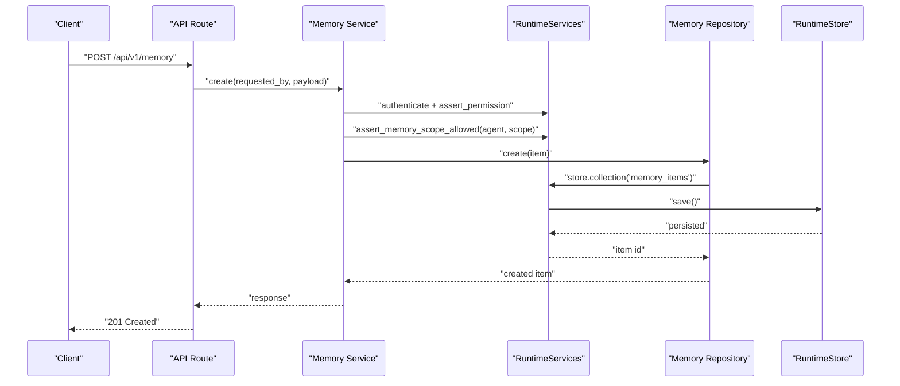
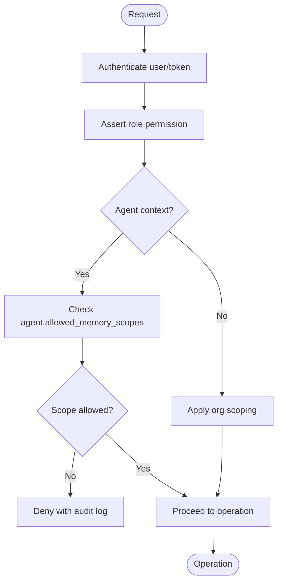
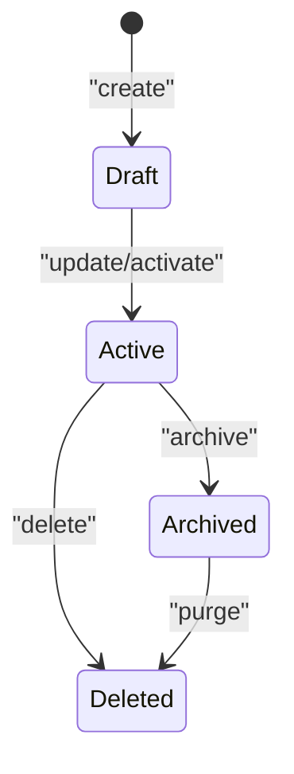
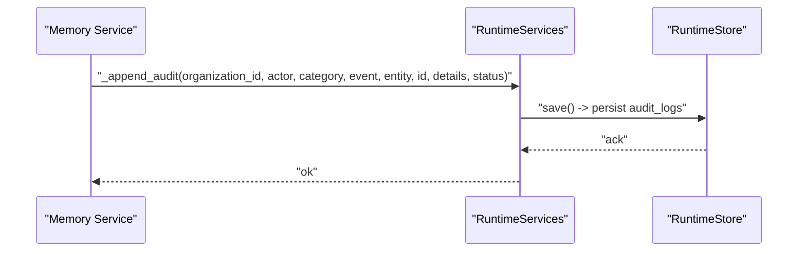
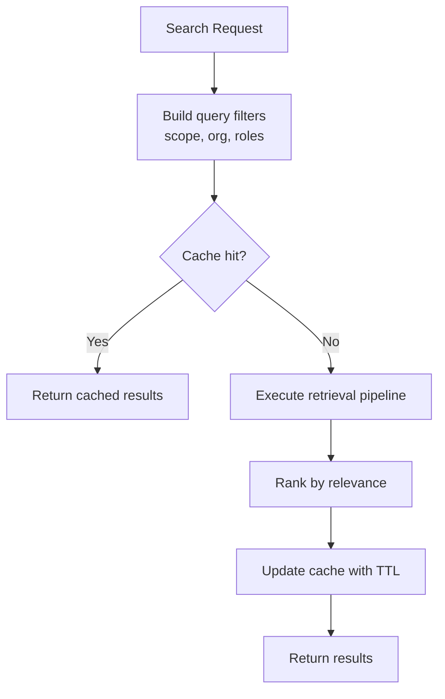
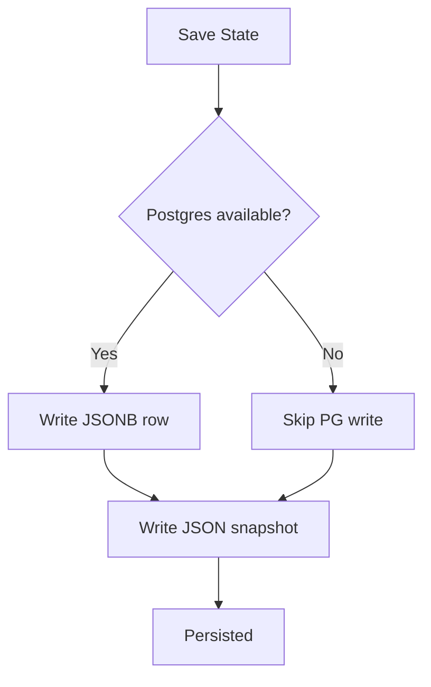
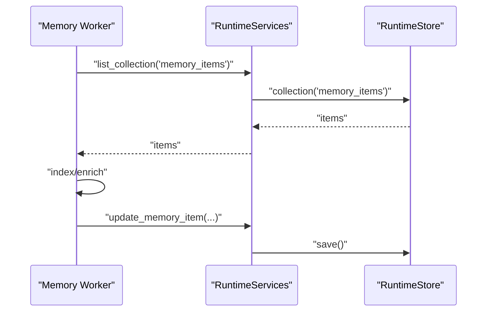
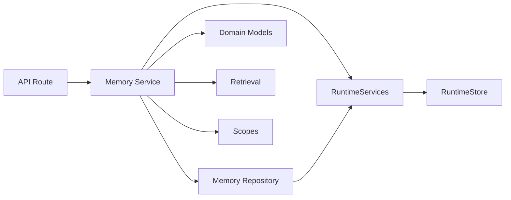

# Memory System Architecture

<cite>
**Referenced Files in This Document**
- [memory_service.py](file://backend/app/services/memory_service.py)
- [runtime.py](file://backend/app/runtime.py)
- [memory.py](file://backend/app/schemas/memory.py)
- [memory.py](file://backend/app/api/v1/routes/memory.py)
- [models.py](file://backend/app/domain/memory/models.py)
- [retrieval.py](file://backend/app/domain/memory/retrieval.py)
- [scopes.py](file://backend/app/domain/memory/scopes.py)
- [memory_repository.py](file://backend/app/infrastructure/repositories/memory_repository.py)
- [memory_worker.py](file://backend/app/workers/memory_worker.py)
</cite>

## Table of Contents
1. [Introduction](#introduction)
2. [Project Structure](#project-structure)
3. [Core Components](#core-components)
4. [Architecture Overview](#architecture-overview)
5. [Detailed Component Analysis](#detailed-component-analysis)
6. [Dependency Analysis](#dependency-analysis)
7. [Performance Considerations](#performance-considerations)
8. [Troubleshooting Guide](#troubleshooting-guide)
9. [Conclusion](#conclusion)

## Introduction
This document explains the hybrid memory system architecture that underpins agent-driven workflows. It covers five memory types:
- Event memory for workflow execution traces
- Episodic memory for contextual experiences
- Semantic memory for factual knowledge
- Procedural memory for learned behaviors
- Decision memory for governance outcomes

It also documents scoping and isolation, lifecycle management, provenance tracking, audit trail integration, retrieval patterns, caching strategies, performance optimization, persistence, backup, and recovery procedures.

## Project Structure
The memory subsystem is implemented across domain, service, API route, repository, and worker layers, with runtime orchestration and storage backends.

**Diagram sources**
- [memory.py](file://backend/app/api/v1/routes/memory.py)
- [memory_service.py](file://backend/app/services/memory_service.py)
- [models.py](file://backend/app/domain/memory/models.py)
- [retrieval.py](file://backend/app/domain/memory/retrieval.py)
- [scopes.py](file://backend/app/domain/memory/scopes.py)
- [memory_repository.py](file://backend/app/infrastructure/repositories/memory_repository.py)
- [memory_worker.py](file://backend/app/workers/memory_worker.py)
- [runtime.py](file://backend/app/runtime.py)

**Section sources**
- [memory_service.py](file://backend/app/services/memory_service.py)
- [runtime.py](file://backend/app/runtime.py)

## Core Components
- API route exposes endpoints to create, read, update, delete, and search memory items.
- Service layer orchestrates requests, enforces permissions, and delegates to runtime and repository.
- Domain models define memory item structure and semantics.
- Retrieval module implements query strategies and ranking.
- Scopes module enforces agent-based access control and isolation.
- Repository abstracts persistence operations against the runtime store.
- Worker handles asynchronous tasks such as indexing or enrichment.
- Runtime provides authentication, authorization, scoping enforcement, and persistence via JSON file or Postgres.

Key responsibilities:
- Enforce organization-scoped isolation and role-based permissions.
- Validate memory scopes per agent.
- Persist memory items with provenance and timestamps.
- Provide search and retrieval with optional vector-backed ranking.

**Section sources**
- [memory_service.py](file://backend/app/services/memory_service.py)
- [runtime.py](file://backend/app/runtime.py)
- [memory.py](file://backend/app/schemas/memory.py)

## Architecture Overview
The hybrid memory system integrates multiple memory types behind a unified interface. Access is governed by roles and agent-scoped policies. Persistence uses a dual backend: Postgres when available, otherwise a local JSON snapshot.

**Diagram sources**
- [memory.py](file://backend/app/api/v1/routes/memory.py)
- [memory_service.py](file://backend/app/services/memory_service.py)
- [runtime.py](file://backend/app/runtime.py)
- [memory_repository.py](file://backend/app/infrastructure/repositories/memory_repository.py)

## Detailed Component Analysis

### Memory Types and Semantics
- Event memory: Captures workflow execution traces and step-level events. Used for replay, diagnostics, and process intelligence.
- Episodic memory: Stores contextual experiences tied to specific runs or sessions, enabling recall of situational details.
- Semantic memory: Holds factual knowledge and rules; supports semantic search and retrieval-augmented generation.
- Procedural memory: Encodes learned behaviors and heuristics; used to improve future decisions and automation.
- Decision memory: Records governance outcomes, approvals, and policy applications for compliance and auditability.

These types are represented as typed memory items with metadata indicating type, scope, sensitivity, and provenance.

**Section sources**
- [models.py](file://backend/app/domain/memory/models.py)
- [retrieval.py](file://backend/app/domain/memory/retrieval.py)

### Scoping and Isolation
Agent-based scoping ensures isolation between agents and controls cross-scope access. The runtime validates allowed scopes per agent and denies unauthorized reads/writes. Organization scoping further isolates data across tenants.

**Diagram sources**
- [runtime.py](file://backend/app/runtime.py)
- [scopes.py](file://backend/app/domain/memory/scopes.py)

**Section sources**
- [runtime.py](file://backend/app/runtime.py)
- [scopes.py](file://backend/app/domain/memory/scopes.py)

### Lifecycle Management
Memory items follow a lifecycle from creation through updates to deletion. Each mutation records timestamps and maintains immutability where required. Provenance fields capture source references and actor identity.

**Diagram sources**
- [memory_service.py](file://backend/app/services/memory_service.py)
- [runtime.py](file://backend/app/runtime.py)

**Section sources**
- [memory_service.py](file://backend/app/services/memory_service.py)
- [runtime.py](file://backend/app/runtime.py)

### Provenance Tracking and Audit Trail Integration
Every memory operation is accompanied by provenance metadata and an audit entry. The runtime appends audit logs on critical actions and persists them alongside state changes.

**Diagram sources**
- [runtime.py](file://backend/app/runtime.py)

**Section sources**
- [runtime.py](file://backend/app/runtime.py)

### Retrieval Patterns and Caching Strategies
Retrieval supports keyword and semantic search, with optional vector-backed ranking. Results can be cached at the service layer to reduce repeated lookups. Cache keys incorporate query, scope, and user context to ensure correctness.

**Diagram sources**
- [retrieval.py](file://backend/app/domain/memory/retrieval.py)
- [memory_service.py](file://backend/app/services/memory_service.py)

**Section sources**
- [retrieval.py](file://backend/app/domain/memory/retrieval.py)
- [memory_service.py](file://backend/app/services/memory_service.py)

### Persistence, Backup, and Recovery
Persistence uses a dual-backend strategy:
- Primary: Postgres JSONB document table when configured.
- Fallback: Local JSON file snapshot.

On save, the runtime writes to both backends when possible, ensuring offline backup and migration path.

**Diagram sources**
- [runtime.py](file://backend/app/runtime.py)

Recovery procedures:
- Restore from JSON snapshot if Postgres is unavailable.
- Migrate JSON into Postgres on first successful connection.
- Use in-place sanitization to normalize legacy values during load/save.

**Section sources**
- [runtime.py](file://backend/app/runtime.py)

### Workers and Asynchronous Processing
Background workers handle tasks like indexing, embedding generation, and enrichment. They interact with the runtime store and may trigger re-indexing after memory mutations.

**Diagram sources**
- [memory_worker.py](file://backend/app/workers/memory_worker.py)
- [runtime.py](file://backend/app/runtime.py)

**Section sources**
- [memory_worker.py](file://backend/app/workers/memory_worker.py)
- [runtime.py](file://backend/app/runtime.py)

## Dependency Analysis
The memory subsystem depends on authentication, authorization, and storage abstractions provided by the runtime. The repository layer abstracts collection operations, while domain modules encapsulate retrieval logic and scoping rules.

**Diagram sources**
- [memory.py](file://backend/app/api/v1/routes/memory.py)
- [memory_service.py](file://backend/app/services/memory_service.py)
- [memory_repository.py](file://backend/app/infrastructure/repositories/memory_repository.py)
- [models.py](file://backend/app/domain/memory/models.py)
- [retrieval.py](file://backend/app/domain/memory/retrieval.py)
- [scopes.py](file://backend/app/domain/memory/scopes.py)
- [runtime.py](file://backend/app/runtime.py)

**Section sources**
- [memory_service.py](file://backend/app/services/memory_service.py)
- [runtime.py](file://backend/app/runtime.py)

## Performance Considerations
- Prefer Postgres backend for concurrent access and query efficiency; fall back to JSON for dev/local environments.
- Use scoped queries to minimize result sets and avoid scanning entire collections.
- Implement short-lived caches keyed by query, scope, and user context to reduce repeated work.
- Batch updates where possible to reduce save overhead.
- Offload heavy indexing or enrichment to background workers to keep request paths fast.

[No sources needed since this section provides general guidance]

## Troubleshooting Guide
Common issues and resolutions:
- Permission denied on memory operations: Verify role permissions and agent allowed scopes. Check audit logs for denial reasons.
- Not found errors: Ensure organization scoping matches the requester’s organization and that the item exists.
- Persistence failures: If Postgres is down, the system falls back to JSON; verify file permissions and disk space.
- Stale cache: Invalidate cache entries on updates or use shorter TTLs during development.

Operational checks:
- Confirm runtime backend selection and recent saves.
- Inspect audit logs for failed operations and their contexts.
- Validate agent configuration for allowed memory scopes.

**Section sources**
- [runtime.py](file://backend/app/runtime.py)
- [memory_service.py](file://backend/app/services/memory_service.py)

## Conclusion
The hybrid memory system provides a robust, secure, and extensible foundation for multi-type memory within agentic workflows. It enforces strong isolation via agent scopes and organization boundaries, integrates provenance and audit trails, and offers flexible persistence with reliable fallbacks. With clear retrieval patterns and worker-backed processing, it balances performance and compliance needs.