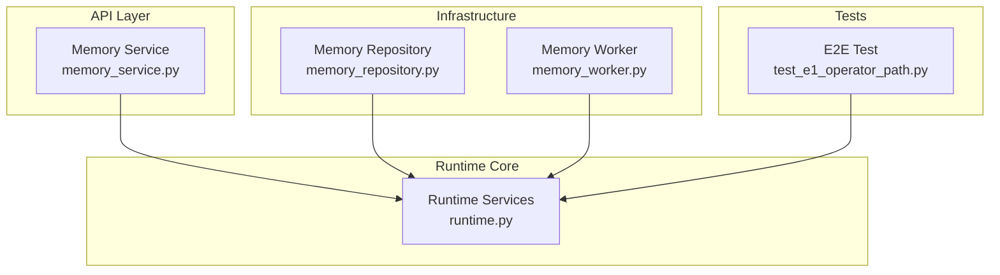
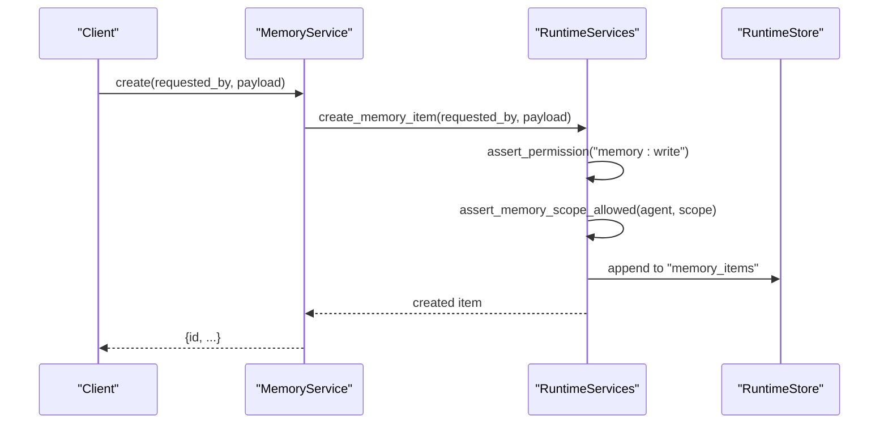
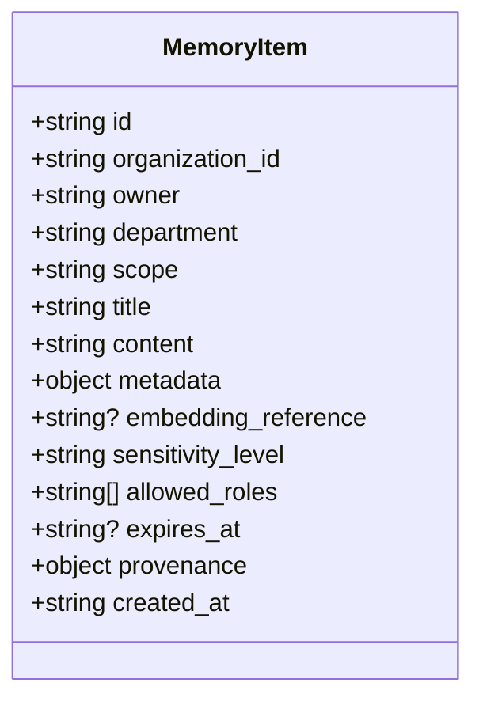
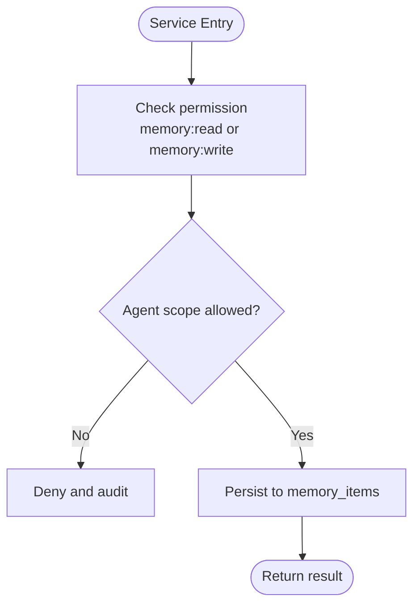
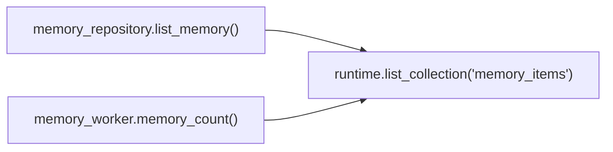
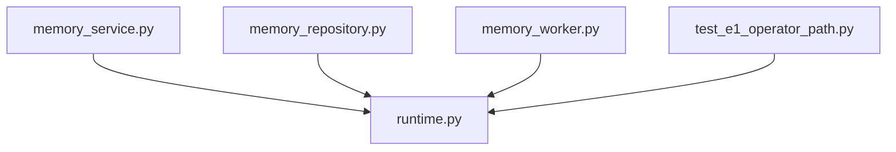

# Memory Types and Data Models

<cite>
**Referenced Files in This Document**
- [runtime.py](file://backend/app/runtime.py)
- [memory_service.py](file://backend/app/services/memory_service.py)
- [memory_repository.py](file://backend/infrastructure/repositories/memory_repository.py)
- [memory_worker.py](file://backend/app/workers/memory_worker.py)
- [test_e1_operator_path.py](file://backend/app/tests/e2e/test_e1_operator_path.py)
</cite>

## Table of Contents
1. [Introduction](#introduction)
2. [Project Structure](#project-structure)
3. [Core Components](#core-components)
4. [Architecture Overview](#architecture-overview)
5. [Detailed Component Analysis](#detailed-component-analysis)
6. [Dependency Analysis](#dependency-analysis)
7. [Performance Considerations](#performance-considerations)
8. [Troubleshooting Guide](#troubleshooting-guide)
9. [Conclusion](#conclusion)

## Introduction
This document describes the hybrid memory system’s five memory types: event, episodic, semantic, procedural, and decision memory. It explains how each type is modeled and used within the runtime, including data fields, validation rules, relationships, and access control. The implementation uses a unified memory_items collection with a scope field to differentiate memory types and enforce agent-scoped access.

## Project Structure
The memory subsystem spans service, domain, infrastructure, and runtime layers. The runtime centralizes persistence and authorization for memory items, while services expose API-friendly operations and workers provide background utilities.

**Diagram sources**
- [memory_service.py:1-27](file://backend/app/services/memory_service.py#L1-L27)
- [runtime.py:800-1200](file://backend/app/runtime.py#L800-L1200)
- [memory_repository.py:1-6](file://backend/infrastructure/repositories/memory_repository.py#L1-L6)
- [memory_worker.py:1-10](file://backend/app/workers/memory_worker.py#L1-L10)
- [test_e1_operator_path.py:90-110](file://backend/app/tests/e2e/test_e1_operator_path.py#L90-L110)

**Section sources**
- [memory_service.py:1-27](file://backend/app/services/memory_service.py#L1-L27)
- [memory_repository.py:1-6](file://backend/infrastructure/repositories/memory_repository.py#L1-L6)
- [memory_worker.py:1-10](file://backend/app/workers/memory_worker.py#L1-L10)
- [test_e1_operator_path.py:90-110](file://backend/app/tests/e2e/test_e1_operator_path.py#L90-L110)

## Core Components
- Unified memory store: A single collection named memory_items holds all memory entries across types. Each item includes an organization_id, owner, department, scope (type), title, content, metadata, embedding_reference, sensitivity_level, allowed_roles, expires_at, provenance, and timestamps.
- Scope-based access control: Agents declare allowed_memory_scopes; writes are denied if the requested scope is not permitted. Admin/API writes without an agent default to organization-wide scope.
- CRUD and search: Services delegate to runtime methods that perform scoping, validation, audit logging, and persistence.

Key responsibilities:
- Runtime: Persistence, scoping, permissions, audit, and seed population.
- Service: Thin API-facing layer delegating to runtime.
- Repository: Simple list helper for workers/scripts.
- Worker: Health/metrics usage of memory count.

**Section sources**
- [runtime.py:786-804](file://backend/app/runtime.py#L786-L804)
- [runtime.py:894-936](file://backend/app/runtime.py#L894-L936)
- [memory_service.py:1-27](file://backend/app/services/memory_service.py#L1-L27)
- [memory_repository.py:1-6](file://backend/infrastructure/repositories/memory_repository.py#L1-L6)
- [memory_worker.py:1-10](file://backend/app/workers/memory_worker.py#L1-L10)

## Architecture Overview
The runtime orchestrates memory operations with strict scoping and audit trails. The following sequence shows a typical write path.

**Diagram sources**
- [memory_service.py:17-18](file://backend/app/services/memory_service.py#L17-L18)
- [runtime.py:1920-1930](file://backend/app/runtime.py#L1920-L1930)
- [runtime.py:903-936](file://backend/app/runtime.py#L903-L936)

## Detailed Component Analysis

### Unified Memory Item Model
All five memory types share a common schema via the scope discriminator. Fields include identifiers, ownership, scoping, content, embeddings, sensitivity, roles, expiration, provenance, and timestamps.

**Diagram sources**
- [runtime.py:786-804](file://backend/app/runtime.py#L786-L804)

Field definitions and validation rules:
- id: Unique identifier generated at creation time.
- organization_id: Tenancy boundary; enforced by scoped queries.
- owner: User or agent ID responsible for the item.
- department: Organizational unit context.
- scope: Discriminator for memory type. Valid values include workflow_memory, organization_memory, department_memory, decision_memory, evaluation_memory, plus others as needed.
- title: Human-readable label.
- content: Primary payload for the memory entry.
- metadata: Free-form contextual attributes.
- embedding_reference: Optional pointer to vector index or external artifact.
- sensitivity_level: Classification such as internal/public.
- allowed_roles: Role whitelist controlling read/write access beyond org scoping.
- expires_at: Optional TTL for lifecycle management.
- provenance: Source and lineage information.
- created_at: ISO timestamp of creation.

Validation highlights:
- Permission checks require memory:read or memory:write depending on operation.
- Scope enforcement denies writes when agent.allowed_memory_scopes does not include the target scope.
- Organization scoping filters results to the caller’s organization unless explicitly allowed.

Relationships between memory types:
- All types coexist in one collection and are differentiated by scope.
- Provenance and metadata can link items across types (e.g., decision_memory referencing workflow_memory).
- Embedding references may connect semantic/procedural memories to retrieval indexes.

Usage patterns and examples by type:
- Event memory (workflow execution traces):
  - Use case: Record step-level events with timestamps and context during workflow runs.
  - Typical scope: workflow_memory.
  - Example fields: title describing the event, content capturing step inputs/outputs, metadata with run_id and step_id, provenance linking to workflow_run.
- Episodic memory (contextual experiences with temporal relationships):
  - Use case: Capture session-level experiences and their temporal ordering.
  - Typical scope: organization_memory or department_memory.
  - Example fields: content summarizing experience, metadata with session_id and related_workflow_ids, expires_at for retention policy.
- Semantic memory (factual knowledge with entity relationships):
  - Use case: Store facts, policies, and entity relations for retrieval.
  - Typical scope: organization_memory.
  - Example fields: content as structured fact, metadata with entities and relations, embedding_reference for vector search.
- Procedural memory (learned behaviors with action patterns):
  - Use case: Encode reusable procedures and best practices.
  - Typical scope: organization_memory or department_memory.
  - Example fields: content as procedure steps, metadata with applicable tools and risk tier, allowed_roles to restrict sensitive procedures.
- Decision memory (governance outcomes with audit trails):
  - Use case: Persist decisions, approvals, and rationale.
  - Typical scope: decision_memory.
  - Example fields: content summarizing decision, metadata with policy references and approver IDs, provenance linking to governance artifacts.

Access control and scoping:
- Agent scopes: If an agent lacks the required scope, writes are denied and audited.
- Default admin/API behavior: Without an agent, writes use organization-wide scope by default.
- Allowed roles: Fine-grained role filtering complements org scoping.

Audit trail integration:
- Denied operations are recorded with details about scope, actor, and outcome.
- Successful writes persist with created_at and optional updated_at semantics handled by callers.

**Section sources**
- [runtime.py:786-804](file://backend/app/runtime.py#L786-L804)
- [runtime.py:894-936](file://backend/app/runtime.py#L894-L936)
- [runtime.py:2035-2062](file://backend/app/runtime.py#L2035-L2062)
- [runtime.py:2375-2407](file://backend/app/runtime.py#L2375-L2407)

### API and Service Layer
The memory service exposes simple functions for search, get, create, update, and delete. These delegate directly to runtime methods, which handle scoping, validation, and persistence.

**Diagram sources**
- [memory_service.py:1-27](file://backend/app/services/memory_service.py#L1-L27)
- [runtime.py:903-936](file://backend/app/runtime.py#L903-L936)
- [runtime.py:2375-2407](file://backend/app/runtime.py#L2375-L2407)

Operational notes:
- Search supports query, scope, and acting_agent_id parameters to tailor retrieval.
- Get returns a single item by id within the caller’s organization scope.
- Create/Update/Delete operate under the same permission and scope checks.

**Section sources**
- [memory_service.py:1-27](file://backend/app/services/memory_service.py#L1-L27)

### Infrastructure and Workers
- Repository helper: Provides a convenience method to list memory_items for workers and scripts.
- Worker utility: Counts memory items for health or metrics purposes.

**Diagram sources**
- [memory_repository.py:1-6](file://backend/infrastructure/repositories/memory_repository.py#L1-L6)
- [memory_worker.py:1-10](file://backend/app/workers/memory_worker.py#L1-L10)
- [runtime.py:868-871](file://backend/app/runtime.py#L868-L871)

**Section sources**
- [memory_repository.py:1-6](file://backend/infrastructure/repositories/memory_repository.py#L1-L6)
- [memory_worker.py:1-10](file://backend/app/workers/memory_worker.py#L1-L10)

### End-to-End Validation and Usage
E2E tests exercise memory listing and confirm presence of items in the runtime state, validating the integration from API down to persistence.

**Section sources**
- [test_e1_operator_path.py:90-110](file://backend/app/tests/e2e/test_e1_operator_path.py#L90-L110)

## Dependency Analysis
The memory subsystem depends on the runtime for persistence and authorization. Services and repositories are thin wrappers around runtime capabilities.

**Diagram sources**
- [memory_service.py:1-27](file://backend/app/services/memory_service.py#L1-L27)
- [memory_repository.py:1-6](file://backend/infrastructure/repositories/memory_repository.py#L1-L6)
- [memory_worker.py:1-10](file://backend/app/workers/memory_worker.py#L1-L10)
- [test_e1_operator_path.py:90-110](file://backend/app/tests/e2e/test_e1_operator_path.py#L90-L110)
- [runtime.py:868-871](file://backend/app/runtime.py#L868-L871)

**Section sources**
- [memory_service.py:1-27](file://backend/app/services/memory_service.py#L1-L27)
- [memory_repository.py:1-6](file://backend/infrastructure/repositories/memory_repository.py#L1-L6)
- [memory_worker.py:1-10](file://backend/app/workers/memory_worker.py#L1-L10)
- [test_e1_operator_path.py:90-110](file://backend/app/tests/e2e/test_e1_operator_path.py#L90-L110)
- [runtime.py:868-871](file://backend/app/runtime.py#L868-L871)

## Performance Considerations
- Single-collection design simplifies indexing and querying but requires careful scoping and pagination strategies at higher scales.
- Embedding references should be managed externally to avoid bloating memory_items payloads.
- Expiration policies can be implemented using expires_at and periodic cleanup jobs.

[No sources needed since this section provides general guidance]

## Troubleshooting Guide
Common issues and resolutions:
- Permission denied on write:
  - Cause: Caller lacks memory:write permission or agent lacks the required scope.
  - Resolution: Ensure appropriate role and agent.allowed_memory_scopes configuration.
- Not found errors:
  - Cause: Requested memory_id does not exist within the caller’s organization scope.
  - Resolution: Verify id and organization alignment.
- Audit logs show denied operations:
  - Cause: Scope mismatch or insufficient permissions.
  - Resolution: Review agent scopes and role assignments.

**Section sources**
- [runtime.py:903-936](file://backend/app/runtime.py#L903-L936)

## Conclusion
The hybrid memory system unifies five memory types through a single, strongly governed collection. Scopes, roles, and provenance enable clear separation of concerns while supporting cross-type relationships. The runtime enforces consistent validation, auditing, and persistence, providing a robust foundation for event, episodic, semantic, procedural, and decision memories.