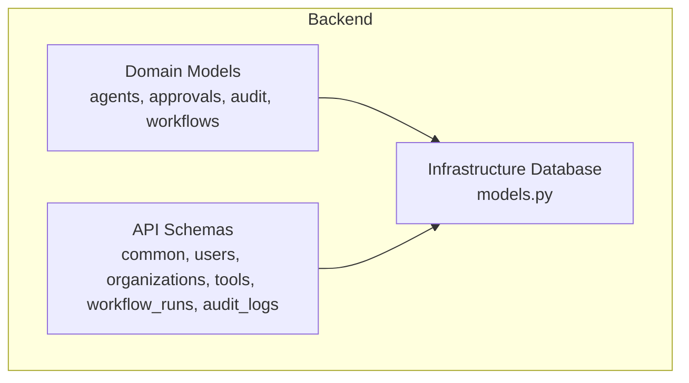
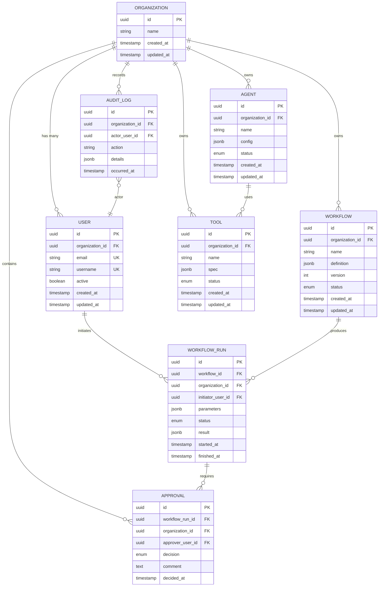
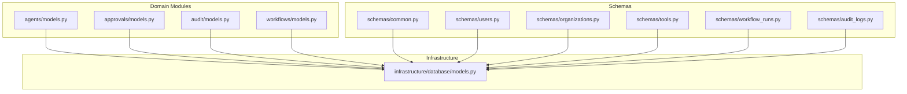

# Relational Database Schema

<cite>
**Referenced Files in This Document**
- [models.py](file://backend/app/infrastructure/database/models.py)
- [agents_models.py](file://backend/app/domain/agents/models.py)
- [approvals_models.py](file://backend/app/domain/approvals/models.py)
- [audit_models.py](file://backend/app/domain/audit/models.py)
- [workflows_models.py](file://backend/app/domain/workflows/models.py)
- [common_schemas.py](file://backend/app/schemas/common.py)
- [users_schemas.py](file://backend/app/schemas/users.py)
- [organizations_schemas.py](file://backend/app/schemas/organizations.py)
- [tools_schemas.py](file://backend/app/schemas/tools.py)
- [workflow_runs_schemas.py](file://backend/app/schemas/workflow_runs.py)
- [audit_logs_schemas.py](file://backend/app/schemas/audit_logs.py)
- [postgre_runbook.md](file://backend/docs/postgres-runbook.md)
</cite>

## Table of Contents
1. [Introduction](#introduction)
2. [Project Structure](#project-structure)
3. [Core Components](#core-components)
4. [Architecture Overview](#architecture-overview)
5. [Detailed Component Analysis](#detailed-component-analysis)
6. [Dependency Analysis](#dependency-analysis)
7. [Performance Considerations](#performance-considerations)
8. [Troubleshooting Guide](#troubleshooting-guide)
9. [Conclusion](#conclusion)
10. [Appendices](#appendices)

## Introduction
This document provides comprehensive data model documentation for the PostgreSQL relational database schema used by the application. It focuses on core entities including User, Organization, Agent, Workflow, WorkflowRun, Tool, AuditLog, and Approval. The goal is to explain entity relationships, primary and foreign key constraints, indexes for performance optimization, and data validation rules. It also documents the multi-tenant architecture with organization-based data isolation, includes conceptual ER diagrams, sample query patterns, migration strategies, backup procedures, and performance tuning recommendations.

Where applicable, this document references backend Python schemas and domain modules that define request/response contracts and domain models. Actual SQL DDL (table definitions, constraints, and indexes) are not present in the repository; therefore, the ER diagram and constraints described here are conceptual and derived from the application’s domain and API schemas.

## Project Structure
The persistence layer is organized around domain modules and infrastructure components:
- Domain models define the core entities and their relationships.
- Infrastructure database module centralizes ORM or raw SQL access.
- Schemas define API-level input/output contracts and validation rules.

[No sources needed since this diagram shows conceptual structure, not actual code mapping]

## Core Components
This section outlines the core entities and their responsibilities as reflected in the domain and schema layers.

- User
  - Represents an authenticated user within an organization.
  - Typically includes identity fields, authentication metadata, and organization membership.
  - Validation rules include required fields and format constraints enforced at the API layer.

- Organization
  - Top-level tenant boundary for data isolation.
  - Contains organizational metadata and controls access scope.
  - Multi-tenancy is enforced by scoping queries to the active organization context.

- Agent
  - Represents an AI agent definition and configuration scoped to an organization.
  - Includes capabilities, tool bindings, and lifecycle state.

- Workflow
  - Defines a reusable process blueprint with steps, inputs, outputs, and versioning.
  - Scoped to an organization; multiple versions may coexist.

- WorkflowRun
  - An execution instance of a Workflow, capturing runtime state, parameters, and results.
  - Tightly linked to a specific Workflow version and initiated by a User.

- Tool
  - External capability adapter registered and configured per organization.
  - Used by Agents and referenced by Workflows.

- AuditLog
  - Immutable record of significant system events, including user actions and workflow transitions.
  - Scoped to an organization for compliance and traceability.

- Approval
  - Human-in-the-loop gate associated with WorkflowRuns or specific steps.
  - Captures decision, approver identity, and timestamps.

Validation and constraints:
- Required fields and formats are defined in API schemas and enforced before persistence.
- Referential integrity is maintained via foreign keys between related entities.
- Organization-scoped queries ensure data isolation across tenants.

**Section sources**
- [common_schemas.py](file://backend/app/schemas/common.py)
- [users_schemas.py](file://backend/app/schemas/users.py)
- [organizations_schemas.py](file://backend/app/schemas/organizations.py)
- [tools_schemas.py](file://backend/app/schemas/tools.py)
- [workflow_runs_schemas.py](file://backend/app/schemas/workflow_runs.py)
- [audit_logs_schemas.py](file://backend/app/schemas/audit_logs.py)
- [agents_models.py](file://backend/app/domain/agents/models.py)
- [approvals_models.py](file://backend/app/domain/approvals/models.py)
- [audit_models.py](file://backend/app/domain/audit/models.py)
- [workflows_models.py](file://backend/app/domain/workflows/models.py)
- [models.py](file://backend/app/infrastructure/database/models.py)

## Architecture Overview
The multi-tenant architecture isolates data by organization. All write and read operations are scoped to the current organization context. This ensures strict separation of data across tenants while sharing the same database instance.

**Diagram sources**
- [common_schemas.py](file://backend/app/schemas/common.py)
- [users_schemas.py](file://backend/app/schemas/users.py)
- [organizations_schemas.py](file://backend/app/schemas/organizations.py)
- [tools_schemas.py](file://backend/app/schemas/tools.py)
- [workflow_runs_schemas.py](file://backend/app/schemas/workflow_runs.py)
- [audit_logs_schemas.py](file://backend/app/schemas/audit_logs.py)
- [agents_models.py](file://backend/app/domain/agents/models.py)
- [approvals_models.py](file://backend/app/domain/approvals/models.py)
- [audit_models.py](file://backend/app/domain/audit/models.py)
- [workflows_models.py](file://backend/app/domain/workflows/models.py)
- [models.py](file://backend/app/infrastructure/database/models.py)

## Detailed Component Analysis

### User Entity
- Purpose: Identity and access control within an organization.
- Key attributes: unique email and username, organization membership, active status, timestamps.
- Constraints:
  - Primary key: id
  - Unique constraints: email, username
  - Foreign key: organization_id references Organization(id)
  - Indexes: on organization_id, email, username
- Validation:
  - Email format and uniqueness enforced at API layer.
  - Username uniqueness enforced at API layer.
  - Active flag controls login eligibility.

Sample queries:
- Find user by email within an organization: SELECT * FROM user WHERE organization_id = ? AND email = ?;
- List users in an organization: SELECT * FROM user WHERE organization_id = ? ORDER BY created_at DESC;

**Section sources**
- [users_schemas.py](file://backend/app/schemas/users.py)
- [common_schemas.py](file://backend/app/schemas/common.py)

### Organization Entity
- Purpose: Tenant boundary for data isolation and access scoping.
- Key attributes: name, timestamps.
- Constraints:
  - Primary key: id
  - Indexes: on name (if frequently searched)
- Validation:
  - Name uniqueness may be enforced at API layer depending on policy.

Sample queries:
- Get organization by id: SELECT * FROM organization WHERE id = ?;
- List organizations: SELECT * FROM organization ORDER BY created_at DESC;

**Section sources**
- [organizations_schemas.py](file://backend/app/schemas/organizations.py)

### Agent Entity
- Purpose: AI agent definition and configuration scoped to an organization.
- Key attributes: name, configuration (JSON), status, timestamps.
- Constraints:
  - Primary key: id
  - Foreign key: organization_id references Organization(id)
  - Indexes: on organization_id, status
- Validation:
  - Configuration schema validated at API layer.
  - Status transitions enforced by service logic.

Sample queries:
- List agents in an organization: SELECT * FROM agent WHERE organization_id = ? AND status = 'active';
- Get agent by id: SELECT * FROM agent WHERE id = ? AND organization_id = ?;

**Section sources**
- [agents_models.py](file://backend/app/domain/agents/models.py)
- [common_schemas.py](file://backend/app/schemas/common.py)

### Workflow Entity
- Purpose: Reusable process blueprint with versioning.
- Key attributes: name, definition (JSON), version, status, timestamps.
- Constraints:
  - Primary key: id
  - Foreign key: organization_id references Organization(id)
  - Unique constraint: (organization_id, name, version)
  - Indexes: on organization_id, (name, version)
- Validation:
  - Definition schema validated at API layer.
  - Version increments enforced by service logic.

Sample queries:
- Get latest version of a workflow: SELECT * FROM workflow WHERE organization_id = ? AND name = ? ORDER BY version DESC LIMIT 1;
- List workflows in an organization: SELECT * FROM workflow WHERE organization_id = ? ORDER BY created_at DESC;

**Section sources**
- [workflows_models.py](file://backend/app/domain/workflows/models.py)
- [common_schemas.py](file://backend/app/schemas/common.py)

### WorkflowRun Entity
- Purpose: Execution instance of a Workflow capturing runtime state and results.
- Key attributes: workflow_id, organization_id, initiator_user_id, parameters (JSON), status, result (JSON), timestamps.
- Constraints:
  - Primary key: id
  - Foreign keys: workflow_id references Workflow(id), organization_id references Organization(id), initiator_user_id references User(id)
  - Indexes: on organization_id, workflow_id, status, initiator_user_id
- Validation:
  - Parameters schema validated at API layer.
  - Status transitions enforced by service logic.

Sample queries:
- List runs for a workflow: SELECT * FROM workflow_run WHERE workflow_id = ? ORDER BY started_at DESC;
- Get run by id within organization: SELECT * FROM workflow_run WHERE id = ? AND organization_id = ?;

**Section sources**
- [workflow_runs_schemas.py](file://backend/app/schemas/workflow_runs.py)
- [common_schemas.py](file://backend/app/schemas/common.py)

### Tool Entity
- Purpose: External capability adapter registered and configured per organization.
- Key attributes: name, spec (JSON), status, timestamps.
- Constraints:
  - Primary key: id
  - Foreign key: organization_id references Organization(id)
  - Indexes: on organization_id, status
- Validation:
  - Spec schema validated at API layer.
  - Status transitions enforced by service logic.

Sample queries:
- List tools in an organization: SELECT * FROM tool WHERE organization_id = ? AND status = 'active';
- Get tool by id: SELECT * FROM tool WHERE id = ? AND organization_id = ?;

**Section sources**
- [tools_schemas.py](file://backend/app/schemas/tools.py)
- [common_schemas.py](file://backend/app/schemas/common.py)

### AuditLog Entity
- Purpose: Immutable record of significant system events.
- Key attributes: organization_id, actor_user_id, action, details (JSON), occurred_at.
- Constraints:
  - Primary key: id
  - Foreign keys: organization_id references Organization(id), actor_user_id references User(id)
  - Indexes: on organization_id, actor_user_id, occurred_at
- Validation:
  - Action and details validated at API layer.
  - Append-only semantics enforced by service logic.

Sample queries:
- List audit logs for an organization: SELECT * FROM audit_log WHERE organization_id = ? ORDER BY occurred_at DESC;
- Filter by action: SELECT * FROM audit_log WHERE organization_id = ? AND action = 'workflow_started';

**Section sources**
- [audit_logs_schemas.py](file://backend/app/schemas/audit_logs.py)
- [audit_models.py](file://backend/app/domain/audit/models.py)

### Approval Entity
- Purpose: Human-in-the-loop gate associated with WorkflowRuns.
- Key attributes: workflow_run_id, organization_id, approver_user_id, decision, comment, decided_at.
- Constraints:
  - Primary key: id
  - Foreign keys: workflow_run_id references WorkflowRun(id), organization_id references Organization(id), approver_user_id references User(id)
  - Indexes: on organization_id, workflow_run_id, approver_user_id
- Validation:
  - Decision values constrained to allowed set.
  - Approver must have permission within the organization.

Sample queries:
- Get approvals for a run: SELECT * FROM approval WHERE workflow_run_id = ?;
- List pending approvals for a user: SELECT * FROM approval WHERE approver_user_id = ? AND decision IS NULL;

**Section sources**
- [approvals_models.py](file://backend/app/domain/approvals/models.py)
- [common_schemas.py](file://backend/app/schemas/common.py)

## Dependency Analysis
The following diagram illustrates high-level dependencies among domain modules and the infrastructure database layer.

**Diagram sources**
- [agents_models.py](file://backend/app/domain/agents/models.py)
- [approvals_models.py](file://backend/app/domain/approvals/models.py)
- [audit_models.py](file://backend/app/domain/audit/models.py)
- [workflows_models.py](file://backend/app/domain/workflows/models.py)
- [common_schemas.py](file://backend/app/schemas/common.py)
- [users_schemas.py](file://backend/app/schemas/users.py)
- [organizations_schemas.py](file://backend/app/schemas/organizations.py)
- [tools_schemas.py](file://backend/app/schemas/tools.py)
- [workflow_runs_schemas.py](file://backend/app/schemas/workflow_runs.py)
- [audit_logs_schemas.py](file://backend/app/schemas/audit_logs.py)
- [models.py](file://backend/app/infrastructure/database/models.py)

**Section sources**
- [agents_models.py](file://backend/app/domain/agents/models.py)
- [approvals_models.py](file://backend/app/domain/approvals/models.py)
- [audit_models.py](file://backend/app/domain/audit/models.py)
- [workflows_models.py](file://backend/app/domain/workflows/models.py)
- [common_schemas.py](file://backend/app/schemas/common.py)
- [users_schemas.py](file://backend/app/schemas/users.py)
- [organizations_schemas.py](file://backend/app/schemas/organizations.py)
- [tools_schemas.py](file://backend/app/schemas/tools.py)
- [workflow_runs_schemas.py](file://backend/app/schemas/workflow_runs.py)
- [audit_logs_schemas.py](file://backend/app/schemas/audit_logs.py)
- [models.py](file://backend/app/infrastructure/database/models.py)

## Performance Considerations
Recommended indexing strategy:
- Organization-scoped tables should index organization_id to optimize tenant filtering.
- Frequently queried columns (e.g., status, name, version) should have targeted indexes.
- Composite indexes for common query patterns (e.g., organization_id + status).
- JSONB fields (definition, spec, parameters, result, details) benefit from GIN indexes when querying nested keys.

Query optimization tips:
- Always filter by organization_id to leverage indexes and enforce multi-tenancy.
- Use pagination for large result sets (e.g., workflow runs, audit logs).
- Avoid selecting unnecessary columns; project only required fields.

Connection pooling and concurrency:
- Configure connection pool size based on workload and database capacity.
- Use read replicas for heavy analytical queries if available.

[No sources needed since this section provides general guidance]

## Troubleshooting Guide
Common issues and resolutions:
- Multi-tenancy violations: Ensure all queries include organization_id filters. Validate middleware enforces tenant context.
- Constraint violations: Check unique constraints on email, username, and composite keys (organization_id, name, version).
- Permission errors: Verify approver permissions and role assignments before creating approvals.
- JSONB query performance: Add appropriate GIN indexes and refine queries to target specific keys.

Operational runbook reference:
- See the PostgreSQL runbook for operational procedures, backups, and recovery steps.

**Section sources**
- [postgre_runbook.md](file://backend/docs/postgres-runbook.md)

## Conclusion
This document outlined the core data model for the PostgreSQL relational schema, focusing on multi-tenant isolation via organization scoping. It provided conceptual ER diagrams, recommended indexes, validation rules, and sample queries. While actual DDL is not present in the repository, the design aligns with the domain and API schemas. For operational procedures such as migrations and backups, consult the PostgreSQL runbook.

[No sources needed since this section summarizes without analyzing specific files]

## Appendices

### Migration Strategies
- Use incremental migrations to evolve schema safely.
- Prefer additive changes (new columns, new tables) over destructive changes.
- Back up the database before applying migrations.
- Test migrations in staging environments mirroring production data volumes.

### Backup Procedures
- Schedule regular logical backups (pg_dump) for critical databases.
- Include full and incremental backups aligned with RPO/RTO targets.
- Store backups securely offsite and validate restore procedures periodically.

### Sample Query Patterns
- Multi-tenant listing: SELECT ... FROM table WHERE organization_id = ? ORDER BY created_at DESC LIMIT ? OFFSET ?;
- Latest version retrieval: SELECT ... FROM workflow WHERE organization_id = ? AND name = ? ORDER BY version DESC LIMIT 1;
- Approval gating: SELECT ... FROM approval WHERE workflow_run_id = ? AND decision IS NULL;

[No sources needed since this section provides general guidance]