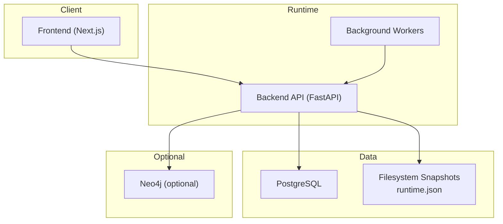
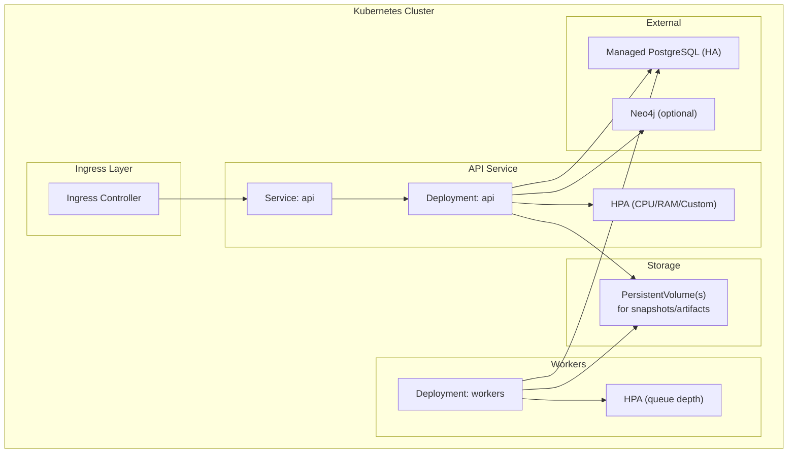
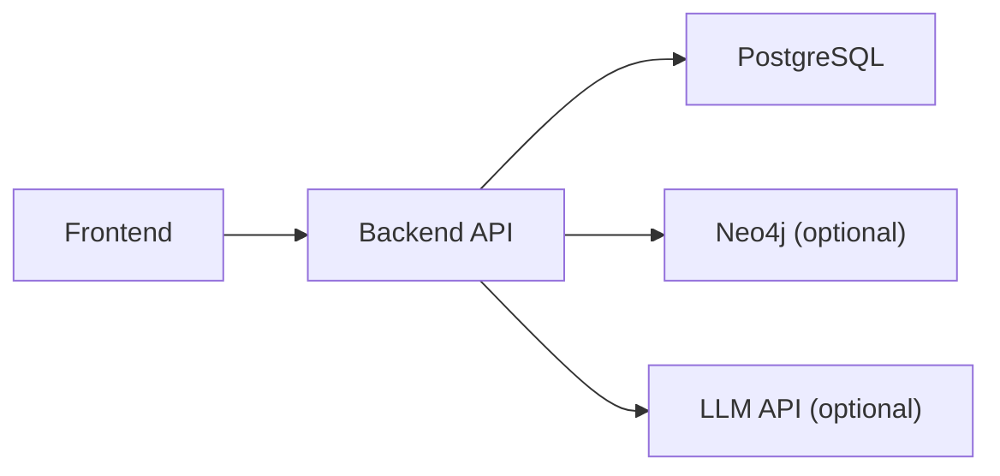

# Deployment Topology & Infrastructure

<cite>
**Referenced Files in This Document**
- [backend/README.md](file://backend/README.md)
- [docs/installation.md](file://docs/installation.md)
- [backend/app/core/config.py](file://backend/app/core/config.py)
- [backend/docs/postgres-runbook.md](file://backend/docs/postgres-runbook.md)
</cite>

## Table of Contents
1. Introduction
2. Project Structure
3. Core Components
4. Architecture Overview
5. Detailed Component Analysis
6. Dependency Analysis
7. Performance Considerations
8. Troubleshooting Guide
9. Conclusion
10. Appendices

## Introduction
This document defines the recommended deployment topology and infrastructure for the system, focusing on containerization with Docker, orchestration with Kubernetes or similar platforms, and a PostgreSQL-backed primary store. It also covers scaling, load balancing, high availability, environment setup across development/staging/production, observability (monitoring, logging), and backup/disaster recovery procedures including database backups and business artifact preservation.

## Project Structure
The runtime is composed of:
- Backend API service (FastAPI) providing REST endpoints, authentication, workflow execution control, governance, audit logs, and process intelligence summaries.
- Frontend application (Next.js) for operator UI and workflows.
- PostgreSQL as the primary durable store for runtime state and related data.
- Optional integrations such as Neo4j federation and LLM-based features.

[No sources needed since this diagram shows conceptual workflow, not actual code structure]

**Section sources**
- [backend/README.md:1-28](file://backend/README.md#L1-L28)
- [docs/installation.md:1-33](file://docs/installation.md#L1-L33)

## Core Components
- Backend API: Provides health/readiness endpoints, rate limiting, structured logging/metrics, and persistence to PostgreSQL with JSONB runtime state. Supports optional LLM critic and embeddings/pgvector.
- Configuration: Centralized via environment variables; supports toggles for Postgres requirement, rate limits, CORS, and feature flags.
- Persistence: Primary store in PostgreSQL; fallback snapshot file for offline/testing and migration from JSON when DB is empty.

Key configuration highlights:
- Environment-driven settings for app name, API prefix, environment, CORS, rate limits, database URL and pool tuning, force JSON store, auto-reflect, LLM integration, embeddings/pgvector, and optional Neo4j federation.
- Automatic conversion of async SQLAlchemy URLs to sync driver for the synchronous runtime.

**Section sources**
- [backend/README.md:17-28](file://backend/README.md#L17-L28)
- [backend/app/core/config.py:37-83](file://backend/app/core/config.py#L37-L83)
- [backend/docs/postgres-runbook.md:11-24](file://backend/docs/postgres-runbook.md#L11-L24)

## Architecture Overview
Recommended production topology:
- Containerize the backend API and workers into images.
- Orchestrate with Kubernetes using Deployments, Services, Ingress, ConfigMaps/Secrets, Horizontal Pod Autoscaler, and Persistent Volumes where applicable.
- Use a managed PostgreSQL service with multi-AZ/high availability enabled.
- Place an Ingress controller with TLS termination and path-based routing.
- Enable readiness/liveness probes tied to /api/v1/health endpoints.
- Persist runtime snapshots to a shared volume if required by your durability model.

[No sources needed since this diagram shows conceptual architecture, not actual code structure]

## Detailed Component Analysis

### Containerization (Docker)
- Build separate images for the backend API and workers.
- Include only necessary dependencies and use multi-stage builds to minimize image size.
- Inject configuration via environment variables at runtime; avoid baking secrets into images.
- Expose the HTTP port used by the FastAPI server and ensure health endpoints are reachable.

Operational notes:
- The backend reads DATABASE_URL and other settings from environment variables.
- Health endpoint indicates database connectivity status.

**Section sources**
- [backend/README.md:29-41](file://backend/README.md#L29-L41)
- [backend/app/core/config.py:52-58](file://backend/app/core/config.py#L52-L58)

### Orchestration (Kubernetes)
- Deployments:
  - API deployment with replicas scaled by HPA based on CPU/memory or custom metrics.
  - Worker deployment with HPA driven by queue depth or processing backlog.
- Services:
  - Internal Service for API to expose cluster-internal access.
- Ingress:
  - TLS termination, host/path routing, and optional WAF integration.
- Probes:
  - Readiness probe against /api/v1/health/ready.
  - Liveness probe against /api/v1/health/live (if implemented).
- Secrets and ConfigMaps:
  - Store DATABASE_URL, Neo4J credentials, LLM keys, and other sensitive values securely.
- Storage:
  - If retaining runtime.json snapshots outside the pod lifecycle, mount a PersistentVolumeClaim.

**Section sources**
- [backend/README.md:17-22](file://backend/README.md#L17-L22)
- [backend/docs/postgres-runbook.md:60-67](file://backend/docs/postgres-runbook.md#L60-L67)

### Database Setup (PostgreSQL)
- Use a managed, highly available PostgreSQL instance.
- Configure connection pooling parameters via environment variables.
- Ensure the runtime converts async URLs to the sync driver automatically.
- For local/dev, run Postgres in Docker and set DATABASE_URL accordingly.

Configuration references:
- Pool size, max overflow, pre-ping behavior.
- Requirement flag to fail fast if Postgres is unavailable.

**Section sources**
- [backend/app/core/config.py:52-58](file://backend/app/core/config.py#L52-L58)
- [backend/docs/postgres-runbook.md:11-24](file://backend/docs/postgres-runbook.md#L11-L24)
- [backend/docs/postgres-runbook.md:45-49](file://backend/docs/postgres-runbook.md#L45-L49)

### Scaling Considerations
- Stateless API pods behind a Service; scale horizontally with HPA.
- Tune database pool size and max overflow according to expected concurrency.
- Use read replicas for read-heavy workloads if supported by your ORM layer.
- Separate worker processes for long-running tasks; autoscale based on queue metrics.

**Section sources**
- [backend/app/core/config.py:54-56](file://backend/app/core/config.py#L54-L56)

### Load Balancing
- Ingress controller distributes traffic across API pods.
- Consider sticky sessions only if required; otherwise rely on stateless design.
- Enable connection draining and rolling updates to maintain zero-downtime deployments.

[No sources needed since this section provides general guidance]

### High Availability
- Multi-AZ PostgreSQL with automated failover.
- Multiple API and worker replicas across failure domains.
- Health checks and automatic restart policies.
- Backup and restore strategy for both database and artifacts.

[No sources needed since this section provides general guidance]

### Environment Setup (Development, Staging, Production)
- Development:
  - Local Postgres (Docker or native), DATABASE_URL configured, optional JSON store for offline testing.
  - Feature toggles disabled or minimal.
- Staging:
  - Managed Postgres (non-production tier), enable rate limiting, structured logging, and basic monitoring.
- Production:
  - Managed HA Postgres, strict CORS, rate limiting, full observability, secrets management, and robust backups.

Environment variables reference:
- App name, API prefix, environment, CORS, rate limits, database URL/pool, require-postgres, LLM flags, embeddings/pgvector, Neo4j URI/user/password.

**Section sources**
- [backend/app/core/config.py:39-72](file://backend/app/core/config.py#L39-L72)
- [backend/docs/postgres-runbook.md:69-73](file://backend/docs/postgres-runbook.md#L69-L73)

### Observability (Monitoring, Logging, Tracing)
- Structured request logging and metrics are provided by the backend.
- Expose health endpoints for liveness/readiness.
- Integrate with centralized logging and metrics collectors (e.g., Prometheus/Grafana, OpenTelemetry).
- Correlate requests using request IDs included in responses.

**Section sources**
- [backend/README.md:17-21](file://backend/README.md#L17-L21)

### Security and Access Control
- Token-based authentication and role checks.
- Rate limiting for sensitive endpoints.
- CORS configuration per environment.
- Secret management via platform-native mechanisms (e.g., Kubernetes Secrets, cloud secret managers).

**Section sources**
- [backend/README.md:6-12](file://backend/README.md#L6-L12)
- [backend/app/core/config.py:42-51](file://backend/app/core/config.py#L42-L51)

### Backup and Disaster Recovery
- Database backups:
  - Use managed service snapshots and point-in-time recovery.
  - Schedule periodic logical dumps for compliance and portability.
- Business artifacts:
  - Preserve filesystem snapshots (runtime.json) and any external artifacts via object storage or persistent volumes.
- Restore procedures:
  - Validate integrity before restoring.
  - Perform dry runs in staging.
  - Coordinate maintenance windows and communicate RTO/RPO targets.

**Section sources**
- [backend/docs/postgres-runbook.md:60-67](file://backend/docs/postgres-runbook.md#L60-L67)

## Dependency Analysis
High-level runtime dependencies:
- Backend depends on PostgreSQL for persistence.
- Optional dependencies include Neo4j for graph federation and LLM services for critique/embeddings.
- Frontend depends on the backend API.

[No sources needed since this diagram shows conceptual relationships, not actual code structure]

**Section sources**
- [backend/README.md:22-28](file://backend/README.md#L22-L28)
- [backend/app/core/config.py:62-72](file://backend/app/core/config.py#L62-L72)

## Performance Considerations
- Tune database pool size and overflow for expected concurrency.
- Enable connection pre-ping to detect stale connections.
- Use horizontal scaling for API and workers; monitor queue depths.
- Leverage caching layers (e.g., Redis) for hot paths if needed.
- Profile and benchmark under realistic loads; adjust resource requests/limits in orchestrator.

**Section sources**
- [backend/app/core/config.py:54-56](file://backend/app/core/config.py#L54-L56)

## Troubleshooting Guide
Common issues and resolutions:
- Store backend reports JSON-file instead of Postgres:
  - Verify Postgres is up, DATABASE_URL is correct, and psycopg binary is installed.
- Missing libpq library:
  - Install psycopg[binary].
- Health endpoint returns 503:
  - Unset require-postgres flag or fix DB connectivity.
- Offline mode:
  - Force JSON store for tests or offline environments.

**Section sources**
- [backend/docs/postgres-runbook.md:88-95](file://backend/docs/postgres-runbook.md#L88-L95)
- [backend/docs/postgres-runbook.md:69-73](file://backend/docs/postgres-runbook.md#L69-L73)

## Conclusion
The recommended deployment topology centers on a stateless API and workers orchestrated by Kubernetes, backed by a managed, highly available PostgreSQL service. Configuration is fully environment-driven, enabling consistent setups across dev, staging, and production. Robust observability, security controls, and comprehensive backup/DR procedures ensure reliability and resilience at scale.

## Appendices

### Environment Variables Reference
- GENERIC_SWARM_APP_NAME
- GENERIC_SWARM_API_PREFIX
- GENERIC_SWARM_ENV
- GENERIC_SWARM_CORS_ALLOWED_ORIGINS
- GENERIC_SWARM_RATE_LIMIT_ENABLED
- GENERIC_SWARM_AUTH_RATE_LIMIT_PER_MINUTE
- GENERIC_SWARM_WORKFLOW_WRITE_RATE_LIMIT_PER_MINUTE
- DATABASE_URL
- DATABASE_POOL_SIZE
- DATABASE_MAX_OVERFLOW
- DATABASE_POOL_PRE_PING
- GENERIC_SWARM_FORCE_JSON_STORE
- GENERIC_SWARM_AUTO_REFLECT
- GENERIC_SWARM_LLM_CRITIC_ENABLED
- GENERIC_SWARM_LLM_API_BASE
- GENERIC_SWARM_LLM_API_KEY
- GENERIC_SWARM_LLM_MODEL
- GENERIC_SWARM_EMBEDDINGS_ENABLED
- GENERIC_SWARM_PGVECTOR_ENABLED
- NEO4J_URI
- NEO4J_USER
- NEO4J_PASSWORD

**Section sources**
- [backend/app/core/config.py:39-72](file://backend/app/core/config.py#L39-L72)