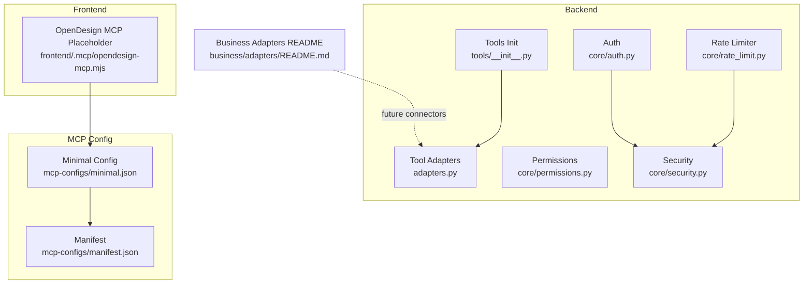
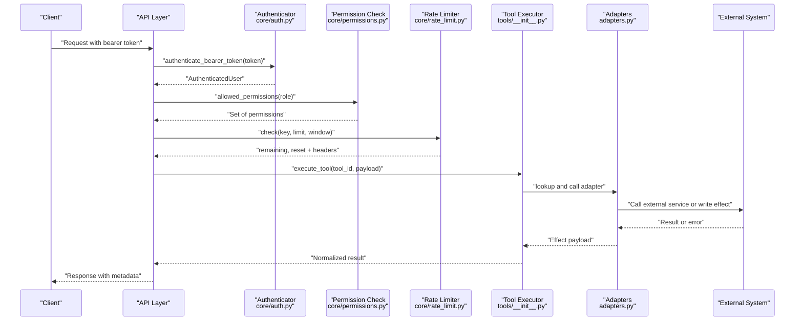
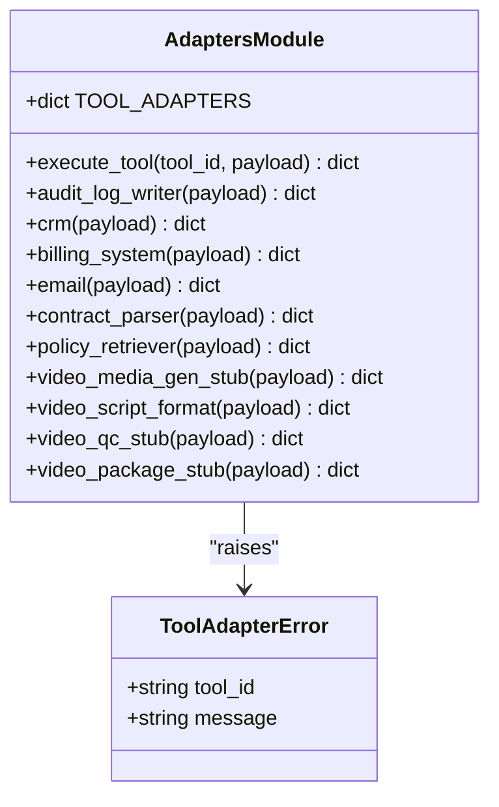
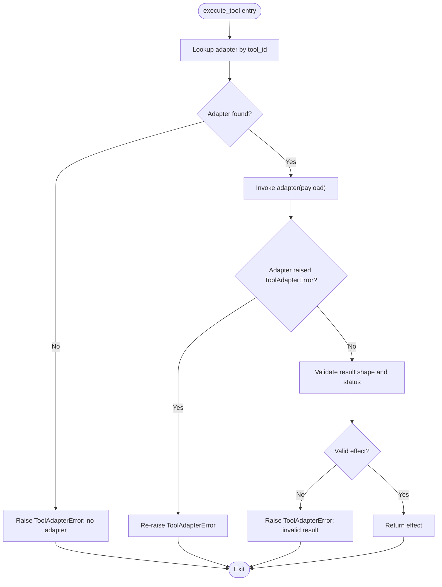
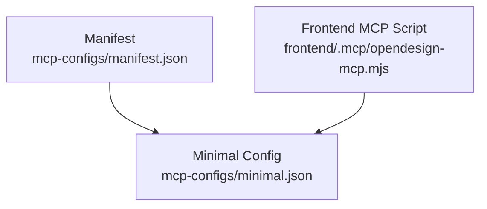
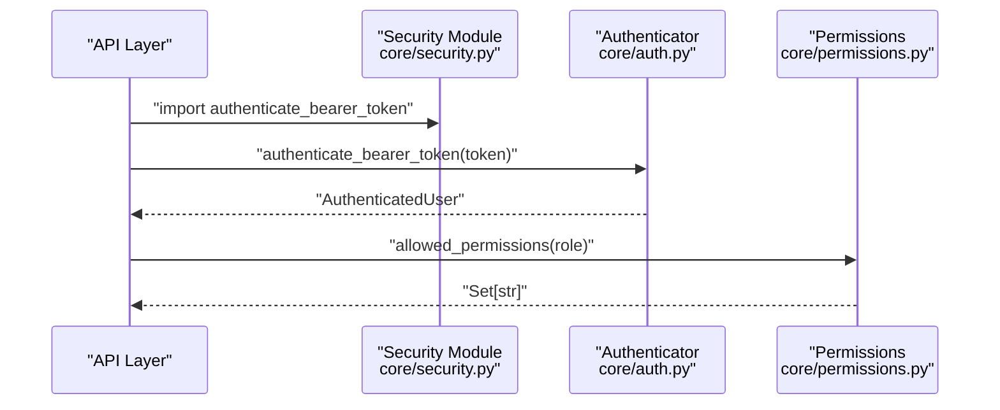
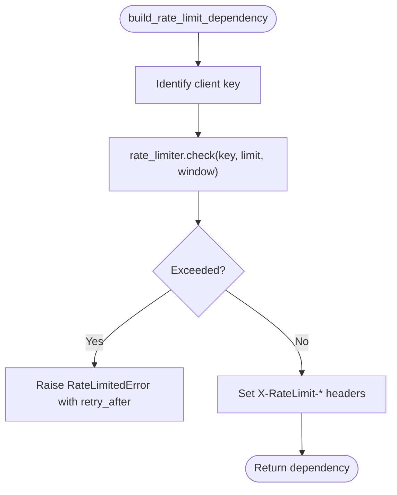
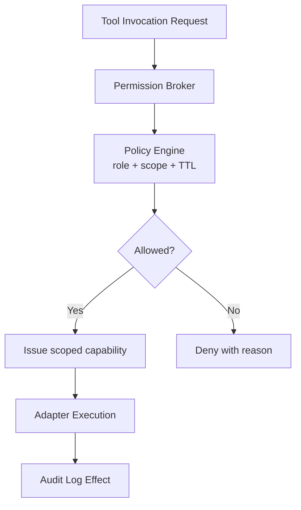
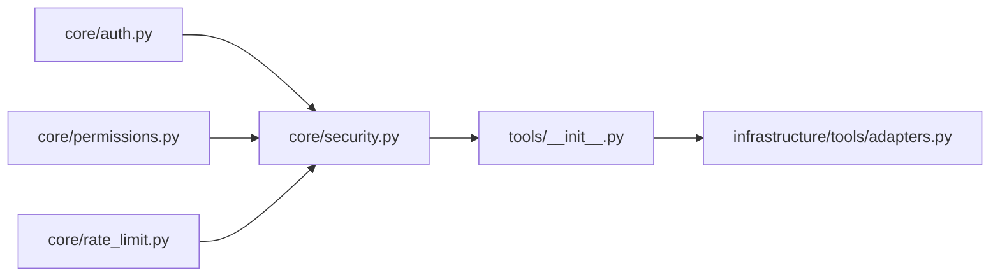

# Integration Patterns & External Systems

<cite>
**Referenced Files in This Document**
- [adapters.py](file://backend/app/infrastructure/tools/adapters.py)
- [__init__.py](file://backend/app/infrastructure/tools/__init__.py)
- [auth.py](file://backend/app/core/auth.py)
- [permissions.py](file://backend/app/core/permissions.py)
- [security.py](file://backend/app/core/security.py)
- [rate_limit.py](file://backend/app/core/rate_limit.py)
- [minimal.json](file://mcp-configs/minimal.json)
- [manifest.json](file://mcp-configs/manifest.json)
- [opendesign-mcp.mjs](file://frontend/.mcp/opendesign-mcp.mjs)
- [README.md](file://business/adapters/README.md)
</cite>

## Table of Contents
1. [Introduction](#introduction)
2. [Project Structure](#project-structure)
3. [Core Components](#core-components)
4. [Architecture Overview](#architecture-overview)
5. [Detailed Component Analysis](#detailed-component-analysis)
6. [Dependency Analysis](#dependency-analysis)
7. [Performance Considerations](#performance-considerations)
8. [Troubleshooting Guide](#troubleshooting-guide)
9. [Conclusion](#conclusion)
10. [Appendices](#appendices)

## Introduction
This document describes the integration patterns and external system connections used by the platform, focusing on:
- Tool adapter framework for integrating CRM, email, billing, contract parsing, policy retrieval, and media processing systems
- Model Context Protocol (MCP) integration pattern for standardized tool interfaces
- Authentication strategies and permission scoping for secure access to tools
- Error handling, retry mechanisms, and circuit breaker considerations
- Permission broker concepts for scoped, temporary access
- Security considerations, rate limiting, monitoring, and debugging approaches

The goal is to provide a clear architectural view that helps developers integrate new external services safely and consistently.

## Project Structure
Integration-related code is organized across backend infrastructure, core security primitives, MCP configuration, and frontend MCP placeholders:
- Backend tool adapters implement durable effect payloads and a registry-driven execution path
- Core modules provide authentication, permissions, and rate limiting
- MCP configurations define server discovery and minimal defaults
- Frontend includes an MCP placeholder script for design flows

**Diagram sources**
- [adapters.py:1-177](file://backend/app/infrastructure/tools/adapters.py#L1-L177)
- [__init__.py:1-4](file://backend/app/infrastructure/tools/__init__.py#L1-L4)
- [auth.py:1-8](file://backend/app/core/auth.py#L1-L8)
- [permissions.py:1-6](file://backend/app/core/permissions.py#L1-L6)
- [security.py:1-4](file://backend/app/core/security.py#L1-L4)
- [rate_limit.py:1-59](file://backend/app/core/rate_limit.py#L1-L59)
- [minimal.json:1-4](file://mcp-configs/minimal.json#L1-L4)
- [manifest.json:1-7](file://mcp-configs/manifest.json#L1-L7)
- [opendesign-mcp.mjs:1-4](file://frontend/.mcp/opendesign-mcp.mjs#L1-L4)
- [README.md:1-4](file://business/adapters/README.md#L1-L4)

**Section sources**
- [adapters.py:1-177](file://backend/app/infrastructure/tools/adapters.py#L1-L177)
- [__init__.py:1-4](file://backend/app/infrastructure/tools/__init__.py#L1-L4)
- [auth.py:1-8](file://backend/app/core/auth.py#L1-L8)
- [permissions.py:1-6](file://backend/app/core/permissions.py#L1-L6)
- [security.py:1-4](file://backend/app/core/security.py#L1-L4)
- [rate_limit.py:1-59](file://backend/app/core/rate_limit.py#L1-L59)
- [minimal.json:1-4](file://mcp-configs/minimal.json#L1-L4)
- [manifest.json:1-7](file://mcp-configs/manifest.json#L1-L7)
- [opendesign-mcp.mjs:1-4](file://frontend/.mcp/opendesign-mcp.mjs#L1-L4)
- [README.md:1-4](file://business/adapters/README.md#L1-L4)

## Core Components
- Tool Adapter Framework
  - Registry-driven execution with durable effect payloads
  - Standardized error type for consistent failure signaling
  - Built-in stubs for CRM, billing, email, contract parsing, policy retrieval, and video pipeline stages
- Authentication and Permissions
  - Bearer token authentication via runtime
  - Role-based permission lookup
- Rate Limiting
  - In-memory sliding window limiter with per-client keys
  - Response headers for client awareness
- MCP Configuration
  - Minimal default configuration and manifest
  - Frontend MCP placeholder for design flows

**Section sources**
- [adapters.py:1-177](file://backend/app/infrastructure/tools/adapters.py#L1-L177)
- [auth.py:1-8](file://backend/app/core/auth.py#L1-L8)
- [permissions.py:1-6](file://backend/app/core/permissions.py#L1-L6)
- [rate_limit.py:1-59](file://backend/app/core/rate_limit.py#L1-L59)
- [minimal.json:1-4](file://mcp-configs/minimal.json#L1-L4)
- [manifest.json:1-7](file://mcp-configs/manifest.json#L1-L7)
- [opendesign-mcp.mjs:1-4](file://frontend/.mcp/opendesign-mcp.mjs#L1-L4)

## Architecture Overview
The integration architecture centers around a tool adapter registry that abstracts external calls behind durable effects. Authentication and permissions gate access, while rate limiting protects downstream systems. MCP configurations standardize tool discovery and invocation patterns.

**Diagram sources**
- [auth.py:1-8](file://backend/app/core/auth.py#L1-L8)
- [permissions.py:1-6](file://backend/app/core/permissions.py#L1-L6)
- [rate_limit.py:1-59](file://backend/app/core/rate_limit.py#L1-L59)
- [__init__.py:1-4](file://backend/app/infrastructure/tools/__init__.py#L1-L4)
- [adapters.py:1-177](file://backend/app/infrastructure/tools/adapters.py#L1-L177)

## Detailed Component Analysis

### Tool Adapter Framework
The adapter framework provides a registry of callable functions that produce durable effect payloads. Each adapter encapsulates a specific business capability (e.g., CRM, email, billing). The executor validates results and normalizes errors.

Key responsibilities:
- Registry mapping from tool identifiers to adapter functions
- Effect normalization with id, status, input, result, and timestamps
- Consistent error propagation via a dedicated exception type

**Diagram sources**
- [adapters.py:1-177](file://backend/app/infrastructure/tools/adapters.py#L1-L177)

Operational flow:
- Lookup adapter by tool_id
- Invoke adapter with normalized payload
- Validate returned effect structure
- Raise ToolAdapterError on invalid or failed outcomes

**Diagram sources**
- [adapters.py:157-177](file://backend/app/infrastructure/tools/adapters.py#L157-L177)

**Section sources**
- [adapters.py:1-177](file://backend/app/infrastructure/tools/adapters.py#L1-L177)

### MCP Integration Pattern
MCP configuration files define server discovery and minimal defaults. The frontend includes a placeholder MCP script for design flows.

**Diagram sources**
- [manifest.json:1-7](file://mcp-configs/manifest.json#L1-L7)
- [minimal.json:1-4](file://mcp-configs/minimal.json#L1-L4)
- [opendesign-mcp.mjs:1-4](file://frontend/.mcp/opendesign-mcp.mjs#L1-L4)

Notes:
- The minimal config currently contains an empty servers map, suitable for extension
- The frontend script is a placeholder; replace with the official server file before enabling MCP-backed design flows

**Section sources**
- [manifest.json:1-7](file://mcp-configs/manifest.json#L1-L7)
- [minimal.json:1-4](file://mcp-configs/minimal.json#L1-L4)
- [opendesign-mcp.mjs:1-4](file://frontend/.mcp/opendesign-mcp.mjs#L1-L4)

### Authentication and Authorization
Authentication delegates to the runtime to validate bearer tokens and return an authenticated user context. Permissions are resolved based on roles using a role-to-permissions mapping.

**Diagram sources**
- [security.py:1-4](file://backend/app/core/security.py#L1-L4)
- [auth.py:1-8](file://backend/app/core/auth.py#L1-L8)
- [permissions.py:1-6](file://backend/app/core/permissions.py#L1-L6)

**Section sources**
- [auth.py:1-8](file://backend/app/core/auth.py#L1-L8)
- [permissions.py:1-6](file://backend/app/core/permissions.py#L1-L6)
- [security.py:1-4](file://backend/app/core/security.py#L1-L4)

### Rate Limiting
An in-memory sliding window limiter tracks request events per client key and enforces limits within time windows. It exposes response headers for remaining capacity and reset times.

**Diagram sources**
- [rate_limit.py:13-54](file://backend/app/core/rate_limit.py#L13-L54)

**Section sources**
- [rate_limit.py:1-59](file://backend/app/core/rate_limit.py#L1-L59)

### Permission Broker Concept for Scoped, Temporary Access
While the current implementation provides role-based permission lookups, a permission broker can be layered atop this foundation to issue scoped, short-lived tokens or capabilities for external tool access. Recommended approach:
- Issue capability tokens bound to specific tool_ids, actions, resource scopes, and TTLs
- Enforce broker checks at the adapter boundary before invoking external systems
- Record broker decisions in audit logs alongside adapter effects

Conceptual diagram:

[No sources needed since this section analyzes conceptual patterns]

## Dependency Analysis
The following diagram shows how core components depend on each other during a typical tool execution path.

**Diagram sources**
- [auth.py:1-8](file://backend/app/core/auth.py#L1-L8)
- [permissions.py:1-6](file://backend/app/core/permissions.py#L1-L6)
- [security.py:1-4](file://backend/app/core/security.py#L1-L4)
- [rate_limit.py:1-59](file://backend/app/core/rate_limit.py#L1-L59)
- [__init__.py:1-4](file://backend/app/infrastructure/tools/__init__.py#L1-L4)
- [adapters.py:1-177](file://backend/app/infrastructure/tools/adapters.py#L1-L177)

**Section sources**
- [auth.py:1-8](file://backend/app/core/auth.py#L1-L8)
- [permissions.py:1-6](file://backend/app/core/permissions.py#L1-L6)
- [security.py:1-4](file://backend/app/core/security.py#L1-L4)
- [rate_limit.py:1-59](file://backend/app/core/rate_limit.py#L1-L59)
- [__init__.py:1-4](file://backend/app/infrastructure/tools/__init__.py#L1-L4)
- [adapters.py:1-177](file://backend/app/infrastructure/tools/adapters.py#L1-L177)

## Performance Considerations
- Use in-memory rate limiting for development and single-instance deployments; consider distributed backends for multi-instance scaling
- Keep adapter payloads small and structured to reduce serialization overhead
- Prefer stub adapters in CI environments to avoid external dependencies and flakiness
- Batch operations where possible to minimize network round-trips to external systems

[No sources needed since this section provides general guidance]

## Troubleshooting Guide
Common issues and diagnostics:
- Missing adapter registration: ensure tool_id exists in the registry
- Invalid adapter result: verify adapters return normalized effect structures with required fields
- Rate limit exceeded: inspect X-RateLimit-* headers and adjust limits or window sizes
- Authentication failures: confirm bearer token validity and runtime configuration
- MCP placeholder errors: replace the frontend MCP placeholder with the official server file before enabling MCP-backed flows

**Section sources**
- [adapters.py:157-177](file://backend/app/infrastructure/tools/adapters.py#L157-L177)
- [rate_limit.py:13-54](file://backend/app/core/rate_limit.py#L13-L54)
- [auth.py:1-8](file://backend/app/core/auth.py#L1-L8)
- [opendesign-mcp.mjs:1-4](file://frontend/.mcp/opendesign-mcp.mjs#L1-L4)

## Conclusion
The platform’s integration layer combines a robust tool adapter framework with strong authentication, permissions, and rate limiting. MCP configurations provide a standardized mechanism for tool discovery and invocation. By extending the adapter registry and enforcing permission broker policies, teams can safely integrate diverse external systems such as CRM, email, calendar, and billing platforms while maintaining observability and resilience.

[No sources needed since this section summarizes without analyzing specific files]

## Appendices

### Business Adapters Guidance
Use the designated directory for future connectors into CRM, ERP, email, and approval systems to keep bootstrap scripts clean and maintainable.

**Section sources**
- [README.md:1-4](file://business/adapters/README.md#L1-L4)