# Architecture Overview

<cite>
**Referenced Files in This Document**
- [README.md](file://README.md)
- [structure.md](file://structure.md)
- [docs/architecture.md](file://docs/architecture.md)
- [book/user_guide/chapters/01-01-system-overview.md](file://book/user_guide/chapters/01-01-system-overview.md)
- [backend/app/main.py](file://backend/app/main.py)
- [backend/app/runtime.py](file://backend/app/runtime.py)
- [backend/app/api/v1/router.py](file://backend/app/api/v1/router.py)
- [backend/app/infrastructure/process_intelligence/__init__.py](file://backend/app/infrastructure/process_intelligence/__init__.py)
- [frontend/src/app/layout.tsx](file://frontend/src/app/layout.tsx)
</cite>

## Table of Contents
1. [Introduction](#introduction)
2. [Project Structure](#project-structure)
3. [Core Components](#core-components)
4. [Architecture Overview](#architecture-overview)
5. [Detailed Component Analysis](#detailed-component-analysis)
6. [Dependency Analysis](#dependency-analysis)
7. [Performance Considerations](#performance-considerations)
8. [Troubleshooting Guide](#troubleshooting-guide)
9. [Conclusion](#conclusion)
10. [Appendices](#appendices)

## Introduction
This document presents the architectural overview of the Generic Swarm Ops system: a governed, auditable, self-improving multi-agent business operating system with dual-harness support for Trae IDE and Grok Build. It explains the six-layer architecture (Process Intelligence, Knowledge Layer, Execution Workflows, Governance Officer, Security Red-Team, and Evaluation), component interactions across backend FastAPI services, frontend Next.js application, PostgreSQL database, and external integrations, and highlights system boundaries, data flows, integration patterns, evolution sandbox, self-improvement loops, and process intelligence components.

## Project Structure
At a high level, the repository combines:
- A dual-harness starter layer that generates managed agent/rules files for Trae IDE (.trae/) and Grok Build (.grok/).
- A business artifact layer under business/ containing process intelligence, knowledge, governance, evaluations, and evolution artifacts.
- A FastAPI control plane backend providing APIs for workflows, approvals, knowledge, memory, process intelligence, evolution, improvement, and loops.
- A Next.js ops console for live operations when demo mode is disabled.
- A Postgres-backed runtime store with JSON snapshot backup.

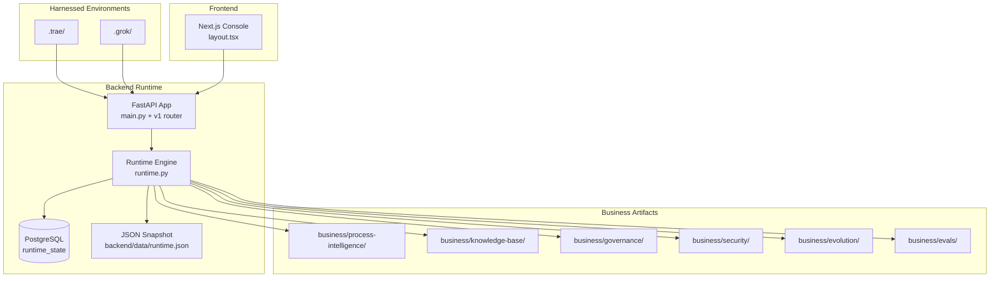

**Diagram sources**
- [backend/app/main.py:16-52](file://backend/app/main.py#L16-L52)
- [backend/app/api/v1/router.py:1-47](file://backend/app/api/v1/router.py#L1-L47)
- [backend/app/runtime.py:258-384](file://backend/app/runtime.py#L258-L384)
- [backend/app/infrastructure/process_intelligence/__init__.py:1-14](file://backend/app/infrastructure/process_intelligence/__init__.py#L1-L14)
- [frontend/src/app/layout.tsx:17-28](file://frontend/src/app/layout.tsx#L17-L28)

**Section sources**
- [README.md:1-48](file://README.md#L1-L48)
- [docs/architecture.md:1-32](file://docs/architecture.md#L1-L32)
- [structure.md:38-66](file://structure.md#L38-L66)

## Core Components
- Backend FastAPI app: request middleware, CORS, security headers, metrics, and OpenAPI exposure; routes grouped by domain.
- Runtime engine: governed execution, RBAC, workflow runs, approvals, memory scopes, tool effects, and persistence via Postgres or JSON fallback.
- Process Intelligence: ingestion and artifact generation for discovered processes, conformance reports, and bottlenecks.
- Knowledge and Memory: tiered retrieval (vector, graph, optional hierarchical summaries) with provenance.
- Evolution Sandbox: propose/test/canary/promotion pipeline with fitness scoring and rollback.
- Frontend: Next.js console for live operations, approvals, knowledge, evaluations, processes, improve pipeline, and evolution archive.

**Section sources**
- [backend/app/main.py:16-52](file://backend/app/main.py#L16-L52)
- [backend/app/api/v1/router.py:26-47](file://backend/app/api/v1/router.py#L26-L47)
- [backend/app/runtime.py:258-384](file://backend/app/runtime.py#L258-L384)
- [backend/app/infrastructure/process_intelligence/__init__.py:1-14](file://backend/app/infrastructure/process_intelligence/__init__.py#L1-L14)
- [docs/architecture.md:21-32](file://docs/architecture.md#L21-L32)
- [book/user_guide/chapters/01-01-system-overview.md:387-427](file://book/user_guide/chapters/01-01-system-overview.md#L387-L427)

## Architecture Overview
The system implements a six-layer architecture orchestrated by a Business Orchestrator behind an Intake + Risk Router. Layers include Process Intelligence, Knowledge, Execution Workflows, Governance Officer, Security Red-Team, and Evaluation. The orchestrator persists state in Postgres and exposes APIs consumed by the Next.js console and harnesses.

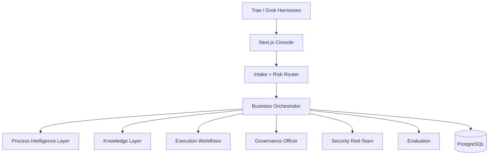

**Diagram sources**
- [structure.md:38-66](file://structure.md#L38-L66)
- [book/user_guide/chapters/01-01-system-overview.md:255-289](file://book/user_guide/chapters/01-01-system-overview.md#L255-L289)
- [docs/architecture.md:15-32](file://docs/architecture.md#L15-L32)

## Detailed Component Analysis

### Backend FastAPI Services
- Application entrypoint configures CORS, request context, metrics, security headers, and includes versioned routers.
- Domain routers cover auth, users, organizations, agents, tools, workflows, runs, approvals, governance, knowledge, memory, evaluations, audit logs, processes, evolution, improvement, loops, and settings.

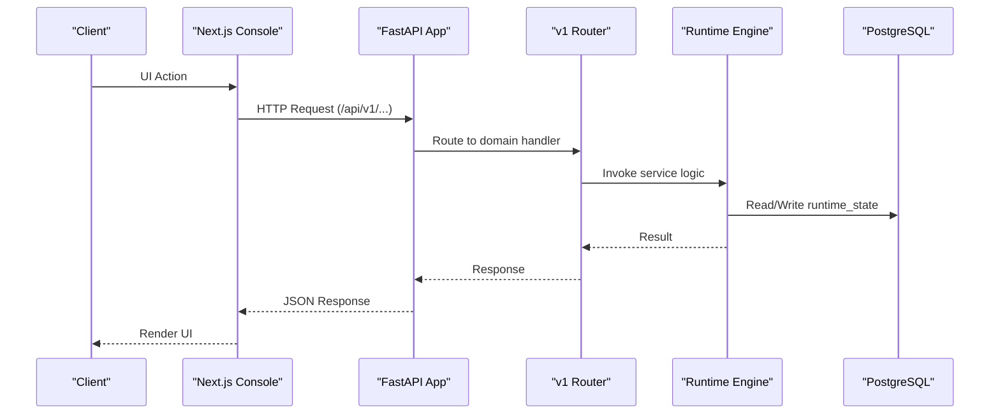

**Diagram sources**
- [backend/app/main.py:16-52](file://backend/app/main.py#L16-L52)
- [backend/app/api/v1/router.py:26-47](file://backend/app/api/v1/router.py#L26-L47)
- [backend/app/runtime.py:258-384](file://backend/app/runtime.py#L258-L384)

**Section sources**
- [backend/app/main.py:16-52](file://backend/app/main.py#L16-L52)
- [backend/app/api/v1/router.py:1-47](file://backend/app/api/v1/router.py#L1-L47)

### Runtime Engine and Persistence
- RuntimeStore prefers Postgres (runtime_state JSONB) and falls back to a local JSON snapshot file. It sanitizes legacy product names, seeds default users/tools/workflows, and maintains collections.
- Health endpoint confirms database connectivity.

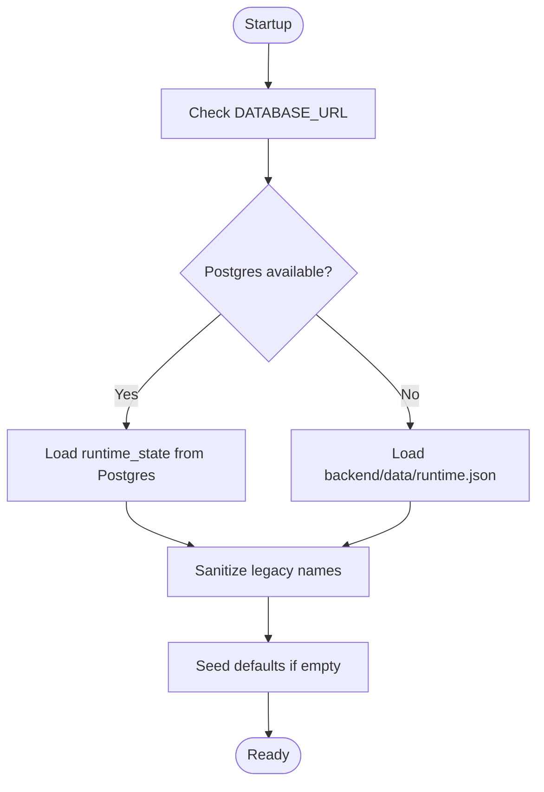

**Diagram sources**
- [backend/app/runtime.py:258-384](file://backend/app/runtime.py#L258-L384)
- [docs/architecture.md:15-20](file://docs/architecture.md#L15-L20)

**Section sources**
- [backend/app/runtime.py:258-384](file://backend/app/runtime.py#L258-L384)
- [docs/architecture.md:15-20](file://docs/architecture.md#L15-L20)

### Process Intelligence Layer
- Ingests event logs and produces artifacts such as discovered processes, conformance reports, and bottleneck analyses.
- Infrastructure module exposes artifact builders and writers.

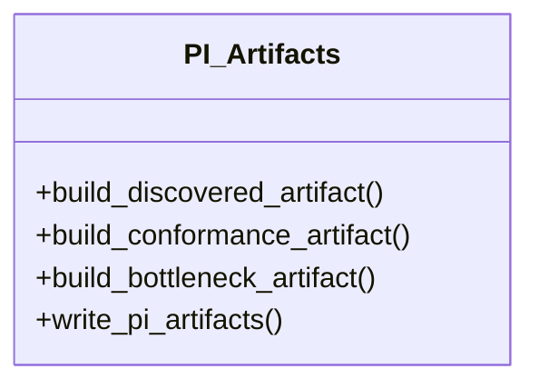

**Diagram sources**
- [backend/app/infrastructure/process_intelligence/__init__.py:1-14](file://backend/app/infrastructure/process_intelligence/__init__.py#L1-L14)

**Section sources**
- [backend/app/infrastructure/process_intelligence/__init__.py:1-14](file://backend/app/infrastructure/process_intelligence/__init__.py#L1-L14)
- [structure.md:69-107](file://structure.md#L69-L107)

### Knowledge Layer and Hybrid Memory
- Tiered retrieval: Tier 0 vector search (default), Tier 1 LightRAG-style graph for relational queries, Tier 2 hierarchical summaries on demand.
- Eight memory types (event, episodic, semantic, procedural, decision, exception, evaluation, provenance) with provenance always-on.

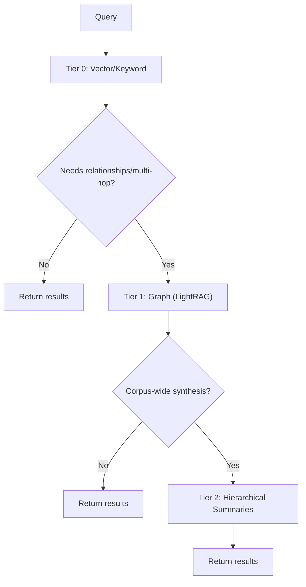

**Diagram sources**
- [structure.md:170-208](file://structure.md#L170-L208)
- [book/user_guide/chapters/01-01-system-overview.md:108-139](file://book/user_guide/chapters/01-01-system-overview.md#L108-L139)

**Section sources**
- [structure.md:170-208](file://structure.md#L170-L208)
- [book/user_guide/chapters/01-01-system-overview.md:108-139](file://book/user_guide/chapters/01-01-system-overview.md#L108-L139)

### Execution Workflows (Workflow DNA)
- Bounded state-graph execution with explicit steps, tools, permissions, verification, and rollback plans.
- Human gates enforced deterministically based on risk tiers and guardrails.

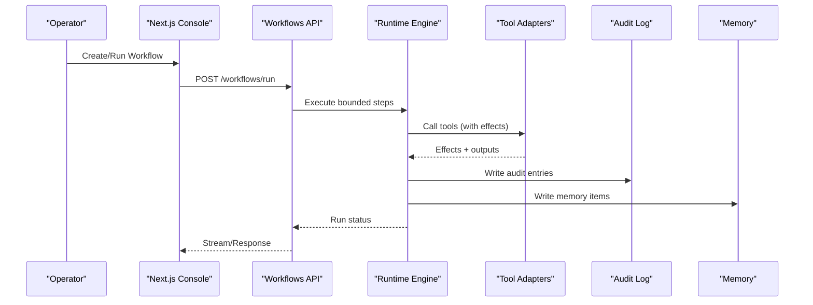

**Diagram sources**
- [structure.md:281-346](file://structure.md#L281-L346)
- [book/user_guide/chapters/01-01-system-overview.md:140-166](file://book/user_guide/chapters/01-01-system-overview.md#L140-L166)

**Section sources**
- [structure.md:281-346](file://structure.md#L281-L346)
- [book/user_guide/chapters/01-01-system-overview.md:140-166](file://book/user_guide/chapters/01-01-system-overview.md#L140-L166)

### Governance Officer
- Applies risk tiers, approval policies, and mandatory governance artifacts.
- Integrates with human-in-the-loop gates and auditability requirements.

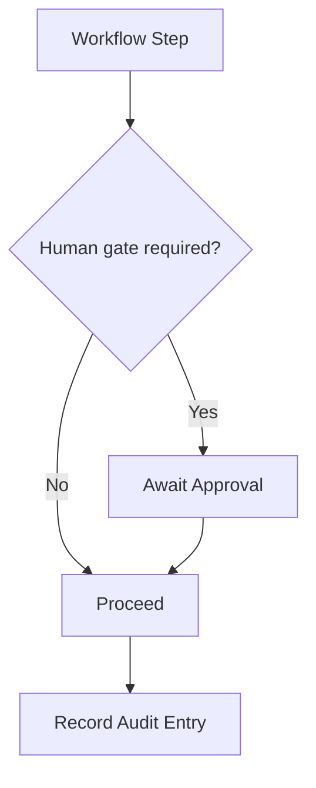

**Diagram sources**
- [book/user_guide/chapters/01-01-system-overview.md:202-231](file://book/user_guide/chapters/01-01-system-overview.md#L202-L231)
- [structure.md:400-460](file://structure.md#L400-L460)

**Section sources**
- [book/user_guide/chapters/01-01-system-overview.md:202-231](file://book/user_guide/chapters/01-01-system-overview.md#L202-L231)
- [structure.md:400-460](file://structure.md#L400-L460)

### Security Red-Team
- Adversarial testing, threat modeling, blast-radius control, tool permission broker, and full observability across model/tool/agent calls.

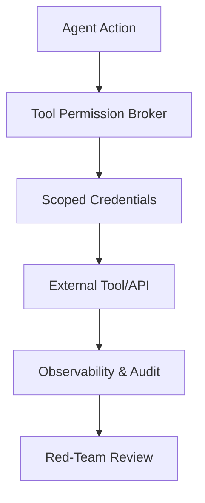

**Diagram sources**
- [book/user_guide/chapters/01-01-system-overview.md:233-251](file://book/user_guide/chapters/01-01-system-overview.md#L233-L251)

**Section sources**
- [book/user_guide/chapters/01-01-system-overview.md:233-251](file://book/user_guide/chapters/01-01-system-overview.md#L233-L251)

### Evaluation and Self-Improvement Loops
- Evaluation corpus includes golden tasks, regression, adversarial, and historical replay sets.
- Self-improvement loop: reflect → propose variants → evaluate → canary → promote/rollback; lessons stored in evolution memory.

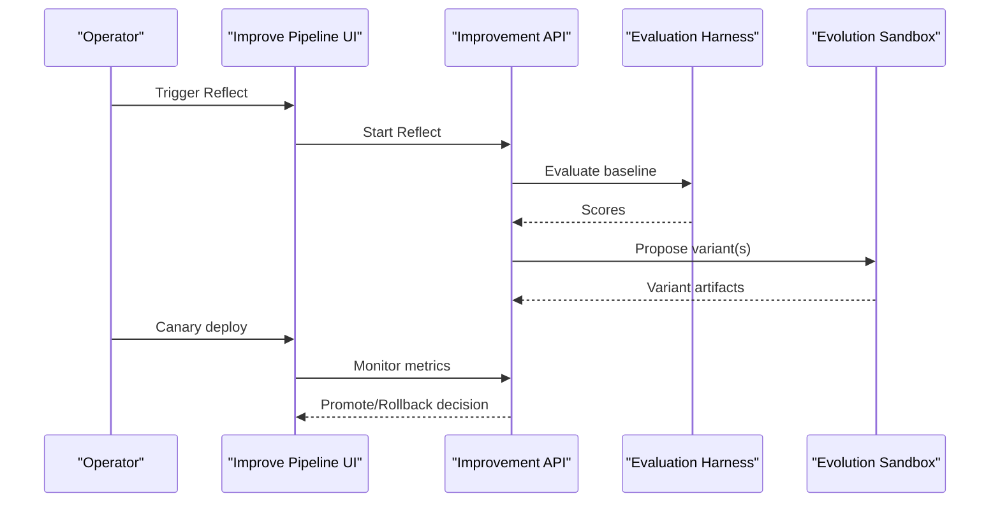

**Diagram sources**
- [docs/architecture.md:42-56](file://docs/architecture.md#L42-L56)
- [structure.md:349-397](file://structure.md#L349-L397)

**Section sources**
- [docs/architecture.md:42-56](file://docs/architecture.md#L42-L56)
- [structure.md:349-397](file://structure.md#L349-L397)

### System Boundaries and Integration Patterns
- External integrations are accessed through tool adapters and permission brokers; all actions produce audited effects.
- Dual-harness integration: .trae/ and .grok/ generated trees consume shared rules/skills/hooks and call backend APIs for live operations.

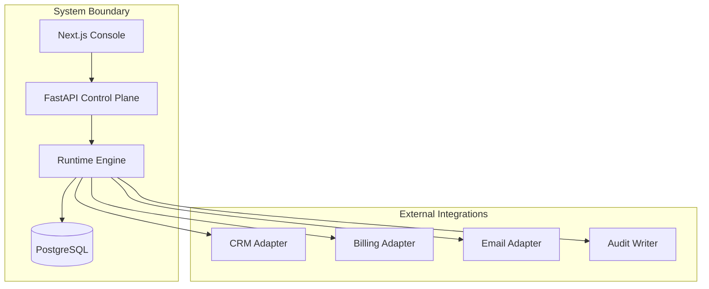

**Diagram sources**
- [README.md:77-98](file://README.md#L77-L98)
- [docs/architecture.md:21-32](file://docs/architecture.md#L21-L32)

**Section sources**
- [README.md:77-98](file://README.md#L77-L98)
- [docs/architecture.md:21-32](file://docs/architecture.md#L21-L32)

## Dependency Analysis
- Frontend depends on backend APIs for live operations.
- Backend depends on Postgres for durable state and on infrastructure modules for process intelligence, knowledge, evolution, and improvements.
- Runtime orchestrates cross-cutting concerns: authentication, authorization, approvals, audit logging, and memory writes.

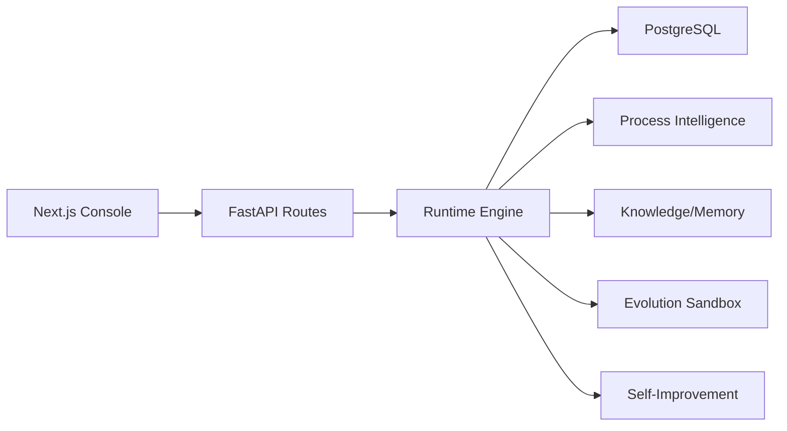

**Diagram sources**
- [backend/app/api/v1/router.py:26-47](file://backend/app/api/v1/router.py#L26-L47)
- [backend/app/runtime.py:258-384](file://backend/app/runtime.py#L258-L384)

**Section sources**
- [backend/app/api/v1/router.py:26-47](file://backend/app/api/v1/router.py#L26-L47)
- [backend/app/runtime.py:258-384](file://backend/app/runtime.py#L258-L384)

## Performance Considerations
- Prefer Tier 0 retrieval for most queries; escalate only when necessary to keep costs low and latency minimal.
- Use Postgres for durability and concurrency; ensure health checks pass before heavy operations.
- Keep evolution and evaluation workloads off the critical path using background workers where applicable.

[No sources needed since this section provides general guidance]

## Troubleshooting Guide
- Verify database connectivity via health endpoint; confirm "database": "postgres".
- If Postgres is unavailable, the runtime falls back to JSON snapshot; check backend/data/runtime.json for recovery.
- For API issues, inspect request IDs set by middleware and response headers for diagnostics.

**Section sources**
- [docs/architecture.md:15-20](file://docs/architecture.md#L15-L20)
- [backend/app/main.py:27-48](file://backend/app/main.py#L27-L48)
- [backend/app/runtime.py:355-384](file://backend/app/runtime.py#L355-L384)

## Conclusion
Generic Swarm Ops provides a governed, auditable, and self-improving multi-agent business operating system. Its six-layer architecture, backed by a robust runtime and clear separation of concerns, enables safe autonomy earned through evidence, continuous learning from real operations, and controlled evolution in a sandbox. The dual-harness setup integrates seamlessly with Trae IDE and Grok Build while exposing a comprehensive ops console for operators.

[No sources needed since this section summarizes without analyzing specific files]

## Appendices
- Dual-harness quick start and sync commands are documented in the project README.
- Architecture source of truth and detailed design references are linked in docs and user guide chapters.

**Section sources**
- [README.md:32-48](file://README.md#L32-L48)
- [docs/architecture.md:58-64](file://docs/architecture.md#L58-L64)