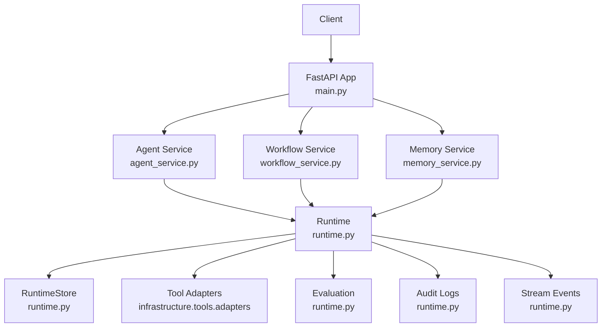
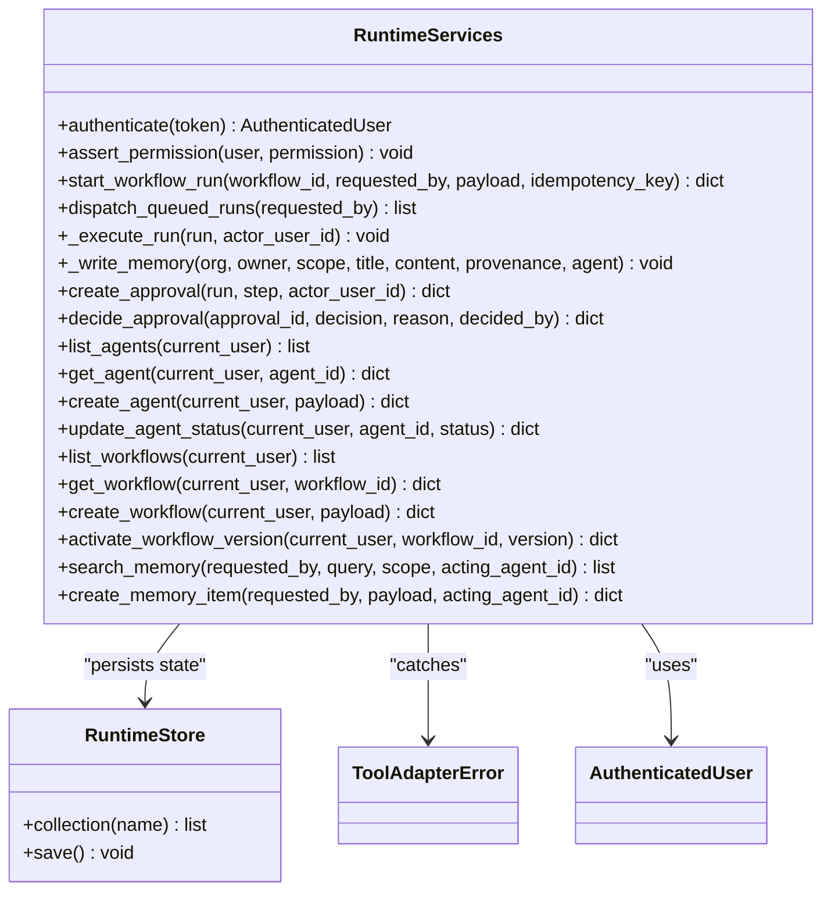
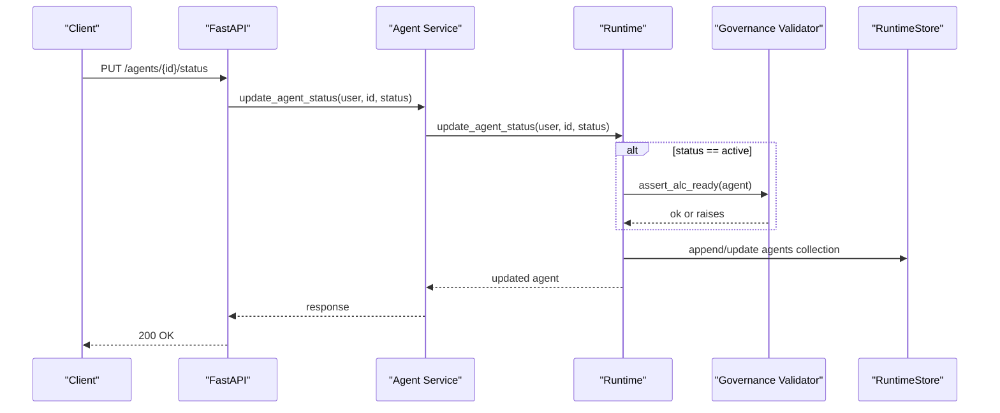
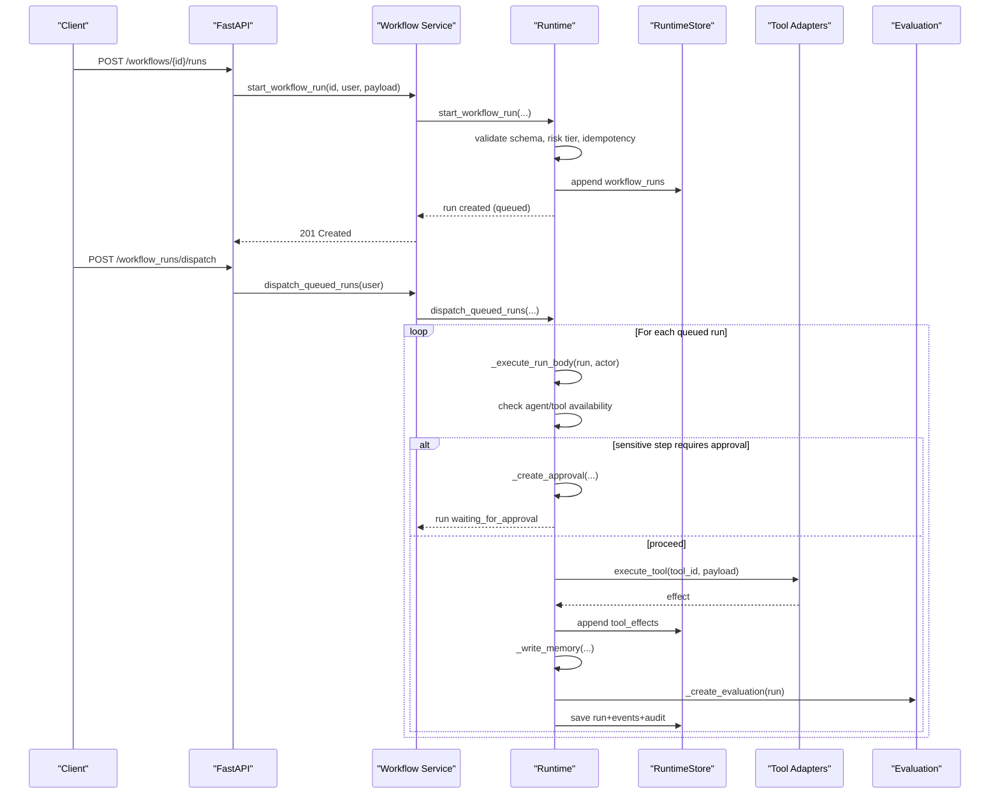
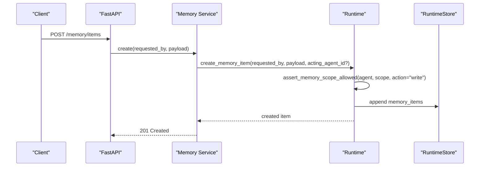
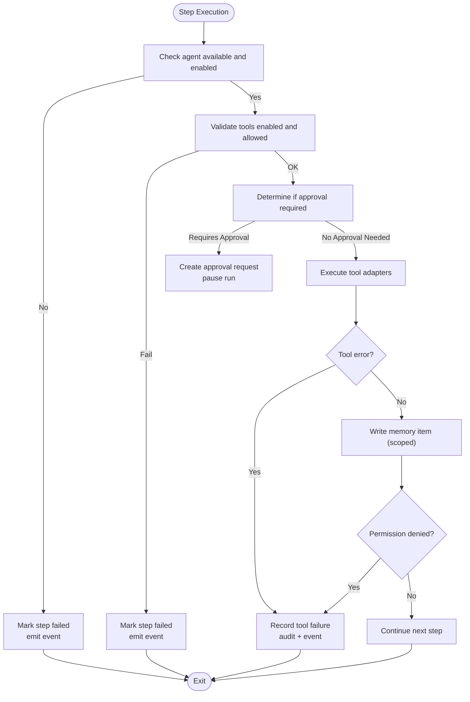
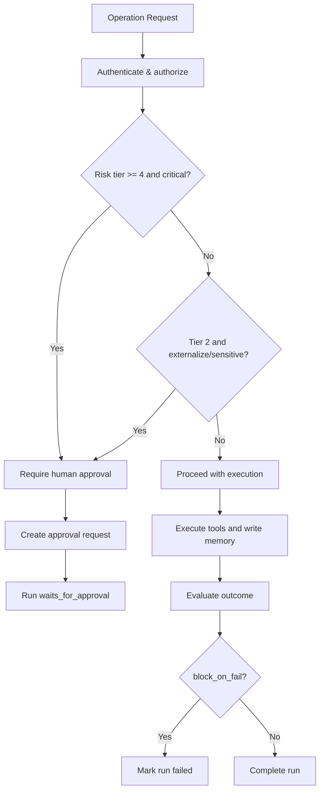
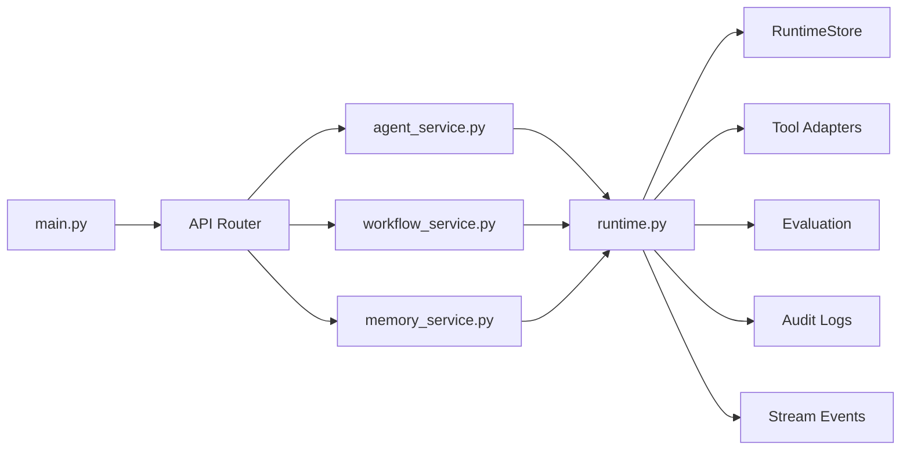

# Component Interactions

<cite>
**Referenced Files in This Document**
- [main.py](file://backend/app/main.py)
- [runtime.py](file://backend/app/runtime.py)
- [agent_service.py](file://backend/app/services/agent_service.py)
- [workflow_service.py](file://backend/app/services/workflow_service.py)
- [memory_service.py](file://backend/app/services/memory_service.py)
</cite>

## Table of Contents
1. Introduction
2. Project Structure
3. Core Components
4. Architecture Overview
5. Detailed Component Analysis
6. Dependency Analysis
7. Performance Considerations
8. Troubleshooting Guide
9. Conclusion

## Introduction
This document explains how the core components of the Generic Swarm Ops system interact to execute workflows, manage agents and tools, persist memory, and enforce governance controls. It focuses on request/response patterns, event-driven communication, state management across components, lifecycle management, error propagation, and failure handling strategies. The documentation is grounded in the backend implementation and highlights where each component participates in end-to-end flows.

## Project Structure
At a high level:
- HTTP entrypoint registers middleware, CORS, error handlers, and API routers.
- Services layer exposes domain operations (agents, workflows, memory).
- Runtime orchestrates execution, persistence, governance checks, approvals, tool invocation, memory writes, evaluations, and events.
- Infrastructure adapters are invoked by runtime for side-effecting tool calls.

**Diagram sources**
- [main.py:1-52](file://backend/app/main.py#L1-L52)
- [agent_service.py:1-30](file://backend/app/services/agent_service.py#L1-L30)
- [workflow_service.py:1-38](file://backend/app/services/workflow_service.py#L1-L38)
- [memory_service.py:1-27](file://backend/app/services/memory_service.py#L1-L27)
- [runtime.py:258-393](file://backend/app/runtime.py#L258-L393)

**Section sources**
- [main.py:1-52](file://backend/app/main.py#L1-L52)

## Core Components
- Agent Registry: CRUD and status management for agents; enforces activation preconditions via governance.
- Workflow Engine: Lifecycle of workflow definitions and runs; dispatches queued runs; executes steps with governance gates.
- Memory System: Scoped read/write access control; hybrid scopes (organization_memory, workflow_memory); provenance tracking.
- Tool Adapters: Side-effecting tool invocations with effect logging and audit trails.
- Governance Controls: Role-based permissions, risk tiers, human approval gates, production DNA validation, evaluation policies.

Key responsibilities and interactions:
- Services act as thin wrappers over Runtime methods, delegating authorization and persistence orchestration.
- Runtime maintains an in-process store backed by Postgres or JSON file, persists collections, emits events, and records audits.
- Tool execution is delegated to infrastructure adapters; failures propagate back to step/run state.
- Memory operations enforce agent scope allowlists and organization scoping.

**Section sources**
- [agent_service.py:1-30](file://backend/app/services/agent_service.py#L1-L30)
- [workflow_service.py:1-38](file://backend/app/services/workflow_service.py#L1-L38)
- [memory_service.py:1-27](file://backend/app/services/memory_service.py#L1-L27)
- [runtime.py:1308-1452](file://backend/app/runtime.py#L1308-L1452)
- [runtime.py:1454-1626](file://backend/app/runtime.py#L1454-L1626)
- [runtime.py:2339-2399](file://backend/app/runtime.py#L2339-L2399)

## Architecture Overview
The runtime is the central coordinator. It authenticates requests, validates permissions, manages workflow run state, invokes tool adapters, enforces governance gates, writes memory items, evaluates outcomes, and emits stream events.

**Diagram sources**
- [runtime.py:258-393](file://backend/app/runtime.py#L258-L393)
- [runtime.py:848-866](file://backend/app/runtime.py#L848-L866)
- [runtime.py:1660-1749](file://backend/app/runtime.py#L1660-L1749)
- [runtime.py:1938-2210](file://backend/app/runtime.py#L1938-L2210)
- [runtime.py:2211-2283](file://backend/app/runtime.py#L2211-L2283)
- [runtime.py:2339-2399](file://backend/app/runtime.py#L2339-L2399)

## Detailed Component Analysis

### Agent Registry
Responsibilities:
- List, get, create, update status, archive agents.
- Enforce activation prerequisites via governance (e.g., assurance case readiness).
- Provide activity and allowed tools per agent.

Interactions:
- Services delegate to Runtime for all agent operations.
- Activation may call into governance validators before updating status.

**Diagram sources**
- [agent_service.py:16-17](file://backend/app/services/agent_service.py#L16-L17)
- [runtime.py:1346-1372](file://backend/app/runtime.py#L1346-L1372)

**Section sources**
- [agent_service.py:1-30](file://backend/app/services/agent_service.py#L1-L30)
- [runtime.py:1308-1396](file://backend/app/runtime.py#L1308-L1396)

### Workflow Engine
Responsibilities:
- Manage workflow definitions, versions, activation, disable/archive.
- Start runs with input validation, idempotency, and risk-tier gating.
- Dispatch queued runs, execute steps, handle approvals, evaluate results, emit events.

Execution flow:
- start_workflow_run creates a run record and queues it.
- dispatch_queued_runs transitions runs to running and invokes _execute_run_body.
- _execute_run_body iterates steps, checks agent/tool availability, enforces governance gates, reads/writes memory, invokes tool adapters, records effects, updates step/run state, and emits events.

**Diagram sources**
- [workflow_service.py:1-38](file://backend/app/services/workflow_service.py#L1-L38)
- [runtime.py:1660-1749](file://backend/app/runtime.py#L1660-L1749)
- [runtime.py:1755-1767](file://backend/app/runtime.py#L1755-L1767)
- [runtime.py:1938-2210](file://backend/app/runtime.py#L1938-L2210)
- [runtime.py:2211-2283](file://backend/app/runtime.py#L2211-L2283)

**Section sources**
- [workflow_service.py:1-38](file://backend/app/services/workflow_service.py#L1-L38)
- [runtime.py:1454-1626](file://backend/app/runtime.py#L1454-L1626)
- [runtime.py:1660-1749](file://backend/app/runtime.py#L1660-L1749)
- [runtime.py:1755-1767](file://backend/app/runtime.py#L1755-L1767)
- [runtime.py:1938-2210](file://backend/app/runtime.py#L1938-L2210)

### Memory System
Responsibilities:
- Scoped memory items with organization scoping and role-based visibility.
- Read/write enforcement based on agent allowed scopes.
- Provenance metadata and sensitivity levels.

Operations:
- search/get/create/update/delete memory items.
- During workflow execution, runtime performs scoped reads and writes with permission checks.

**Diagram sources**
- [memory_service.py:1-27](file://backend/app/services/memory_service.py#L1-L27)
- [runtime.py:2339-2399](file://backend/app/runtime.py#L2339-L2399)
- [runtime.py:1901-1936](file://backend/app/runtime.py#L1901-L1936)

**Section sources**
- [memory_service.py:1-27](file://backend/app/services/memory_service.py#L1-L27)
- [runtime.py:2339-2399](file://backend/app/runtime.py#L2339-L2399)

### Tool Adapters
Responsibilities:
- Execute registered tools with side effects.
- Record tool effects and audit logs.
- Propagate errors back to step/run state.

Integration:
- Runtime invokes execute_tool for each tool declared in a step.
- Errors from adapters are caught and recorded as step failures.

**Diagram sources**
- [runtime.py:1938-2210](file://backend/app/runtime.py#L1938-L2210)

**Section sources**
- [runtime.py:1938-2210](file://backend/app/runtime.py#L1938-L2210)

### Governance Controls
Responsibilities:
- Role-based permissions and resource scoping.
- Risk-tier gating and human approval gates.
- Production DNA validation for workflow activation.
- Evaluation policy enforcement that can block completion.

Key behaviors:
- authenticate/assert_permission gate every operation.
- _tier_level maps risk tiers to numeric levels.
- _tool_requires_approval determines if a tool needs human review.
- _assert_production_dna_safe enforces structural rules when activating workflows.
- decide_approval resumes or terminates runs based on decisions.

**Diagram sources**
- [runtime.py:848-866](file://backend/app/runtime.py#L848-L866)
- [runtime.py:872-892](file://backend/app/runtime.py#L872-L892)
- [runtime.py:1469-1484](file://backend/app/runtime.py#L1469-L1484)
- [runtime.py:2004-2031](file://backend/app/runtime.py#L2004-L2031)
- [runtime.py:2249-2283](file://backend/app/runtime.py#L2249-L2283)
- [runtime.py:2187-2209](file://backend/app/runtime.py#L2187-L2209)

**Section sources**
- [runtime.py:848-866](file://backend/app/runtime.py#L848-L866)
- [runtime.py:1469-1484](file://backend/app/runtime.py#L1469-L1484)
- [runtime.py:2004-2031](file://backend/app/runtime.py#L2004-L2031)
- [runtime.py:2249-2283](file://backend/app/runtime.py#L2249-L2283)
- [runtime.py:2187-2209](file://backend/app/runtime.py#L2187-L2209)

## Dependency Analysis
- main.py wires FastAPI app, middleware, error handlers, and includes API router.
- Services depend on Runtime for business logic and persistence.
- Runtime depends on:
  - RuntimeStore for persistent collections (Postgres or JSON fallback).
  - Tool adapters for side effects.
  - Governance validators for agent activation and production DNA checks.
  - Self-improvement lessons library for injecting relevant lessons at step time.
  - Evaluation routines to assess outcomes.

**Diagram sources**
- [main.py:1-52](file://backend/app/main.py#L1-L52)
- [agent_service.py:1-30](file://backend/app/services/agent_service.py#L1-L30)
- [workflow_service.py:1-38](file://backend/app/services/workflow_service.py#L1-L38)
- [memory_service.py:1-27](file://backend/app/services/memory_service.py#L1-L27)
- [runtime.py:258-393](file://backend/app/runtime.py#L258-L393)

**Section sources**
- [main.py:1-52](file://backend/app/main.py#L1-L52)

## Performance Considerations
- Use Postgres-backed RuntimeStore for concurrent access and durability; JSON fallback is suitable for local/dev.
- Avoid unnecessary deep copies in hot paths; current design uses deepcopy for safe responses.
- Batch operations where possible (e.g., dispatch_queued_runs) to reduce repeated saves.
- Limit memory context retrieval size (top-k hits) to reduce payload sizes during execution.
- Emit lightweight events and rely on consumers for real-time UI updates.

[No sources needed since this section provides general guidance]

## Troubleshooting Guide
Common issues and diagnostics:
- Authentication failures: ensure bearer token or API key is valid and not revoked; check user status.
- Permission denied: verify role permissions and resource scoping; confirm organization_id alignment.
- Approval required: inspect approvals list and decide appropriately; rejections record lessons.
- Tool failures: examine tool_effects and audit logs for reasons; ensure tool is enabled and allowed for the agent.
- Memory scope denied: confirm agent.allowed_memory_scopes include the target scope.
- Run lifecycle: use pause/resume/retry/expire endpoints to manage stuck runs; monitor stream_events for progress.

Operational hooks:
- _append_audit records detailed actions with request correlation IDs.
- _emit_event publishes structured events for observability.
- Error classes provide consistent status codes and error codes for clients.

**Section sources**
- [runtime.py:848-866](file://backend/app/runtime.py#L848-L866)
- [runtime.py:1869-1893](file://backend/app/runtime.py#L1869-L1893)
- [runtime.py:1938-2210](file://backend/app/runtime.py#L1938-L2210)
- [runtime.py:2249-2283](file://backend/app/runtime.py#L2249-L2283)

## Conclusion
The Generic Swarm Ops system centers around a cohesive Runtime that coordinates agents, workflows, memory, tools, and governance. Services expose clean APIs while enforcing security and compliance. Event-driven signals and comprehensive audit trails support observability and troubleshooting. The design balances safety (approvals, DNA validation, evaluation blocking) with operational flexibility (pause/resume/retry/expire), enabling reliable automation with strong governance.