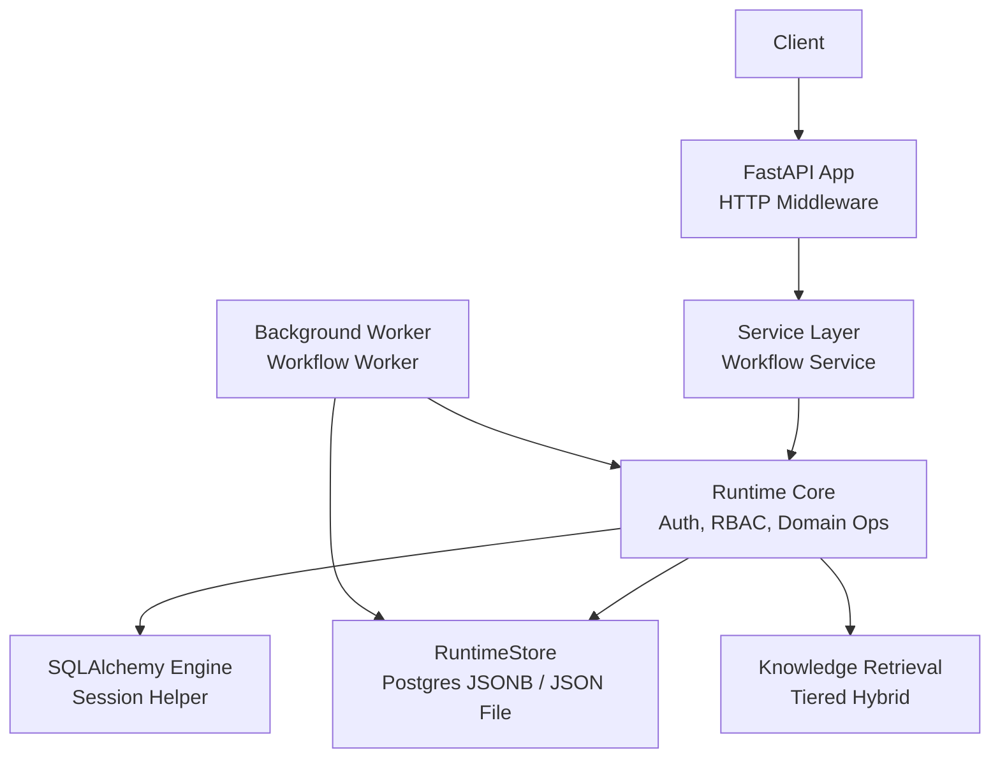
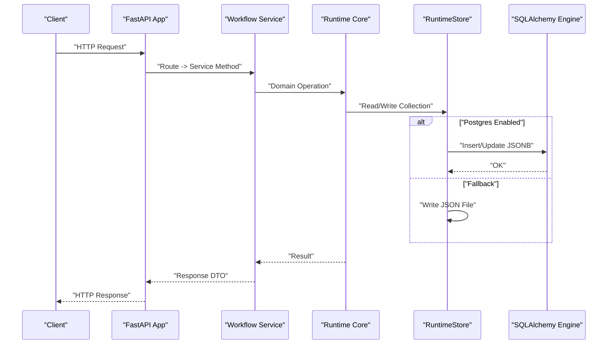
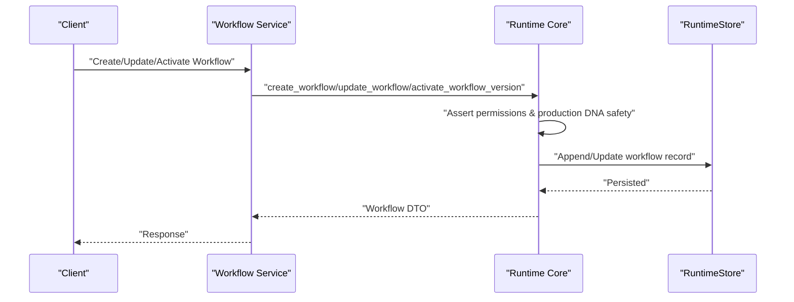
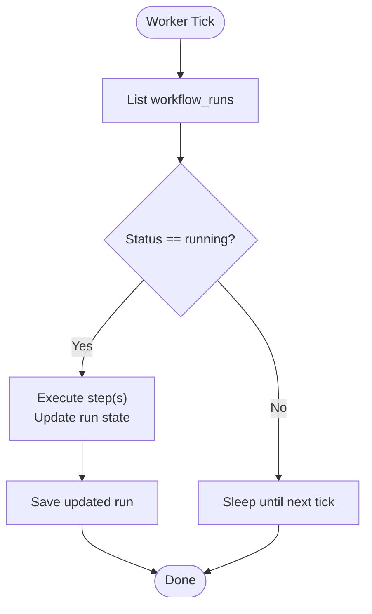
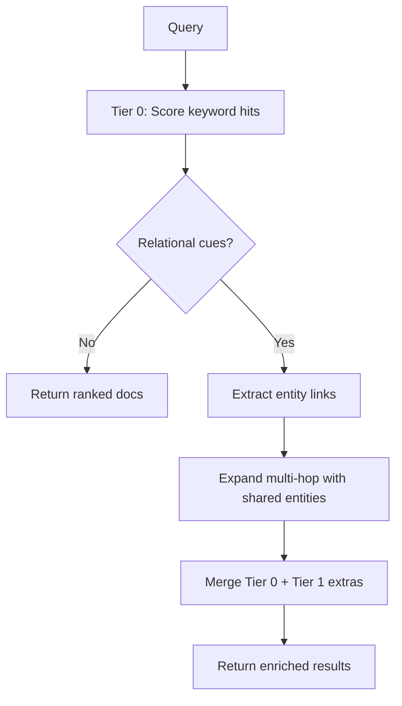
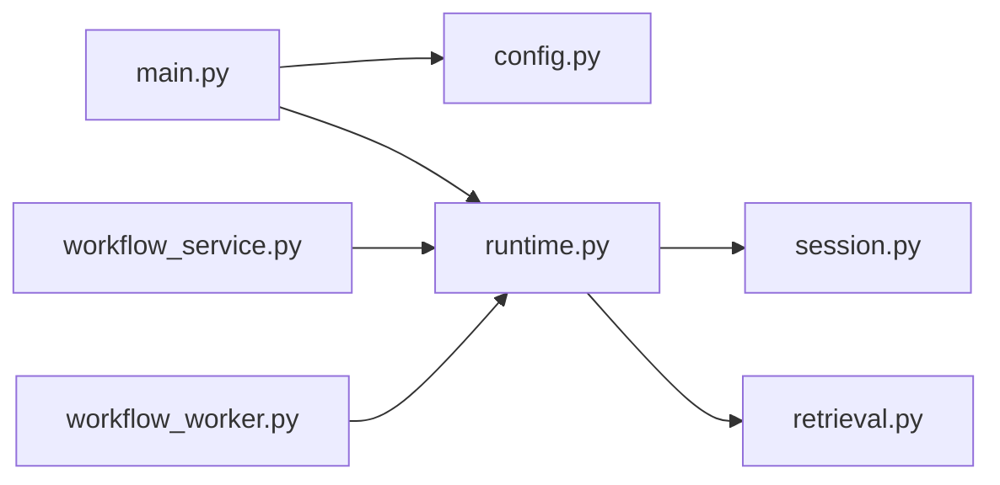

# Data Flow Design

<cite>
**Referenced Files in This Document**
- [main.py](file://backend/app/main.py)
- [runtime.py](file://backend/app/runtime.py)
- [config.py](file://backend/app/core/config.py)
- [session.py](file://backend/app/infrastructure/database/session.py)
- [workflow_service.py](file://backend/app/services/workflow_service.py)
- [workflow_worker.py](file://backend/app/workers/workflow_worker.py)
- [retrieval.py](file://backend/app/infrastructure/knowledge/retrieval.py)
</cite>

## Table of Contents
1. [Introduction](#introduction)
2. [Project Structure](#project-structure)
3. [Core Components](#core-components)
4. [Architecture Overview](#architecture-overview)
5. [Detailed Component Analysis](#detailed-component-analysis)
6. [Dependency Analysis](#dependency-analysis)
7. [Performance Considerations](#performance-considerations)
8. [Troubleshooting Guide](#troubleshooting-guide)
9. [Conclusion](#conclusion)

## Introduction
This document describes the data flow design across the Generic Swarm Ops system, focusing on how user requests, workflow execution, event processing, and knowledge retrieval move through the platform. It explains transformation pipelines, persistence strategies, consistency models, validation and serialization formats, and performance optimizations used throughout the pipeline. The goal is to provide a clear mental model for both new and experienced users.

## Project Structure
At runtime, the HTTP server exposes APIs that route into service methods which delegate to a central Runtime layer. The Runtime layer orchestrates authentication, authorization, domain operations, audit logging, and persistence via a dual backend: Postgres (JSONB) with a JSON file fallback. Knowledge retrieval uses a tiered hybrid approach combining keyword search and lightweight entity-link expansion.

**Diagram sources**
- [main.py:16-52](file://backend/app/main.py#L16-L52)
- [workflow_service.py:1-38](file://backend/app/services/workflow_service.py#L1-L38)
- [runtime.py:258-384](file://backend/app/runtime.py#L258-L384)
- [session.py:10-33](file://backend/app/infrastructure/database/session.py#L10-L33)
- [retrieval.py:1-134](file://backend/app/infrastructure/knowledge/retrieval.py#L1-L134)
- [workflow_worker.py:1-10](file://backend/app/workers/workflow_worker.py#L1-L10)

**Section sources**
- [main.py:16-52](file://backend/app/main.py#L16-L52)
- [config.py:37-84](file://backend/app/core/config.py#L37-L84)
- [session.py:10-33](file://backend/app/infrastructure/database/session.py#L10-L33)

## Core Components
- HTTP Server and Middleware: FastAPI app with CORS, request context propagation, metrics recording, security headers, and cache control.
- Configuration: Centralized settings loaded from environment variables, including database URL normalization and feature toggles.
- Persistence: RuntimeStore abstracts storage behind a unified interface, preferring Postgres JSONB when configured, falling back to a local JSON file.
- Services: Thin service layer delegating to Runtime for business logic.
- Workers: Background tasks scanning persistent state for work items.
- Knowledge Retrieval: Tiered hybrid retrieval with keyword scoring and entity-link expansion.

Key responsibilities and interactions are detailed in subsequent sections.

**Section sources**
- [main.py:16-52](file://backend/app/main.py#L16-L52)
- [config.py:37-84](file://backend/app/core/config.py#L37-L84)
- [runtime.py:258-384](file://backend/app/runtime.py#L258-L384)
- [workflow_service.py:1-38](file://backend/app/services/workflow_service.py#L1-L38)
- [workflow_worker.py:1-10](file://backend/app/workers/workflow_worker.py#L1-L10)
- [retrieval.py:1-134](file://backend/app/infrastructure/knowledge/retrieval.py#L1-L134)

## Architecture Overview
The system follows a layered architecture:
- Presentation: FastAPI endpoints (not shown here) call services.
- Application: Services orchestrate calls to Runtime.
- Domain: Runtime enforces authz, permissions, and domain rules; it also manages seeds and migrations.
- Infrastructure: Storage abstraction (Postgres or JSON), DB session helpers, and retrieval utilities.

**Diagram sources**
- [main.py:16-52](file://backend/app/main.py#L16-L52)
- [workflow_service.py:1-38](file://backend/app/services/workflow_service.py#L1-L38)
- [runtime.py:258-384](file://backend/app/runtime.py#L258-L384)
- [session.py:10-33](file://backend/app/infrastructure/database/session.py#L10-L33)

## Detailed Component Analysis

### HTTP Ingress and Request Context
- Adds CORS middleware and registers error handlers.
- Per-request middleware:
  - Generates or propagates X-Request-ID.
  - Records metrics and structured logs.
  - Sets security and cache-control headers.
  - Injects request ID into runtime context.

Data transformations:
- Input: HTTP request headers/body.
- Output: Normalized response with security headers and traceability.

Consistency:
- No direct persistence in this layer; delegates to services and runtime.

**Section sources**
- [main.py:16-52](file://backend/app/main.py#L16-L52)

### Configuration and Database Selection
- Loads .env if present.
- Normalizes DATABASE_URL to a synchronous driver for RuntimeStore.
- Determines whether to use Postgres or force JSON file store.

Impact on data flow:
- Controls persistence backend selection at startup and during writes.

**Section sources**
- [config.py:23-34](file://backend/app/core/config.py#L23-L34)
- [config.py:74-84](file://backend/app/core/config.py#L74-L84)

### Persistence Abstraction: RuntimeStore
Responsibilities:
- Load/save state to Postgres JSONB or JSON file.
- Ensure schema and migrate seed data once.
- Provide collection accessors with thread-safe locking.
- Sanitize legacy product names in-place to maintain stable identities.

Persistence strategy:
- Prefer Postgres when configured and reachable; always keep a JSON snapshot as backup/migration source.
- Upsert single-row JSONB payload keyed by id=1.

Serialization format:
- JSON for both Postgres JSONB and file-based storage.

Consistency model:
- Single-process RLock ensures atomicity within process.
- Cross-process consistency relies on Postgres ACID when enabled; otherwise, JSON file is single-node.

Error handling:
- Graceful fallback to JSON if Postgres is unavailable.

**Section sources**
- [runtime.py:258-384](file://backend/app/runtime.py#L258-L384)
- [session.py:10-33](file://backend/app/infrastructure/database/session.py#L10-L33)

### Authentication, Authorization, and Audit
- Token issuance and refresh against stored tokens and API keys.
- Role-based permission checks using ROLE_PERMISSIONS map.
- Memory scope enforcement per agent configuration.
- Audit trail appended for key actions and persisted atomically.

Security considerations:
- Password hashing with PBKDF2 and migration path for legacy hashes.
- Strict token validation and account status checks.

**Section sources**
- [runtime.py:848-976](file://backend/app/runtime.py#L848-L976)
- [runtime.py:1051-1053](file://backend/app/runtime.py#L1051-L1053)
- [runtime.py:903-936](file://backend/app/runtime.py#L903-L936)

### Workflow Lifecycle Data Flow
Services expose CRUD and versioning operations that delegate to Runtime. Runtime validates production DNA before activation and persists changes.

Validation and transformation:
- Enforce required fields, schemas, and governance policies.
- Normalize versions and steps; mark active version immutable upon activation.

Consistency:
- Atomic save after mutation; Postgres ACID when enabled.

**Section sources**
- [workflow_service.py:1-38](file://backend/app/services/workflow_service.py#L1-L38)
- [runtime.py:1485-1599](file://backend/app/runtime.py#L1485-L1599)

### Background Workflow Execution Pipeline
Workers periodically scan persistent state for runs in progress and coordinate next steps.

Data transformations:
- Read raw run records, mutate step statuses and timestamps, persist updates.

Consistency:
- Uses RuntimeStore collections; safe under lock.

**Section sources**
- [workflow_worker.py:1-10](file://backend/app/workers/workflow_worker.py#L1-L10)
- [runtime.py:868-871](file://backend/app/runtime.py#L868-L871)

### Knowledge Retrieval Pipeline
Tiered hybrid retrieval:
- Tier 0: Keyword scoring over title/content with mandatory provenance.
- Escalation to Tier 1: If query contains relational cues, expand results by shared entity links.
- Entity extraction: Lightweight regex-based mention detection for workflows, policies, agents, documents, and risk tiers.

Serialization:
- Results include metadata such as scores, hop level, and linked_from references.

**Section sources**
- [retrieval.py:71-86](file://backend/app/infrastructure/knowledge/retrieval.py#L71-L86)
- [retrieval.py:39-68](file://backend/app/infrastructure/knowledge/retrieval.py#L39-L68)
- [retrieval.py:95-134](file://backend/app/infrastructure/knowledge/retrieval.py#L95-L134)

## Dependency Analysis
High-level dependencies among core modules:

**Diagram sources**
- [main.py:16-52](file://backend/app/main.py#L16-L52)
- [config.py:37-84](file://backend/app/core/config.py#L37-L84)
- [workflow_service.py:1-38](file://backend/app/services/workflow_service.py#L1-L38)
- [workflow_worker.py:1-10](file://backend/app/workers/workflow_worker.py#L1-L10)
- [runtime.py:258-384](file://backend/app/runtime.py#L258-L384)
- [session.py:10-33](file://backend/app/infrastructure/database/session.py#L10-L33)
- [retrieval.py:1-134](file://backend/app/infrastructure/knowledge/retrieval.py#L1-L134)

**Section sources**
- [main.py:16-52](file://backend/app/main.py#L16-L52)
- [workflow_service.py:1-38](file://backend/app/services/workflow_service.py#L1-L38)
- [workflow_worker.py:1-10](file://backend/app/workers/workflow_worker.py#L1-L10)
- [runtime.py:258-384](file://backend/app/runtime.py#L258-L384)
- [session.py:10-33](file://backend/app/infrastructure/database/session.py#L10-L33)
- [retrieval.py:1-134](file://backend/app/infrastructure/knowledge/retrieval.py#L1-L134)

## Performance Considerations
- Request tracing and metrics:
  - Per-request duration and status recorded via metrics_store.
  - Structured logging includes request ID, method, path, status, latency, and client IP.
- Persistence:
  - Postgres JSONB upsert avoids full table scans; single-row design simplifies locking.
  - JSON file fallback provides offline capability but lacks concurrency guarantees.
- Retrieval:
  - Tier 0 uses simple term overlap scoring; efficient for small-to-medium corpora.
  - Tier 1 expansion limited by max_extra to bound cost.
- Security headers and no-store caching reduce unnecessary browser caching overhead.

[No sources needed since this section provides general guidance]

## Troubleshooting Guide
Common issues and diagnostics:
- Authentication failures:
  - Invalid or missing bearer token; check token presence and validity.
  - Disabled or invited accounts blocked at login.
- Permission denied:
  - Missing role permission or memory scope not allowed for the agent.
- Validation errors:
  - Unknown roles, invalid statuses, or missing required fields.
- Persistence problems:
  - Postgres unreachable triggers JSON fallback; verify DATABASE_URL and pool settings.
  - Use database_status helper to inspect backend mode and reachability.

Operational tips:
- Inspect audit logs for failed operations and reasons.
- Confirm production DNA validation passes before activating workflows.

**Section sources**
- [runtime.py:848-976](file://backend/app/runtime.py#L848-L976)
- [runtime.py:1051-1053](file://backend/app/runtime.py#L1051-L1053)
- [runtime.py:903-936](file://backend/app/runtime.py#L903-L936)
- [session.py:36-63](file://backend/app/infrastructure/database/session.py#L36-L63)

## Conclusion
Generic Swarm Ops implements a clean, layered data flow with a robust persistence abstraction and tiered knowledge retrieval. The Runtime layer centralizes authentication, authorization, domain rules, and audit trails, while the HTTP layer focuses on cross-cutting concerns like tracing and security headers. With Postgres-backed JSONB as the primary store and a reliable JSON fallback, the system balances durability and portability. The tiered retrieval strategy offers scalable search with optional relational expansion, keeping performance predictable.