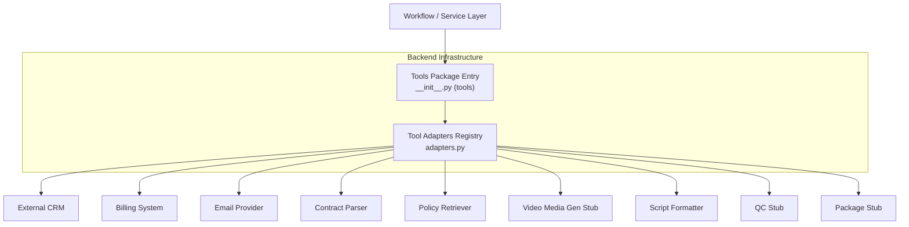
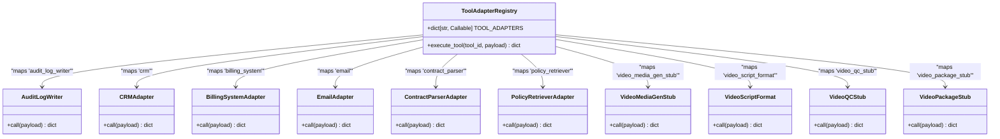
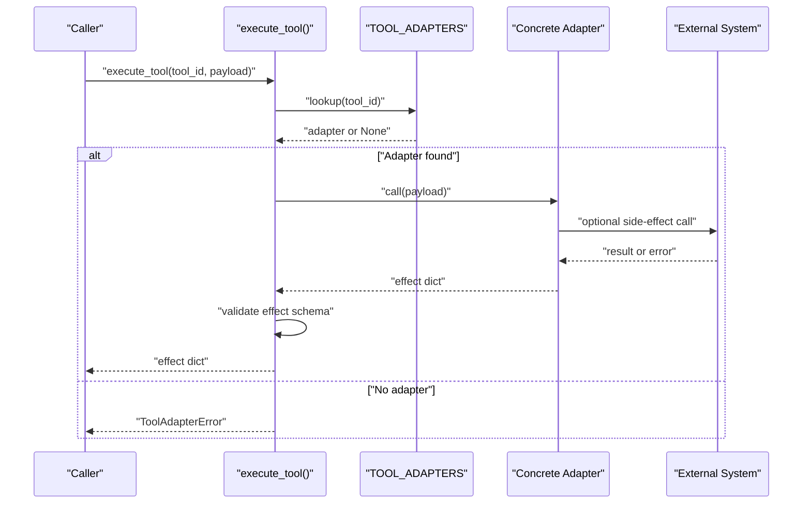
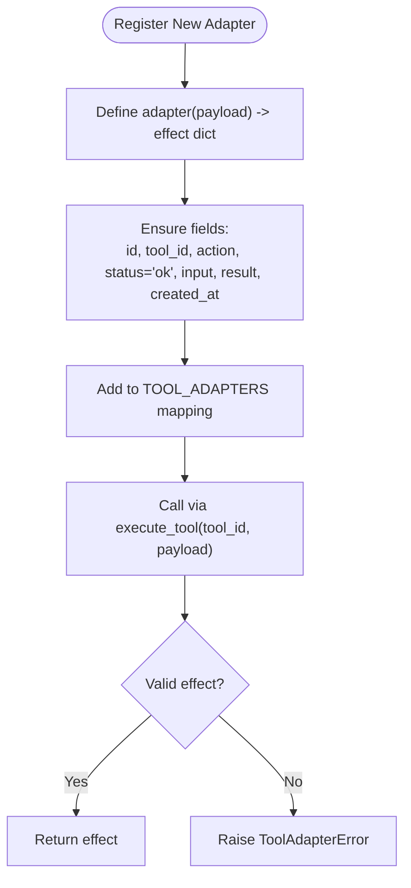
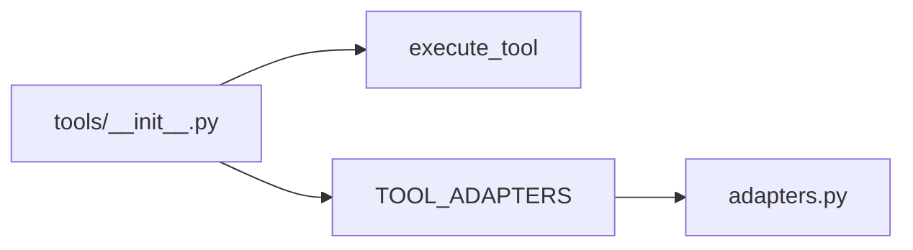

# Integration Patterns

<cite>
**Referenced Files in This Document**
- [adapters.py](file://backend/app/infrastructure/tools/adapters.py)
- [__init__.py (tools)](file://backend/app/infrastructure/tools/__init__.py)
</cite>

## Table of Contents
1. [Introduction](#introduction)
2. [Project Structure](#project-structure)
3. [Core Components](#core-components)
4. [Architecture Overview](#architecture-overview)
5. [Detailed Component Analysis](#detailed-component-analysis)
6. [Dependency Analysis](#dependency-analysis)
7. [Performance Considerations](#performance-considerations)
8. [Troubleshooting Guide](#troubleshooting-guide)
9. [Conclusion](#conclusion)
10. [Appendices](#appendices)

## Introduction
This document explains the integration patterns used by the Generic Swarm Ops system to connect with external services, databases, vector stores, and third-party systems. It focuses on:
- Tool Adapter Pattern for external service integration
- Strategy Pattern for pluggable backends
- Observer Pattern for event streaming
- Factory Pattern for dynamic instantiation
It also covers error handling, retry mechanisms, and circuit breaker patterns to ensure resilient integrations.

## Project Structure
The integration surface is centered around a tool adapter registry that maps tool identifiers to callable adapters. The runtime invokes these adapters through a single entry point, which enforces consistent effect payloads and auditability.

**Diagram sources**
- [adapters.py:1-177](file://backend/app/infrastructure/tools/adapters.py#L1-L177)
- [__init__.py (tools):1-4](file://backend/app/infrastructure/tools/__init__.py#L1-L4)

**Section sources**
- [adapters.py:1-177](file://backend/app/infrastructure/tools/adapters.py#L1-L177)
- [__init__.py (tools):1-4](file://backend/app/infrastructure/tools/__init__.py#L1-L4)

## Core Components
- Tool Adapter Registry: A mapping from tool IDs to functions that accept a payload and return a standardized effect record.
- Unified Effect Record: Each adapter returns a dict containing fields such as id, tool_id, action, status, input, result, and created_at.
- Execution Entry Point: A function that resolves an adapter by ID, invokes it, validates the returned effect, and raises a typed error on failure.
- Package Re-export: The tools package exposes execute_tool and the registry for consumers.

Key responsibilities:
- Decouple business logic from external implementations
- Enforce consistent output contracts for downstream processing and auditing
- Provide a clear extension point for new integrations

**Section sources**
- [adapters.py:14-27](file://backend/app/infrastructure/tools/adapters.py#L14-L27)
- [adapters.py:143-154](file://backend/app/infrastructure/tools/adapters.py#L143-L154)
- [adapters.py:164-176](file://backend/app/infrastructure/tools/adapters.py#L164-L176)
- [__init__.py (tools):1-4](file://backend/app/infrastructure/tools/__init__.py#L1-L4)

## Architecture Overview
The system uses a registry-based strategy pattern where each tool ID selects a concrete implementation at runtime. The factory-like behavior is provided by the registry lookup and execution wrapper.

**Diagram sources**
- [adapters.py:143-154](file://backend/app/infrastructure/tools/adapters.py#L143-L154)
- [adapters.py:164-176](file://backend/app/infrastructure/tools/adapters.py#L164-L176)

## Detailed Component Analysis

### Tool Adapter Pattern
Adapters encapsulate side effects and translate domain payloads into durable effect records. Each adapter:
- Accepts a payload dict
- Produces a normalized effect dict with id, tool_id, action, status, input, result, created_at
- Can raise a typed ToolAdapterError to signal failures

Examples include audit logging, CRM creation, billing activation, email queuing, contract parsing, policy retrieval, and video pipeline stubs.

**Diagram sources**
- [adapters.py:164-176](file://backend/app/infrastructure/tools/adapters.py#L164-L176)
- [adapters.py:143-154](file://backend/app/infrastructure/tools/adapters.py#L143-L154)

**Section sources**
- [adapters.py:14-27](file://backend/app/infrastructure/tools/adapters.py#L14-L27)
- [adapters.py:143-154](file://backend/app/infrastructure/tools/adapters.py#L143-L154)
- [adapters.py:164-176](file://backend/app/infrastructure/tools/adapters.py#L164-L176)

### Strategy Pattern for Pluggable Backends
The registry acts as a strategy selector:
- New strategies are added by registering a new tool ID and its callable
- Existing callers remain unchanged when swapping implementations
- Validation ensures all strategies conform to the effect contract

Best practices:
- Keep adapters stateless and idempotent where possible
- Use environment-driven configuration to switch between providers
- Maintain backward compatibility by preserving tool IDs across versions

**Section sources**
- [adapters.py:143-154](file://backend/app/infrastructure/tools/adapters.py#L143-L154)
- [adapters.py:164-176](file://backend/app/infrastructure/tools/adapters.py#L164-L176)

### Observer Pattern for Event Streaming
While not implemented in the examined files, the effect record structure naturally supports an observer model:
- Downstream consumers can subscribe to effect events
- Each effect includes metadata (tool_id, action, created_at) suitable for event streams
- Observers can persist, index, or forward effects to analytics or alerting systems

Implementation guidance:
- Publish effects to a message bus after validation
- Ensure ordering per run_id/step_id if needed
- Use idempotency keys to avoid duplicate processing

[No sources needed since this section provides conceptual guidance]

### Factory Pattern for Dynamic Instantiation
The registry lookup plus execute_tool forms a lightweight factory:
- Resolves a strategy by key
- Invokes it with validated inputs
- Normalizes outputs and errors

To extend:
- Add a new function implementing the adapter contract
- Register it under a unique tool_id in the registry
- Optionally wrap with decorators for retries/circuit breakers

**Section sources**
- [adapters.py:164-176](file://backend/app/infrastructure/tools/adapters.py#L164-L176)
- [adapters.py:143-154](file://backend/app/infrastructure/tools/adapters.py#L143-L154)

### Custom Adapter Implementation Example
Steps to implement a custom adapter:
- Define a function that accepts a payload dict and returns a normalized effect dict
- Include required fields: id, tool_id, action, status, input, result, created_at
- Raise ToolAdapterError for expected failures
- Register the function under a stable tool_id in the registry

Validation flow enforced by execute_tool:
- Ensures the returned object is a dict
- Checks status equals "ok"
- Requires an id field

**Diagram sources**
- [adapters.py:164-176](file://backend/app/infrastructure/tools/adapters.py#L164-L176)
- [adapters.py:143-154](file://backend/app/infrastructure/tools/adapters.py#L143-L154)

**Section sources**
- [adapters.py:14-27](file://backend/app/infrastructure/tools/adapters.py#L14-L27)
- [adapters.py:164-176](file://backend/app/infrastructure/tools/adapters.py#L164-L176)

### Integration Best Practices
- Idempotency: Design adapters to be safe to retry; use deterministic ids when possible
- Timezone-aware timestamps: Use UTC consistently
- Input normalization: Coerce optional fields to defaults inside adapters
- Output validation: Rely on execute_tool’s checks to enforce contracts
- Separation of concerns: Keep adapters focused on one external concern
- Configuration over code: Prefer environment variables for endpoints, credentials, and feature flags

[No sources needed since this section provides general guidance]

## Dependency Analysis
The tools package re-exports the execution entry point and the registry, enabling other modules to depend on a minimal interface while keeping adapter details encapsulated.

**Diagram sources**
- [__init__.py (tools):1-4](file://backend/app/infrastructure/tools/__init__.py#L1-L4)
- [adapters.py:143-154](file://backend/app/infrastructure/tools/adapters.py#L143-L154)

**Section sources**
- [__init__.py (tools):1-4](file://backend/app/infrastructure/tools/__init__.py#L1-L4)
- [adapters.py:143-154](file://backend/app/infrastructure/tools/adapters.py#L143-L154)

## Performance Considerations
- Keep adapters synchronous unless you explicitly manage async I/O elsewhere
- Avoid heavy computation inside adapters; delegate to background workers if needed
- Cache read-only lookups (e.g., policies) behind a local cache layer
- Batch operations where supported by external APIs
- Monitor latency and error rates per tool_id using metrics emitted alongside effects

[No sources needed since this section provides general guidance]

## Troubleshooting Guide
Common issues and resolutions:
- Unknown tool_id: execute_tool raises a typed error indicating no adapter is registered. Verify registration in the registry.
- Invalid effect shape: If the adapter does not return a dict with status "ok" and an id, execute_tool raises a typed error. Inspect the adapter’s return path.
- Unexpected exceptions: Any exception inside an adapter is wrapped into a typed error. Log the original cause and fix the adapter logic.

Operational tips:
- Instrument adapters to log inputs and outputs (sanitized)
- Add health checks for external dependencies
- Use structured logs correlated with effect.id

**Section sources**
- [adapters.py:164-176](file://backend/app/infrastructure/tools/adapters.py#L164-L176)

## Conclusion
Generic Swarm Ops leverages a registry-based tool adapter pattern to integrate with diverse external systems in a consistent, auditable way. The approach supports strategy selection, simple factory-style invocation, and a natural foundation for observer-based event streaming. By adhering to the effect contract and best practices, teams can add new integrations safely and maintain resilience through proper error handling, retries, and circuit breaking.

[No sources needed since this section summarizes without analyzing specific files]

## Appendices

### Error Handling, Retry, and Circuit Breaker Guidance
- Error handling: Wrap external calls in try/except and raise ToolAdapterError with context. Let execute_tool normalize failures.
- Retry mechanism: Implement exponential backoff with jitter outside the adapter or via a decorator around the adapter call.
- Circuit breaker: Open the circuit after consecutive failures, short-circuit calls, and allow periodic probes to recover.
- Idempotency: Use stable ids and deduplication keys to prevent duplicate side effects during retries.

[No sources needed since this section provides general guidance]